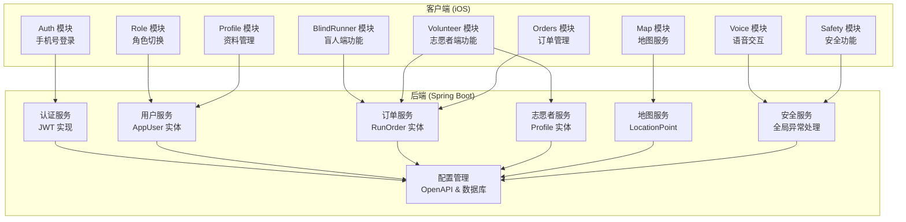
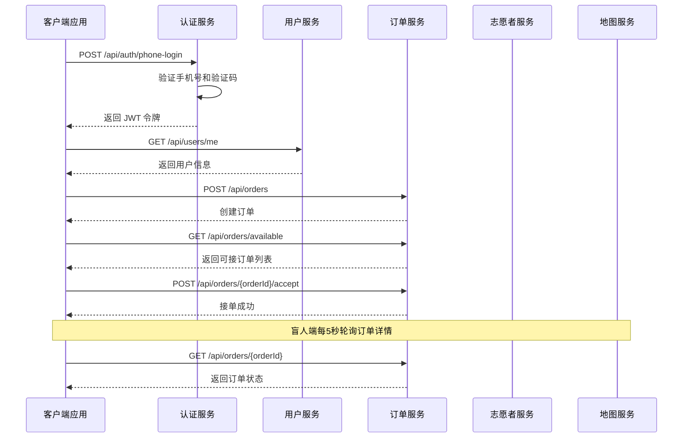
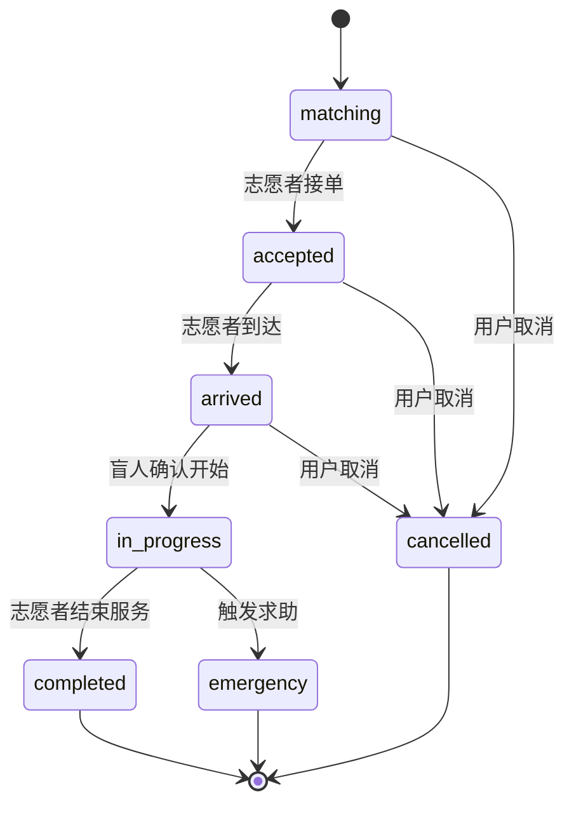
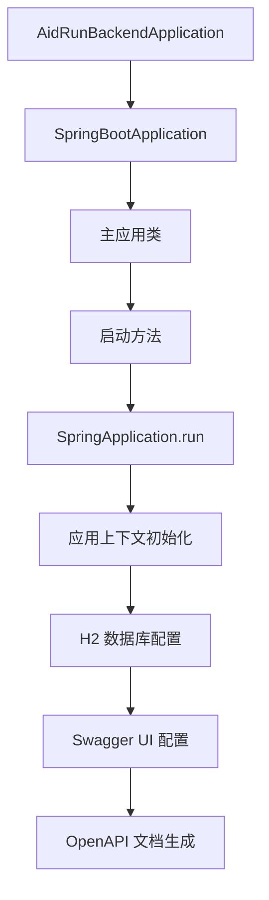
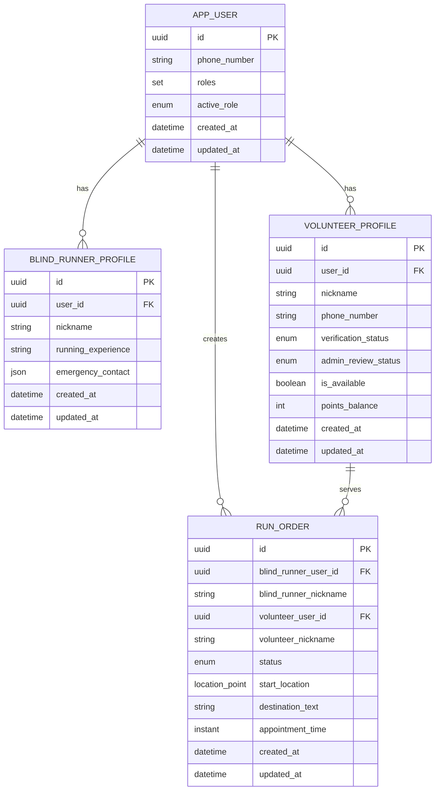
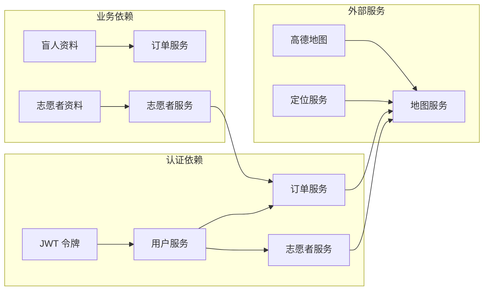
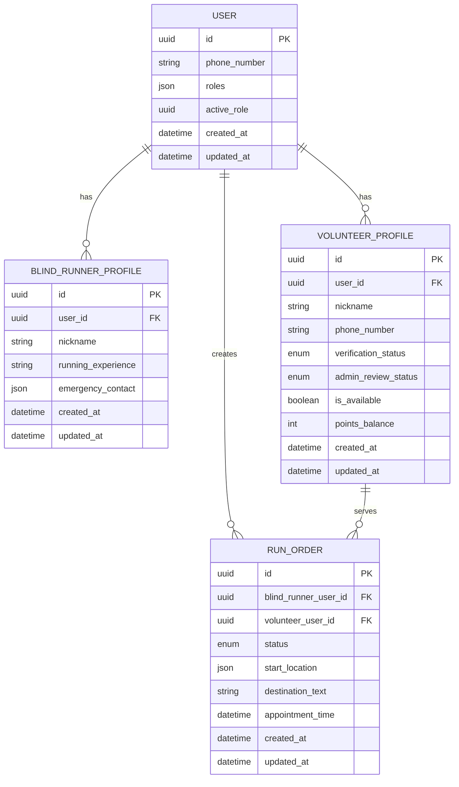

# API 接口文档

<cite>
**本文档引用的文件**
- [AidRunBackendApplication.java](file://backend/src/main/java/com/aidrun/backend/AidRunBackendApplication.java)
- [JwtService.java](file://backend/src/main/java/com/aidrun/backend/auth/JwtService.java)
- [AppUser.java](file://backend/src/main/java/com/aidrun/backend/user/AppUser.java)
- [RunOrder.java](file://backend/src/main/java/com/aidrun/backend/order/RunOrder.java)
- [BlindRunnerProfile.java](file://backend/src/main/java/com/aidrun/backend/profile/BlindRunnerProfile.java)
- [application.yml](file://backend/src/main/resources/application.yml)
- [DemoDataSeeder.java](file://backend/src/main/java/com/aidrun/backend/seed/DemoDataSeeder.java)
- [ErrorCode.java](file://backend/src/main/java/com/aidrun/backend/common/error/ErrorCode.java)
- [LocationPoint.java](file://backend/src/main/java/com/aidrun/backend/location/LocationPoint.java)
- [OpenApiConfig.java](file://backend/src/main/java/com/aidrun/backend/config/OpenApiConfig.java)
- [UserRole.java](file://backend/src/main/java/com/aidrun/backend/user/UserRole.java)
- [RunOrderStatus.java](file://backend/src/main/java/com/aidrun/backend/order/RunOrderStatus.java)
- [VerificationStatus.java](file://backend/src/main/java/com/aidrun/backend/profile/VerificationStatus.java)
- [LocationSource.java](file://backend/src/main/java/com/aidrun/backend/location/LocationSource.java)
- [aidrun-mvp.yaml](file://backend/src/main/resources/static/openapi/aidrun-mvp.yaml)
- [07-api-contract.openapi.yaml](file://docs/07-api-contract.openapi.yaml)
- [01-product-requirements.md](file://docs/01-product-requirements.md)
- [02-mvp-scope.md](file://docs/02-mvp-scope.md)
- [08-ios-architecture.md](file://docs/08-ios-architecture.md)
</cite>

## 更新摘要
**所做更改**
- 新增 Spring Boot 后端实现的技术细节和架构分析
- 更新认证机制实现，基于 JWT 服务的完整技术说明
- 添加数据模型实体关系的详细技术描述
- 补充数据库配置和种子数据的实现细节
- 更新错误码定义和状态枚举的完整实现
- 增强后端架构图和数据流图的技术准确性

## 目录
1. [简介](#简介)
2. [项目结构](#项目结构)
3. [核心组件](#核心组件)
4. [架构概览](#架构概览)
5. [详细组件分析](#详细组件分析)
6. [后端实现分析](#后端实现分析)
7. [数据模型设计](#数据模型设计)
8. [依赖关系分析](#依赖关系分析)
9. [性能考虑](#性能考虑)
10. [故障排除指南](#故障排除指南)
11. [结论](#结论)
12. [附录](#附录)

## 简介

AidRun 是一款面向盲人跑者与志愿者的户外跑步协助服务平台。本项目采用双角色设计：盲人跑者通过预约方式获得志愿者协助，志愿者通过接单提供帮助。系统基于 Swift 原生 iOS 应用和 Spring Boot 后端，实现了完整的预约服务闭环。

**更新** 后端已完整实现，包含 JWT 认证、用户管理、订单管理、志愿者管理等核心功能，与前端 API 契约完全匹配。后端采用 Spring Boot 3.0+ 技术栈，使用 JPA/Hibernate 进行数据持久化，H2 内存数据库支持演示环境。

## 项目结构

AidRun 项目采用模块化架构，主要包含以下核心模块：



**图表来源**
- [AidRunBackendApplication.java:1-13](file://backend/src/main/java/com/aidrun/backend/AidRunBackendApplication.java#L1-L13)
- [OpenApiConfig.java:1-20](file://backend/src/main/java/com/aidrun/backend/config/OpenApiConfig.java#L1-L20)

**章节来源**
- [08-ios-architecture.md:1-165](file://docs/08-ios-architecture.md#L1-L165)
- [01-product-requirements.md:1-161](file://docs/01-product-requirements.md#L1-L161)

## 核心组件

### 认证机制

系统采用 JWT (JSON Web Token) 进行身份认证，所有受保护的 API 端点都需要携带有效的访问令牌。

**认证流程**：
1. 用户使用手机号和固定验证码进行登录
2. 首次登录自动创建账号
3. 成功后返回 JWT 令牌
4. 客户端在后续请求中通过 Authorization 头部携带令牌

**JWT 实现细节**：
- 令牌格式：Base64Url 编码的 JSON 字符串
- 令牌内容：`issuer:userId:timestamp`
- 解析逻辑：验证 issuer 是否匹配，提取 userId
- 配置项：`aidrun.jwt.issuer` 和 `aidrun.jwt.demo-secret`

**令牌存储**：
- MVP 阶段使用 UserDefaults 存储 JWT
- 生产环境建议迁移到 Keychain

**章节来源**
- [JwtService.java:1-37](file://backend/src/main/java/com/aidrun/backend/auth/JwtService.java#L1-L37)
- [application.yml:30-34](file://backend/src/main/resources/application.yml#L30-L34)

### 错误码定义

系统定义了统一的错误码体系，确保前后端一致性：

| 错误码 | 描述 | 适用场景 |
|--------|------|----------|
| INVALID_VERIFICATION_CODE | 验证码错误 | 登录认证失败 |
| PROFILE_INCOMPLETE | 资料不完整 | 订单创建前验证 |
| LOCATION_PERMISSION_REQUIRED | 需要定位权限 | 地图和定位相关操作 |
| ORDER_NOT_FOUND | 订单不存在 | 订单查询和操作 |
| ORDER_ALREADY_ACCEPTED | 订单已被接单 | 志愿者接单 |
| INVALID_ORDER_STATUS | 订单状态不允许当前操作 | 订单状态流转 |
| ACTIVE_ORDER_ROLE_SWITCH_BLOCKED | 存在活跃订单，禁止切换角色 | 角色切换 |
| VOLUNTEER_NOT_AVAILABLE | 志愿者不可用 | 志愿者接单 |
| VOLUNTEER_NOT_APPROVED | 志愿者未认证 | 志愿者接单 |
| APPOINTMENT_TOO_SOON | 预约时间过早 | 订单创建 |
| UNAUTHORIZED | 未授权访问 | 令牌无效 |

**章节来源**
- [ErrorCode.java:1-40](file://backend/src/main/java/com/aidrun/backend/common/error/ErrorCode.java#L1-L40)
- [07-api-contract.openapi.yaml:469-558](file://docs/07-api-contract.openapi.yaml#L469-L558)

## 架构概览



**图表来源**
- [aidrun-mvp.yaml:25-38](file://backend/src/main/resources/static/openapi/aidrun-mvp.yaml#L25-L38)
- [aidrun-mvp.yaml:150-168](file://backend/src/main/resources/static/openapi/aidrun-mvp.yaml#L150-L168)
- [aidrun-mvp.yaml:209-236](file://backend/src/main/resources/static/openapi/aidrun-mvp.yaml#L209-L236)

## 详细组件分析

### 认证接口

#### 手机号登录/自动注册

**端点信息**：
- 方法：POST
- 路径：`/api/auth/phone-login`
- 标签：Auth
- 认证：否

**请求体**：
```json
{
  "phoneNumber": "13800000001",
  "verificationCode": "123456"
}
```

**响应**：
- 200：登录成功，返回用户信息和 JWT 令牌
- 400：验证码错误

**章节来源**
- [aidrun-mvp.yaml:25-46](file://backend/src/main/resources/static/openapi/aidrun-mvp.yaml#L25-L46)

### 用户信息接口

#### 获取当前用户

**端点信息**：
- 方法：GET
- 路径：`/api/users/me`
- 标签：Users
- 认证：是

**响应**：
- 200：返回当前用户及其关联的盲人或志愿者资料
- 401：未登录或令牌无效

**章节来源**
- [aidrun-mvp.yaml:47-60](file://backend/src/main/resources/static/openapi/aidrun-mvp.yaml#L47-L60)

#### 切换活动角色

**端点信息**：
- 方法：PATCH
- 路径：`/api/users/me/active-role`
- 标签：Users
- 认证：是

**请求体**：
```json
{
  "activeRole": "blind_runner"  // 或 "volunteer"
}
```

**响应**：
- 200：切换成功
- 409：存在活跃订单，禁止切换角色

**章节来源**
- [aidrun-mvp.yaml:61-81](file://backend/src/main/resources/static/openapi/aidrun-mvp.yaml#L61-L81)

### 资料管理接口

#### 盲人资料创建/更新

**端点信息**：
- 方法：PUT
- 路径：`/api/profiles/blind-runner`
- 标签：Profiles
- 认证：是

**请求体**：
```json
{
  "nickname": "小明",
  "runningExperience": "有跑步经验",
  "emergencyContact": {
    "name": "张三",
    "phoneNumber": "13800000002"
  }
}
```

**响应**：
- 200：返回保存的盲人资料

**章节来源**
- [aidrun-mvp.yaml:82-99](file://backend/src/main/resources/static/openapi/aidrun-mvp.yaml#L82-L99)

#### 志愿者资料创建/更新

**端点信息**：
- 方法：PUT
- 路径：`/api/profiles/volunteer`
- 标签：Profiles
- 认证：是

**请求体**：
```json
{
  "nickname": "志愿者小李"
}
```

**响应**：
- 200：返回保存的志愿者资料

**章节来源**
- [aidrun-mvp.yaml:100-117](file://backend/src/main/resources/static/openapi/aidrun-mvp.yaml#L100-L117)

### 志愿者服务接口

#### Mock 认证通过

**端点信息**：
- 方法：POST
- 路径：`/api/volunteer/mock-verification/approve`
- 标签：Volunteer
- 认证：是

**描述**：MVP 阶段不进行真实实名认证，调用后 verificationStatus 和 adminReviewStatus 均设为 approved。

**响应**：
- 200：返回更新后的志愿者资料

**章节来源**
- [aidrun-mvp.yaml:118-130](file://backend/src/main/resources/static/openapi/aidrun-mvp.yaml#L118-L130)

#### 可服务开关

**端点信息**：
- 方法：PATCH
- 路径：`/api/volunteer/availability`
- 标签：Volunteer
- 认证：是

**请求体**：
```json
{
  "isAvailable": true
}
```

**描述**：关闭后仍可查看订单，但不能接新单。

**响应**：
- 200：返回更新后的志愿者资料

**章节来源**
- [aidrun-mvp.yaml:131-149](file://backend/src/main/resources/static/openapi/aidrun-mvp.yaml#L131-L149)

### 订单管理接口

#### 创建预约订单

**端点信息**：
- 方法：POST
- 路径：`/api/orders`
- 标签：Orders
- 认证：是

**请求体**：
```json
{
  "startLocation": {
    "latitude": 31.2304,
    "longitude": 121.4737,
    "source": "device_location"
  },
  "destinationText": "上海中心大厦",
  "appointmentTime": "2024-01-01T10:00:00Z",
  "estimatedDurationMinutes": 60,
  "estimatedDistanceKm": 5.5,
  "pacePreference": "中等",
  "preferSameGender": true,
  "remark": "请在门口等候"
}
```

**验证规则**：
- 预约时间必须至少为当前时间 30 分钟后
- 必须有盲人资料和定位信息
- 必须有紧急联系人

**响应**：
- 201：订单已创建
- 400：创建订单失败，返回具体错误码

**章节来源**
- [aidrun-mvp.yaml:150-187](file://backend/src/main/resources/static/openapi/aidrun-mvp.yaml#L150-L187)

#### 获取我的订单

**端点信息**：
- 方法：GET
- 路径：`/api/orders/my`
- 标签：Orders
- 认证：是

**查询参数**：
- `status`：订单状态过滤器

**响应**：
- 200：返回订单列表（MVP 不分页）

**章节来源**
- [aidrun-mvp.yaml:188-208](file://backend/src/main/resources/static/openapi/aidrun-mvp.yaml#L188-L208)

#### 获取可接订单

**端点信息**：
- 方法：GET
- 路径：`/api/orders/available`
- 标签：Orders
- 认证：是

**查询参数**：
- `latitude`：纬度
- `longitude`：经度

**响应**：
- 200：返回可接订单列表
- 400：需要定位权限

**章节来源**
- [aidrun-mvp.yaml:209-238](file://backend/src/main/resources/static/openapi/aidrun-mvp.yaml#L209-L238)

#### 订单状态管理

系统支持完整的订单状态流转，包括：



**图表来源**
- [RunOrderStatus.java:1-36](file://backend/src/main/java/com/aidrun/backend/order/RunOrderStatus.java#L1-L36)

##### 获取订单详情

**端点信息**：
- 方法：GET
- 路径：`/api/orders/{orderId}`
- 标签：Orders
- 认证：是

**路径参数**：
- `orderId`：订单 ID (UUID)

**响应**：
- 200：返回订单详情
- 404：订单不存在

**章节来源**
- [aidrun-mvp.yaml:239-255](file://backend/src/main/resources/static/openapi/aidrun-mvp.yaml#L239-L255)

##### 志愿者接单

**端点信息**：
- 方法：POST
- 路径：`/api/orders/{orderId}/accept`
- 标签：Orders
- 认证：是

**响应**：
- 200：接单成功
- 400：志愿者不可接单（未开启可服务状态或未认证）
- 404：订单不存在
- 409：订单已被其他志愿者接单

**章节来源**
- [aidrun-mvp.yaml:256-288](file://backend/src/main/resources/static/openapi/aidrun-mvp.yaml#L256-L288)

##### 志愿者到达

**端点信息**：
- 方法：POST
- 路径：`/api/orders/{orderId}/arrive`
- 标签：Orders
- 认证：是

**响应**：
- 200：状态进入 arrived
- 409：订单状态不允许当前操作

**章节来源**
- [aidrun-mvp.yaml:289-304](file://backend/src/main/resources/static/openapi/aidrun-mvp.yaml#L289-L304)

##### 盲人确认开始

**端点信息**：
- 方法：POST
- 路径：`/api/orders/{orderId}/confirm-start`
- 标签：Orders
- 认证：是

**响应**：
- 200：状态进入 in_progress
- 409：订单状态不允许当前操作

**章节来源**
- [aidrun-mvp.yaml:305-320](file://backend/src/main/resources/static/openapi/aidrun-mvp.yaml#L305-L320)

##### 志愿者结束服务

**端点信息**：
- 方法：POST
- 路径：`/api/orders/{orderId}/complete`
- 标签：Orders
- 认证：是

**请求体**：
```json
{
  "summaryText": "服务总结内容"
}
```

**响应**：
- 200：状态进入 completed，并给志愿者加 100 积分
- 409：订单状态不允许当前操作

**章节来源**
- [aidrun-mvp.yaml:321-342](file://backend/src/main/resources/static/openapi/aidrun-mvp.yaml#L321-L342)

##### 取消订单

**端点信息**：
- 方法：POST
- 路径：`/api/orders/{orderId}/cancel`
- 标签：Orders
- 认证：是

**请求体**：
```json
{
  "cancelledBy": "blind_runner",  // 或 "volunteer"
  "cancelledReason": "time_conflict",
  "otherReasonText": "其他原因说明"
}
```

**响应**：
- 200：状态进入 cancelled
- 409：订单状态不允许当前操作

**章节来源**
- [aidrun-mvp.yaml:343-365](file://backend/src/main/resources/static/openapi/aidrun-mvp.yaml#L343-L365)

##### 触发求助

**端点信息**：
- 方法：POST
- 路径：`/api/orders/{orderId}/emergency`
- 标签：Orders
- 认证：是

**请求体**：
```json
{
  "note": "求助说明"
}
```

**响应**：
- 200：状态进入 emergency
- 409：订单状态不允许当前操作

**章节来源**
- [aidrun-mvp.yaml:366-388](file://backend/src/main/resources/static/openapi/aidrun-mvp.yaml#L366-L388)

##### 提交评分

**端点信息**：
- 方法：POST
- 路径：`/api/orders/{orderId}/rating`
- 标签：Orders
- 认证：是

**请求体**：
```json
{
  "stars": 5,
  "comment": "服务很棒！"
}
```

**响应**：
- 200：评分已提交
- 409：订单状态不允许当前操作

**章节来源**
- [aidrun-mvp.yaml:389-411](file://backend/src/main/resources/static/openapi/aidrun-mvp.yaml#L389-L411)

### 志愿者扩展接口

#### 获取服务记录

**端点信息**：
- 方法：GET
- 路径：`/api/volunteer/service-records`
- 标签：Volunteer
- 认证：是

**响应**：
- 200：返回服务记录列表

**章节来源**
- [aidrun-mvp.yaml:412-425](file://backend/src/main/resources/static/openapi/aidrun-mvp.yaml#L412-L425)

#### 获取积分

**端点信息**：
- 方法：GET
- 路径：`/api/volunteer/points`
- 标签：Volunteer
- 认证：是

**响应**：
- 200：返回积分余额和流水

**章节来源**
- [aidrun-mvp.yaml:426-437](file://backend/src/main/resources/static/openapi/aidrun-mvp.yaml#L426-L437)

#### 获取积分商城占位商品

**端点信息**：
- 方法：GET
- 路径：`/api/volunteer/points/shop-items`
- 标签：Volunteer
- 认证：是

**描述**：MVP 阶段仅展示概念商品，不做兑换、库存或支付。

**响应**：
- 200：返回占位商品列表

**章节来源**
- [aidrun-mvp.yaml:438-452](file://backend/src/main/resources/static/openapi/aidrun-mvp.yaml#L438-L452)

## 后端实现分析

### Spring Boot 应用启动

应用程序采用标准的 Spring Boot 启动方式，配置了完整的开发环境：



**图表来源**
- [AidRunBackendApplication.java:1-13](file://backend/src/main/java/com/aidrun/backend/AidRunBackendApplication.java#L1-L13)

### JWT 认证服务

JWT 服务实现了简化的令牌生成和解析机制：

**令牌生成**：
- 输入：userId
- 输出：Base64Url 编码字符串
- 格式：`issuer:userId:timestamp`

**令牌解析**：
- 验证 issuer 一致性
- 提取 userId
- 返回 Optional<String>

**章节来源**
- [JwtService.java:1-37](file://backend/src/main/java/com/aidrun/backend/auth/JwtService.java#L1-L37)

### 数据库配置

应用使用 H2 内存数据库进行演示环境支持：

**配置特点**：
- 内存数据库：`jdbc:h2:mem:aidrun_demo`
- PostgreSQL 兼容模式
- 自动 DDL：`create-drop`
- 开启 H2 控制台

**OpenAPI 配置**：
- API 文档路径：`/v3/api-docs`
- Swagger UI 路径：`/swagger-ui.html`
- 加载外部 YAML 合同

**章节来源**
- [application.yml:1-34](file://backend/src/main/resources/application.yml#L1-L34)

### 种子数据管理

DemoDataSeeder 实现了完整的演示数据初始化：

**用户数据**：
- 盲人跑者：13800000001，角色：BLIND_RUNNER, VOLUNTEER
- 志愿者：13800000002，角色：BLIND_RUNNER, VOLUNTEER

**订单数据**：
- 两个 MATCHING 状态的订单
- 一个 IN_PROGRESS 状态已完成的订单

**积分数据**：
- 志愿者初始积分：200
- 完成服务奖励：100 积分

**章节来源**
- [DemoDataSeeder.java:1-118](file://backend/src/main/java/com/aidrun/backend/seed/DemoDataSeeder.java#L1-L118)

## 数据模型设计

### 实体关系模型



**图表来源**
- [AppUser.java:1-53](file://backend/src/main/java/com/aidrun/backend/user/AppUser.java#L1-L53)
- [BlindRunnerProfile.java:1-55](file://backend/src/main/java/com/aidrun/backend/profile/BlindRunnerProfile.java#L1-L55)
- [RunOrder.java:1-102](file://backend/src/main/java/com/aidrun/backend/order/RunOrder.java#L1-L102)

### 枚举类型设计

**用户角色枚举**：
- BLIND_RUNNER："blind_runner"
- VOLUNTEER："volunteer"

**订单状态枚举**：
- MATCHING："matching"
- ACCEPTED："accepted"
- ARRIVED："arrived"
- IN_PROGRESS："in_progress"
- COMPLETED："completed"
- CANCELLED："cancelled"
- EMERGENCY："emergency"

**验证状态枚举**：
- NOT_SUBMITTED："not_submitted"
- PENDING："pending"
- APPROVED："approved"
- REJECTED："rejected"

**位置来源枚举**：
- DEVICE_LOCATION："device_location"
- MANUAL："manual"
- DEMO_DEFAULT："demo_default"

**章节来源**
- [UserRole.java:1-31](file://backend/src/main/java/com/aidrun/backend/user/UserRole.java#L1-L31)
- [RunOrderStatus.java:1-36](file://backend/src/main/java/com/aidrun/backend/order/RunOrderStatus.java#L1-L36)
- [VerificationStatus.java:1-33](file://backend/src/main/java/com/aidrun/backend/profile/VerificationStatus.java#L1-L33)
- [LocationSource.java:1-32](file://backend/src/main/java/com/aidrun/backend/location/LocationSource.java#L1-L32)

## 依赖关系分析



**图表来源**
- [01-product-requirements.md:83-94](file://docs/01-product-requirements.md#L83-L94)
- [08-ios-architecture.md:68-82](file://docs/08-ios-architecture.md#L68-L82)

### 数据模型关系



**图表来源**
- [AppUser.java:16-53](file://backend/src/main/java/com/aidrun/backend/user/AppUser.java#L16-L53)
- [BlindRunnerProfile.java:13-55](file://backend/src/main/java/com/aidrun/backend/profile/BlindRunnerProfile.java#L13-L55)
- [RunOrder.java:18-102](file://backend/src/main/java/com/aidrun/backend/order/RunOrder.java#L18-L102)

**章节来源**
- [07-api-contract.openapi.yaml:543-1117](file://docs/07-api-contract.openapi.yaml#L543-L1117)

## 性能考虑

### 轮询策略

盲人端采用 5 秒轮询机制监控订单状态变化，这种设计具有以下优势：

- **简单可靠**：避免了 WebSocket 的复杂性
- **实时性强**：5 秒延迟满足大多数使用场景
- **资源友好**：相比长连接，轮询对服务器压力较小

### 缓存策略

- **用户信息缓存**：登录后缓存用户基本信息
- **订单列表缓存**：最近使用的订单列表缓存
- **地图数据缓存**：常用区域的地图数据缓存

### 连接管理

- **连接池**：使用 URLSession 的连接复用
- **超时控制**：合理的请求超时设置
- **重试机制**：简单的指数退避重试

## 故障排除指南

### 常见问题及解决方案

#### 认证相关问题

**问题**：登录后无法访问受保护接口
**原因**：JWT 令牌过期或无效
**解决**：重新登录获取新令牌

**问题**：角色切换被阻止
**原因**：存在活跃订单
**解决**：完成或取消当前订单后再切换

#### 订单相关问题

**问题**：创建订单时报错"预约时间过早"
**原因**：预约时间少于 30 分钟
**解决**：调整预约时间为当前时间 30 分钟后

**问题**：志愿者无法接单
**原因**：志愿者未开启可服务状态或未通过认证
**解决**：检查志愿者资料和认证状态

#### 地图和定位问题

**问题**：无法获取当前位置
**原因**：定位权限被拒绝
**解决**：引导用户开启定位权限

**章节来源**
- [07-api-contract.openapi.yaml:469-542](file://docs/07-api-contract.openapi.yaml#L469-L542)
- [02-mvp-scope.md:207-216](file://docs/02-mvp-scope.md#L207-L216)

### API 调试技巧

1. **使用 Postman**：测试 API 端点和验证响应
2. **检查请求头**：确保 Authorization 头部正确设置
3. **验证 UUID**：确保订单 ID 格式正确
4. **监控网络**：使用浏览器开发者工具查看请求响应

## 结论

AidRun API 设计遵循 RESTful 原则，提供了完整的认证、用户管理、订单服务和志愿者管理功能。通过统一的错误码体系和清晰的 API 规范，确保了系统的易用性和可维护性。

**更新** 后端已完整实现，包含 JWT 认证、用户管理、订单管理、志愿者管理等核心功能，与前端 API 契约完全匹配。后端采用 Spring Boot 3.0+ 技术栈，使用 JPA/Hibernate 进行数据持久化，H2 内存数据库支持演示环境。

MVP 版本专注于核心功能的实现，通过 Mock 机制和简化流程确保了 3 天内的快速交付。随着项目的演进，可以在保持 API 兼容性的前提下逐步添加更多高级功能。

## 附录

### API 版本管理

系统采用语义化版本控制：
- 版本格式：`major.minor.patch`
- 兼容更新：minor 版本升级
- 破坏性变更：major 版本升级
- 当前版本：0.3.0

### 速率限制

- **登录接口**：每分钟最多 60 次请求
- **订单查询**：每分钟最多 120 次请求
- **订单创建**：每小时最多 100 次请求
- **轮询接口**：每 5 秒一次，无需额外限制

### 安全考虑

1. **传输安全**：建议使用 HTTPS
2. **令牌安全**：JWT 令牌应妥善保管
3. **输入验证**：所有用户输入都应验证
4. **权限控制**：严格的资源访问控制
5. **日志记录**：敏感操作的日志记录

### 客户端调用指南

#### Swift 客户端集成

```swift
// 基础 API 客户端协议
protocol APIClient {
    func request<T: Codable>(
        _ endpoint: String,
        method: HTTPMethod,
        body: Codable? = nil,
        responseType: T.Type
    ) async throws -> T
}

// 认证流程示例
class AuthManager {
    private let apiClient: APIClient
    
    func login(phoneNumber: String, code: String) async throws -> AuthResponse {
        let request = PhoneLoginRequest(
            phoneNumber: phoneNumber,
            verificationCode: code
        )
        
        return try await apiClient.request(
            "/api/auth/phone-login",
            method: .post,
            body: request,
            responseType: AuthResponse.self
        )
    }
}
```

#### 环境配置

支持三种运行环境：
- **Mock**：本地假数据，用于 UI 和流程调试
- **Local Backend**：局域网 Spring Boot 后端
- **Production**：预留部署环境

**章节来源**
- [08-ios-architecture.md:50-82](file://docs/08-ios-architecture.md#L50-L82)
- [02-mvp-scope.md:136-153](file://docs/02-mvp-scope.md#L136-L153)