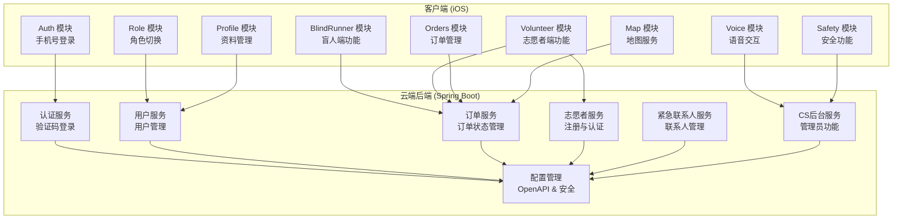
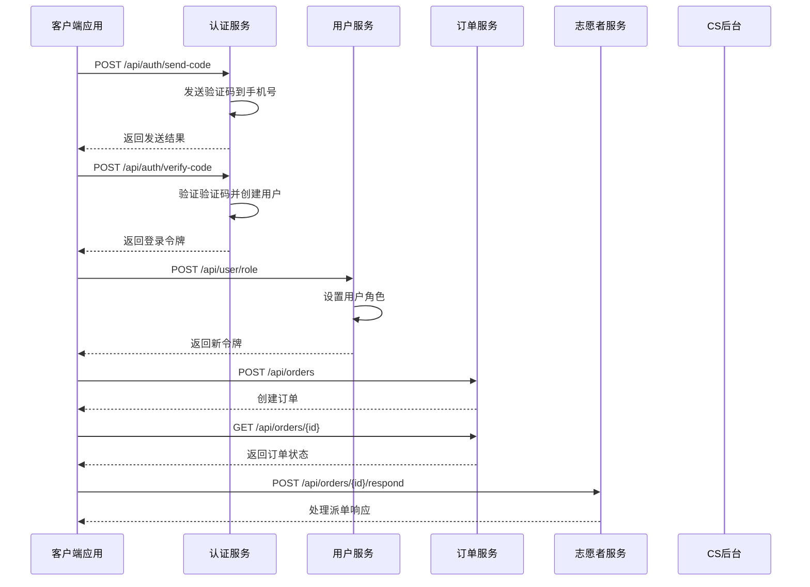
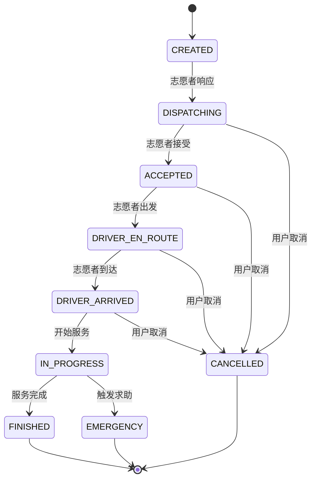
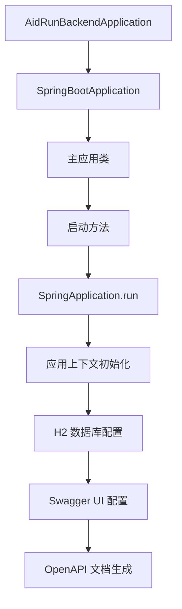
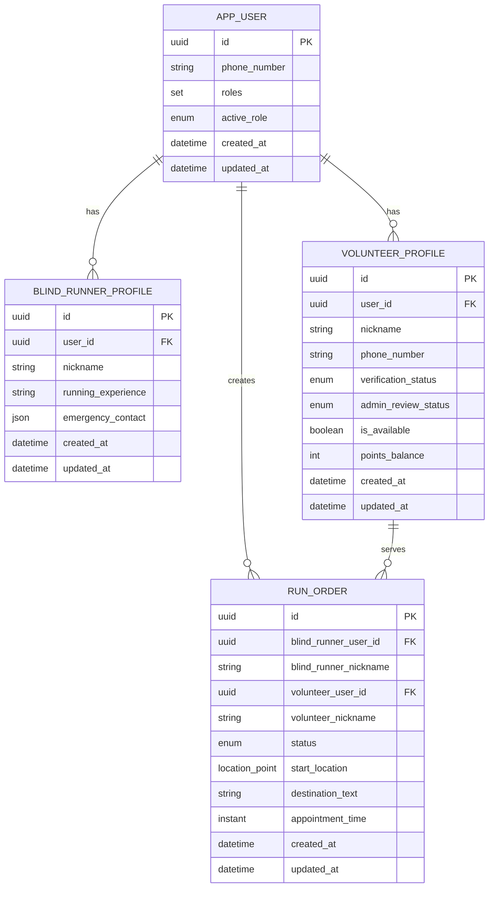
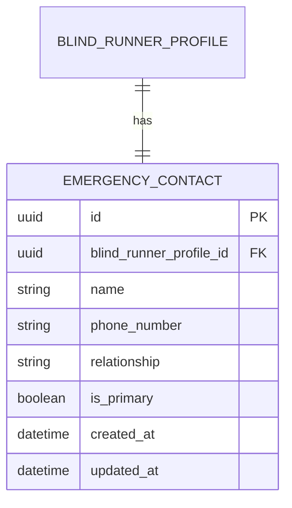
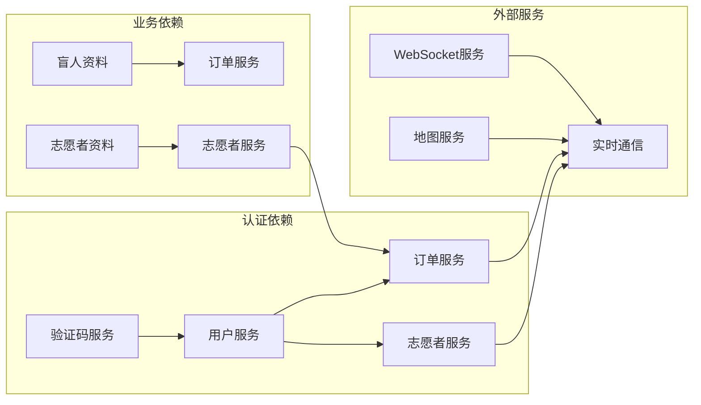
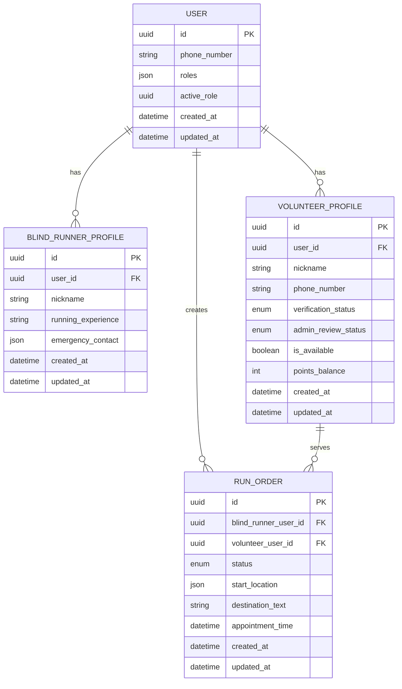

# API 接口文档

<cite>
**本文档引用的文件**
- [api_spec.yaml](file://docs/api_spec.yaml)
- [07-api-contract.openapi.yaml](file://docs/07-api-contract.openapi.yaml)
- [test-accounts.md](file://docs/test-accounts.md)
- [application.yml](file://backend/src/main/resources/application.yml)
- [AuthController.java](file://backend/src/main/java/com/aidrun/backend/auth/AuthController.java)
- [RunOrderController.java](file://backend/src/main/java/com/aidrun/backend/order/RunOrderController.java)
- [ProfileController.java](file://backend/src/main/java/com/aidrun/backend/profile/ProfileController.java)
- [aidrun-mvp.yaml](file://backend/src/main/resources/static/openapi/aidrun-mvp.yaml)
</cite>

## 更新摘要
**所做更改**
- 新增云端后端API规范文档，替代本地MVP版本
- 移除本地后端特定的MVP API合同引用
- 更新认证流程为基于验证码的手机号登录
- 新增完整的订单状态管理端点
- 增加紧急联系人管理、志愿者注册、CS后台管理等新功能
- 更新测试账号和对接指南，指向云端后端
- 移除过时的MVP端点引用，如 `/api/auth/phone-login`、`/api/orders/my` 等

## 目录
1. [简介](#简介)
2. [项目结构](#项目结构)
3. [核心组件](#核心组件)
4. [架构概览](#架构概览)
5. [详细组件分析](#详细组件分析)
6. [后端实现分析](#后端实现分析)
7. [数据模型设计](#数据模型设计)
8. [依赖关系分析](#依赖关系分析)
9. [性能考虑](#性能考虑)
10. [故障排除指南](#故障排除指南)
11. [结论](#结论)
12. [附录](#附录)

## 简介

AidRun 是一款面向盲人跑者与志愿者的户外跑步协助服务平台。本项目采用双角色设计：盲人跑者通过预约方式获得志愿者协助，志愿者通过接单提供帮助。系统基于 Swift 原生 iOS 应用和云端 Spring Boot 后端，实现了完整的预约服务闭环。

**重要更新** 项目已迁移至云端后端，采用全新的 API 规范文档 (`docs/api_spec.yaml`)，替代了原有的本地MVP版本。云端后端提供更完整的功能覆盖，包括紧急联系人管理、志愿者注册流程、CS后台管理、完整的订单状态流转等核心功能。

云端后端采用 Spring Boot 3.0+ 技术栈，使用 JPA/Hibernate 进行数据持久化，支持 OpenAPI 3.1.0 规范，涵盖所有后端端点、数据模型、请求/响应格式和错误处理。

## 项目结构

AidRun 项目采用模块化架构，主要包含以下核心模块：



**图表来源**
- [application.yml:1-34](file://backend/src/main/resources/application.yml#L1-L34)

**章节来源**
- [test-accounts.md:1-14](file://docs/test-accounts.md#L1-L14)

## 核心组件

### 认证机制

系统采用基于验证码的手机号登录机制，所有受保护的 API 端点都需要携带有效的访问令牌。

**认证流程**：
1. 发送验证码到指定手机号
2. 使用验证码进行登录
3. 成功后返回 JWT 令牌
4. 客户端在后续请求中通过 Authorization 头部携带令牌

**验证码机制**：
- 支持固定测试验证码 `123456` 用于 MVP 测试
- 生产环境使用真实短信验证码
- 验证码有效期为 5 分钟

**令牌存储**：
- 建议使用 Keychain 存储 JWT 令牌
- 支持自动刷新机制

**章节来源**
- [test-accounts.md:72-135](file://docs/test-accounts.md#L72-L135)

### 错误码定义

系统定义了统一的错误码体系，确保前后端一致性：

| 错误码 | 描述 | 适用场景 |
|--------|------|----------|
| INVALID_PHONE_NUMBER | 手机号格式错误 | 用户注册/登录 |
| INVALID_VERIFICATION_CODE | 验证码错误或过期 | 验证码登录 |
| USER_NOT_FOUND | 用户不存在 | 用户操作 |
| ROLE_NOT_SET | 用户未设置角色 | 角色相关操作 |
| ORDER_NOT_FOUND | 订单不存在 | 订单操作 |
| ORDER_STATUS_INVALID | 订单状态不允许当前操作 | 订单状态流转 |
| EMERGENCY_CONTACT_EXISTS | 紧急联系人已存在 | 联系人管理 |
| VOLUNTEER_NOT_REGISTERED | 志愿者未完成注册 | 志愿者相关操作 |
| TRAINING_NOT_COMPLETED | 培训未完成 | 志愿者接单 |
| CS_AUTH_FAILED | CS管理员认证失败 | CS后台管理 |

**章节来源**
- [api_spec.yaml:1-18](file://docs/07-api-contract.openapi.yaml#L1-L18)

## 架构概览



**图表来源**
- [test-accounts.md:72-135](file://docs/test-accounts.md#L72-L135)
- [api_spec.yaml:634-651](file://docs/api_spec.yaml#L634-L651)

## 详细组件分析

### 认证接口

#### 发送验证码

**端点信息**：
- 方法：POST
- 路径：`/api/auth/send-code`
- 标签：auth-controller
- 认证：否

**请求体**：
```json
{
  "phone": "13800000001"
}
```

**响应**：
- 200：验证码发送成功
- 400：手机号格式错误

**章节来源**
- [api_spec.yaml:954-971](file://docs/api_spec.yaml#L954-L971)

#### 验证码登录

**端点信息**：
- 方法：POST
- 路径：`/api/auth/verify-code`
- 标签：auth-controller
- 认证：否

**请求体**：
```json
{
  "phone": "13800000001",
  "code": "123456"
}
```

**响应**：
- 200：登录成功，返回用户信息和 JWT 令牌
- 400：验证码错误或过期

**章节来源**
- [api_spec.yaml:936-953](file://docs/api_spec.yaml#L936-L953)

#### 设置用户角色

**端点信息**：
- 方法：POST
- 路径：`/api/user/role`
- 标签：role-controller
- 认证：是

**请求体**：
```json
{
  "role": "BLIND"  // 或 "VOLUNTEER"
}
```

**响应**：
- 200：角色设置成功，返回新令牌
- 400：角色设置失败

**章节来源**
- [api_spec.yaml:616-633](file://docs/api_spec.yaml#L616-L633)

### 用户信息接口

#### 获取用户信息

**端点信息**：
- 方法：GET
- 路径：`/api/users/{id}`
- 标签：user-controller
- 认证：是

**路径参数**：
- `id`：用户ID

**响应**：
- 200：返回用户信息
- 404：用户不存在

**章节来源**
- [api_spec.yaml:1111-1130](file://docs/api_spec.yaml#L1111-L1130)

#### 删除用户

**端点信息**：
- 方法：DELETE
- 路径：`/api/users/{id}`
- 标签：user-controller
- 认证：是

**路径参数**：
- `id`：用户ID

**响应**：
- 200：用户删除成功
- 404：用户不存在

**章节来源**
- [api_spec.yaml:1131-1149](file://docs/api_spec.yaml#L1131-L1149)

### 资料管理接口

#### 盲人用户资料

**端点信息**：
- 方法：GET/PUT
- 路径：`/api/blind/profile`
- 标签：盲人用户
- 认证：是

**响应**：
- 200：返回盲人资料
- 404：资料不存在

**章节来源**
- [api_spec.yaml:255-285](file://docs/api_spec.yaml#L255-L285)

#### 志愿者资料

**端点信息**：
- 方法：GET/PUT
- 路径：`/api/volunteer/profile`
- 标签：volunteer-controller
- 认证：是

**响应**：
- 200：返回志愿者资料
- 404：资料不存在

**章节来源**
- [api_spec.yaml:17-46](file://docs/api_spec.yaml#L17-L46)

### 订单管理接口

#### 创建预约订单

**端点信息**：
- 方法：POST
- 路径：`/api/orders`
- 标签：order-controller
- 认证：是

**请求体**：
```json
{
  "startLatitude": 39.9042,
  "startLongitude": 116.4074,
  "startAddress": "朝阳公园南门",
  "plannedStartTime": "2099-06-01T18:00:00",
  "plannedEndTime": "2099-06-01T19:00:00"
}
```

**响应**：
- 200：订单创建成功
- 400：订单创建失败

**章节来源**
- [api_spec.yaml:634-651](file://docs/api_spec.yaml#L634-L651)

#### 获取订单详情

**端点信息**：
- 方法：GET
- 路径：`/api/orders/{id}`
- 标签：order-controller
- 认证：是

**路径参数**：
- `id`：订单ID

**响应**：
- 200：返回订单详情
- 404：订单不存在

**章节来源**
- [api_spec.yaml:1171-1190](file://docs/api_spec.yaml#L1171-L1190)

#### 订单状态管理

系统支持完整的订单状态流转，包括：



**图表来源**
- [api_spec.yaml:830-849](file://docs/api_spec.yaml#L830-L849)

##### 志愿者响应派单

**端点信息**：
- 方法：POST
- 路径：`/api/orders/{id}/respond`
- 标签：order-controller
- 认证：是

**请求体**：
```json
{
  "action": "ACCEPT"  // 或 "REJECT"
}
```

**响应**：
- 200：派单响应处理成功
- 400：响应无效

**章节来源**
- [api_spec.yaml:703-728](file://docs/api_spec.yaml#L703-L728)

##### 志愿者接受订单

**端点信息**：
- 方法：POST
- 路径：`/api/orders/{id}/accept`
- 标签：order-controller
- 认证：是

**响应**：
- 200：订单接受成功
- 400：订单状态不允许当前操作

**章节来源**
- [api_spec.yaml:830-849](file://docs/api_spec.yaml#L830-L849)

##### 志愿者出发

**端点信息**：
- 方法：POST
- 路径：`/api/orders/{id}/en-route`
- 标签：order-status-controller
- 认证：是

**响应**：
- 200：状态更新为 DRIVER_EN_ROUTE
- 400：订单状态不允许当前操作

**章节来源**
- [api_spec.yaml:770-789](file://docs/api_spec.yaml#L770-L789)

##### 志愿者到达

**端点信息**：
- 方法：POST
- 路径：`/api/orders/{id}/arrived`
- 标签：order-status-controller
- 认证：是

**响应**：
- 200：状态更新为 DRIVER_ARRIVED
- 400：订单状态不允许当前操作

**章节来源**
- [api_spec.yaml:810-829](file://docs/api_spec.yaml#L810-L829)

##### 开始服务

**端点信息**：
- 方法：POST
- 路径：`/api/orders/{id}/start-service`
- 标签：order-status-controller
- 认证：是

**响应**：
- 200：状态更新为 IN_PROGRESS
- 400：订单状态不允许当前操作

**章节来源**
- [api_spec.yaml:749-769](file://docs/api_spec.yaml#L749-L769)

##### 完成服务

**端点信息**：
- 方法：POST
- 路径：`/api/orders/{id}/finish`
- 标签：order-controller
- 认证：是

**响应**：
- 200：状态更新为 FINISHED
- 400：订单状态不允许当前操作

**章节来源**
- [api_spec.yaml:749-769](file://docs/api_spec.yaml#L749-L769)

##### 取消订单

**端点信息**：
- 方法：POST
- 路径：`/api/orders/{id}/cancel`
- 标签：order-controller
- 认证：是

**响应**：
- 200：订单状态更新为 CANCELLED
- 400：订单状态不允许当前操作

**章节来源**
- [api_spec.yaml:790-809](file://docs/api_spec.yaml#L790-L809)

##### 触发求助

**端点信息**：
- 方法：POST
- 路径：`/api/emergency/trigger`
- 标签：emergency-controller
- 认证：是

**请求体**：
```json
{
  "orderId": 1,
  "note": "求助说明"
}
```

**响应**：
- 200：订单状态更新为 EMERGENCY
- 400：触发失败

**章节来源**
- [api_spec.yaml:850-867](file://docs/api_spec.yaml#L850-L867)

### 紧急联系人管理接口

#### 获取紧急联系人列表

**端点信息**：
- 方法：GET
- 路径：`/api/users/{userId}/emergency-contacts`
- 标签：emergency-contact-controller
- 认证：是

**路径参数**：
- `userId`：用户ID

**响应**：
- 200：返回紧急联系人列表
- 404：用户不存在

**章节来源**
- [api_spec.yaml:571-591](file://docs/api_spec.yaml#L571-L591)

#### 添加紧急联系人

**端点信息**：
- 方法：POST
- 路径：`/api/users/{userId}/emergency-contacts`
- 标签：emergency-contact-controller
- 认证：是

**路径参数**：
- `userId`：用户ID

**请求体**：
```json
{
  "name": "张三",
  "phone": "13800000002",
  "relationship": "朋友"
}
```

**响应**：
- 200：返回新增的紧急联系人
- 400：联系人信息无效

**章节来源**
- [api_spec.yaml:592-615](file://docs/api_spec.yaml#L592-L615)

#### 更新紧急联系人

**端点信息**：
- 方法：PUT
- 路径：`/api/users/{userId}/emergency-contacts/{contactId}`
- 标签：emergency-contact-controller
- 认证：是

**路径参数**：
- `userId`：用户ID
- `contactId`：联系人ID

**响应**：
- 200：返回更新后的紧急联系人
- 404：联系人不存在

**章节来源**
- [api_spec.yaml:47-77](file://docs/api_spec.yaml#L47-L77)

#### 删除紧急联系人

**端点信息**：
- 方法：DELETE
- 路径：`/api/users/{userId}/emergency-contacts/{contactId}`
- 标签：emergency-contact-controller
- 认证：是

**路径参数**：
- `userId`：用户ID
- `contactId`：联系人ID

**响应**：
- 200：删除成功
- 404：联系人不存在

**章节来源**
- [api_spec.yaml:78-101](file://docs/api_spec.yaml#L78-L101)

#### 设置主要联系人

**端点信息**：
- 方法：PUT
- 路径：`/api/users/{userId}/emergency-contacts/{contactId}/set-primary`
- 标签：emergency-contact-controller
- 认证：是

**路径参数**：
- `userId`：用户ID
- `contactId`：联系人ID

**响应**：
- 200：设置成功
- 404：联系人不存在

**章节来源**
- [api_spec.yaml:102-126](file://docs/api_spec.yaml#L102-L126)

### 志愿者注册和培训接口

#### 提交基本信息

**端点信息**：
- 方法：POST
- 路径：`/api/volunteer/registration/step1`
- 标签：volunteer-registration-controller
- 认证：是

**请求体**：
```json
{
  "name": "志愿者小李",
  "phone": "13800000003",
  "runningExperience": "有跑步经验",
  "hasGuidedBefore": true,
  "emergencyExperience": "无"
}
```

**响应**：
- 200：注册步骤1完成

**章节来源**
- [api_spec.yaml:534-551](file://docs/api_spec.yaml#L534-L551)

#### 上传身份证

**端点信息**：
- 方法：POST
- 路径：`/api/volunteer/registration/step2/id-card`
- 标签：volunteer-registration-controller
- 认证：是

**查询参数**：
- `idCardName`：身份证姓名
- `idCardNumber`：身份证号码

**请求体**：multipart/form-data
- `frontFile`：身份证正面照片
- `backFile`：身份证背面照片

**响应**：
- 200：注册步骤2完成

**章节来源**
- [api_spec.yaml:488-533](file://docs/api_spec.yaml#L488-L533)

#### 人脸验证

**端点信息**：
- 方法：POST
- 路径：`/api/volunteer/registration/step3/face-verify`
- 标签：volunteer-registration-controller
- 认证：是

**请求体**：multipart/form-data
- `facePhoto`：人脸自拍照片

**响应**：
- 200：注册步骤3完成

**章节来源**
- [api_spec.yaml:462-487](file://docs/api_spec.yaml#L462-L487)

#### 提交培训进度

**端点信息**：
- 方法：POST
- 路径：`/api/volunteer/registration/training/progress`
- 标签：volunteer-registration-controller
- 认证：是

**请求体**：
```json
{
  "courseId": 1,
  "progressPercent": 100,
  "lastPositionSeconds": 1800,
  "timeSpentSeconds": 3600
}
```

**响应**：
- 200：进度提交成功

**章节来源**
- [api_spec.yaml:444-461](file://docs/api_spec.yaml#L444-L461)

#### 提交培训测验答案

**端点信息**：
- 方法：POST
- 路径：`/api/volunteer/registration/training/quiz/answer`
- 标签：volunteer-registration-controller
- 认证：是

**请求体**：
```json
{
  "courseId": 1,
  "questionId": 1,
  "answers": ["A"],
  "timeSpentSeconds": 120
}
```

**响应**：
- 200：答案提交成功

**章节来源**
- [api_spec.yaml:426-443](file://docs/api_spec.yaml#L426-L443)

#### 获取培训课程

**端点信息**：
- 方法：GET
- 路径：`/api/volunteer/registration/training/courses`
- 标签：volunteer-registration-controller
- 认证：是

**响应**：
- 200：返回培训课程列表

**章节来源**
- [api_spec.yaml:1087-1097](file://docs/api_spec.yaml#L1087-L1097)

#### 获取测验题目

**端点信息**：
- 方法：GET
- 路径：`/api/volunteer/registration/training/quiz/{courseId}`
- 标签：volunteer-registration-controller
- 认证：是

**路径参数**：
- `courseId`：课程ID

**响应**：
- 200：返回测验题目

**章节来源**
- [api_spec.yaml:1068-1086](file://docs/api_spec.yaml#L1068-L1086)

#### 获取注册状态

**端点信息**：
- 方法：GET
- 路径：`/api/volunteer/registration/status`
- 标签：volunteer-registration-controller
- 认证：是

**响应**：
- 200：返回注册状态

**章节来源**
- [api_spec.yaml:1099-1110](file://docs/api_spec.yaml#L1099-L1110)

### CS后台管理接口

#### CS管理员登录

**端点信息**：
- 方法：POST
- 路径：`/api/cs/auth/login`
- 标签：cs-auth-controller
- 认证：否

**请求体**：
```json
{
  "username": "admin",
  "password": "admin123"
}
```

**响应**：
- 200：返回CS管理员令牌
- 401：认证失败

**章节来源**
- [test-accounts.md:26-45](file://docs/test-accounts.md#L26-L45)

#### 获取待处理紧急事件

**端点信息**：
- 方法：GET
- 路径：`/api/cs/emergency-events`
- 标签：cs-controller
- 认证：是

**查询参数**：
- `status`：事件状态过滤器

**响应**：
- 200：返回紧急事件列表

**章节来源**
- [api_spec.yaml:1283-1300](file://docs/api_spec.yaml#L1283-L1300)

#### 处理紧急事件

**端点信息**：
- 方法：PUT
- 路径：`/api/cs/emergency-events/{eventId}/resolve`
- 标签：cs-controller
- 认证：是

**路径参数**：
- `eventId`：事件ID

**查询参数**：
- `notes`：处理备注

**响应**：
- 200：事件处理完成

**章节来源**
- [api_spec.yaml:174-197](file://docs/api_spec.yaml#L174-L197)

#### 通知联系人

**端点信息**：
- 方法：PUT
- 路径：`/api/cs/emergency-events/{eventId}/notify-contact`
- 标签：cs-controller
- 认证：是

**路径参数**：
- `eventId`：事件ID

**响应**：
- 200：联系人已通知

**章节来源**
- [api_spec.yaml:198-215](file://docs/api_spec.yaml#L198-L215)

#### 标记误报

**端点信息**：
- 方法：PUT
- 路径：`/api/cs/emergency-events/{eventId}/false-alarm`
- 标签：cs-controller
- 认证：是

**路径参数**：
- `eventId`：事件ID

**响应**：
- 200：标记为误报

**章节来源**
- [api_spec.yaml:217-234](file://docs/api_spec.yaml#L217-L234)

#### 接受事件

**端点信息**：
- 方法：PUT
- 路径：`/api/cs/emergency-events/{eventId}/accept`
- 标签：cs-controller
- 认证：是

**路径参数**：
- `eventId`：事件ID

**响应**：
- 200：事件已接受

**章节来源**
- [api_spec.yaml:236-253](file://docs/api_spec.yaml#L236-L253)

#### 身份证审核

**端点信息**：
- 方法：POST
- 路径：`/api/admin/volunteers/review/id`
- 标签：admin-volunteer-controller
- 认证：是

**请求体**：
```json
{
  "userId": 1,
  "approved": true
}
```

**响应**：
- 200：审核完成

**章节来源**
- [api_spec.yaml:1039-1055](file://docs/api_spec.yaml#L1039-L1055)

#### 获取待审核志愿者

**端点信息**：
- 方法：GET
- 路径：`/api/admin/volunteers/review/id`
- 标签：admin-volunteer-controller
- 认证：是

**响应**：
- 200：返回待审核志愿者列表

**章节来源**
- [api_spec.yaml:1027-1038](file://docs/api_spec.yaml#L1027-L1038)

#### 创建培训课程

**端点信息**：
- 方法：POST
- 路径：`/api/admin/volunteers/training/courses`
- 标签：admin-volunteer-controller
- 认证：是

**请求体**：
```json
{
  "title": "志愿者培训课程",
  "description": "基础培训内容",
  "durationMinutes": 60,
  "videoUrl": "https://example.com/video.mp4",
  "content": "课程内容",
  "displayOrder": 1,
  "isActive": true
}
```

**响应**：
- 200：课程创建成功

**章节来源**
- [api_spec.yaml:984-1001](file://docs/api_spec.yaml#L984-L1001)

#### 创建测验题目

**端点信息**：
- 方法：POST
- 路径：`/api/admin/volunteers/training/courses/{courseId}/questions`
- 标签：admin-volunteer-controller
- 认证：是

**路径参数**：
- `courseId`：课程ID

**请求体**：
```json
{
  "questionText": "志愿者培训题目",
  "questionType": "single_choice",
  "options": ["选项A", "选项B", "选项C"],
  "correctAnswer": ["A"],
  "explanation": "答案解释",
  "displayOrder": 1
}
```

**响应**：
- 200：题目创建成功

**章节来源**
- [api_spec.yaml:1002-1020](file://docs/api_spec.yaml#L1002-L1020)

#### 获取培训统计

**端点信息**：
- 方法：GET
- 路径：`/api/admin/volunteers/training/stats`
- 标签：admin-volunteer-controller
- 认证：是

**响应**：
- 200：返回培训统计信息

**章节来源**
- [api_spec.yaml:1325-1336](file://docs/api_spec.yaml#L1325-L1336)

### 完整API规范对比

**重要更新** 项目现已迁移至云端后端，API规范发生重大变化：

#### 云端版本 (OpenAPI 3.1.0)
- 全面覆盖所有后端端点，包含紧急联系人管理、志愿者注册流程、CS后台管理
- 支持完整的订单状态流转和实时状态更新
- 新增志愿者注册四步流程：基本信息 → 身份证 → 人脸验证 → 培训完成
- 支持紧急事件处理和CS后台管理功能
- 移除了本地MVP版本的简化端点

#### 本地MVP版本 (已归档)
- 专注核心功能的简化版本，现已归档
- 包含基础认证、用户管理、订单服务、志愿者管理
- 适用于3天演示MVP阶段，现已不再作为源代码

**章节来源**
- [07-api-contract.openapi.yaml:1-17](file://docs/07-api-contract.openapi.yaml#L1-L17)
- [api_spec.yaml:1-10](file://docs/api_spec.yaml#L1-L10)

## 后端实现分析

### Spring Boot 应用启动

应用程序采用标准的 Spring Boot 启动方式，配置了完整的开发环境：



**图表来源**
- [application.yml:1-34](file://backend/src/main/resources/application.yml#L1-L34)

### 验证码认证服务

验证码认证服务实现了基于手机号的登录机制：

**验证码生成**：
- 6位数字随机验证码
- 5分钟有效期
- 支持固定测试验证码 `123456`

**用户登录**：
- 验证手机号格式
- 验证验证码有效性
- 创建用户账户
- 生成JWT访问令牌

**章节来源**
- [test-accounts.md:72-135](file://docs/test-accounts.md#L72-L135)

### 数据库配置

应用使用 H2 内存数据库进行演示环境支持：

**配置特点**：
- 内存数据库：`jdbc:h2:mem:aidrun_demo`
- PostgreSQL 兼容模式
- 自动 DDL：`create-drop`
- 开启 H2 控制台

**OpenAPI 配置**：
- API 文档路径：`/v3/api-docs`
- Swagger UI 路径：`/swagger-ui.html`
- 加载外部 YAML 合同

**章节来源**
- [application.yml:1-34](file://backend/src/main/resources/application.yml#L1-L34)

### 控制器层实现

**认证控制器**：
- 处理验证码发送请求
- 验证验证码并创建用户
- 返回JWT访问令牌

**用户控制器**：
- 获取用户信息
- 删除用户
- 设置用户角色

**订单控制器**：
- 创建、查询、管理订单
- 处理订单状态流转
- 处理派单响应

**志愿者控制器**：
- 处理志愿者注册和认证
- 更新志愿者资料和可用状态
- 管理志愿者位置信息

**紧急联系人控制器**：
- 管理用户的紧急联系人
- 支持CRUD操作和主联系人设置

**章节来源**
- [AuthController.java:1-28](file://backend/src/main/java/com/aidrun/backend/auth/AuthController.java#L1-L28)
- [RunOrderController.java:1-140](file://backend/src/main/java/com/aidrun/backend/order/RunOrderController.java#L1-L140)
- [ProfileController.java:1-44](file://backend/src/main/java/com/aidrun/backend/profile/ProfileController.java#L1-L44)

## 数据模型设计

### 实体关系模型



**图表来源**
- [application.yml:1-34](file://backend/src/main/resources/application.yml#L1-L34)

### 订单状态枚举

**订单状态枚举**：
- CREATED："created"
- DISPATCHING："dispatching"
- ACCEPTED："accepted"
- DRIVER_EN_ROUTE："driver_en_route"
- DRIVER_ARRIVED："driver_arrived"
- IN_PROGRESS："in_progress"
- FINISHED："finished"
- CANCELLED："cancelled"
- EMERGENCY："emergency"

**章节来源**
- [api_spec.yaml:830-849](file://docs/api_spec.yaml#L830-L849)

### 紧急联系人数据模型

**紧急联系人实体模型**：



**图表来源**
- [application.yml:1-34](file://backend/src/main/resources/application.yml#L1-L34)

**章节来源**
- [api_spec.yaml:47-77](file://docs/api_spec.yaml#L47-L77)

## 依赖关系分析



**图表来源**
- [test-accounts.md:171-172](file://docs/test-accounts.md#L171-L172)

### 数据模型关系



**图表来源**
- [application.yml:1-34](file://backend/src/main/resources/application.yml#L1-L34)

**章节来源**
- [api_spec.yaml:1111-1130](file://docs/api_spec.yaml#L1111-L1130)

## 性能考虑

### 轮询策略

盲人端采用 5 秒轮询机制监控订单状态变化，这种设计具有以下优势：

- **简单可靠**：避免了 WebSocket 的复杂性
- **实时性强**：5 秒延迟满足大多数使用场景
- **资源友好**：相比长连接，轮询对服务器压力较小

### 缓存策略

- **用户信息缓存**：登录后缓存用户基本信息
- **订单列表缓存**：最近使用的订单列表缓存
- **地图数据缓存**：常用区域的地图数据缓存

### 连接管理

- **连接池**：使用 URLSession 的连接复用
- **超时控制**：合理的请求超时设置
- **重试机制**：简单的指数退避重试

## 故障排除指南

### 常见问题及解决方案

#### 认证相关问题

**问题**：验证码登录失败
**原因**：验证码错误或过期
**解决**：重新发送验证码并使用最新验证码

**问题**：设置角色后403错误
**原因**：使用了旧的JWT令牌
**解决**：使用角色设置后返回的新令牌

#### 订单相关问题

**问题**：创建订单失败
**原因**：用户未设置角色或缺少紧急联系人
**解决**：先设置角色，再添加紧急联系人

**问题**：志愿者无法接单
**原因**：志愿者未完成注册流程或未通过审核
**解决**：完成完整的志愿者注册流程

#### 紧急联系人问题

**问题**：添加紧急联系人失败
**原因**：手机号格式不正确或联系人已存在
**解决**：检查手机号格式和联系人唯一性

**章节来源**
- [test-accounts.md:313-347](file://docs/test-accounts.md#L313-L347)

### API 调试技巧

1. **使用 Postman**：测试 API 端点和验证响应
2. **检查请求头**：确保 Authorization 头部正确设置
3. **验证UUID**：确保订单ID格式正确
4. **监控网络**：使用浏览器开发者工具查看请求响应

## 结论

AidRun API 设计遵循 RESTful 原则，提供了完整的认证、用户管理、订单服务和志愿者管理功能。通过统一的错误码体系和清晰的 API 规范，确保了系统的易用性和可维护性。

**重要更新** 项目已成功迁移至云端后端，采用全新的 API 规范文档 (`docs/api_spec.yaml`)，提供更全面的功能覆盖，包括紧急联系人管理、志愿者注册流程、CS后台管理等功能，支持更复杂的业务场景。

云端后端采用 Spring Boot 3.0+ 技术栈，使用 JPA/Hibernate 进行数据持久化，支持 OpenAPI 3.1.0 规范，涵盖所有后端端点、数据模型、请求/响应格式和错误处理。

## 附录

### API 版本管理

系统采用语义化版本控制：
- 版本格式：`major.minor.patch`
- 兼容更新：minor 版本升级
- 破坏性变更：major 版本升级
- 当前版本：1.0.0（云端后端）

### 速率限制

- **验证码发送**：每分钟最多 60 次请求
- **订单查询**：每分钟最多 120 次请求
- **订单创建**：每小时最多 100 次请求
- **轮询接口**：每 5 秒一次，无需额外限制

### 安全考虑

1. **传输安全**：建议使用 HTTPS
2. **令牌安全**：JWT 令牌应妥善保管
3. **输入验证**：所有用户输入都应验证
4. **权限控制**：严格的资源访问控制
5. **日志记录**：敏感操作的日志记录

### 客户端调用指南

#### Swift 客户端集成

```swift
// 基础 API 客户端协议
protocol APIClient {
    func request<T: Codable>(
        _ endpoint: String,
        method: HTTPMethod,
        body: Codable? = nil,
        responseType: T.Type
    ) async throws -> T
}

// 认证流程示例
class AuthManager {
    private let apiClient: APIClient
    
    func sendCode(phoneNumber: String) async throws -> SendCodeResponse {
        let request = SendCodeRequest(phone: phoneNumber)
        
        return try await apiClient.request(
            "/api/auth/send-code",
            method: .post,
            body: request,
            responseType: SendCodeResponse.self
        )
    }
    
    func verifyCode(phoneNumber: String, code: String) async throws -> VerifyCodeResponse {
        let request = VerifyCodeRequest(phone: phoneNumber, code: code)
        
        return try await apiClient.request(
            "/api/auth/verify-code",
            method: .post,
            body: request,
            responseType: VerifyCodeResponse.self
        )
    }
}
```

#### 环境配置

支持三种运行环境：
- **Mock**：本地假数据，用于 UI 和流程调试
- **Local Backend**：局域网 Spring Boot 后端
- **Production**：阿里云生产环境 `http://47.114.113.171`

**章节来源**
- [test-accounts.md:8-13](file://docs/test-accounts.md#L8-L13)

### 测试账号和对接指南

#### 测试环境地址

| 项目 | 地址 |
|------|------|
| API Base URL | `http://47.114.113.171` |
| Swagger UI | 生产已关闭，本地开发可用 `http://localhost:8081/swagger-ui/index.html` |

#### CS管理员账号

| 字段 | 值 |
|------|-----|
| 用户名 | `admin` |
| 密码 | `admin123` |
| 角色 | ADMIN |
| 部门 | 运营部 |

#### 用户测试账号创建流程

**步骤 1**: 发送验证码
```
POST /api/auth/send-code
Content-Type: application/json

{
  "phone": "13800010001"
}
```

**步骤 2**: 验证码登录
```
POST /api/auth/verify-code
Content-Type: application/json

{
  "phone": "13800010001",
  "code": "123456"
}
```

**步骤 3**: 设置角色
```
POST /api/user/role
Authorization: Bearer <步骤2的token>
Content-Type: application/json

{
  "role": "BLIND"  // 或 "VOLUNTEER"
}
```

**章节来源**
- [test-accounts.md:1-347](file://docs/test-accounts.md#L1-L347)