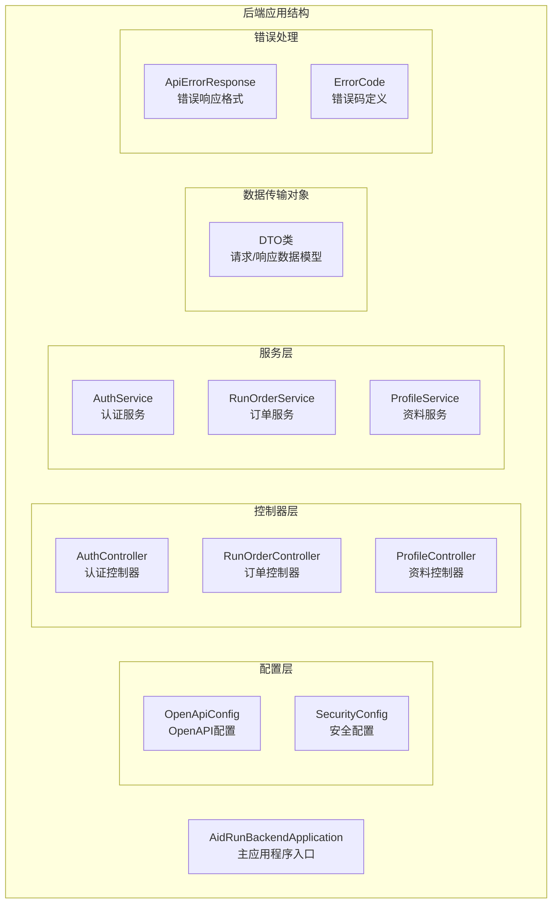
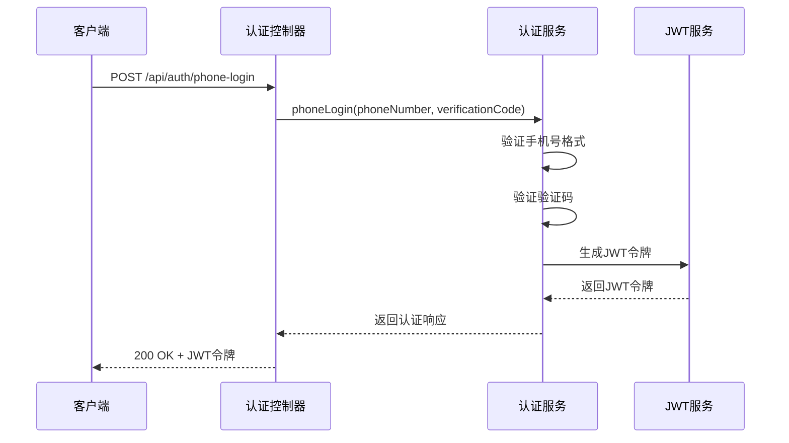
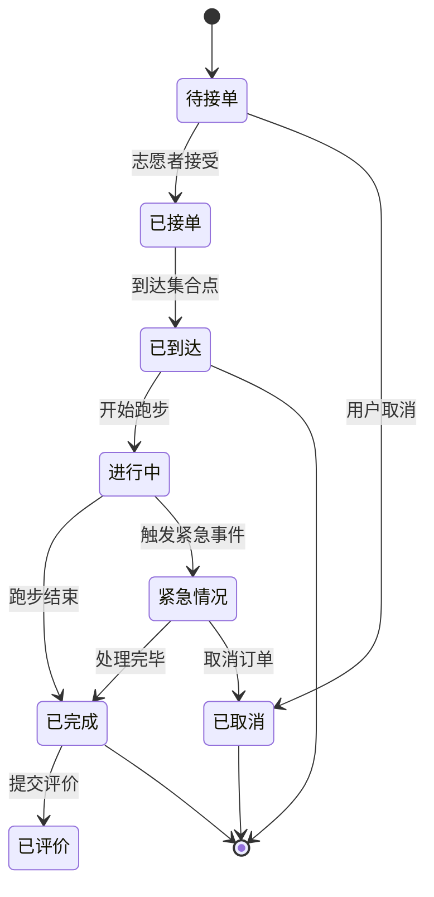
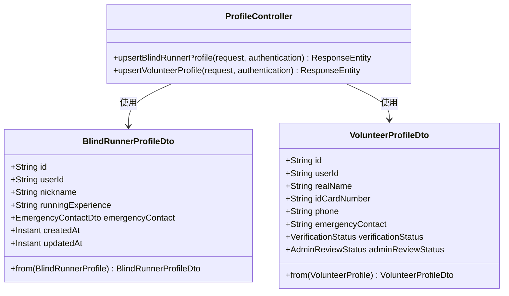
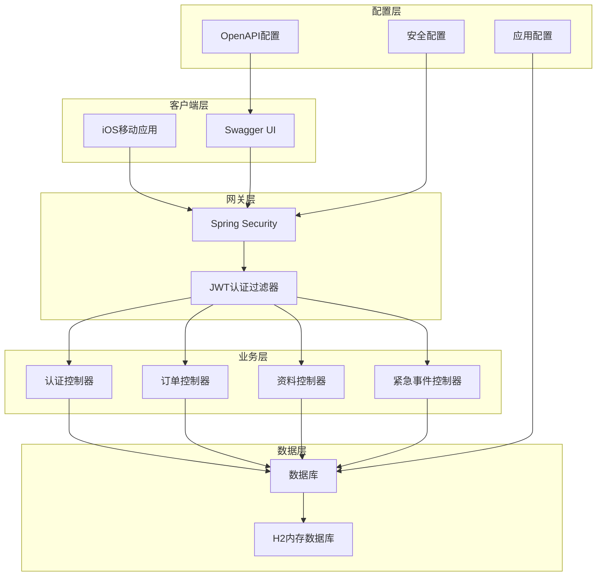
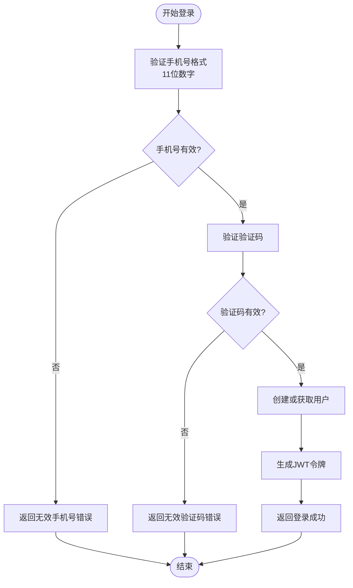
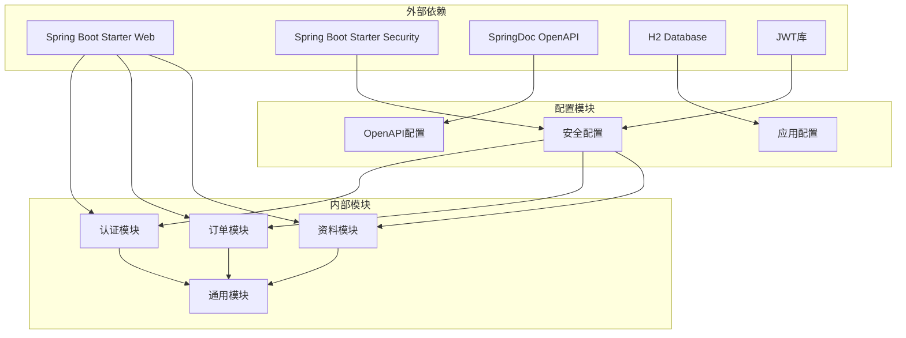

# API 规范文档

<cite>
**本文档引用的文件**
- [application.yml](file://backend/src/main/resources/application.yml)
- [AidRunBackendApplication.java](file://backend/src/main/java/com/aidrun/backend/AidRunBackendApplication.java)
- [OpenApiConfig.java](file://backend/src/main/java/com/aidrun/backend/config/OpenApiConfig.java)
- [SecurityConfig.java](file://backend/src/main/java/com/aidrun/backend/config/SecurityConfig.java)
- [AuthController.java](file://backend/src/main/java/com/aidrun/backend/auth/AuthController.java)
- [RunOrderController.java](file://backend/src/main/java/com/aidrun/backend/order/RunOrderController.java)
- [ProfileController.java](file://backend/src/main/java/com/aidrun/backend/profile/ProfileController.java)
- [ApiErrorResponse.java](file://backend/src/main/java/com/aidrun/backend/common/error/ApiErrorResponse.java)
- [ErrorCode.java](file://backend/src/main/java/com/aidrun/backend/common/error/ErrorCode.java)
- [PhoneLoginRequest.java](file://backend/src/main/java/com/aidrun/backend/auth/dto/PhoneLoginRequest.java)
- [CreateOrderRequest.java](file://backend/src/main/java/com/aidrun/backend/order/dto/CreateOrderRequest.java)
- [BlindRunnerProfileDto.java](file://backend/src/main/java/com/aidrun/backend/profile/dto/BlindRunnerProfileDto.java)
- [api_spec.yaml](file://docs/api_spec.yaml)
</cite>

## 目录
1. [简介](#简介)
2. [项目结构](#项目结构)
3. [核心组件](#核心组件)
4. [架构概览](#架构概览)
5. [详细组件分析](#详细组件分析)
6. [依赖关系分析](#依赖关系分析)
7. [性能考虑](#性能考虑)
8. [故障排除指南](#故障排除指南)
9. [结论](#结论)

## 简介

本项目是一个盲人跑步助手系统，提供盲人用户与志愿者之间的配对服务。系统采用Spring Boot后端框架，基于OpenAPI规范定义了完整的API接口，支持手机号一键登录、订单管理、用户资料管理、紧急事件处理等功能。

该系统旨在为视障人士提供安全可靠的跑步陪伴服务，通过专业的志愿者配对机制确保用户的安全和体验。

## 项目结构

项目采用标准的Spring Boot三层架构设计：



**图表来源**
- [AidRunBackendApplication.java:1-13](file://backend/src/main/java/com/aidrun/backend/AidRunBackendApplication.java#L1-L13)
- [OpenApiConfig.java:1-20](file://backend/src/main/java/com/aidrun/backend/config/OpenApiConfig.java#L1-L20)
- [SecurityConfig.java:1-55](file://backend/src/main/java/com/aidrun/backend/config/SecurityConfig.java#L1-L55)

**章节来源**
- [AidRunBackendApplication.java:1-13](file://backend/src/main/java/com/aidrun/backend/AidRunBackendApplication.java#L1-L13)
- [application.yml:1-34](file://backend/src/main/resources/application.yml#L1-L34)

## 核心组件

### 认证系统

系统提供手机号一键登录功能，支持短信验证码验证：



**图表来源**
- [AuthController.java:22-26](file://backend/src/main/java/com/aidrun/backend/auth/AuthController.java#L22-L26)
- [PhoneLoginRequest.java:6-12](file://backend/src/main/java/com/aidrun/backend/auth/dto/PhoneLoginRequest.java#L6-L12)

### 订单管理系统

订单系统支持完整的跑步服务生命周期管理：



**图表来源**
- [RunOrderController.java:66-127](file://backend/src/main/java/com/aidrun/backend/order/RunOrderController.java#L66-L127)

### 资料管理系统

系统支持双角色用户资料管理：



**图表来源**
- [ProfileController.java:26-42](file://backend/src/main/java/com/aidrun/backend/profile/ProfileController.java#L26-L42)
- [BlindRunnerProfileDto.java:6-30](file://backend/src/main/java/com/aidrun/backend/profile/dto/BlindRunnerProfileDto.java#L6-L30)

**章节来源**
- [AuthController.java:1-28](file://backend/src/main/java/com/aidrun/backend/auth/AuthController.java#L1-L28)
- [RunOrderController.java:1-140](file://backend/src/main/java/com/aidrun/backend/order/RunOrderController.java#L1-L140)
- [ProfileController.java:1-44](file://backend/src/main/java/com/aidrun/backend/profile/ProfileController.java#L1-L44)

## 架构概览

系统采用RESTful API设计原则，基于JWT进行身份认证，支持OpenAPI文档自动生成：



**图表来源**
- [SecurityConfig.java:29-53](file://backend/src/main/java/com/aidrun/backend/config/SecurityConfig.java#L29-L53)
- [OpenApiConfig.java:11-18](file://backend/src/main/java/com/aidrun/backend/config/OpenApiConfig.java#L11-L18)
- [application.yml:21-28](file://backend/src/main/resources/application.yml#L21-L28)

**章节来源**
- [SecurityConfig.java:1-55](file://backend/src/main/java/com/aidrun/backend/config/SecurityConfig.java#L1-L55)
- [OpenApiConfig.java:1-20](file://backend/src/main/java/com/aidrun/backend/config/OpenApiConfig.java#L1-L20)

## 详细组件分析

### 认证组件

#### 手机号登录流程



**图表来源**
- [PhoneLoginRequest.java:6-12](file://backend/src/main/java/com/aidrun/backend/auth/dto/PhoneLoginRequest.java#L6-L12)
- [AuthController.java:22-26](file://backend/src/main/java/com/aidrun/backend/auth/AuthController.java#L22-L26)

#### 认证请求数据模型

| 字段名 | 类型 | 必填 | 描述 | 示例 |
|--------|------|------|------|------|
| phoneNumber | String | 是 | 11位手机号码 | "13800001111" |
| verificationCode | String | 是 | 短信验证码 | "123456" |

**章节来源**
- [PhoneLoginRequest.java:1-13](file://backend/src/main/java/com/aidrun/backend/auth/dto/PhoneLoginRequest.java#L1-L13)
- [AuthController.java:1-28](file://backend/src/main/java/com/aidrun/backend/auth/AuthController.java#L1-L28)

### 订单组件

#### 订单创建请求

订单创建支持多种参数配置：

| 字段名 | 类型 | 必填 | 描述 | 示例 |
|--------|------|------|------|------|
| startLocation | LocationPointDto | 是 | 起始位置坐标 | - |
| appointmentTime | Instant | 是 | 预约时间戳 | "2024-01-15T14:30:00Z" |
| destinationText | String | 否 | 目的地描述 | "公园门口" |
| estimatedDurationMinutes | Integer | 否 | 预计时长(分钟) | 60 |
| estimatedDistanceKm | BigDecimal | 否 | 预计距离(公里) | 5.5 |
| pacePreference | String | 否 | 速度偏好 | "中等" |
| preferSameGender | Boolean | 否 | 是否偏好同性别志愿者 | true |
| remark | String | 否 | 备注说明 | "请慢一点" |

**章节来源**
- [CreateOrderRequest.java:1-19](file://backend/src/main/java/com/aidrun/backend/order/dto/CreateOrderRequest.java#L1-L19)
- [RunOrderController.java:33-41](file://backend/src/main/java/com/aidrun/backend/order/RunOrderController.java#L33-L41)

#### 订单状态流转

系统支持完整的订单生命周期管理，包括状态转换和权限控制。

**章节来源**
- [RunOrderController.java:66-138](file://backend/src/main/java/com/aidrun/backend/order/RunOrderController.java#L66-L138)

### 资料组件

#### 盲人用户资料

盲人用户资料包含基本信息和紧急联系人：

| 字段名 | 类型 | 描述 | 示例 |
|--------|------|------|------|
| id | String | 资料ID | "1" |
| userId | String | 用户ID | "user_123" |
| nickname | String | 昵称 | "小明" |
| runningExperience | String | 跑步经验 | "初级" |
| emergencyContact | EmergencyContactDto | 紧急联系人 | - |
| createdAt | Instant | 创建时间 | "2024-01-01T00:00:00Z" |
| updatedAt | Instant | 更新时间 | "2024-01-01T00:00:00Z" |

**章节来源**
- [BlindRunnerProfileDto.java:1-31](file://backend/src/main/java/com/aidrun/backend/profile/dto/BlindRunnerProfileDto.java#L1-L31)
- [ProfileController.java:26-42](file://backend/src/main/java/com/aidrun/backend/profile/ProfileController.java#L26-L42)

## 依赖关系分析

系统采用模块化设计，各组件间依赖关系清晰：



**图表来源**
- [application.yml:4-20](file://backend/src/main/resources/application.yml#L4-L20)
- [SecurityConfig.java:34-50](file://backend/src/main/java/com/aidrun/backend/config/SecurityConfig.java#L34-L50)

**章节来源**
- [application.yml:1-34](file://backend/src/main/resources/application.yml#L1-L34)
- [OpenApiConfig.java:11-18](file://backend/src/main/java/com/aidrun/backend/config/OpenApiConfig.java#L11-L18)

## 性能考虑

### 缓存策略

- **JWT令牌缓存**: 使用内存缓存存储已颁发的JWT令牌，支持令牌撤销
- **用户会话缓存**: 缓存用户的基本信息和角色权限
- **订单查询缓存**: 对常用查询结果进行缓存，减少数据库压力

### 数据库优化

- **索引优化**: 为常用查询字段建立索引
- **连接池配置**: 合理配置数据库连接池大小
- **查询优化**: 使用分页查询避免大数据量影响

### API性能

- **响应压缩**: 启用GZIP压缩减少网络传输
- **并发控制**: 限制同时处理的请求数量
- **超时设置**: 合理设置请求超时时间

## 故障排除指南

### 常见错误码

| 错误码 | 描述 | 可能原因 | 解决方案 |
|--------|------|----------|----------|
| INVALID_VERIFICATION_CODE | 无效验证码 | 验证码过期或错误 | 检查验证码是否正确，重新发送 |
| PROFILE_INCOMPLETE | 资料不完整 | 用户未完善个人信息 | 引导用户完善个人资料 |
| ORDER_NOT_FOUND | 订单不存在 | 订单ID错误 | 检查订单ID是否正确 |
| ORDER_ALREADY_ACCEPTED | 订单已被接单 | 其他志愿者已接单 | 选择其他可接单的订单 |
| UNAUTHORIZED | 未授权访问 | 缺少或无效JWT令牌 | 重新登录获取新令牌 |

### 错误响应格式

所有API错误响应遵循统一格式：

```json
{
  "code": "ERROR_CODE",
  "message": "错误描述",
  "timestamp": "2024-01-01T00:00:00Z"
}
```

**章节来源**
- [ErrorCode.java:6-40](file://backend/src/main/java/com/aidrun/backend/common/error/ErrorCode.java#L6-L40)
- [ApiErrorResponse.java:5-14](file://backend/src/main/java/com/aidrun/backend/common/error/ApiErrorResponse.java#L5-L14)

### 调试建议

1. **启用详细日志**: 在开发环境中启用DEBUG级别日志
2. **使用Swagger UI**: 通过Swagger界面测试API接口
3. **检查JWT令牌**: 确保JWT令牌格式正确且未过期
4. **验证请求参数**: 确保所有必填参数都已正确提供

## 结论

本API规范文档详细描述了盲人跑步助手系统的接口设计和实现细节。系统采用现代化的技术栈和设计模式，提供了完整的认证、订单管理和资料管理功能。

主要特点包括：
- 基于JWT的无状态认证机制
- 完整的订单生命周期管理
- 支持双角色用户（盲人用户和志愿者）
- 基于OpenAPI的自动化文档生成
- 统一的错误处理和响应格式

该系统为视障人士提供了一个安全、可靠、易用的跑步陪伴服务平台，通过专业的志愿者配对机制确保用户的安全和体验。