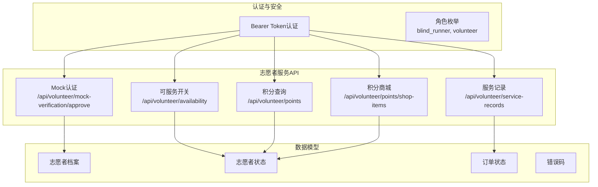
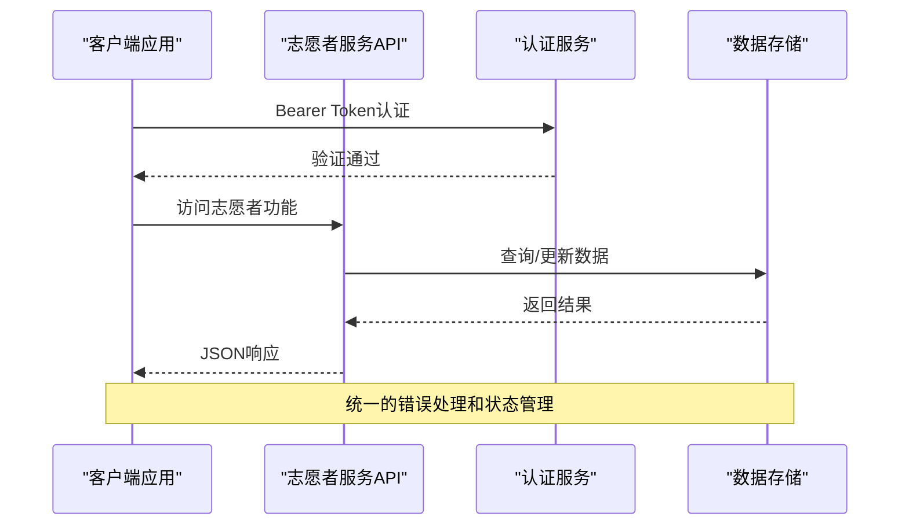
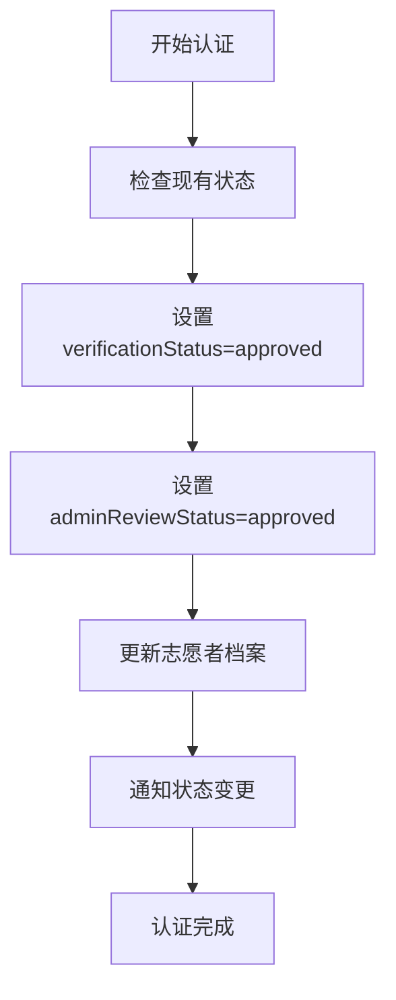
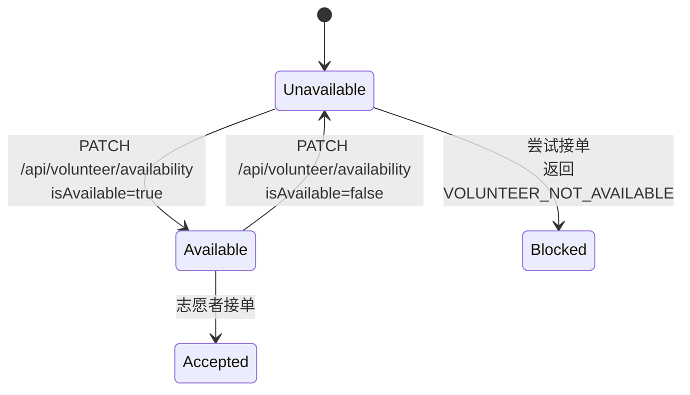
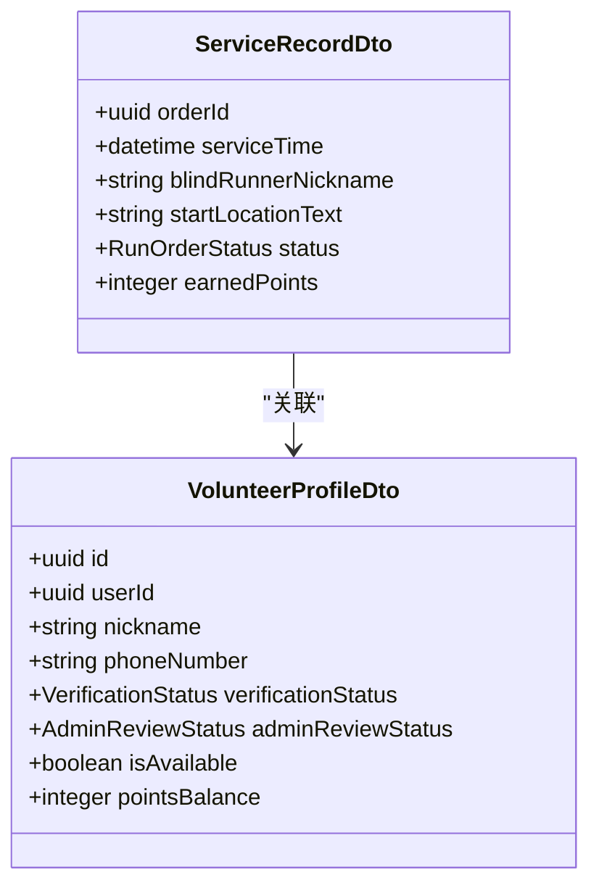
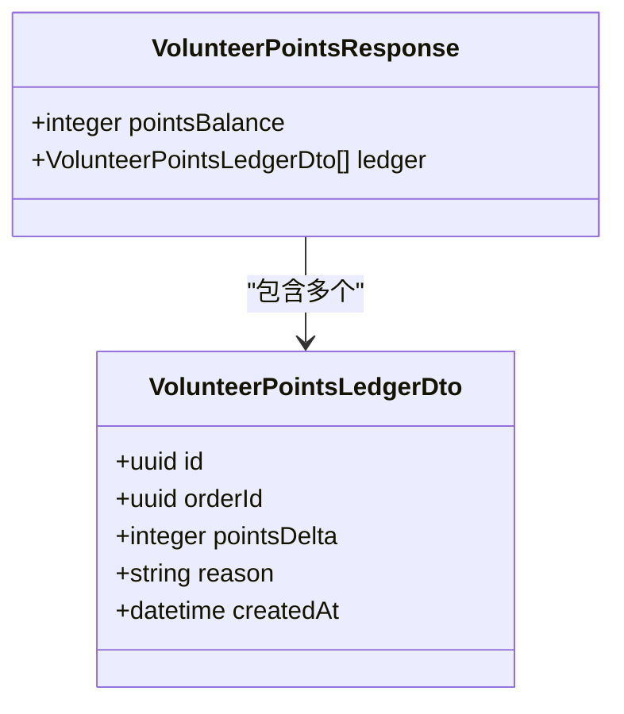
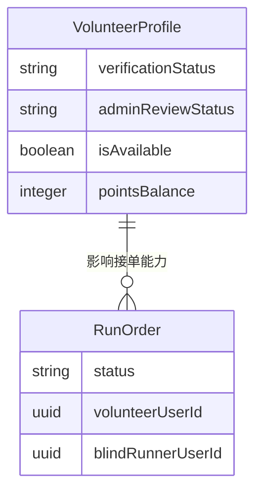

# 志愿者服务接口

<cite>
**本文档引用的文件**
- [07-api-contract.openapi.yaml](file://docs/07-api-contract.openapi.yaml)
- [volunteer-order-flow/spec.md](file://openspec/changes/add-aidrun-ios-spring-mvp/specs/volunteer-order-flow/spec.md)
- [volunteer-points/spec.md](file://openspec/changes/add-aidrun-ios-spring-mvp/specs/volunteer-points/spec.md)
- [backend-api-contract/spec.md](file://openspec/changes/add-aidrun-ios-spring-mvp/specs/backend-api-contract/spec.md)
- [04-user-flows-and-state-machine.md](file://docs/04-user-flows-and-state-machine.md)
</cite>

## 目录
1. [简介](#简介)
2. [项目结构](#项目结构)
3. [核心组件](#核心组件)
4. [架构概览](#架构概览)
5. [详细组件分析](#详细组件分析)
6. [依赖关系分析](#依赖关系分析)
7. [性能考虑](#性能考虑)
8. [故障排除指南](#故障排除指南)
9. [结论](#结论)

## 简介
本文件为志愿者服务模块的详细API接口文档，涵盖以下关键功能：
- 志愿者Mock认证通过：/api/volunteer/mock-verification/approve
- 可服务状态切换：/api/volunteer/availability
- 服务记录查询：/api/volunteer/service-records
- 积分查询与流水：/api/volunteer/points
- 积分商城占位商品：/api/volunteer/points/shop-items
同时提供志愿者认证状态枚举、审核状态说明、请求/响应示例以及状态转换的业务逻辑。

## 项目结构
志愿者服务相关接口位于OpenAPI契约文档中，采用按功能域分组的组织方式：
- 路径定义集中在 `/api/volunteer/*` 命名空间下
- 数据模型定义在 `components/schemas` 中
- 错误码统一管理在 `components/schemas/ErrorCode` 枚举中

**图表来源**
- [07-api-contract.openapi.yaml:118-148](file://docs/07-api-contract.openapi.yaml#L118-L148)
- [07-api-contract.openapi.yaml:412-451](file://docs/07-api-contract.openapi.yaml#L412-L451)

**章节来源**
- [07-api-contract.openapi.yaml:118-148](file://docs/07-api-contract.openapi.yaml#L118-L148)
- [07-api-contract.openapi.yaml:412-451](file://docs/07-api-contract.openapi.yaml#L412-L451)

## 核心组件
志愿者服务模块的核心接口包括：

### 认证与状态管理
- Mock认证接口：提供快速认证通道，跳过真实实名验证
- 可服务状态开关：控制志愿者是否可以接收新订单

### 服务记录与积分体系
- 服务记录查询：获取已完成的服务历史
- 积分查询：查看当前积分余额和流水明细
- 积分商城：展示占位商品信息

### 订单关联功能
- 与订单状态流转紧密关联
- 支持紧急状态处理
- 提供评分反馈机制

**章节来源**
- [07-api-contract.openapi.yaml:118-148](file://docs/07-api-contract.openapi.yaml#L118-L148)
- [07-api-contract.openapi.yaml:412-451](file://docs/07-api-contract.openapi.yaml#L412-L451)

## 架构概览
志愿者服务接口遵循RESTful设计原则，采用统一的认证机制和数据模型：

**图表来源**
- [07-api-contract.openapi.yaml:454-458](file://docs/07-api-contract.openapi.yaml#L454-L458)
- [07-api-contract.openapi.yaml:22-23](file://docs/07-api-contract.openapi.yaml#L22-L23)

## 详细组件分析

### Mock认证通过接口
#### 接口规范
- **路径**：`/api/volunteer/mock-verification/approve`
- **方法**：POST
- **标签**：Volunteer
- **认证**：需要Bearer Token

#### 使用场景
- MVP阶段替代真实实名认证流程
- 开发测试环境下的快速认证
- 演示模式下的功能验证

#### 业务影响
- 将`verificationStatus`和`adminReviewStatus`均设置为`approved`
- 解除志愿者接单限制
- 影响订单接受流程的前置条件

**图表来源**
- [07-api-contract.openapi.yaml:118-129](file://docs/07-api-contract.openapi.yaml#L118-L129)
- [volunteer-order-flow/spec.md:15-21](file://openspec/changes/add-aidrun-ios-spring-mvp/specs/volunteer-order-flow/spec.md#L15-L21)

**章节来源**
- [07-api-contract.openapi.yaml:118-129](file://docs/07-api-contract.openapi.yaml#L118-L129)
- [volunteer-order-flow/spec.md:15-21](file://openspec/changes/add-aidrun-ios-spring-mvp/specs/volunteer-order-flow/spec.md#L15-L21)

### 可服务状态切换
#### 接口规范
- **路径**：`/api/volunteer/availability`
- **方法**：PATCH
- **标签**：Volunteer
- **请求体**：AvailabilityRequest对象

#### 开关机制
- **关闭状态**：仍可查看订单，但不能接收新订单
- **开启状态**：具备接收新订单的资格
- **前置条件**：必须完成志愿者认证且状态为approved

**图表来源**
- [07-api-contract.openapi.yaml:131-148](file://docs/07-api-contract.openapi.yaml#L131-L148)
- [volunteer-order-flow/spec.md:3-5](file://openspec/changes/add-aidrun-ios-spring-mvp/specs/volunteer-order-flow/spec.md#L3-L5)

**章节来源**
- [07-api-contract.openapi.yaml:131-148](file://docs/07-api-contract.openapi.yaml#L131-L148)
- [volunteer-order-flow/spec.md:3-5](file://openspec/changes/add-aidrun-ios-spring-mvp/specs/volunteer-order-flow/spec.md#L3-L5)

### 服务记录查询
#### 接口规范
- **路径**：`/api/volunteer/service-records`
- **方法**：GET
- **标签**：Volunteer

#### 数据结构
服务记录数组，每个条目包含：
- `orderId`: 订单唯一标识
- `serviceTime`: 服务时间戳
- `blindRunnerNickname`: 盲人昵称
- `startLocationText`: 出发地点文本
- `status`: 订单状态
- `earnedPoints`: 获得积分

**图表来源**
- [07-api-contract.openapi.yaml:1050-1068](file://docs/07-api-contract.openapi.yaml#L1050-L1068)
- [07-api-contract.openapi.yaml:731-761](file://docs/07-api-contract.openapi.yaml#L731-L761)

**章节来源**
- [07-api-contract.openapi.yaml:412-424](file://docs/07-api-contract.openapi.yaml#L412-L424)
- [07-api-contract.openapi.yaml:1050-1068](file://docs/07-api-contract.openapi.yaml#L1050-L1068)

### 积分查询接口
#### 接口规范
- **路径**：`/api/volunteer/points`
- **方法**：GET
- **标签**：Volunteer

#### 响应结构
- `pointsBalance`: 当前积分余额
- `ledger`: 积分流水明细数组

##### 流水明细结构
- `id`: 流水记录ID
- `orderId`: 关联订单ID（可为空）
- `pointsDelta`: 积分变动值
- `reason`: 变动原因
- `createdAt`: 创建时间

**图表来源**
- [07-api-contract.openapi.yaml:1089-1098](file://docs/07-api-contract.openapi.yaml#L1089-L1098)
- [07-api-contract.openapi.yaml:1069-1087](file://docs/07-api-contract.openapi.yaml#L1069-L1087)

**章节来源**
- [07-api-contract.openapi.yaml:426-436](file://docs/07-api-contract.openapi.yaml#L426-L436)
- [07-api-contract.openapi.yaml:1089-1098](file://docs/07-api-contract.openapi.yaml#L1089-L1098)
- [volunteer-points/spec.md:3-9](file://openspec/changes/add-aidrun-ios-spring-mvp/specs/volunteer-points/spec.md#L3-L9)

### 积分商城占位商品
#### 接口规范
- **路径**：`/api/volunteer/points/shop-items`
- **方法**：GET
- **标签**：Volunteer

#### 商品结构
- `id`: 商品ID
- `name`: 商品名称
- `pointsRequired`: 所需积分
- `description`: 商品描述
- `isPlaceholder`: 是否为占位商品

**章节来源**
- [07-api-contract.openapi.yaml:438-451](file://docs/07-api-contract.openapi.yaml#L438-L451)
- [07-api-contract.openapi.yaml:1100-1116](file://docs/07-api-contract.openapi.yaml#L1100-L1116)
- [volunteer-points/spec.md:19-25](file://openspec/changes/add-aidrun-ios-spring-mvp/specs/volunteer-points/spec.md#L19-L25)

## 依赖关系分析

### 认证状态枚举
志愿者认证状态分为四个级别：
- `not_submitted`: 未提交
- `pending`: 审核中
- `approved`: 已批准
- `rejected`: 已拒绝

### 审核状态枚举
管理员审核状态与认证状态保持一致：
- `not_submitted`: 未提交
- `pending`: 审核中
- `approved`: 已批准
- `rejected`: 已拒绝

### 订单状态关联
志愿者服务状态直接影响订单处理流程：
- 可服务状态为`true`且认证通过才能接单
- 订单完成后自动增加100积分
- 支持紧急状态处理

**图表来源**
- [07-api-contract.openapi.yaml:731-761](file://docs/07-api-contract.openapi.yaml#L731-L761)
- [07-api-contract.openapi.yaml:811-913](file://docs/07-api-contract.openapi.yaml#L811-L913)

**章节来源**
- [07-api-contract.openapi.yaml:572-578](file://docs/07-api-contract.openapi.yaml#L572-L578)
- [07-api-contract.openapi.yaml:580](file://docs/07-api-contract.openapi.yaml#L580)

## 性能考虑
- API响应均为JSON格式，数据量适中
- 无需WebSocket实时推送，减少连接维护成本
- H2数据库适合MVP演示，避免外部依赖
- 错误码统一管理，便于前端缓存和重试策略

## 故障排除指南

### 常见错误码
- `VOLUNTEER_NOT_APPROVED`: 志愿者未完成认证
- `VOLUNTEER_NOT_AVAILABLE`: 志愿者未开启可服务状态
- `INVALID_ORDER_STATUS`: 订单状态不允许当前操作
- `ORDER_ALREADY_ACCEPTED`: 订单已被其他志愿者接单

### 认证问题排查
1. 确认Bearer Token有效性
2. 检查志愿者认证状态是否为`approved`
3. 验证可服务状态是否开启
4. 确认订单状态符合操作要求

**章节来源**
- [07-api-contract.openapi.yaml:544-557](file://docs/07-api-contract.openapi.yaml#L544-L557)
- [backend-api-contract/spec.md:19-25](file://openspec/changes/add-aidrun-ios-spring-mvp/specs/backend-api-contract/spec.md#L19-L25)

## 结论
志愿者服务模块提供了完整的认证、状态管理和积分体系接口，满足MVP阶段的功能需求。所有接口均通过OpenAPI契约文档标准化，确保前后端开发的一致性。Mock认证和占位商品设计体现了敏捷开发的特点，便于快速迭代和测试。