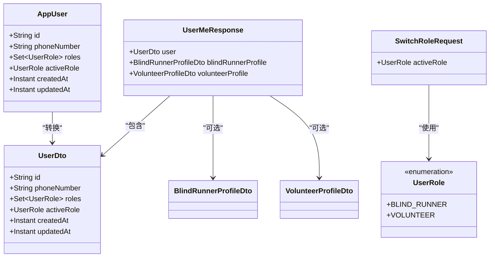
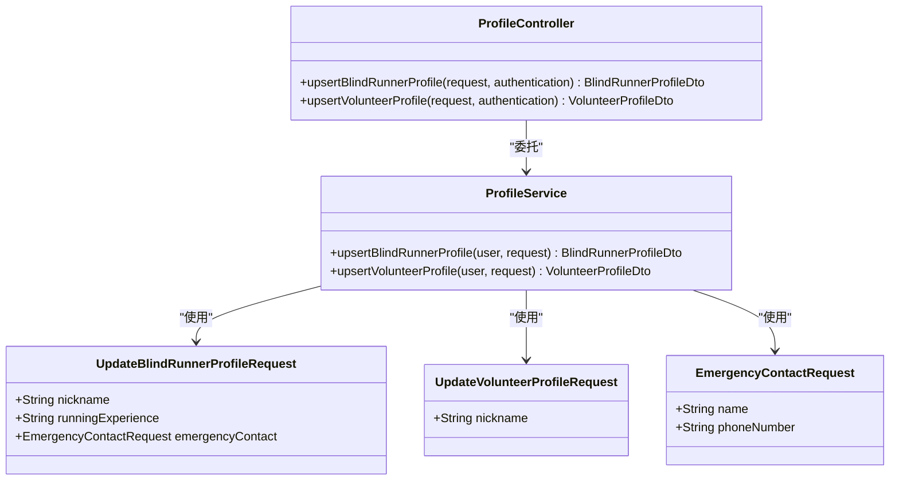
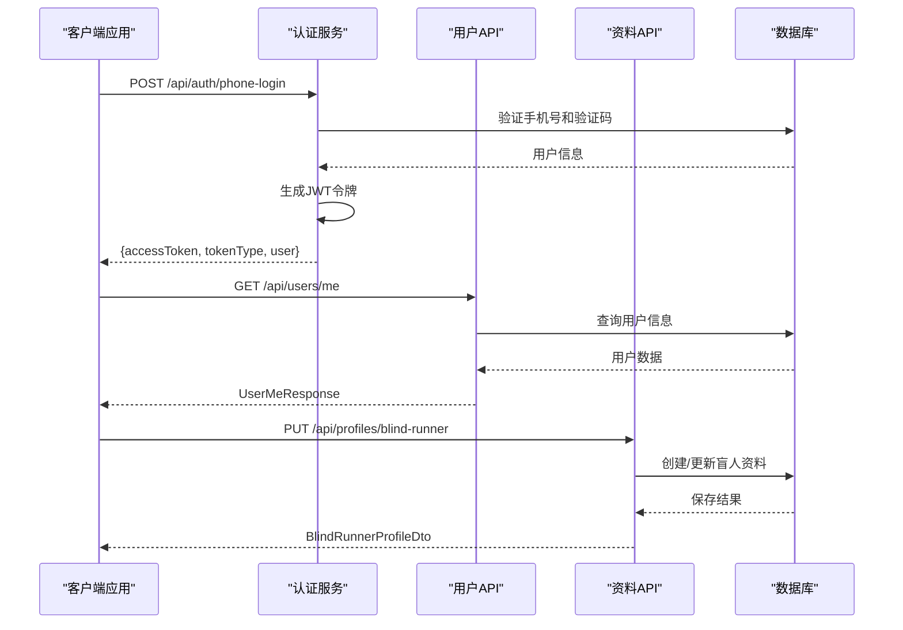
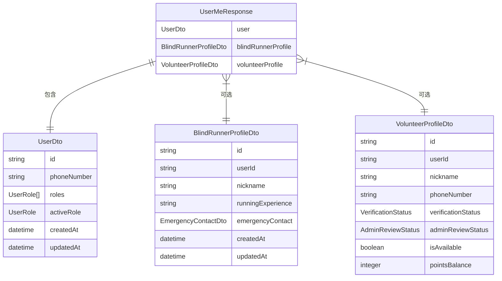
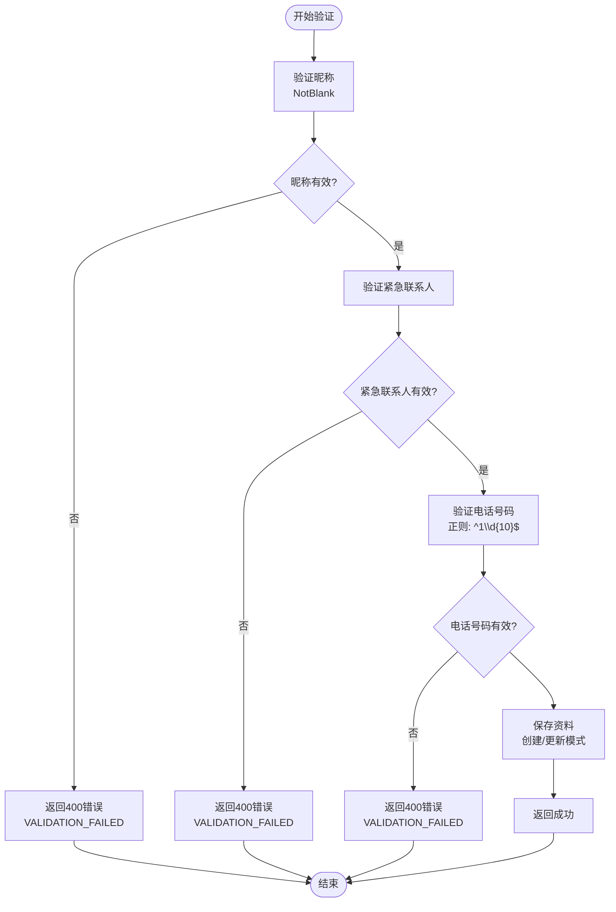
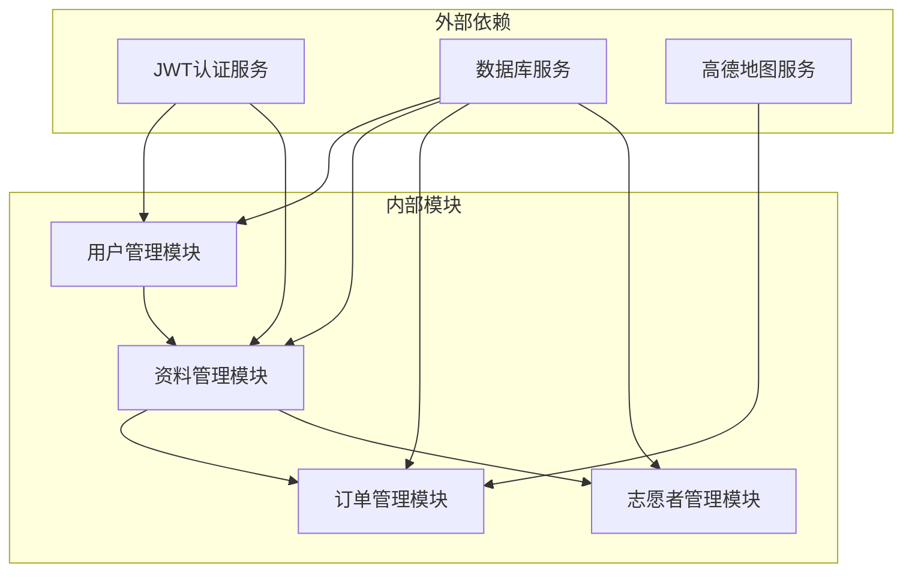

# 用户资料接口

<cite>
**本文档引用的文件**
- [UserController.java](file://backend/src/main/java/com/aidrun/backend/user/UserController.java)
- [UserService.java](file://backend/src/main/java/com/aidrun/backend/user/UserService.java)
- [UserDto.java](file://backend/src/main/java/com/aidrun/backend/user/dto/UserDto.java)
- [UserMeResponse.java](file://backend/src/main/java/com/aidrun/backend/user/dto/UserMeResponse.java)
- [SwitchRoleRequest.java](file://backend/src/main/java/com/aidrun/backend/user/dto/SwitchRoleRequest.java)
- [AppUser.java](file://backend/src/main/java/com/aidrun/backend/user/AppUser.java)
- [UserRole.java](file://backend/src/main/java/com/aidrun/backend/user/UserRole.java)
- [ProfileController.java](file://backend/src/main/java/com/aidrun/backend/profile/ProfileController.java)
- [ProfileService.java](file://backend/src/main/java/com/aidrun/backend/profile/ProfileService.java)
- [BlindRunnerProfile.java](file://backend/src/main/java/com/aidrun/backend/profile/BlindRunnerProfile.java)
- [VolunteerProfile.java](file://backend/src/main/java/com/aidrun/backend/profile/VolunteerProfile.java)
- [EmergencyContact.java](file://backend/src/main/java/com/aidrun/backend/profile/EmergencyContact.java)
- [BlindRunnerProfileDto.java](file://backend/src/main/java/com/aidrun/backend/profile/dto/BlindRunnerProfileDto.java)
- [VolunteerProfileDto.java](file://backend/src/main/java/com/aidrun/backend/profile/dto/VolunteerProfileDto.java)
- [UpdateBlindRunnerProfileRequest.java](file://backend/src/main/java/com/aidrun/backend/profile/dto/UpdateBlindRunnerProfileRequest.java)
- [UpdateVolunteerProfileRequest.java](file://backend/src/main/java/com/aidrun/backend/profile/dto/UpdateVolunteerProfileRequest.java)
- [EmergencyContactRequest.java](file://backend/src/main/java/com/aidrun/backend/profile/dto/EmergencyContactRequest.java)
- [BlindRunnerProfileRepository.java](file://backend/src/main/java/com/aidrun/backend/profile/BlindRunnerProfileRepository.java)
- [VolunteerProfileRepository.java](file://backend/src/main/java/com/aidrun/backend/profile/VolunteerProfileRepository.java)
- [UserControllerIntegrationTest.java](file://backend/src/test/java/com/aidrun/backend/user/UserControllerIntegrationTest.java)
- [ProfileControllerIntegrationTest.java](file://backend/src/test/java/com/aidrun/backend/profile/ProfileControllerIntegrationTest.java)
- [07-api-contract.openapi.yaml](file://docs/07-api-contract.openapi.yaml)
- [06-data-model.md](file://docs/06-data-model.md)
- [02-mvp-scope.md](file://docs/02-mvp-scope.md)
- [08-ios-architecture.md](file://docs/08-ios-architecture.md)
- [role-switching/spec.md](file://openspec/changes/add-aidrun-ios-spring-mvp/specs/role-switching/spec.md)
- [auth-phone-login/spec.md](file://openspec/changes/add-aidrun-ios-spring-mvp/specs/auth-phone-login/spec.md)
</cite>

## 更新摘要
**所做更改**
- 新增ProfileController和ProfileService接口的完整实现文档
- 更新盲人资料创建/更新接口为PUT /api/profiles/blind-runner
- 更新志愿者资料创建/更新接口为PUT /api/profiles/volunteer
- 补充详细的请求参数验证规则和错误处理机制
- 增加紧急联系人电话号码的正则表达式验证
- 完善资料更新的业务逻辑说明（创建/更新模式）

## 目录
1. [简介](#简介)
2. [项目结构](#项目结构)
3. [核心组件](#核心组件)
4. [架构概览](#架构概览)
5. [详细组件分析](#详细组件分析)
6. [依赖关系分析](#依赖关系分析)
7. [性能考虑](#性能考虑)
8. [故障排除指南](#故障排除指南)
9. [结论](#结论)

## 简介

本文档为"助盲跑"应用的用户资料管理模块提供完整的API接口规范。该模块涵盖用户基本信息管理、角色切换功能，以及盲人跑者和志愿者的个人资料创建/更新接口。基于Spring Boot后端服务和OpenAPI 3.0.3规范，文档详细说明了数据模型、验证规则、错误处理和实际的请求/响应示例。

**更新** 新增了ProfileController和ProfileService接口的详细实现，包括PUT方法的资料创建/更新功能。

## 项目结构

用户资料管理模块位于后端Spring Boot服务中，通过REST API提供服务。主要涉及以下核心路径：

```mermaid
graph TB
subgraph "用户资料管理模块"
A[/api/users/me] --> B[获取当前用户信息]
C[/api/users/me/active-role] --> D[切换活动角色]
E[/api/profiles/blind-runner] --> F[盲人资料创建/更新]
G[/api/profiles/volunteer] --> H[志愿者资料创建/更新]
end
subgraph "认证机制"
I[JWT Bearer Token] --> A
I --> C
I --> E
I --> G
end
```

**图表来源**
- [UserController.java:15-45](file://backend/src/main/java/com/aidrun/backend/user/UserController.java#L15-L45)
- [ProfileController.java:16-44](file://backend/src/main/java/com/aidrun/backend/profile/ProfileController.java#L16-L44)
- [07-api-contract.openapi.yaml:47-116](file://docs/07-api-contract.openapi.yaml#L47-L116)

**章节来源**
- [07-api-contract.openapi.yaml:1-1117](file://docs/07-api-contract.openapi.yaml#L1-L1117)
- [02-mvp-scope.md:14-90](file://docs/02-mvp-scope.md#L14-L90)

## 核心组件

### 用户数据模型

用户系统采用单一账户多角色设计，支持盲人跑者和志愿者两种身份的切换。系统通过AppUser实体类和UserDto数据传输对象实现用户信息的封装和传输。



**图表来源**
- [AppUser.java:16-57](file://backend/src/main/java/com/aidrun/backend/user/AppUser.java#L16-L57)
- [UserDto.java:8-28](file://backend/src/main/java/com/aidrun/backend/user/dto/UserDto.java#L8-L28)
- [UserMeResponse.java:6-11](file://backend/src/main/java/com/aidrun/backend/user/dto/UserMeResponse.java#L6-L11)
- [SwitchRoleRequest.java:6-9](file://backend/src/main/java/com/aidrun/backend/user/dto/SwitchRoleRequest.java#L6-L9)
- [UserRole.java:6-30](file://backend/src/main/java/com/aidrun/backend/user/UserRole.java#L6-L30)

### 角色枚举和状态字段

系统定义了标准化的角色枚举和状态管理机制，支持用户身份的灵活切换。

**角色枚举 (UserRole)**
- `BLIND_RUNNER`: 盲人跑者身份（wire value: "blind_runner"）
- `VOLUNTEER`: 志愿者身份（wire value: "volunteer"）

**状态字段特性**
- `activeRole`: 当前活动角色，首次登录可为空
- `roles`: 用户拥有的所有角色集合，使用LinkedHashSet保持插入顺序
- 支持JWT共享机制，同一账户在不同角色间切换

**章节来源**
- [UserRole.java:6-30](file://backend/src/main/java/com/aidrun/backend/user/UserRole.java#L6-L30)
- [AppUser.java:23-30](file://backend/src/main/java/com/aidrun/backend/user/AppUser.java#L23-L30)
- [06-data-model.md:82-97](file://docs/06-data-model.md#L82-L97)

### 资料管理组件

**更新** 新增ProfileController和ProfileService组件，负责处理用户资料的创建和更新操作。



**图表来源**
- [ProfileController.java:16-44](file://backend/src/main/java/com/aidrun/backend/profile/ProfileController.java#L16-L44)
- [ProfileService.java:12-77](file://backend/src/main/java/com/aidrun/backend/profile/ProfileService.java#L12-L77)
- [UpdateBlindRunnerProfileRequest.java:7-12](file://backend/src/main/java/com/aidrun/backend/profile/dto/UpdateBlindRunnerProfileRequest.java#L7-L12)
- [UpdateVolunteerProfileRequest.java:5-8](file://backend/src/main/java/com/aidrun/backend/profile/dto/UpdateVolunteerProfileRequest.java#L5-L8)
- [EmergencyContactRequest.java:6-10](file://backend/src/main/java/com/aidrun/backend/profile/dto/EmergencyContactRequest.java#L6-L10)

**章节来源**
- [ProfileController.java:16-44](file://backend/src/main/java/com/aidrun/backend/profile/ProfileController.java#L16-L44)
- [ProfileService.java:12-77](file://backend/src/main/java/com/aidrun/backend/profile/ProfileService.java#L12-L77)

## 架构概览

用户资料管理模块遵循RESTful架构原则，采用JWT认证机制，确保安全性的同时保持接口简洁性。



**图表来源**
- [UserController.java:25-38](file://backend/src/main/java/com/aidrun/backend/user/UserController.java#L25-L38)
- [ProfileController.java:26-42](file://backend/src/main/java/com/aidrun/backend/profile/ProfileController.java#L26-L42)
- [UserService.java:46-59](file://backend/src/main/java/com/aidrun/backend/user/UserService.java#L46-L59)
- [07-api-contract.openapi.yaml:25-116](file://docs/07-api-contract.openapi.yaml#L25-L116)

**章节来源**
- [08-ios-architecture.md:68-83](file://docs/08-ios-architecture.md#L68-L83)
- [auth-phone-login/spec.md:3-29](file://openspec/changes/add-aidrun-ios-spring-mvp/specs/auth-phone-login/spec.md#L3-L29)

## 详细组件分析

### 获取当前用户信息接口

#### 接口规范

**HTTP请求**
- 方法: GET
- 路径: `/api/users/me`
- 认证: 需要JWT Bearer Token

**响应数据结构**



**图表来源**
- [UserMeResponse.java:6-11](file://backend/src/main/java/com/aidrun/backend/user/dto/UserMeResponse.java#L6-L11)
- [UserDto.java:8-28](file://backend/src/main/java/com/aidrun/backend/user/dto/UserDto.java#L8-L28)
- [BlindRunnerProfileDto.java:6-31](file://backend/src/main/java/com/aidrun/backend/profile/dto/BlindRunnerProfileDto.java#L6-L31)
- [VolunteerProfileDto.java:8-39](file://backend/src/main/java/com/aidrun/backend/profile/dto/VolunteerProfileDto.java#L8-L39)

#### 请求示例

**成功响应 (200 OK)**
```json
{
  "user": {
    "id": "550e8400-e29b-41d4-a716-446655440000",
    "phoneNumber": "13800000001",
    "roles": ["blind_runner", "volunteer"],
    "activeRole": "blind_runner",
    "createdAt": "2024-01-01T00:00:00Z",
    "updatedAt": "2024-01-01T00:00:00Z"
  },
  "blindRunnerProfile": {
    "id": "550e8400-e29b-41d4-a716-446655440001",
    "userId": "550e8400-e29b-41d4-a716-446655440000",
    "nickname": "小明",
    "runningExperience": "5公里",
    "emergencyContact": {
      "name": "妈妈",
      "phoneNumber": "13800000002"
    },
    "createdAt": "2024-01-01T00:00:00Z",
    "updatedAt": "2024-01-01T00:00:00Z"
  },
  "volunteerProfile": null
}
```

#### 错误处理

- **401 Unauthorized**: 未登录或token无效
- **500 Internal Server Error**: 服务器内部错误

**章节来源**
- [UserController.java:25-30](file://backend/src/main/java/com/aidrun/backend/user/UserController.java#L25-L30)
- [UserService.java:46-59](file://backend/src/main/java/com/aidrun/backend/user/UserService.java#L46-L59)
- [07-api-contract.openapi.yaml:47-60](file://docs/07-api-contract.openapi.yaml#L47-L60)

### 切换活动角色接口

#### 接口规范

**HTTP请求**
- 方法: PATCH
- 路径: `/api/users/me/active-role`
- 认证: 需要JWT Bearer Token

**请求体参数**

| 参数名 | 类型 | 必填 | 描述 |
|--------|------|------|------|
| activeRole | UserRole | 是 | 新的活动角色 |

**响应数据结构**
- 成功时返回完整的UserDto对象

#### 角色切换规则

```mermaid
flowchart TD
Start([开始切换]) --> CheckRole["验证用户角色权限"]
CheckRole --> HasRole{"用户拥有该角色?"}
HasRole --> |否| BlockSwitch["返回400错误<br/>用户没有该角色权限"]
HasRole --> |是| CheckOrder["检查用户是否有活跃订单"]
CheckOrder --> HasActive{"存在活跃订单?"}
HasActive --> |是| BlockSwitch2["阻止切换<br/>返回ACTIVE_ORDER_ROLE_SWITCH_BLOCKED"]
HasActive --> |否| UpdateRole["更新activeRole"]
UpdateRole --> SaveUser["保存用户信息"]
SaveUser --> ReturnSuccess["返回更新后的用户信息"]
BlockSwitch --> End([结束])
BlockSwitch2 --> End
ReturnSuccess --> End
```



**图表来源**
- [UserService.java:62-83](file://backend/src/main/java/com/aidrun/backend/user/UserService.java#L62-L83)
- [role-switching/spec.md:11-17](file://openspec/changes/add-aidrun-ios-spring-mvp/specs/role-switching/spec.md#L11-L17)

#### 请求示例

**成功响应 (200 OK)**
```json
{
  "id": "550e8400-e29b-41d4-a716-446655440000",
  "phoneNumber": "13800000001",
  "roles": ["blind_runner", "volunteer"],
  "activeRole": "volunteer",
  "createdAt": "2024-01-01T00:00:00Z",
  "updatedAt": "2024-01-01T00:00:00Z"
}
```

#### 错误处理

- **409 Conflict**: 存在活跃订单，禁止切换角色
  - 错误码: `ACTIVE_ORDER_ROLE_SWITCH_BLOCKED`
  - 响应示例: `{ "code": "ACTIVE_ORDER_ROLE_SWITCH_BLOCKED", "message": "当前存在进行中的订单，暂时不能切换身份" }`
- **400 Bad Request**: 用户没有该角色权限
  - 错误码: `UNAUTHORIZED`
  - 响应示例: `{ "code": "UNAUTHORIZED", "message": "用户没有该角色权限" }`

**章节来源**
- [UserController.java:32-38](file://backend/src/main/java/com/aidrun/backend/user/UserController.java#L32-L38)
- [UserService.java:62-83](file://backend/src/main/java/com/aidrun/backend/user/UserService.java#L62-L83)
- [role-switching/spec.md:3-25](file://openspec/changes/add-aidrun-ios-spring-mvp/specs/role-switching/spec.md#L3-L25)

### 盲人资料创建/更新接口

**更新** 新增了完整的PUT方法实现，支持资料的创建和更新操作。

#### 接口规范

**HTTP请求**
- 方法: PUT
- 路径: `/api/profiles/blind-runner`
- 认证: 需要JWT Bearer Token

**请求体参数**

| 参数名 | 类型 | 必填 | 描述 | 示例 |
|--------|------|------|------|------|
| nickname | string | 是 | 盲人昵称 | "小明" |
| runningExperience | string | 否 | 跑步经验 | "5公里" |
| emergencyContact | EmergencyContactRequest | 是 | 紧急联系人信息 | - |

**紧急联系人参数**

| 参数名 | 类型 | 必填 | 描述 | 正则表达式 |
|--------|------|------|------|------------|
| name | string | 是 | 紧急联系人姓名 | - |
| phoneNumber | string | 是 | 紧急联系人电话 | `^1\d{10}$` (11位手机号) |

#### 资料验证规则



**图表来源**
- [UpdateBlindRunnerProfileRequest.java:7-12](file://backend/src/main/java/com/aidrun/backend/profile/dto/UpdateBlindRunnerProfileRequest.java#L7-L12)
- [EmergencyContactRequest.java:6-10](file://backend/src/main/java/com/aidrun/backend/profile/dto/EmergencyContactRequest.java#L6-L10)
- [ProfileService.java:24-53](file://backend/src/main/java/com/aidrun/backend/profile/ProfileService.java#L24-L53)

#### 请求示例

**成功响应 (200 OK)**
```json
{
  "id": "550e8400-e29b-41d4-a716-446655440001",
  "userId": "550e8400-e29b-41d4-a716-446655440000",
  "nickname": "小明",
  "runningExperience": "5公里",
  "emergencyContact": {
    "name": "妈妈",
    "phoneNumber": "13800000002"
  },
  "createdAt": "2024-01-01T00:00:00Z",
  "updatedAt": "2024-01-01T00:00:00Z"
}
```

#### 错误处理

- **400 Bad Request**: 资料验证失败
  - 错误码: `VALIDATION_FAILED`
  - 典型场景: 缺少必填字段、电话号码格式错误
- **401 Unauthorized**: 未登录或token无效
- **500 Internal Server Error**: 服务器内部错误

**章节来源**
- [ProfileController.java:26-33](file://backend/src/main/java/com/aidrun/backend/profile/ProfileController.java#L26-L33)
- [ProfileService.java:24-53](file://backend/src/main/java/com/aidrun/backend/profile/ProfileService.java#L24-L53)
- [UpdateBlindRunnerProfileRequest.java:7-12](file://backend/src/main/java/com/aidrun/backend/profile/dto/UpdateBlindRunnerProfileRequest.java#L7-L12)
- [EmergencyContactRequest.java:6-10](file://backend/src/main/java/com/aidrun/backend/profile/dto/EmergencyContactRequest.java#L6-L10)
- [ProfileControllerIntegrationTest.java:40-105](file://backend/src/test/java/com/aidrun/backend/profile/ProfileControllerIntegrationTest.java#L40-L105)

### 志愿者资料创建/更新接口

**更新** 新增了完整的PUT方法实现，支持志愿者资料的创建和更新操作。

#### 接口规范

**HTTP请求**
- 方法: PUT
- 路径: `/api/profiles/volunteer`
- 认证: 需要JWT Bearer Token

**请求体参数**

| 参数名 | 类型 | 必填 | 描述 |
|--------|------|------|------|
| nickname | string | 是 | 志愿者昵称 |

#### 资料验证规则

志愿者资料相对简单，主要验证昵称的有效性。

**请求示例**

**成功响应 (200 OK)**
```json
{
  "id": "550e8400-e29b-41d4-a716-446655440002",
  "userId": "550e8400-e29b-41d4-a716-446655440000",
  "nickname": "小红",
  "phoneNumber": "13800000001",
  "verificationStatus": "not_submitted",
  "adminReviewStatus": "not_submitted",
  "isAvailable": false,
  "pointsBalance": 0,
  "createdAt": "2024-01-01T00:00:00Z",
  "updatedAt": "2024-01-01T00:00:00Z"
}
```

#### 错误处理

- **400 Bad Request**: 资料验证失败
  - 错误码: `VALIDATION_FAILED`
  - 典型场景: 缺少昵称字段
- **401 Unauthorized**: 未登录或token无效
- **500 Internal Server Error**: 服务器内部错误

**章节来源**
- [ProfileController.java:35-42](file://backend/src/main/java/com/aidrun/backend/profile/ProfileController.java#L35-L42)
- [ProfileService.java:55-75](file://backend/src/main/java/com/aidrun/backend/profile/ProfileService.java#L55-L75)
- [UpdateVolunteerProfileRequest.java:5-8](file://backend/src/main/java/com/aidrun/backend/profile/dto/UpdateVolunteerProfileRequest.java#L5-L8)
- [ProfileControllerIntegrationTest.java:201-246](file://backend/src/test/java/com/aidrun/backend/profile/ProfileControllerIntegrationTest.java#L201-L246)

## 依赖关系分析

用户资料管理模块与其他系统组件的依赖关系如下：



**图表来源**
- [08-ios-architecture.md:18-31](file://docs/08-ios-architecture.md#L18-L31)

### 认证依赖

- **JWT Bearer Token**: 所有受保护接口都需要有效的JWT令牌
- **Token存储**: iOS端使用UserDefaults存储，生产环境需迁移到Keychain
- **Token有效期**: 由后端JWT配置决定

### 数据库依赖

- **H2内存数据库**: MVP阶段使用，支持种子数据
- **UUID主键**: 统一使用UUID字符串作为主键
- **时间字段**: 统一使用ISO 8601格式存储

**章节来源**
- [08-ios-architecture.md:78-83](file://docs/08-ios-architecture.md#L78-L83)
- [06-data-model.md:5-12](file://docs/06-data-model.md#L5-L12)

## 性能考虑

### 接口性能特征

1. **响应时间**: 所有用户资料接口均为轻量级操作，预期响应时间<100ms
2. **并发处理**: 支持高并发请求，数据库层面使用乐观锁保护
3. **缓存策略**: 用户信息采用数据库缓存，减少重复查询

### 最佳实践

1. **批量操作**: 建议客户端合并多次资料更新请求
2. **错误重试**: 对于网络异常，建议实现指数退避重试机制
3. **状态同步**: 客户端应监听用户资料变更，及时更新UI状态

## 故障排除指南

### 常见问题及解决方案

**认证相关问题**
- **问题**: 401 Unauthorized错误
- **原因**: Token过期或无效
- **解决方案**: 重新执行手机号登录流程获取新Token

**角色切换问题**
- **问题**: 409 Conflict错误
- **原因**: 用户存在活跃订单
- **解决方案**: 完成或取消当前订单后再尝试切换

**资料验证问题**
- **问题**: 400 Bad Request错误
- **原因**: 请求参数不符合验证规则
- **解决方案**: 检查必填字段和数据格式

**新增的资料管理问题**
- **问题**: 资料创建/更新失败
- **原因**: 验证规则不满足或数据库连接异常
- **解决方案**: 检查请求参数格式，确认用户已登录

### 错误码对照表

| 错误码 | 描述 | 建议解决方案 |
|--------|------|-------------|
| `UNAUTHORIZED` | 未登录或token无效 | 重新登录获取新token |
| `ACTIVE_ORDER_ROLE_SWITCH_BLOCKED` | 存在活跃订单，禁止切换 | 完成或取消当前订单 |
| `INVALID_VERIFICATION_CODE` | 验证码错误 | 检查验证码是否为123456 |
| `PROFILE_INCOMPLETE` | 资料不完整 | 补充必要的资料字段 |
| `VALIDATION_FAILED` | 参数验证失败 | 检查必填字段和格式要求 |

**章节来源**
- [UserService.java:66-77](file://backend/src/main/java/com/aidrun/backend/user/UserService.java#L66-L77)
- [ProfileControllerIntegrationTest.java:108-160](file://backend/src/test/java/com/aidrun/backend/profile/ProfileControllerIntegrationTest.java#L108-L160)
- [UserControllerIntegrationTest.java:94-105](file://backend/src/test/java/com/aidrun/backend/user/UserControllerIntegrationTest.java#L94-L105)

## 结论

用户资料管理模块提供了完整的用户身份管理和资料维护功能。通过JWT认证机制确保了接口的安全性，通过标准化的数据模型实现了跨平台的一致性。模块设计遵循RESTful原则，接口简洁易用，为盲人跑者和志愿者提供了良好的用户体验基础。

**更新** 新增的ProfileController和ProfileService接口进一步完善了资料管理功能，支持PUT方法的创建/更新模式，增强了系统的灵活性和实用性。通过严格的参数验证和错误处理机制，确保了数据的完整性和系统的稳定性。

该模块的成功实施为整个"助盲跑"应用奠定了坚实的基础，支持了从预约到完成的完整服务闭环，体现了无障碍设计和语音交互的创新理念。