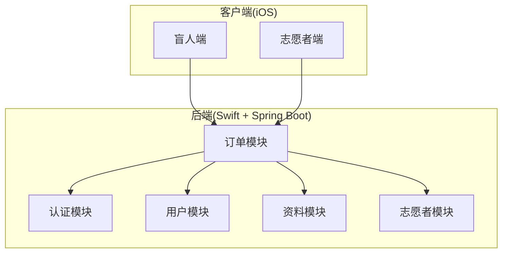
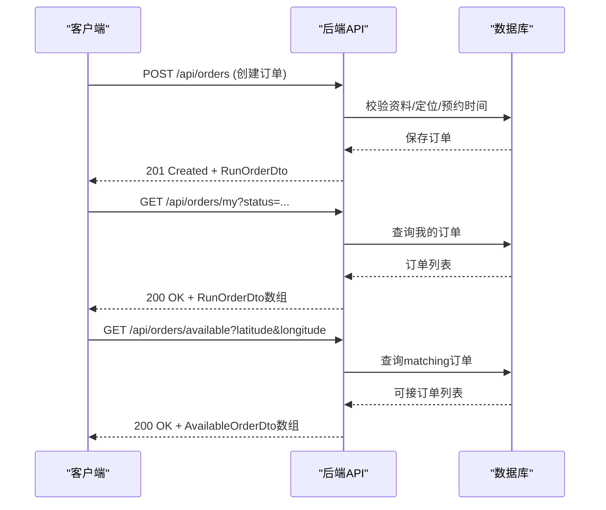
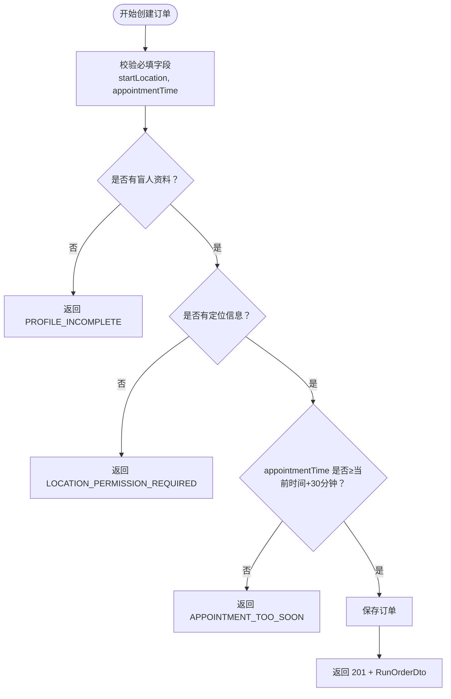
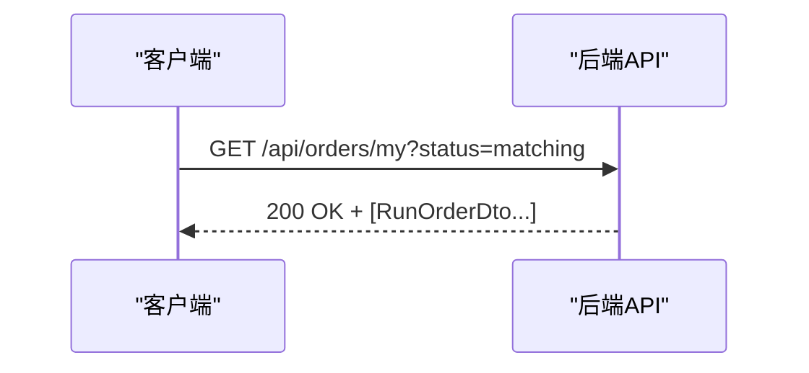
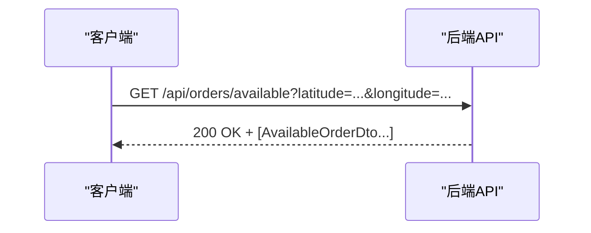
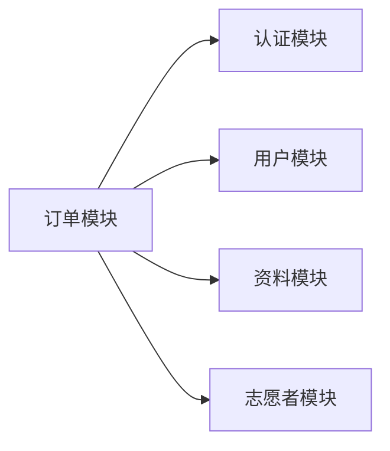

# 订单创建与查询

<cite>
**本文档引用的文件**
- [07-api-contract.openapi.yaml](file://docs/07-api-contract.openapi.yaml)
- [02-mvp-scope.md](file://docs/02-mvp-scope.md)
- [03-user-stories.md](file://docs/03-user-stories.md)
- [04-user-flows-and-state-machine.md](file://docs/04-user-flows-and-state-machine.md)
</cite>

## 目录
1. [简介](#简介)
2. [项目结构](#项目结构)
3. [核心组件](#核心组件)
4. [架构概览](#架构概览)
5. [详细组件分析](#详细组件分析)
6. [依赖关系分析](#依赖关系分析)
7. [性能考虑](#性能考虑)
8. [故障排查指南](#故障排查指南)
9. [结论](#结论)
10. [附录](#附录)

## 简介
本文件面向 iOS 客户端工程师，提供订单创建与查询接口的完整 API 文档。重点涵盖：
- 订单创建 /api/orders 的请求参数规范与约束
- 订单查询 /api/orders/my 的过滤与返回格式
- 可接订单查询 /api/orders/available 的参数与返回格式
- 错误码说明与常见错误场景
- MVP 阶段限制与未来扩展方向

## 项目结构
- 后端 API 通过 OpenAPI 3.0 文档统一定义，包含认证、用户、资料、志愿者、订单等模块。
- 订单模块提供创建、查询、状态流转、取消、求助、评分等完整能力。
- iOS 客户端基于该契约进行网络层对接与 UI 交互。

**章节来源**
- [07-api-contract.openapi.yaml:1-1117](file://docs/07-api-contract.openapi.yaml#L1-L1117)

## 核心组件
- 订单创建接口：POST /api/orders
- 我的订单查询：GET /api/orders/my
- 可接订单查询：GET /api/orders/available
- 订单详情查询：GET /api/orders/{orderId}
- 订单状态流转：accept/arrive/confirm-start/complete/cancel/emergency/rating

**章节来源**
- [07-api-contract.openapi.yaml:150-410](file://docs/07-api-contract.openapi.yaml#L150-L410)

## 架构概览
- 认证采用 Bearer JWT，所有订单相关接口均需鉴权。
- 订单状态机严格控制流转，确保数据一致性。
- iOS 侧通过轮询监控订单状态变化，实现近实时更新。

**图表来源**
- [07-api-contract.openapi.yaml:150-236](file://docs/07-api-contract.openapi.yaml#L150-L236)

**章节来源**
- [07-api-contract.openapi.yaml:150-236](file://docs/07-api-contract.openapi.yaml#L150-L236)

## 详细组件分析

### 订单创建接口 /api/orders
- 方法与路径：POST /api/orders
- 认证：Bearer JWT
- 请求体：CreateOrderRequest
- 成功响应：201 Created，返回 RunOrderDto
- 失败响应：400 Bad Request，返回 ErrorResponse

请求体字段说明（CreateOrderRequest）：
- startLocation: LocationPoint（必填）
  - latitude: 数值型，双精度，示例值
  - longitude: 数值型，双精度，示例值
  - addressText: 字符串，可空
  - source: LocationSource（必填）
- destinationText: 字符串，可选
- appointmentTime: 日期时间字符串（ISO 8601），必填
- estimatedDurationMinutes: 整数，可选
- estimatedDistanceKm: 数值型，双精度，可选
- pacePreference: 字符串，可选
- preferSameGender: 布尔值，可选
- remark: 字符串，可选

约束与规则：
- appointmentTime 必须至少为当前时间 30 分钟之后
- 必须具备盲人资料与定位信息
- 若缺少必要条件，返回相应错误码

成功响应示例：
- 状态码：201
- 响应体：RunOrderDto（包含订单 ID、状态、起始位置、预约时间、创建/更新时间等）

错误场景与错误码：
- APPOINTMENT_TOO_SOON：预约时间至少需要在 30 分钟后
- LOCATION_PERMISSION_REQUIRED：创建预约需要开启定位权限
- PROFILE_INCOMPLETE：请先完善盲人资料和紧急联系人

**图表来源**
- [07-api-contract.openapi.yaml:150-186](file://docs/07-api-contract.openapi.yaml#L150-L186)
- [07-api-contract.openapi.yaml:788-809](file://docs/07-api-contract.openapi.yaml#L788-L809)

**章节来源**
- [07-api-contract.openapi.yaml:150-186](file://docs/07-api-contract.openapi.yaml#L150-L186)
- [07-api-contract.openapi.yaml:788-809](file://docs/07-api-contract.openapi.yaml#L788-L809)
- [03-user-stories.md:242-251](file://docs/03-user-stories.md#L242-L251)

### 订单查询接口 /api/orders/my
- 方法与路径：GET /api/orders/my
- 认证：Bearer JWT
- 查询参数：
  - status: RunOrderStatus（可选），用于过滤特定状态的订单
- 成功响应：200 OK，返回 RunOrderDto 数组

过滤规则：
- 不传 status：返回所有我的订单
- 传入 status：仅返回指定状态的订单

返回格式（RunOrderDto）要点：
- 包含订单 ID、状态、起始位置、预约时间、创建/更新时间等
- volunteer 相关字段在接单后才填充（如 volunteerUserId、volunteerNickname、volunteerPhone）
- 可能包含取消、紧急事件、服务摘要、评分等嵌套对象

**图表来源**
- [07-api-contract.openapi.yaml:188-207](file://docs/07-api-contract.openapi.yaml#L188-L207)
- [07-api-contract.openapi.yaml:811-913](file://docs/07-api-contract.openapi.yaml#L811-L913)

**章节来源**
- [07-api-contract.openapi.yaml:188-207](file://docs/07-api-contract.openapi.yaml#L188-L207)
- [07-api-contract.openapi.yaml:811-913](file://docs/07-api-contract.openapi.yaml#L811-L913)

### 可接订单查询接口 /api/orders/available
- 方法与路径：GET /api/orders/available
- 认证：Bearer JWT
- 查询参数：
  - latitude: 数值型，双精度，可选
  - longitude: 数值型，双精度，可选
- 成功响应：200 OK，返回 AvailableOrderDto 数组
- 失败响应：400 Bad Request，返回 ErrorResponse（LOCATION_PERMISSION_REQUIRED）

参数说明：
- latitude/longitude 用于辅助排序（iOS 侧根据当前位置排序），后端不强制要求
- 若定位权限被拒绝，返回 LOCATION_PERMISSION_REQUIRED

返回格式（AvailableOrderDto）要点：
- 继承 RunOrderDto 的所有字段
- 在接单前，blindRunnerPhone 为空（接单后才暴露完整电话）

**图表来源**
- [07-api-contract.openapi.yaml:209-236](file://docs/07-api-contract.openapi.yaml#L209-L236)
- [07-api-contract.openapi.yaml:915-924](file://docs/07-api-contract.openapi.yaml#L915-L924)

**章节来源**
- [07-api-contract.openapi.yaml:209-236](file://docs/07-api-contract.openapi.yaml#L209-L236)
- [07-api-contract.openapi.yaml:915-924](file://docs/07-api-contract.openapi.yaml#L915-L924)

### 订单详情查询接口 /api/orders/{orderId}
- 方法与路径：GET /api/orders/{orderId}
- 认证：Bearer JWT
- 参数：orderId（UUID）
- 成功响应：200 OK，返回 RunOrderDto
- 失败响应：404 Not Found，返回 ErrorResponse（ORDER_NOT_FOUND）

用途：
- 盲人端在等待、已接单、已到达、服务中页面每 5 秒轮询
- 志愿者在详情页查看订单完整信息（接单前隐藏盲人电话）

**章节来源**
- [07-api-contract.openapi.yaml:239-254](file://docs/07-api-contract.openapi.yaml#L239-L254)
- [07-api-contract.openapi.yaml:811-913](file://docs/07-api-contract.openapi.yaml#L811-L913)

### 数据模型与枚举

#### LocationPoint
- latitude: 数值型，双精度
- longitude: 数值型，双精度
- addressText: 字符串，可空
- source: LocationSource（枚举）

#### LocationSource 枚举
- device_location：设备定位
- manual：手动输入
- demo_default：演示默认坐标

#### RunOrderStatus 枚举
- matching、accepted、arrived、in_progress、completed、cancelled、emergency

#### 错误码（ErrorCode）
- INVALID_VERIFICATION_CODE、PROFILE_INCOMPLETE、LOCATION_PERMISSION_REQUIRED、ORDER_NOT_FOUND、ORDER_ALREADY_ACCEPTED、INVALID_ORDER_STATUS、ACTIVE_ORDER_ROLE_SWITCH_BLOCKED、VOLUNTEER_NOT_AVAILABLE、VOLUNTEER_NOT_APPROVED、APPOINTMENT_TOO_SOON、UNAUTHORIZED

**章节来源**
- [07-api-contract.openapi.yaml:607-610](file://docs/07-api-contract.openapi.yaml#L607-L610)
- [07-api-contract.openapi.yaml:580-582](file://docs/07-api-contract.openapi.yaml#L580-L582)
- [07-api-contract.openapi.yaml:544-557](file://docs/07-api-contract.openapi.yaml#L544-L557)

## 依赖关系分析
- 订单模块依赖认证模块（JWT 鉴权）
- 订单模块依赖用户模块（获取当前用户信息）
- 订单模块依赖资料模块（校验盲人资料完整性）
- 订单模块依赖志愿者模块（志愿者认证状态、可服务开关）
- iOS 客户端依赖 OpenAPI 文档进行网络层生成与联调

**图表来源**
- [07-api-contract.openapi.yaml:22-23](file://docs/07-api-contract.openapi.yaml#L22-L23)

**章节来源**
- [07-api-contract.openapi.yaml:22-23](file://docs/07-api-contract.openapi.yaml#L22-L23)

## 性能考虑
- 轮询策略：iOS 侧每 5 秒轮询订单详情，避免 WebSocket 复杂度，满足 MVP 实时性需求
- 排序策略：可接订单由 iOS 侧根据当前位置排序，降低后端地理计算复杂度
- 缓存策略：客户端对常用数据（如我的订单列表）进行本地缓存，减少重复请求

[本节为通用指导，不直接分析具体文件]

## 故障排查指南
常见错误与处理建议：
- APPOINTMENT_TOO_SOON：检查 appointmentTime 是否早于当前时间+30分钟，调整预约时间
- LOCATION_PERMISSION_REQUIRED：引导用户开启定位权限，或使用设备定位/模拟定位
- PROFILE_INCOMPLETE：提示用户完善盲人资料与紧急联系人信息
- ORDER_NOT_FOUND：确认 orderId 是否正确，是否存在该订单
- ORDER_ALREADY_ACCEPTED：提示该订单已被其他志愿者接单
- INVALID_ORDER_STATUS：检查当前订单状态是否允许执行该操作
- VOLUNTEER_NOT_AVAILABLE：提示先开启可服务状态
- VOLUNTEER_NOT_APPROVED：提示先完成志愿者认证
- ACTIVE_ORDER_ROLE_SWITCH_BLOCKED：存在活跃订单时禁止切换角色

**章节来源**
- [07-api-contract.openapi.yaml:469-541](file://docs/07-api-contract.openapi.yaml#L469-L541)
- [07-api-contract.openapi.yaml:174-186](file://docs/07-api-contract.openapi.yaml#L174-L186)

## 结论
本 API 文档基于 OpenAPI 契约，明确了订单创建与查询接口的参数、约束、返回格式与错误处理。MVP 阶段通过轮询与简化流程实现了完整的预约到完成闭环，同时为未来扩展预留了空间。建议客户端在实现时严格遵循契约约束，确保用户体验与数据一致性。

[本节为总结性内容，不直接分析具体文件]

## 附录

### MVP 阶段限制与未来扩展
- 已排除功能（MVP 范围外）：Android 客户端、真实短信服务、真实实名认证、WebSocket、实时轨迹共享、AI 助手、路线导航、完整积分商城、App 内聊天、复杂风控、即时呼叫、多人活动报名、多语言国际化、iPad 专属版本、离线模式、推送通知等
- 已知限制（Demo 声明）：验证码固定为 123456、志愿者认证为 Mock 数据、GPS 使用设备当前位置、积分仅展示、后端使用 H2 内存数据库、定位依赖设备 GPS/模拟器、仅支持 iOS 16+

未来扩展方向（基于现有契约与用户故事）：
- 增强实时性：引入 WebSocket 替代轮询，或优化轮询策略
- 地理计算：后端参与距离排序，提升排序准确性
- 安全增强：真实短信服务、实名认证、风控与电子围栏
- 功能扩展：路线导航、支付、多人活动、多语言国际化、推送通知
- 无障碍优化：进一步完善 VoiceOver 与 TTS 覆盖

**章节来源**
- [02-mvp-scope.md:92-116](file://docs/02-mvp-scope.md#L92-L116)
- [02-mvp-scope.md:207-216](file://docs/02-mvp-scope.md#L207-L216)
- [03-user-stories.md:156-194](file://docs/03-user-stories.md#L156-L194)
- [04-user-flows-and-state-machine.md:120-178](file://docs/04-user-flows-and-state-machine.md#L120-L178)