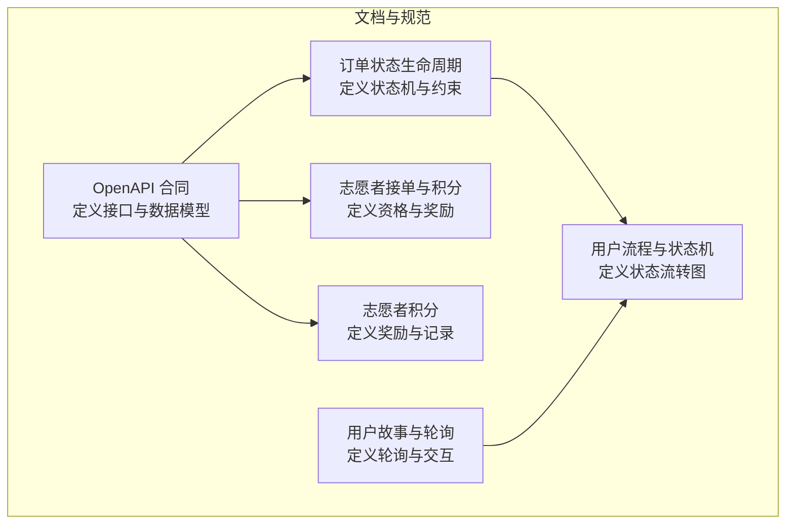
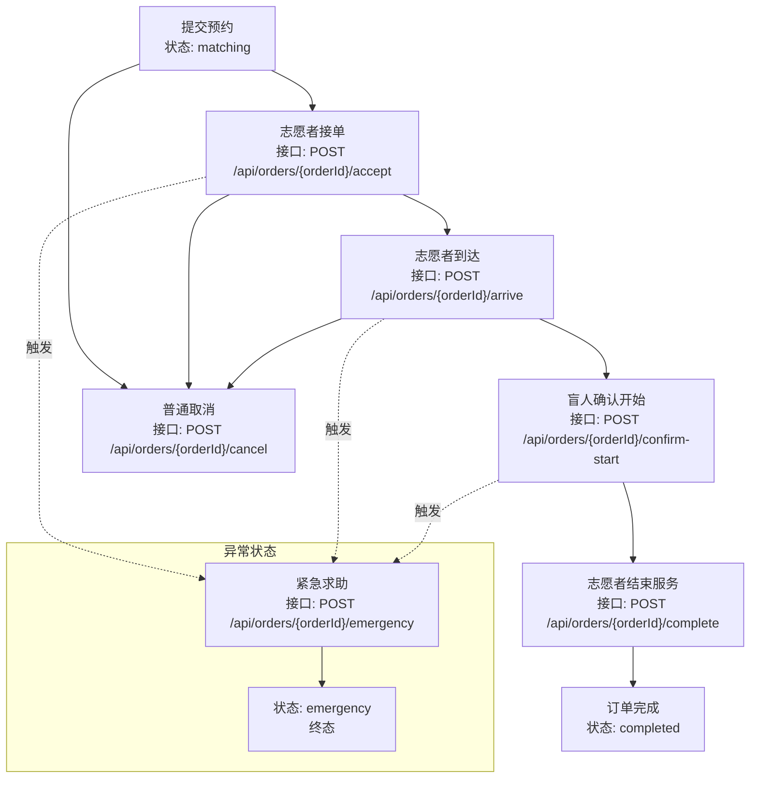
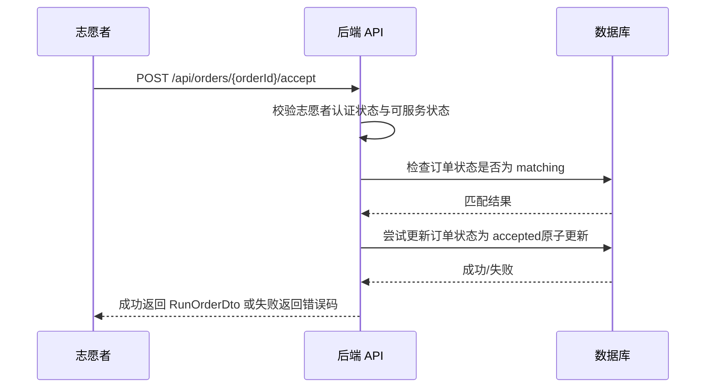
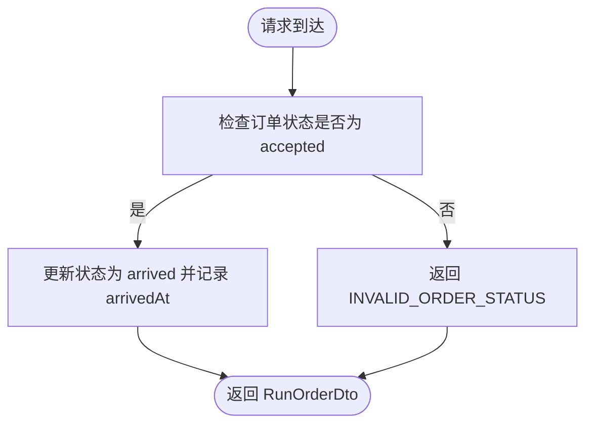
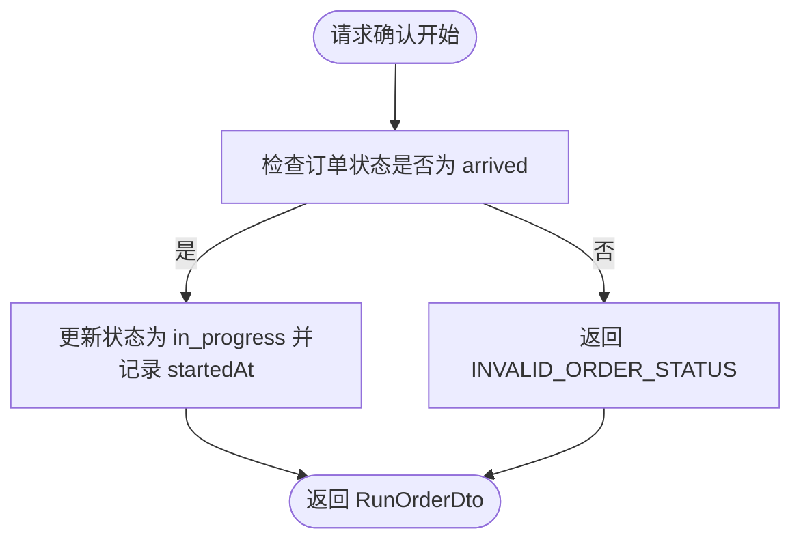
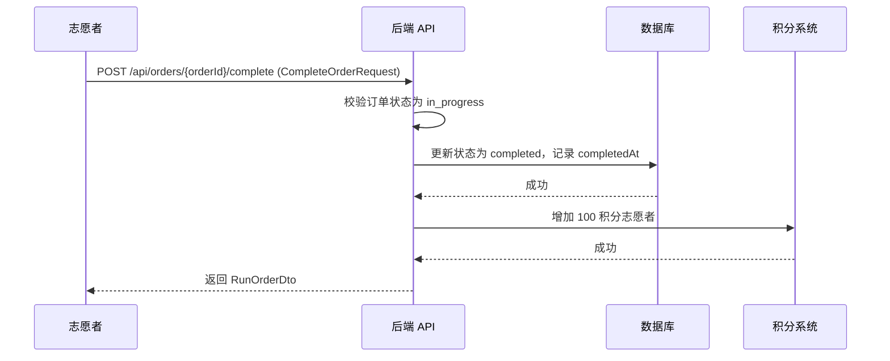
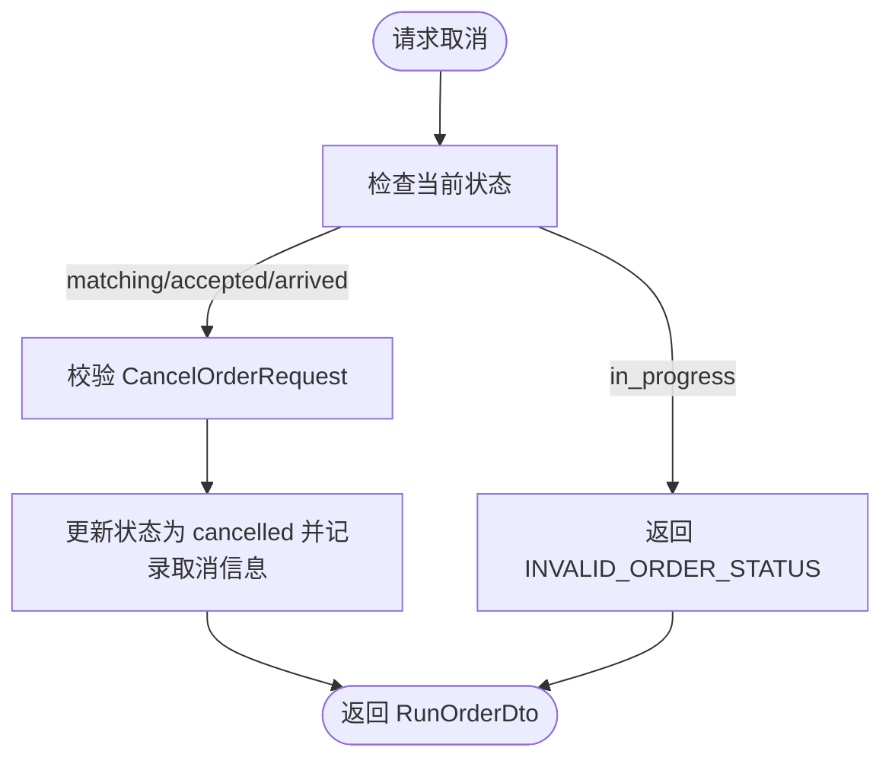
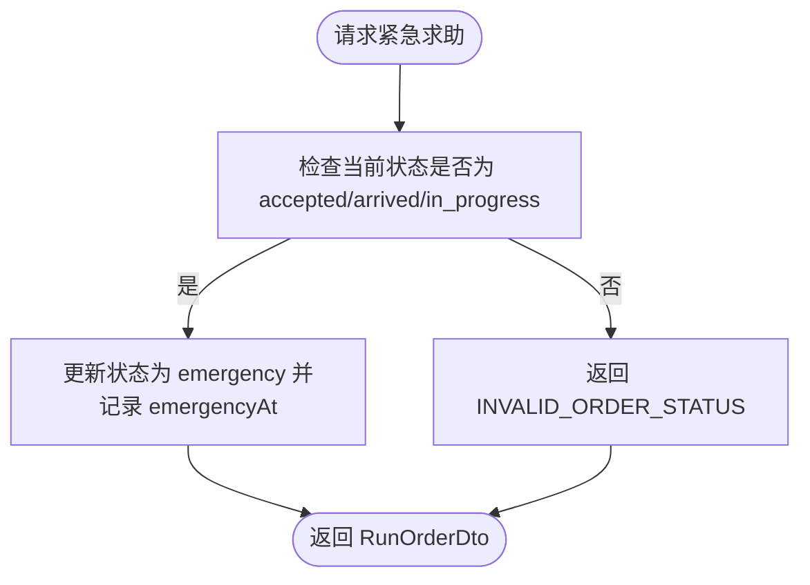
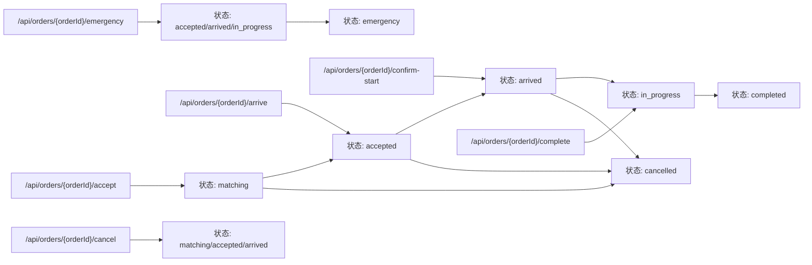

# 订单状态转换

<cite>
**本文引用的文件**
- [OpenAPI 合同](file://docs/07-api-contract.openapi.yaml)
- [订单状态生命周期](file://openspec/changes/add-aidrun-ios-spring-mvp/specs/order-status-lifecycle/spec.md)
- [志愿者接单与积分](file://openspec/changes/add-aidrun-ios-spring-mvp/specs/volunteer-order-flow/spec.md)
- [志愿者积分](file://openspec/changes/add-aidrun-ios-spring-mvp/specs/volunteer-points/spec.md)
- [用户故事与轮询](file://docs/03-user-stories.md)
- [用户流程与状态机](file://docs/04-user-flows-and-state-machine.md)
</cite>

## 目录
1. [简介](#简介)
2. [项目结构](#项目结构)
3. [核心组件](#核心组件)
4. [架构总览](#架构总览)
5. [详细组件分析](#详细组件分析)
6. [依赖关系分析](#依赖关系分析)
7. [性能考虑](#性能考虑)
8. [故障排查指南](#故障排查指南)
9. [结论](#结论)
10. [附录](#附录)

## 简介
本文件聚焦于订单状态转换相关接口的全面 API 文档，覆盖以下关键接口：
- 志愿者接单：/api/orders/{orderId}/accept
- 志愿者到达：/api/orders/{orderId}/arrive
- 盲人确认开始：/api/orders/{orderId}/confirm-start
- 志愿者结束服务：/api/orders/{orderId}/complete
- 订单取消：/api/orders/{orderId}/cancel
- 紧急求助：/api/orders/{orderId}/emergency

文档详细说明各接口的权限验证要求、状态检查逻辑、错误处理、业务约束，以及状态机图解与数据模型。

## 项目结构
本项目采用“文档驱动 + 规范先行”的方式，API 行为由 OpenAPI 合同与多份规范共同定义。与订单状态转换直接相关的文件包括：
- OpenAPI 合同：定义接口路径、请求/响应体、错误码与数据模型
- 订单状态生命周期规范：定义状态机、前置条件与禁止转换
- 志愿者接单与积分规范：定义志愿者资格与完成服务后的积分奖励
- 用户故事与轮询：定义轮询策略与交互行为
- 用户流程与状态机：提供状态流转图与序列图

**图表来源**
- [OpenAPI 合同:256-387](file://docs/07-api-contract.openapi.yaml#L256-L387)
- [订单状态生命周期:3-49](file://openspec/changes/add-aidrun-ios-spring-mvp/specs/order-status-lifecycle/spec.md#L3-L49)
- [志愿者接单与积分:3-37](file://openspec/changes/add-aidrun-ios-spring-mvp/specs/volunteer-order-flow/spec.md#L3-L37)
- [志愿者积分:3-25](file://openspec/changes/add-aidrun-ios-spring-mvp/specs/volunteer-points/spec.md#L3-L25)
- [用户故事与轮询:637-683](file://docs/03-user-stories.md#L637-L683)
- [用户流程与状态机:72-118](file://docs/04-user-flows-and-state-machine.md#L72-L118)

**章节来源**
- [OpenAPI 合同:256-387](file://docs/07-api-contract.openapi.yaml#L256-L387)
- [订单状态生命周期:3-49](file://openspec/changes/add-aidrun-ios-spring-mvp/specs/order-status-lifecycle/spec.md#L3-L49)
- [志愿者接单与积分:3-37](file://openspec/changes/add-aidrun-ios-spring-mvp/specs/volunteer-order-flow/spec.md#L3-L37)
- [志愿者积分:3-25](file://openspec/changes/add-aidrun-ios-spring-mvp/specs/volunteer-points/spec.md#L3-L25)
- [用户故事与轮询:637-683](file://docs/03-user-stories.md#L637-L683)
- [用户流程与状态机:72-118](file://docs/04-user-flows-and-state-machine.md#L72-L118)

## 核心组件
- 订单状态枚举：包含 matching、accepted、arrived、in_progress、completed、cancelled、emergency
- 订单数据模型 RunOrderDto：包含订单基本信息、状态、时间戳、取消/紧急事件/服务摘要/评分等字段
- 完成服务请求体 CompleteOrderRequest：包含 summaryText 字段
- 取消请求体 CancelOrderRequest：包含 cancelledBy 与 cancelledReason（手动取消原因枚举 ManualCancellationReason），以及可选的 otherReasonText
- 紧急请求体 EmergencyRequest：包含 note 字段
- 错误码：包含 INVALID_ORDER_STATUS、ORDER_ALREADY_ACCEPTED、VOLUNTEER_NOT_AVAILABLE、VOLUNTEER_NOT_APPROVED 等

**章节来源**
- [OpenAPI 合同:580-582](file://docs/07-api-contract.openapi.yaml#L580-L582)
- [OpenAPI 合同:811-913](file://docs/07-api-contract.openapi.yaml#L811-L913)
- [OpenAPI 合同:925-941](file://docs/07-api-contract.openapi.yaml#L925-L941)
- [OpenAPI 合同:965-970](file://docs/07-api-contract.openapi.yaml#L965-L970)
- [OpenAPI 合同:544-557](file://docs/07-api-contract.openapi.yaml#L544-L557)

## 架构总览
下图展示了订单状态转换的总体流程与关键接口之间的关系：

**图表来源**
- [用户流程与状态机:72-96](file://docs/04-user-flows-and-state-machine.md#L72-L96)
- [OpenAPI 合同:256-387](file://docs/07-api-contract.openapi.yaml#L256-L387)

## 详细组件分析

### 志愿者接单 /api/orders/{orderId}/accept
- 权限验证要求
  - 志愿者必须完成志愿者认证（Mock 认证通过后 verificationStatus 与 adminReviewStatus 均为 approved）
  - 志愿者必须开启可服务状态（isAvailable = true）
  - 若未满足上述条件，返回错误码：VOLUNTEER_NOT_APPROVED 或 VOLUNTEER_NOT_AVAILABLE
- 状态检查逻辑
  - 仅当订单状态为 matching 时允许接单
  - 若订单已被其他志愿者抢先接单，返回 ORDER_ALREADY_ACCEPTED
- 返回数据
  - 成功时返回 RunOrderDto，其中 volunteer 相关字段可见（如 volunteerUserId、volunteerNickname），并记录 acceptedAt
- 业务约束
  - 并发接单保护：后端通过乐观锁/原子更新确保同一订单仅被一个志愿者成功接单

**图表来源**
- [OpenAPI 合同:256-287](file://docs/07-api-contract.openapi.yaml#L256-L287)
- [志愿者接单与积分:3-13](file://openspec/changes/add-aidrun-ios-spring-mvp/specs/volunteer-order-flow/spec.md#L3-L13)
- [订单状态生命周期:11-17](file://openspec/changes/add-aidrun-ios-spring-mvp/specs/order-status-lifecycle/spec.md#L11-L17)

**章节来源**
- [OpenAPI 合同:256-287](file://docs/07-api-contract.openapi.yaml#L256-L287)
- [志愿者接单与积分:3-13](file://openspec/changes/add-aidrun-ios-spring-mvp/specs/volunteer-order-flow/spec.md#L3-L13)
- [订单状态生命周期:11-17](file://openspec/changes/add-aidrun-ios-spring-mvp/specs/order-status-lifecycle/spec.md#L11-L17)

### 志愿者到达 /api/orders/{orderId}/arrive
- 触发条件与前置状态
  - 仅当订单状态为 accepted 时允许志愿者到达
- 返回数据
  - 成功时返回 RunOrderDto，状态进入 arrived，并记录 arrivedAt
- 业务约束
  - 若状态不为 accepted，返回 INVALID_ORDER_STATUS

**图表来源**
- [OpenAPI 合同:289-303](file://docs/07-api-contract.openapi.yaml#L289-L303)
- [订单状态生命周期:19-25](file://openspec/changes/add-aidrun-ios-spring-mvp/specs/order-status-lifecycle/spec.md#L19-L25)

**章节来源**
- [OpenAPI 合同:289-303](file://docs/07-api-contract.openapi.yaml#L289-L303)
- [订单状态生命周期:19-25](file://openspec/changes/add-aidrun-ios-spring-mvp/specs/order-status-lifecycle/spec.md#L19-L25)

### 盲人确认开始 /api/orders/{orderId}/confirm-start
- 触发条件与前置状态
  - 仅当订单状态为 arrived 时允许盲人确认开始
- 返回数据
  - 成功时返回 RunOrderDto，状态进入 in_progress，并记录 startedAt
- 业务约束
  - 若状态不为 arrived，返回 INVALID_ORDER_STATUS

**图表来源**
- [OpenAPI 合同:305-319](file://docs/07-api-contract.openapi.yaml#L305-L319)
- [订单状态生命周期:19-25](file://openspec/changes/add-aidrun-ios-spring-mvp/specs/order-status-lifecycle/spec.md#L19-L25)

**章节来源**
- [OpenAPI 合同:305-319](file://docs/07-api-contract.openapi.yaml#L305-L319)
- [订单状态生命周期:19-25](file://openspec/changes/add-aidrun-ios-spring-mvp/specs/order-status-lifecycle/spec.md#L19-L25)

### 志愿者结束服务 /api/orders/{orderId}/complete
- 触发条件与前置状态
  - 仅当订单状态为 in_progress 时允许志愿者结束服务
- 请求体
  - CompleteOrderRequest：包含 summaryText（可选）
- 返回数据
  - 成功时返回 RunOrderDto，状态进入 completed，并记录 completedAt
  - 同时为志愿者增加 100 积分（积分奖励规则）
- 业务约束
  - 若状态不为 in_progress，返回 INVALID_ORDER_STATUS
  - 完成服务后，订单进入 completed 终态

**图表来源**
- [OpenAPI 合同:321-341](file://docs/07-api-contract.openapi.yaml#L321-L341)
- [志愿者积分:3-9](file://openspec/changes/add-aidrun-ios-spring-mvp/specs/volunteer-points/spec.md#L3-L9)
- [订单状态生命周期:19-25](file://openspec/changes/add-aidrun-ios-spring-mvp/specs/order-status-lifecycle/spec.md#L19-L25)

**章节来源**
- [OpenAPI 合同:321-341](file://docs/07-api-contract.openapi.yaml#L321-L341)
- [志愿者积分:3-9](file://openspec/changes/add-aidrun-ios-spring-mvp/specs/volunteer-points/spec.md#L3-L9)
- [订单状态生命周期:19-25](file://openspec/changes/add-aidrun-ios-spring-mvp/specs/order-status-lifecycle/spec.md#L19-L25)

### 订单取消 /api/orders/{orderId}/cancel
- 触发条件与前置状态
  - 仅允许在 matching、accepted、arrived 状态下进行普通取消
  - 若订单状态为 in_progress，不允许普通取消，只能走紧急求助
- 请求体
  - CancelOrderRequest：包含 cancelledBy（盲人/志愿者）与 cancelledReason（ManualCancellationReason 枚举），以及可选的 otherReasonText
- 返回数据
  - 成功时返回 RunOrderDto，状态进入 cancelled，并记录 cancelledAt
- 系统超时取消
  - 当订单为 matching 且距离预约开始时间不足 30 分钟而无人接单时，系统自动取消，cancelledReason = no_volunteer_available，且不记录 cancelledBy

**图表来源**
- [OpenAPI 合同:343-364](file://docs/07-api-contract.openapi.yaml#L343-L364)
- [OpenAPI 合同:588-605](file://docs/07-api-contract.openapi.yaml#L588-L605)
- [OpenAPI 合同:931-941](file://docs/07-api-contract.openapi.yaml#L931-L941)
- [订单状态生命周期:31-49](file://openspec/changes/add-aidrun-ios-spring-mvp/specs/order-status-lifecycle/spec.md#L31-L49)
- [用户故事与轮询:671-683](file://docs/03-user-stories.md#L671-L683)

**章节来源**
- [OpenAPI 合同:343-364](file://docs/07-api-contract.openapi.yaml#L343-L364)
- [OpenAPI 合同:588-605](file://docs/07-api-contract.openapi.yaml#L588-L605)
- [OpenAPI 合同:931-941](file://docs/07-api-contract.openapi.yaml#L931-L941)
- [订单状态生命周期:31-49](file://openspec/changes/add-aidrun-ios-spring-mvp/specs/order-status-lifecycle/spec.md#L31-L49)
- [用户故事与轮询:671-683](file://docs/03-user-stories.md#L671-L683)

### 紧急求助 /api/orders/{orderId}/emergency
- 触发条件与前置状态
  - 仅当订单状态为 accepted、arrived 或 in_progress 时允许触发紧急求助
- 请求体
  - EmergencyRequest：包含 note（可选）
- 返回数据
  - 成功时返回 RunOrderDto，状态进入 emergency，并记录 emergencyAt
- 业务约束
  - emergency 为终态，不支持恢复或继续执行生命周期动作
  - 在 emergency 状态下，arrive、confirm-start、complete、cancel 等生命周期动作均被拒绝（INVALID_ORDER_STATUS）

**图表来源**
- [OpenAPI 合同:366-387](file://docs/07-api-contract.openapi.yaml#L366-L387)
- [订单状态生命周期:27-29](file://openspec/changes/add-aidrun-ios-spring-mvp/specs/order-status-lifecycle/spec.md#L27-L29)
- [用户流程与状态机:230-257](file://docs/04-user-flows-and-state-machine.md#L230-L257)

**章节来源**
- [OpenAPI 合同:366-387](file://docs/07-api-contract.openapi.yaml#L366-L387)
- [订单状态生命周期:27-29](file://openspec/changes/add-aidrun-ios-spring-mvp/specs/order-status-lifecycle/spec.md#L27-L29)
- [用户流程与状态机:230-257](file://docs/04-user-flows-and-state-machine.md#L230-L257)

## 依赖关系分析
- 接口依赖状态机：各生命周期接口严格依赖当前订单状态，违反状态约束将返回 INVALID_ORDER_STATUS
- 权限依赖志愿者资格：/api/orders/{orderId}/accept 依赖志愿者认证与可服务状态
- 终态约束：emergency 与 completed/cancelled 均为终态，不支持回退或继续生命周期动作
- 轮询与状态更新：盲人端与志愿者端在关键页面按 5 秒间隔轮询订单详情以感知状态变化

**图表来源**
- [OpenAPI 合同:256-387](file://docs/07-api-contract.openapi.yaml#L256-L387)
- [用户流程与状态机:72-118](file://docs/04-user-flows-and-state-machine.md#L72-L118)

**章节来源**
- [OpenAPI 合同:256-387](file://docs/07-api-contract.openapi.yaml#L256-L387)
- [用户流程与状态机:72-118](file://docs/04-user-flows-and-state-machine.md#L72-L118)

## 性能考虑
- 轮询频率：盲人端与志愿者端在关键页面按 5 秒轮询一次，避免频繁请求带来的压力
- 状态变更广播：状态变更后立即返回最新 RunOrderDto，客户端可快速更新 UI 并播报
- 并发接单保护：通过原子更新与唯一性约束降低冲突概率，减少重试与回滚成本

**章节来源**
- [用户故事与轮询:655-667](file://docs/03-user-stories.md#L655-L667)
- [订单状态生命周期:51-57](file://openspec/changes/add-aidrun-ios-spring-mvp/specs/order-status-lifecycle/spec.md#L51-L57)

## 故障排查指南
- INVALID_ORDER_STATUS
  - 症状：调用生命周期接口返回状态不允许
  - 排查：确认当前订单状态是否符合接口前置条件；若处于 emergency 或 completed/cancelled 终态，将被拒绝
- ORDER_ALREADY_ACCEPTED
  - 症状：志愿者接单返回已被其他志愿者抢先接单
  - 排查：检查并发接单竞争；建议前端提示并刷新可用订单列表
- VOLUNTEER_NOT_AVAILABLE
  - 症状：接单接口返回请先开启可服务状态
  - 排查：检查志愿者 profile 的 isAvailable 是否为 true
- VOLUNTEER_NOT_APPROVED
  - 症状：接单接口返回请先完成志愿者认证
  - 排查：调用 Mock 认证接口，确保 verificationStatus 与 adminReviewStatus 均为 approved
- no_volunteer_available
  - 症状：matching 订单被系统自动取消
  - 排查：确认是否在预约开始前 30 分钟内无人接单；此为系统超时取消，cancelledReason = no_volunteer_available

**章节来源**
- [OpenAPI 合同:544-557](file://docs/07-api-contract.openapi.yaml#L544-L557)
- [OpenAPI 合同:276-283](file://docs/07-api-contract.openapi.yaml#L276-L283)
- [OpenAPI 合同:346-347](file://docs/07-api-contract.openapi.yaml#L346-L347)
- [订单状态生命周期:43-49](file://openspec/changes/add-aidrun-ios-spring-mvp/specs/order-status-lifecycle/spec.md#L43-L49)
- [用户故事与轮询:671-683](file://docs/03-user-stories.md#L671-L683)

## 结论
本文档基于 OpenAPI 合同与多份规范，对订单状态转换相关接口进行了系统化梳理，明确了权限验证、状态检查、错误处理与业务约束。通过状态机图与序列图，读者可以快速理解各接口的触发条件与数据流。建议在实现与联调过程中严格遵循本文档的前置条件与错误码约定，确保用户体验与系统一致性。

## 附录
- 数据模型要点
  - RunOrderDto：包含订单基础信息、状态、时间戳、取消/紧急事件/服务摘要/评分等字段
  - CompleteOrderRequest：summaryText（可选）
  - CancelOrderRequest：cancelledBy（盲人/志愿者）、cancelledReason（ManualCancellationReason）、otherReasonText（可选）
  - EmergencyRequest：note（可选）
- 状态机图（概念示意）
  - matching → accepted → arrived → in_progress → completed
  - emergency 为异常终态，不支持恢复

**章节来源**
- [OpenAPI 合同:811-913](file://docs/07-api-contract.openapi.yaml#L811-L913)
- [OpenAPI 合同:925-941](file://docs/07-api-contract.openapi.yaml#L925-L941)
- [OpenAPI 合同:965-970](file://docs/07-api-contract.openapi.yaml#L965-L970)
- [用户流程与状态机:72-96](file://docs/04-user-flows-and-state-machine.md#L72-L96)