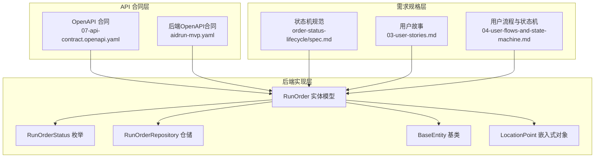
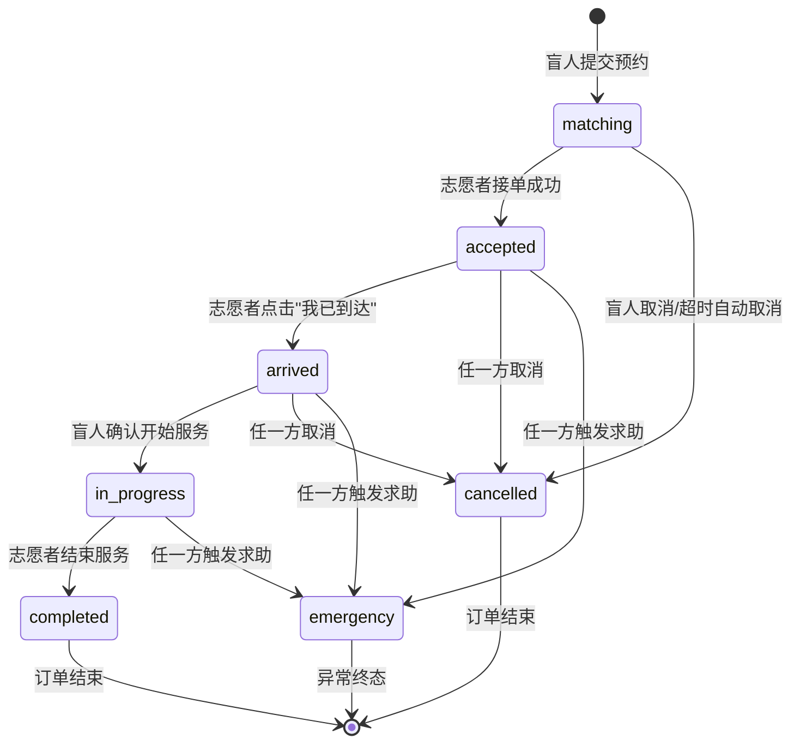
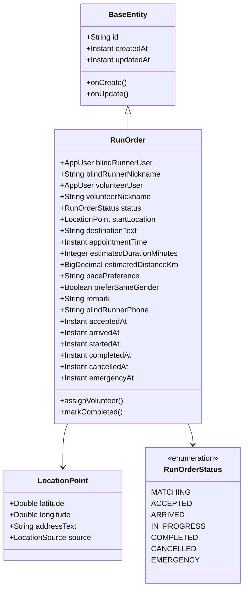
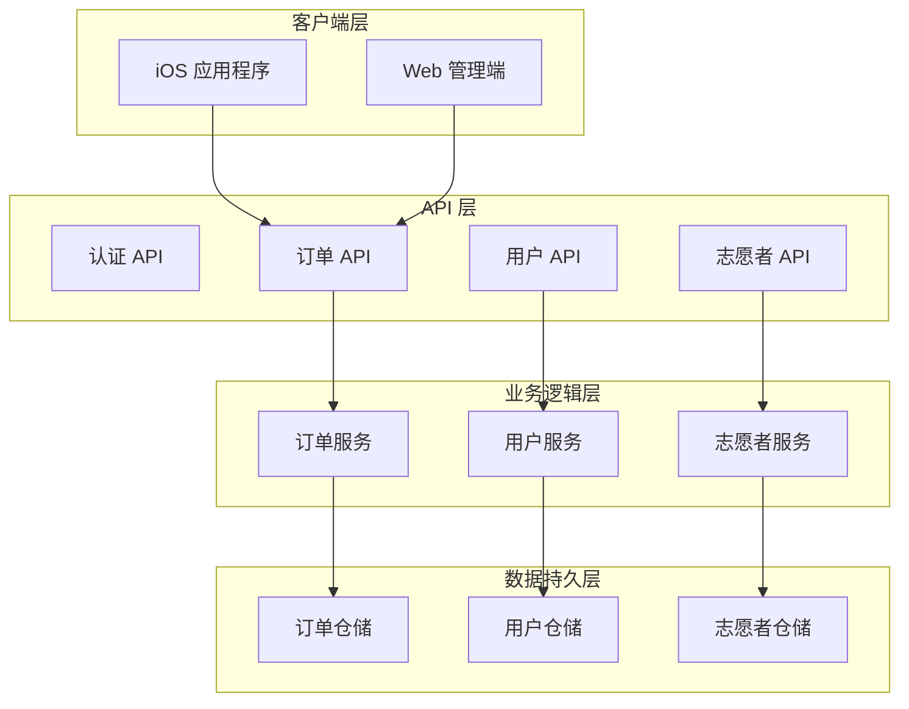
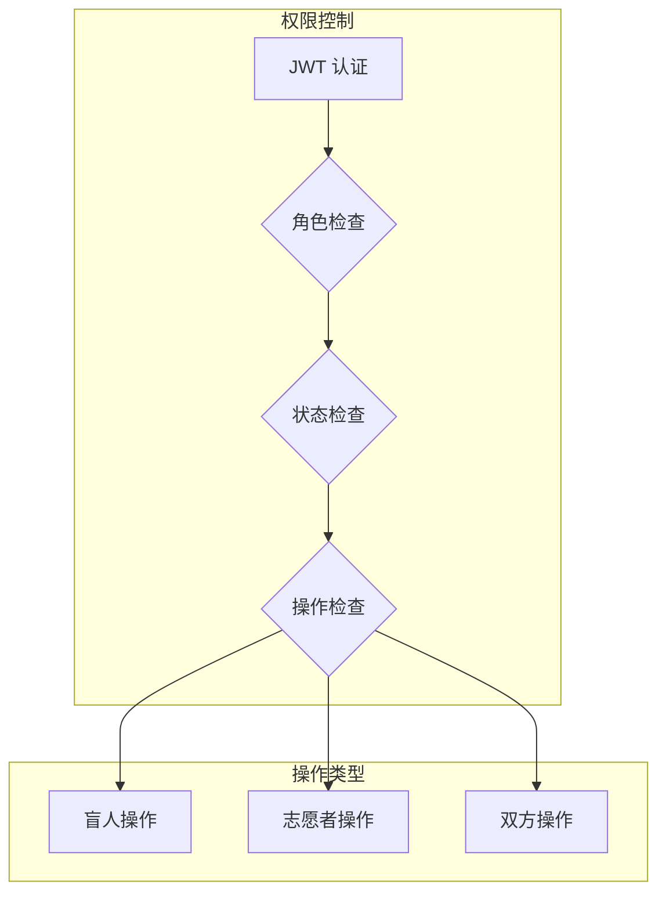
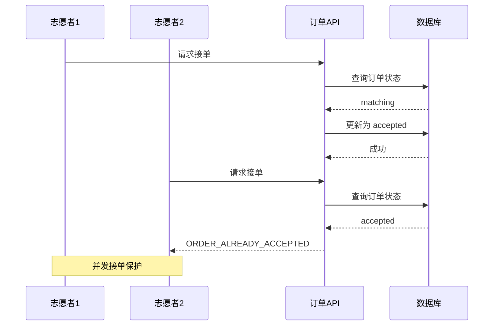

# 订单管理接口

<cite>
**本文档引用的文件**
- [07-api-contract.openapi.yaml](file://docs/07-api-contract.openapi.yaml)
- [order-status-lifecycle/spec.md](file://openspec/changes/add-aidrun-ios-spring-mvp/specs/order-status-lifecycle/spec.md)
- [04-user-flows-and-state-machine.md](file://docs/04-user-flows-and-state-machine.md)
- [03-user-stories.md](file://docs/03-user-stories.md)
- [RunOrder.java](file://backend/src/main/java/com/aidrun/backend/order/RunOrder.java)
- [RunOrderStatus.java](file://backend/src/main/java/com/aidrun/backend/order/RunOrderStatus.java)
- [RunOrderRepository.java](file://backend/src/main/java/com/aidrun/backend/order/RunOrderRepository.java)
- [BaseEntity.java](file://backend/src/main/java/com/aidrun/backend/common/BaseEntity.java)
- [LocationPoint.java](file://backend/src/main/java/com/aidrun/backend/location/LocationPoint.java)
- [aidrun-mvp.yaml](file://backend/src/main/resources/static/openapi/aidrun-mvp.yaml)
</cite>

## 更新摘要
**变更内容**
- 新增完整的后端RunOrder实体模型实现
- 添加订单状态跟踪和运营数据管理功能
- 更新订单实体的数据结构和字段定义
- 增强订单状态机的后端实现支持

## 目录
1. [简介](#简介)
2. [项目结构](#项目结构)
3. [核心组件](#核心组件)
4. [架构概览](#架构概览)
5. [详细组件分析](#详细组件分析)
6. [依赖关系分析](#依赖关系分析)
7. [性能考虑](#性能考虑)
8. [故障排除指南](#故障排除指南)
9. [结论](#结论)

## 简介

本文件为 AidRun 助盲跑项目的订单管理模块提供全面的 API 接口文档。该系统采用 Swift iOS 应用程序与 Spring Boot 后端的架构设计，专注于为视障人士提供安全、可靠的跑步陪伴服务。

订单管理模块实现了严格的订单状态机，确保服务流程的规范性和安全性。系统支持盲人跑者和志愿者两种角色，提供完整的预约、接单、服务流程管理功能。

**更新** 新增了完整的后端RunOrder实体模型实现，包含订单状态跟踪和运营数据管理功能。

## 项目结构

订单管理相关的文件组织结构如下：



**图表来源**
- [07-api-contract.openapi.yaml:1-1117](file://docs/07-api-contract.openapi.yaml#L1-L1117)
- [aidrun-mvp.yaml:811-914](file://backend/src/main/resources/static/openapi/aidrun-mvp.yaml#L811-L914)
- [RunOrder.java:18-102](file://backend/src/main/java/com/aidrun/backend/order/RunOrder.java#L18-L102)

**章节来源**
- [07-api-contract.openapi.yaml:1-1117](file://docs/07-api-contract.openapi.yaml#L1-L1117)
- [order-status-lifecycle/spec.md:1-66](file://openspec/changes/add-aidrun-ios-spring-mvp/specs/order-status-lifecycle/spec.md#L1-L66)

## 核心组件

### 订单状态机

系统实现了严格的订单状态机，确保服务流程的规范性和安全性：



**图表来源**
- [04-user-flows-and-state-machine.md:72-96](file://docs/04-user-flows-and-state-machine.md#L72-L96)

### 核心状态枚举

系统定义了以下订单状态：

| 状态值 | 描述 | 用途 |
|--------|------|------|
| `matching` | 匹配中 | 盲人提交预约后初始状态 |
| `accepted` | 已接单 | 志愿者成功接单 |
| `arrived` | 已到达 | 志愿者到达约定地点 |
| `in_progress` | 服务中 | 盲人确认开始服务 |
| `completed` | 已完成 | 服务正常结束 |
| `cancelled` | 已取消 | 订单被取消 |
| `emergency` | 紧急求助 | 出现紧急情况 |

**章节来源**
- [07-api-contract.openapi.yaml:580-582](file://docs/07-api-contract.openapi.yaml#L580-L582)
- [04-user-flows-and-state-machine.md:98-118](file://docs/04-user-flows-and-state-machine.md#L98-L118)

### RunOrder 实体模型

**更新** 新增完整的RunOrder实体模型，包含订单状态跟踪和运营数据管理功能。

RunOrder 实体模型是订单管理的核心数据结构，继承自BaseEntity并实现了完整的订单生命周期管理：



**图表来源**
- [RunOrder.java:18-102](file://backend/src/main/java/com/aidrun/backend/order/RunOrder.java#L18-L102)
- [BaseEntity.java:11-55](file://backend/src/main/java/com/aidrun/backend/common/BaseEntity.java#L11-L55)
- [LocationPoint.java:8-49](file://backend/src/main/java/com/aidrun/backend/location/LocationPoint.java#L8-L49)
- [RunOrderStatus.java:6-35](file://backend/src/main/java/com/aidrun/backend/order/RunOrderStatus.java#L6-35)

**章节来源**
- [RunOrder.java:18-102](file://backend/src/main/java/com/aidrun/backend/order/RunOrder.java#L18-L102)
- [RunOrderStatus.java:6-35](file://backend/src/main/java/com/aidrun/backend/order/RunOrderStatus.java#L6-35)
- [RunOrderRepository.java:5-8](file://backend/src/main/java/com/aidrun/backend/order/RunOrderRepository.java#L5-8)

## 架构概览

订单管理模块采用分层架构设计，确保职责分离和系统的可维护性：



**图表来源**
- [07-api-contract.openapi.yaml:16-24](file://docs/07-api-contract.openapi.yaml#L16-L24)

## 详细组件分析

### 订单创建接口

#### 接口定义
- **路径**: `/api/orders`
- **方法**: `POST`
- **标签**: Orders
- **摘要**: 创建预约订单

#### 请求参数

| 参数名称 | 类型 | 必填 | 描述 |
|----------|------|------|------|
| `startLocation` | LocationPoint | 是 | 出发地点信息 |
| `destinationText` | string | 否 | 目的地描述 |
| `appointmentTime` | datetime | 是 | 预约时间 |
| `estimatedDurationMinutes` | integer | 否 | 预计时长（分钟） |
| `estimatedDistanceKm` | number | 否 | 预计距离（公里） |
| `pacePreference` | string | 否 | 配速偏好 |
| `preferSameGender` | boolean | 否 | 是否需要同性志愿者 |
| `remark` | string | 否 | 备注信息 |

#### 约束条件

1. **时间约束**: 预约时间必须至少为当前时间 30 分钟后
2. **资料约束**: 必须有盲人资料和定位信息
3. **权限约束**: 需要有效的 JWT 认证

#### 状态初始化

订单创建成功后，系统将订单状态初始化为 `matching`，表示等待志愿者接单。

#### 错误处理

| 错误代码 | 描述 | 场景 |
|----------|------|------|
| `APPOINTMENT_TOO_SOON` | 预约时间至少需要在 30 分钟后 | 预约时间过短 |
| `LOCATION_PERMISSION_REQUIRED` | 创建预约需要开启定位权限 | 定位权限未开启 |
| `PROFILE_INCOMPLETE` | 请先完善盲人资料和紧急联系人 | 资料不完整 |

**章节来源**
- [07-api-contract.openapi.yaml:150-187](file://docs/07-api-contract.openapi.yaml#L150-L187)
- [03-user-stories.md:242-251](file://docs/03-user-stories.md#L242-L251)

### 订单查询接口

#### 获取我的订单 - `/api/orders/my`

**接口定义**
- **路径**: `/api/orders/my`
- **方法**: `GET`
- **标签**: Orders
- **摘要**: 获取我的订单

**查询参数**

| 参数名称 | 类型 | 必填 | 描述 |
|----------|------|------|------|
| `status` | RunOrderStatus | 否 | 订单状态过滤器 |

**返回格式**
- **类型**: 数组
- **元素**: RunOrderDto

**使用场景**
- 盲人端订单状态轮询
- 双方查看历史订单
- MVP 不分页设计

#### 获取可接订单 - `/api/orders/available`

**接口定义**
- **路径**: `/api/orders/available`
- **方法**: `GET`
- **标签**: Orders
- **摘要**: 获取可接订单

**查询参数**

| 参数名称 | 类型 | 必填 | 描述 |
|----------|------|------|------|
| `latitude` | number | 否 | 纬度坐标 |
| `longitude` | number | 否 | 经度坐标 |

**返回格式**
- **类型**: 数组
- **元素**: AvailableOrderDto

**错误处理**
- **400**: `LOCATION_PERMISSION_REQUIRED` - 需要定位权限

**章节来源**
- [07-api-contract.openapi.yaml:188-237](file://docs/07-api-contract.openapi.yaml#L188-L237)

### 订单详情查询

#### 接口定义
- **路径**: `/api/orders/{orderId}`
- **方法**: `GET`
- **标签**: Orders
- **摘要**: 获取订单详情

**路径参数**

| 参数名称 | 类型 | 必填 | 描述 |
|----------|------|------|------|
| `orderId` | string(uuid) | 是 | 订单唯一标识符 |

**返回格式**
- **类型**: RunOrderDto

**轮询机制**
- 盲人端在 `matching`、`accepted`、`arrived`、`in_progress` 页面每 5 秒轮询
- 用于实时状态更新和 TTS 播报

**章节来源**
- [07-api-contract.openapi.yaml:239-255](file://docs/07-api-contract.openapi.yaml#L239-L255)
- [03-user-stories.md:655-668](file://docs/03-user-stories.md#L655-L668)

### 订单状态流转接口

#### 接单接口 - `/api/orders/{orderId}/accept`

**接口定义**
- **路径**: `/api/orders/{orderId}/accept`
- **方法**: `POST`
- **标签**: Orders
- **摘要**: 志愿者接单

**前置条件**
- 订单状态必须为 `matching`
- 志愿者必须处于可服务状态 (`isAvailable = true`)
- 志愿者必须完成认证 (`verificationStatus = approved`)

**权限要求**
- 志愿者角色
- 需要有效的 JWT 认证

**错误处理**
- **400**: `VOLUNTEER_NOT_AVAILABLE` - 请先开启可服务状态
- **400**: `VOLUNTEER_NOT_APPROVED` - 请先完成志愿者认证
- **409**: `ORDER_ALREADY_ACCEPTED` - 订单已被其他志愿者接单

#### 到达接口 - `/api/orders/{orderId}/arrive`

**接口定义**
- **路径**: `/api/orders/{orderId}/arrive`
- **方法**: `POST`
- **标签**: Orders
- **摘要**: 志愿者到达

**前置条件**
- 订单状态必须为 `accepted`
- 触发者必须为志愿者

**权限要求**
- 志愿者角色

**错误处理**
- **409**: `INVALID_ORDER_STATUS` - 当前订单状态不允许该操作

#### 确认开始接口 - `/api/orders/{orderId}/confirm-start`

**接口定义**
- **路径**: `/api/orders/{orderId}/confirm-start`
- **方法**: `POST`
- **标签**: Orders
- **摘要**: 盲人确认开始

**前置条件**
- 订单状态必须为 `arrived`
- 触发者必须为盲人跑者

**权限要求**
- 盲人跑者角色

**错误处理**
- **409**: `INVALID_ORDER_STATUS` - 当前订单状态不允许该操作

#### 完成接口 - `/api/orders/{orderId}/complete`

**接口定义**
- **路径**: `/api/orders/{orderId}/complete`
- **方法**: `POST`
- **标签**: Orders
- **摘要**: 志愿者结束服务

**前置条件**
- 订单状态必须为 `in_progress`
- 触发者必须为志愿者

**权限要求**
- 志愿者角色

**返回结果**
- 状态进入 `completed`
- 志愿者获得 +100 积分

**错误处理**
- **409**: `INVALID_ORDER_STATUS` - 当前订单状态不允许该操作

#### 取消接口 - `/api/orders/{orderId}/cancel`

**接口定义**
- **路径**: `/api/orders/{orderId}/cancel`
- **方法**: `POST`
- **标签**: Orders
- **摘要**: 取消订单

**前置条件**
- 订单状态必须为 `matching`、`accepted` 或 `arrived`
- 服务开始后（`in_progress` 状态）不允许普通取消

**权限要求**
- 盲人跑者或志愿者角色

**请求参数**

| 参数名称 | 类型 | 必填 | 描述 |
|----------|------|------|------|
| `cancelledBy` | CancellationActor | 是 | 取消方（盲人/志愿者） |
| `cancelledReason` | ManualCancellationReason | 是 | 取消原因 |
| `otherReasonText` | string | 否 | 其他原因说明 |

**取消原因枚举**
- `time_conflict`: 时间冲突
- `wrong_location`: 地点错误
- `temporary_issue`: 临时问题
- `cannot_contact`: 无法联系
- `other`: 其他

**错误处理**
- **409**: `INVALID_ORDER_STATUS` - 当前订单状态不允许该操作

#### 求助接口 - `/api/orders/{orderId}/emergency`

**接口定义**
- **路径**: `/api/orders/{orderId}/emergency`
- **方法**: `POST`
- **标签**: Orders
- **摘要**: 触发求助

**前置条件**
- 订单状态必须为 `accepted`、`arrived` 或 `in_progress`
- 紧急状态为终态，MVP 不支持恢复

**权限要求**
- 盲人跑者或志愿者角色

**请求参数**

| 参数名称 | 类型 | 必填 | 描述 |
|----------|------|------|------|
| `note` | string | 否 | 求助说明 |

**状态转换**
- 从任意状态转换为 `emergency`
- 紧急状态不可恢复，保持终态

**错误处理**
- **409**: `INVALID_ORDER_STATUS` - 当前订单状态不允许该操作

**章节来源**
- [07-api-contract.openapi.yaml:256-387](file://docs/07-api-contract.openapi.yaml#L256-L387)
- [order-status-lifecycle/spec.md:11-49](file://openspec/changes/add-aidrun-ios-spring-mvp/specs/order-status-lifecycle/spec.md#L11-L49)

### 订单数据模型

#### RunOrderDto 数据结构

**更新** 基于新的RunOrder实体模型，更新了订单数据结构。

| 字段名称 | 类型 | 必填 | 描述 |
|----------|------|------|------|
| `id` | string(uuid) | 是 | 订单 ID |
| `blindRunnerUserId` | string(uuid) | 是 | 盲人用户 ID |
| `blindRunnerNickname` | string | 是 | 盲人昵称 |
| `blindRunnerPhone` | string | 否 | 盲人电话（接单后可见） |
| `volunteerUserId` | string(uuid) | 否 | 志愿者用户 ID |
| `volunteerNickname` | string | 否 | 志愿者昵称 |
| `status` | RunOrderStatus | 是 | 订单状态 |
| `startLocation` | LocationPoint | 是 | 出发地点 |
| `destinationText` | string | 否 | 目的地描述 |
| `appointmentTime` | datetime | 是 | 预约时间 |
| `estimatedDurationMinutes` | integer | 否 | 预计时长 |
| `estimatedDistanceKm` | number | 否 | 预计距离 |
| `pacePreference` | string | 否 | 配速偏好 |
| `preferSameGender` | boolean | 否 | 同性志愿者偏好 |
| `remark` | string | 否 | 备注 |
| `cancellation` | CancellationDto | 否 | 取消信息 |
| `emergencyEvent` | EmergencyEventDto | 否 | 紧急事件 |
| `serviceSummary` | ServiceSummaryDto | 否 | 服务总结 |
| `rating` | RatingDto | 否 | 评分信息 |
| `createdAt` | datetime | 是 | 创建时间 |
| `acceptedAt` | datetime | 否 | 接单时间 |
| `arrivedAt` | datetime | 否 | 到达时间 |
| `startedAt` | datetime | 否 | 开始服务时间 |
| `completedAt` | datetime | 否 | 完成时间 |
| `cancelledAt` | datetime | 否 | 取消时间 |
| `emergencyAt` | datetime | 否 | 求助时间 |
| `updatedAt` | datetime | 是 | 更新时间 |

#### LocationPoint 数据结构

| 字段名称 | 类型 | 必填 | 描述 |
|----------|------|------|------|
| `latitude` | number(double) | 是 | 纬度坐标 |
| `longitude` | number(double) | 是 | 经度坐标 |
| `addressText` | string | 否 | 地址文本 |
| `source` | LocationSource | 是 | 位置来源 |

**章节来源**
- [07-api-contract.openapi.yaml:811-914](file://docs/07-api-contract.openapi.yaml#L811-L914)
- [07-api-contract.openapi.yaml:770-786](file://docs/07-api-contract.openapi.yaml#L770-L786)

### RunOrder 实体模型详解

**更新** 新增RunOrder实体模型的详细实现分析。

RunOrder 实体模型是订单管理的核心数据结构，具有以下特点：

#### 继承关系
- 继承自 `BaseEntity`，自动获得 ID、创建时间和更新时间管理
- 支持 JPA 注解映射到数据库表 `run_orders`

#### 关键字段说明

| 字段名称 | 类型 | 描述 | 约束 |
|----------|------|------|------|
| `blindRunnerUser` | AppUser | 盲人用户关联 | 必填，多对一 |
| `blindRunnerNickname` | String | 盲人昵称 | 必填 |
| `volunteerUser` | AppUser | 志愿者用户关联 | 可选，多对一 |
| `volunteerNickname` | String | 志愿者昵称 | 可选 |
| `status` | RunOrderStatus | 订单状态 | 必填，枚举 |
| `startLocation` | LocationPoint | 出发地点 | 必填，嵌入式对象 |
| `destinationText` | String | 目的地描述 | 可选 |
| `appointmentTime` | Instant | 预约时间 | 必填 |
| `estimatedDurationMinutes` | Integer | 预计时长 | 可选 |
| `estimatedDistanceKm` | BigDecimal | 预计距离 | 可选 |
| `pacePreference` | String | 配速偏好 | 可选 |
| `preferSameGender` | Boolean | 同性偏好 | 可选 |
| `remark` | String | 备注 | 可选 |
| `blindRunnerPhone` | String | 盲人电话 | 可选 |
| `acceptedAt` | Instant | 接单时间 | 可选 |
| `arrivedAt` | Instant | 到达时间 | 可选 |
| `startedAt` | Instant | 开始服务时间 | 可选 |
| `completedAt` | Instant | 完成时间 | 可选 |
| `cancelledAt` | Instant | 取消时间 | 可选 |
| `emergencyAt` | Instant | 求助时间 | 可选 |

#### 核心方法

| 方法名称 | 描述 | 使用场景 |
|----------|------|----------|
| `assignVolunteer()` | 分配志愿者并记录接单时间 | 志愿者接单时调用 |
| `markCompleted()` | 标记订单为已完成并记录完成时间 | 服务结束后调用 |
| `getStatus()` | 获取订单状态 | 状态查询和验证 |
| `getBlindRunnerUser()` | 获取盲人用户 | 用户信息查询 |
| `getVolunteerUser()` | 获取志愿者用户 | 用户信息查询 |

**章节来源**
- [RunOrder.java:18-102](file://backend/src/main/java/com/aidrun/backend/order/RunOrder.java#L18-L102)
- [BaseEntity.java:11-55](file://backend/src/main/java/com/aidrun/backend/common/BaseEntity.java#L11-L55)
- [LocationPoint.java:8-49](file://backend/src/main/java/com/aidrun/backend/location/LocationPoint.java#L8-L49)

## 依赖关系分析

### API 依赖关系图

```mermaid
graph TB
subgraph "订单管理 API"
CreateOrder[POST /api/orders]
GetMyOrders[GET /api/orders/my]
GetAvailableOrders[GET /api/orders/available]
GetOrderDetail[GET /api/orders/{orderId}]
AcceptOrder[POST /api/orders/{orderId}/accept]
ArriveOrder[POST /api/orders/{orderId}/arrive]
ConfirmStart[POST /api/orders/{orderId}/confirm-start]
CompleteOrder[POST /api/orders/{orderId}/complete]
CancelOrder[POST /api/orders/{orderId}/cancel]
EmergencyOrder[POST /api/orders/{orderId}/emergency]
RatingOrder[POST /api/orders/{orderId}/rating]
end
subgraph "数据模型依赖"
RunOrder[RunOrder 实体]
RunOrderDto[RunOrderDto]
LocationPoint[LocationPoint]
CancellationDto[CancellationDto]
EmergencyEventDto[EmergencyEventDto]
end
subgraph "状态机依赖"
StatusEnum[RunOrderStatus]
CancellationActor[CancellationActor]
ManualCancellationReason[ManualCancellationReason]
end
CreateOrder --> RunOrder
GetMyOrders --> RunOrder
GetAvailableOrders --> RunOrder
GetOrderDetail --> RunOrder
AcceptOrder --> StatusEnum
ArriveOrder --> StatusEnum
ConfirmStart --> StatusEnum
CompleteOrder --> StatusEnum
CancelOrder --> StatusEnum
EmergencyOrder --> StatusEnum
CancelOrder --> CancellationActor
CancelOrder --> ManualCancellationReason
GetOrderDetail --> LocationPoint
GetOrderDetail --> CancellationDto
GetOrderDetail --> EmergencyEventDto
```

**图表来源**
- [07-api-contract.openapi.yaml:150-387](file://docs/07-api-contract.openapi.yaml#L150-L387)

### 权限控制依赖

系统采用基于角色的权限控制机制：



**图表来源**
- [07-api-contract.openapi.yaml:22-23](file://docs/07-api-contract.openapi.yaml#L22-L23)

**章节来源**
- [07-api-contract.openapi.yaml:150-387](file://docs/07-api-contract.openapi.yaml#L150-L387)

## 性能考虑

### 轮询优化策略

系统实现了智能轮询机制，平衡用户体验和服务器负载：

1. **轮询频率**: 每 5 秒轮询一次
2. **页面范围**: 仅在订单相关页面启用轮询
3. **状态变化检测**: 仅在状态发生变化时更新 UI
4. **TTS 播报**: 状态变化时触发语音播报

### 并发控制

系统采用乐观锁机制防止并发接单冲突：



**图表来源**
- [order-status-lifecycle/spec.md:15-17](file://openspec/changes/add-aidrun-ios-spring-mvp/specs/order-status-lifecycle/spec.md#L15-L17)

### 超时处理

系统实现智能超时机制：

1. **匹配超时**: 30 分钟内无人接单自动取消
2. **状态超时**: 系统自动处理超时场景
3. **资源清理**: 超时订单自动清理，避免资源浪费

### 数据库优化

**更新** 基于新的RunOrder实体模型，添加数据库优化考虑。

RunOrder 实体模型的数据库优化策略：

1. **索引优化**: 对常用查询字段建立索引
2. **懒加载**: 使用 `FetchType.LAZY` 优化关联查询
3. **时间戳管理**: 自动管理创建和更新时间戳
4. **状态统计**: 提供按状态统计的查询方法

**章节来源**
- [RunOrderRepository.java:7](file://backend/src/main/java/com/aidrun/backend/order/RunOrderRepository.java#L7)

## 故障排除指南

### 常见错误及解决方案

#### 认证相关错误

| 错误代码 | 描述 | 解决方案 |
|----------|------|----------|
| `UNAUTHORIZED` | 未登录或 token 无效 | 重新登录获取新 token |
| `INVALID_VERIFICATION_CODE` | 验证码错误 | 检查验证码输入是否正确 |
| `PROFILE_INCOMPLETE` | 资料不完整 | 完善盲人资料和紧急联系人信息 |

#### 订单状态错误

| 错误代码 | 描述 | 解决方案 |
|----------|------|----------|
| `ORDER_NOT_FOUND` | 订单不存在 | 检查订单 ID 是否正确 |
| `ORDER_ALREADY_ACCEPTED` | 订单已被其他志愿者接单 | 等待其他志愿者完成服务 |
| `INVALID_ORDER_STATUS` | 当前订单状态不允许该操作 | 检查当前订单状态是否符合操作要求 |

#### 业务逻辑错误

| 错误代码 | 描述 | 解决方案 |
|----------|------|----------|
| `LOCATION_PERMISSION_REQUIRED` | 需要定位权限 | 在设置中开启定位权限 |
| `VOLUNTEER_NOT_AVAILABLE` | 志愿者不可用 | 开启可服务状态 |
| `VOLUNTEER_NOT_APPROVED` | 志愿者未认证 | 完成志愿者认证流程 |

#### 系统超时错误

| 错误代码 | 描述 | 解决方案 |
|----------|------|----------|
| `APPOINTMENT_TOO_SOON` | 预约时间过短 | 将预约时间调整到 30 分钟后 |
| `ACTIVE_ORDER_ROLE_SWITCH_BLOCKED` | 存在活跃订单，禁止切换角色 | 等待当前订单完成或取消 |

### 调试建议

1. **日志记录**: 启用详细的 API 调用日志
2. **状态监控**: 实时监控订单状态变化
3. **性能监控**: 监控 API 响应时间和错误率
4. **用户反馈**: 收集用户使用过程中的问题反馈

**章节来源**
- [07-api-contract.openapi.yaml:469-541](file://docs/07-api-contract.openapi.yaml#L469-L541)
- [03-user-stories.md:637-700](file://docs/03-user-stories.md#L637-L700)

## 结论

订单管理模块通过严格的 API 设计和状态机控制，为 AidRun 项目提供了可靠的服务流程管理。系统实现了以下关键特性：

1. **严格的业务规则**: 通过状态机确保订单流程的规范性
2. **完善的权限控制**: 基于角色的细粒度权限管理
3. **智能的并发控制**: 乐观锁机制防止竞态条件
4. **友好的用户体验**: 轮询机制和 TTS 播报提升无障碍体验
5. **健壮的错误处理**: 完善的错误码和处理机制

**更新** 新的RunOrder实体模型进一步增强了系统的数据管理和状态跟踪能力，为订单生命周期的完整管理提供了坚实的后端基础。

该模块的设计充分考虑了视障用户的特殊需求，在保证功能完整性的同时，提供了优秀的无障碍体验。通过清晰的 API 文档和严格的错误处理机制，为后续的功能扩展和维护奠定了坚实的基础。