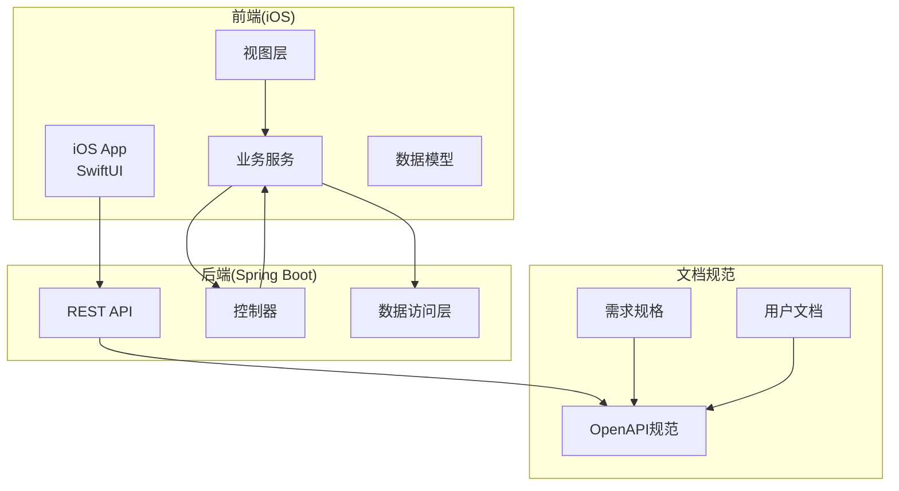
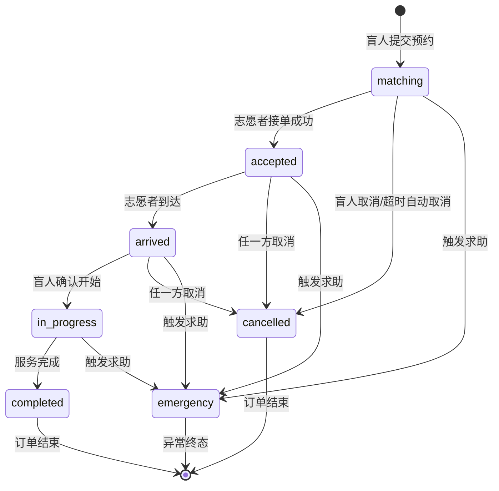
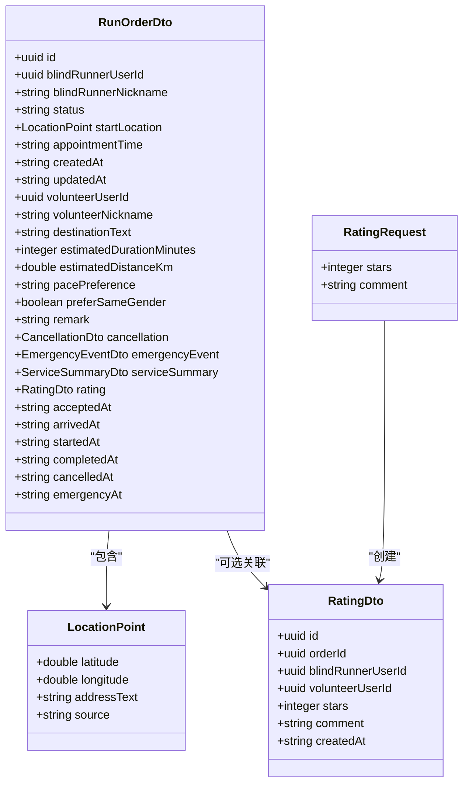
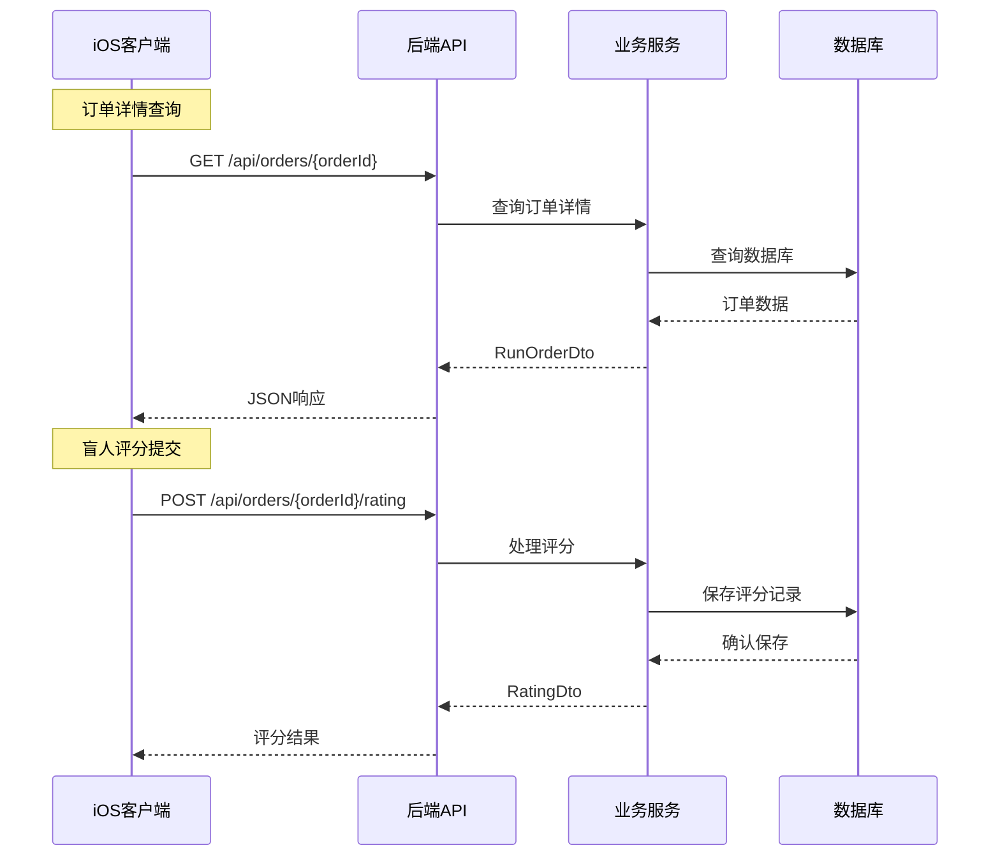
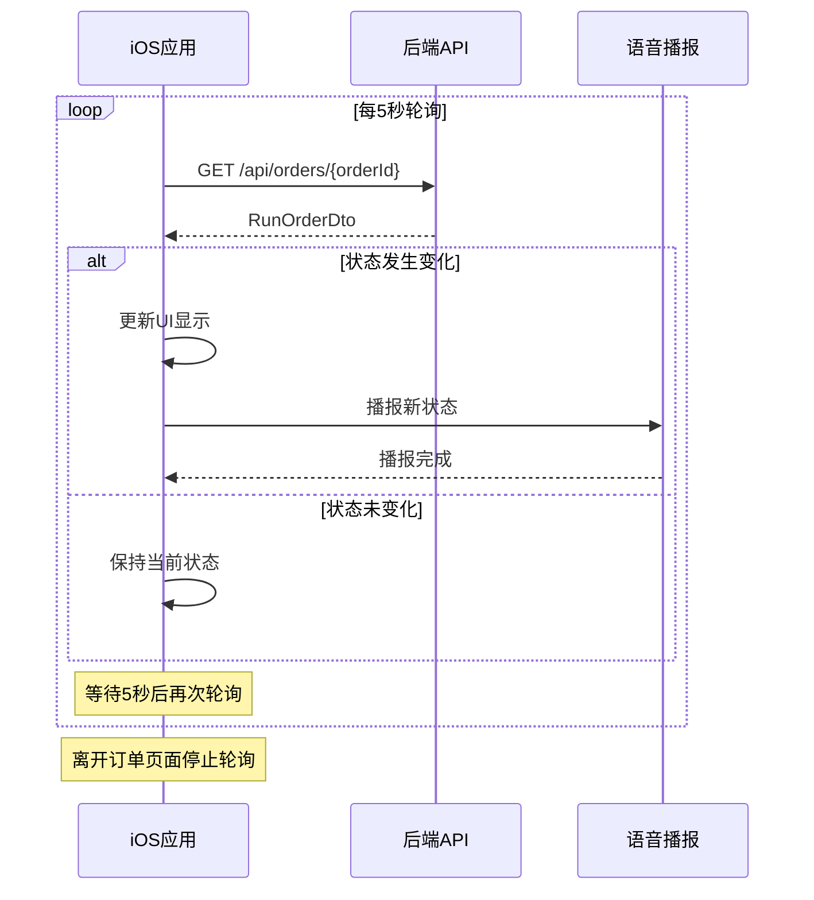
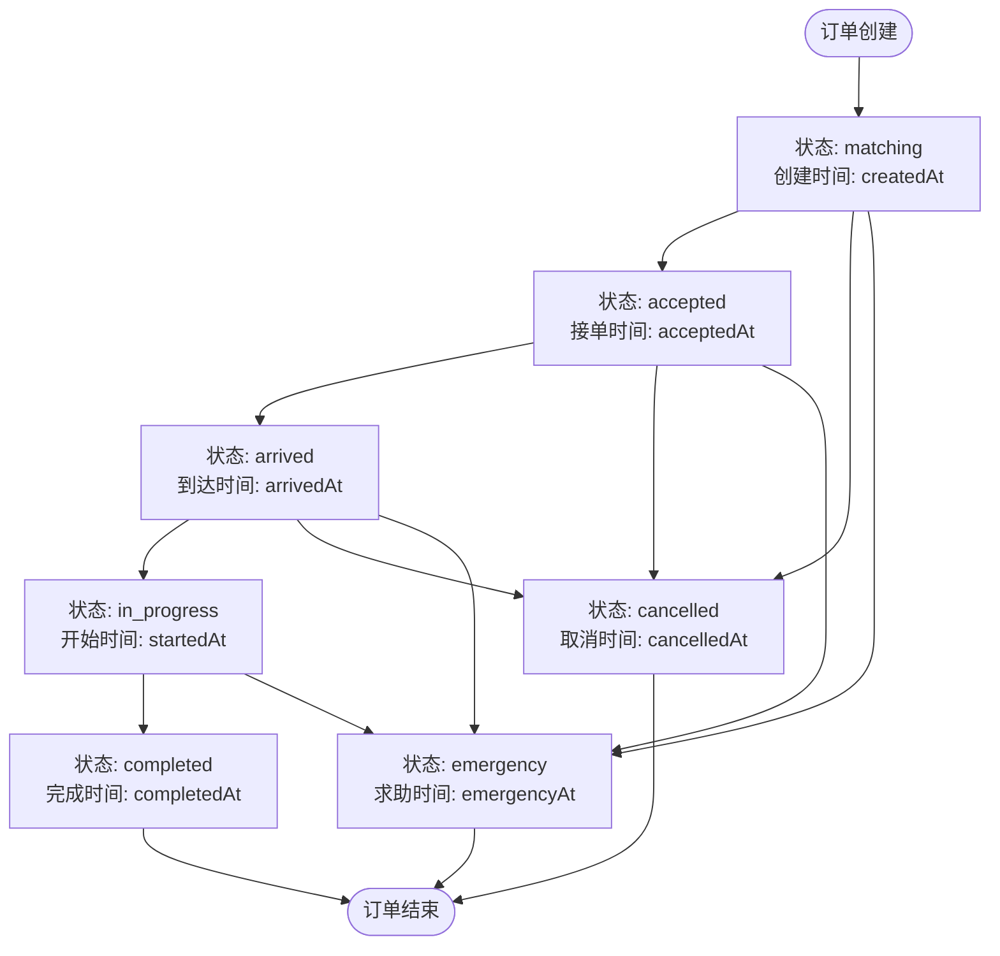

# 订单详情与评分

<cite>
**本文档引用的文件**
- [07-api-contract.openapi.yaml](file://docs/07-api-contract.openapi.yaml)
- [04-user-flows-and-state-machine.md](file://docs/04-user-flows-and-state-machine.md)
- [03-user-stories.md](file://docs/03-user-stories.md)
- [spec.md](file://openspec/changes/add-aidrun-ios-spring-mvp/specs/order-status-lifecycle/spec.md)
- [ContentView.swift](file://blindRun/ContentView.swift)
- [blindRunApp.swift](file://blindRun/blindRunApp.swift)
</cite>

## 目录
1. [简介](#简介)
2. [项目结构](#项目结构)
3. [核心组件](#核心组件)
4. [架构概览](#架构概览)
5. [详细组件分析](#详细组件分析)
6. [依赖关系分析](#依赖关系分析)
7. [性能考虑](#性能考虑)
8. [故障排除指南](#故障排除指南)
9. [结论](#结论)

## 简介

本文档详细说明了助盲跑(AidRun)项目的订单详情查询和评分接口。该系统采用MVP(最小可行产品)设计，专注于核心功能的快速验证。文档涵盖了以下关键接口：

- 订单详情查询接口 `/api/orders/{orderId}` 及其完整的数据结构 RunOrderDto
- 盲人评分接口 `/api/orders/{orderId}/rating` 及其请求体格式 RatingRequest
- 订单轮询机制的业务逻辑和实现策略
- 完整的数据模型定义、字段约束和业务规则说明

## 项目结构

该项目采用前后端分离的架构设计，主要由以下部分组成：



**图表来源**
- [07-api-contract.openapi.yaml:1-50](file://docs/07-api-contract.openapi.yaml#L1-L50)
- [04-user-flows-and-state-machine.md:1-70](file://docs/04-user-flows-and-state-machine.md#L1-L70)

**章节来源**
- [07-api-contract.openapi.yaml:1-1117](file://docs/07-api-contract.openapi.yaml#L1-L1117)
- [04-user-flows-and-state-machine.md:1-118](file://docs/04-user-flows-and-state-machine.md#L1-L118)

## 核心组件

### 订单状态生命周期

系统实现了严格的订单状态生命周期管理，确保业务流程的有序性：



**图表来源**
- [04-user-flows-and-state-machine.md:72-96](file://docs/04-user-flows-and-state-machine.md#L72-L96)

### 核心数据模型

系统定义了多个核心数据模型来支撑订单管理功能：



**图表来源**
- [07-api-contract.openapi.yaml:811-1048](file://docs/07-api-contract.openapi.yaml#L811-L1048)

**章节来源**
- [07-api-contract.openapi.yaml:811-1048](file://docs/07-api-contract.openapi.yaml#L811-L1048)

## 架构概览

系统采用RESTful API设计模式，结合MVP阶段的简化实现：



**图表来源**
- [07-api-contract.openapi.yaml:239-410](file://docs/07-api-contract.openapi.yaml#L239-L410)

**章节来源**
- [07-api-contract.openapi.yaml:239-410](file://docs/07-api-contract.openapi.yaml#L239-L410)

## 详细组件分析

### 订单详情查询接口

#### 接口定义

GET `/api/orders/{orderId}`

**请求参数:**
- `orderId` (路径参数): 订单唯一标识符，UUID格式

**响应:**
- 成功: `200 OK` 返回完整的订单详情
- 失败: `404 Not Found` 订单不存在

#### RunOrderDto 数据结构详解

RunOrderDto 是订单详情的核心数据模型，包含了订单的完整信息：

**基础信息字段:**
- `id`: 订单唯一标识符 (UUID)
- `blindRunnerUserId`: 盲人用户ID (UUID)
- `blindRunnerNickname`: 盲人昵称
- `status`: 订单当前状态 (枚举值)
- `createdAt`: 订单创建时间
- `updatedAt`: 订单最后更新时间

**位置信息字段:**
- `startLocation`: 起始位置信息 (LocationPoint对象)
- `destinationText`: 目的地文本描述
- `estimatedDurationMinutes`: 预估时长(分钟)
- `estimatedDistanceKm`: 预估距离(公里)

**预约信息字段:**
- `appointmentTime`: 预约时间
- `pacePreference`: 跑步节奏偏好
- `preferSameGender`: 是否偏好同性别志愿者
- `remark`: 备注信息

**用户关联字段:**
- `volunteerUserId`: 志愿者用户ID (可能为空)
- `volunteerNickname`: 志愿者昵称 (可能为空)
- `blindRunnerPhone`: 盲人电话号码 (仅在志愿者接单后可用)

**时间戳字段:**
- `acceptedAt`: 接单时间
- `arrivedAt`: 到达时间
- `startedAt`: 开始服务时间
- `completedAt`: 完成时间
- `cancelledAt`: 取消时间
- `emergencyAt`: 求助时间

**可选关联对象:**
- `cancellation`: 取消信息 (CancellationDto)
- `emergencyEvent`: 求助事件 (EmergencyEventDto)
- `serviceSummary`: 服务摘要 (ServiceSummaryDto)
- `rating`: 评分信息 (RatingDto)

**章节来源**
- [07-api-contract.openapi.yaml:811-914](file://docs/07-api-contract.openapi.yaml#L811-L914)

### 盲人评分接口

#### 接口定义

POST `/api/orders/{orderId}/rating`

**请求参数:**
- `orderId`: 订单唯一标识符

**请求体 (RatingRequest):**
- `stars`: 星级评分 (1-5之间的整数)
- `comment`: 评论内容 (可选)

**响应:**
- 成功: `200 OK` 返回 RatingDto
- 失败: `409 Conflict` 状态不允许评分

#### RatingRequest 请求体格式

**必填字段:**
- `stars`: 必须在1到5之间，包含边界值

**可选字段:**
- `comment`: 评分备注，最大长度限制

#### RatingDto 响应格式

**必填字段:**
- `id`: 评分记录ID (UUID)
- `orderId`: 关联订单ID (UUID)
- `blindRunnerUserId`: 评分用户ID (UUID)
- `volunteerUserId`: 被评志愿者ID (UUID)
- `stars`: 星级评分 (1-5)
- `createdAt`: 评分创建时间

**章节来源**
- [07-api-contract.openapi.yaml:1012-1048](file://docs/07-api-contract.openapi.yaml#L1012-L1048)

### 订单轮询机制

#### 轮询策略

系统采用定时轮询机制来实现实时状态更新：



**图表来源**
- [04-user-flows-and-state-machine.md:277-299](file://docs/04-user-flows-and-state-machine.md#L277-L299)

#### 轮询页面范围

| 页面类型 | 角色 | 轮询终止条件 |
|---------|------|-------------|
| 订单状态等待页 | 盲人 | 页面离开 / 订单进入终态 |
| 盲人服务中页 | 盲人 | 页面离开 / 订单进入终态 |
| 志愿者服务中页 | 志愿者 | 页面离开 / 订单进入终态 |
| 志愿者订单详情页 | 志愿者 | 页面离开 |

**章节来源**
- [04-user-flows-and-state-machine.md:275-309](file://docs/04-user-flows-and-state-machine.md#L275-L309)

### 状态历史追踪

系统提供了完整的时间戳追踪，用于记录订单状态的历史变化：



**图表来源**
- [07-api-contract.openapi.yaml:884-914](file://docs/07-api-contract.openapi.yaml#L884-L914)

**章节来源**
- [07-api-contract.openapi.yaml:884-914](file://docs/07-api-contract.openapi.yaml#L884-L914)

## 依赖关系分析

### API接口依赖关系

```mermaid
graph TB
subgraph "订单管理API"
GetOrder[GET /api/orders/{orderId}]
AcceptOrder[POST /api/orders/{orderId}/accept]
ArriveOrder[POST /api/orders/{orderId}/arrive]
ConfirmStart[POST /api/orders/{orderId}/confirm-start]
CompleteOrder[POST /api/orders/{orderId}/complete]
CancelOrder[POST /api/orders/{orderId}/cancel]
EmergencyOrder[POST /api/orders/{orderId}/emergency]
RatingOrder[POST /api/orders/{orderId}/rating]
end
subgraph "数据模型"
RunOrderDto[RunOrderDto]
RatingRequest[RatingRequest]
RatingDto[RatingDto]
LocationPoint[LocationPoint]
end
GetOrder --> RunOrderDto
AcceptOrder --> RunOrderDto
ArriveOrder --> RunOrderDto
ConfirmStart --> RunOrderDto
CompleteOrder --> RunOrderDto
CancelOrder --> RunOrderDto
EmergencyOrder --> RunOrderDto
RatingOrder --> RatingRequest
RatingOrder --> RatingDto
RunOrderDto --> LocationPoint
```

**图表来源**
- [07-api-contract.openapi.yaml:239-410](file://docs/07-api-contract.openapi.yaml#L239-L410)

### 业务规则约束

系统实现了严格的业务规则来确保数据一致性和流程正确性：

**状态转换规则:**
- 仅允许按 `matching → accepted → arrived → in_progress → completed` 的顺序转换
- `in_progress` 状态不支持普通取消，只能通过紧急求助处理
- `emergency` 状态为异常终态，不支持任何生命周期操作

**权限控制:**
- 仅志愿者可以接受 `matching` 状态的订单
- 仅盲人可以在 `in_progress` 状态确认开始服务
- 仅志愿者可以在 `in_progress` 状态结束服务

**章节来源**
- [spec.md:1-66](file://openspec/changes/add-aidrun-ios-spring-mvp/specs/order-status-lifecycle/spec.md#L1-L66)

## 性能考虑

### 轮询优化策略

由于采用轮询而非WebSocket，系统在性能方面采取了以下优化措施：

1. **合理的轮询间隔**: 5秒间隔平衡了实时性和性能消耗
2. **条件轮询**: 仅在相关页面启用轮询，离开页面自动停止
3. **增量更新**: 通过状态变化检测减少不必要的UI更新
4. **缓存策略**: 在客户端实现基本的缓存机制

### 数据传输优化

- 使用紧凑的JSON格式传输数据
- 可选字段在不需要时省略，减少响应大小
- 时间戳使用标准化的ISO格式

## 故障排除指南

### 常见问题及解决方案

**订单状态查询失败:**
- 检查 `orderId` 格式是否为有效的UUID
- 确认订单是否存在且未被删除
- 验证用户权限是否足够访问该订单

**评分提交失败:**
- 确认订单状态为 `completed`
- 检查 `stars` 字段是否在1-5范围内
- 验证用户是否有权限对订单进行评分

**轮询机制问题:**
- 确认应用在正确的页面上运行轮询
- 检查网络连接是否正常
- 验证服务器是否可达

### 错误码说明

| 错误码 | 描述 | 解决方案 |
|--------|------|----------|
| `ORDER_NOT_FOUND` | 订单不存在 | 检查订单ID是否正确 |
| `INVALID_ORDER_STATUS` | 订单状态不允许当前操作 | 检查订单当前状态 |
| `ORDER_ALREADY_ACCEPTED` | 订单已被其他志愿者接单 | 等待重新选择订单 |
| `UNAUTHORIZED` | 未授权访问 | 检查JWT令牌有效性 |

**章节来源**
- [07-api-contract.openapi.yaml:469-541](file://docs/07-api-contract.openapi.yaml#L469-L541)

## 结论

本API文档详细阐述了助盲跑项目的订单管理和评分功能。系统通过清晰的API设计、严格的状态管理和合理的轮询机制，为MVP阶段提供了稳定可靠的功能基础。

**设计亮点:**
- 清晰的订单状态生命周期管理
- 完整的数据模型定义和约束
- 实时轮询机制确保用户体验
- 严格的业务规则保障数据一致性

**MVP阶段特点:**
- 简化的技术栈便于快速开发和部署
- 轮询机制替代WebSocket降低复杂度
- 可选评分设计符合无障碍体验原则
- 完整的错误处理和状态追踪

该系统为后续功能扩展奠定了良好的基础，包括WebSocket升级、更复杂的地理位置服务集成以及增强的用户交互功能。