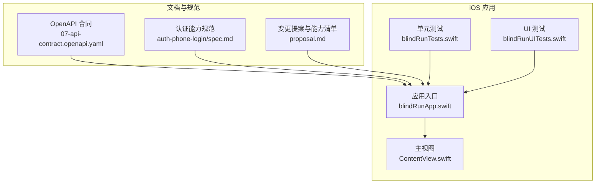
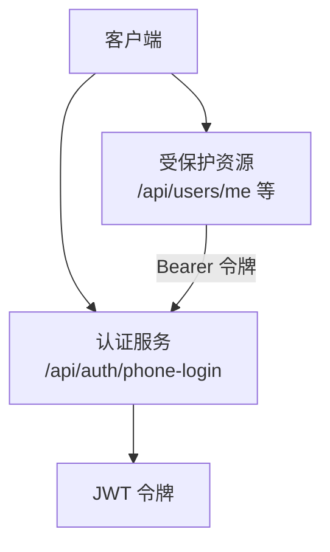
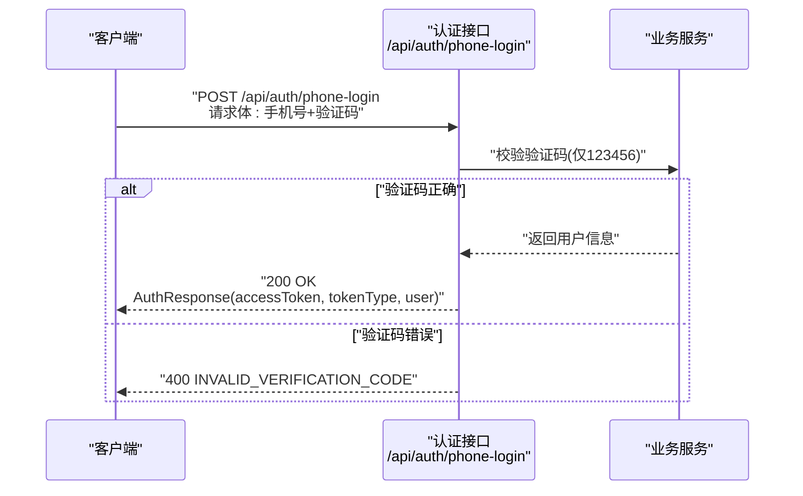
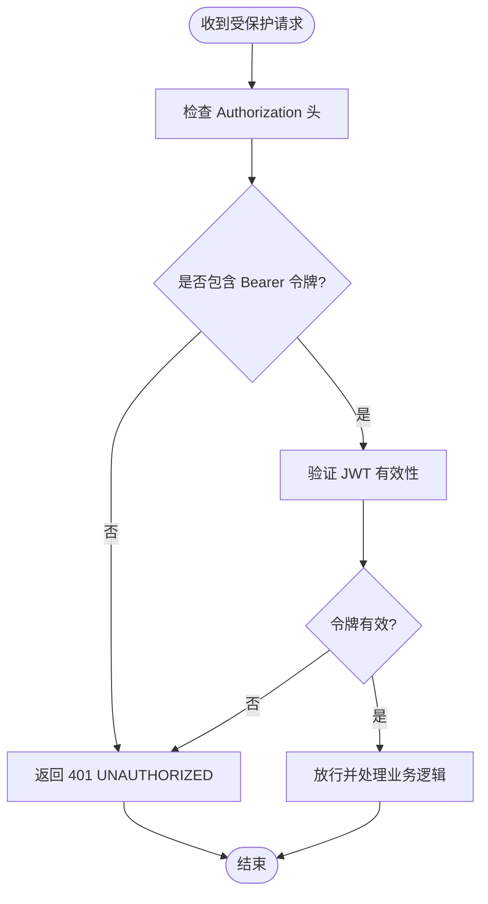
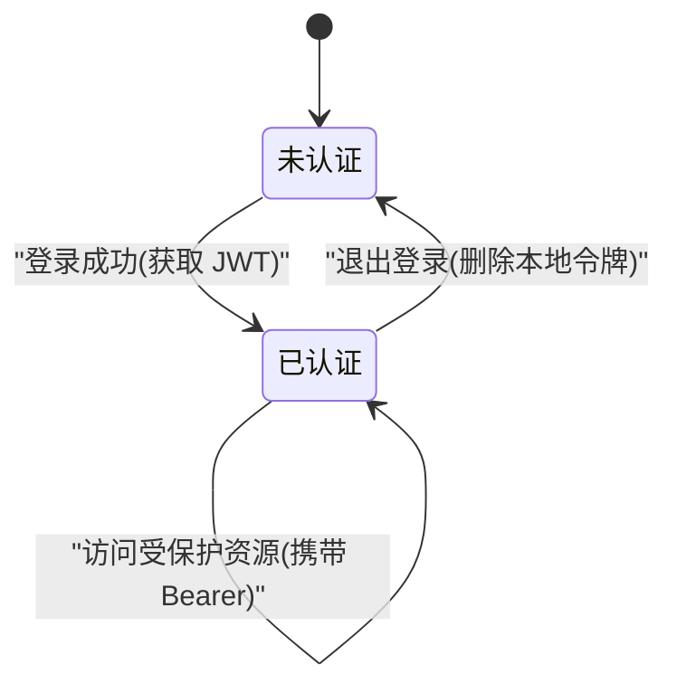
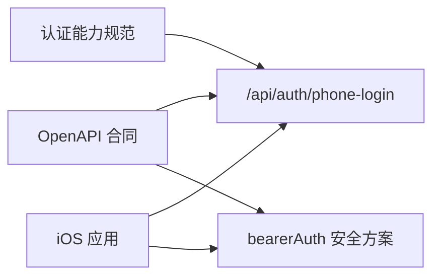

# 认证接口

<cite>
**本文引用的文件**
- [07-api-contract.openapi.yaml](file://docs/07-api-contract.openapi.yaml)
- [spec.md（认证手机号登录）](file://openspec/changes/add-aidrun-ios-spring-mvp/specs/auth-phone-login/spec.md)
- [proposal.md（能力清单与影响）](file://openspec/changes/add-aidrun-ios-spring-mvp/proposal.md)
- [ContentView.swift](file://blindRun/ContentView.swift)
- [blindRunApp.swift](file://blindRun/blindRunApp.swift)
- [blindRunTests.swift](file://blindRunTests/blindRunTests.swift)
- [blindRunUITests.swift](file://blindRunUITests/blindRunUITests.swift)
</cite>

## 目录
1. [简介](#简介)
2. [项目结构](#项目结构)
3. [核心组件](#核心组件)
4. [架构总览](#架构总览)
5. [详细组件分析](#详细组件分析)
6. [依赖关系分析](#依赖关系分析)
7. [性能考虑](#性能考虑)
8. [故障排查指南](#故障排查指南)
9. [结论](#结论)
10. [附录](#附录)

## 简介
本文件面向认证模块的 API 接口文档，重点覆盖手机号登录接口 /api/auth/phone-login 的请求参数、响应格式与使用示例；解释 JWT 令牌的生成、存储与验证机制；说明认证状态管理、自动登录流程与退出登录的实现要点；并提供完整的请求/响应示例（含成功登录与验证码错误场景）、认证中间件的安全配置与令牌过期处理策略、常见认证问题的排查方法与最佳实践建议。

## 项目结构
- 文档与规范
  - OpenAPI 合同：定义了认证路径、安全方案、数据模型与错误码
  - OpenSpec 能力规范：明确手机号登录、JWT 保护等需求
- iOS 应用骨架
  - SwiftUI 应用入口与视图，用于演示与集成认证后的界面流转
- 测试
  - 单元测试与 UI 测试模板，便于后续补充认证相关测试

**图表来源**
- [07-api-contract.openapi.yaml:1-1117](file://docs/07-api-contract.openapi.yaml#L1-L1117)
- [spec.md（认证手机号登录）:1-30](file://openspec/changes/add-aidrun-ios-spring-mvp/specs/auth-phone-login/spec.md#L1-L30)
- [proposal.md（能力清单与影响）:1-37](file://openspec/changes/add-aidrun-ios-spring-mvp/proposal.md#L1-L37)
- [blindRunApp.swift:1-18](file://blindRun/blindRunApp.swift#L1-L18)
- [ContentView.swift:1-25](file://blindRun/ContentView.swift#L1-L25)
- [blindRunTests.swift:1-39](file://blindRunTests/blindRunTests.swift#L1-L39)
- [blindRunUITests.swift:1-44](file://blindRunUITests/blindRunUITests.swift#L1-L44)

**章节来源**
- [07-api-contract.openapi.yaml:1-1117](file://docs/07-api-contract.openapi.yaml#L1-L1117)
- [spec.md（认证手机号登录）:1-30](file://openspec/changes/add-aidrun-ios-spring-mvp/specs/auth-phone-login/spec.md#L1-L30)
- [proposal.md（能力清单与影响）:1-37](file://openspec/changes/add-aidrun-ios-spring-mvp/proposal.md#L1-L37)
- [blindRunApp.swift:1-18](file://blindRun/blindRunApp.swift#L1-L18)
- [ContentView.swift:1-25](file://blindRun/ContentView.swift#L1-L25)
- [blindRunTests.swift:1-39](file://blindRunTests/blindRunTests.swift#L1-L39)
- [blindRunUITests.swift:1-44](file://blindRunUITests/blindRunUITests.swift#L1-L44)

## 核心组件
- 手机号登录接口
  - 路径：/api/auth/phone-login
  - 方法：POST
  - 安全要求：无（Demo 阶段）
  - 请求体：PhoneLoginRequest（手机号、验证码）
  - 成功响应：AuthResponse（accessToken、tokenType、user）
  - 失败响应：INVALID_VERIFICATION_CODE
- JWT 安全方案
  - 安全方案名称：bearerAuth
  - 方案类型：HTTP Bearer
  - 令牌格式：JWT
  - 默认安全要求：所有受保护路径均需携带有效 Bearer 令牌
- 数据模型
  - PhoneLoginRequest：phoneNumber、verificationCode
  - AuthResponse：accessToken、tokenType、user
  - UserDto：id、phoneNumber、roles、activeRole、createdAt、updatedAt

**章节来源**
- [07-api-contract.openapi.yaml:25-46](file://docs/07-api-contract.openapi.yaml#L25-L46)
- [07-api-contract.openapi.yaml:454-458](file://docs/07-api-contract.openapi.yaml#L454-L458)
- [07-api-contract.openapi.yaml:611-632](file://docs/07-api-contract.openapi.yaml#L611-L632)
- [07-api-contract.openapi.yaml:634-656](file://docs/07-api-contract.openapi.yaml#L634-L656)

## 架构总览
下图展示了认证流程与受保护资源的关系：客户端通过手机号登录获取 JWT，随后在后续请求中携带 Bearer 令牌访问受保护接口。

**图表来源**
- [07-api-contract.openapi.yaml:25-46](file://docs/07-api-contract.openapi.yaml#L25-L46)
- [07-api-contract.openapi.yaml:454-458](file://docs/07-api-contract.openapi.yaml#L454-L458)

## 详细组件分析

### 手机号登录接口 /api/auth/phone-login
- 请求参数
  - phoneNumber：字符串，示例值见合同
  - verificationCode：字符串，Demo 固定验证码为 123456
- 响应格式
  - 200：AuthResponse
    - accessToken：字符串，JWT 访问令牌
    - tokenType：字符串，示例为 Bearer
    - user：UserDto，包含 id、phoneNumber、roles、activeRole、createdAt、updatedAt
  - 400：INVALID_VERIFICATION_CODE 错误响应
- 行为说明
  - 首次登录自动创建用户并分配可用角色，activeRole 在角色选择前可为空
  - 已存在用户登录时返回现有用户并签发新 JWT
  - Demo 阶段仅接受固定验证码 123456，不接入真实短信

**图表来源**
- [07-api-contract.openapi.yaml:25-46](file://docs/07-api-contract.openapi.yaml#L25-L46)
- [07-api-contract.openapi.yaml:479-487](file://docs/07-api-contract.openapi.yaml#L479-L487)
- [spec.md（认证手机号登录）:7-21](file://openspec/changes/add-aidrun-ios-spring-mvp/specs/auth-phone-login/spec.md#L7-L21)

**章节来源**
- [07-api-contract.openapi.yaml:25-46](file://docs/07-api-contract.openapi.yaml#L25-L46)
- [07-api-contract.openapi.yaml:479-487](file://docs/07-api-contract.openapi.yaml#L479-L487)
- [07-api-contract.openapi.yaml:611-632](file://docs/07-api-contract.openapi.yaml#L611-L632)
- [07-api-contract.openapi.yaml:634-656](file://docs/07-api-contract.openapi.yaml#L634-L656)
- [spec.md（认证手机号登录）:7-21](file://openspec/changes/add-aidrun-ios-spring-mvp/specs/auth-phone-login/spec.md#L7-L21)

### JWT 令牌生成、存储与验证机制
- 生成与发放
  - 登录成功后返回 accessToken（JWT），tokenType 为 Bearer
- 存储
  - 建议客户端以安全方式存储（如系统钥匙串或安全存储 API），避免明文持久化
- 验证
  - 所有受保护接口默认要求携带 Authorization: Bearer <token>
  - 未携带或令牌无效时返回 UNAUTHORIZED

**图表来源**
- [07-api-contract.openapi.yaml:454-458](file://docs/07-api-contract.openapi.yaml#L454-L458)
- [07-api-contract.openapi.yaml:470-478](file://docs/07-api-contract.openapi.yaml#L470-L478)

**章节来源**
- [07-api-contract.openapi.yaml:454-458](file://docs/07-api-contract.openapi.yaml#L454-L458)
- [07-api-contract.openapi.yaml:470-478](file://docs/07-api-contract.openapi.yaml#L470-L478)

### 认证状态管理、自动登录与退出登录
- 认证状态管理
  - 客户端维护当前用户与令牌状态，结合 activeRole 实现角色切换
- 自动登录流程
  - 首次登录：提交手机号+验证码 123456，返回 JWT 并创建用户
  - 后续登录：使用相同手机号登录，返回现有用户与新 JWT
- 退出登录
  - 客户端删除本地存储的令牌与用户信息，使后续受保护请求返回 401

**图表来源**
- [spec.md（认证手机号登录）:7-13](file://openspec/changes/add-aidrun-ios-spring-mvp/specs/auth-phone-login/spec.md#L7-L13)
- [07-api-contract.openapi.yaml:64-80](file://docs/07-api-contract.openapi.yaml#L64-L80)

**章节来源**
- [spec.md（认证手机号登录）:7-13](file://openspec/changes/add-aidrun-ios-spring-mvp/specs/auth-phone-login/spec.md#L7-L13)
- [07-api-contract.openapi.yaml:64-80](file://docs/07-api-contract.openapi.yaml#L64-L80)

### 令牌过期处理策略
- 合同未定义 JWT 过期时间；建议在后端实现合理的过期策略（如短期访问令牌 + 刷新令牌机制）
- 前端在收到 401 时触发重新登录流程，或尝试刷新令牌（若实现）

**章节来源**
- [07-api-contract.openapi.yaml:454-458](file://docs/07-api-contract.openapi.yaml#L454-L458)

### 使用示例
- 成功登录示例
  - 请求
    - 方法：POST
    - 路径：/api/auth/phone-login
    - 请求体字段：phoneNumber、verificationCode（固定为 123456）
  - 响应
    - 状态码：200
    - 响应体：accessToken、tokenType、user
- 验证码错误示例
  - 请求
    - 方法：POST
    - 路径：/api/auth/phone-login
    - 请求体字段：phoneNumber、verificationCode（非 123456）
  - 响应
    - 状态码：400
    - 错误码：INVALID_VERIFICATION_CODE

**章节来源**
- [07-api-contract.openapi.yaml:25-46](file://docs/07-api-contract.openapi.yaml#L25-L46)
- [07-api-contract.openapi.yaml:479-487](file://docs/07-api-contract.openapi.yaml#L479-L487)
- [spec.md（认证手机号登录）:19-21](file://openspec/changes/add-aidrun-ios-spring-mvp/specs/auth-phone-login/spec.md#L19-L21)

## 依赖关系分析
- 认证接口依赖
  - OpenAPI 合同定义了 /api/auth/phone-login 的契约与数据模型
  - OpenSpec 能力规范明确了手机号登录与 JWT 保护的要求
- iOS 应用依赖
  - 应用入口与视图作为认证后界面流转的承载层
  - 测试文件为后续补充认证相关测试提供基础

**图表来源**
- [07-api-contract.openapi.yaml:25-46](file://docs/07-api-contract.openapi.yaml#L25-L46)
- [07-api-contract.openapi.yaml:454-458](file://docs/07-api-contract.openapi.yaml#L454-L458)
- [spec.md（认证手机号登录）:1-30](file://openspec/changes/add-aidrun-ios-spring-mvp/specs/auth-phone-login/spec.md#L1-L30)
- [proposal.md（能力清单与影响）:16-25](file://openspec/changes/add-aidrun-ios-spring-mvp/proposal.md#L16-L25)

**章节来源**
- [07-api-contract.openapi.yaml:25-46](file://docs/07-api-contract.openapi.yaml#L25-L46)
- [07-api-contract.openapi.yaml:454-458](file://docs/07-api-contract.openapi.yaml#L454-L458)
- [spec.md（认证手机号登录）:1-30](file://openspec/changes/add-aidrun-ios-spring-mvp/specs/auth-phone-login/spec.md#L1-L30)
- [proposal.md（能力清单与影响）:16-25](file://openspec/changes/add-aidrun-ios-spring-mvp/proposal.md#L16-L25)

## 性能考虑
- 令牌签发与校验应尽量轻量化，避免在高频受保护接口中引入额外开销
- 建议对登录接口进行限流与验证码校验缓存，降低后端压力
- 前端应避免频繁重复登录，采用统一的认证状态管理与令牌复用策略

## 故障排查指南
- 400 INVALID_VERIFICATION_CODE
  - 检查 verificationCode 是否为 123456
  - 确认手机号格式与网络请求正确
- 401 UNAUTHORIZED
  - 检查 Authorization 头是否包含有效的 Bearer 令牌
  - 确认令牌未过期且未被篡改
  - 若实现刷新令牌，检查刷新流程是否成功
- 登录后无法访问受保护资源
  - 确认前端已将 accessToken 正确写入 Authorization 头
  - 检查是否存在多实例或多会话导致令牌错配

**章节来源**
- [07-api-contract.openapi.yaml:479-487](file://docs/07-api-contract.openapi.yaml#L479-L487)
- [07-api-contract.openapi.yaml:470-478](file://docs/07-api-contract.openapi.yaml#L470-L478)

## 结论
本认证接口以手机号+固定验证码为核心登录方式，配合 JWT Bearer 认证保护所有受保护资源。OpenAPI 合同与 OpenSpec 规范共同定义了登录行为、令牌格式与安全策略。建议在实际实现中完善令牌过期与刷新机制，并在前端建立完善的认证状态管理与错误处理流程。

## 附录
- 相关能力与影响
  - 新增能力：auth-phone-login、role-switching、blind-runner-booking、volunteer-order-flow、order-status-lifecycle、amap-location、accessibility-voice-ui、safety-basic-emergency、volunteer-points、backend-api-contract
  - 影响范围：文档与规范层面，不包含 iOS 或后端业务代码实现

**章节来源**
- [proposal.md（能力清单与影响）:16-25](file://openspec/changes/add-aidrun-ios-spring-mvp/proposal.md#L16-L25)