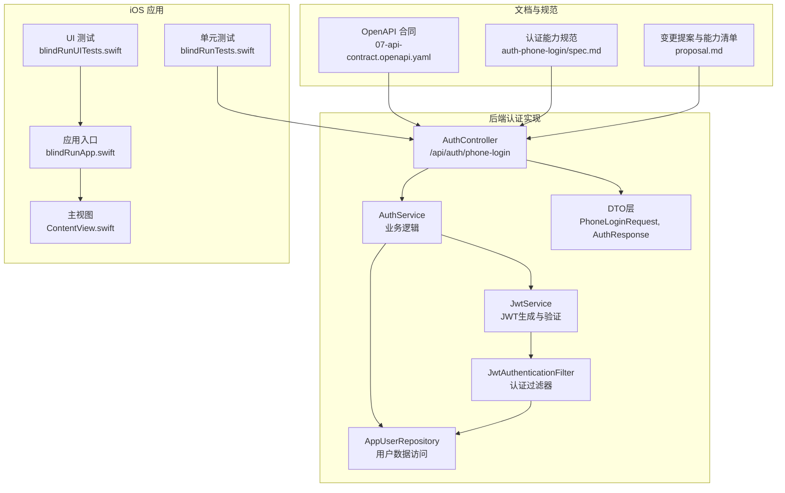
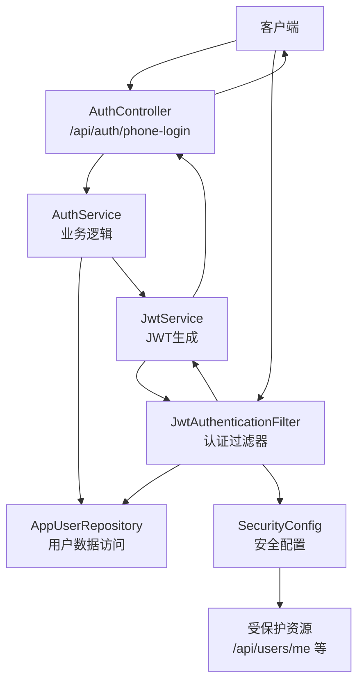
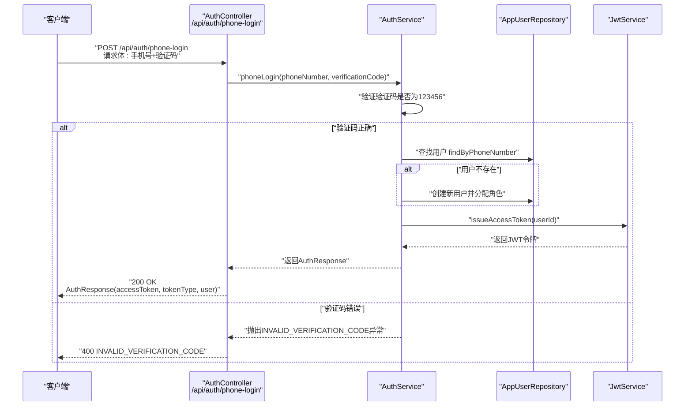
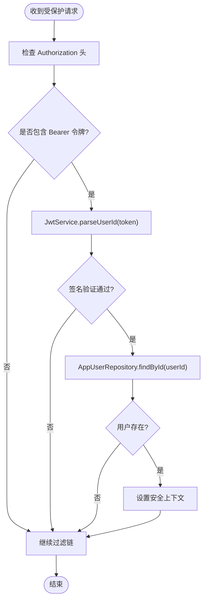
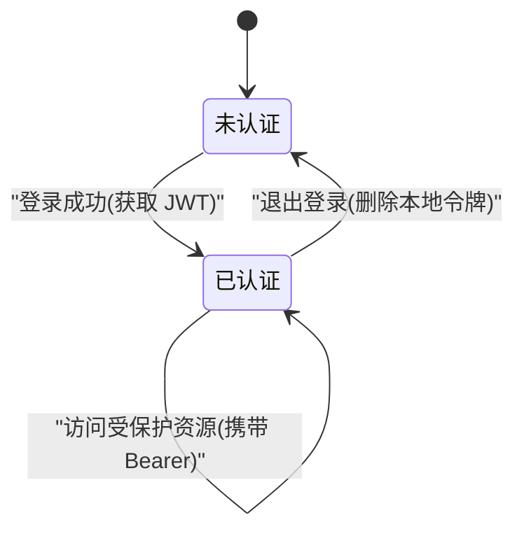
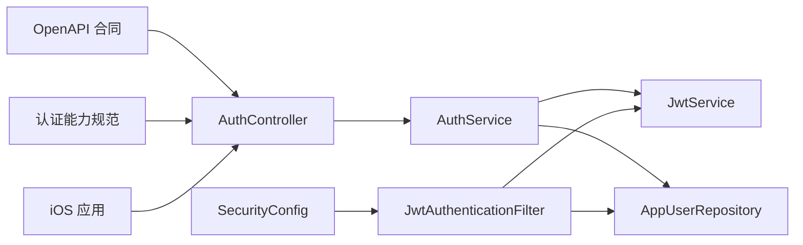

# 认证接口

<cite>
**本文引用的文件**
- [AuthController.java](file://backend/src/main/java/com/aidrun/backend/auth/AuthController.java)
- [AuthService.java](file://backend/src/main/java/com/aidrun/backend/auth/AuthService.java)
- [JwtService.java](file://backend/src/main/java/com/aidrun/backend/auth/JwtService.java)
- [JwtAuthenticationFilter.java](file://backend/src/main/java/com/aidrun/backend/auth/JwtAuthenticationFilter.java)
- [PhoneLoginRequest.java](file://backend/src/main/java/com/aidrun/backend/auth/dto/PhoneLoginRequest.java)
- [AuthResponse.java](file://backend/src/main/java/com/aidrun/backend/auth/dto/AuthResponse.java)
- [AppUser.java](file://backend/src/main/java/com/aidrun/backend/user/AppUser.java)
- [UserDto.java](file://backend/src/main/java/com/aidrun/backend/user/dto/UserDto.java)
- [application.yml](file://backend/src/main/resources/application.yml)
- [SecurityConfig.java](file://backend/src/main/java/com/aidrun/backend/config/SecurityConfig.java)
- [AuthControllerIntegrationTest.java](file://backend/src/test/java/com/aidrun/backend/auth/AuthControllerIntegrationTest.java)
- [07-api-contract.openapi.yaml](file://docs/07-api-contract.openapi.yaml)
- [spec.md（认证手机号登录）](file://openspec/changes/add-aidrun-ios-spring-mvp/specs/auth-phone-login/spec.md)
- [proposal.md（能力清单与影响）](file://openspec/changes/add-aidrun-ios-spring-mvp/proposal.md)
- [blindRunApp.swift](file://blindRun/blindRunApp.swift)
- [ContentView.swift](file://blindRun/ContentView.swift)
- [blindRunTests.swift](file://blindRunTests/blindRunTests.swift)
- [blindRunUITests.swift](file://blindRunUITests/blindRunUITests.swift)
</cite>

## 更新摘要
**所做更改**
- 新增完整的后端认证实现分析，包括控制器、服务层、JWT处理和安全配置
- 更新JWT令牌生成和验证机制的详细实现
- 添加认证中间件和过滤器的具体实现细节
- 完善认证状态管理和自动登录流程的技术实现
- 基于实际代码重构认证接口文档，确保与后端实现一致

## 目录
1. [简介](#简介)
2. [项目结构](#项目结构)
3. [核心组件](#核心组件)
4. [架构总览](#架构总览)
5. [详细组件分析](#详细组件分析)
6. [依赖关系分析](#依赖关系分析)
7. [性能考虑](#性能考虑)
8. [故障排查指南](#故障排查指南)
9. [结论](#结论)
10. [附录](#附录)

## 简介
本文件面向认证模块的 API 接口文档，基于完整的后端实现（Spring Boot + Java）详细说明手机号登录接口 /api/auth/phone-login 的请求参数、响应格式与使用示例；解释 JWT 令牌的生成、存储与验证机制；说明认证状态管理、自动登录流程与退出登录的实现要点；并提供完整的请求/响应示例（含成功登录与验证码错误场景）、认证中间件的安全配置与令牌过期处理策略、常见认证问题的排查方法与最佳实践建议。

## 项目结构
- 后端认证实现
  - 控制器层：AuthController 提供 /api/auth/phone-login 接口
  - 服务层：AuthService 处理业务逻辑和用户管理
  - 安全层：JwtService 实现 JWT 生成与验证，JwtAuthenticationFilter 处理认证过滤
  - DTO 层：PhoneLoginRequest 和 AuthResponse 数据传输对象
- 文档与规范
  - OpenAPI 合同：定义了认证路径、安全方案、数据模型与错误码
  - OpenSpec 能力规范：明确手机号登录、JWT 保护等需求
- iOS 应用骨架
  - SwiftUI 应用入口与视图，用于演示与集成认证后的界面流转
- 测试
  - 集成测试：验证认证流程的正确性和边界条件

**图表来源**
- [AuthController.java:12-27](file://backend/src/main/java/com/aidrun/backend/auth/AuthController.java#L12-L27)
- [AuthService.java:16-48](file://backend/src/main/java/com/aidrun/backend/auth/AuthService.java#L16-L48)
- [JwtService.java:17-107](file://backend/src/main/java/com/aidrun/backend/auth/JwtService.java#L17-L107)
- [JwtAuthenticationFilter.java:17-62](file://backend/src/main/java/com/aidrun/backend/auth/JwtAuthenticationFilter.java#L17-L62)
- [07-api-contract.openapi.yaml:1-1117](file://docs/07-api-contract.openapi.yaml#L1-L1117)
- [spec.md（认证手机号登录）:1-30](file://openspec/changes/add-aidrun-ios-spring-mvp/specs/auth-phone-login/spec.md#L1-L30)
- [proposal.md（能力清单与影响）:1-37](file://openspec/changes/add-aidrun-ios-spring-mvp/proposal.md#L1-L37)
- [blindRunApp.swift:1-18](file://blindRun/blindRunApp.swift#L1-L18)
- [ContentView.swift:1-25](file://blindRun/ContentView.swift#L1-L25)
- [blindRunTests.swift:1-39](file://blindRunTests/blindRunTests.swift#L1-L39)
- [blindRunUITests.swift:1-44](file://blindRunUITests/blindRunUITests.swift#L1-L44)

**章节来源**
- [AuthController.java:12-27](file://backend/src/main/java/com/aidrun/backend/auth/AuthController.java#L12-L27)
- [AuthService.java:16-48](file://backend/src/main/java/com/aidrun/backend/auth/AuthService.java#L16-L48)
- [JwtService.java:17-107](file://backend/src/main/java/com/aidrun/backend/auth/JwtService.java#L17-L107)
- [JwtAuthenticationFilter.java:17-62](file://backend/src/main/java/com/aidrun/backend/auth/JwtAuthenticationFilter.java#L17-L62)
- [07-api-contract.openapi.yaml:1-1117](file://docs/07-api-contract.openapi.yaml#L1-L1117)
- [spec.md（认证手机号登录）:1-30](file://openspec/changes/add-aidrun-ios-spring-mvp/specs/auth-phone-login/spec.md#L1-L30)
- [proposal.md（能力清单与影响）:1-37](file://openspec/changes/add-aidrun-ios-spring-mvp/proposal.md#L1-L37)
- [blindRunApp.swift:1-18](file://blindRun/blindRunApp.swift#L1-L18)
- [ContentView.swift:1-25](file://blindRun/ContentView.swift#L1-L25)
- [blindRunTests.swift:1-39](file://blindRunTests/blindRunTests.swift#L1-L39)
- [blindRunUITests.swift:1-44](file://blindRunUITests/blindRunUITests.swift#L1-L44)

## 核心组件
- 手机号登录接口
  - 路径：/api/auth/phone-login
  - 方法：POST
  - 安全要求：无（Demo 阶段）
  - 请求体：PhoneLoginRequest（手机号、验证码）
  - 成功响应：AuthResponse（accessToken、tokenType、user）
  - 失败响应：INVALID_VERIFICATION_CODE
- JWT 安全方案
  - 安全方案名称：bearerAuth
  - 方案类型：HTTP Bearer
  - 令牌格式：JWT
  - 默认安全要求：所有受保护路径均需携带有效 Bearer 令牌
- 数据模型
  - PhoneLoginRequest：phoneNumber、verificationCode
  - AuthResponse：accessToken、tokenType、user
  - UserDto：id、phoneNumber、roles、activeRole、createdAt、updatedAt
- 认证过滤器
  - JwtAuthenticationFilter：处理 Authorization 头，验证 JWT 有效性
  - JwtService：实现 JWT 生成、解析和签名验证

**章节来源**
- [AuthController.java:22-26](file://backend/src/main/java/com/aidrun/backend/auth/AuthController.java#L22-L26)
- [AuthService.java:29-47](file://backend/src/main/java/com/aidrun/backend/auth/AuthService.java#L29-L47)
- [JwtService.java:38-78](file://backend/src/main/java/com/aidrun/backend/auth/JwtService.java#L38-L78)
- [JwtAuthenticationFilter.java:30-61](file://backend/src/main/java/com/aidrun/backend/auth/JwtAuthenticationFilter.java#L30-L61)
- [PhoneLoginRequest.java:5-9](file://backend/src/main/java/com/aidrun/backend/auth/dto/PhoneLoginRequest.java#L5-L9)
- [AuthResponse.java:5-10](file://backend/src/main/java/com/aidrun/backend/auth/dto/AuthResponse.java#L5-L10)
- [UserDto.java:8-27](file://backend/src/main/java/com/aidrun/backend/user/dto/UserDto.java#L8-L27)

## 架构总览
下图展示了基于 Spring Security 的认证流程：客户端通过手机号登录获取 JWT，随后在后续请求中携带 Bearer 令牌，由 JwtAuthenticationFilter 进行验证并设置安全上下文。

**图表来源**
- [AuthController.java:12-27](file://backend/src/main/java/com/aidrun/backend/auth/AuthController.java#L12-L27)
- [AuthService.java:16-48](file://backend/src/main/java/com/aidrun/backend/auth/AuthService.java#L16-L48)
- [JwtService.java:17-107](file://backend/src/main/java/com/aidrun/backend/auth/JwtService.java#L17-L107)
- [JwtAuthenticationFilter.java:17-62](file://backend/src/main/java/com/aidrun/backend/auth/JwtAuthenticationFilter.java#L17-L62)
- [SecurityConfig.java:28-53](file://backend/src/main/java/com/aidrun/backend/config/SecurityConfig.java#L28-L53)

## 详细组件分析

### 手机号登录接口 /api/auth/phone-login
- 请求参数
  - phoneNumber：字符串，必填，手机号码
  - verificationCode：字符串，必填，验证码
- 响应格式
  - 200：AuthResponse
    - accessToken：字符串，JWT 访问令牌
    - tokenType：字符串，示例为 Bearer
    - user：UserDto，包含 id、phoneNumber、roles、activeRole、createdAt、updatedAt
  - 400：INVALID_VERIFICATION_CODE 错误响应
- 行为说明
  - 验证码校验：仅接受固定验证码 "123456"
  - 用户管理：首次登录自动创建用户并分配 BLIND_RUNNER 和 VOLUNTEER 角色
  - JWT 发放：为用户签发访问令牌
  - 返回现有用户：已存在用户登录时返回现有用户并签发新 JWT

**图表来源**
- [AuthController.java:22-26](file://backend/src/main/java/com/aidrun/backend/auth/AuthController.java#L22-L26)
- [AuthService.java:29-47](file://backend/src/main/java/com/aidrun/backend/auth/AuthService.java#L29-L47)
- [JwtService.java:38-54](file://backend/src/main/java/com/aidrun/backend/auth/JwtService.java#L38-L54)

**章节来源**
- [AuthController.java:22-26](file://backend/src/main/java/com/aidrun/backend/auth/AuthController.java#L22-L26)
- [AuthService.java:29-47](file://backend/src/main/java/com/aidrun/backend/auth/AuthService.java#L29-L47)
- [PhoneLoginRequest.java:5-9](file://backend/src/main/java/com/aidrun/backend/auth/dto/PhoneLoginRequest.java#L5-L9)
- [AuthResponse.java:5-10](file://backend/src/main/java/com/aidrun/backend/auth/dto/AuthResponse.java#L5-L10)
- [UserDto.java:8-27](file://backend/src/main/java/com/aidrun/backend/user/dto/UserDto.java#L8-L27)

### JWT 令牌生成、存储与验证机制
- 生成与发放
  - 登录成功后返回 accessToken（JWT），tokenType 为 Bearer
  - 使用 HS256 算法和对称密钥进行签名
  - 令牌包含标准声明：iss（发行者）、sub（主题用户ID）、iat（发行时间）
- 存储
  - 建议客户端以安全方式存储（如系统钥匙串或安全存储 API），避免明文持久化
- 验证
  - JwtAuthenticationFilter 检查 Authorization 头并提取 Bearer 令牌
  - JwtService 验证签名完整性并解析用户ID
  - Spring Security 将用户设置到安全上下文中

**图表来源**
- [JwtAuthenticationFilter.java:30-61](file://backend/src/main/java/com/aidrun/backend/auth/JwtAuthenticationFilter.java#L30-L61)
- [JwtService.java:56-78](file://backend/src/main/java/com/aidrun/backend/auth/JwtService.java#L56-L78)

**章节来源**
- [JwtService.java:38-78](file://backend/src/main/java/com/aidrun/backend/auth/JwtService.java#L38-L78)
- [JwtAuthenticationFilter.java:30-61](file://backend/src/main/java/com/aidrun/backend/auth/JwtAuthenticationFilter.java#L30-L61)
- [application.yml:30-34](file://backend/src/main/resources/application.yml#L30-L34)

### 认证状态管理、自动登录与退出登录
- 认证状态管理
  - 客户端维护当前用户与令牌状态，结合 activeRole 实现角色切换
  - Spring Security 使用无状态会话管理（STATELESS）
- 自动登录流程
  - 首次登录：提交手机号+验证码 "123456"，返回 JWT 并创建用户
  - 后续登录：使用相同手机号登录，返回现有用户与新 JWT
- 退出登录
  - 客户端删除本地存储的令牌与用户信息，使后续受保护请求返回 401

**图表来源**
- [AuthService.java:35-46](file://backend/src/main/java/com/aidrun/backend/auth/AuthService.java#L35-L46)
- [SecurityConfig.java:32](file://backend/src/main/java/com/aidrun/backend/config/SecurityConfig.java#L32)

**章节来源**
- [AuthService.java:35-46](file://backend/src/main/java/com/aidrun/backend/auth/AuthService.java#L35-L46)
- [SecurityConfig.java:32](file://backend/src/main/java/com/aidrun/backend/config/SecurityConfig.java#L32)

### 令牌过期处理策略
- 当前实现
  - JWT 令牌包含 iat（发行时间）声明，但未设置 exp（过期时间）
  - 建议在生产环境中添加过期时间控制
- 前端处理
  - 收到 401 时触发重新登录流程
  - 可扩展实现令牌刷新机制

**章节来源**
- [JwtService.java:44-48](file://backend/src/main/java/com/aidrun/backend/auth/JwtService.java#L44-L48)
- [SecurityConfig.java:44-49](file://backend/src/main/java/com/aidrun/backend/config/SecurityConfig.java#L44-L49)

### 使用示例
- 成功登录示例
  - 请求
    - 方法：POST
    - 路径：/api/auth/phone-login
    - 请求体字段：phoneNumber、verificationCode（固定为 123456）
  - 响应
    - 状态码：200
    - 响应体：accessToken（JWT）、tokenType、user
- 验证码错误示例
  - 请求
    - 方法：POST
    - 路径：/api/auth/phone-login
    - 请求体字段：phoneNumber、verificationCode（非 123456）
  - 响应
    - 状态码：400
    - 错误码：INVALID_VERIFICATION_CODE

**章节来源**
- [AuthControllerIntegrationTest.java:22-52](file://backend/src/test/java/com/aidrun/backend/auth/AuthControllerIntegrationTest.java#L22-L52)
- [AuthControllerIntegrationTest.java:54-90](file://backend/src/test/java/com/aidrun/backend/auth/AuthControllerIntegrationTest.java#L54-L90)

## 依赖关系分析
- 认证接口依赖
  - AuthController 依赖 AuthService 提供业务逻辑
  - AuthService 依赖 JwtService 生成令牌和 AppUserRepository 管理用户
  - JwtAuthenticationFilter 依赖 JwtService 和 AppUserRepository 进行认证
  - SecurityConfig 配置 Spring Security 过滤器链
- 文档与规范依赖
  - OpenAPI 合同定义了 /api/auth/phone-login 的契约与数据模型
  - OpenSpec 能力规范明确了手机号登录与 JWT 保护的要求
- iOS 应用依赖
  - 应用入口与视图作为认证后界面流转的承载层
  - 测试文件为后续补充认证相关测试提供基础

**图表来源**
- [AuthController.java:16-20](file://backend/src/main/java/com/aidrun/backend/auth/AuthController.java#L16-L20)
- [AuthService.java:21-27](file://backend/src/main/java/com/aidrun/backend/auth/AuthService.java#L21-L27)
- [JwtAuthenticationFilter.java:22-28](file://backend/src/main/java/com/aidrun/backend/auth/JwtAuthenticationFilter.java#L22-L28)
- [SecurityConfig.java:20-26](file://backend/src/main/java/com/aidrun/backend/config/SecurityConfig.java#L20-L26)

**章节来源**
- [AuthController.java:16-20](file://backend/src/main/java/com/aidrun/backend/auth/AuthController.java#L16-L20)
- [AuthService.java:21-27](file://backend/src/main/java/com/aidrun/backend/auth/AuthService.java#L21-L27)
- [JwtAuthenticationFilter.java:22-28](file://backend/src/main/java/com/aidrun/backend/auth/JwtAuthenticationFilter.java#L22-L28)
- [SecurityConfig.java:20-26](file://backend/src/main/java/com/aidrun/backend/config/SecurityConfig.java#L20-L26)
- [07-api-contract.openapi.yaml:1-1117](file://docs/07-api-contract.openapi.yaml#L1-L1117)
- [spec.md（认证手机号登录）:1-30](file://openspec/changes/add-aidrun-ios-spring-mvp/specs/auth-phone-login/spec.md#L1-L30)
- [proposal.md（能力清单与影响）:16-25](file://openspec/changes/add-aidrun-ios-spring-mvp/proposal.md#L16-L25)

## 性能考虑
- 令牌签发与校验应尽量轻量化，避免在高频受保护接口中引入额外开销
- 建议对登录接口进行限流与验证码校验缓存，降低后端压力
- 前端应避免频繁重复登录，采用统一的认证状态管理与令牌复用策略
- Spring Security 配置为无状态会话，减少服务器端状态存储开销

**章节来源**
- [SecurityConfig.java:32](file://backend/src/main/java/com/aidrun/backend/config/SecurityConfig.java#L32)

## 故障排查指南
- 400 INVALID_VERIFICATION_CODE
  - 检查 verificationCode 是否为 "123456"
  - 确认手机号格式与网络请求正确
  - 验证 PhoneLoginRequest 参数验证是否通过
- 401 UNAUTHORIZED
  - 检查 Authorization 头是否包含有效的 Bearer 令牌
  - 确认令牌未过期且未被篡改
  - 验证 JwtService.sign 方法使用的密钥是否正确
  - 检查用户是否存在且已激活
- 登录后无法访问受保护资源
  - 确认前端已将 accessToken 正确写入 Authorization 头
  - 检查 JwtAuthenticationFilter 是否正确配置
  - 验证 Spring Security 过滤器链是否按预期执行

**章节来源**
- [AuthService.java:31-33](file://backend/src/main/java/com/aidrun/backend/auth/AuthService.java#L31-L33)
- [JwtAuthenticationFilter.java:34-58](file://backend/src/main/java/com/aidrun/backend/auth/JwtAuthenticationFilter.java#L34-L58)
- [SecurityConfig.java:44-49](file://backend/src/main/java/com/aidrun/backend/config/SecurityConfig.java#L44-L49)

## 结论
本认证接口基于完整的 Spring Boot 实现，以手机号+固定验证码为核心登录方式，配合自定义 JWT Bearer 认证保护所有受保护资源。后端实现了完整的认证流程：从控制器到服务层，再到 JWT 生成、验证和 Spring Security 集成。OpenAPI 合同与 OpenSpec 规范共同定义了登录行为、令牌格式与安全策略。建议在实际部署中完善令牌过期与刷新机制，并在前端建立完善的认证状态管理与错误处理流程。

## 附录
- 相关能力与影响
  - 新增能力：auth-phone-login、role-switching、blind-runner-booking、volunteer-order-flow、order-status-lifecycle、amap-location、accessibility-voice-ui、safety-basic-emergency、volunteer-points、backend-api-contract
  - 影响范围：后端认证实现、安全配置、数据模型定义

**章节来源**
- [proposal.md（能力清单与影响）:16-25](file://openspec/changes/add-aidrun-ios-spring-mvp/proposal.md#L16-L25)