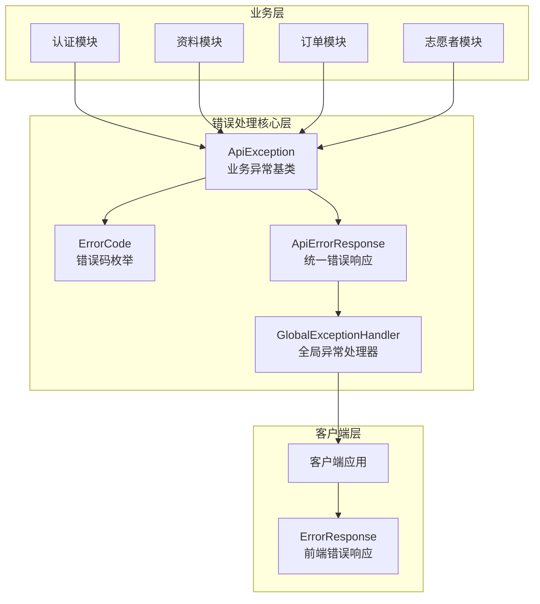
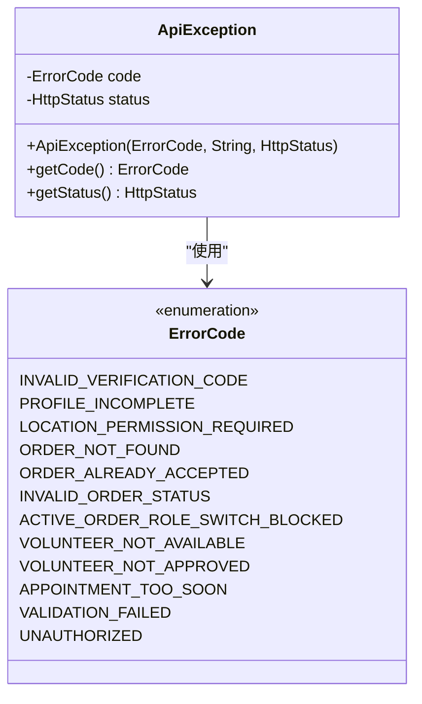
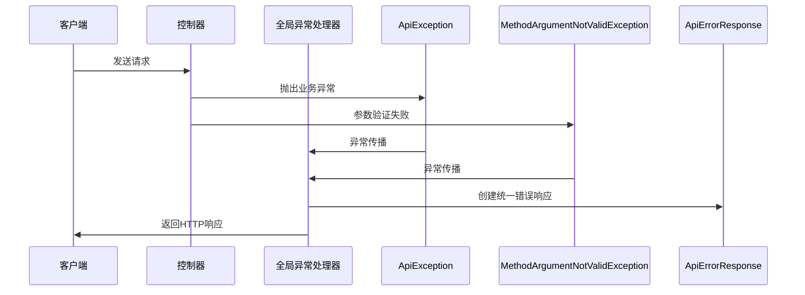
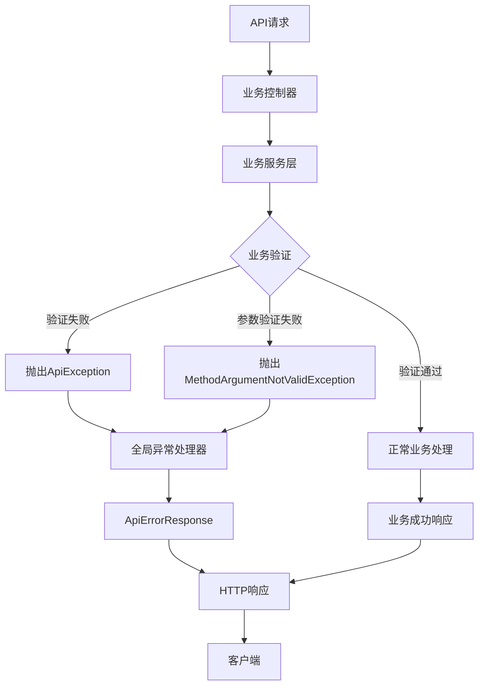
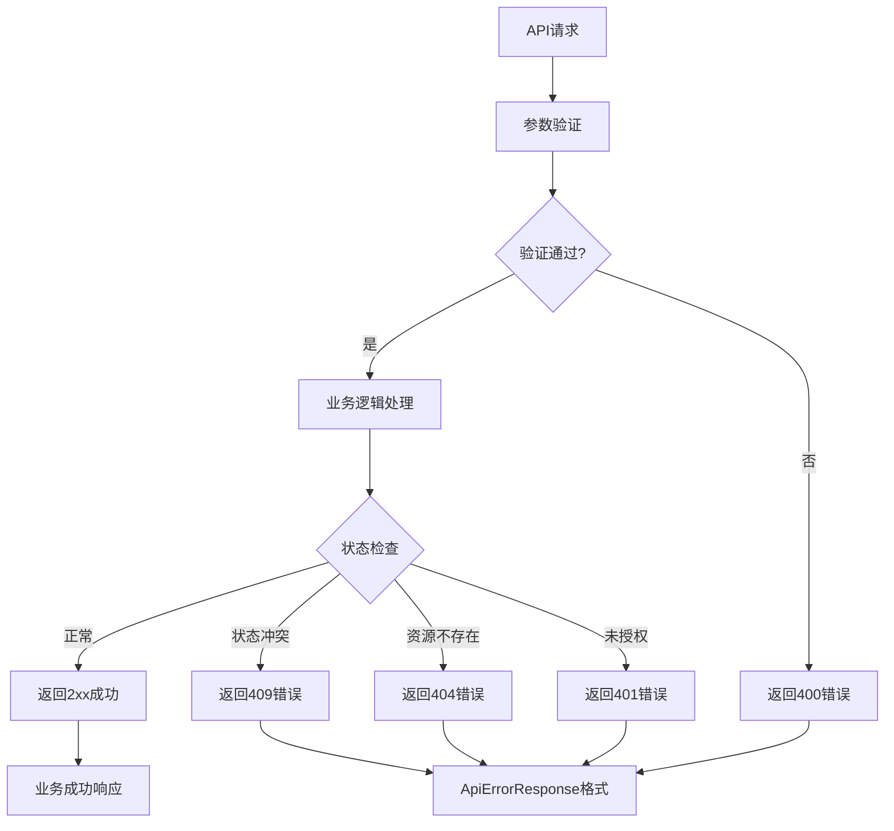

# 错误处理与响应

<cite>
**本文档引用的文件**
- [ApiErrorResponse.java](file://backend/src/main/java/com/aidrun/backend/common/error/ApiErrorResponse.java)
- [ApiException.java](file://backend/src/main/java/com/aidrun/backend/common/error/ApiException.java)
- [ErrorCode.java](file://backend/src/main/java/com/aidrun/backend/common/error/ErrorCode.java)
- [GlobalExceptionHandler.java](file://backend/src/main/java/com/aidrun/backend/common/error/GlobalExceptionHandler.java)
- [07-api-contract.openapi.yaml](file://docs/07-api-contract.openapi.yaml)
- [ErrorModels.swift](file://blindRun/Core/Models/ErrorModels.swift)
- [aidrun-mvp.yaml](file://backend/src/main/resources/static/openapi/aidrun-mvp.yaml)
</cite>

## 更新摘要
**所做更改**
- 新增 `VALIDATION_FAILED` 错误码的详细说明和实现
- 新增 `UNAUTHORIZED` 错误码的详细说明和实现
- 更新错误响应格式为包含时间戳的 `ApiErrorResponse`
- 增强全局异常处理器，支持参数验证异常处理
- 完善错误码枚举的序列化和反序列化机制
- 更新客户端Swift错误模型以支持所有错误码
- 增强HTTP状态码与业务错误的映射关系

## 目录
1. [简介](#简介)
2. [后端错误处理基础设施](#后端错误处理基础设施)
3. [核心组件详解](#核心组件详解)
4. [架构概览](#架构概览)
5. [错误响应格式](#错误响应格式)
6. [错误码定义](#错误码定义)
7. [HTTP状态码映射](#http状态码映射)
8. [客户端集成指南](#客户端集成指南)
9. [最佳实践](#最佳实践)
10. [故障排除指南](#故障排除指南)
11. [总结](#总结)

## 简介

本文件详细说明了 AidRun 项目的API错误处理机制，重点介绍后端新增的统一错误处理基础设施，包括 `ApiErrorResponse`、`ApiException` 和 `ErrorCode` 的完整实现。该系统采用统一的错误响应格式，确保客户端能够一致地处理各种业务异常情况，并提供完整的错误追踪能力。

## 后端错误处理基础设施

后端建立了完整的错误处理基础设施，采用分层架构设计，确保错误处理的一致性和可维护性：



**图表来源**
- [ApiException.java:5-23](file://backend/src/main/java/com/aidrun/backend/common/error/ApiException.java#L5-L23)
- [ErrorCode.java:6-39](file://backend/src/main/java/com/aidrun/backend/common/error/ErrorCode.java#L6-L39)
- [ApiErrorResponse.java:5-14](file://backend/src/main/java/com/aidrun/backend/common/error/ApiErrorResponse.java#L5-L14)
- [GlobalExceptionHandler.java:7-16](file://backend/src/main/java/com/aidrun/backend/common/error/GlobalExceptionHandler.java#L7-L16)

**章节来源**
- [ApiException.java:1-24](file://backend/src/main/java/com/aidrun/backend/common/error/ApiException.java#L1-L24)
- [ErrorCode.java:1-41](file://backend/src/main/java/com/aidrun/backend/common/error/ErrorCode.java#L1-L41)
- [ApiErrorResponse.java:1-15](file://backend/src/main/java/com/aidrun/backend/common/error/ApiErrorResponse.java#L1-L15)
- [GlobalExceptionHandler.java:1-30](file://backend/src/main/java/com/aidrun/backend/common/error/GlobalExceptionHandler.java#L1-L30)

## 核心组件详解

### ApiException 异常类

`ApiException` 是系统的核心异常类，继承自 `RuntimeException`，提供完整的错误信息封装：



**图表来源**
- [ApiException.java:5-23](file://backend/src/main/java/com/aidrun/backend/common/error/ApiException.java#L5-L23)
- [ErrorCode.java:6-18](file://backend/src/main/java/com/aidrun/backend/common/error/ErrorCode.java#L6-L18)

**章节来源**
- [ApiException.java:1-24](file://backend/src/main/java/com/aidrun/backend/common/error/ApiException.java#L1-L24)

### ApiErrorResponse 统一响应格式

`ApiErrorResponse` 采用 Java record 语法，提供类型安全的错误响应封装，并包含工厂方法：

| 字段 | 类型 | 必填 | 描述 |
|------|------|------|------|
| code | ErrorCode | 是 | 错误码标识符，使用枚举类型 |
| message | string | 是 | 人类可读的错误描述信息 |
| timestamp | Instant | 是 | 错误发生的时间戳，精确到秒 |

**章节来源**
- [ApiErrorResponse.java:5-14](file://backend/src/main/java/com/aidrun/backend/common/error/ApiErrorResponse.java#L5-L14)

### GlobalExceptionHandler 全局异常处理器

`GlobalExceptionHandler` 使用 Spring 的 `@RestControllerAdvice` 注解，提供统一的异常处理机制：



**图表来源**
- [GlobalExceptionHandler.java:10-15](file://backend/src/main/java/com/aidrun/backend/common/error/GlobalExceptionHandler.java#L10-L15)

**章节来源**
- [GlobalExceptionHandler.java:1-30](file://backend/src/main/java/com/aidrun/backend/common/error/GlobalExceptionHandler.java#L1-L30)

## 架构概览

系统采用分层架构设计，错误处理机制贯穿整个API交互流程：



**图表来源**
- [GlobalExceptionHandler.java:10-15](file://backend/src/main/java/com/aidrun/backend/common/error/GlobalExceptionHandler.java#L10-L15)
- [ApiException.java:10-14](file://backend/src/main/java/com/aidrun/backend/common/error/ApiException.java#L10-L14)

## 错误响应格式

### ApiErrorResponse 结构

新的 `ApiErrorResponse` 结构相比之前的 `ErrorResponse` 增加了时间戳字段，提供更完整的错误追踪能力：

```json
{
  "code": "INVALID_VERIFICATION_CODE",
  "message": "验证码错误，请重新输入",
  "timestamp": "2024-01-15T10:30:00Z"
}
```

### 时间戳处理

时间戳使用 `java.time.Instant` 类型，确保全球时区一致性，支持精确到纳秒的时间精度。

**章节来源**
- [ApiErrorResponse.java:5-14](file://backend/src/main/java/com/aidrun/backend/common/error/ApiErrorResponse.java#L5-L14)

## 错误码定义

系统定义了12种标准错误码，覆盖了从认证到订单管理的各个业务领域：

### 认证相关错误

| 错误码 | HTTP状态码 | 业务含义 | 触发场景 | 处理建议 |
|--------|------------|----------|----------|----------|
| UNAUTHORIZED | 401 | 未授权访问 | 令牌无效或缺失 | 引导用户重新登录，刷新令牌 |
| INVALID_VERIFICATION_CODE | 400 | 验证码错误 | 手机登录时验证码不正确 | 提示用户重新输入验证码 |

### 参数验证错误

| 错误码 | HTTP状态码 | 业务含义 | 触发场景 | 处理建议 |
|--------|------------|----------|----------|----------|
| VALIDATION_FAILED | 400 | 参数验证失败 | 请求参数不符合验证规则 | 显示具体字段错误信息 |

### 资料完整性错误

| 错误码 | HTTP状态码 | 业务含义 | 触发场景 | 处理建议 |
|--------|------------|----------|----------|----------|
| PROFILE_INCOMPLETE | 400/409 | 资料不完整 | 创建订单或切换角色时资料缺失 | 引导用户完善个人资料 |
| LOCATION_PERMISSION_REQUIRED | 400/401 | 需要定位权限 | 获取可接订单时定位权限未开启 | 提示用户开启定位权限 |

### 订单状态错误

| 错误码 | HTTP状态码 | 业务含义 | 触发场景 | 处理建议 |
|--------|------------|----------|----------|----------|
| ORDER_NOT_FOUND | 404 | 订单不存在 | 查询特定订单详情 | 返回订单列表页面 |
| ORDER_ALREADY_ACCEPTED | 409 | 订单已被接单 | 志愿者接单时订单已被他人接取 | 显示其他可用订单 |
| INVALID_ORDER_STATUS | 409 | 订单状态不允许当前操作 | 状态转换时违反业务规则 | 提示用户稍后重试 |

### 角色切换限制

| 错误码 | HTTP状态码 | 业务含义 | 触发场景 | 处理建议 |
|--------|------------|----------|----------|----------|
| ACTIVE_ORDER_ROLE_SWITCH_BLOCKED | 409 | 存在活跃订单，禁止切换角色 | 切换用户角色时存在进行中订单 | 完成当前订单后再尝试切换 |

### 志愿者相关错误

| 错误码 | HTTP状态码 | 业务含义 | 触发场景 | 处理建议 |
|--------|------------|----------|----------|----------|
| VOLUNTEER_NOT_AVAILABLE | 400 | 志愿者不可用 | 接单时志愿者未设置为可用状态 | 设置可服务状态后重试 |
| VOLUNTEER_NOT_APPROVED | 400 | 志愿者未认证 | 接单时志愿者认证未通过 | 完成志愿者认证流程 |

### 预约时间错误

| 错误码 | HTTP状态码 | 业务含义 | 触发场景 | 处理建议 |
|--------|------------|----------|----------|----------|
| APPOINTMENT_TOO_SOON | 400 | 预约时间过近 | 创建预约时预约时间少于30分钟 | 调整预约时间为30分钟后 |

**章节来源**
- [ErrorCode.java:6-18](file://backend/src/main/java/com/aidrun/backend/common/error/ErrorCode.java#L6-L18)

## HTTP状态码映射

系统遵循RESTful API最佳实践，将HTTP状态码与业务错误进行标准化映射：



**图表来源**
- [GlobalExceptionHandler.java:12-14](file://backend/src/main/java/com/aidrun/backend/common/error/GlobalExceptionHandler.java#L12-L14)

## 客户端集成指南

### 错误响应处理

客户端应实现统一的错误处理中间件，处理 `ApiErrorResponse` 格式的响应：

```swift
// Swift 客户端错误处理示例
enum ErrorCode: String, Codable, Sendable {
    case invalidVerificationCode = "INVALID_VERIFICATION_CODE"
    case profileIncomplete = "PROFILE_INCOMPLETE"
    case locationPermissionRequired = "LOCATION_PERMISSION_REQUIRED"
    case orderNotFound = "ORDER_NOT_FOUND"
    case orderAlreadyAccepted = "ORDER_ALREADY_ACCEPTED"
    case invalidOrderStatus = "INVALID_ORDER_STATUS"
    case activeOrderRoleSwitchBlocked = "ACTIVE_ORDER_ROLE_SWITCH_BLOCKED"
    case volunteerNotAvailable = "VOLUNTEER_NOT_AVAILABLE"
    case volunteerNotApproved = "VOLUNTEER_NOT_APPROVED"
    case appointmentTooSoon = "APPOINTMENT_TOO_SOON"
    case validationFailed = "VALIDATION_FAILED"
    case unauthorized = "UNAUTHORIZED"
    
    var localizedMessage: String {
        switch self {
        case .invalidVerificationCode: return "验证码错误，请重新输入。"
        case .profileIncomplete: return "请先完善个人资料。"
        case .locationPermissionRequired: return "需要定位权限才能继续操作。"
        case .orderNotFound: return "订单不存在。"
        case .orderAlreadyAccepted: return "该订单已被其他志愿者接单。"
        case .invalidOrderStatus: return "当前订单状态不允许此操作。"
        case .activeOrderRoleSwitchBlocked: return "存在进行中的订单，无法切换角色。"
        case .volunteerNotAvailable: return "您当前未开启接单状态。"
        case .volunteerNotApproved: return "您的志愿者资格尚未通过审核。"
        case .appointmentTooSoon: return "预约时间需要至少30分钟之后。"
        case .validationFailed: return "提交内容不符合要求，请检查后重试。"
        case .unauthorized: return "登录已过期，请重新登录。"
        }
    }
    
    var ttsMessage: String {
        localizedMessage
    }
}

struct ErrorResponse: Codable, Sendable {
    let code: String
    let message: String
    
    var errorCode: ErrorCode? {
        ErrorCode(rawValue: code)
    }
}
```

### 错误码处理策略

| 错误码类别 | 处理策略 | 用户提示 |
|------------|----------|----------|
| 认证错误 | 引导重新登录 | "请重新登录" |
| 参数错误 | 显示具体表单错误 | "请输入正确的验证码" |
| 业务冲突 | 提供解决方案选项 | "订单已被接取，请选择其他订单" |
| 资源不存在 | 导航到相关页面 | "订单不存在，请查看最新订单" |

### 错误日志记录

建议客户端记录错误信息用于调试和监控：

```swift
// 错误日志记录示例
func logError(_ errorResponse: ApiErrorResponse, requestUrl: String) {
    let errorInfo = [
        "url": requestUrl,
        "errorCode": errorResponse.code.rawValue,
        "message": errorResponse.message,
        "timestamp": errorResponse.timestamp,
        "userId": currentUser?.id
    ]
    // 发送到错误监控服务
}
```

**章节来源**
- [ErrorModels.swift:5-57](file://blindRun/Core/Models/ErrorModels.swift#L5-L57)

## 最佳实践

### 后端开发最佳实践

1. **统一异常抛出**：所有业务异常应使用 `ApiException` 抛出
2. **错误码一致性**：使用预定义的 `ErrorCode` 枚举，避免自定义字符串
3. **消息本地化**：错误消息应支持多语言本地化
4. **敏感信息保护**：避免在错误消息中泄露敏感数据
5. **参数验证**：使用Spring Validation框架进行参数验证

### 前端集成最佳实践

1. **统一错误处理**：实现全局错误拦截器
2. **用户友好提示**：根据错误码提供合适的用户提示
3. **错误恢复机制**：为可恢复错误提供自动重试机制
4. **错误监控**：集成错误监控服务，收集错误统计

### 性能优化建议

1. **错误缓存**：对常见错误进行缓存，减少重复处理
2. **异步处理**：错误日志记录采用异步方式
3. **批量处理**：多个错误同时处理时使用批处理模式

## 故障排除指南

### 常见问题诊断

#### 认证失败排查
- 检查JWT令牌是否有效且未过期
- 确认用户是否已完成手机号绑定
- 验证服务器时间同步状态

#### 订单状态异常排查
- 检查订单状态转换的业务规则
- 验证用户角色权限
- 确认订单是否存在并发修改

#### 资料完整性检查
- 验证必填字段是否完整
- 检查地理位置权限状态
- 确认用户角色配置

#### 错误处理问题排查
- 检查 `GlobalExceptionHandler` 是否正确配置
- 验证 `ApiException` 是否正确抛出
- 确认 `ApiErrorResponse` 格式是否符合预期
- 检查 `MethodArgumentNotValidException` 是否被正确捕获

**章节来源**
- [GlobalExceptionHandler.java:10-15](file://backend/src/main/java/com/aidrun/backend/common/error/GlobalExceptionHandler.java#L10-L15)
- [ApiException.java:10-14](file://backend/src/main/java/com/aidrun/backend/common/error/ApiException.java#L10-L14)

## 总结

本系统的错误处理机制通过新增的统一基础设施，为客户端提供了更加完善和一致的错误处理体验。`ApiErrorResponse` 的引入增加了时间戳追踪能力，`ApiException` 提供了类型安全的异常封装，`ErrorCode` 的枚举化确保了错误码的一致性和可维护性，`GlobalExceptionHandler` 的增强支持了参数验证异常的统一处理。

建议客户端开发者：
1. 实现统一的错误处理中间件
2. 为不同错误码提供相应的用户提示
3. 建立错误日志收集和上报机制
4. 在UI层面提供友好的错误反馈
5. 实现错误恢复和重试机制

通过这套完整的错误处理基础设施，AidRun 项目能够提供更加稳定可靠的API服务，提升用户体验和系统可维护性。