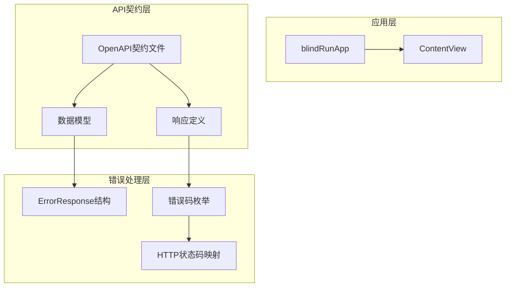
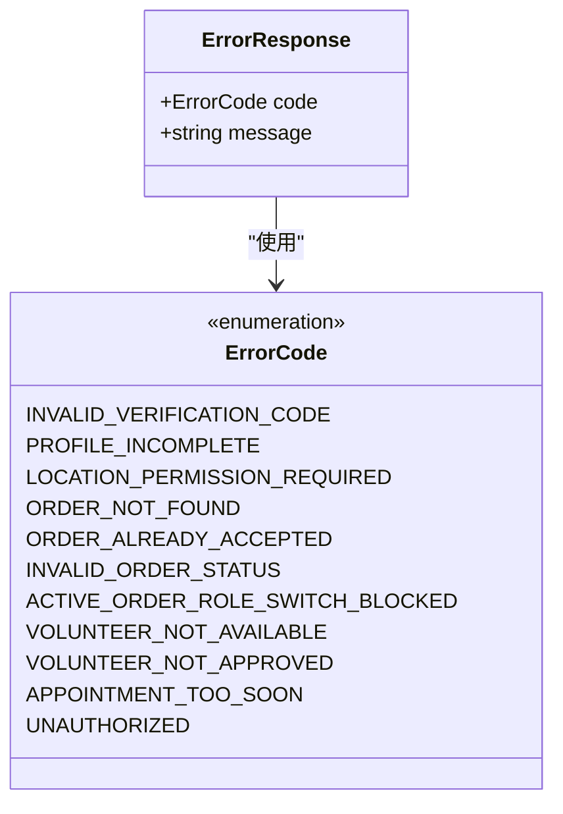
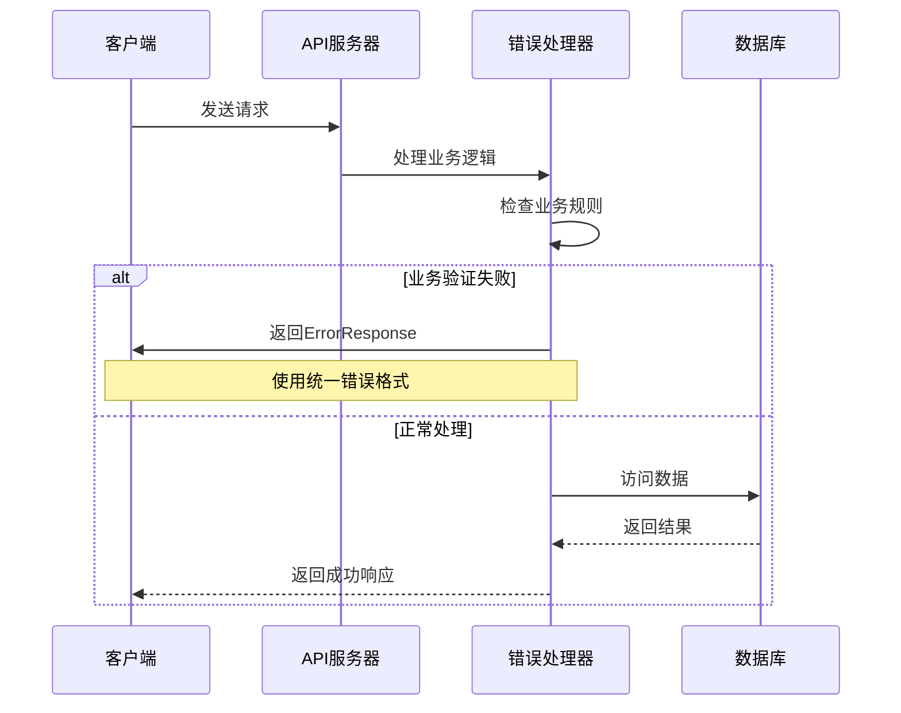
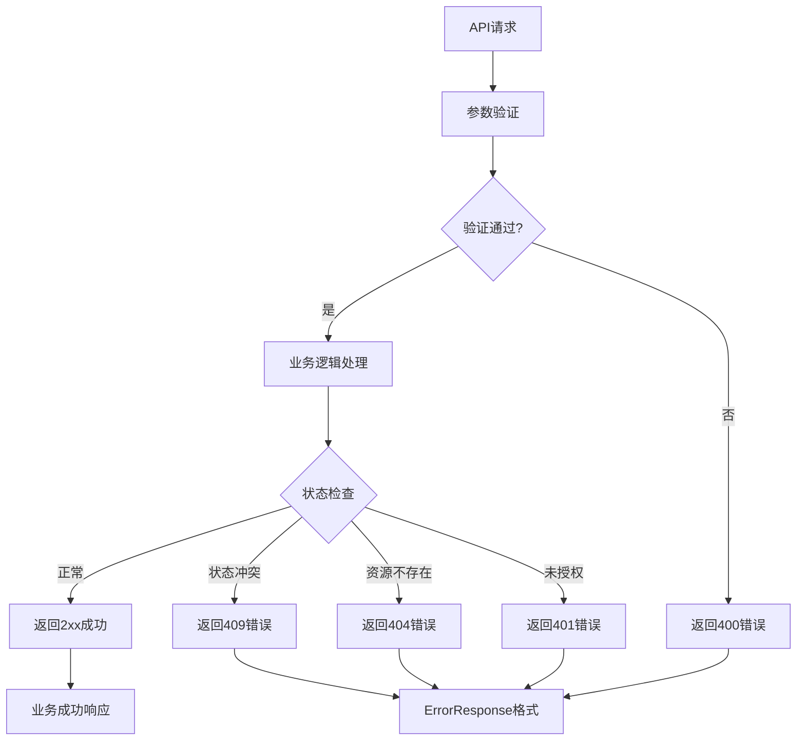
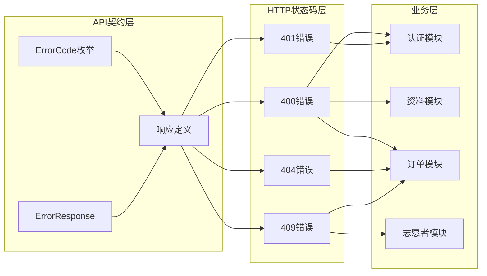

# 错误处理与响应

<cite>
**本文档引用的文件**
- [07-api-contract.openapi.yaml](file://docs/07-api-contract.openapi.yaml)
- [ContentView.swift](file://blindRun/ContentView.swift)
- [blindRunApp.swift](file://blindRun/blindRunApp.swift)
</cite>

## 目录
1. [简介](#简介)
2. [项目结构](#项目结构)
3. [核心组件](#核心组件)
4. [架构概览](#架构概览)
5. [详细组件分析](#详细组件分析)
6. [依赖关系分析](#依赖关系分析)
7. [性能考虑](#性能考虑)
8. [故障排除指南](#故障排除指南)
9. [结论](#结论)

## 简介

本文件详细说明了 AidRun 项目的API错误处理机制，重点介绍通用错误响应格式 `ErrorResponse` 的结构和字段含义，以及所有定义的错误码。该系统采用统一的错误响应格式，确保客户端能够一致地处理各种业务异常情况。

## 项目结构

该项目采用SwiftUI框架构建的iOS应用程序，主要包含以下关键组件：

**图表来源**
- [07-api-contract.openapi.yaml:544-567](file://docs/07-api-contract.openapi.yaml#L544-L567)
- [07-api-contract.openapi.yaml:469-557](file://docs/07-api-contract.openapi.yaml#L469-L557)

**章节来源**
- [blindRunApp.swift:10-17](file://blindRun/blindRunApp.swift#L10-L17)
- [ContentView.swift:10-20](file://blindRun/ContentView.swift#L10-L20)

## 核心组件

### ErrorResponse 结构

`ErrorResponse` 是系统统一的错误响应格式，具有以下结构特征：

| 字段 | 类型 | 必填 | 描述 |
|------|------|------|------|
| code | ErrorCode | 是 | 错误码标识符，使用枚举类型 |
| message | string | 是 | 人类可读的错误描述信息 |

该结构确保了所有API错误响应的一致性，便于客户端统一处理。

**章节来源**
- [07-api-contract.openapi.yaml:559-567](file://docs/07-api-contract.openapi.yaml#L559-L567)

### 错误码枚举

系统定义了11种标准错误码，覆盖了从认证到订单管理的各个业务领域：

**图表来源**
- [07-api-contract.openapi.yaml:544-557](file://docs/07-api-contract.openapi.yaml#L544-L557)
- [07-api-contract.openapi.yaml:559-567](file://docs/07-api-contract.openapi.yaml#L559-L567)

**章节来源**
- [07-api-contract.openapi.yaml:544-557](file://docs/07-api-contract.openapi.yaml#L544-L557)

## 架构概览

系统采用分层架构设计，错误处理机制贯穿整个API交互流程：

**图表来源**
- [07-api-contract.openapi.yaml:469-557](file://docs/07-api-contract.openapi.yaml#L469-L557)

## 详细组件分析

### 错误码详解

#### 认证相关错误

| 错误码 | HTTP状态码 | 业务含义 | 触发场景 | 处理建议 |
|--------|------------|----------|----------|----------|
| UNAUTHORIZED | 401 | 未授权访问 | 令牌无效或缺失 | 引导用户重新登录，刷新令牌 |
| INVALID_VERIFICATION_CODE | 400 | 验证码错误 | 手机登录时验证码不正确 | 提示用户重新输入验证码 |

**章节来源**
- [07-api-contract.openapi.yaml:470-487](file://docs/07-api-contract.openapi.yaml#L470-L487)

#### 资料完整性错误

| 错误码 | HTTP状态码 | 业务含义 | 触发场景 | 处理建议 |
|--------|------------|----------|----------|----------|
| PROFILE_INCOMPLETE | 400/409 | 资料不完整 | 创建订单或切换角色时资料缺失 | 引导用户完善个人资料 |
| LOCATION_PERMISSION_REQUIRED | 400/401 | 需要定位权限 | 获取可接订单时定位权限未开启 | 提示用户开启定位权限 |

**章节来源**
- [07-api-contract.openapi.yaml:488-505](file://docs/07-api-contract.openapi.yaml#L488-L505)

#### 订单状态错误

| 错误码 | HTTP状态码 | 业务含义 | 触发场景 | 处理建议 |
|--------|------------|----------|----------|----------|
| ORDER_NOT_FOUND | 404 | 订单不存在 | 查询特定订单详情 | 返回订单列表页面 |
| ORDER_ALREADY_ACCEPTED | 409 | 订单已被接单 | 志愿者接单时订单已被他人接取 | 显示其他可用订单 |
| INVALID_ORDER_STATUS | 409 | 订单状态不允许当前操作 | 状态转换时违反业务规则 | 提示用户稍后重试 |

**章节来源**
- [07-api-contract.openapi.yaml:506-532](file://docs/07-api-contract.openapi.yaml#L506-L532)

#### 角色切换限制

| 错误码 | HTTP状态码 | 业务含义 | 触发场景 | 处理建议 |
|--------|------------|----------|----------|----------|
| ACTIVE_ORDER_ROLE_SWITCH_BLOCKED | 409 | 存在活跃订单，禁止切换角色 | 切换用户角色时存在进行中订单 | 完成当前订单后再尝试切换 |

**章节来源**
- [07-api-contract.openapi.yaml:533-541](file://docs/07-api-contract.openapi.yaml#L533-L541)

#### 志愿者相关错误

| 错误码 | HTTP状态码 | 业务含义 | 触发场景 | 处理建议 |
|--------|------------|----------|----------|----------|
| VOLUNTEER_NOT_AVAILABLE | 400 | 志愿者不可用 | 接单时志愿者未设置为可用状态 | 设置可服务状态后重试 |
| VOLUNTEER_NOT_APPROVED | 400 | 志愿者未认证 | 接单时志愿者认证未通过 | 完成志愿者认证流程 |

**章节来源**
- [07-api-contract.openapi.yaml:542-542](file://docs/07-api-contract.openapi.yaml#L542-L542)

#### 预约时间错误

| 错误码 | HTTP状态码 | 业务含义 | 触发场景 | 处理建议 |
|--------|------------|----------|----------|----------|
| APPOINTMENT_TOO_SOON | 400 | 预约时间过近 | 创建预约时预约时间少于30分钟 | 调整预约时间为30分钟后 |

**章节来源**
- [07-api-contract.openapi.yaml:174-186](file://docs/07-api-contract.openapi.yaml#L174-L186)

### HTTP状态码与业务错误映射

系统遵循RESTful API最佳实践，将HTTP状态码与业务错误进行标准化映射：

**图表来源**
- [07-api-contract.openapi.yaml:43-46](file://docs/07-api-contract.openapi.yaml#L43-L46)
- [07-api-contract.openapi.yaml:57-59](file://docs/07-api-contract.openapi.yaml#L57-L59)
- [07-api-contract.openapi.yaml:78-80](file://docs/07-api-contract.openapi.yaml#L78-L80)
- [07-api-contract.openapi.yaml:167-173](file://docs/07-api-contract.openapi.yaml#L167-L173)
- [07-api-contract.openapi.yaml:235-237](file://docs/07-api-contract.openapi.yaml#L235-L237)
- [07-api-contract.openapi.yaml:252-254](file://docs/07-api-contract.openapi.yaml#L252-L254)
- [07-api-contract.openapi.yaml:268-287](file://docs/07-api-contract.openapi.yaml#L268-L287)
- [07-api-contract.openapi.yaml:301-341](file://docs/07-api-contract.openapi.yaml#L301-L341)

## 依赖关系分析

系统各组件之间的依赖关系如下：

**图表来源**
- [07-api-contract.openapi.yaml:469-557](file://docs/07-api-contract.openapi.yaml#L469-L557)

**章节来源**
- [07-api-contract.openapi.yaml:469-557](file://docs/07-api-contract.openapi.yaml#L469-L557)

## 性能考虑

在错误处理方面，系统采用了以下优化策略：

1. **统一错误格式**：减少客户端解析复杂度
2. **明确的状态码映射**：便于网络层缓存和代理处理
3. **详细的错误描述**：提高用户体验和调试效率
4. **枚举化的错误码**：确保错误码的一致性和可维护性

## 故障排除指南

### 常见问题诊断

#### 认证失败排查
- 检查JWT令牌是否有效且未过期
- 确认用户是否已完成手机号绑定
- 验证服务器时间同步状态

#### 订单状态异常排查
- 检查订单状态转换的业务规则
- 验证用户角色权限
- 确认订单是否存在并发修改

#### 资料完整性检查
- 验证必填字段是否完整
- 检查地理位置权限状态
- 确认用户角色配置

**章节来源**
- [07-api-contract.openapi.yaml:470-541](file://docs/07-api-contract.openapi.yaml#L470-L541)

## 结论

本系统的错误处理机制通过统一的 `ErrorResponse` 结构和标准化的错误码体系，为客户端提供了清晰、一致的错误处理体验。11种精心设计的错误码覆盖了从认证到订单管理的完整业务场景，配合明确的HTTP状态码映射，确保了API的可靠性和易用性。

建议客户端开发者：
1. 实现统一的错误处理中间件
2. 为不同错误码提供相应的用户提示
3. 建立错误日志收集和上报机制
4. 在UI层面提供友好的错误反馈