# iOS UI手稿与设计规范

<cite>
**本文档引用的文件**
- [ui-handoff-ios.md](file://docs/ui-handoff-ios.md)
- [ui-reference-audit.md](file://docs/ui-reference-audit.md)
- [08-ios-architecture.md](file://docs/08-ios-architecture.md)
- [01-product-requirements.md](file://docs/01-product-requirements.md)
- [02-mvp-scope.md](file://docs/02-mvp-scope.md)
- [03-user-stories.md](file://docs/03-user-stories.md)
- [04-user-flows-and-state-machine.md](file://docs/04-user-flows-and-state-machine.md)
- [09-accessibility-and-voice-guidelines.md](file://docs/09-accessibility-and-voice-guidelines.md)
- [07-api-contract.openapi.yaml](file://docs/07-api-contract.openapi.yaml)
- [application.yml](file://backend/src/main/resources/application.yml)
- [blindRunApp.swift](file://blindRun/blindRun/blindRunApp.swift)
- [ContentView.swift](file://blindRun/blindRun/ContentView.swift)
</cite>

## 目录
1. [项目概述](#项目概述)
2. [设计原则与规范](#设计原则与规范)
3. [页面规范总览](#页面规范总览)
4. [详细页面规范](#详细页面规范)
5. [架构与技术实现](#架构与技术实现)
6. [无障碍与语音规范](#无障碍与语音规范)
7. [API接口规范](#api接口规范)
8. [开发指南](#开发指南)
9. [测试与验证](#测试与验证)
10. [附录](#附录)

## 项目概述

助盲跑(AidRun)是一个专为盲人跑者与志愿者设计的户外跑步协助服务平台。该项目采用Swift原生iOS开发，基于SwiftUI + MVVM架构，专注于提供安全、可预约、可追踪的协助服务闭环。

### 核心价值主张
- **对盲人跑者**：可预约的陪伴式跑步协助，紧急求助安全保障，极简无障碍交互
- **对志愿者**：有意义的公益参与，积分激励体系，灵活的时间安排
- **对平台**：订单闭环与安全可追踪性保障

### 第一版成功标准
1. 能完整演示：盲人预约 → 志愿者接单 → 志愿者到达 → 盲人确认开始服务 → 志愿者结束服务 → 盲人看到完成状态
2. 必须接入真实地图（高德地图）
3. 必须接入真实定位
4. 必须接入真实用户登录
5. 必须体现无障碍体验，包括VoiceOver、TTS、极简大按钮

## 设计原则与规范

### 盲人端设计原则
| 原则 | 细则 |
|------|------|
| **视觉** | 深色背景（黑/近黑）、高对比度文字、大字号（≥20pt body）、无多余装饰 |
| **触控** | 关键主按钮最小高度 **64pt**，点击区域充足，按钮间距 ≥16pt |
| **层级** | 每屏一个主任务，避免嵌套导航和过多选择 |
| **语音** | TTS播报所有关键状态变化；每个关键页面有"重复当前状态"按钮 |
| **危险操作** | 取消订单、进入求助、退出登录必须**二次确认** |
| **状态文案** | 仅使用MVP 7个订单状态中文，不显示英文状态名 |

### 志愿者端设计原则
| 原则 | 细则 |
|------|------|
| **视觉** | 浅色/标准主题，信息密度可高于盲人端，但关键按钮仍需清晰 |
| **地图** | 全屏或半屏高德地图，显示当前位置和订单marker |
| **隐私** | 接单前**隐藏**盲人联系电话、紧急联系人；接单后显示完整电话 |
| **危险操作** | 取消订单、进入求助、结束服务、退出登录必须**二次确认** |
| **积分** | 完成服务 `+100` 积分（不是旧版 `+50`） |

### 双端共享规范
- **订单状态**：`matching` / `accepted` / `arrived` / `in_progress` / `completed` / `cancelled` / `emergency`
- **禁止旧状态名**：`pendingMatch`、`pendingAccept`、`driverEnRoute`、`driverArrived`、`rematching`、`noVolunteer`、`submitted`、`contacted`、`expired`
- **不做**：WebSocket、实时轨迹、路线导航、AI助手、App内聊天
- **API环境切换**：Mock / Local Backend / Production Backend（所有页面底部角落不显眼位置）

## 页面规范总览

### 盲人跑者端页面规范

#### 登录页
- **页面目标**：用户通过手机号 + 固定验证码 `123456` 登录，首次登录自动创建账号
- **适用角色**：盲人跑者、志愿者（通用）
- **页面入口**：App启动（UserDefaults中无有效JWT时）
- **主要按钮**：
  - "获取验证码"：手机号格式正确时启用，调用 `POST /api/auth/phone-login`
  - "登录"：6位验证码填完后启用，调用 `POST /api/auth/phone-login`
- **表单字段**：
  - 手机号：数字键盘，11位，必须1开头11位数字
  - 验证码：数字键盘，6位，固定`123456`

#### 角色选择页
- **页面目标**：用户选择本次使用的activeRole：盲人跑者或志愿者
- **适用角色**：盲人跑者、志愿者（通用，首次登录/手动切换时）
- **页面入口**：首次登录验证成功（后端返回无activeRole）→ 此页；设置页 → 切换角色 → 此页
- **主要按钮**：
  - "我是盲人跑者"：检查活跃订单 → 如被拦截弹窗 → 保存activeRole → 有资料则进入盲人首页，无资料则进入盲人资料页
  - "我是志愿者"：检查活跃订单 → 如被拦截弹窗 → 保存activeRole → 有认证则进入志愿者首页，无认证则进入志愿者认证页

#### 盲人资料页
- **页面目标**：盲人跑者首次填写个人资料和紧急联系人信息，完成注册
- **适用角色**：盲人跑者
- **页面入口**：角色选择页选择"盲人跑者"（首次无资料时）/ 设置页 → 编辑资料
- **表单字段**：
  - 昵称：文本输入，必填
  - 紧急联系人姓名：文本输入，必填
  - 紧急联系人电话：数字键盘11位，必填，1开头11位
  - 跑步经验：Picker，选填：无经验/偶尔跑/经常跑

#### 盲人首页
- **页面目标**：盲人跑者功能入口，根据是否有活跃订单展示不同的主内容
- **适用角色**：盲人跑者
- **页面入口**：登录成功（已有盲人资料）/ 资料填写完成 / 服务完成返回 / 切换角色
- **页面主要内容**：
  - **无活跃订单**：高德小地图（上1/3区域）+ "开始约跑"大按钮（屏幕中下部）+ 当前位置文字描述 + "重复当前状态"按钮
  - **有活跃订单**：高德小地图 + 订单状态卡片（大号，覆盖"开始约跑"位置）+ "查看当前订单"按钮 + "重复当前状态"按钮

#### 创建预约页
- **页面目标**：盲人跑者填写预约信息，创建跑步订单
- **适用角色**：盲人跑者
- **页面入口**：盲人首页 → 点击"开始约跑"
- **页面主要内容**：
  - **出发地点区**（必填）：大按钮"选择出发地点"（显示已选地点名称，默认填充当前位置文字描述）
  - **预约时间区**（必填）：iOS原生DatePicker（`.graphical`或`.compact`样式），限制：只能选择当前时间30分钟后的时间
  - **可选项区**（选填）：目的地/路线、预计跑步时长、预计距离、配速偏好、是否需要同性志愿者、备注
  - **提交区**（底部固定）："提交预约"按钮（最小64pt，必填项全部完成时启用）

#### 盲人订单状态等待页
- **页面目标**：展示订单`matching`、`accepted`、`arrived`状态，等待志愿者接单和到达
- **适用角色**：盲人跑者
- **页面入口**：创建预约提交成功 / 盲人首页点击"查看当前订单"（状态为matching/accepted/arrived时）
- **页面主要内容**：
  - **大号状态指示区**（上半部分）：matching（旋转圆圈+匹配中，请稍候+预计等待提示）、accepted（绿色勾+志愿者已接单+志愿者昵称）、arrived（蓝色铃铛+志愿者已到达约定地点+志愿者昵称）
  - **志愿者信息卡片**（accepted/arrived时显示）：昵称（大字）、联系电话（arrived起显示，可点击拨打）
  - **订单信息卡片**：出发地点、预约时间、其他可选项（目的地、时长等，如有）
  - **底部操作区**：arrived（"确认开始服务"按钮，最小64pt，绿色醒目）、matching/accepted/arrived（"取消订单"按钮，灰色，次要位置）、accepted/arrived（"一键求助"按钮，红色醒目）

### 志愿者端页面规范

#### 志愿者认证页
- **页面目标**：志愿者首次完成Mock认证，获得接单资格
- **适用角色**：志愿者
- **页面入口**：角色选择页选择"志愿者"（首次无认证时）/ 设置页 → 认证管理
- **页面主要内容**：
  - 标题："志愿者认证"
  - 昵称输入框（必填）
  - 手机号输入框（必填）
  - "提交认证"按钮（最小64pt）
  - 认证状态显示：自动approved（Mock认证）

#### 志愿者首页
- **页面目标**：志愿者功能入口，显示附近可接订单和基本信息
- **适用角色**：志愿者
- **页面入口**：登录成功（已有志愿者认证）/ 认证完成 / 服务完成返回 / 切换角色
- **页面主要内容**：
  - **顶部信息区**：积分余额、可服务开关
  - **地图区域**：显示附近订单分布
  - **订单列表**：按距离排序的订单列表（matching状态）
  - **底部导航**：首页、历史记录、积分商城、设置

#### 订单列表页
- **页面目标**：显示附近可接订单列表，按距离排序
- **适用角色**：志愿者
- **页面入口**：志愿者首页 → 点击"查看全部"
- **页面主要内容**：
  - **刷新功能**：下拉刷新订单列表
  - **订单卡片**：盲人昵称、出发地点、预约时间、距离、可选项（目的地、预计时长、配速偏好等）
  - **接单按钮**：每个订单显示"接单"按钮

#### 订单详情页
- **页面目标**：显示订单完整信息，提供接单操作
- **适用角色**：志愿者
- **页面入口**：订单列表页 → 点击订单
- **页面主要内容**：
  - **订单信息卡片**：盲人昵称、出发地点、预约时间、所有可选项
  - **地图区域**：显示出发点位置、当前位置和距离
  - **操作按钮**：接单按钮（接单前不显示盲人联系电话）
  - **状态指示**：显示订单当前状态

#### 志愿者服务中页
- **页面目标**：志愿者管理当前进行中的订单
- **适用角色**：志愿者
- **页面入口**：接单成功后自动进入
- **页面主要内容**：
  - **状态指示**：当前订单状态（accepted/arrived/in_progress）
  - **志愿者信息**：昵称、联系电话（接单后显示）
  - **操作按钮**：我已到达、结束服务、一键求助
  - **地图功能**：查看出发点位置

#### 服务记录页
- **页面目标**：显示志愿者历史服务记录
- **适用角色**：志愿者
- **页面入口**：志愿者首页 → 服务记录
- **页面主要内容**：
  - **历史订单列表**：已完成/已取消的订单列表，按时间倒序
  - **每项显示**：服务时间、盲人昵称、出发地点、服务状态、获得积分

#### 积分/商城占位页
- **页面目标**：展示积分余额和占位商品
- **适用角色**：志愿者
- **页面入口**：志愿者首页 → 积分商城
- **页面主要内容**：
  - **积分余额**：大数字显示
  - **占位商品**：几个假商品展示
  - **文案提示**："积分商城即将上线"

## 详细页面规范

### 登录页详细规范

#### 页面布局
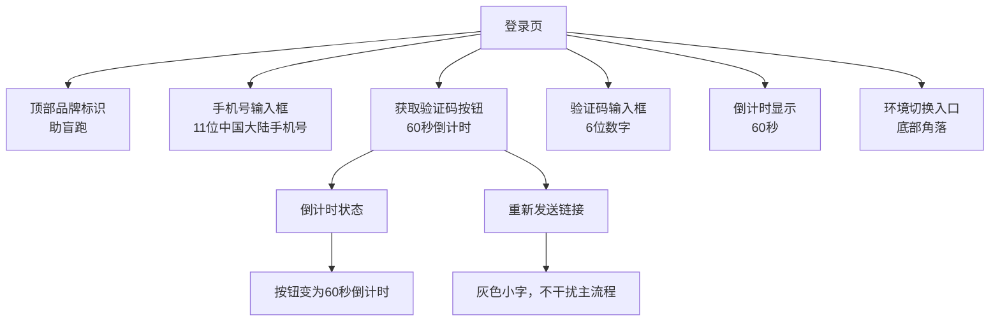

**图表来源**
- [ui-handoff-ios.md:41-125](file://docs/ui-handoff-ios.md#L41-L125)

#### 表单验证规则
- **手机号格式**：必须11位数字，且以1开头
- **验证码格式**：必须6位数字，固定为`123456`
- **错误处理**：
  - 手机号格式错误：红框 + 红色文字"请输入正确的手机号"
  - 验证码错误：验证码输入框抖动动画 + "验证码错误，请重新输入"
  - 网络错误：Toast"网络错误，请重试"

#### 无障碍设计
| 元素 | accessibilityLabel | accessibilityHint |
|------|--------------------|-------------------|
| 手机号输入框 | "手机号输入框，请输入11位手机号" | — |
| 获取验证码按钮 | "获取验证码" | "点击后发送验证码到手机" |
| 验证码输入框 | "验证码输入框，请输入6位验证码" | — |
| 环境切换入口 | "API环境切换" | "当前环境：Mock模式" |

**章节来源**
- [ui-handoff-ios.md:41-125](file://docs/ui-handoff-ios.md#L41-L125)
- [ui-reference-audit.md:67-78](file://docs/ui-reference-audit.md#L67-L78)

### 角色选择页详细规范

#### 页面布局
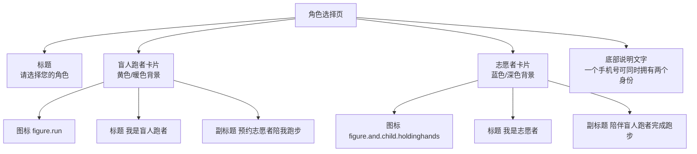

**图表来源**
- [ui-handoff-ios.md:128-220](file://docs/ui-handoff-ios.md#L128-L220)

#### 交互流程
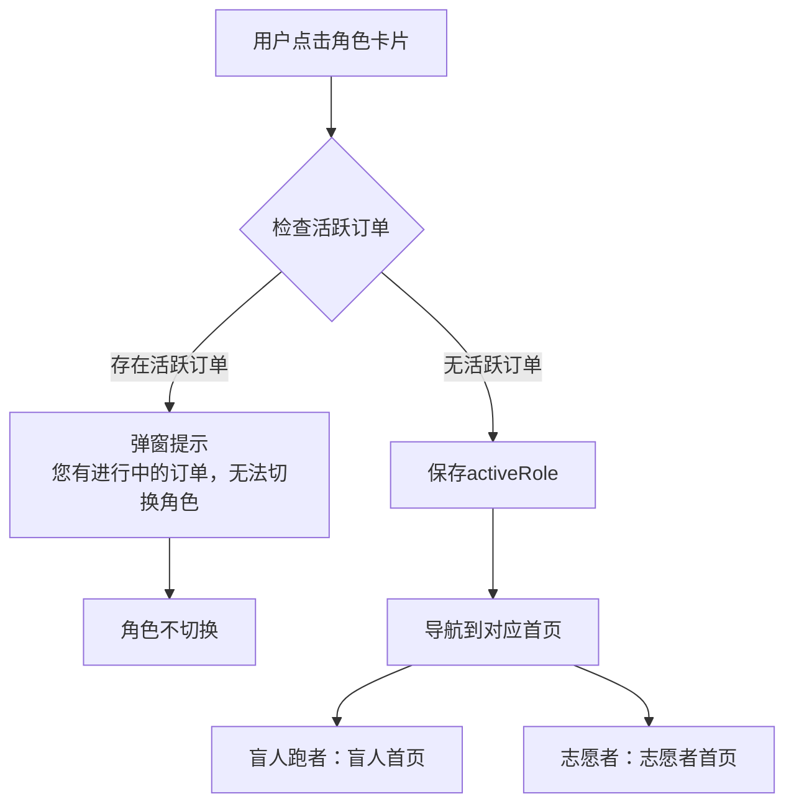

**图表来源**
- [ui-handoff-ios.md:149-161](file://docs/ui-handoff-ios.md#L149-L161)

#### 无障碍设计
| 元素 | accessibilityLabel | accessibilityHint |
|------|--------------------|-------------------|
| 盲人跑者卡片 | "我是盲人跑者，预约志愿者陪我跑步" | "点击后进入盲人跑者模式" |
| 志愿者卡片 | "我是志愿者，陪伴盲人跑者完成跑步" | "点击后进入志愿者模式" |

**章节来源**
- [ui-handoff-ios.md:128-220](file://docs/ui-handoff-ios.md#L128-L220)
- [ui-reference-audit.md:79-89](file://docs/ui-reference-audit.md#L79-L89)

### 盲人资料页详细规范

#### 页面布局
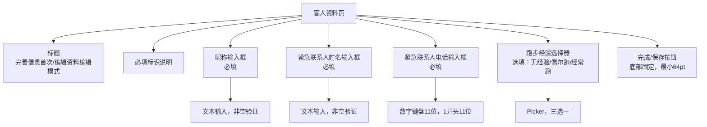

**图表来源**
- [ui-handoff-ios.md:223-318](file://docs/ui-handoff-ios.md#L223-L318)

#### 表单验证规则
- **昵称**：必填，非空
- **紧急联系人姓名**：必填，非空
- **紧急联系人电话**：必填，11位数字，1开头
- **跑步经验**：选填，三选一

#### 错误处理
- **必填项为空**：对应字段红框 + "请填写必填信息"，按钮禁用
- **手机号格式错误**："请输入正确的手机号"
- **网络错误**：Toast"保存失败，请重试"

#### 无障碍设计
| 元素 | accessibilityLabel | accessibilityHint |
|------|--------------------|-------------------|
| 昵称输入框 | "昵称，必填" | — |
| 紧急联系人姓名输入框 | "紧急联系人姓名，必填" | — |
| 紧急联系人电话输入框 | "紧急联系人电话，必填，11位手机号" | — |
| 跑步经验选择器 | "跑步经验，选填" | "点击选择跑步经验" |
| 完成按钮 | "完成，保存资料" | — |

**章节来源**
- [ui-handoff-ios.md:223-318](file://docs/ui-handoff-ios.md#L223-L318)
- [ui-reference-audit.md:199-209](file://docs/ui-reference-audit.md#L199-L209)

### 盲人首页详细规范

#### 页面布局
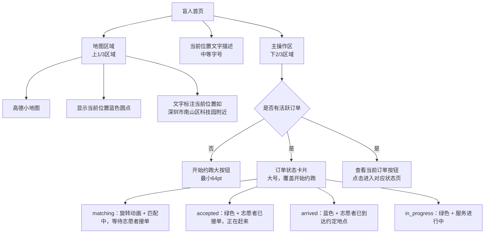

**图表来源**
- [ui-handoff-ios.md:321-433](file://docs/ui-handoff-ios.md#L321-L433)

#### 状态展示规则
- **无订单**：地图 + "开始约跑"大按钮
- **有订单**：地图 + 订单状态卡片 + "查看当前订单"按钮
- **活跃订单状态变化**：状态卡片实时更新（由ViewModel驱动，不在此页轮询）

#### 错误处理
- **定位失败**：地图区域显示"定位失败"占位 + 降级文案，页面仍可用（显示默认坐标）
- **网络错误**：保留上次缓存的状态卡片
- **定位权限拒绝**：地图区域显示"需要定位权限"，显示"去设置"按钮

#### 无障碍设计
| 元素 | accessibilityLabel | accessibilityHint |
|------|--------------------|-------------------|
| "开始约跑"按钮 | "开始约跑" | "点击后创建跑步预约" |
| 订单状态卡片 | "当前订单：" + 状态中文 + "，" + 时间 + "，" + 地点 | "点击查看订单详情" |
| "重复当前状态"按钮 | "重复当前状态" | "点击后重新播报当前页面信息" |
| 地图区域 | "地图，显示当前位置" | — |

**章节来源**
- [ui-handoff-ios.md:321-433](file://docs/ui-handoff-ios.md#L321-L433)
- [ui-reference-audit.md:91-101](file://docs/ui-reference-audit.md#L91-L101)

### 创建预约页详细规范

#### 页面布局
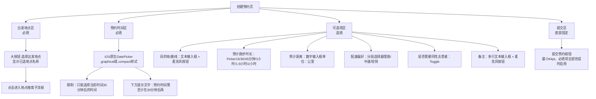

**图表来源**
- [ui-handoff-ios.md:436-579](file://docs/ui-handoff-ios.md#L436-L579)

#### 表单验证规则
- **出发地点**：必填，地点选择器，默认当前定位
- **预约时间**：必填，DatePicker，≥当前时间+30分钟
- **目的地/路线**：选填，文本输入框
- **预计时长**：选填，Picker，6个选项
- **预计距离**：选填，数字键盘，单位公里
- **配速偏好**：选填，分段选择器，3个选项
- **同性志愿者**：选填，Toggle，默认关
- **备注**：选填，多行文本输入框

#### 错误处理
- **定位权限拒绝**：全页拦截："需要开启定位权限才能创建预约" + "去设置"按钮 + TTS播报
- **定位失败**：使用默认测试坐标，显示"使用演示位置"
- **预约时间不足30分钟**：红色提示 + 按钮禁用
- **出发地点未选择**：按钮禁用
- **提交失败**：Toast"提交失败，请重试" + TTS播报

#### 语音输入集成
- **麦克风按钮**：用于启动Speech Framework语音识别
- **支持字段**：地点描述、目的地/路线、备注
- **权限策略**：仅在用户开始语音输入时请求麦克风和语音识别权限

**章节来源**
- [ui-handoff-ios.md:436-579](file://docs/ui-handoff-ios.md#L436-L579)
- [ui-reference-audit.md:103-113](file://docs/ui-reference-audit.md#L103-L113)

### 地点搜索子流程详细规范

#### 页面布局
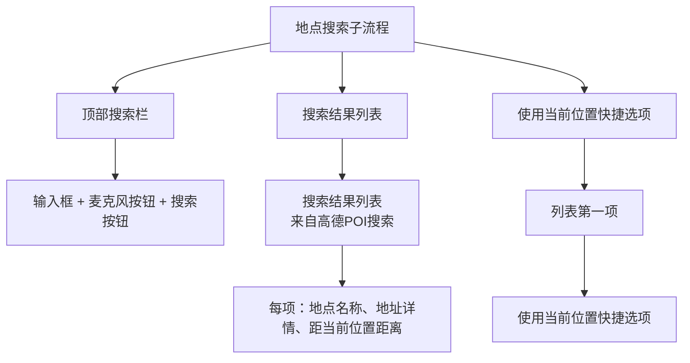

**图表来源**
- [ui-handoff-ios.md:582-684](file://docs/ui-handoff-ios.md#L582-L684)

#### 交互流程
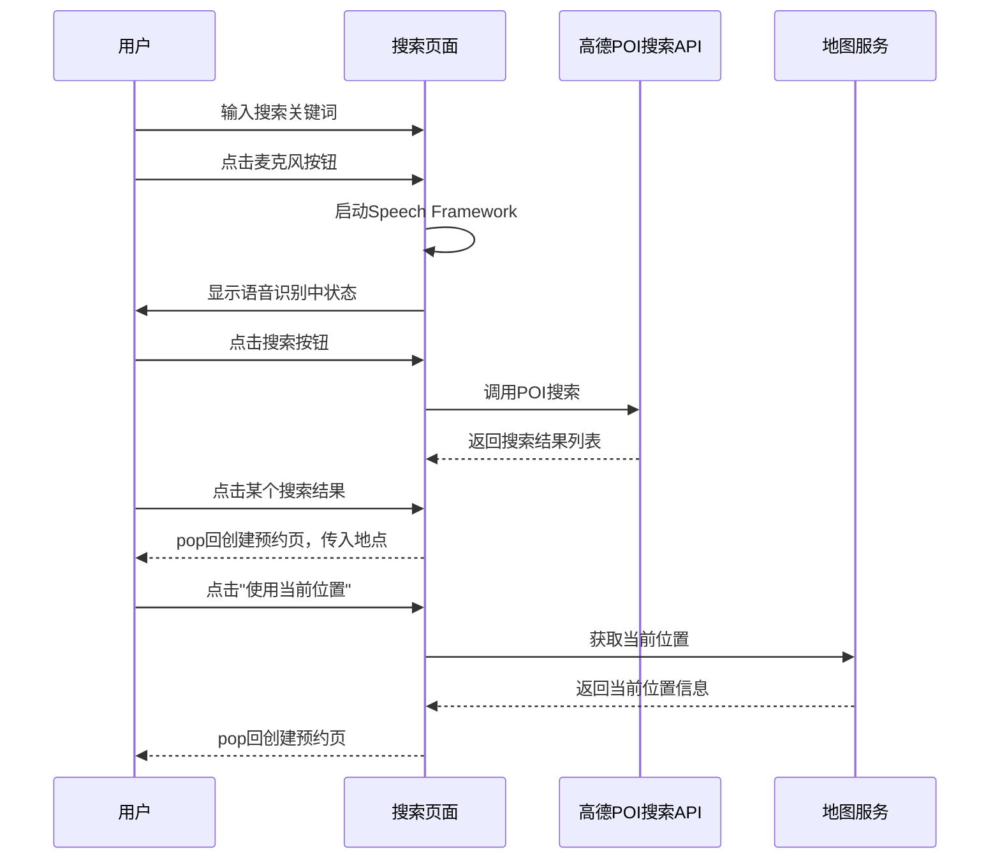

**图表来源**
- [ui-handoff-ios.md:582-684](file://docs/ui-handoff-ios.md#L582-L684)

#### 错误处理
- **POI搜索无结果**：显示"未搜索到相关地点"
- **语音识别失败**：Toast"语音识别失败，请使用键盘输入"
- **语音权限拒绝**：Toast"语音输入不可用"，允许键盘输入
- **高德Key未配置**：显示"地图服务暂不可用"

#### 无障碍设计
| 元素 | accessibilityLabel | accessibilityHint |
|------|--------------------|-------------------|
| 搜索输入框 | "搜索出发地点" | "输入地点关键词进行搜索" |
| 麦克风按钮 | "语音输入出发地点" | "点击后说出地点" |
| 搜索结果行 | 地点名 + "，" + 地址 | "点击选择此地点" |
| "使用当前位置" | "使用当前位置，" + 当前地址 | — |

**章节来源**
- [ui-handoff-ios.md:582-684](file://docs/ui-handoff-ios.md#L582-L684)
- [ui-reference-audit.md:115-125](file://docs/ui-reference-audit.md#L115-L125)

### 盲人订单状态等待页详细规范

#### 页面布局
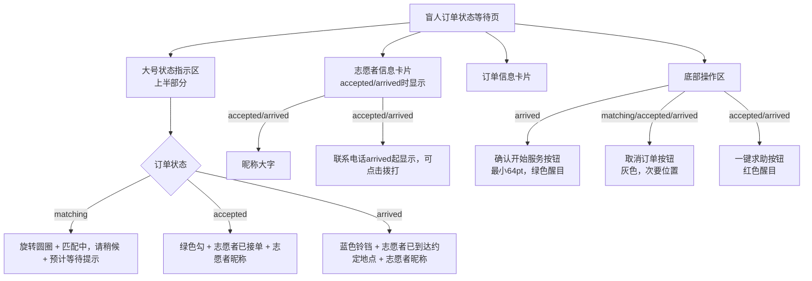

**图表来源**
- [ui-handoff-ios.md:687-800](file://docs/ui-handoff-ios.md#L687-L800)

#### 轮询机制
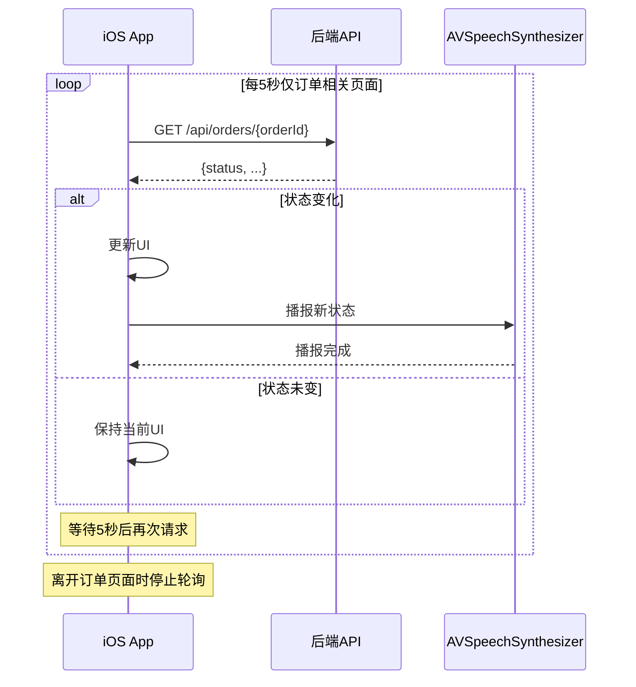

**图表来源**
- [ui-handoff-ios.md:729-744](file://docs/ui-handoff-ios.md#L729-L744)

#### 状态展示规则
| 订单状态 | UI | 轮询 |
|----------|-----|------|
| matching | 旋转圆 + "匹配中" + 取消按钮 | 每5秒`GET /api/orders/{id}` |
| accepted | 志愿者昵称 + "已接单" + 取消按钮 + 求助按钮 | 每5秒轮询 |
| arrived | 志愿者信息 + "已到达" + 确认开始按钮 + 取消按钮 + 求助按钮 | 每5秒轮询 |

#### 错误处理
- **网络错误**：保留上次查询结果，静默重试，不重复播报
- **轮询接口异常**：Toast"获取订单状态失败"
- **确认开始失败**：Toast"操作失败，请重试"
- **取消失败**：Toast"取消失败"

#### 语音播报规则
- **matching**：订单提交成功，正在等待志愿者接单
- **matching → accepted**：志愿者已接单，志愿者正在赶来
- **accepted → arrived**：志愿者已到达约定地点，请确认开始服务
- **matching → cancelled**：抱歉，暂无志愿者可用。本次预约已取消。
- **accepted/arrived → cancelled**：预约已取消
- **注意**：轮询期间只在状态变化时播报一次，不重复播报同一状态

**章节来源**
- [ui-handoff-ios.md:687-800](file://docs/ui-handoff-ios.md#L687-L800)
- [ui-reference-audit.md:127-137](file://docs/ui-reference-audit.md#L127-L137)

## 架构与技术实现

### iOS架构概览

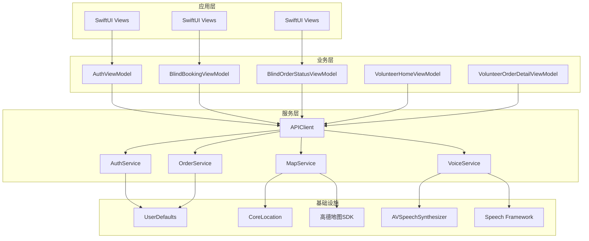

**图表来源**
- [08-ios-architecture.md:18-41](file://docs/08-ios-architecture.md#L18-L41)

### 模块划分

#### 核心模块
- **Core**：应用环境、依赖容器、共享模型、应用状态
- **Auth**：手机号登录、JWT持久化、认证会话
- **Role**：active role切换和角色守卫规则
- **BlindRunner**：盲人跑者首页、资料、预约、订单状态
- **Volunteer**：志愿者首页、可用性、可用订单、服务记录、积分
- **Orders**：订单DTOs、订单状态机助手、轮询
- **Map**：AMap桥接、当前位置、标记、距离计算
- **Voice**：TTS、重复当前状态、语音输入助手
- **Safety**：紧急确认和取消确认流程
- **Profile**：盲人跑者和志愿者资料表单

#### MVVM模式
- **Views**：保持简洁，仅渲染状态和转发用户意图
- **ViewModels**：拥有加载状态、验证状态、API调用、轮询、TTS触发
- **Services**：包装API和平台能力边界
- **DTOs**：镜像OpenAPI模式；领域助手处理显示文本和状态转换

**章节来源**
- [08-ios-architecture.md:18-41](file://docs/08-ios-architecture.md#L18-L41)

### API环境配置

#### 环境支持
| 环境 | 目的 |
|------|------|
| `mock` | 本地假数据用于UI和流程调试 |
| `localBackend` | 局域网Spring Boot后端在开发者Mac上 |
| `production` | 为后续部署预留 |

#### 实现指导
- 定义`APIEnvironment`具有`baseURL`和显示名称
- 使用一个`APIClient`协议，使Mock和真实实现共享调用站点
- 在Debug构建中，在设置或启动配置中暴露小型环境选择器
- `localBackend`应支持LAN IP如`http://192.168.x.x:8080`
- 生产URL可在部署前保持占位符

**章节来源**
- [08-ios-architecture.md:50-66](file://docs/08-ios-architecture.md#L50-L66)

### 轮询机制

#### 轮询策略
- **盲人跑者订单状态页面**：每5秒轮询订单详情
- **轮询条件**：订单状态为`matching`、`accepted`、`arrived`、`in_progress`
- **停止条件**：订单达到`completed`、`cancelled`或`emergency`；页面消失；用户登出

#### 轮询实现
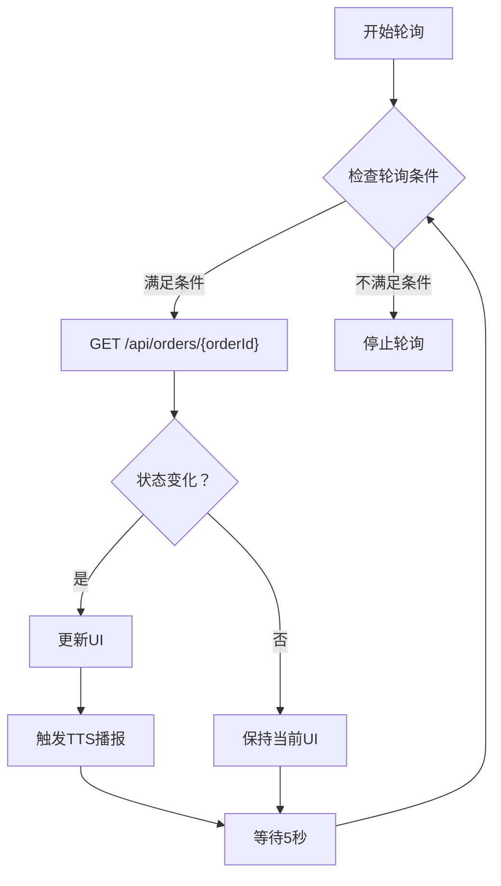

**图表来源**
- [08-ios-architecture.md:125-139](file://docs/08-ios-architecture.md#L125-L139)

**章节来源**
- [08-ios-architecture.md:125-139](file://docs/08-ios-architecture.md#L125-L139)

## 无障碍与语音规范

### 无障碍设计原则

#### 盲人端设计原则
- **语音优先**：盲人端语音优先，屏幕辅助
- **交互极简**：减少层级、复杂表单和并列选择
- **大按钮**：关键操作使用大按钮，最小高度64pt
- **对比度**：支持系统深色/浅色模式，但优先保证可读性、对比度和按钮清晰度
- **双重保障**：VoiceOver、TTS、"重复当前状态"按钮同时存在，互不替代

#### 必需的TTS节点
- 进入盲人首页
- 订单提交成功
- 匹配中
- 志愿者已接单
- 志愿者已到达
- 请确认开始服务
- 服务已开始
- 服务已完成
- 进入求助状态
- 错误提示

#### VoiceOver要求
- **必需覆盖**：登录手机号输入和验证码输入、角色切换控制、盲人首页状态文本、创建预约字段、定位权限提示、提交预约按钮、取消订单按钮、紧急按钮、确认开始按钮、重复当前状态按钮、志愿者可用性开关、可用订单行、接受、到达、完成、取消、紧急操作、评分控制

#### 语音输入规则
- **支持字段**：开始地点文本描述、目的地/路线描述、备注、志愿者服务总结（如有用）
- **权限策略**：不要构建全局AI助手；不要将自然语言时间解析作为核心功能；预约时间保持DatePicker；如果语音输入失败，显示错误并允许键盘输入；仅在用户开始语音输入时请求麦克风和语音识别权限

#### 危险操作确认
- **需要二次确认的操作**：取消订单、进入紧急状态、志愿者完成服务、退出登录
- **紧急确认对话框文案**：是否确认进入求助状态？确认后，本次服务将标记为异常，系统会记录当前订单状态。

**章节来源**
- [09-accessibility-and-voice-guidelines.md:1-143](file://docs/09-accessibility-and-voice-guidelines.md#L1-L143)

### 志愿者端无障碍设计
- **可用性开关**：必须暴露开启/关闭状态
- **订单行**：必须读出昵称、出发地点、预约时间、距离
- **联系方式**：接单前不显示，接单后显示完整电话
- **操作按钮**：必须反映志愿者不可用或未批准时的禁用状态

### 无障碍验收检查清单
- 盲人跑者快乐路径可在启用VoiceOver的情况下完成
- 所有必需的TTS节点在正确的状态变化时播报一次
- "重复当前状态"重复最新的有意义状态
- 定位拒绝阻止预约和志愿者基于距离的接单
- 危险操作在后端变更前显示确认
- 文本和控件在浅色和深色模式下保持可读性

**章节来源**
- [09-accessibility-and-voice-guidelines.md:131-143](file://docs/09-accessibility-and-voice-guidelines.md#L131-L143)

## API接口规范

### 认证相关接口

#### 手机号登录/自动注册
- **端点**：`POST /api/auth/phone-login`
- **描述**：Demo阶段验证码固定为123456，首次登录自动创建账号；首次角色选择前activeRole可为空
- **请求体**：PhoneLoginRequest
- **响应**：AuthResponse（包含JWT token和用户信息）

#### 获取当前用户
- **端点**：`GET /api/users/me`
- **描述**：获取当前登录用户信息
- **响应**：UserMeResponse

#### 切换activeRole
- **端点**：`PATCH /api/users/me/active-role`
- **描述**：共用同一个JWT；存在accepted/arrived/in_progress/emergency订单时禁止切换
- **请求体**：SwitchRoleRequest
- **响应**：UserDto

### 资料管理接口

#### 盲人资料创建/更新
- **端点**：`PUT /api/profiles/blind-runner`
- **请求体**：BlindRunnerProfileUpsertRequest
- **响应**：BlindRunnerProfileDto

#### 志愿者资料创建/更新
- **端点**：`PUT /api/profiles/volunteer`
- **请求体**：VolunteerProfileUpsertRequest
- **响应**：VolunteerProfileDto

### 志愿者相关接口

#### Mock认证通过
- **端点**：`POST /api/volunteer/mock-verification/approve`
- **描述**：MVP不做真实实名认证；调用后verificationStatus和adminReviewStatus均设为approved
- **响应**：VolunteerProfileDto

#### 可服务开关
- **端点**：`PATCH /api/volunteer/availability`
- **描述**：关闭后仍可查看订单，但不能接新单
- **请求体**：AvailabilityRequest
- **响应**：VolunteerProfileDto

### 订单相关接口

#### 创建预约订单
- **端点**：`POST /api/orders`
- **描述**：预约时间必须至少为当前时间30分钟后；必须有盲人资料和定位信息
- **请求体**：CreateOrderRequest
- **响应**：RunOrderDto（状态初始为matching）

#### 获取我的订单
- **端点**：`GET /api/orders/my`
- **描述**：用于盲人端订单状态轮询和双方查看历史；MVP不分页
- **参数**：status（可选）
- **响应**：RunOrderDto数组

#### 订单状态操作
- **接单**：`POST /api/orders/{orderId}/accept`
- **到达**：`POST /api/orders/{orderId}/arrive`
- **确认开始服务**：`POST /api/orders/{orderId}/confirm-start`
- **结束服务**：`POST /api/orders/{orderId}/complete`
- **取消订单**：`POST /api/orders/{orderId}/cancel`
- **紧急求助**：`POST /api/orders/{orderId}/emergency`

### 错误响应规范

#### 常见错误码
- **APPOINTMENT_TOO_SOON**：预约时间至少需要在30分钟后
- **LOCATION_PERMISSION_REQUIRED**：创建预约需要开启定位权限
- **PROFILE_INCOMPLETE**：请先完善盲人资料和紧急联系人
- **ORDER_ALREADY_ACCEPTED**：该订单已被其他志愿者接单
- **ACTIVE_ORDER_ROLE_SWITCH_BLOCKED**：您有进行中的订单，无法切换角色

**章节来源**
- [07-api-contract.openapi.yaml:25-200](file://docs/07-api-contract.openapi.yaml#L25-L200)

## 开发指南

### 项目结构

#### 目录结构
```
blindRun/
├── Assets.xcassets/          # 应用资源
├── ContentView.swift         # 主视图容器
├── blindRunApp.swift         # 应用入口
└── Tests/                    # 测试文件
```

#### 模块组织
```
Core/                         # 核心模块
├── AppState.swift           # 应用状态管理
├── APIService.swift         # API服务封装
└── Utils.swift             # 工具类

Auth/                         # 认证模块
├── AuthViewModel.swift      # 认证ViewModel
├── AuthService.swift        # 认证服务
└── LoginView.swift          # 登录页面

BlindRunner/                  # 盲人跑者模块
├── Profile/                 # 资料模块
├── Booking/                 # 预约模块
├── Orders/                  # 订单模块
└── Home/                    # 首页模块

Volunteer/                    # 志愿者模块
├── Profile/                 # 资料模块
├── Dashboard/               # 工作台模块
├── Orders/                  # 订单模块
└── Services/                # 服务模块

Shared/                       # 共享模块
├── Models/                  # 数据模型
├── Views/                   # 通用视图
├── Services/                # 通用服务
└── Utilities/               # 通用工具
```

### 开发规范

#### 代码风格
- **命名规范**：使用驼峰命名法，ViewModel以ViewModel结尾
- **文件组织**：按功能模块组织，每个模块包含Model、View、ViewModel、Service
- **注释规范**：为每个公共方法和重要逻辑添加注释说明

#### 错误处理
- **统一错误处理**：所有API调用使用统一的错误处理机制
- **用户友好提示**：错误信息以Toast形式展示，同时触发TTS播报
- **重试机制**：简单的重试逻辑，MVP不添加复杂的离线队列

#### 状态管理
- **单一数据源**：AppState作为单一数据源管理应用状态
- **状态同步**：ViewModel负责与后端API同步状态
- **UI更新**：使用@StateObject和@ObservableObject确保UI自动更新

### 调试与测试

#### 调试技巧
- **环境切换**：在Debug构建中提供环境选择器
- **日志输出**：使用print和调试日志记录关键信息
- **断点调试**：合理使用断点调试异步操作

#### 单元测试
- **ViewModel测试**：测试业务逻辑和状态转换
- **Service测试**：测试API调用和数据处理
- **集成测试**：测试完整的用户流程

**章节来源**
- [08-ios-architecture.md:1-165](file://docs/08-ios-architecture.md#L1-L165)

## 测试与验证

### 测试策略

#### 单元测试
- **认证流程测试**：手机号登录、验证码验证、Token管理
- **角色切换测试**：角色选择、切换拦截、状态保持
- **订单流程测试**：创建预约、状态轮询、状态转换
- **地图功能测试**：定位获取、标记显示、距离计算

#### 集成测试
- **完整流程测试**：从登录到完成的完整用户流程
- **边界条件测试**：定位权限拒绝、网络异常、服务器错误
- **无障碍测试**：VoiceOver导航、TTS播报、大按钮操作

#### 性能测试
- **启动性能**：应用启动时间、页面加载时间
- **内存使用**：内存泄漏检测、内存峰值监控
- **电池消耗**：后台轮询对电池的影响

### 验收标准

#### 功能验收
- **登录认证**：手机号登录、自动注册、Token持久化
- **角色管理**：角色选择、切换、拦截机制
- **预约功能**：地点搜索、时间选择、提交预约
- **订单状态**：状态轮询、状态转换、紧急求助
- **地图集成**：定位获取、标记显示、距离计算

#### 无障碍验收
- **VoiceOver支持**：所有关键页面的VoiceOver导航
- **TTS播报**：关键状态变化的语音播报
- **大按钮设计**：关键按钮的尺寸和可触摸性
- **错误处理**：错误信息的视觉和语音提示

#### 性能验收
- **响应时间**：页面切换时间、API响应时间
- **内存使用**：内存峰值不超过限制
- **电池消耗**：后台轮询对电池的影响在可接受范围内

### 测试用例

#### 登录流程测试用例
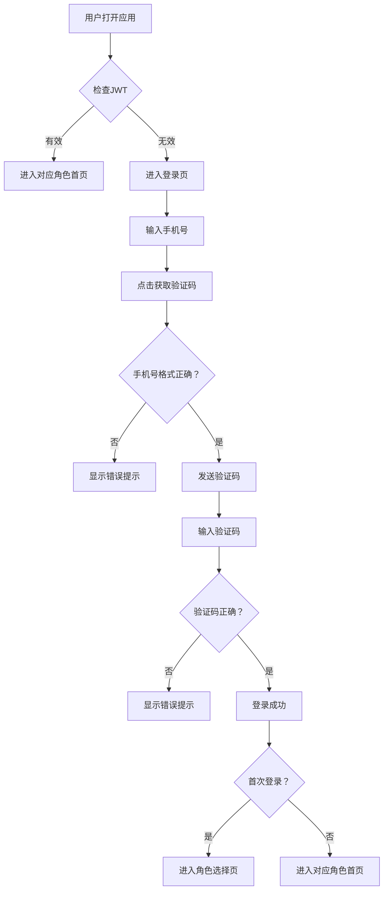

#### 订单状态测试用例
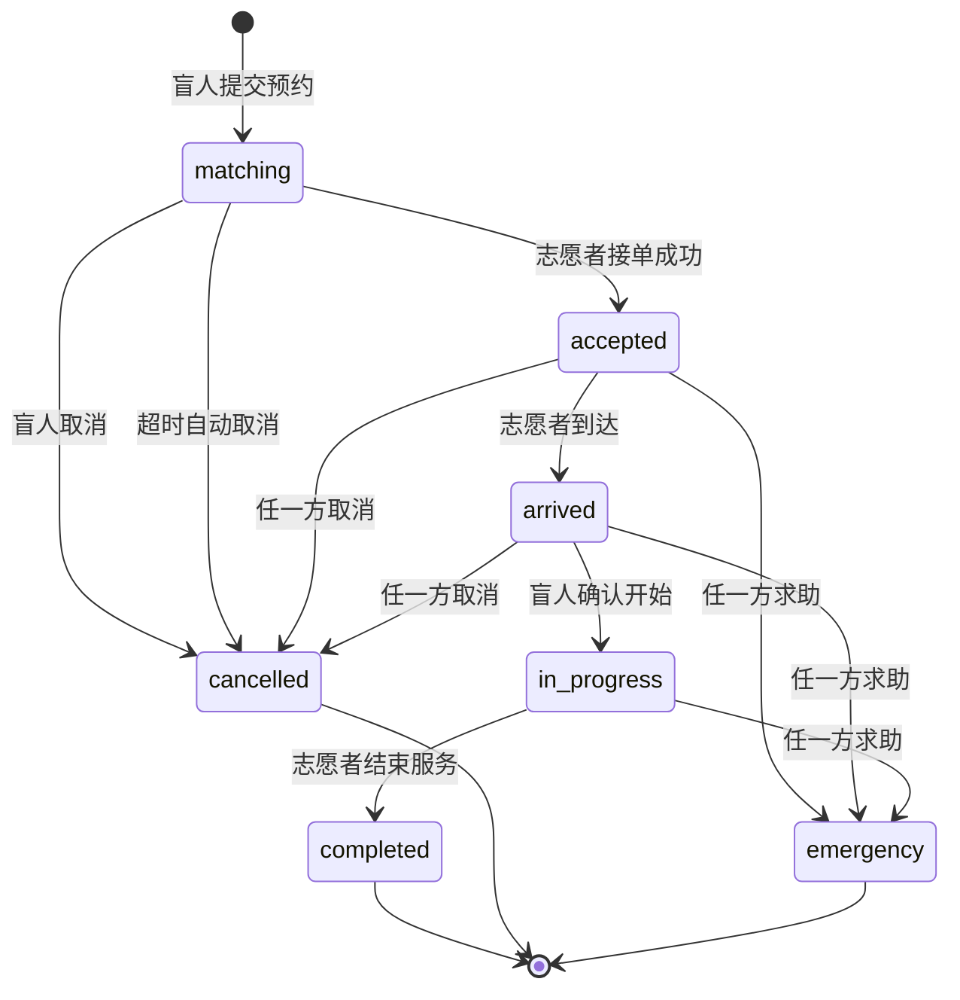

**图表来源**
- [04-user-flows-and-state-machine.md:74-96](file://docs/04-user-flows-and-state-machine.md#L74-L96)

## 附录

### 常用工具和资源

#### 开发工具
- **Xcode**：iOS开发环境
- **SwiftLint**：代码风格检查
- **SwiftFormat**：代码格式化
- **CocoaPods**：依赖管理

#### 设计资源
- **颜色系统**：深色背景、高对比度文字
- **字体系统**：大字号（≥20pt body）
- **图标系统**：SF Symbols
- **间距系统**：16pt基础间距

#### 第三方库
- **高德地图SDK**：地图显示和定位
- **Alamofire**：网络请求（可选）
- **ObjectMapper**：JSON序列化（可选）
- **KeychainAccess**：安全存储（生产环境）

### 最佳实践

#### 代码组织
- **模块化设计**：按功能模块组织代码
- **单一职责**：每个类和函数只负责一个功能
- **依赖注入**：使用依赖注入管理依赖关系
- **异步编程**：使用async/await处理异步操作

#### 性能优化
- **懒加载**：使用lazy关键字延迟初始化
- **内存管理**：及时释放不需要的对象
- **网络优化**：合理的请求频率和缓存策略
- **UI优化**：避免不必要的视图重绘

#### 安全考虑
- **数据加密**：敏感数据使用Keychain存储
- **网络安全**：HTTPS传输，证书验证
- **权限管理**：最小权限原则
- **输入验证**：严格的输入验证和清理

### 故障排除

#### 常见问题
- **定位权限问题**：检查Info.plist中的定位权限描述
- **地图SDK问题**：检查高德Key配置和网络连接
- **网络请求问题**：检查API端点和错误处理
- **VoiceOver问题**：检查accessibilityLabel和accessibilityHint设置

#### 调试方法
- **日志输出**：使用print和调试日志
- **断点调试**：使用Xcode断点调试
- **网络抓包**：使用Charles或Wireshark
- **性能分析**：使用Instruments分析性能

**章节来源**
- [01-product-requirements.md:96-115](file://docs/01-product-requirements.md#L96-L115)
- [02-mvp-scope.md:92-116](file://docs/02-mvp-scope.md#L92-L116)