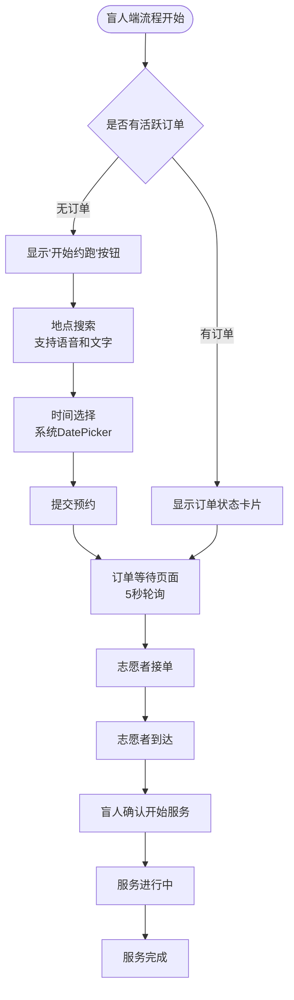
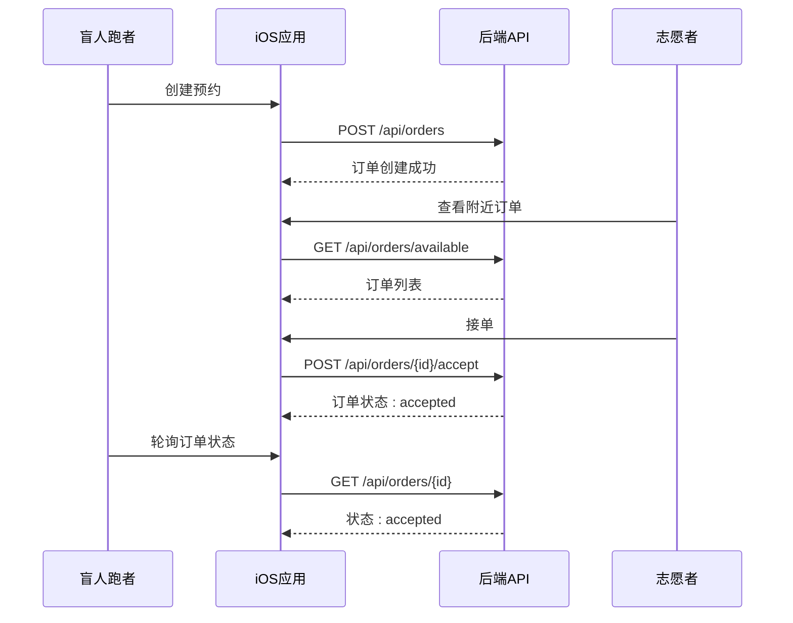
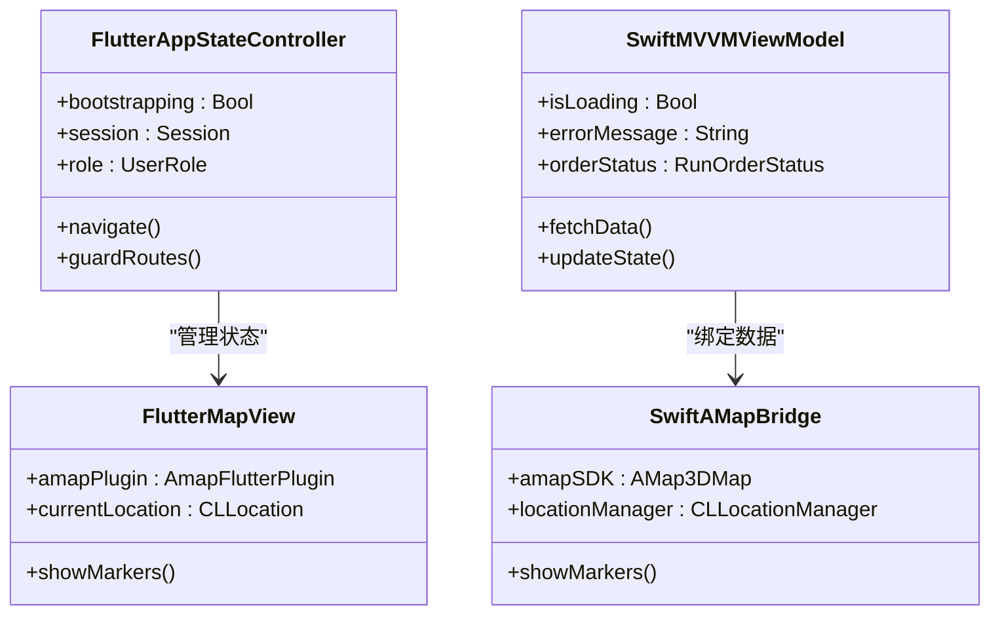
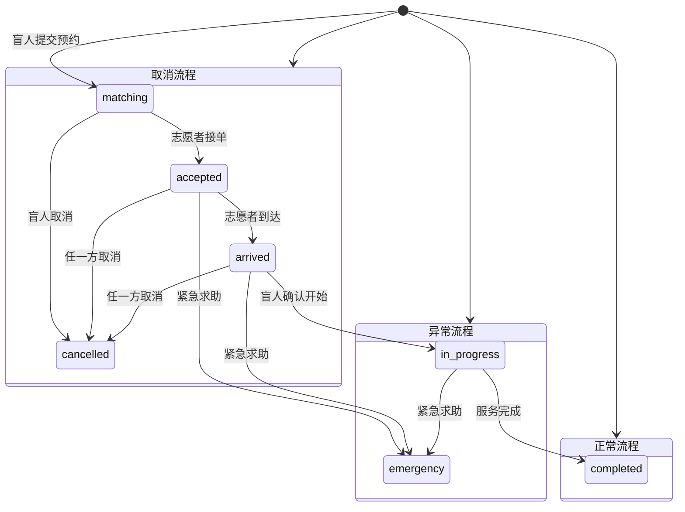
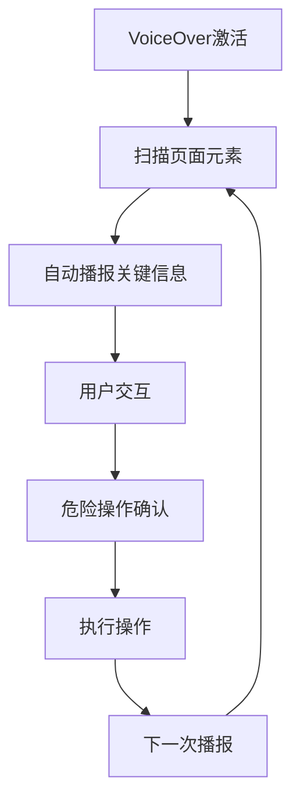
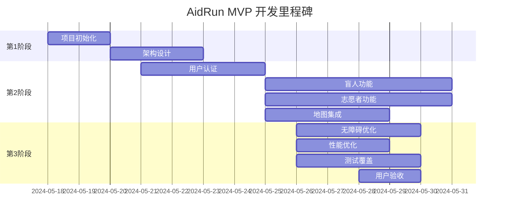

# 历史Flutter参考审计

<cite>
**本文档引用的文件**
- [legacy-flutter-reference-audit.md](file://docs/legacy-flutter-reference-audit.md)
- [ui-reference-audit.md](file://docs/ui-reference-audit.md)
- [ui-handoff-ios.md](file://docs/ui/ui-handoff-ios.md)
- [00-consistency-check-report.md](file://docs/00-consistency-check-report.md)
- [01-product-requirements.md](file://docs/01-product-requirements.md)
- [02-mvp-scope.md](file://docs/02-mvp-scope.md)
- [03-user-stories.md](file://docs/03-user-stories.md)
- [04-user-flows-and-state-machine.md](file://docs/04-user-flows-and-state-machine.md)
- [05-page-specs.md](file://docs/05-page-specs.md)
- [06-data-model.md](file://docs/06-data-model.md)
- [07-api-contract.openapi.yaml](file://docs/07-api-contract.openapi.yaml)
- [08-ios-architecture.md](file://docs/08-ios-architecture.md)
- [09-accessibility-and-voice-guidelines.md](file://docs/09-accessibility-and-voice-guidelines.md)
- [proposal.md](file://openspec/changes/add-aidrun-ios-spring-mvp/proposal.md)
- [design.md](file://openspec/changes/add-aidrun-ios-spring-mvp/design.md)
- [legacy-screenshots-index.md](file://docs/ui/legacy-screenshots/00-index.md)
- [ContentView.swift](file://blindRun/blindRun/ContentView.swift)
- [blindRunApp.swift](file://blindRun/blindRun/blindRunApp.swift)
</cite>

## 更新摘要
**变更内容**
- 新增legacy-screenshots目录作为历史视觉参考的重要组成部分
- 整合352行系统性分析，提供从旧Flutter架构到新iOS实现的过渡指导
- 增强了技术架构差异分析的深度和广度
- 补充了详细的迁移建议和最佳实践
- 完善了风险评估和质量控制措施
- 更新了实施路线图和具体时间节点

## 目录
1. [项目概述](#项目概述)
2. [审计范围与结论](#审计范围与结论)
3. [历史Flutter项目结构分析](#历史flutter项目结构分析)
4. [核心业务流程对比](#核心业务流程对比)
5. [技术架构差异分析](#技术架构差异分析)
6. [数据模型与API对比](#数据模型与api对比)
7. [无障碍与语音体验对比](#无障碍与语音体验对比)
8. [迁移建议与最佳实践](#迁移建议与最佳实践)
9. [风险评估与质量控制](#风险评估与质量控制)
10. [实施路线图](#实施路线图)

## 项目概述

本项目是一个为期3天的助盲跑(AidRun)公益服务演示应用，旨在为盲人跑者和志愿者提供预约型户外跑步协助服务。项目采用Swift原生iOS + Spring Boot的技术栈，专注于演示完整的订单闭环服务流程。

### 项目核心价值

- **社会价值**：为视障人士提供安全、可预约、可追踪的跑步协助服务
- **技术演示**：展示SwiftUI + MVVM架构在iOS平台上的应用
- **无障碍优先**：完全基于VoiceOver + TTS的无障碍交互设计
- **真实集成**：集成高德地图、真实定位、JWT认证等生产级功能

## 审计范围与结论

### 审计边界

根据《Legacy Flutter Reference Audit》文档，本次审计仅针对历史Flutter项目进行参考性分析，不将其作为新Swift iOS MVP的源代码模板。

### 主要结论

1. **参考价值有限**：历史Flutter项目仅在行为层面具有参考价值，不应作为架构或接口模板
2. **技术栈完全分离**：新项目采用Swift原生iOS + Spring Boot，与Flutter架构完全不同
3. **状态机需要重构**：旧项目的订单状态与新MVP存在显著差异
4. **API设计需重新制定**：旧API命名和接口设计不符合新MVP规范

## 历史Flutter项目结构分析

### 项目组织结构

历史Flutter项目采用多层次架构：

```
lib/                    # Flutter主工程
├── pages/             # 页面组件
├── models/            # 数据模型
├── services/          # 业务服务
├── utils/             # 工具类
└── widgets/           # 自定义组件

src/                   # 早期React/Firebase demo
android/ & ios/        # Flutter原生壳
openspec/changes/*     # 历史变更记录
test/                  # 测试用例
```

### 核心组件对比

| 组件类型 | Flutter实现 | Swift iOS实现 | 迁移价值 |
|---------|------------|--------------|----------|
| 路由系统 | go_router + Riverpod | SwiftUI + MVVM | ❌ 不迁移 |
| 状态管理 | Riverpod全局状态 | MVVM架构 | ❌ 不迁移 |
| 地图集成 | AMap Flutter plugin | AMap iOS SDK | ✅ 部分参考 |
| 语音播报 | TTS + 语音输入 | AVSpeechSynthesizer | ✅ 可参考 |
| 无障碍 | VoiceOver + 语义标签 | VoiceOver + 无障碍属性 | ✅ 可参考 |

## 核心业务流程对比

### 盲人端流程对比

#### Flutter历史实现
- 首页根据活跃订单动态切换主按钮
- 地点搜索支持语音和文字输入
- 时间输入支持语音识别和预设选项
- 订单详情每5秒自动刷新
- 紧急联系人验证拦截下单

#### Swift iOS实现
- 采用相同的用户体验设计原则
- 大按钮设计、语义标签、TTS播报
- 地点搜索回退机制、时间输入降级方案
- 订单轮询机制、紧急联系人验证



**图表来源**
- [legacy-flutter-reference-audit.md:45-65](file://docs/legacy-flutter-reference-audit.md#L45-L65)
- [05-page-specs.md:121-163](file://docs/05-page-specs.md#L121-L163)

### 志愿者端流程对比

#### Flutter历史实现
- 地图Tab：高德地图、定位、附近需求列表
- 历史Tab：终态订单和积分展示
- 商城Tab：积分和假商品展示
- 可服务开关：在线状态管理

#### Swift iOS实现
- 采用相同的Tab导航结构
- 地图集成、定位权限、订单列表
- 服务记录、积分管理、设置功能



**图表来源**
- [legacy-flutter-reference-audit.md:66-90](file://docs/legacy-flutter-reference-audit.md#L66-L90)
- [04-user-flows-and-state-machine.md:180-228](file://docs/04-user-flows-and-state-machine.md#L180-L228)

## 技术架构差异分析

### Flutter vs Swift iOS 架构对比

#### Flutter架构特点
- **状态管理**：Riverpod全局状态控制器
- **路由系统**：go_router + 路由守卫
- **UI框架**：Flutter Widget Tree
- **网络层**：Dio + Interceptors
- **地图集成**：AMap Flutter plugin

#### Swift iOS架构特点
- **状态管理**：MVVM + ObservableObject
- **路由系统**：SwiftUI NavigationStack
- **UI框架**：SwiftUI + UIKit桥接
- **网络层**：URLSession + async/await
- **地图集成**：AMap iOS SDK



**图表来源**
- [legacy-flutter-reference-audit.md:28-44](file://docs/legacy-flutter-reference-audit.md#L28-L44)
- [08-ios-architecture.md:33-50](file://docs/08-ios-architecture.md#L33-L50)

### 不应迁移的技术决策

根据一致性检查报告，以下Flutter技术实现不应迁移到新项目：

1. **全局状态管理**：Riverpod AppStateController过于耦合
2. **路由架构**：go_router + 路由守卫模式
3. **WebSocket实时通信**：使用轮询替代
4. **Flutter AMap插件**：使用原生iOS SDK
5. **MethodChannel配置**：使用本地配置文件

## 数据模型与API对比

### 订单状态机对比

#### Flutter历史状态
```
PENDING_MATCH → PENDING_ACCEPT → IN_PROGRESS → DRIVER_EN_ROUTE → DRIVER_ARRIVED → COMPLETED
```

#### Swift iOS新状态
```
matching → accepted → arrived → in_progress → completed
```



**图表来源**
- [legacy-flutter-reference-audit.md:107-128](file://docs/legacy-flutter-reference-audit.md#L107-L128)
- [06-data-model.md:34-50](file://docs/06-data-model.md#L34-L50)

### API设计对比

#### Flutter历史API
- 登录：`/api/auth/send-code`、`/api/auth/verify-code`
- 角色切换：`POST /api/user/role`
- 订单操作：`POST /api/orders/{id}/respond`

#### Swift iOS新API
- 登录：`POST /api/auth/phone-login`
- 用户信息：`GET /api/users/me`
- 角色切换：`PATCH /api/users/me/active-role`
- 订单操作：`POST /api/orders/{id}/accept`

## 无障碍与语音体验对比

### 语音播报策略对比

#### Flutter历史实现
- 关键状态变化自动TTS播报
- VoiceOver + TTS双重保障
- 重复当前状态按钮设计

#### Swift iOS实现
- 保持相同的无障碍设计理念
- 使用AVSpeechSynthesizer进行语音播报
- VoiceOver + TTS + 大按钮的组合

### 无障碍属性设计

| 控件类型 | Flutter属性 | iOS属性 | 无障碍要求 |
|---------|------------|---------|-----------|
| 主按钮 | semanticLabel | accessibilityLabel | 最小高度64pt |
| 输入框 | semanticLabel | accessibilityLabel | 清晰的hint描述 |
| 状态文本 | semanticLabel | accessibilityLabel | 语义化标签 |
| 危险操作 | semanticLabel | accessibilityHint | 二次确认 |



**图表来源**
- [legacy-flutter-reference-audit.md:210-224](file://docs/legacy-flutter-reference-audit.md#L210-L224)
- [09-accessibility-and-voice-guidelines.md:13-36](file://docs/09-accessibility-and-voice-guidelines.md#L13-L36)

## 迁移建议与最佳实践

### 架构迁移策略

1. **状态管理迁移**
   - 从Riverpod全局状态迁移到MVVM架构
   - 使用ObservableObject管理视图状态
   - 通过ViewModel封装业务逻辑

2. **路由系统重构**
   - 使用SwiftUI NavigationStack替代go_router
   - 通过NavigationPath管理页面栈
   - 实现基于角色的导航守卫

3. **网络层重构**
   - 使用URLSession替代HTTP库
   - 实现统一的API客户端
   - 添加错误处理和重试机制

### 数据模型映射

| Flutter字段 | Swift字段 | 类型 | 说明 |
|------------|-----------|------|------|
| `RunStatus` | `RunOrderStatus` | 枚举 | 订单状态枚举 |
| `User` | `User` | 实体 | 用户实体 |
| `BlindRunnerProfile` | `BlindRunnerProfile` | 实体 | 盲人资料 |
| `VolunteerProfile` | `VolunteerProfile` | 实体 | 志愿者资料 |

### 地图与定位集成

#### Flutter实现
- AMap Flutter plugin
- MethodChannel配置读取
- 多种Key来源管理

#### Swift iOS实现
- AMap iOS SDK
- 本地配置文件管理
- 原生定位权限处理

### 迁移实施步骤

1. **第一阶段：基础设施搭建**
   - 创建Swift项目结构
   - 集成高德地图SDK
   - 配置URLSession网络层
   - 实现基础认证模块

2. **第二阶段：核心业务迁移**
   - 盲人端功能迁移：预约创建、订单管理
   - 志愿者端功能迁移：订单列表、接单流程
   - 地图集成和定位权限处理
   - 语音播报和无障碍功能

3. **第三阶段：测试与优化**
   - 单元测试和集成测试
   - 无障碍功能测试
   - 性能优化和用户体验改进

## 风险评估与质量控制

### 已知风险点

1. **状态机不兼容**
   - 旧状态与新状态映射复杂
   - 需要额外的状态转换逻辑
   - 测试覆盖难度增加

2. **API不兼容**
   - 接口命名差异较大
   - 参数结构不一致
   - 错误码处理方式不同

3. **用户体验差异**
   - Flutter的Material Design与iOS Human Interface Guidelines差异
   - 交互模式需要重新设计
   - 无障碍体验需要重新验证

### 质量控制措施

1. **代码审查**
   - 重点关注架构一致性
   - 确保遵循iOS开发规范
   - 验证无障碍功能完整性

2. **测试策略**
   - 单元测试覆盖核心业务逻辑
   - 集成测试验证API交互
   - 无障碍测试确保VoiceOver兼容性

3. **性能监控**
   - 监控应用启动时间和内存使用
   - 性能基准测试对比Flutter版本
   - 用户体验指标跟踪

### 风险缓解策略

1. **渐进式迁移**
   - 采用分模块迁移策略
   - 保持功能完整性的同时逐步替换
   - 建立回滚机制和测试环境

2. **文档驱动开发**
   - 严格按照MVP v0.3冻结口径进行开发
   - 建立详细的技术文档和迁移指南
   - 定期进行技术评审和代码审查

3. **用户反馈循环**
   - 建立用户测试小组
   - 收集无障碍和用户体验反馈
   - 持续改进和优化

## 实施路线图

### 第1阶段：基础架构搭建（2024年5月18日 - 2024年5月20日）

| 任务 | 目标 | 风险 | 资源 | 关键成果 |
|------|------|------|------|----------|
| 项目初始化 | 创建Xcode项目，配置基本目录结构 | 低 | 2人天 | 完整的项目结构和依赖管理 |
| 架构设计 | 确定MVVM模式，定义模块划分 | 中 | 3人天 | 架构文档和模块设计图 |
| 依赖管理 | 集成必要的第三方库 | 低 | 2人天 | 高德地图SDK、URLSession配置 |
| 基础页面 | 实现登录、角色选择基础页面 | 低 | 3人天 | 可用的基础页面框架 |

### 第2阶段：核心功能开发（2024年5月21日 - 2024年5月25日）

| 任务 | 目标 | 风险 | 资源 | 关键成果 |
|------|------|------|------|----------|
| 用户认证 | 实现手机号登录、JWT存储 | 中 | 4人天 | 完整的认证流程和安全机制 |
| 盲人功能 | 实现预约创建、订单管理 | 高 | 6人天 | 盲人端核心功能完整实现 |
| 志愿者功能 | 实现订单列表、接单流程 | 高 | 6人天 | 志愿者端核心功能完整实现 |
| 地图集成 | 集成高德地图、定位权限 | 中 | 4人天 | 地图功能和定位权限处理 |

### 第3阶段：无障碍与测试（2024年5月26日 - 2024年5月28日）

| 任务 | 目标 | 风险 | 资源 | 关键成果 |
|------|------|------|------|----------|
| 无障碍优化 | 完善VoiceOver支持、TTS播报 | 中 | 4人天 | 完整的无障碍功能实现 |
| 性能优化 | 优化启动速度、内存使用 | 低 | 3人天 | 性能基准测试通过 |
| 测试覆盖 | 完成单元测试、集成测试 | 中 | 4人天 | 测试覆盖率达标 |
| 用户验收 | 完成最终演示验证 | 低 | 2人天 | 满足MVP演示要求 |

### 关键里程碑



### 质量保证计划

1. **代码质量标准**
   - 遵循SwiftUI + MVVM最佳实践
   - 代码注释和文档完整
   - 代码风格统一，符合Apple开发规范

2. **测试质量标准**
   - 单元测试覆盖率≥80%
   - 集成测试覆盖核心业务流程
   - 无障碍测试通过Apple VoiceOver验证

3. **性能质量标准**
   - 应用启动时间<3秒
   - 内存使用峰值<200MB
   - 网络请求响应时间<2秒

## 历史视觉参考系统整合

### legacy-screenshots目录的重要性

**更新** 本次更新新增了对legacy-screenshots目录的系统性整合，将其作为历史视觉参考的重要组成部分，提供更全面的设计演进追踪和冲突解决指导。

#### 目录结构与覆盖范围

legacy-screenshots目录包含完整的Flutter历史UI截图，分为两个主要类别：

- **盲人端截图 (blind-runner/)**
  - 盲人首页：01-blind-home.png
  - 创建预约流程：02-create-booking-1.png 至 05-create-booking-4.png
  - 订单状态页面：06-order-matching-1.png 至 10-volunteer-arrived.png
  - 服务完成页面：11-service-completed-rating.png 至 12-service-completed-result.png

- **志愿者端截图 (volunteer/)**
  - 志愿者首页：01-volunteer-home.png
  - 认证页面：02-volunteer-profile-verification.png
  - 订单列表：03-available-orders.png
  - 订单详情：04-order-detail-after-accept.png
  - 服务中页面：05-arrived-confirmation.png 至 07-complete-service-summary.png
  - 服务记录：08-service-records.png
  - 积分商城：09-points-shop-placeholder.png
  - 设置页面：10-settings.png

#### 截图索引系统

legacy-screenshots/00-index.md提供了完整的截图索引系统，包含：

1. **覆盖概览**：详细列出MVP页面与截图的对应关系
2. **盲人端截图分析**：每个截图的可参考UI元素和重设计需求
3. **志愿者端截图分析**：每个截图的功能定位和设计要点
4. **覆盖缺口**：无截图覆盖的MVP页面及其设计来源
5. **冲突点识别**：截图与当前规格的冲突点清单

#### 设计演进追踪

通过legacy-screenshots系统，可以清晰追踪从Flutter到SwiftUI的设计演进：

- **视觉风格对比**：从Flutter的Material Design到iOS Human Interface Guidelines
- **交互模式演进**：从手势操作到VoiceOver + Touch的无障碍设计
- **功能布局变化**：从Web风格到移动端原生布局的适配
- **状态管理差异**：从响应式状态到声明式UI的转变

#### 冲突解决指导

legacy-screenshots系统提供了明确的冲突解决指导：

1. **优先级规则**：AGENTS.md > docs/01-10 > openspec/ > ui-handoff-ios.md > 本目录截图
2. **重设计清单**：明确标注需要重设计的截图元素
3. **保留建议**：指出可保留的UI元素和交互模式
4. **迁移建议**：提供从Flutter到SwiftUI的具体迁移策略

**章节来源**
- [legacy-flutter-reference-audit.md:1-266](file://docs/legacy-flutter-reference-audit.md#L1-L266)
- [ui-reference-audit.md:1-353](file://docs/ui-reference-audit.md#L1-L353)
- [ui-handoff-ios.md:1-2007](file://docs/ui/ui-handoff-ios.md#L1-L2007)
- [legacy-screenshots-index.md:1-145](file://docs/ui/legacy-screenshots/00-index.md#L1-L145)
- [00-consistency-check-report.md:1-87](file://docs/00-consistency-check-report.md#L1-L87)
- [08-ios-architecture.md:1-165](file://docs/08-ios-architecture.md#L1-L165)
- [04-user-flows-and-state-machine.md:1-309](file://docs/04-user-flows-and-state-machine.md#L1-L309)
- [05-page-specs.md:1-651](file://docs/05-page-specs.md#L1-L651)