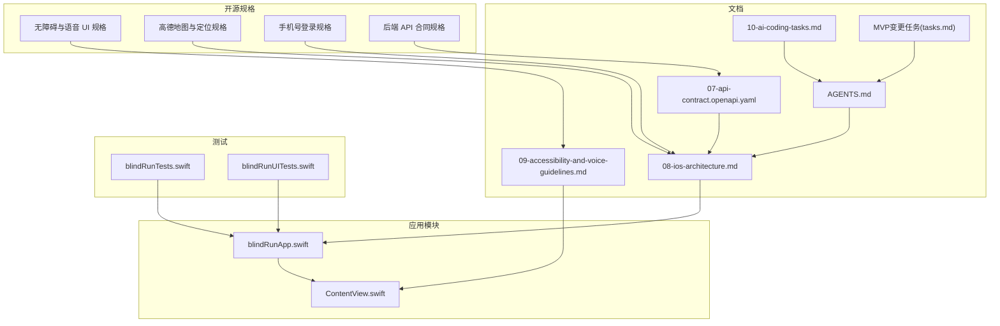
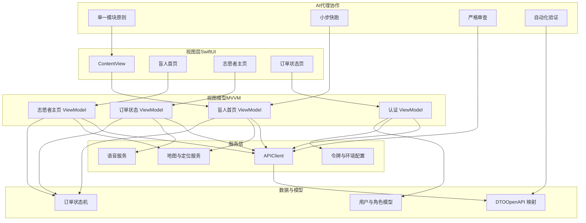
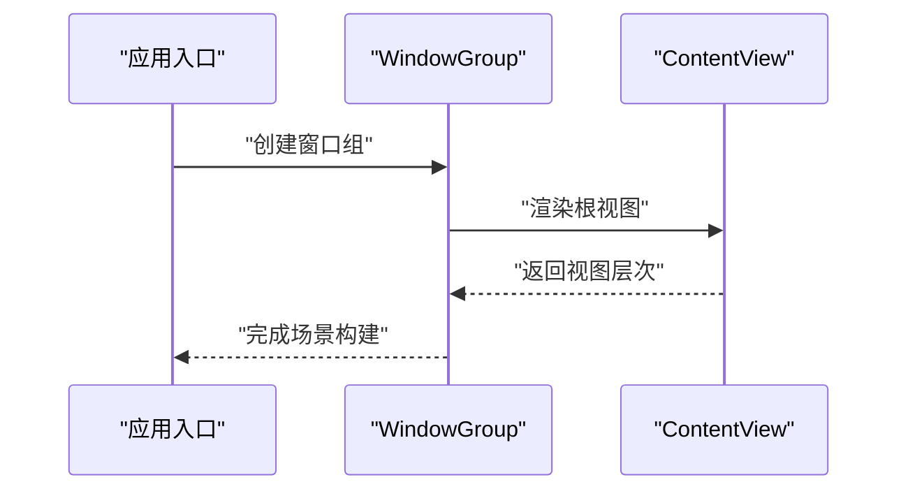
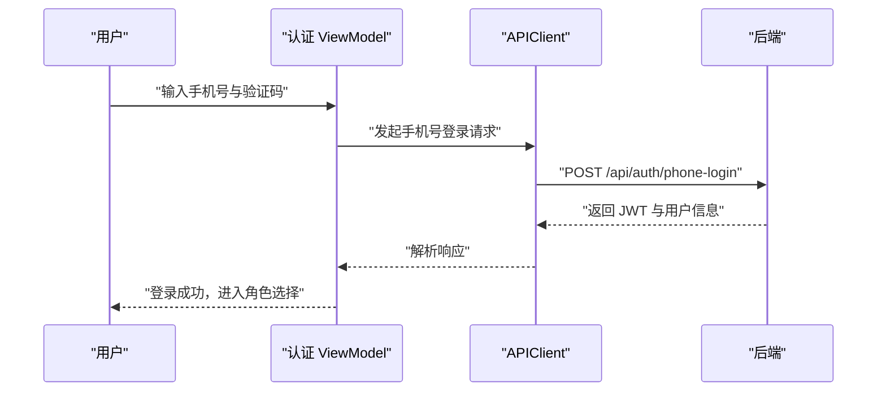
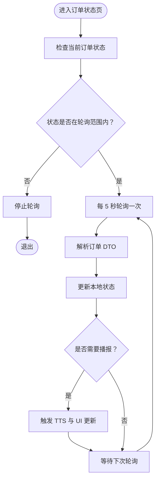
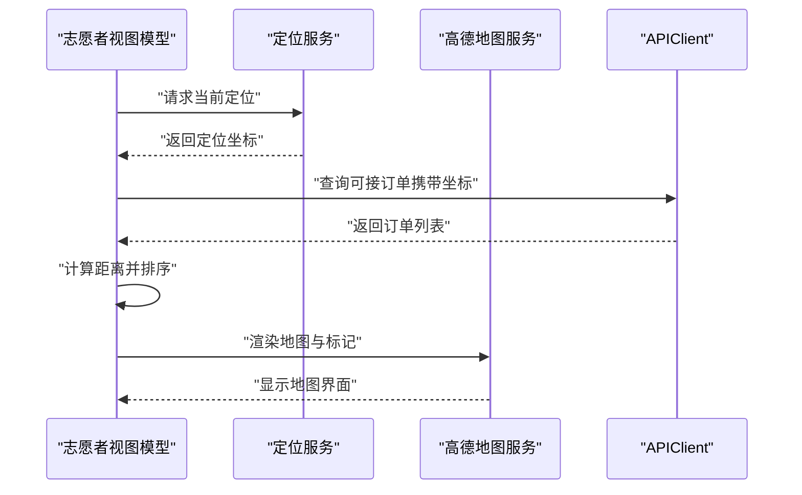
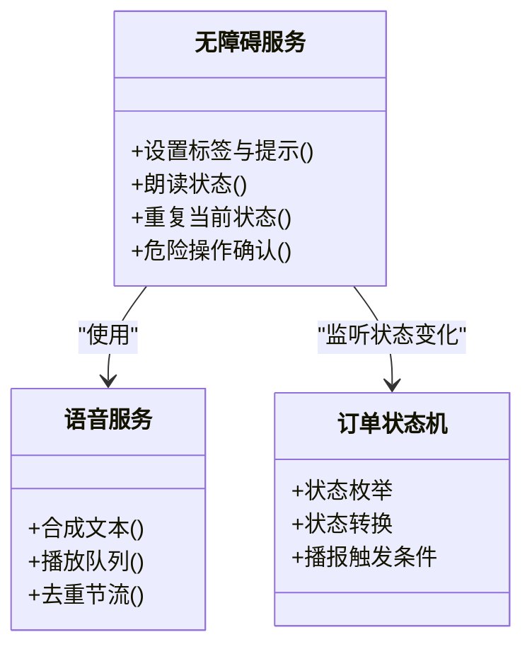
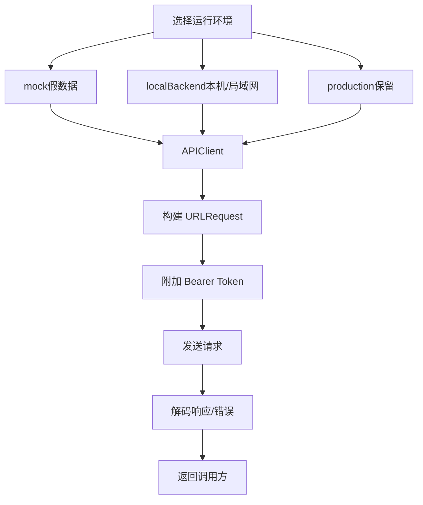
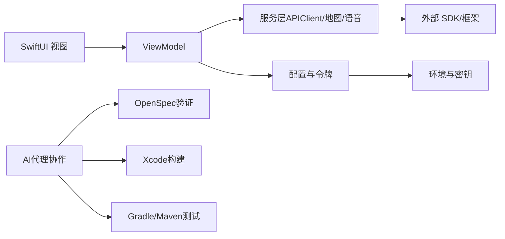

# 开发指南

<cite>
**本文引用的文件**
- [blindRunApp.swift](file://blindRun/blindRunApp.swift)
- [ContentView.swift](file://blindRun/ContentView.swift)
- [08-ios-architecture.md](file://docs/08-ios-architecture.md)
- [09-accessibility-and-voice-guidelines.md](file://docs/09-accessibility-and-voice-guidelines.md)
- [AGENTS.md](file://AGENTS.md)
- [10-ai-coding-tasks.md](file://docs/10-ai-coding-tasks.md)
- [tasks.md（MVP变更任务）](file://openspec/changes/add-aidrun-ios-spring-mvp/tasks.md)
- [spec.md（无障碍与语音 UI）](file://openspec/changes/add-aidrun-ios-spring-mvp/specs/accessibility-voice-ui/spec.md)
- [spec.md（高德地图与定位）](file://openspec/changes/add-aidrun-ios-spring-mvp/specs/amap-location/spec.md)
- [spec.md（手机号登录）](file://openspec/changes/add-aidrun-ios-spring-mvp/specs/auth-phone-login/spec.md)
- [spec.md（后端 API 合同）](file://openspec/changes/add-aidrun-ios-spring-mvp/specs/backend-api-contract/spec.md)
- [07-api-contract.openapi.yaml](file://docs/07-api-contract.openapi.yaml)
- [blindRunTests.swift](file://blindRunTests/blindRunTests.swift)
- [blindRunUITests.swift](file://blindRunUITests/blindRunUITests.swift)
- [.gitignore](file://.gitignore)
- [.gitattributes](file://.gitattributes)
</cite>

## 目录
1. [简介](#简介)
2. [项目结构](#项目结构)
3. [核心组件](#核心组件)
4. [架构总览](#架构总览)
5. [详细组件分析](#详细组件分析)
6. [依赖关系分析](#依赖关系分析)
7. [性能考虑](#性能考虑)
8. [故障排查指南](#故障排查指南)
9. [AI代理协作流程](#ai代理协作流程)
10. [审查清单与质量保证](#审查清单与质量保证)
11. [验证命令与测试策略](#验证命令与测试策略)
12. [结论](#结论)
13. [附录](#附录)

## 简介
本开发指南面向新加入团队的开发者，目标是帮助你在最短时间内建立一致的开发环境、理解项目结构与架构、掌握编码规范与最佳实践，并能高效完成功能迭代与质量保障。本项目采用 SwiftUI + MVVM 架构，强调无障碍与语音优先，集成高德地图与真实定位，支持手机号登录与 JWT 令牌管理，并通过 OpenAPI 定义前后端契约。

**重要更新**：本指南现已整合AI代理协作流程，确保所有开发者遵循标准化的工作流程、审查清单和验证命令，提高团队协作效率和代码质量。

## 项目结构
- 应用入口与基础视图位于应用模块目录，采用最小化示例结构，便于快速扩展。
- 文档目录包含 iOS 架构、无障碍与语音指南、OpenAPI 合同等，作为设计与实现依据。
- 开源规格（openspec）目录包含各功能变更的规格说明，指导功能边界与验收标准。
- 测试目录包含单元测试与 UI 测试模板，便于后续补充测试覆盖。
- **新增**：AI代理协作流程文档，定义项目级别的工作规则和质量标准。



**图表来源**
- [blindRunApp.swift:1-18](file://blindRun/blindRunApp.swift#L1-L18)
- [ContentView.swift:1-25](file://blindRun/ContentView.swift#L1-L25)
- [08-ios-architecture.md:1-165](file://docs/08-ios-architecture.md#L1-L165)
- [09-accessibility-and-voice-guidelines.md:1-143](file://docs/09-accessibility-and-voice-guidelines.md#L1-L143)
- [AGENTS.md:1-443](file://AGENTS.md#L1-L443)
- [10-ai-coding-tasks.md:1-176](file://docs/10-ai-coding-tasks.md#L1-L176)
- [tasks.md（MVP变更任务）:1-61](file://openspec/changes/add-aidrun-ios-spring-mvp/tasks.md#L1-L61)

**章节来源**
- [blindRunApp.swift:1-18](file://blindRun/blindRunApp.swift#L1-L18)
- [ContentView.swift:1-25](file://blindRun/ContentView.swift#L1-L25)
- [08-ios-architecture.md:1-165](file://docs/08-ios-architecture.md#L1-L165)
- [09-accessibility-and-voice-guidelines.md:1-143](file://docs/09-accessibility-and-voice-guidelines.md#L1-L143)
- [AGENTS.md:1-443](file://AGENTS.md#L1-L443)
- [10-ai-coding-tasks.md:1-176](file://docs/10-ai-coding-tasks.md#L1-L176)

## 核心组件
- 应用入口与窗口组：应用主入口负责创建窗口组并渲染根视图。
- 根视图：当前为简单示例视图，后续按模块拆分至各功能页面。
- 架构与模块：建议按 Core、Auth、Role、BlindRunner、Volunteer、Orders、Map、Voice、Safety、Profile 等模块划分，职责清晰、边界明确。
- 网络层：统一通过 APIClient 协议封装请求构建、鉴权头注入、响应解码与错误映射。
- 令牌存储：MVP 使用 UserDefaults 存储 JWT，生产前需迁移到 Keychain。
- 地图与定位：集成高德地图 SDK，要求位置权限，支持当前定位、订单起点标注与距离计算。
- 语音与无障碍：使用 AVSpeechSynthesizer 与系统语音框架，严格遵循无障碍标签与提示语规范。
- 轮询机制：盲人端订单状态页按 5 秒周期轮询，直至完成、取消或进入紧急状态。
- **新增**：AI代理协作框架：遵循单一模块、小步快跑的开发原则，每个PR专注于一个模块的实现。

**章节来源**
- [blindRunApp.swift:10-17](file://blindRun/blindRunApp.swift#L10-L17)
- [ContentView.swift:10-20](file://blindRun/ContentView.swift#L10-L20)
- [08-ios-architecture.md:33-83](file://docs/08-ios-architecture.md#L33-L83)
- [09-accessibility-and-voice-guidelines.md:13-36](file://docs/09-accessibility-and-voice-guidelines.md#L13-L36)
- [spec.md（高德地图与定位）:3-38](file://openspec/changes/add-aidrun-ios-spring-mvp/specs/amap-location/spec.md#L3-L38)
- [AGENTS.md:344-358](file://AGENTS.md#L344-L358)

## 架构总览
SwiftUI + MVVM 是本项目的工程架构基石。视图保持薄层，状态与业务逻辑由 ViewModel 承担，Service 封装网络与平台能力边界，DTO 对齐 OpenAPI 模式，状态机与轮询策略在 ViewModel 中实现。



**图表来源**
- [08-ios-architecture.md:33-83](file://docs/08-ios-architecture.md#L33-L83)
- [07-api-contract.openapi.yaml:25-452](file://docs/07-api-contract.openapi.yaml#L25-L452)
- [spec.md（后端 API 合同）:19-34](file://openspec/changes/add-aidrun-ios-spring-mvp/specs/backend-api-contract/spec.md#L19-L34)
- [AGENTS.md:344-358](file://AGENTS.md#L344-L358)

## 详细组件分析

### 应用入口与根视图
- 应用入口负责创建窗口组并渲染根视图，当前为示例视图，后续应按模块拆分。
- 根视图采用 VStack 布局，包含系统图标与文本，具备预览入口。



**图表来源**
- [blindRunApp.swift:10-17](file://blindRun/blindRunApp.swift#L10-L17)
- [ContentView.swift:10-20](file://blindRun/ContentView.swift#L10-L20)

**章节来源**
- [blindRunApp.swift:10-17](file://blindRun/blindRunApp.swift#L10-L17)
- [ContentView.swift:10-20](file://blindRun/ContentView.swift#L10-L20)

### 认证与角色切换（手机号登录）
- 支持手机号登录与自动注册，首次登录返回 JWT 与用户信息，首次角色选择前 activeRole 可为空。
- Demo 验证码固定为 123456，不接入真实短信。
- JWT 保护受保护接口，缺失或无效令牌将被拒绝。



**图表来源**
- [spec.md（手机号登录）:3-29](file://openspec/changes/add-aidrun-ios-spring-mvp/specs/auth-phone-login/spec.md#L3-L29)
- [07-api-contract.openapi.yaml:25-46](file://docs/07-api-contract.openapi.yaml#L25-L46)

**章节来源**
- [spec.md（手机号登录）:1-30](file://openspec/changes/add-aidrun-ios-spring-mvp/specs/auth-phone-login/spec.md#L1-L30)
- [07-api-contract.openapi.yaml:25-46](file://docs/07-api-contract.openapi.yaml#L25-L46)

### 订单状态轮询与语音播报
- 盲人端在特定状态（matching、accepted、arrived、in_progress）下每 5 秒轮询一次订单详情。
- ViewModel 决定何时触发 TTS，避免轮询期间重复播报。
- 每个关键页面提供"重复当前状态"按钮，确保用户随时获取最新状态。



**图表来源**
- [08-ios-architecture.md:125-139](file://docs/08-ios-architecture.md#L125-L139)
- [09-accessibility-and-voice-guidelines.md:13-36](file://docs/09-accessibility-and-voice-guidelines.md#L13-L36)

**章节来源**
- [08-ios-architecture.md:125-139](file://docs/08-ios-architecture.md#L125-L139)
- [09-accessibility-and-voice-guidelines.md:13-36](file://docs/09-accessibility-and-voice-guidelines.md#L13-L36)

### 高德地图与定位集成
- 展示真实地图、当前定位与订单起点标记。
- 核心流程需要位置权限，拒绝将阻断相关功能。
- iOS 侧计算志愿者到起点的距离并进行本地排序。
- 提供演示回退坐标，确保模拟器演示可用。



**图表来源**
- [spec.md（高德地图与定位）:3-38](file://openspec/changes/add-aidrun-ios-spring-mvp/specs/amap-location/spec.md#L3-L38)
- [08-ios-architecture.md:98-124](file://docs/08-ios-architecture.md#L98-L124)

**章节来源**
- [spec.md（高德地图与定位）:1-38](file://openspec/changes/add-aidrun-ios-spring-mvp/specs/amap-location/spec.md#L1-L38)
- [08-ios-architecture.md:98-124](file://docs/08-ios-architecture.md#L98-L124)

### 无障碍与语音交互
- 每个关键控件均需设置 accessibilityLabel 与 accessibilityHint，并正确设置可访问性特征。
- 盲人端主流程节点必须通过 TTS 播报，包括进入首页、订单提交、匹配中、志愿者已接单、到达、确认开始、完成、求助、错误提示等。
- 提供"重复当前状态"按钮，避免用户错过关键信息。
- 危险操作（取消订单、进入紧急、完成服务、登出）需二次确认。



**图表来源**
- [09-accessibility-and-voice-guidelines.md:37-107](file://docs/09-accessibility-and-voice-guidelines.md#L37-L107)
- [spec.md（无障碍与语音 UI）:3-42](file://openspec/changes/add-aidrun-ios-spring-mvp/specs/accessibility-voice-ui/spec.md#L3-L42)

**章节来源**
- [09-accessibility-and-voice-guidelines.md:1-143](file://docs/09-accessibility-and-voice-guidelines.md#L1-L143)
- [spec.md（无障碍与语音 UI）:1-42](file://openspec/changes/add-aidrun-ios-spring-mvp/specs/accessibility-voice-ui/spec.md#L1-L42)

### API 合同与环境切换
- 后端通过 OpenAPI 文档暴露 REST 接口，MVP 不使用 WebSocket。
- 支持三种环境：mock（本地假数据）、localBackend（本机/局域网后端）、production（保留）。
- APIClient 统一构建请求、附加鉴权头、解码响应与错误映射，Debug 构建暴露环境选择入口。



**图表来源**
- [08-ios-architecture.md:50-83](file://docs/08-ios-architecture.md#L50-L83)
- [07-api-contract.openapi.yaml:1-1117](file://docs/07-api-contract.openapi.yaml#L1-L1117)

**章节来源**
- [08-ios-architecture.md:50-83](file://docs/08-ios-architecture.md#L50-L83)
- [07-api-contract.openapi.yaml:1-1117](file://docs/07-api-contract.openapi.yaml#L1-L1117)

## 依赖关系分析
- 模块耦合：视图层与 ViewModel 强耦合，但通过协议与服务抽象弱化对具体实现的依赖。
- 服务依赖：APIClient、地图与定位服务、语音服务、令牌与环境配置相互独立，便于替换与测试。
- 外部依赖：高德地图 SDK、AVSpeechSynthesizer、Speech 框架、CoreLocation、URLSession。
- 配置与密钥：高德地图密钥通过本地配置文件管理，纳入 .gitignore，示例配置提交到仓库但不含密钥。
- **新增**：AI代理协作依赖：OpenSpec验证工具、Xcode构建系统、Gradle/Maven测试框架。



**图表来源**
- [08-ios-architecture.md:1-16](file://docs/08-ios-architecture.md#L1-L16)
- [.gitignore:1-63](file://.gitignore#L1-L63)
- [AGENTS.md:378-415](file://AGENTS.md#L378-L415)

**章节来源**
- [08-ios-architecture.md:1-16](file://docs/08-ios-architecture.md#L1-L16)
- [.gitignore:1-63](file://.gitignore#L1-L63)
- [AGENTS.md:378-415](file://AGENTS.md#L378-L415)

## 性能考虑
- 轮询频率与节流：订单状态轮询默认 5 秒一次，建议在视图消失或用户登出时及时停止，避免无意义请求。
- 语音播报去重：避免在轮询过程中重复播报相同状态，减少资源消耗与干扰。
- 地图渲染优化：批量更新标记与路线，避免频繁重建视图层次。
- 网络请求缓存：对只读数据（如静态配置）可增加短期缓存，降低网络压力。
- 无障碍与语音：合理安排 TTS 队列，避免并发播报造成卡顿。
- **新增**：AI代理协作性能：小步快跑减少代码冲突，单一模块降低编译时间。

## 故障排查指南
- 登录失败与令牌问题
  - 确认后端返回的 JWT 与用户信息是否正确解析。
  - 检查 APIClient 是否正确附加 Authorization 头。
  - 若出现 401，检查令牌是否过期或被撤销。
- 订单状态不更新
  - 确认轮询条件与停止条件是否正确。
  - 检查网络层错误映射与 UI 更新逻辑。
- 地图与定位异常
  - 检查位置权限授权状态与回调处理。
  - 确认高德地图 SDK 初始化与密钥配置。
- 语音播报异常
  - 检查 AVSpeechSynthesizer 状态与队列去重逻辑。
  - 确认"重复当前状态"按钮的触发时机与播报内容。
- 测试与回归
  - 使用单元测试验证 ViewModel 的状态转换与错误处理。
  - 使用 UI 测试覆盖关键流程（登录、下单、轮询、语音播报）。
- **新增**：AI代理协作问题
  - 确认遵循单一模块开发原则，避免跨模块修改。
  - 检查OpenSpec验证是否通过。
  - 验证构建和测试命令是否正确执行。

**章节来源**
- [blindRunTests.swift:11-39](file://blindRunTests/blindRunTests.swift#L11-L39)
- [blindRunUITests.swift:10-44](file://blindRunUITests/blindRunUITests.swift#L10-L44)
- [08-ios-architecture.md:68-83](file://docs/08-ios-architecture.md#L68-L83)
- [09-accessibility-and-voice-guidelines.md:88-107](file://docs/09-accessibility-and-voice-guidelines.md#L88-L107)
- [AGENTS.md:378-415](file://AGENTS.md#L378-L415)

## AI代理协作流程

### 项目源代码权威性
当多个来源发生冲突时，遵循以下优先级顺序：
1. AGENTS.md（项目级别AI代理工作规则）
2. 产品需求文档
3. MVP范围文档
4. 用户故事文档
5. 用户流程与状态机文档
6. 页面规格文档
7. 数据模型文档
8. API合同文档
9. iOS架构文档
10. 无障碍与语音指南
11. AI编码任务文档
12. OpenSpec变更规格
13. 传统Flutter代码仅可作为UI或行为参考

### 冻结的MVP方向
- iOS优先，不构建Android
- 原生Swift iOS，SwiftUI优先，必要时桥接到UIKit
- iOS 16+，SwiftUI + MVVM
- 后端使用Spring Boot，数据库先用H2，后续迁移PostgreSQL
- REST API，JWT Bearer认证
- 手机号登录，固定验证码123456，不接入真实短信
- 集成高德地图与真实定位
- TTS使用AVSpeechSynthesizer，STT使用iOS Speech框架

### MVP优先级
1. 盲人预订 -> 志愿者接受 -> 完成订单
2. 手机号登录 + JWT
3. 高德地图 + 位置
4. VoiceOver无障碍优化
5. TTS语音播报
6. 语音输入
7. 积分商店占位符
8. 星级评分

### 硬性范围规则
禁止添加以下非MVP功能：
- Android、Flutter作为当前实现栈
- 完整管理员后台
- 真实短信服务
- 真实身份验证
- 真实管理员审核后台
- WebSocket
- 实时轨迹分享
- 自动电话、自动短信
- AI助手
- 复杂自然语言时间解析
- 路线导航
- 完整积分商店
- 支付、库存、应用内聊天
- 虚拟电话号码
- 复杂风控、跌倒检测、地理围栏、即时呼叫、多人活动报名

**章节来源**
- [AGENTS.md:7-92](file://AGENTS.md#L7-L92)
- [AGENTS.md:27-48](file://AGENTS.md#L27-L48)
- [AGENTS.md:49-62](file://AGENTS.md#L49-L62)
- [AGENTS.md:64-92](file://AGENTS.md#L64-L92)

## 审查清单与质量保证

### AI代理协作审查清单
每次模块完成后，必须检查：
- 是否符合文档01-10的要求
- 是否符合OpenSpec规范
- 是否违反AGENTS.md中的任何禁止项
- 是否使用正确的订单状态
- 是否引入Flutter作为当前实现
- 是否引入Android
- 是否引入WebSocket
- 是否引入真实短信或真实身份验证
- 是否硬编码高德地图密钥
- 是否将业务逻辑堆叠到SwiftUI视图中
- 是否包含无障碍标签/提示
- 危险操作是否需要二次确认
- 后端状态转换是否有测试
- openspec validate是否通过

### 质量保证流程
- **单一模块原则**：每个PR专注于一个模块的实现，避免跨模块修改
- **小步快跑**：快速迭代，及时反馈和调整
- **严格审查**：遵循标准化审查清单，确保代码质量
- **自动化验证**：使用OpenSpec、构建和测试命令自动化验证
- **文档同步**：实现后及时更新相关文档

**章节来源**
- [AGENTS.md:359-377](file://AGENTS.md#L359-L377)
- [AGENTS.md:344-358](file://AGENTS.md#L344-L358)

## 验证命令与测试策略

### OpenSpec验证
推荐的OpenSpec验证命令：
```bash
openspec validate <变更ID> --strict --no-interactive
```

针对当前MVP变更的验证命令：
```bash
openspec validate add-aidrun-ios-spring-mvp --strict --no-interactive
```

### 后端验证
- Gradle项目使用：`./gradlew test`
- Maven项目使用：`./mvnw test`

### iOS构建验证
- 基本构建验证：`xcodebuild -scheme <AppScheme> -destination 'platform=iOS Simulator,name=iPhone 15' build`
- iOS测试验证：`xcodebuild test -scheme <AppScheme> -destination 'platform=iOS Simulator,name=iPhone 15'`

### 测试策略
- **单元测试**：为每个ViewModel编写单元测试，验证状态转换与错误处理
- **UI测试**：覆盖关键流程（登录、下单、轮询、语音播报）
- **集成测试**：验证模块间的协作和数据流
- **端到端测试**：验证完整的用户流程

### AI代理输出要求
每次任务完成后，AI代理必须输出：
1. 创建/修改的文件列表
2. 主要AGENTS.md章节摘要（如果此文件已更改）
3. 是否发现任何文档/OpenSpec与AGENTS.md冲突
4. 需要人工确认的问题
5. 确认任务仅涉及文档时未开始任何业务代码

**章节来源**
- [AGENTS.md:378-443](file://AGENTS.md#L378-L443)
- [10-ai-coding-tasks.md:148-172](file://docs/10-ai-coding-tasks.md#L148-L172)

## 结论
本指南从架构、模块、编码规范、无障碍与语音、地图与定位、API 合同与环境切换、测试策略、性能与故障排查等方面提供了系统性的开发指引。**重要更新**：现已整合AI代理协作流程，包括项目源代码权威性、冻结MVP方向、硬性范围规则、AI代理协作流程、审查清单和验证命令，确保团队在开发过程中严格遵循标准化的工作流程，提高协作效率和代码质量。

建议团队在开发过程中严格遵循MVVM与模块化原则，持续完善测试覆盖，关注用户体验与可访问性，确保在MVP期限内高质量交付。同时，所有AI代理必须遵循AGENTS.md中的工作规则，确保项目的一致性和可维护性。

## 附录

### 开发环境配置清单
- Xcode版本：满足最低系统版本要求，启用 Swift 语言特性与 SwiftUI 支持。
- 依赖管理：根据项目需求选择 Swift Package Manager 或 CocoaPods，遵循 .gitignore 约定。
- 环境变量与密钥：将高德地图密钥放入本地配置文件，加入 .gitignore；示例配置提交到仓库但不含密钥。
- 代码风格：统一命名、缩进与注释规范，遵循 MVVM 与模块化原则。
- 测试：为每个 ViewModel 编写单元测试，为关键流程编写 UI 测试。
- **新增**：AI代理工具链：安装OpenSpec验证工具，配置Xcode构建环境，准备Gradle/Maven测试环境。

### AI代理协作最佳实践
- **阅读优先**：先阅读AGENTS.md，再阅读相关文档和OpenSpec
- **模块化开发**：一次只实现一个模块，避免重构整个项目
- **小步快跑**：每个PR专注于一个小功能，快速反馈
- **文档同步**：实现后及时更新相关文档
- **严格验证**：运行所有验证命令，确保质量标准

**章节来源**
- [.gitignore:1-63](file://.gitignore#L1-L63)
- [.gitattributes:1-3](file://.gitattributes#L1-L3)
- [08-ios-architecture.md:1-16](file://docs/08-ios-architecture.md#L1-L16)
- [AGENTS.md:344-358](file://AGENTS.md#L344-L358)
- [AGENTS.md:378-443](file://AGENTS.md#L378-L443)