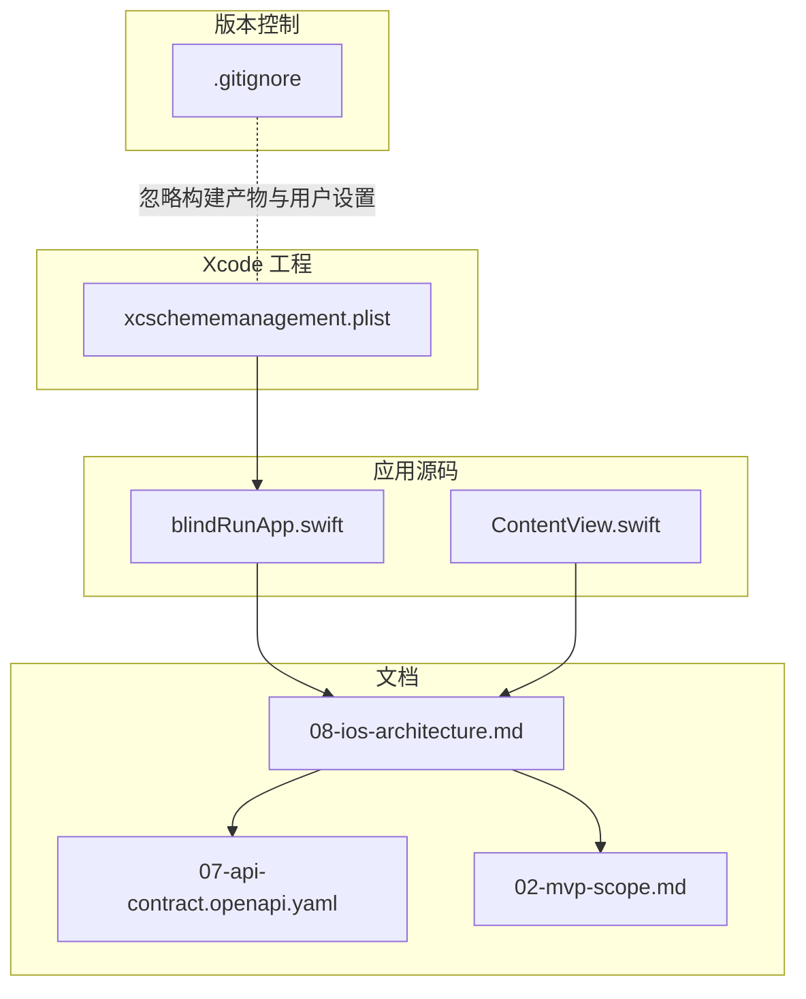
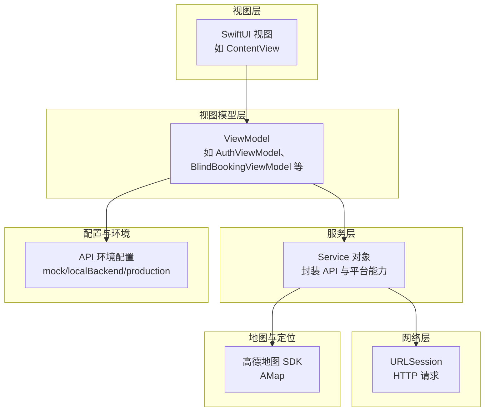
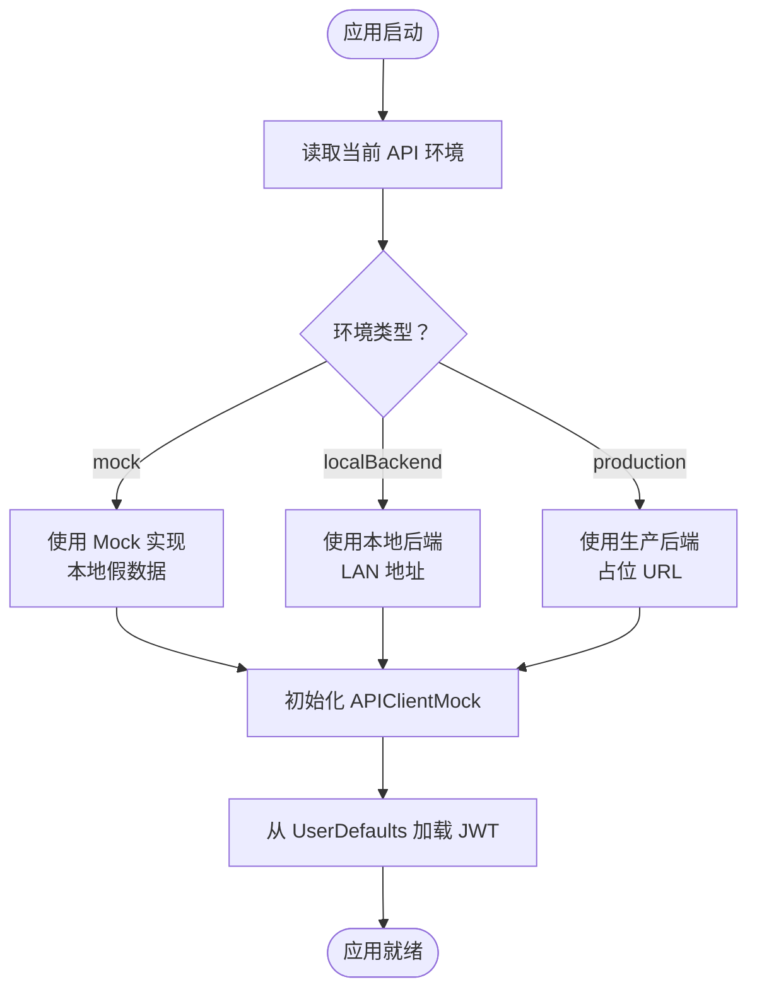
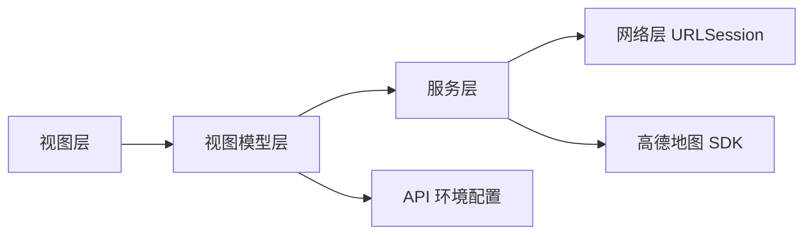

# 开发环境配置

<cite>
**本文引用的文件**
- [blindRunApp.swift](file://blindRun/blindRunApp.swift)
- [ContentView.swift](file://blindRun/ContentView.swift)
- [08-ios-architecture.md](file://docs/08-ios-architecture.md)
- [07-api-contract.openapi.yaml](file://docs/07-api-contract.openapi.yaml)
- [02-mvp-scope.md](file://docs/02-mvp-scope.md)
- [xcschememanagement.plist](file://blindRun.xcodeproj/xcuserdata/jerry.xcuserdatad/xcschemes/xcschememanagement.plist)
- [.gitignore](file://.gitignore)
</cite>

## 目录
1. [简介](#简介)
2. [项目结构](#项目结构)
3. [核心组件](#核心组件)
4. [架构总览](#架构总览)
5. [详细组件分析](#详细组件分析)
6. [依赖分析](#依赖分析)
7. [性能考虑](#性能考虑)
8. [故障排查指南](#故障排查指南)
9. [结论](#结论)
10. [附录](#附录)

## 简介
本指南面向参与 blindRun iOS 项目的开发者，提供从零开始的开发环境准备、Xcode 与 Swift 语言要求、高德地图 SDK 配置、API 环境（mock、localBackend、production）的配置与切换机制、以及项目初始化与常见问题的解决方案。文档同时给出调试与性能监控的实用建议，帮助团队快速达成可演示的 MVP。

## 项目结构
blindRun 是一个基于 SwiftUI 的 iOS 应用，采用 MVVM 架构，最小系统版本为 iOS 16+。项目包含应用主体、测试与文档，以及 Xcode 工程配置文件。核心源文件位于 blindRun 目录，文档位于 docs 目录，Xcode 工程位于 blindRun.xcodeproj。

图表来源
- [blindRunApp.swift:1-18](file://blindRun/blindRunApp.swift#L1-L18)
- [ContentView.swift:1-25](file://blindRun/ContentView.swift#L1-L25)
- [08-ios-architecture.md:1-165](file://docs/08-ios-architecture.md#L1-L165)
- [07-api-contract.openapi.yaml:1-800](file://docs/07-api-contract.openapi.yaml#L1-L800)
- [02-mvp-scope.md:1-216](file://docs/02-mvp-scope.md#L1-L216)
- [xcschememanagement.plist:1-15](file://blindRun.xcodeproj/xcuserdata/jerry.xcuserdatad/xcschemes/xcschememanagement.plist#L1-L15)
- [.gitignore:1-62](file://.gitignore#L1-L62)

章节来源
- [blindRunApp.swift:1-18](file://blindRun/blindRunApp.swift#L1-L18)
- [ContentView.swift:1-25](file://blindRun/ContentView.swift#L1-L25)
- [08-ios-architecture.md:1-165](file://docs/08-ios-architecture.md#L1-L165)
- [02-mvp-scope.md:1-216](file://docs/02-mvp-scope.md#L1-L216)
- [xcschememanagement.plist:1-15](file://blindRun.xcodeproj/xcuserdata/jerry.xcuserdatad/xcschemes/xcschememanagement.plist#L1-L15)
- [.gitignore:1-62](file://.gitignore#L1-L62)

## 核心组件
- 应用入口与窗口场景：应用主入口负责创建窗口组并展示根视图。
- 根视图：当前为占位视图，后续承载业务页面。
- 架构与平台：SwiftUI + MVVM，最小系统版本 iOS 16+，网络层使用 URLSession，令牌持久化在 UserDefaults（MVP），地图与定位使用高德 SDK。
- API 环境：支持 mock、localBackend、production 三类环境，Debug 构建下可通过设置或启动配置暴露环境选择器。

章节来源
- [blindRunApp.swift:10-17](file://blindRun/blindRunApp.swift#L10-L17)
- [ContentView.swift:10-20](file://blindRun/ContentView.swift#L10-L20)
- [08-ios-architecture.md:5-16](file://docs/08-ios-architecture.md#L5-L16)
- [08-ios-architecture.md:50-66](file://docs/08-ios-architecture.md#L50-L66)

## 架构总览
下图展示了 iOS 应用在 MVVM 架构下的主要层次关系，以及与高德地图 SDK 的集成位置。

图表来源
- [08-ios-architecture.md:33-48](file://docs/08-ios-architecture.md#L33-L48)
- [08-ios-architecture.md:98-124](file://docs/08-ios-architecture.md#L98-L124)
- [08-ios-architecture.md:50-66](file://docs/08-ios-architecture.md#L50-L66)

## 详细组件分析

### iOS 开发环境要求与 Swift 设置
- 平台与语言
  - 最小系统版本：iOS 16+
  - UI 框架：SwiftUI
  - 架构：SwiftUI + MVVM
  - 网络层：URLSession
  - 令牌存储：UserDefaults（MVP；生产需迁移到 Keychain）
- Swift 语言设置
  - 使用原生 Swift，网络层采用 URLSession + async/await
  - 项目采用 MVVM，视图保持薄逻辑，状态与交互由 ViewModel 承担

章节来源
- [08-ios-architecture.md:5-16](file://docs/08-ios-architecture.md#L5-L16)
- [08-ios-architecture.md:68-82](file://docs/08-ios-architecture.md#L68-L82)

### 高德地图 SDK 配置与 LocalConfig.xcconfig
- 高德地图要求
  - 使用高德地图 iOS SDK 显示真实地图、当前位置与订单起点标记
  - 必须在核心流程前请求并获得定位权限
  - iOS 端计算志愿者与订单起点的距离并进行排序
  - 提供演示回退坐标，保证模拟器演示可用
- LocalConfig.xcconfig
  - 高德密钥应存储在 LocalConfig.xcconfig 或本地 plist
  - 将本地配置文件加入 .gitignore，避免提交敏感信息
  - 项目提供 LocalConfig.example.xcconfig 示例，列出所需键名
- 集成要点
  - 在工程中引入高德地图 SDK
  - 在 LocalConfig.xcconfig 中配置必要的 API Key
  - 在应用启动时加载配置并初始化地图 SDK

章节来源
- [08-ios-architecture.md:98-124](file://docs/08-ios-architecture.md#L98-L124)
- [02-mvp-scope.md:146-150](file://docs/02-mvp-scope.md#L146-L150)

### API 环境配置与切换机制
- 环境类型
  - mock：本地假数据，用于 UI 与流程调试
  - localBackend：局域网连接 Spring Boot 后端（例如 http://192.168.x.x:8080）
  - production：保留用于后续部署
- 实现建议
  - 定义 APIEnvironment 枚举或结构体，包含 baseURL 与显示名称
  - 使用统一的 APIClient 协议，使 Mock 与真实实现共享调用点
  - 在 Debug 构建中暴露小型环境选择器（可在设置页或启动配置中）
  - 令牌持久化在 UserDefaults（MVP），生产前迁移至 Keychain

图表来源
- [08-ios-architecture.md:50-66](file://docs/08-ios-architecture.md#L50-L66)
- [07-api-contract.openapi.yaml:11-15](file://docs/07-api-contract.openapi.yaml#L11-L15)
- [08-ios-architecture.md:78-82](file://docs/08-ios-architecture.md#L78-L82)

章节来源
- [08-ios-architecture.md:50-66](file://docs/08-ios-architecture.md#L50-L66)
- [07-api-contract.openapi.yaml:11-15](file://docs/07-api-contract.openapi.yaml#L11-L15)
- [08-ios-architecture.md:78-82](file://docs/08-ios-architecture.md#L78-L82)

### 项目克隆后的初始化步骤
- 克隆仓库后，确保本地已安装满足要求的 Xcode 与 iOS SDK（iOS 16+）
- 打开工程，确认 Scheme 已正确加载
- 配置高德地图 LocalConfig.xcconfig（参考“高德地图 SDK 配置”）
- 如需连接本地后端，请确保后端运行在与设备同一局域网，并在 API 环境中设置正确的地址
- 在 Debug 构建下，通过设置或启动配置切换到 desired 环境（mock/localBackend/production）

章节来源
- [xcschememanagement.plist:7-11](file://blindRun.xcodeproj/xcuserdata/jerry.xcuserdatad/xcschemes/xcschememanagement.plist#L7-L11)
- [08-ios-architecture.md:50-66](file://docs/08-ios-architecture.md#L50-L66)
- [02-mvp-scope.md:146-150](file://docs/02-mvp-scope.md#L146-L150)

### 依赖安装与版本要求
- 语言与框架：Swift（原生）、SwiftUI、URLSession + async/await
- 平台：iOS 16+（最小系统版本）
- 地图与定位：高德地图 iOS SDK（非 Apple MapKit）
- 令牌存储：UserDefaults（MVP；生产迁移 Keychain）
- 依赖管理：文档未显式声明第三方包管理器；如需引入外部依赖，建议遵循项目现有结构与命名规范

章节来源
- [08-ios-architecture.md:5-16](file://docs/08-ios-architecture.md#L5-L16)
- [08-ios-architecture.md:68-82](file://docs/08-ios-architecture.md#L68-L82)
- [02-mvp-scope.md:119-132](file://docs/02-mvp-scope.md#L119-L132)

## 依赖分析
- 组件耦合
  - 视图层与视图模型层通过协议解耦，便于 Mock 与真实实现替换
  - 服务层封装网络与平台边界，降低视图模型复杂度
- 外部依赖
  - 高德地图 SDK（地图与定位）
  - URLSession（网络）
  - UserDefaults（MVP 令牌存储）
- 潜在循环依赖
  - 通过协议与依赖注入避免直接循环引用

图表来源
- [08-ios-architecture.md:33-48](file://docs/08-ios-architecture.md#L33-L48)
- [08-ios-architecture.md:68-82](file://docs/08-ios-architecture.md#L68-L82)
- [08-ios-architecture.md:98-124](file://docs/08-ios-architecture.md#L98-L124)

章节来源
- [08-ios-architecture.md:33-48](file://docs/08-ios-architecture.md#L33-L48)
- [08-ios-architecture.md:68-82](file://docs/08-ios-architecture.md#L68-L82)
- [08-ios-architecture.md:98-124](file://docs/08-ios-architecture.md#L98-L124)

## 性能考虑
- 轮询策略：订单状态轮询周期为 5 秒，仅在特定状态与可见页面内进行，避免无谓开销
- 网络层：使用 URLSession + async/await，减少额外依赖，提升可维护性
- 地图与定位：在 iOS 端计算距离并排序，避免后端复杂度；定位失败时使用演示回退坐标
- 令牌存储：UserDefaults 简化 MVP，生产前迁移至 Keychain 以提升安全性

章节来源
- [08-ios-architecture.md:125-139](file://docs/08-ios-architecture.md#L125-L139)
- [08-ios-architecture.md:78-82](file://docs/08-ios-architecture.md#L78-L82)
- [08-ios-architecture.md:114-118](file://docs/08-ios-architecture.md#L114-L118)

## 故障排查指南
- 高德地图相关
  - 若地图不显示或定位失败：检查 LocalConfig.xcconfig 是否正确配置密钥；确认已添加至工程且未被提交到版本库
  - 演示回退坐标：当设备定位不可用时，使用演示坐标保持演示稳定
- API 环境切换
  - Debug 构建下无法切换环境：确认已在设置或启动配置中暴露环境选择器；核对 API 环境枚举与 baseURL 配置
  - 本地后端连接失败：确认后端运行在与设备同一局域网，并使用正确的 LAN 地址（如 http://192.168.x.x:8080）
- 令牌与认证
  - 登录后无令牌或过期：检查 UserDefaults 中的 JWT 存储；生产前迁移至 Keychain
- 版本与兼容性
  - iOS 版本过低：确保目标系统版本为 iOS 16+；低于该版本将无法运行

章节来源
- [02-mvp-scope.md:146-150](file://docs/02-mvp-scope.md#L146-L150)
- [08-ios-architecture.md:50-66](file://docs/08-ios-architecture.md#L50-L66)
- [08-ios-architecture.md:114-118](file://docs/08-ios-architecture.md#L114-L118)
- [08-ios-architecture.md:78-82](file://docs/08-ios-architecture.md#L78-L82)

## 结论
本指南提供了 blindRun iOS 项目的开发环境配置全链路说明，涵盖 Xcode 与 Swift 要求、高德地图 SDK 配置、API 环境三态（mock/localBackend/production）的实现与切换、初始化步骤与常见问题处理。按照本指南准备环境并遵循架构与平台约束，可快速搭建可演示的 MVP，并为后续扩展打下坚实基础。

## 附录
- 开发工具推荐
  - Xcode：用于项目构建与调试
  - 模拟器：用于 UI 与流程验证
  - 真机：用于地图与定位联调
- 调试配置
  - 在 Debug 构建下启用断点与日志输出
  - 使用 Xcode Allocations/Leaks 工具排查内存问题
- 性能监控
  - 使用 Instruments 的 Time Profiler 与 Network 工具观察主线程与网络调用
  - 关注地图渲染与定位更新频率，避免过度刷新