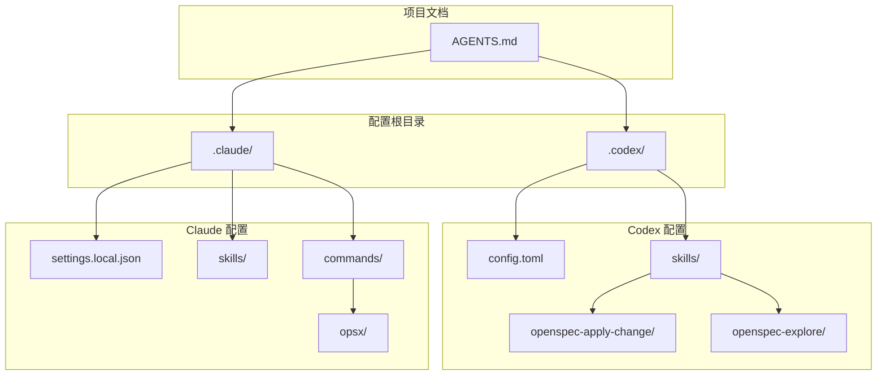
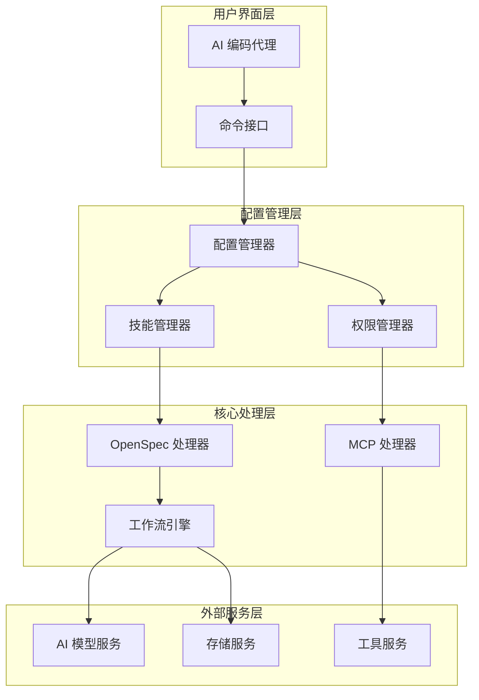
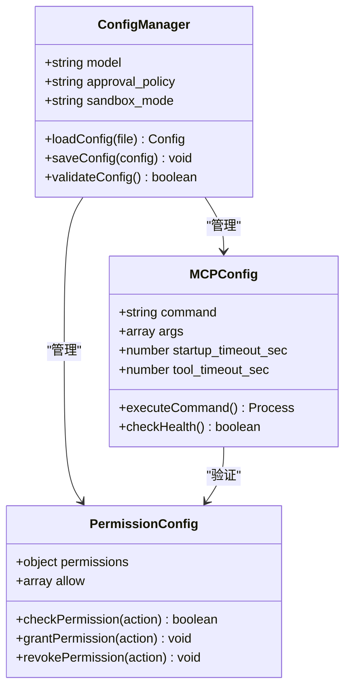
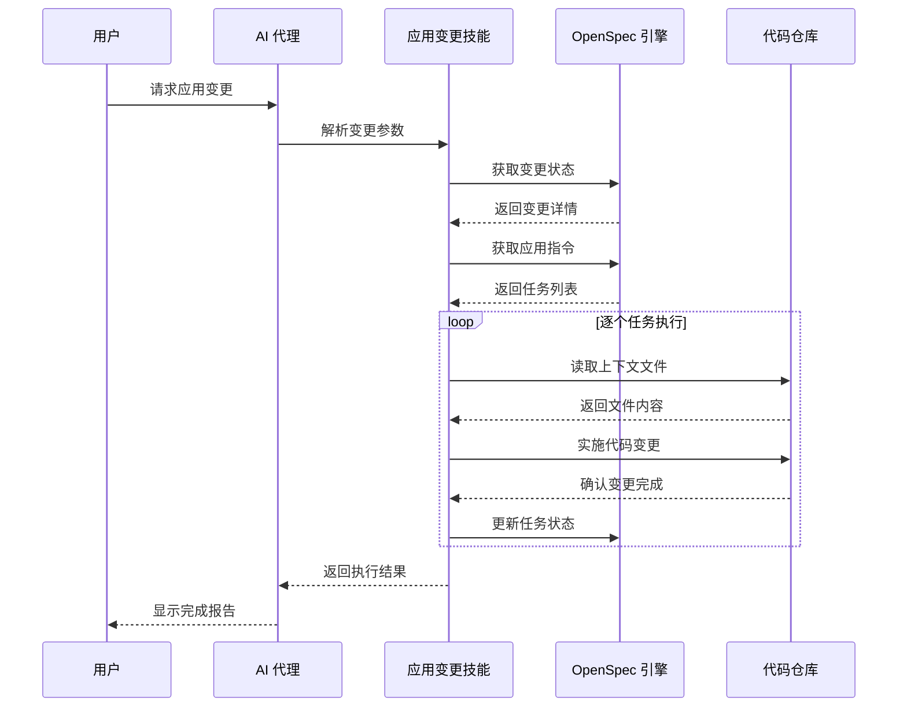
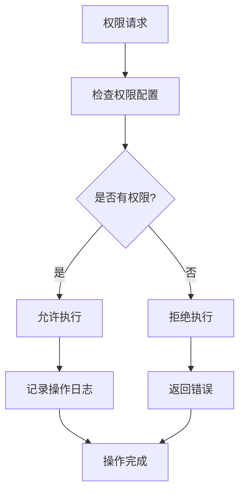
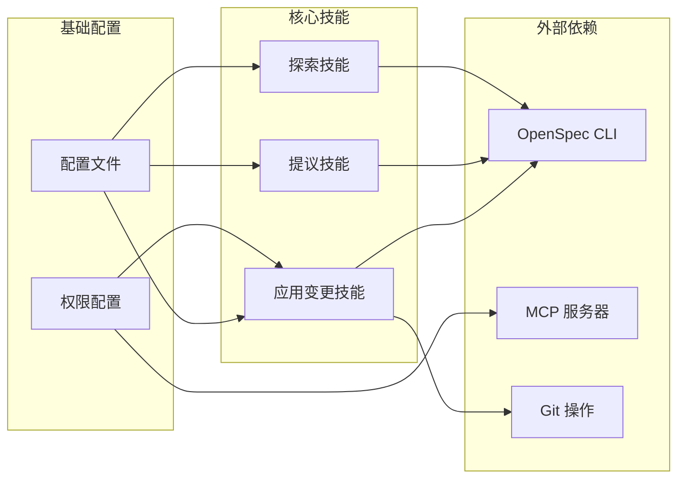

# Codex 配置系统

<cite>
**本文档引用的文件**
- [.codex/config.toml](file://.codex/config.toml)
- [.claude/settings.local.json](file://.claude/settings.local.json)
- [AGENTS.md](file://AGENTS.md)
- [.codex/skills/openspec-apply-change/SKILL.md](file://.codex/skills/openspec-apply-change/SKILL.md)
- [.codex/skills/openspec-explore/SKILL.md](file://.codex/skills/openspec-explore/SKILL.md)
- [.claude/skills/openspec-propose/SKILL.md](file://.claude/skills/openspec-propose/SKILL.md)
- [.claude/commands/opsx/propose.md](file://.claude/commands/opsx/propose.md)
</cite>

## 目录
1. [简介](#简介)
2. [项目结构](#项目结构)
3. [核心组件](#核心组件)
4. [架构概览](#架构概览)
5. [详细组件分析](#详细组件分析)
6. [依赖关系分析](#依赖关系分析)
7. [性能考虑](#性能考虑)
8. [故障排除指南](#故障排除指南)
9. [结论](#结论)

## 简介

Codex 配置系统是一个基于 TOML 配置文件的智能开发工具配置框架，专为 AidRun 助盲跑 MVP 项目设计。该系统通过标准化的配置管理和技能定义，为 AI 编码代理提供了统一的工作流程和约束机制。

系统的核心特点包括：
- 基于 TOML 的配置文件格式
- MCP（Model Context Protocol）服务器集成
- OpenSpec 工作流自动化
- 多环境权限管理
- 标准化的开发工作流程

## 项目结构

项目采用分层的配置管理结构，主要包含以下关键目录：

**图表来源**
- [.codex/config.toml:1-15](file://.codex/config.toml#L1-L15)
- [.claude/settings.local.json:1-8](file://.claude/settings.local.json#L1-L8)

**章节来源**
- [.codex/config.toml:1-15](file://.codex/config.toml#L1-L15)
- [.claude/settings.local.json:1-8](file://.claude/settings.local.json#L1-L8)

## 核心组件

### 配置文件系统

系统使用两个主要的配置文件来管理不同的功能模块：

#### Codex 主配置文件
主配置文件定义了模型设置、审批策略和沙箱模式等核心参数。

#### Claude 权限配置
权限配置文件控制 AI 代理的执行权限范围。

### 技能定义系统

系统实现了三个主要的技能模块，每个都针对特定的工作流程：

#### OpenSpec 应用变更技能
负责实现 OpenSpec 变更中的具体任务，支持增量开发和持续集成。

#### OpenSpec 探索技能  
提供深度思考和问题探索能力，支持架构设计和技术决策。

#### OpenSpec 提议技能
用于创建新的变更提案，自动生成完整的项目文档结构。

**章节来源**
- [.codex/skills/openspec-apply-change/SKILL.md:1-157](file://.codex/skills/openspec-apply-change/SKILL.md#L1-L157)
- [.codex/skills/openspec-explore/SKILL.md:1-289](file://.codex/skills/openspec-explore/SKILL.md#L1-L289)
- [.claude/skills/openspec-propose/SKILL.md:1-111](file://.claude/skills/openspec-propose/SKILL.md#L1-L111)

## 架构概览

系统采用分层架构设计，通过标准化接口实现模块间的松耦合集成：

**图表来源**
- [.codex/config.toml:1-15](file://.codex/config.toml#L1-L15)
- [.claude/settings.local.json:1-8](file://.claude/settings.local.json#L1-L8)

## 详细组件分析

### 配置管理系统

#### 模型配置组件
配置系统支持多种 AI 模型的统一管理，通过标准化的配置参数实现灵活的模型切换。

#### 审批策略组件
实施基于请求的审批机制，确保代码变更的安全性和合规性。

#### 沙箱模式组件
提供多种沙箱运行模式，平衡开发效率和安全性要求。

**图表来源**
- [.codex/config.toml:1-15](file://.codex/config.toml#L1-L15)
- [.claude/settings.local.json:1-8](file://.claude/settings.local.json#L1-L8)

**章节来源**
- [.codex/config.toml:1-15](file://.codex/config.toml#L1-L15)
- [.claude/settings.local.json:1-8](file://.claude/settings.local.json#L1-L8)

### 技能执行系统

#### OpenSpec 应用变更流程
实现从 OpenSpec 变更到代码实现的完整自动化流程：

**图表来源**
- [.codex/skills/openspec-apply-change/SKILL.md:25-80](file://.codex/skills/openspec-apply-change/SKILL.md#L25-L80)

#### OpenSpec 探索模式
提供无限制的思考和探索能力，支持架构设计和技术决策制定。

#### OpenSpec 提议生成
自动生成完整的变更提案，包括需求说明、设计方案和实现任务。

**章节来源**
- [.codex/skills/openspec-apply-change/SKILL.md:1-157](file://.codex/skills/openspec-apply-change/SKILL.md#L1-L157)
- [.codex/skills/openspec-explore/SKILL.md:1-289](file://.codex/skills/openspec-explore/SKILL.md#L1-L289)
- [.claude/skills/openspec-propose/SKILL.md:1-111](file://.claude/skills/openspec-propose/SKILL.md#L1-L111)

### 权限控制系统

系统实现了细粒度的权限管理机制，确保 AI 代理只能执行授权的操作：

**图表来源**
- [.claude/settings.local.json:1-8](file://.claude/settings.local.json#L1-L8)

**章节来源**
- [.claude/settings.local.json:1-8](file://.claude/settings.local.json#L1-L8)

## 依赖关系分析

系统各组件之间的依赖关系呈现清晰的层次结构：

**图表来源**
- [.codex/config.toml:1-15](file://.codex/config.toml#L1-L15)
- [.claude/settings.local.json:1-8](file://.claude/settings.local.json#L1-L8)

**章节来源**
- [.codex/config.toml:1-15](file://.codex/config.toml#L1-L15)
- [.claude/settings.local.json:1-8](file://.claude/settings.local.json#L1-L8)

## 性能考虑

系统在设计时充分考虑了性能优化和资源管理：

### 配置加载优化
- 使用延迟加载机制减少启动时间
- 实现配置缓存避免重复解析
- 支持增量更新减少磁盘 I/O

### 执行效率优化
- 并行处理多个技能请求
- 智能队列管理避免资源竞争
- 内存使用监控防止过度占用

### 资源管理
- 进程生命周期管理
- 超时机制防止长时间阻塞
- 错误恢复机制确保系统稳定性

## 故障排除指南

### 常见配置问题

#### 配置文件格式错误
**症状**: 启动时出现配置解析错误
**解决方案**: 
1. 检查 TOML 语法格式
2. 验证必需字段完整性
3. 确认数据类型正确性

#### 权限不足问题
**症状**: AI 代理无法执行某些操作
**解决方案**:
1. 检查权限配置文件
2. 验证允许的操作列表
3. 确认权限范围设置

### 技能执行问题

#### OpenSpec 集成失败
**症状**: OpenSpec 相关操作报错
**解决方案**:
1. 验证 OpenSpec CLI 安装
2. 检查变更状态一致性
3. 确认任务依赖关系

#### MCP 服务器连接问题
**症状**: MCP 服务器无法响应
**解决方案**:
1. 检查服务器启动状态
2. 验证网络连接
3. 确认超时设置合理

**章节来源**
- [.codex/config.toml:1-15](file://.codex/config.toml#L1-L15)
- [.claude/settings.local.json:1-8](file://.claude/settings.local.json#L1-L8)

## 结论

Codex 配置系统通过标准化的配置管理和技能定义，为 AI 编码代理提供了强大而灵活的开发工具链。系统的主要优势包括：

### 设计优势
- **模块化设计**: 清晰的功能分离便于维护和扩展
- **标准化接口**: 统一的配置格式简化了集成过程
- **安全可控**: 细粒度的权限管理确保操作安全

### 技术特色
- **OpenSpec 集成**: 完整的变更管理流程自动化
- **MCP 支持**: 现代化的模型上下文协议集成
- **多环境适配**: 灵活的配置管理适应不同部署场景

### 应用价值
- **提高开发效率**: 标准化的工作流程减少重复劳动
- **保证代码质量**: 自动化的检查和验证机制
- **降低维护成本**: 清晰的架构设计便于长期维护

该系统为 AidRun 助盲跑 MVP 项目的快速迭代开发提供了坚实的技术基础，通过智能化的配置管理和工作流程自动化，显著提升了开发团队的生产力和代码质量。