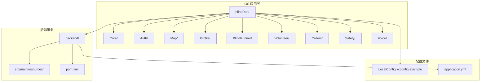
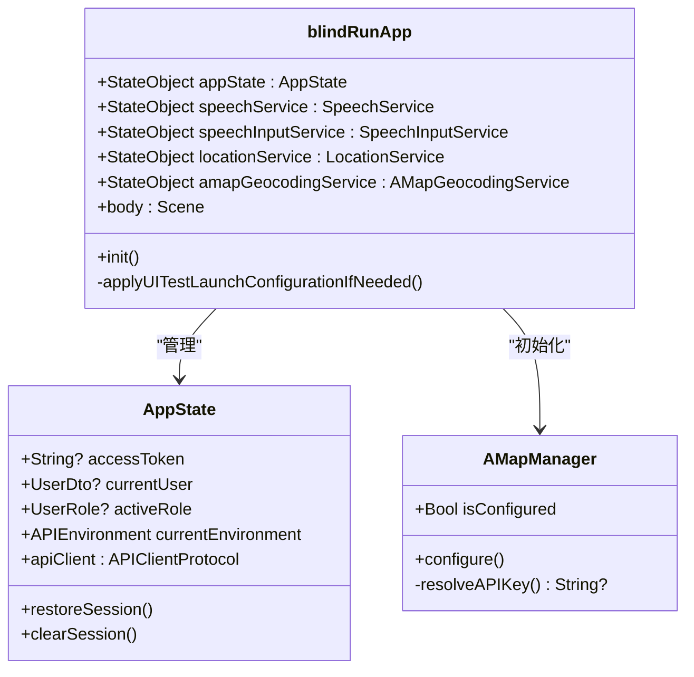
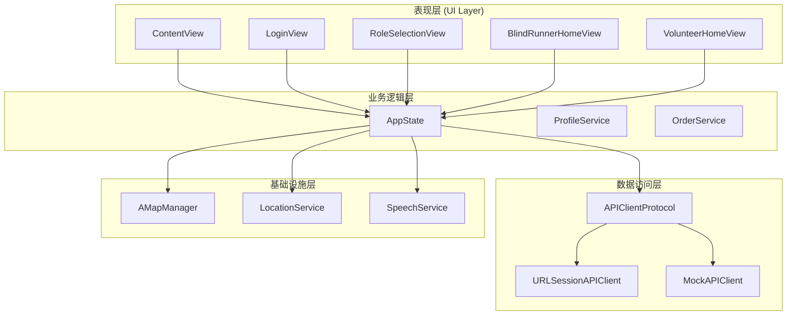
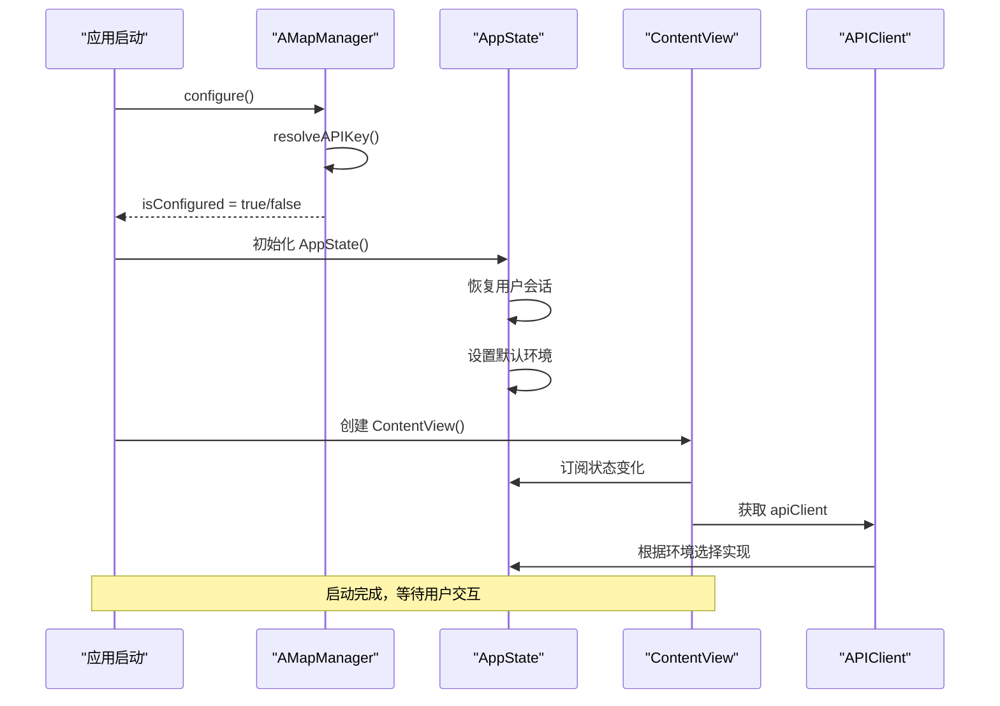
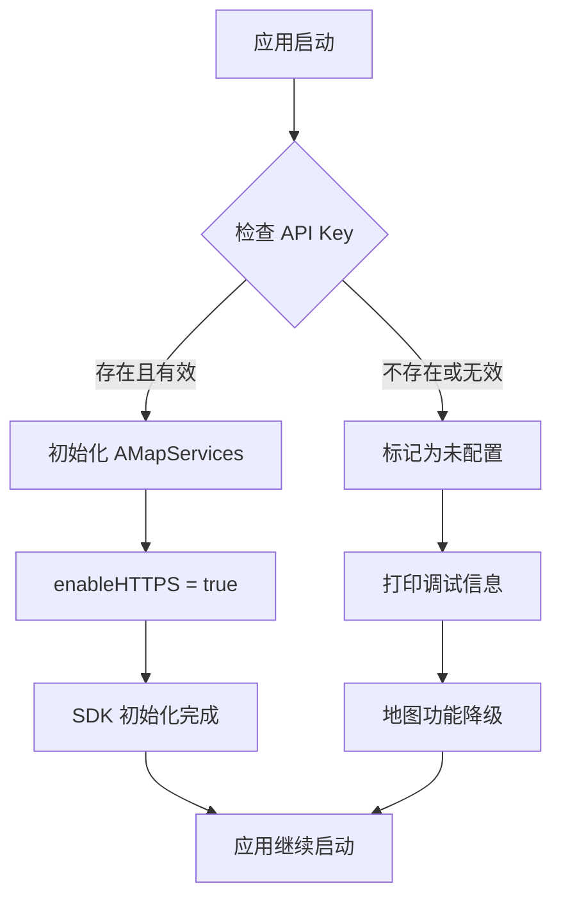
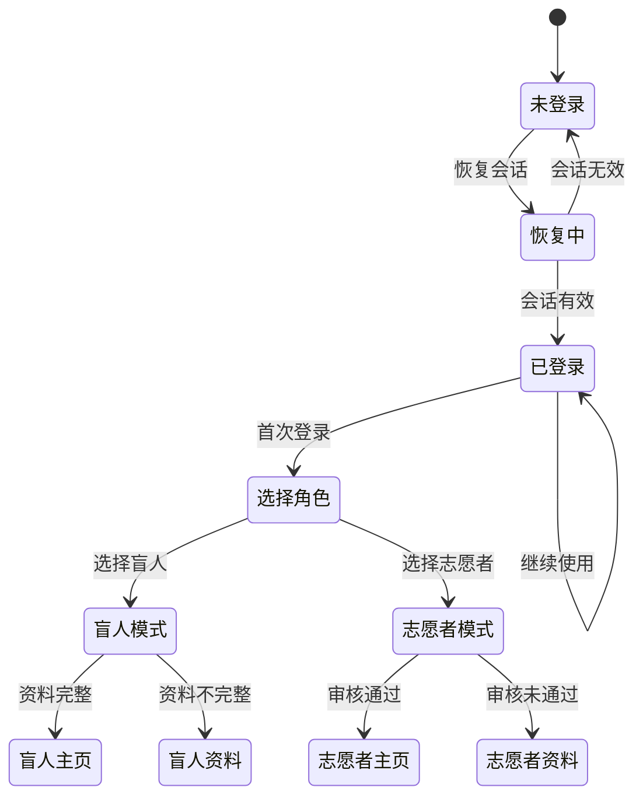
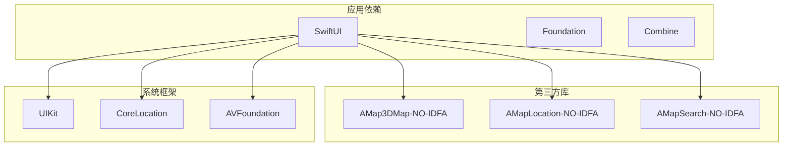
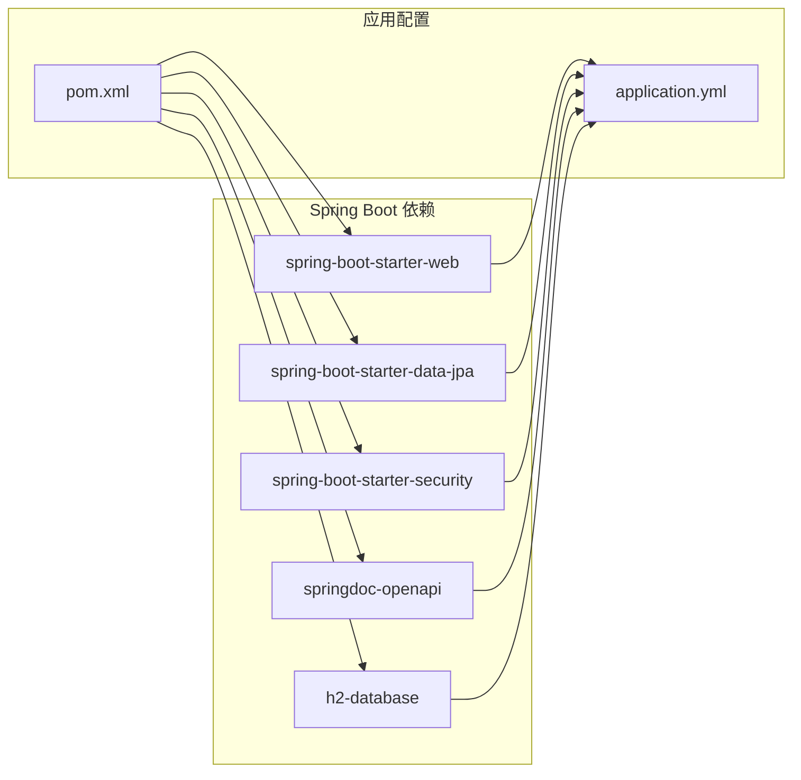

# 应用启动配置

<cite>
**本文档引用的文件**
- [blindRunApp.swift](file://blindRun/blindRunApp.swift)
- [AppState.swift](file://blindRun/Core/AppState.swift)
- [EnvironmentConfig.swift](file://blindRun/Core/EnvironmentConfig.swift)
- [APIClient.swift](file://blindRun/Core/APIClient.swift)
- [AMapManager.swift](file://blindRun/Map/AMapManager.swift)
- [LocalConfig.xcconfig.example](file://LocalConfig.xcconfig.example)
- [application.yml](file://backend/src/main/resources/application.yml)
- [pom.xml](file://backend/pom.xml)
- [MockAPIClient.swift](file://blindRun/Core/MockAPIClient.swift)
- [ContentView.swift](file://blindRun/ContentView.swift)
</cite>

## 目录
1. [简介](#简介)
2. [项目结构](#项目结构)
3. [核心组件](#核心组件)
4. [架构概览](#架构概览)
5. [详细组件分析](#详细组件分析)
6. [依赖关系分析](#依赖关系分析)
7. [性能考虑](#性能考虑)
8. [故障排除指南](#故障排除指南)
9. [结论](#结论)

## 简介

本文档详细分析了 AidRun iOS 应用的启动配置系统，涵盖了应用启动流程、环境配置、API 客户端初始化以及地图服务配置等关键方面。该应用采用 Swift 语言开发，基于 SwiftUI 框架构建用户界面，并集成了高德地图 SDK 提供定位和导航功能。

## 项目结构

应用采用模块化的项目结构，主要包含以下关键目录：

**图表来源**
- [blindRunApp.swift:1-68](file://blindRun/blindRunApp.swift#L1-L68)
- [LocalConfig.xcconfig.example:1-31](file://LocalConfig.xcconfig.example#L1-L31)
- [application.yml:1-34](file://backend/src/main/resources/application.yml#L1-L34)

**章节来源**
- [blindRunApp.swift:1-68](file://blindRun/blindRunApp.swift#L1-L68)
- [LocalConfig.xcconfig.example:1-31](file://LocalConfig.xcconfig.example#L1-L31)
- [application.yml:1-34](file://backend/src/main/resources/application.yml#L1-L34)

## 核心组件

### 应用启动入口

应用的启动入口位于 `blindRunApp.swift` 文件中，这是一个标准的 SwiftUI @main 结构体：

**图表来源**
- [blindRunApp.swift:10-36](file://blindRun/blindRunApp.swift#L10-L36)
- [AppState.swift:9-102](file://blindRun/Core/AppState.swift#L9-L102)
- [AMapManager.swift:9-34](file://blindRun/Map/AMapManager.swift#L9-L34)

### 环境配置系统

应用支持三种 API 环境配置：

| 环境类型 | 描述 | 基础 URL |
|---------|------|----------|
| Mock | 本地模拟模式，不使用网络请求 | nil |
| Local Backend | 本地后端服务，使用自定义 IP 或 URL | 用户配置的本地地址 |
| Production | 生产环境，使用官方 API 地址 | https://api.aidrun.example.com |

**章节来源**
- [EnvironmentConfig.swift:5-41](file://blindRun/Core/EnvironmentConfig.swift#L5-L41)
- [AppState.swift:76-90](file://blindRun/Core/AppState.swift#L76-L90)

## 架构概览

应用采用分层架构设计，主要分为以下几个层次：

**图表来源**
- [ContentView.swift:12-57](file://blindRun/ContentView.swift#L12-L57)
- [AppState.swift:76-90](file://blindRun/Core/AppState.swift#L76-L90)
- [APIClient.swift:46-58](file://blindRun/Core/APIClient.swift#L46-L58)

## 详细组件分析

### 启动流程分析

应用启动流程遵循以下顺序：

**图表来源**
- [blindRunApp.swift:18-36](file://blindRun/blindRunApp.swift#L18-L36)
- [AppState.swift:94-102](file://blindRun/Core/AppState.swift#L94-L102)
- [ContentView.swift:50-57](file://blindRun/ContentView.swift#L50-L57)

### API 客户端配置

应用实现了两种 API 客户端：

#### URLSessionAPIClient
用于生产环境和本地后端服务，支持超时配置和认证头处理。

#### MockAPIClient  
用于开发和测试环境，提供完整的模拟数据和业务逻辑。

**章节来源**
- [APIClient.swift:103-194](file://blindRun/Core/APIClient.swift#L103-L194)
- [MockAPIClient.swift:5-26](file://blindRun/Core/MockAPIClient.swift#L5-L26)

### 地图服务配置

高德地图 SDK 通过 `AMapManager` 进行统一管理：

**图表来源**
- [AMapManager.swift:16-34](file://blindRun/Map/AMapManager.swift#L16-L34)

**章节来源**
- [AMapManager.swift:1-50](file://blindRun/Map/AMapManager.swift#L1-L50)
- [LocalConfig.xcconfig.example:29-31](file://LocalConfig.xcconfig.example#L29-L31)

### 用户会话管理

`AppState` 类负责全局状态管理：

**图表来源**
- [AppState.swift:13-31](file://blindRun/Core/AppState.swift#L13-L31)
- [ContentView.swift:18-48](file://blindRun/ContentView.swift#L18-L48)

**章节来源**
- [AppState.swift:107-131](file://blindRun/Core/AppState.swift#L107-L131)
- [ContentView.swift:98-113](file://blindRun/ContentView.swift#L98-L113)

## 依赖关系分析

### iOS 依赖关系

**图表来源**
- [Podfile:6-9](file://Podfile#L6-L9)

### 后端依赖关系

后端服务基于 Spring Boot 框架构建：

**图表来源**
- [pom.xml:25-69](file://backend/pom.xml#L25-L69)
- [application.yml:4-34](file://backend/src/main/resources/application.yml#L4-L34)

**章节来源**
- [pom.xml:1-80](file://backend/pom.xml#L1-L80)
- [application.yml:1-34](file://backend/src/main/resources/application.yml#L1-L34)

## 性能考虑

### 启动性能优化

1. **异步初始化**: 所有网络和数据库操作都采用异步方式，避免阻塞主线程
2. **懒加载**: 服务对象按需初始化，减少启动时的内存占用
3. **缓存策略**: 用户会话和配置信息持久化到 UserDefaults，避免重复加载

### 网络性能配置

- 请求超时: 10 秒
- 资源超时: 20 秒
- JSON 编解码: 使用共享的编码器实例

**章节来源**
- [APIClient.swift:108-113](file://blindRun/Core/APIClient.swift#L108-L113)
- [APIClient.swift:120-123](file://blindRun/Core/APIClient.swift#L120-L123)

## 故障排除指南

### 常见启动问题

#### 高德地图 Key 配置错误

**问题症状**: 地图功能不可用，控制台输出配置警告

**解决方案**:
1. 复制 `LocalConfig.xcconfig.example` 为 `LocalConfig.xcconfig`
2. 在 Xcode 中配置 xcconfig 文件引用
3. 添加正确的 AMapApiKey 到 Info.plist

#### API 环境配置问题

**问题症状**: 网络请求失败或返回模拟数据

**解决方案**:
1. 检查 `AppConstants.UserDefaultsKeys.apiEnvironment` 的值
2. 验证本地后端 URL 格式是否正确
3. 确认生产环境 URL 配置

#### 用户会话恢复失败

**问题症状**: 应用启动后需要重新登录

**解决方案**:
1. 检查 UserDefaults 中的访问令牌存储
2. 验证 JWT 令牌格式和有效期
3. 确认后端认证服务正常运行

**章节来源**
- [AMapManager.swift:16-34](file://blindRun/Map/AMapManager.swift#L16-L34)
- [AppState.swift:107-113](file://blindRun/Core/AppState.swift#L107-L113)
- [EnvironmentConfig.swift:69-102](file://blindRun/Core/EnvironmentConfig.swift#L69-L102)

## 结论

AidRun iOS 应用的启动配置系统展现了良好的架构设计和工程实践：

1. **模块化设计**: 清晰的组件分离和职责划分
2. **环境隔离**: 支持多环境配置，便于开发和测试
3. **容错机制**: 完善的错误处理和降级策略
4. **性能优化**: 合理的异步处理和资源管理

该配置系统为应用的稳定运行提供了坚实基础，同时保持了良好的可维护性和扩展性。建议在生产环境中进一步完善安全配置，特别是用户令牌的存储方案。