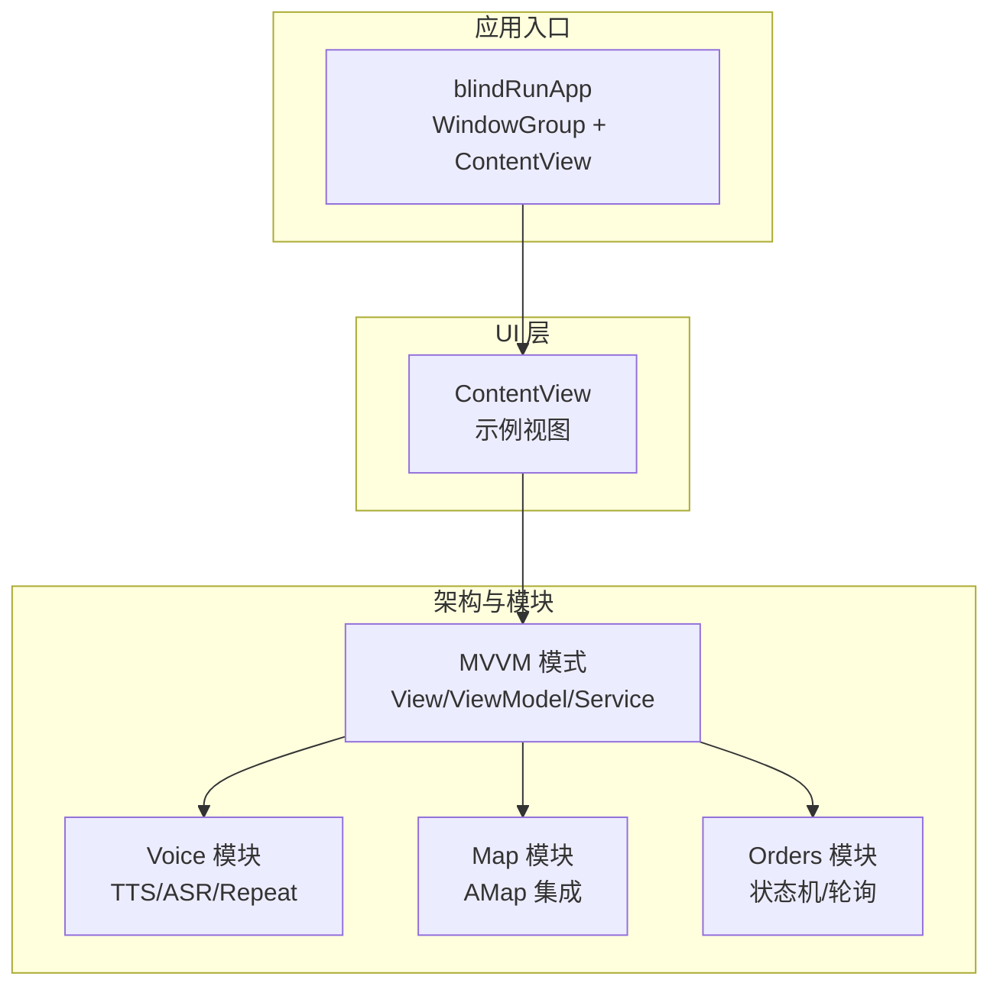
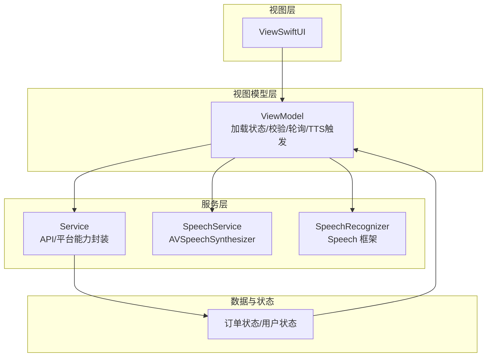
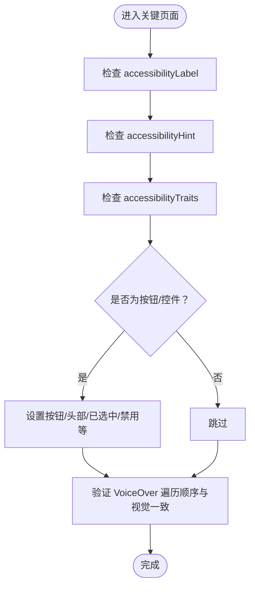
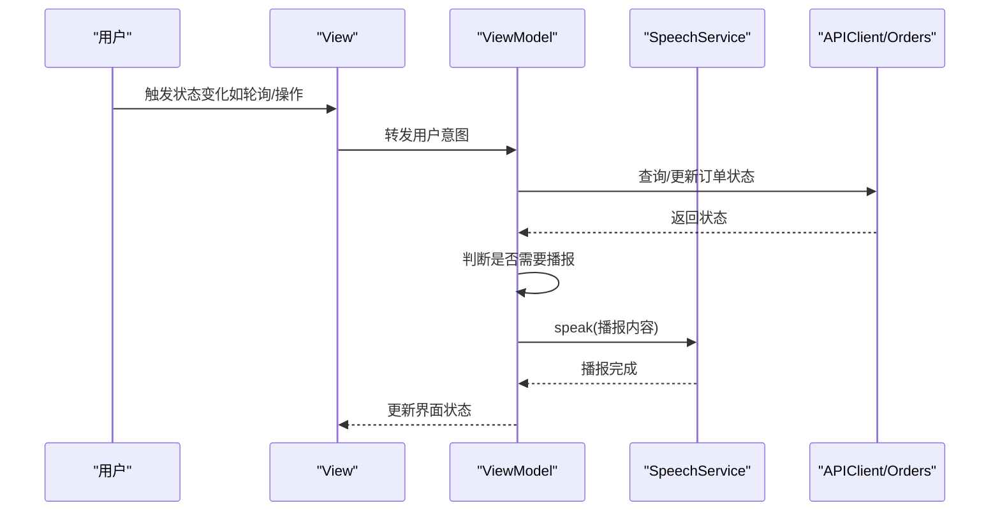
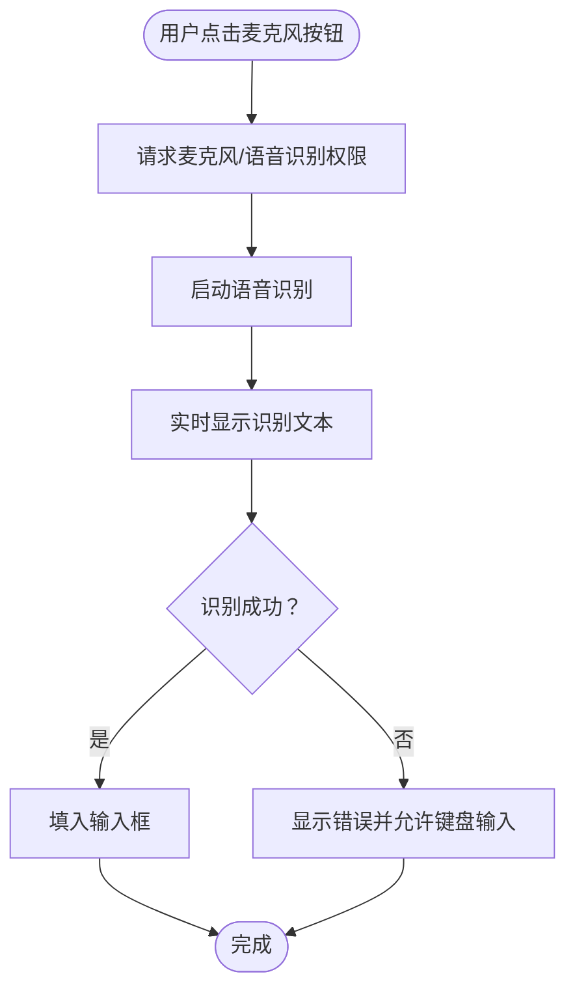
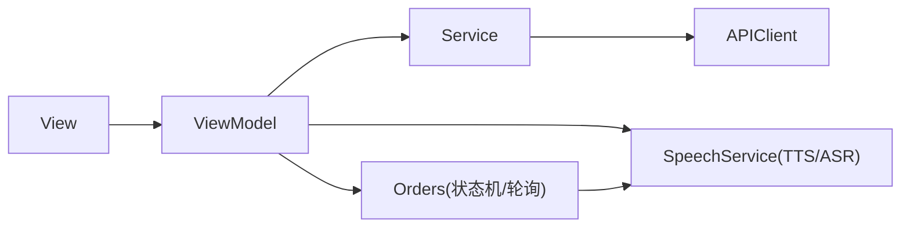

# 无障碍开发指南

<cite>
**本文引用的文件**
- [blindRunApp.swift](file://blindRun/blindRunApp.swift)
- [ContentView.swift](file://blindRun/ContentView.swift)
- [09-无障碍与语音指南.md](file://docs/09-accessibility-and-voice-guidelines.md)
- [08-苹果架构.md](file://docs/08-ios-architecture.md)
- [03-用户故事.md](file://docs/03-user-stories.md)
- [02-MVP范围.md](file://docs/02-mvp-scope.md)
- [01-产品需求.md](file://docs/01-product-requirements.md)
- [proposal.md](file://openspec/changes/add-aidrun-ios-spring-mvp/proposal.md)
- [tasks.md](file://openspec/changes/add-aidrun-ios-spring-mvp/tasks.md)
- [spec.md](file://openspec/changes/add-aidrun-ios-spring-mvp/specs/accessibility-voice-ui/spec.md)
- [design.md](file://openspec/changes/add-aidrun-ios-spring-mvp/design.md)
- [blindRunUITests.swift](file://blindRunUITests/blindRunUITests.swift)
- [blindRunUITestsLaunchTests.swift](file://blindRunUITests/blindRunUITestsLaunchTests.swift)
- [AGENTS.md](file://AGENTS.md)
</cite>

## 更新摘要
**变更内容**
- 基于AGENTS.md更新了无障碍和语音规则的权威性指导
- 强化了VoiceOver支持、TTS和STT的实现规范
- 更新了危险操作二次确认的具体要求
- 完善了无障碍测试方法和验收标准
- 整合了项目级别的无障碍开发约束

## 目录
1. [简介](#简介)
2. [项目结构](#项目结构)
3. [核心组件](#核心组件)
4. [架构总览](#架构总览)
5. [详细组件分析](#详细组件分析)
6. [依赖关系分析](#依赖关系分析)
7. [性能考虑](#性能考虑)
8. [故障排查指南](#故障排查指南)
9. [结论](#结论)
10. [附录](#附录)

## 简介
本指南面向 blindRun 项目的无障碍开发，聚焦 iOS 无障碍框架的落地实践，包括 VoiceOver、Voice Control、辅助触控、语音合成（TTS）与语音识别（ASR）的集成方法，以及无障碍标签、描述与提示的编写规范。文档基于 AGENTS.md 中的权威规则，结合现有设计文档与任务清单，确保所有 UI 元素具备适当的可访问性属性，并满足屏幕阅读器、键盘导航与触觉反馈的适配要求。

**更新** 基于 AGENTS.md 的权威规则，明确了无障碍开发的强制性要求和最佳实践。

## 项目结构
blindRun 采用 SwiftUI + MVVM 架构，应用入口通过 App 组件挂载根视图。无障碍与语音能力在整体架构中属于独立模块，建议在 Voice 模块中统一实现 TTS 与语音输入能力，并通过 ViewModel 在状态变化时触发播报与交互。

**图表来源**
- [blindRunApp.swift:10-17](file://blindRun/blindRunApp.swift#L10-L17)
- [ContentView.swift:10-20](file://blindRun/ContentView.swift#L10-L20)
- [08-苹果架构.md:33-49](file://docs/08-ios-architecture.md#L33-L49)

**章节来源**
- [blindRunApp.swift:10-17](file://blindRun/blindRunApp.swift#L10-L17)
- [ContentView.swift:10-20](file://blindRun/ContentView.swift#L10-L20)
- [08-苹果架构.md:18-31](file://docs/08-ios-architecture.md#L18-L31)

## 核心组件
基于 AGENTS.md 的权威规则，无障碍开发的核心组件包括：

### VoiceOver 与可访问性属性
- **强制性要求**：盲人端流程必须支持 VoiceOver
- **标签规范**：关键按钮、输入框、状态文本必须具有 `accessibilityLabel` / `accessibilityHint`
- **遍历顺序**：VoiceOver 遍历顺序必须与视觉布局一致
- **状态标识**：正确设置 accessibilityTraits，区分按钮、头部、已选中、禁用等状态

**更新** 基于 AGENTS.md 第278-281条规则，明确了无障碍标签的强制性要求。

### 语音合成（TTS）
- **技术选型**：使用系统 AVSpeechSynthesizer
- **播报节点**：必须覆盖进入盲人首页、订单提交成功、匹配中、志愿者已接单、志愿者已到达、请确认开始服务、服务已开始、服务已完成、进入求助状态、错误提示
- **播报策略**：ViewModel 在状态变化时决定播报内容，避免轮询期间重复播报

**更新** 基于 AGENTS.md 第282-283条规则，明确了 TTS 的技术选型和播报范围。

### 语音识别（STT）
- **适用场景**：仅用于文本输入场景：位置描述、路线描述、备注、志愿者服务摘要等
- **权限管理**：仅在用户主动发起语音输入时申请麦克风与语音识别权限
- **降级方案**：识别失败时显示错误并允许键盘输入

**更新** 基于 AGENTS.md 第284-287条规则，明确了 STT 的使用限制和行为规范。

### 大按钮与极简交互
- **尺寸要求**：关键盲人端主按钮最小高度不低于 64 点
- **设计原则**：文字清晰，高对比度，确保触控易达
- **交互简化**：每个页面优先保留一个主要操作，避免密集表格

**更新** 基于 AGENTS.md 第280条规则，明确了大按钮的设计要求。

### 危险操作二次确认
- **覆盖范围**：取消订单、进入紧急状态、志愿者完成服务、退出登录
- **确认文案**：紧急求助确认文案必须完全符合 AGENTS.md 规定
- **行为约束**：进入紧急状态后，订单状态变为 emergency，TTS 播报，MVP 不恢复先前状态

**更新** 基于 AGENTS.md 第289-294条规则，明确了危险操作的强制性确认要求。

### 重复当前状态功能
- **强制要求**：每个关键盲人端页面必须包含"重复当前状态"按钮
- **功能特性**：用于播报最新有意义的状态而不改变订单状态
- **协同机制**：与 VoiceOver 并存不冲突，增强状态感知能力

**更新** 基于 AGENTS.md 第281条规则，明确了重复状态功能的强制性要求。

**章节来源**
- [09-无障碍与语音指南.md:37-61](file://docs/09-accessibility-and-voice-guidelines.md#L37-L61)
- [09-无障碍与语音指南.md:13-36](file://docs/09-accessibility-and-voice-guidelines.md#L13-L36)
- [09-无障碍与语音指南.md:71-87](file://docs/09-accessibility-and-voice-guidelines.md#L71-L87)
- [09-无障碍与语音指南.md:88-107](file://docs/09-accessibility-and-voice-guidelines.md#L88-L107)
- [03-用户故事.md:703-807](file://docs/03-user-stories.md#L703-L807)
- [02-MVP范围.md:65-74](file://docs/02-mvp-scope.md#L65-L74)
- [AGENTS.md:274-306](file://AGENTS.md#L274-L306)

## 架构总览
无障碍与语音能力在 MVVM 架构中通过 ViewModel 触发，Service 封装平台能力边界，View 保持薄层渲染与意图转发。Voice 模块负责 TTS 与语音输入，与 Orders 模块的状态轮询协同，确保状态变化时及时播报。

**图表来源**
- [08-苹果架构.md:33-49](file://docs/08-ios-architecture.md#L33-L49)
- [09-无障碍与语音指南.md:13-36](file://docs/09-accessibility-and-voice-guidelines.md#L13-L36)

**章节来源**
- [08-苹果架构.md:33-49](file://docs/08-ios-architecture.md#L33-L49)

## 详细组件分析

### 组件一：VoiceOver 标签与可访问性属性
- **设计原则**
  - VoiceOver 用户可无障碍遍历所有关键页面与控件，标签与提示准确，遍历顺序与视觉布局一致
  - 正确设置 accessibilityTraits，区分按钮、头部、已选中、禁用等状态
- **关键覆盖清单**
  - 登录手机号与验证码输入
  - 角色切换控件
  - 盲人首页状态文本
  - 预约表单字段
  - 定位权限提示
  - 提交预约按钮
  - 取消订单按钮
  - 紧急求助按钮
  - 确认开始服务按钮
  - 重复当前状态按钮
  - 志愿者可服务开关
  - 可接订单行
  - 接单/到达/完成/取消/紧急等动作
  - 评分控件

**图表来源**
- [09-无障碍与语音指南.md:37-61](file://docs/09-accessibility-and-voice-guidelines.md#L37-L61)
- [03-用户故事.md:703-719](file://docs/03-user-stories.md#L703-L719)

**章节来源**
- [09-无障碍与语音指南.md:37-61](file://docs/09-accessibility-and-voice-guidelines.md#L37-L61)
- [03-用户故事.md:703-719](file://docs/03-user-stories.md#L703-L719)

### 组件二：语音合成（TTS）与播报策略
- **技术选型**
  - 使用系统 AVSpeechSynthesizer，集中实现 SpeechService，ViewModel 在状态变化时决定播报内容
- **播报节点**
  - 进入盲人首页、订单提交成功、匹配中、志愿者已接单、志愿者已到达、请确认开始服务、服务已开始、服务已完成、进入求助状态、错误提示
- **实施要点**
  - 避免轮询期间重复播报，记忆上次播报的订单状态
  - 每个关键盲人端页面提供"重复当前状态"按钮，用于重新播报当前状态

**图表来源**
- [09-无障碍与语音指南.md:13-36](file://docs/09-accessibility-and-voice-guidelines.md#L13-L36)
- [08-苹果架构.md:68-82](file://docs/08-ios-architecture.md#L68-L82)

**章节来源**
- [09-无障碍与语音指南.md:13-36](file://docs/09-accessibility-and-voice-guidelines.md#L13-L36)
- [08-苹果架构.md:68-82](file://docs/08-ios-architecture.md#L68-L82)

### 组件三：语音识别（STT）与文本输入
- **适用场景**
  - 仅用于文本输入场景：起点描述、终点/路线描述、备注、志愿者服务摘要等
- **行为规范**
  - 仅在用户主动发起语音输入时申请麦克风与语音识别权限
  - 识别失败时显示错误并允许键盘输入作为降级方案
- **集成建议**
  - 在输入框旁提供麦克风按钮，点击后启动识别，实时显示识别文本，结束后填入输入框

**图表来源**
- [09-无障碍与语音指南.md:71-87](file://docs/09-accessibility-and-voice-guidelines.md#L71-L87)
- [03-用户故事.md:738-758](file://docs/03-user-stories.md#L738-L758)

**章节来源**
- [09-无障碍与语音指南.md:71-87](file://docs/09-accessibility-and-voice-guidelines.md#L71-L87)
- [03-用户故事.md:738-758](file://docs/03-user-stories.md#L738-L758)

### 组件四：大按钮与极简交互
- **设计准则**
  - 盲人端每个页面优先保留一个主要操作，按钮最小高度≥64 点，文字清晰，高对比度，点击区域充足
  - 避免密集表格，危险操作使用确认对话框
  - 状态页使用直白语言陈述当前订单状态，错误信息需同时可视化与 TTS 播报

**章节来源**
- [09-无障碍与语音指南.md:62-70](file://docs/09-accessibility-and-voice-guidelines.md#L62-L70)
- [02-MVP范围.md:65-74](file://docs/02-mvp-scope.md#L65-L74)

### 组件五：危险操作二次确认
- **覆盖范围**
  - 取消订单、进入紧急状态、志愿者完成服务、退出登录
- **确认文案（紧急求助）**
  - "是否确认进入求助状态？确认后，本次服务将标记为异常，系统会记录当前订单状态。"
- **行为约束**
  - 进入紧急状态后，订单状态变为 emergency，TTS 播报，MVP 不恢复先前状态，不自动拨打电话/短信或通知真实管理员

**章节来源**
- [09-无障碍与语音指南.md:88-107](file://docs/09-accessibility-and-voice-guidelines.md#L88-L107)
- [03-用户故事.md:777-790](file://docs/03-user-stories.md#L777-L790)

### 组件六：重复当前状态按钮
- **目标**
  - 每个关键盲人端页面提供"重复当前状态"按钮，用于播报最新有意义的状态而不改变订单状态
- **与 VoiceOver 协同**
  - 与 VoiceOver 并存不冲突，增强状态感知与回溯能力

**章节来源**
- [09-无障碍与语音指南.md:27-36](file://docs/09-accessibility-and-voice-guidelines.md#L27-L36)
- [03-用户故事.md:793-807](file://docs/03-user-stories.md#L793-L807)

## 依赖关系分析
- **模块耦合**
  - View 保持薄层，ViewModel 负责触发 TTS 与处理业务状态，Service 封装 API 与平台能力
  - Voice 模块与 Orders 模块通过状态变化事件耦合，确保播报与状态同步
- **外部依赖**
  - AVSpeechSynthesizer（TTS）、Speech 框架（ASR）、高德地图 SDK（定位/地图）、URLSession（网络）
- **任务与范围**
  - 无障碍与语音能力在 iOS Map/Location/Voice/Accessibility PR 中实现，包括 TTS 全节点播报与语音输入集成、VoiceOver 标签与大按钮、危险操作确认等

**图表来源**
- [08-苹果架构.md:33-49](file://docs/08-ios-architecture.md#L33-L49)
- [tasks.md:48-53](file://openspec/changes/add-aidrun-ios-spring-mvp/tasks.md#L48-L53)

**章节来源**
- [08-苹果架构.md:33-49](file://docs/08-ios-architecture.md#L33-L49)
- [tasks.md:48-53](file://openspec/changes/add-aidrun-ios-spring-mvp/tasks.md#L48-L53)

## 性能考虑
- **TTS 防抖与去重**
  - 轮询期间避免重复播报同一状态，通过记忆上次播报状态降低噪音与资源消耗
- **语音识别权限时机**
  - 仅在用户主动发起语音输入时申请权限，减少不必要的授权弹窗与系统开销
- **UI 渲染与可访问性**
  - 控制视图复杂度，避免密集表格，减少 VoiceOver 遍历时间；合理使用 accessibilityTraits，提升导航效率

## 故障排查指南
- **VoiceOver 无法遍历或标签缺失**
  - 检查关键控件是否设置 accessibilityLabel 与 accessibilityHint，遍历顺序是否与视觉布局一致
- **TTS 未播报或重复播报**
  - 确认 SpeechService 集中管理，ViewModel 在状态变化时触发；轮询期间避免重复播报
- **语音识别失败**
  - 检查权限申请时机与错误处理路径，失败时应显示错误并允许键盘输入
- **危险操作未确认**
  - 确认取消订单、紧急求助、完成服务、退出登录等操作均有二次确认弹窗
- **UI 可读性与对比度**
  - 在深色/浅色模式下检查文字与按钮的可读性与对比度，确保符合无障碍要求
- **AGENTS.md 规则违反**
  - 检查是否违反了 AGENTS.md 中的强制性无障碍规则，如 VoiceOver 支持、TTS 节点覆盖、大按钮要求等

**章节来源**
- [09-无障碍与语音指南.md:37-61](file://docs/09-accessibility-and-voice-guidelines.md#L37-L61)
- [09-无障碍与语音指南.md:13-36](file://docs/09-accessibility-and-voice-guidelines.md#L13-L36)
- [09-无障碍与语音指南.md:71-87](file://docs/09-accessibility-and-voice-guidelines.md#L71-L87)
- [09-无障碍与语音指南.md:88-107](file://docs/09-accessibility-and-voice-guidelines.md#L88-L107)
- [AGENTS.md:274-306](file://AGENTS.md#L274-L306)

## 结论
blindRun 的无障碍与语音实现以 VoiceOver、TTS、ASR 为核心，配合大按钮与二次确认机制，确保盲人端用户在无视觉依赖的情况下完成关键业务闭环。通过集中化的 SpeechService 与 ViewModel 驱动的播报策略，结合严格的可访问性标签与提示规范，可在 3 天演示期内稳定交付高质量的无障碍体验。

**更新** 基于 AGENTS.md 的权威规则，确保了无障碍开发的强制性和一致性。

## 附录

### 无障碍测试方法与验收清单
- **VoiceOver 导航**
  - 在任意盲人端页面，验证所有按钮、输入框、状态文本具备正确的 accessibilityLabel 与 accessibilityHint，遍历顺序与视觉布局一致
- **TTS 关键节点播报**
  - 在进入盲人首页、订单提交成功、匹配中、志愿者已接单、志愿者已到达、请确认开始服务、服务已开始、服务已完成、进入求助状态、错误提示等关键状态变化时，系统自动播报对应中文提示
- **语音输入**
  - 在创建预约页与其他文本输入场景，点击麦克风按钮启动语音识别，识别结束后文本填入输入框；识别失败时显示错误并允许键盘输入
- **大按钮与极简交互**
  - 每个页面的关键主按钮最小高度≥64 点，文字清晰，高对比度，点击区域充足；避免密集表格，危险操作使用确认对话框
- **危险操作二次确认**
  - 取消订单、进入紧急状态、志愿者完成服务、退出登录均需二次确认弹窗或 ActionSheet
- **重复当前状态**
  - 每个关键页面提供"重复当前状态"按钮，点击后重新播报当前页面状态信息，且按钮具备清晰的 VoiceOver 标签
- **AGENTS.md 规则验证**
  - 验证所有 AGENTS.md 中的强制性无障碍规则均已正确实现

**章节来源**
- [03-用户故事.md:703-807](file://docs/03-user-stories.md#L703-L807)
- [09-无障碍与语音指南.md:13-36](file://docs/09-accessibility-and-voice-guidelines.md#L13-L36)
- [09-无障碍与语音指南.md:62-70](file://docs/09-accessibility-and-voice-guidelines.md#L62-L70)
- [09-无障碍与语音指南.md:88-107](file://docs/09-accessibility-and-voice-guidelines.md#L88-L107)
- [AGENTS.md:274-306](file://AGENTS.md#L274-L306)

### UI 自动化与可访问性测试
- **应用启动与截图**
  - 使用 XCUIApplication 启动应用，截取启动画面并保存附件，便于演示与回归
- **性能测量**
  - 使用 XCTApplicationLaunchMetric 测量启动耗时，确保无障碍启用时的启动性能

**章节来源**
- [blindRunUITests.swift:25-42](file://blindRunUITests/blindRunUITests.swift#L25-L42)
- [blindRunUITestsLaunchTests.swift:20-34](file://blindRunUITests/blindRunUITestsLaunchTests.swift#L20-L34)

### 无障碍与语音能力在任务清单中的落位
- **iOS Map/Location/Voice/Accessibility PR**
  - 集成高德地图与定位，实现 TTS 全节点播报与语音输入，添加 VoiceOver 标签与大按钮、高对比度状态、危险操作确认等

**章节来源**
- [tasks.md:48-53](file://openspec/changes/add-aidrun-ios-spring-mvp/tasks.md#L48-L53)
- [proposal.md:22](file://openspec/changes/add-aidrun-ios-spring-mvp/proposal.md#L22)

### AGENTS.md 无障碍规则权威性说明
- **项目源代码**
  - AGENTS.md 为项目最高优先级的工作合同，当与其他文档冲突时，遵循 AGENTS.md 的优先级顺序
- **强制性规则**
  - 所有无障碍规则均为强制性要求，不得省略或弱化
- **违规处理**
  - 任何违反 AGENTS.md 无障碍规则的实现都必须立即修正，不得继续开发

**章节来源**
- [AGENTS.md:9-25](file://AGENTS.md#L9-L25)
- [AGENTS.md:274-306](file://AGENTS.md#L274-L306)