# 测试策略与实施

<cite>
**本文档引用的文件**
- [blindRunTests.swift](file://blindRunTests/blindRunTests.swift)
- [blindRunUITests.swift](file://blindRunUITests/blindRunUITests.swift)
- [blindRunUITestsLaunchTests.swift](file://blindRunUITests/blindRunUITestsLaunchTests.swift)
- [ContentView.swift](file://blindRun/ContentView.swift)
- [blindRunApp.swift](file://blindRun/blindRunApp.swift)
- [08-ios-architecture.md](file://docs/08-ios-architecture.md)
- [spec.md](file://openspec/changes/add-aidrun-ios-spring-mvp/specs/backend-api-contract/spec.md)
- [tasks.md](file://openspec/changes/add-aidrun-ios-spring-mvp/tasks.md)
</cite>

## 目录
1. [引言](#引言)
2. [项目结构](#项目结构)
3. [核心组件](#核心组件)
4. [架构概览](#架构概览)
5. [详细组件分析](#详细组件分析)
6. [依赖关系分析](#依赖关系分析)
7. [性能考虑](#性能考虑)
8. [故障排除指南](#故障排除指南)
9. [结论](#结论)
10. [附录](#附录)

## 引言

本测试策略文档为 blindRun 项目制定了全面的测试实施指南，涵盖单元测试、集成测试和 UI 测试的完整体系。blindRun 是一个基于 SwiftUI + MVVM 架构的 iOS 应用，采用 URLSession 进行网络通信，支持三种 API 环境（Mock、Local Backend、Production）。该应用实现了完整的盲人跑腿服务流程，包括用户认证、角色切换、订单管理、志愿者调度等功能。

本测试策略基于项目的实际架构和功能需求，提供了具体的测试组织结构、Mock 对象创建方法、测试数据准备与清理方案，以及针对 API 测试、网络层测试和业务逻辑测试的实施方案。

## 项目结构

blindRun 项目采用模块化的 Swift 包结构，主要包含以下核心目录：

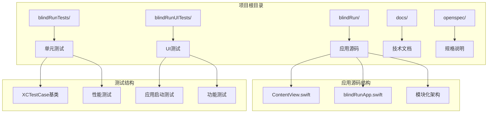

**图表来源**
- [blindRunTests.swift:1-39](file://blindRunTests/blindRunTests.swift#L1-L39)
- [blindRunUITests.swift:1-44](file://blindRunUITests/blindRunUITests.swift#L1-L44)
- [blindRunUITestsLaunchTests.swift:1-36](file://blindRunUITests/blindRunUITestsLaunchTests.swift#L1-L36)

**章节来源**
- [blindRunTests.swift:1-39](file://blindRunTests/blindRunTests.swift#L1-L39)
- [blindRunUITests.swift:1-44](file://blindRunUITests/blindRunUITests.swift#L1-L44)
- [blindRunUITestsLaunchTests.swift:1-36](file://blindRunUITests/blindRunUITestsLaunchTests.swift#L1-L36)

## 核心组件

### 测试基础设施

项目已建立了基础的测试框架，包含单元测试和 UI 测试的基础结构：

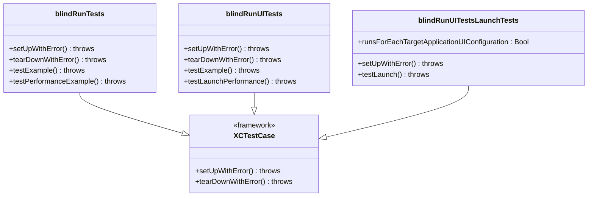

**图表来源**
- [blindRunTests.swift:11-38](file://blindRunTests/blindRunTests.swift#L11-L38)
- [blindRunUITests.swift:10-43](file://blindRunUITests/blindRunUITests.swift#L10-L43)
- [blindRunUITestsLaunchTests.swift:10-35](file://blindRunUITests/blindRunUITestsLaunchTests.swift#L10-L35)

### 应用架构组件

根据架构文档，blindRun 采用 SwiftUI + MVVM 架构模式，包含以下核心模块：

- **Core**: 应用环境、依赖容器、共享模型、应用状态
- **Auth**: 手机号登录、JWT 持久化、认证会话
- **Role**: 活跃角色切换和角色保护规则
- **BlindRunner**: 盲人用户主页、个人资料、预订、订单状态
- **Volunteer**: 志愿者主页、可用性、可用订单、服务记录、积分
- **Orders**: 订单 DTO、订单状态机助手、轮询机制
- **Map**: 高德地图桥接、当前位置、标记、距离计算
- **Voice**: 文字转语音、重复当前状态、语音输入助手
- **Safety**: 紧急确认和取消确认流程
- **Profile**: 盲人和志愿者个人资料表单

**章节来源**
- [08-ios-architecture.md:18-31](file://docs/08-ios-architecture.md#L18-L31)
- [08-ios-architecture.md:33-48](file://docs/08-ios-architecture.md#L33-L48)

## 架构概览

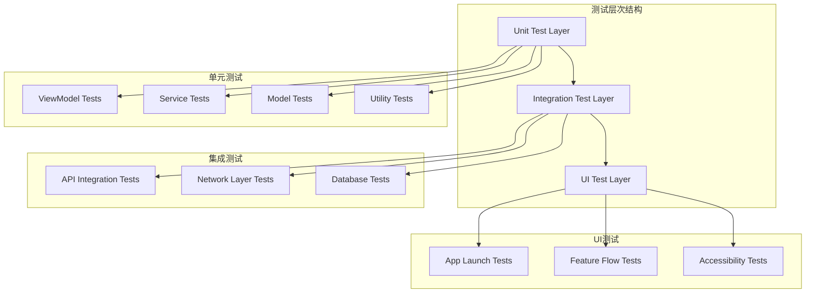

**图表来源**
- [08-ios-architecture.md:50-82](file://docs/08-ios-architecture.md#L50-L82)

## 详细组件分析

### 单元测试策略

#### ViewModel 测试

基于 MVVM 架构，ViewModel 是测试的核心对象：

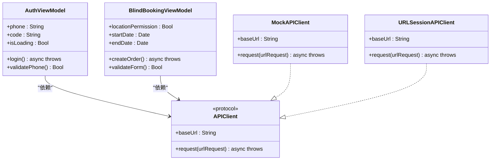

**图表来源**
- [08-ios-architecture.md:44-48](file://docs/08-ios-architecture.md#L44-L48)
- [08-ios-architecture.md:68-76](file://docs/08-ios-architecture.md#L68-L76)

#### Mock 对象创建和使用

针对不同的测试场景，需要创建相应的 Mock 对象：

1. **APIClient Mock**: 用于模拟网络请求，支持成功响应和错误响应
2. **Location Manager Mock**: 用于模拟位置权限和位置数据
3. **UserDefaults Mock**: 用于模拟令牌存储和应用设置
4. **Speech Service Mock**: 用于模拟语音播报功能

#### 测试数据准备和清理

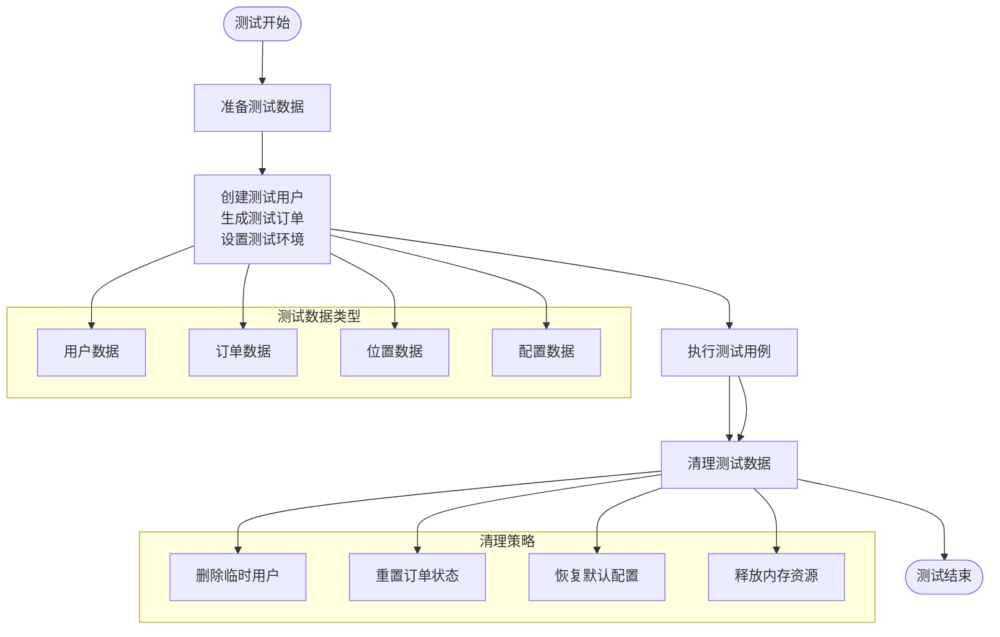

**图表来源**
- [08-ios-architecture.md:78-82](file://docs/08-ios-architecture.md#L78-L82)

**章节来源**
- [blindRunTests.swift:13-19](file://blindRunTests/blindRunTests.swift#L13-L19)

### API 测试策略

#### API 客户端测试

根据架构文档，APIClient 负责处理所有网络请求：

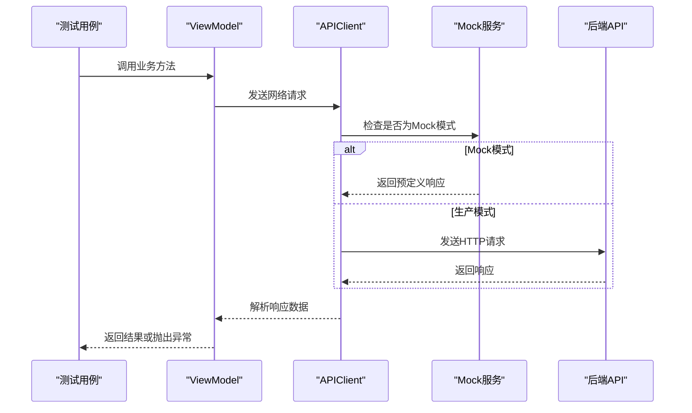

**图表来源**
- [08-ios-architecture.md:68-76](file://docs/08-ios-architecture.md#L68-L76)

#### 错误码映射测试

根据后端规范，需要测试各种错误码的处理：

| 错误码 | 描述 | 测试场景 |
|--------|------|----------|
| INVALID_VERIFICATION_CODE | 验证码无效 | 登录时输入错误验证码 |
| PROFILE_INCOMPLETE | 个人资料不完整 | 访问需要完善资料的功能 |
| LOCATION_PERMISSION_REQUIRED | 需要位置权限 | 访问需要位置的服务 |
| ORDER_NOT_FOUND | 订单不存在 | 查看不存在的订单详情 |
| ORDER_ALREADY_ACCEPTED | 订单已被接受 | 尝试接受已被接受的订单 |

**章节来源**
- [spec.md:19-25](file://openspec/changes/add-aidrun-ios-spring-mvp/specs/backend-api-contract/spec.md#L19-L25)

### 网络层测试

#### 环境切换测试

项目支持三种 API 环境，需要分别进行测试：

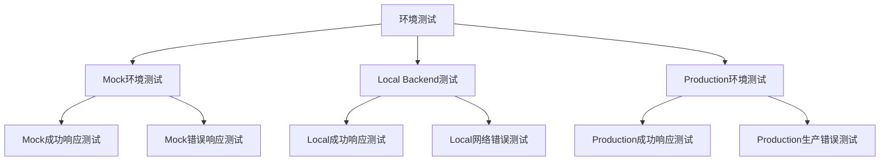

**图表来源**
- [08-ios-architecture.md:52-66](file://docs/08-ios-architecture.md#L52-L66)

#### 轮询机制测试

根据架构要求，订单状态需要每5秒轮询一次：

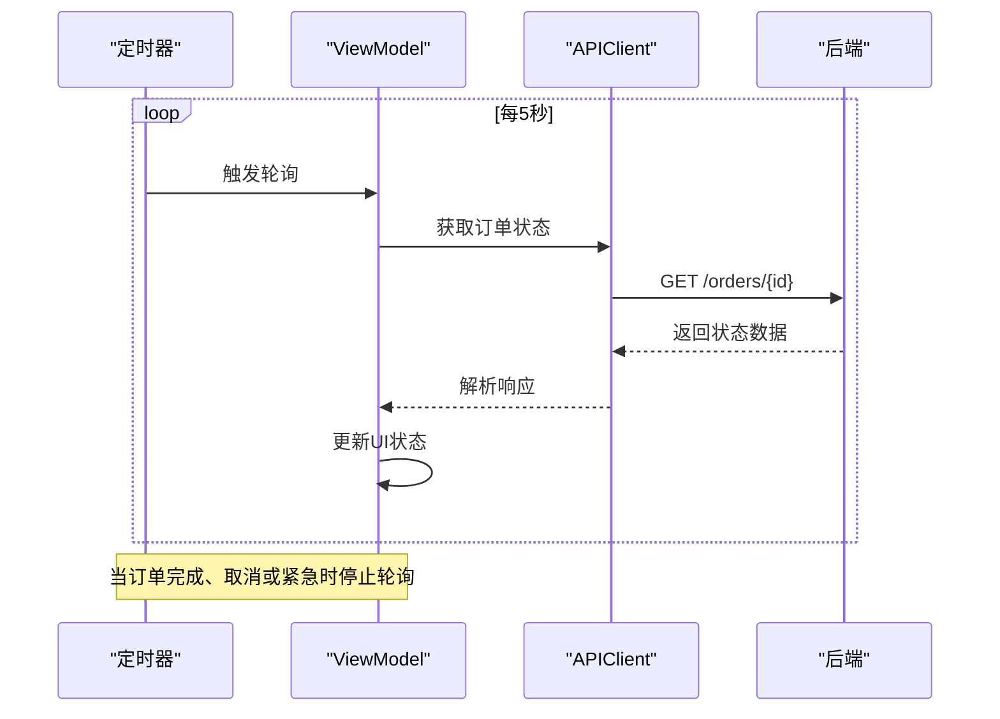

**图表来源**
- [08-ios-architecture.md:125-138](file://docs/08-ios-architecture.md#L125-L138)

**章节来源**
- [08-ios-architecture.md:50-82](file://docs/08-ios-architecture.md#L50-L82)

### UI 测试策略

#### 应用启动测试

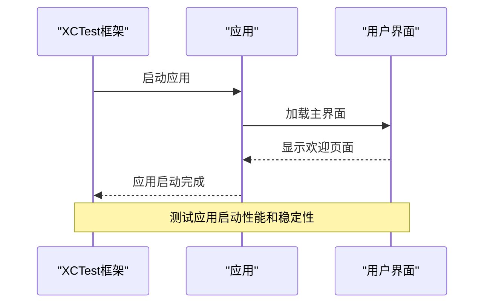

**图表来源**
- [blindRunUITestsLaunchTests.swift:21-34](file://blindRunUITests/blindRunUITestsLaunchTests.swift#L21-L34)

#### 功能流程测试

基于架构文档中的演示验收流程，需要测试以下关键路径：

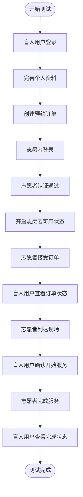

**图表来源**
- [08-ios-architecture.md:148-160](file://docs/08-ios-architecture.md#L148-L160)

**章节来源**
- [blindRunUITests.swift:25-42](file://blindRunUITests/blindRunUITests.swift#L25-L42)

### 业务逻辑测试

#### 订单生命周期测试

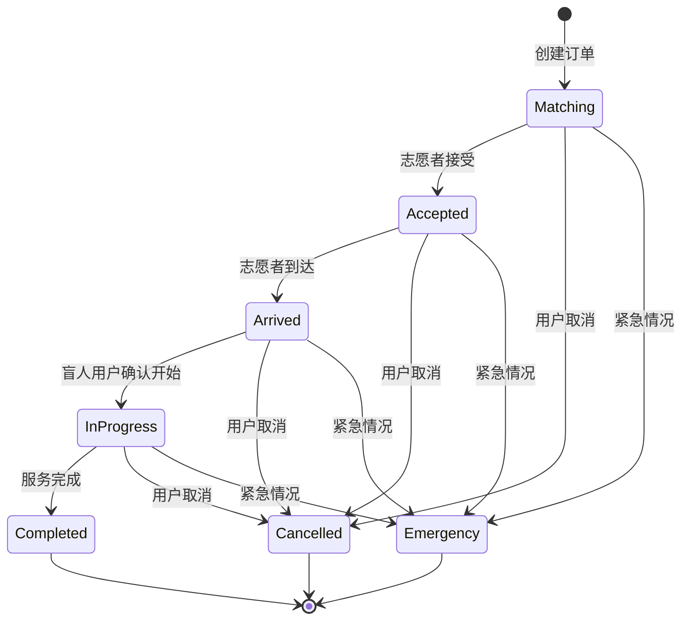

**图表来源**
- [08-ios-architecture.md:127-138](file://docs/08-ios-architecture.md#L127-L138)

#### 角色切换测试

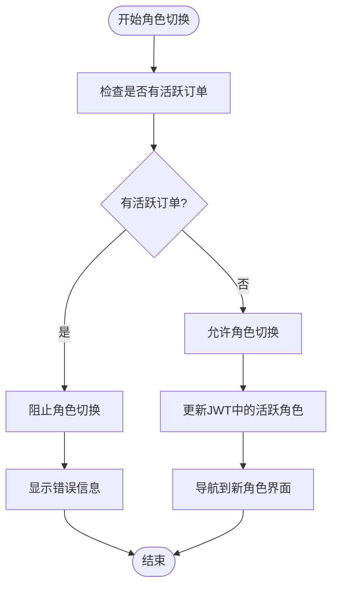

**图表来源**
- [08-ios-architecture.md:92-96](file://docs/08-ios-architecture.md#L92-L96)

## 依赖关系分析

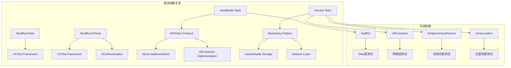

**图表来源**
- [08-ios-architecture.md:10-16](file://docs/08-ios-architecture.md#L10-L16)

**章节来源**
- [08-ios-architecture.md:1-16](file://docs/08-ios-architecture.md#L1-16)

## 性能考虑

### 测试性能基准

根据架构要求，应用需要满足特定的性能指标：

- **应用启动时间**: 需要在合理时间内完成启动
- **轮询频率**: 订单状态轮询间隔为5秒
- **网络响应时间**: API 响应时间应保持在可接受范围内
- **内存使用**: 测试过程中应监控内存使用情况

### 性能测试策略

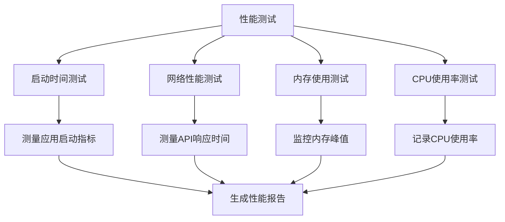

**图表来源**
- [blindRunUITests.swift:37-42](file://blindRunUITests/blindRunUITests.swift#L37-L42)

## 故障排除指南

### 常见测试问题

#### Mock 对象配置问题

当 Mock 对象无法正确返回预期数据时，检查以下配置：

1. **协议一致性**: 确保 Mock 实现完全遵循协议定义
2. **返回值设置**: 检查 Mock 方法的返回值是否正确设置
3. **异步处理**: 确保异步 Mock 方法正确处理 await 关键字
4. **错误场景**: 验证错误场景下的 Mock 行为

#### 网络测试失败

网络测试失败的常见原因：

1. **环境配置**: 检查 API 环境设置是否正确
2. **超时设置**: 验证网络请求的超时时间设置
3. **证书验证**: 确认 SSL 证书验证配置
4. **代理设置**: 检查网络代理配置

#### UI 测试不稳定

UI 测试不稳定的原因及解决方案：

1. **元素查找**: 使用稳定的选择器标识 UI 元素
2. **等待条件**: 添加适当的等待条件确保元素加载完成
3. **屏幕方向**: 统一测试设备的屏幕方向设置
4. **数据状态**: 确保测试前的数据状态一致

**章节来源**
- [blindRunTests.swift:21-29](file://blindRunTests/blindRunTests.swift#L21-L29)

## 结论

blindRun 项目的测试策略基于其 MVVM 架构和功能需求，建立了从单元测试到 UI 测试的完整测试体系。通过合理的 Mock 对象设计、完善的测试数据管理、以及针对 API 层和业务逻辑的专门测试方案，可以确保应用的质量和稳定性。

建议在实际实施中重点关注以下方面：
- 建立统一的 Mock 对象工厂，减少重复代码
- 制定详细的测试数据管理策略，确保测试隔离性
- 实施持续集成，自动运行测试套件
- 建立测试覆盖率监控，逐步提高测试覆盖率
- 定期审查测试策略，适应项目演进

## 附录

### 测试覆盖率要求

基于项目的复杂度和功能重要性，建议的测试覆盖率目标：

- **单元测试覆盖率**: ≥ 70%
- **集成测试覆盖率**: ≥ 60%
- **UI 测试覆盖率**: ≥ 50%
- **关键业务流程覆盖率**: 100%

### 持续集成配置建议

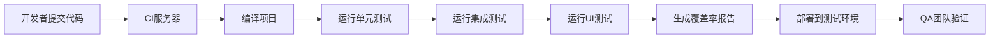

### 测试友好代码设计原则

1. **依赖注入**: 通过构造函数注入依赖，便于 Mock
2. **协议编程**: 使用协议定义接口，支持多态测试
3. **纯函数**: 尽量使用纯函数，便于单元测试
4. **错误处理**: 明确的错误处理和异常抛出
5. **异步操作**: 正确处理异步操作和并发场景