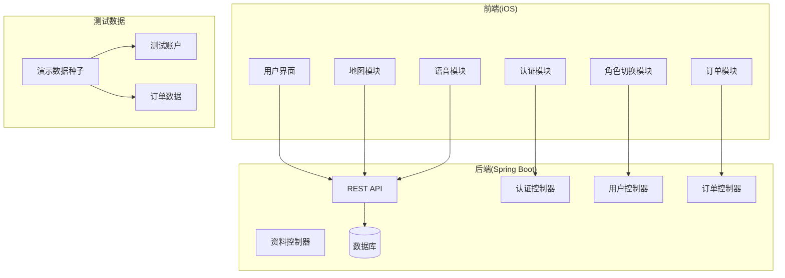
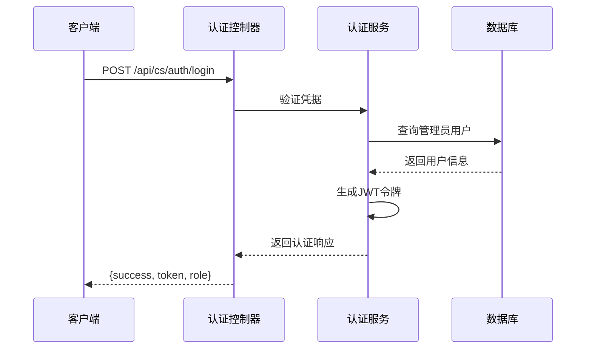
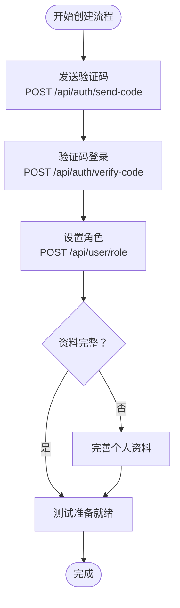
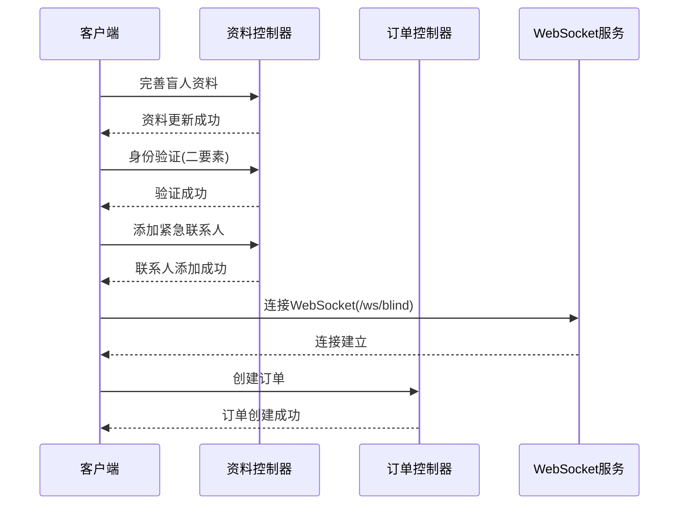
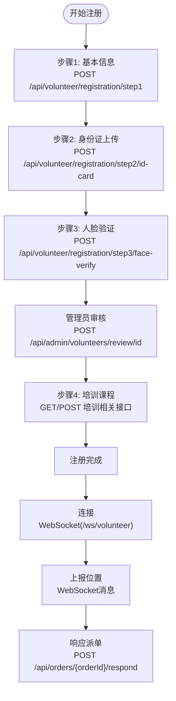
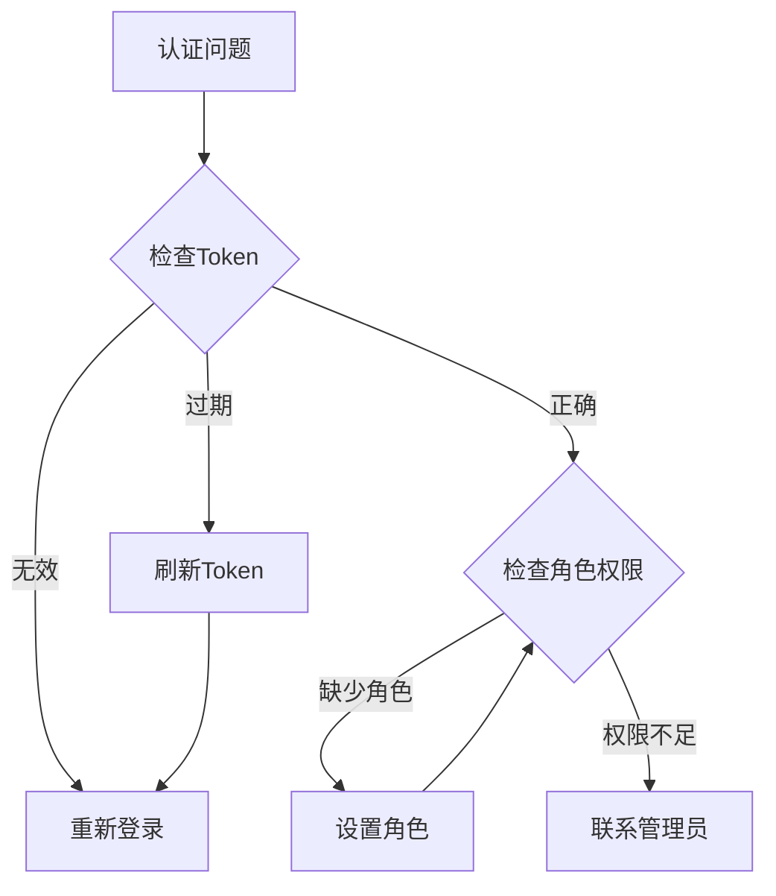

# 测试账户使用指南

<cite>
**本文档引用的文件**
- [test-accounts.md](file://docs/test-accounts.md)
- [application.yml](file://backend/src/main/resources/application.yml)
- [DemoDataSeeder.java](file://backend/src/main/java/com/aidrun/backend/seed/DemoDataSeeder.java)
- [api_spec.yaml](file://docs/api_spec.yaml)
- [AuthController.java](file://backend/src/main/java/com/aidrun/backend/auth/AuthController.java)
- [AuthService.java](file://backend/src/main/java/com/aidrun/backend/auth/AuthService.java)
- [UserController.java](file://backend/src/main/java/com/aidrun/backend/user/UserController.java)
- [UserService.java](file://backend/src/main/java/com/aidrun/backend/user/UserService.java)
- [ProfileController.java](file://backend/src/main/java/com/aidrun/backend/profile/ProfileController.java)
- [RunOrderController.java](file://backend/src/main/java/com/aidrun/backend/order/RunOrderController.java)
- [SecurityConfig.java](file://backend/src/main/java/com/aidrun/backend/config/SecurityConfig.java)
- [AGENTS.md](file://AGENTS.md)
</cite>

## 目录
1. [简介](#简介)
2. [项目结构概览](#项目结构概览)
3. [测试环境与配置](#测试环境与配置)
4. [管理员测试账户](#管理员测试账户)
5. [用户测试账户创建流程](#用户测试账户创建流程)
6. [盲人用户测试流程](#盲人用户测试流程)
7. [志愿者用户测试流程](#志愿者用户测试流程)
8. [Postman测试工具配置](#postman测试工具配置)
9. [常见问题解答](#常见问题解答)
10. [故障排除指南](#故障排除指南)
11. [总结](#总结)

## 简介

本指南详细介绍了AidRun助盲跑MVP项目的测试账户使用方法。该项目是一个为视障跑者提供志愿者陪伴跑服务的移动应用，采用SwiftUI + Spring Boot技术栈构建。测试账户系统支持两种主要角色：盲人用户和志愿者用户，以及管理员账户。

## 项目结构概览

AidRun项目采用前后端分离架构，主要包含以下组件：



**图表来源**
- [AGENTS.md:38-46](file://AGENTS.md#L38-L46)
- [application.yml:1-34](file://backend/src/main/resources/application.yml#L1-L34)

## 测试环境与配置

### 环境地址

| 项目 | 地址 |
|------|------|
| API基础URL | `http://47.114.113.171` |
| Swagger UI | 本地开发可用 `http://localhost:8081/swagger-ui/index.html` |

### 应用程序配置

后端使用H2内存数据库进行演示，配置如下：
- 数据源：H2内存数据库
- 控制台：启用H2控制台
- JPA：自动DDL模式
- Swagger：OpenAPI 3.1规范

**章节来源**
- [test-accounts.md:8-15](file://docs/test-accounts.md#L8-L15)
- [application.yml:1-34](file://backend/src/main/resources/application.yml#L1-L34)

## 管理员测试账户

### 账户信息

| 字段 | 值 |
|------|-----|
| 用户名 | `admin` |
| 密码 | `admin123` |
| 角色 | ADMIN |
| 部门 | 运营部 |

### 登录接口

管理员可以使用以下接口进行登录：



**图表来源**
- [AuthController.java:22-26](file://backend/src/main/java/com/aidrun/backend/auth/AuthController.java#L22-L26)
- [AuthService.java:29-47](file://backend/src/main/java/com/aidrun/backend/auth/AuthService.java#L29-L47)

### 管理员权限范围

管理员拥有以下操作权限：
- 志愿者身份证审核
- 培训课程管理
- 通知模板管理
- 紧急事件处理
- 所有 `/api/admin/**` 和 `/api/cs/**` 端点

**章节来源**
- [test-accounts.md:17-54](file://docs/test-accounts.md#L17-L54)

## 用户测试账户创建流程

### 通用创建步骤

用户测试账户通过手机验证码登录创建，具体流程如下：



**图表来源**
- [test-accounts.md:61-125](file://docs/test-accounts.md#L61-L125)

### 验证码登录机制

在演示环境中，系统使用固定验证码 `123456`：
- 验证码通过阿里云短信服务发送
- 支持手动输入验证码进行登录
- 首次登录自动创建用户账户

**章节来源**
- [test-accounts.md:57-125](file://docs/test-accounts.md#L57-L125)
- [AuthService.java:19-33](file://backend/src/main/java/com/aidrun/backend/auth/AuthService.java#L19-L33)

## 盲人用户测试流程

### 完整测试流程

盲人用户的完整测试流程包括以下步骤：



**图表来源**
- [test-accounts.md:126-174](file://docs/test-accounts.md#L126-L174)
- [ProfileController.java:26-33](file://backend/src/main/java/com/aidrun/backend/profile/ProfileController.java#L26-L33)

### 关键功能测试

#### 紧急联系人管理
- 至少需要添加1个紧急联系人才能下单
- 支持添加、修改、删除紧急联系人
- 支持设置主要联系人

#### 订单创建要求
- 用户角色必须为BLIND
- 必须完成紧急联系人设置
- Token中必须包含角色信息

**章节来源**
- [test-accounts.md:126-174](file://docs/test-accounts.md#L126-L174)

## 志愿者用户测试流程

### 完整注册流程

志愿者用户的完整测试流程包括四个注册步骤：



**图表来源**
- [test-accounts.md:176-271](file://docs/test-accounts.md#L176-L271)

### 志愿者能力要求

#### 基础能力
- 完成4步注册流程
- 通过管理员身份证审核
- 保持WebSocket连接
- 定时上报位置信息

#### 位置上报
通过WebSocket发送位置更新消息：
```json
{
  "type": "LOCATION_UPDATE",
  "lat": 39.92,
  "lng": 116.47
}
```

**章节来源**
- [test-accounts.md:176-271](file://docs/test-accounts.md#L176-L271)

## Postman测试工具配置

### API规范导入

1. 打开Postman → Import → 选择File
2. 选择 `docs/api_spec.yaml`
3. Postman会自动识别OpenAPI 3.1格式并生成所有请求

### 认证配置

在Postman集合中设置以下变量：
- `base_url` = 后端服务器地址
- `token` = 登录后获取的JWT令牌

在Collection Auth中设置：
- Type: Bearer Token
- Token: `{{token}}`

### 推荐测试顺序

1. **发送验证码** → `POST /api/auth/send-code`
2. **登录** → `POST /api/auth/verify-code`（从后端日志获取验证码）
3. **设置角色** → `POST /api/user/role`（保存返回的新token）
4. 根据角色继续后续操作

**章节来源**
- [test-accounts.md:275-299](file://docs/test-accounts.md#L275-L299)

## 常见问题解答

### 验证码相关问题

**Q: 验证码是什么？**
A: 验证码通过阿里云短信发送到您填写的手机号，查看手机短信即可。

**Q: 为什么收到的验证码无效？**
A: 在演示环境中，系统使用固定验证码 `123456`。如果遇到验证码无效的情况，请检查是否正确使用了固定验证码。

### 角色切换问题

**Q: 设置角色后出现403错误？**
A: 设置角色后会返回新的token，该token包含角色信息。如果继续使用旧token，会因为缺少角色权限而被拒绝。**必须替换为新token**。

**Q: 创建订单失败的原因？**
A: 创建订单需要满足以下条件：
1. 用户角色为BLIND
2. 至少添加1个紧急联系人
3. Token中包含角色信息（已设置角色并替换token）

### WebSocket连接问题

**Q: WebSocket连接被拒绝？**
A: 检查以下几点：
- token是否有效（未过期、未登出）
- 连接的端点是否匹配角色（BLIND → `/ws/blind`，VOLUNTEER → `/ws/volunteer`）

**Q: 志愿者收不到派单？**
A: 志愿者必须满足以下条件：
1. 完成4步注册流程（基本信息 + 身份证 + 人脸 + 培训）
2. 管理员审核身份证通过
3. WebSocket保持连接
4. 定时上报位置（至少一次）

**章节来源**
- [test-accounts.md:302-336](file://docs/test-accounts.md#L302-L336)

## 故障排除指南

### 认证和授权问题



### 数据库和测试数据问题

系统使用演示数据种子自动创建测试数据：
- 1个具有完整资料和紧急联系人的盲人用户
- 1个已批准且可用的志愿者用户
- 多个待匹配订单
- 完成的历史记录用于积分演示

**章节来源**
- [DemoDataSeeder.java:50-112](file://backend/src/main/java/com/aidrun/backend/seed/DemoDataSeeder.java#L50-L112)

### API访问控制问题

后端安全配置确保：
- 未认证用户无法访问受保护的API端点
- JWT认证过滤器验证请求令牌
- 特定端点（如认证、Swagger）允许匿名访问
- H2控制台仅限本地访问

**章节来源**
- [SecurityConfig.java:28-50](file://backend/src/main/java/com/aidrun/backend/config/SecurityConfig.java#L28-L50)

## 总结

本测试账户使用指南涵盖了AidRun项目的完整测试流程，包括：

1. **环境配置**：明确了测试环境地址和配置要求
2. **账户类型**：详细介绍了管理员、盲人用户和志愿者用户的测试方法
3. **完整流程**：提供了从账户创建到功能测试的完整操作步骤
4. **工具配置**：指导如何使用Postman进行API测试
5. **问题解决**：提供了常见问题的解决方案和故障排除方法

通过遵循本指南，测试人员可以有效地验证系统的各项功能，确保盲人跑者与志愿者之间的匹配服务正常运行。建议在测试过程中重点关注用户体验的无障碍性，特别是VoiceOver支持和语音交互功能。