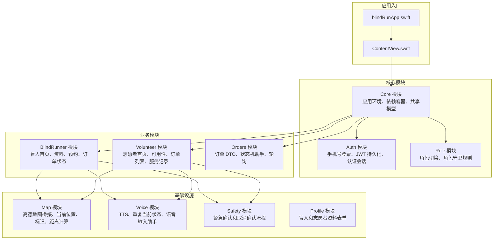
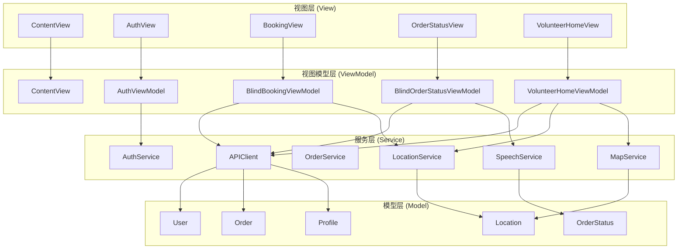
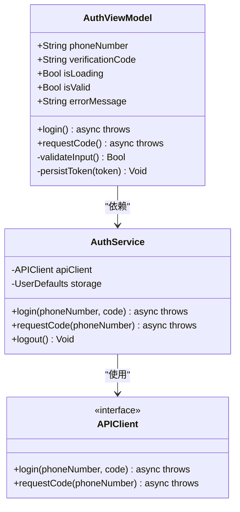
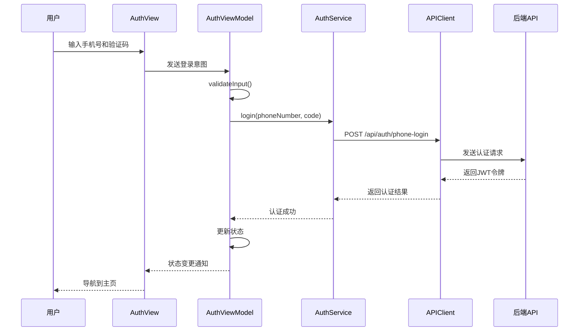
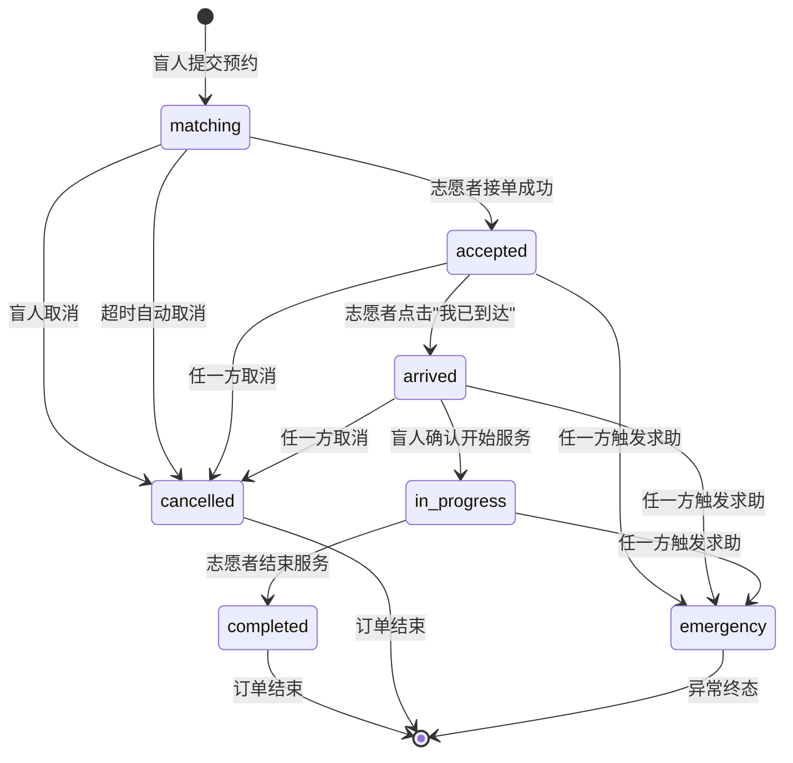
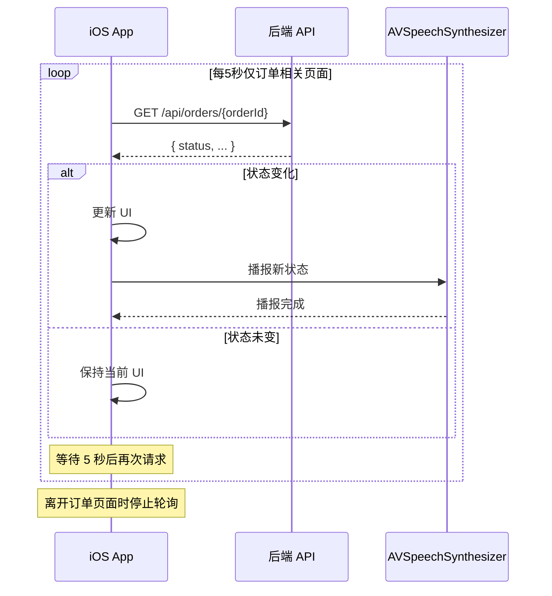
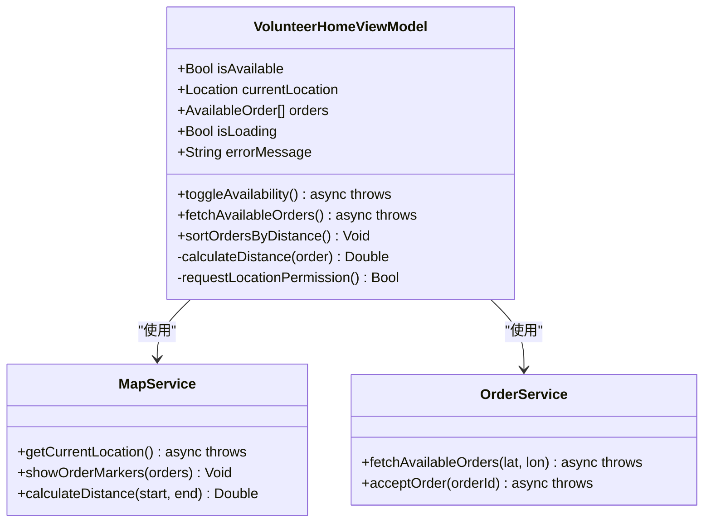
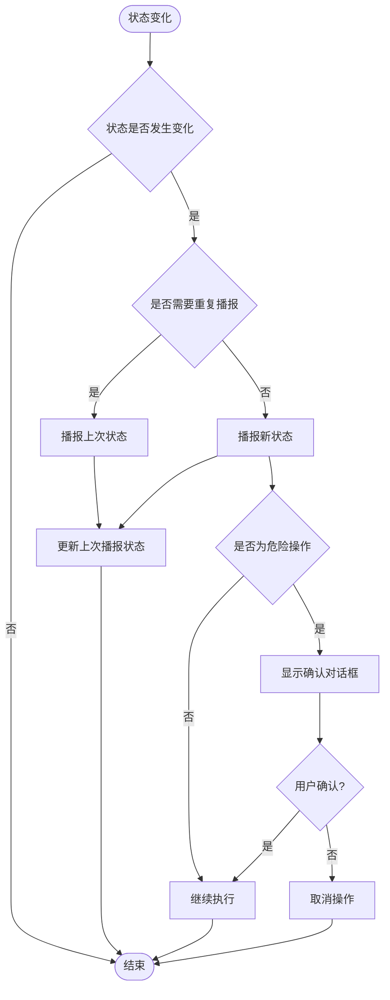
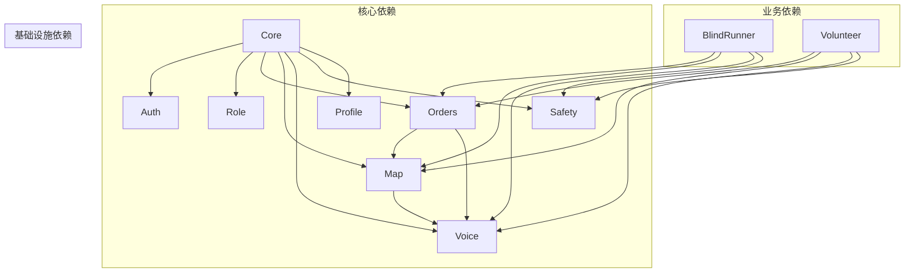
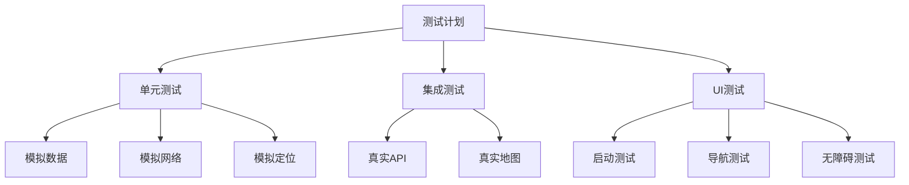

# MVVM 模式实现规范

<cite>
**本文档引用的文件**
- [blindRunApp.swift](file://blindRun/blindRunApp.swift)
- [ContentView.swift](file://blindRun/blindRun/ContentView.swift)
- [08-ios-architecture.md](file://docs/08-ios-architecture.md)
- [07-api-contract.openapi.yaml](file://docs/07-api-contract.openapi.yaml)
- [04-user-flows-and-state-machine.md](file://docs/04-user-flows-and-state-machine.md)
- [09-accessibility-and-voice-guidelines.md](file://docs/09-accessibility-and-voice-guidelines.md)
- [03-user-stories.md](file://docs/03-user-stories.md)
- [blindRunTests.swift](file://blindRunTests/blindRunTests.swift)
- [blindRunUITests.swift](file://blindRunUITests/blindRunUITests.swift)
- [blindRunUITestsLaunchTests.swift](file://blindRunUITests/blindRunUITestsLaunchTests.swift)
</cite>

## 目录
1. [引言](#引言)
2. [项目结构](#项目结构)
3. [核心组件](#核心组件)
4. [架构概览](#架构概览)
5. [详细组件分析](#详细组件分析)
6. [依赖关系分析](#依赖关系分析)
7. [性能考虑](#性能考虑)
8. [故障排除指南](#故障排除指南)
9. [结论](#结论)

## 引言

本规范文档针对 blindRun 项目的 MVVM 架构模式实现制定了详细的标准和指导原则。blindRun 是一个基于 SwiftUI + MVVM 架构的 iOS 应用，专注于助盲跑服务场景，采用真实地图、真实定位、手机号登录 + JWT 的技术栈。

根据项目架构文档，应用采用以下核心原则：
- SwiftUI 作为主要 UI 框架，天然支持 MVVM 模式
- View 层保持薄层设计，仅负责渲染状态和转发用户意图
- ViewModel 层负责业务逻辑、状态管理和异步操作
- Service 层封装 API 调用和平台能力边界
- DTOs 与 OpenAPI 模式保持一致，领域助手处理显示文本和状态转换

## 项目结构

blindRun 项目采用模块化的目录结构，按照功能域划分不同的模块组：

**图表来源**
- [08-ios-architecture.md:18-32](file://docs/08-ios-architecture.md#L18-L32)
- [blindRunApp.swift:10-17](file://blindRun/blindRunApp.swift#L10-L17)

**章节来源**
- [08-ios-architecture.md:18-32](file://docs/08-ios-architecture.md#L18-L32)
- [blindRunApp.swift:10-17](file://blindRun/blindRunApp.swift#L10-L17)

## 核心组件

### View 层设计原则

View 层必须保持极简，遵循以下设计原则：

1. **状态渲染**：仅负责根据 ViewModel 状态渲染界面
2. **意图转发**：将用户交互转换为 ViewModel 可理解的意图
3. **无业务逻辑**：不包含任何业务逻辑或网络调用
4. **无状态持久化**：不直接管理应用状态

### ViewModel 层职责边界

ViewModel 层承担以下核心职责：

1. **状态管理**：管理加载状态、验证状态、业务状态
2. **异步操作**：处理 API 调用、轮询、后台任务
3. **数据绑定**：提供 @Published 属性供 View 绑定
4. **业务逻辑**：实现业务规则和状态转换
5. **错误处理**：统一处理错误并提供用户友好的反馈

### Service 层设计规范

Service 层负责封装外部系统和平台能力：

1. **API 封装**：统一处理网络请求和响应
2. **平台集成**：封装地图、定位、语音等系统能力
3. **错误映射**：将后端错误映射为用户可理解的消息
4. **重试策略**：实现简单的重试机制

### Model 层设计原则

Model 层遵循以下原则：

1. **DTO 映射**：与 OpenAPI 模式保持严格对应
2. **领域助手**：提供显示文本和状态转换的辅助方法
3. **数据验证**：实现必要的数据验证逻辑
4. **序列化支持**：支持 JSON 序列化和反序列化

**章节来源**
- [08-ios-architecture.md:33-49](file://docs/08-ios-architecture.md#L33-L49)

## 架构概览

blindRun 采用的 MVVM 架构模式体现了清晰的分层设计：

**图表来源**
- [08-ios-architecture.md:33-49](file://docs/08-ios-architecture.md#L33-L49)
- [07-api-contract.openapi.yaml:25-41](file://docs/07-api-contract.openapi.yaml#L25-L41)

## 详细组件分析

### 认证 ViewModel 设计规范

#### AuthViewModel 设计要点

认证 ViewModel 是 MVVM 模式的核心示例，负责手机号登录和验证码验证：

**图表来源**
- [08-ios-architecture.md:44](file://docs/08-ios-architecture.md#L44)
- [07-api-contract.openapi.yaml:25-46](file://docs/07-api-contract.openapi.yaml#L25-L46)

#### 认证流程序列图

**图表来源**
- [07-api-contract.openapi.yaml:25-46](file://docs/07-api-contract.openapi.yaml#L25-L46)
- [08-ios-architecture.md:86-90](file://docs/08-ios-architecture.md#L86-L90)

**章节来源**
- [08-ios-architecture.md:44](file://docs/08-ios-architecture.md#L44)
- [07-api-contract.openapi.yaml:25-46](file://docs/07-api-contract.openapi.yaml#L25-L46)

### 订单管理 ViewModel 设计规范

#### BlindOrderStatusViewModel 设计要点

订单状态 ViewModel 负责处理订单状态轮询和状态变化：

**图表来源**
- [04-user-flows-and-state-machine.md:74-96](file://docs/04-user-flows-and-state-machine.md#L74-L96)

#### 订单轮询机制

订单状态轮询是盲人端的核心功能，每 5 秒自动更新：

**图表来源**
- [04-user-flows-and-state-machine.md:277-299](file://docs/04-user-flows-and-state-machine.md#L277-L299)

**章节来源**
- [04-user-flows-and-state-machine.md:74-96](file://docs/04-user-flows-and-state-machine.md#L74-L96)
- [04-user-flows-and-state-machine.md:277-299](file://docs/04-user-flows-and-state-machine.md#L277-L299)

### 地图集成 ViewModel 设计规范

#### VolunteerHomeViewModel 设计要点

志愿者首页 ViewModel 负责处理地图集成和订单列表：

**图表来源**
- [08-ios-architecture.md:47](file://docs/08-ios-architecture.md#L47)
- [07-api-contract.openapi.yaml:209-236](file://docs/07-api-contract.openapi.yaml#L209-L236)

**章节来源**
- [08-ios-architecture.md:47](file://docs/08-ios-architecture.md#L47)
- [07-api-contract.openapi.yaml:209-236](file://docs/07-api-contract.openapi.yaml#L209-L236)

### 无障碍和语音集成设计规范

#### 语音服务设计要点

项目实现了完整的无障碍支持，包括 TTS 和语音输入：

**图表来源**
- [09-accessibility-and-voice-guidelines.md:13-36](file://docs/09-accessibility-and-voice-guidelines.md#L13-L36)

**章节来源**
- [09-accessibility-and-voice-guidelines.md:13-36](file://docs/09-accessibility-and-voice-guidelines.md#L13-L36)

## 依赖关系分析

### 模块间依赖关系

**图表来源**
- [08-ios-architecture.md:18-32](file://docs/08-ios-architecture.md#L18-L32)

### 外部依赖管理

项目对外部依赖的管理遵循以下原则：

1. **网络层**：使用 URLSession + async/await，无额外依赖
2. **地图服务**：集成高德地图 iOS SDK
3. **语音服务**：使用 AVSpeechSynthesizer 和 iOS Speech 框架
4. **状态管理**：使用 SwiftUI 的 @State、@Observable、@Published

**章节来源**
- [08-ios-architecture.md:5-16](file://docs/08-ios-architecture.md#L5-L16)

## 性能考虑

### 轮询优化策略

订单状态轮询采用 5 秒间隔，这是在实时性和性能之间的平衡：

1. **条件轮询**：仅在相关页面启用轮询
2. **状态缓存**：避免重复请求相同状态
3. **页面生命周期管理**：页面消失时自动停止轮询
4. **网络优化**：使用 HTTP 缓存头和条件请求

### 内存管理最佳实践

1. **弱引用**：避免 ViewModel 和 View 之间的循环引用
2. **任务取消**：在页面消失时取消正在进行的网络请求
3. **状态清理**：及时清理不再使用的状态和资源
4. **图片缓存**：合理使用图片缓存机制

### UI 响应性优化

1. **异步操作**：所有网络请求和耗时操作都在后台线程执行
2. **状态合并**：将多个状态更新合并为一次 UI 刷新
3. **防抖处理**：对频繁触发的状态变化进行防抖
4. **懒加载**：对重型视图采用懒加载策略

## 故障排除指南

### 常见问题诊断

#### 认证失败排查

1. **检查网络连接**：确保设备可以访问后端 API
2. **验证环境配置**：确认 API 环境设置正确
3. **检查令牌存储**：验证 JWT 令牌是否正确存储
4. **查看错误日志**：分析具体的错误代码和消息

#### 订单状态不同步

1. **检查轮询配置**：确认轮询间隔和条件设置正确
2. **验证状态机逻辑**：检查订单状态转换规则
3. **监控网络请求**：确保 API 调用成功
4. **检查 TTS 配置**：验证语音播报功能正常

#### 地图功能异常

1. **验证定位权限**：确认应用具有定位权限
2. **检查高德地图配置**：验证密钥和配置正确
3. **测试网络连接**：确保可以访问地图服务
4. **查看错误日志**：分析具体的错误信息

### 调试工具和技巧

#### 单元测试策略

**图表来源**
- [blindRunTests.swift:21-29](file://blindRunTests/blindRunTests.swift#L21-L29)
- [blindRunUITests.swift:25-34](file://blindRunUITests/blindRunUITests.swift#L25-L34)

**章节来源**
- [blindRunTests.swift:21-29](file://blindRunTests/blindRunTests.swift#L21-L29)
- [blindRunUITests.swift:25-34](file://blindRunUITests/blindRunUITests.swift#L25-L34)

### 性能监控

1. **启动性能**：监控应用启动时间
2. **内存使用**：跟踪内存泄漏和过度使用
3. **网络性能**：监控 API 响应时间和成功率
4. **电池消耗**：评估后台任务对电池的影响

## 结论

blindRun 项目的 MVVM 架构实现体现了现代 iOS 开发的最佳实践。通过清晰的分层设计、严格的职责分离和完善的测试策略，项目建立了可维护、可扩展的应用架构。

### 关键成功因素

1. **架构一致性**：严格遵循 MVVM 模式，确保各层职责明确
2. **模块化设计**：按功能域划分模块，提高代码组织性
3. **测试覆盖**：建立完整的测试体系，包括单元测试和 UI 测试
4. **性能优化**：在实时性和性能之间找到平衡点
5. **无障碍支持**：优先考虑盲人用户的使用体验

### 未来改进方向

1. **架构演进**：随着功能增长，考虑引入更复杂的架构模式
2. **性能优化**：持续优化启动速度和运行时性能
3. **代码质量**：加强代码审查和静态分析
4. **用户体验**：根据用户反馈持续改进界面设计
5. **技术升级**：适时引入新的 iOS 技术和工具

通过遵循本规范，开发团队可以确保 blindRun 项目在功能完整性、代码质量和用户体验方面都达到预期标准，为后续的功能扩展和维护奠定坚实基础。