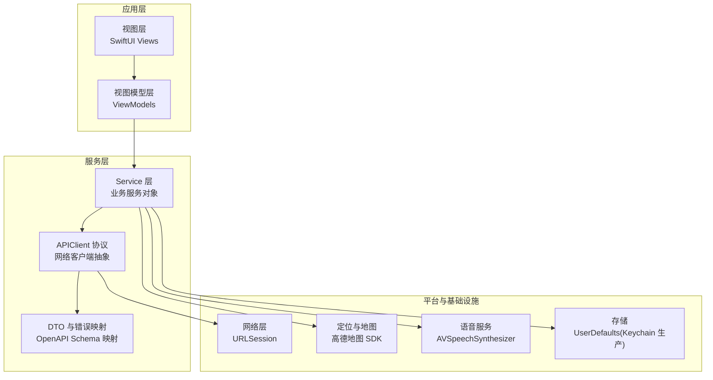
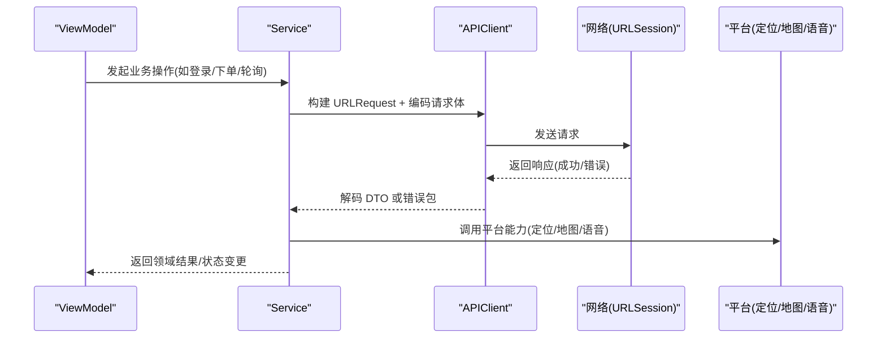
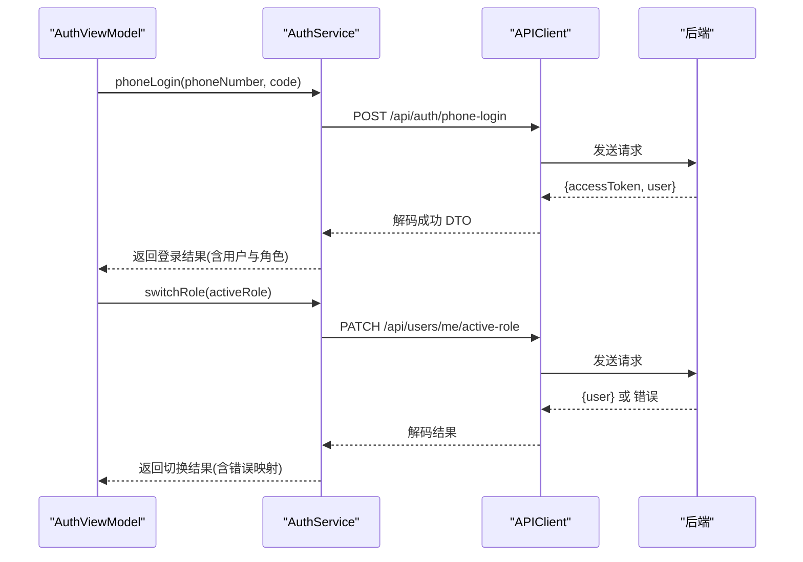
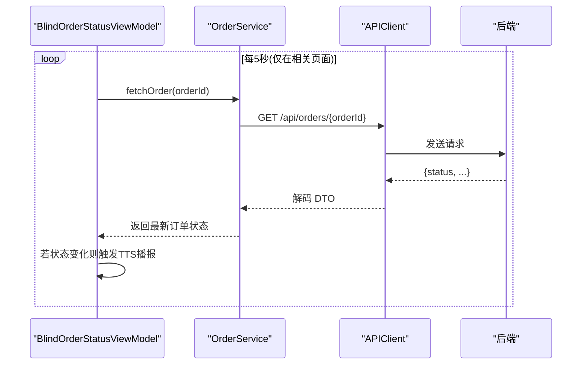
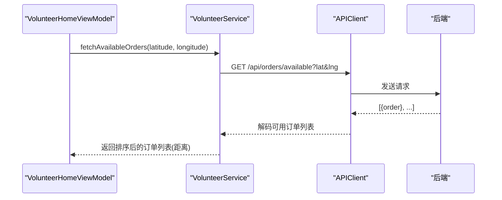
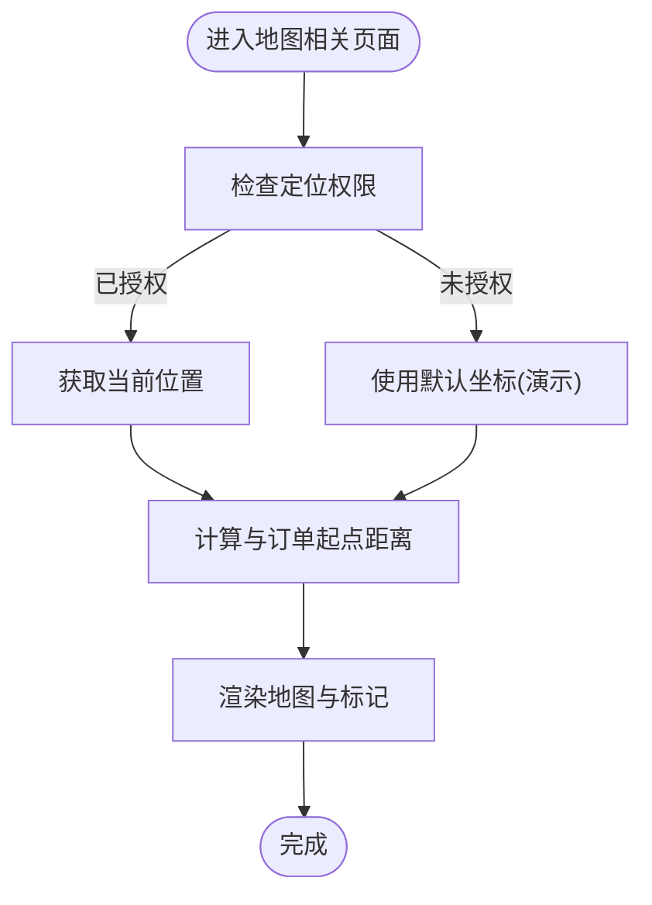
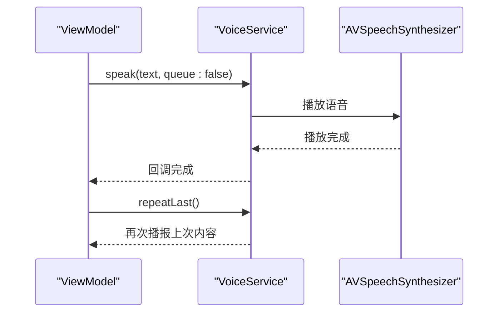
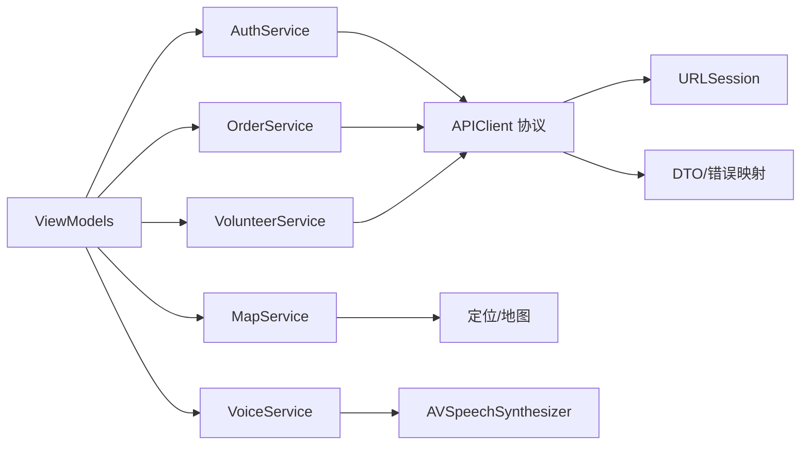

# Service 层设计规范

<cite>
**本文引用的文件**
- [08-ios-architecture.md](file://docs/08-ios-architecture.md)
- [07-api-contract.openapi.yaml](file://docs/07-api-contract.openapi.yaml)
- [09-accessibility-and-voice-guidelines.md](file://docs/09-accessibility-and-voice-guidelines.md)
- [04-user-flows-and-state-machine.md](file://docs/04-user-flows-and-state-machine.md)
- [03-user-stories.md](file://docs/03-user-stories.md)
- [blindRunApp.swift](file://blindRun/blindRun/blindRunApp.swift)
- [ContentView.swift](file://blindRun/blindRun/ContentView.swift)
</cite>

## 目录
1. [引言](#引言)
2. [项目结构](#项目结构)
3. [核心组件](#核心组件)
4. [架构总览](#架构总览)
5. [详细组件分析](#详细组件分析)
6. [依赖关系分析](#依赖关系分析)
7. [性能考虑](#性能考虑)
8. [故障排查指南](#故障排查指南)
9. [结论](#结论)
10. [附录](#附录)

## 引言
本规范面向 blindRun 项目的 Service 层设计，明确 Service 对象的职责边界、API 客户端协议设计原则、Mock 与真实实现的切换策略，以及与 ViewModel 的交互方式。Service 层负责封装网络与平台能力边界，统一数据传输对象（DTO）管理，提供稳定可靠的调用契约，支撑 MVVM 架构下的 ViewModel 专注状态与交互。

## 项目结构
根据架构文档，iOS 采用 SwiftUI + MVVM，模块按领域划分，Service 层应与各业务模块协同工作：
- Core：应用环境、依赖容器、共享模型、应用状态
- Auth：手机号登录、JWT 持久化、会话管理
- Role：角色切换与守卫规则
- BlindRunner：盲人端首页、资料、预约、订单状态
- Volunteer：志愿者首页、可用性、可接订单、服务记录、积分
- Orders：订单 DTO、状态机辅助、轮询
- Map：高德地图桥接、当前位置、标记、距离计算
- Voice：TTS、重复当前状态、语音输入辅助
- Safety：紧急确认与取消确认流程
- Profile：盲人与志愿者资料表单

图表来源
- [08-ios-architecture.md: 18-31:18-31](file://docs/08-ios-architecture.md#L18-L31)
- [08-ios-architecture.md: 33-41:33-41](file://docs/08-ios-architecture.md#L33-L41)

章节来源
- [08-ios-architecture.md: 18-41:18-41](file://docs/08-ios-architecture.md#L18-L41)

## 核心组件
- Service 对象职责
  - 封装 API 调用与平台能力边界，屏蔽网络细节与平台差异
  - 统一数据传输对象（DTO）解析与错误映射，向 ViewModel 提供稳定的领域对象
  - 通过 APIClient 协议抽象，支持 Mock 与真实实现无缝切换
  - 负责轮询控制、状态变更通知、TTS 错误提示等横切关注点
- APIClient 协议设计原则
  - 请求构建：方法、路径、查询参数、JSON 正文
  - 认证：受保护端点自动附加 Authorization: Bearer <accessToken>
  - 解码：成功 DTO 与错误包解码
  - 错误映射：将后端错误码映射为用户可见消息与 TTS 提示
  - 重试策略：保持简单，避免复杂离线队列
- DTO 管理
  - DTO 严格对齐 OpenAPI Schema，提供领域助手处理显示文本与状态转换
  - 错误响应体统一为错误 DTO，便于 ViewModel 一致处理

章节来源
- [08-ios-architecture.md: 68-82:68-82](file://docs/08-ios-architecture.md#L68-L82)
- [07-api-contract.openapi.yaml: 22-24:22-24](file://docs/07-api-contract.openapi.yaml#L22-L24)

## 架构总览
Service 层位于 ViewModel 与网络/平台之间，承担以下职责：
- 通过 APIClient 协议屏蔽底层实现差异
- 在 Service 内部协调多源数据（网络、定位、语音），形成稳定的领域对象
- 与 ViewModel 通过状态与事件进行解耦交互

图表来源
- [08-ios-architecture.md: 33-41:33-41](file://docs/08-ios-architecture.md#L33-L41)
- [08-ios-architecture.md: 68-82:68-82](file://docs/08-ios-architecture.md#L68-L82)

## 详细组件分析

### 认证服务（Auth Service）
职责
- 手机号登录与注册合并，固定验证码用于演示
- JWT 持久化与会话恢复，支持启动时校验与清理过期令牌
- 角色切换（activeRole）守卫：存在活跃订单时禁止切换
- 与 ViewModel 的交互：暴露登录、角色切换、登出等操作，返回统一结果类型

实现要点
- 使用 APIClient 协议封装 /api/auth/phone-login、/api/users/me、/api/users/me/active-role
- 将后端错误码映射为用户提示与 TTS
- UserDefaults 存取 JWT，生产版本迁移 Keychain

图表来源
- [08-ios-architecture.md: 44](file://docs/08-ios-architecture.md#L44)
- [07-api-contract.openapi.yaml: 25-81:25-81](file://docs/07-api-contract.openapi.yaml#L25-L81)
- [03-user-stories.md: 71-145:71-145](file://docs/03-user-stories.md#L71-L145)

章节来源
- [08-ios-architecture.md: 44](file://docs/08-ios-architecture.md#L44)
- [07-api-contract.openapi.yaml: 25-81:25-81](file://docs/07-api-contract.openapi.yaml#L25-L81)
- [03-user-stories.md: 71-145:71-145](file://docs/03-user-stories.md#L71-L145)

### 订单服务（Order Service）
职责
- 订单创建、查询、状态轮询、状态变更（接单、到达、确认开始、完成、取消、紧急）
- 与 ViewModel 的交互：暴露创建、轮询、状态变更等操作，返回统一结果类型
- 轮询策略：在特定状态与页面生命周期内定时轮询，避免过度请求

图表来源
- [08-ios-architecture.md: 46](file://docs/08-ios-architecture.md#L46)
- [04-user-flows-and-state-machine.md: 275-299:275-299](file://docs/04-user-flows-and-state-machine.md#L275-L299)
- [07-api-contract.openapi.yaml: 150-387:150-387](file://docs/07-api-contract.openapi.yaml#L150-L387)

章节来源
- [08-ios-architecture.md: 46](file://docs/08-ios-architecture.md#L46)
- [04-user-flows-and-state-machine.md: 275-299:275-299](file://docs/04-user-flows-and-state-machine.md#L275-L299)
- [07-api-contract.openapi.yaml: 150-387:150-387](file://docs/07-api-contract.openapi.yaml#L150-L387)

### 志愿者服务（Volunteer Service）
职责
- 志愿者资料创建/更新、Mock 认证、可用性开关
- 获取可接订单列表，结合 iOS 侧距离排序
- 订单详情动作：接单、到达、完成、取消、紧急

图表来源
- [08-ios-architecture.md: 47](file://docs/08-ios-architecture.md#L47)
- [07-api-contract.openapi.yaml: 209-237:209-237](file://docs/07-api-contract.openapi.yaml#L209-L237)

章节来源
- [08-ios-architecture.md: 47](file://docs/08-ios-architecture.md#L47)
- [07-api-contract.openapi.yaml: 209-237:209-237](file://docs/07-api-contract.openapi.yaml#L209-L237)

### 地图服务（Map Service）
职责
- 高德地图桥接、当前位置获取、标记展示、距离计算
- 与定位权限配合，提供默认坐标用于演示稳定性
- 与订单服务协作，计算志愿者到起点的距离

图表来源
- [08-ios-architecture.md: 98-124:98-124](file://docs/08-ios-architecture.md#L98-L124)
- [07-api-contract.openapi.yaml: 770-808:770-808](file://docs/07-api-contract.openapi.yaml#L770-L808)

章节来源
- [08-ios-architecture.md: 98-124:98-124](file://docs/08-ios-architecture.md#L98-L124)
- [07-api-contract.openapi.yaml: 770-808:770-808](file://docs/07-api-contract.openapi.yaml#L770-L808)

### 语音服务（Voice Service）
职责
- TTS 播报关键状态与错误提示
- 重复当前状态按钮触发
- 与无障碍与语音输入规则配合

图表来源
- [09-accessibility-and-voice-guidelines.md: 13-35:13-35](file://docs/09-accessibility-and-voice-guidelines.md#L13-L35)

章节来源
- [09-accessibility-and-voice-guidelines.md: 13-35:13-35](file://docs/09-accessibility-and-voice-guidelines.md#L13-L35)

## 依赖关系分析
Service 层内部依赖关系与外部集成如下：

图表来源
- [08-ios-architecture.md: 33-41:33-41](file://docs/08-ios-architecture.md#L33-L41)
- [08-ios-architecture.md: 68-82:68-82](file://docs/08-ios-architecture.md#L68-L82)

章节来源
- [08-ios-architecture.md: 33-41:33-41](file://docs/08-ios-architecture.md#L33-L41)
- [08-ios-architecture.md: 68-82:68-82](file://docs/08-ios-architecture.md#L68-L82)

## 性能考虑
- 轮询频率与范围：订单状态轮询建议 5 秒一次，仅在相关页面与特定状态启用，避免无效请求
- 重试策略：保持简单，避免复杂离线队列；错误映射需快速反馈，减少无意义重试
- DTO 解析：统一解码与错误包处理，减少重复逻辑与内存拷贝
- 语音播报：避免轮询期间重复播报相同状态，降低语音干扰

章节来源
- [04-user-flows-and-state-machine.md: 275-299:275-299](file://docs/04-user-flows-and-state-machine.md#L275-L299)
- [08-ios-architecture.md: 76-77:76-77](file://docs/08-ios-architecture.md#L76-L77)

## 故障排查指南
常见问题与处理
- 未登录或 Token 失效
  - 现象：调用受保护接口返回未授权
  - 处理：清理 UserDefaults 中的过期 Token，引导重新登录
- 角色切换被拦截
  - 现象：存在活跃订单时返回 ACTIVE_ORDER_ROLE_SWITCH_BLOCKED
  - 处理：提示用户先完成或取消当前订单后再切换
- 订单状态异常
  - 现象：状态不可变更或重复接单
  - 处理：遵循后端状态机与并发保护，提示用户等待或联系客服
- 语音播报异常
  - 现象：TTS 不播放或重复播报
  - 处理：检查 AVSpeechSynthesizer 状态与队列策略，避免频繁覆盖

章节来源
- [07-api-contract.openapi.yaml: 469-541:469-541](file://docs/07-api-contract.openapi.yaml#L469-L541)
- [03-user-stories.md: 139-145:139-145](file://docs/03-user-stories.md#L139-L145)
- [09-accessibility-and-voice-guidelines.md: 30-35:30-35](file://docs/09-accessibility-and-voice-guidelines.md#L30-L35)

## 结论
Service 层通过 APIClient 协议抽象实现了 Mock 与真实实现的无缝切换，统一了 API 调用、DTO 解析与错误映射，降低了 ViewModel 的复杂度。结合轮询、语音播报与平台能力，Service 层为 MVVM 架构提供了稳定可靠的数据与能力支撑，确保盲人与志愿者的关键流程体验顺畅、可预测。

## 附录
- 示例入口与预览
  - 应用入口与预览视图，便于验证 UI 与基础交互

章节来源
- [blindRunApp.swift: 10-17:10-17](file://blindRun/blindRun/blindRunApp.swift#L10-L17)
- [ContentView.swift: 10-24:10-24](file://blindRun/blindRun/ContentView.swift#L10-L24)