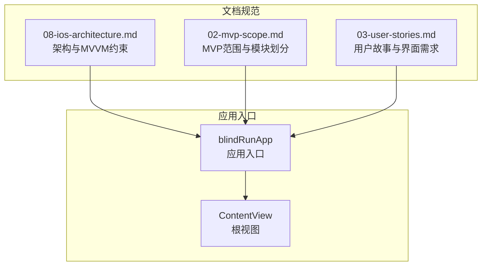
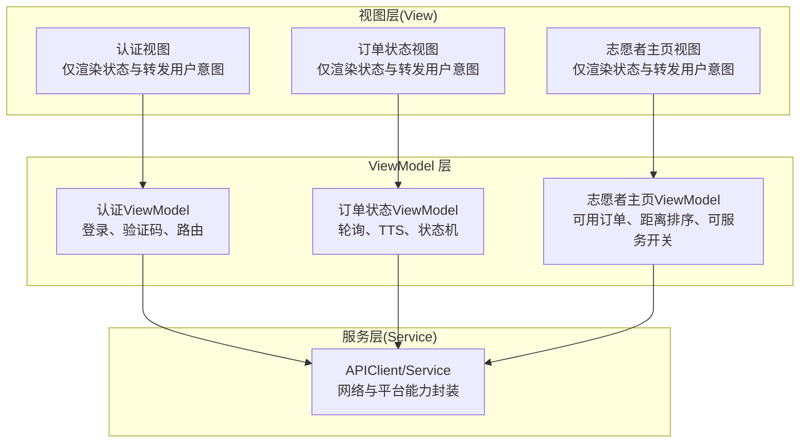
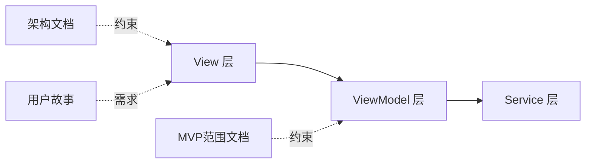

# View 层设计规范

<cite>
**本文引用的文件**
- [ContentView.swift](file://blindRun/ContentView.swift)
- [blindRunApp.swift](file://blindRun/blindRunApp.swift)
- [08-ios-architecture.md](file://docs/08-ios-architecture.md)
- [02-mvp-scope.md](file://docs/02-mvp-scope.md)
- [03-user-stories.md](file://docs/03-user-stories.md)
- [blindRunTests.swift](file://blindRunTests/blindRunTests.swift)
- [blindRunUITests.swift](file://blindRunUITests/blindRunUITests.swift)
</cite>

## 目录
1. [引言](#引言)
2. [项目结构](#项目结构)
3. [核心组件](#核心组件)
4. [架构总览](#架构总览)
5. [详细组件分析](#详细组件分析)
6. [依赖关系分析](#依赖关系分析)
7. [性能考虑](#性能考虑)
8. [故障排查指南](#故障排查指南)
9. [结论](#结论)
10. [附录](#附录)

## 引言
本规范旨在为 blindRun 项目的 SwiftUI View 层制定统一的设计原则与实践标准，确保视图层保持“薄而清晰”的职责边界：仅负责状态展示与用户意图转发，不包含业务逻辑。结合项目采用的 MVVM 架构，明确 View 与 ViewModel 的绑定方式与数据流，给出认证页面、订单状态页面、志愿者主页等核心界面的视图设计模式，并提供可操作的最佳实践与常见问题排查建议。

## 项目结构
blindRun 项目目前处于早期原型阶段，核心入口位于应用主文件与根视图文件中，整体采用 SwiftUI + MVVM 架构。项目文档明确了模块划分与各模块职责，为 View 层设计提供了上下文依据。

**图表来源**
- [blindRunApp.swift:10-17](file://blindRun/blindRunApp.swift#L10-L17)
- [ContentView.swift:10-20](file://blindRun/ContentView.swift#L10-L20)
- [08-ios-architecture.md:33-49](file://docs/08-ios-architecture.md#L33-L49)
- [02-mvp-scope.md:18-31](file://docs/02-mvp-scope.md#L18-L31)

**章节来源**
- [blindRunApp.swift:10-17](file://blindRun/blindRunApp.swift#L10-L17)
- [ContentView.swift:10-20](file://blindRun/ContentView.swift#L10-L20)
- [08-ios-architecture.md:33-49](file://docs/08-ios-architecture.md#L33-L49)
- [02-mvp-scope.md:18-31](file://docs/02-mvp-scope.md#L18-L31)

## 核心组件
- 视图层（View）：仅负责状态渲染与用户交互转发，不包含业务逻辑。
- ViewModel 层：持有加载状态、校验状态、API 调用、轮询与 TTS 触发等职责。
- Service 层：封装 API 与平台能力边界。
- DTO 与领域助手：DTO 映射 OpenAPI 结构，领域助手处理展示文本与状态转换。

上述职责划分来自项目架构文档，确保 View 层保持“薄”的特性，便于测试与维护。

**章节来源**
- [08-ios-architecture.md:33-49](file://docs/08-ios-architecture.md#L33-L49)

## 架构总览
下图展示了 SwiftUI 视图与 ViewModel 的典型交互关系，体现了 View 的职责边界与数据流向。

**图表来源**
- [08-ios-architecture.md:33-49](file://docs/08-ios-architecture.md#L33-L49)

## 详细组件分析

### 视图设计原则与职责边界
- 保持视图层简洁：只渲染状态、响应用户交互、转发用户意图给 ViewModel。
- 状态渲染策略：通过 ViewModel 的公开状态属性驱动 UI 更新，避免在 View 内部直接访问业务数据。
- 用户意图转发机制：将用户操作映射为 ViewModel 的方法调用，如登录、提交、轮询控制、状态变更等。
- 不包含业务逻辑：业务规则、状态机、网络请求、轮询调度、TTS 触发等均由 ViewModel 负责。

这些原则来自项目架构文档，是制定 View 层规范的基础。

**章节来源**
- [08-ios-architecture.md:35-39](file://docs/08-ios-architecture.md#L35-L39)

### 视图与 ViewModel 的绑定方式
- @State：用于 View 内部的局部状态，例如临时 UI 状态或本地输入值。
- @Binding：用于父子视图之间的双向数据绑定，常用于表单控件与输入框。
- @ObservableObject：用于 ViewModel 的生命周期绑定，确保 View 能响应 ViewModel 的状态变化。

以上绑定方式的选择应遵循职责边界：View 仅消费 ViewModel 的状态，不持有业务逻辑。

**章节来源**
- [08-ios-architecture.md:33-49](file://docs/08-ios-architecture.md#L33-L49)

### 认证页面视图设计模式
- 输入与校验：手机号输入、验证码输入、格式校验与错误提示。
- 用户意图转发：点击“获取验证码”、“登录”等按钮时，调用 ViewModel 的相应方法。
- 状态渲染：根据 ViewModel 的 loading、error、success 状态更新 UI。
- 无障碍：为输入框、按钮配置 accessibilityLabel 与 accessibilityHint。

参考用户故事中的登录与验证码流程，确保 View 仅负责渲染与转发，业务逻辑由 ViewModel 承担。

**章节来源**
- [03-user-stories.md:5-58](file://docs/03-user-stories.md#L5-L58)

### 订单状态页面视图设计模式
- 轮询控制：根据订单状态决定是否启动/停止轮询，避免不必要的网络请求。
- 状态渲染：根据 ViewModel 的订单状态、志愿者信息、TTS 标志更新 UI。
- 用户意图转发：确认开始服务、取消订单、紧急求助等操作转发给 ViewModel。
- 无障碍：关键状态文本与按钮均提供 VoiceOver 与 TTS 支持。

参考用户故事中的订单等待、服务中、完成与求助流程，确保 View 仅渲染状态与转发用户意图。

**章节来源**
- [03-user-stories.md:254-401](file://docs/03-user-stories.md#L254-L401)
- [08-ios-architecture.md:125-138](file://docs/08-ios-architecture.md#L125-L138)

### 志愿者主页视图设计模式
- 订单列表：按距离排序的订单卡片，支持下拉刷新。
- 可服务开关：控制是否接收新订单，状态由 ViewModel 管理。
- 用户意图转发：点击“接单”、“我已到达”、“结束服务”等操作转发给 ViewModel。
- 无障碍：按钮与列表项具备 VoiceOver 与 TTS 支持。

参考用户故事中的志愿者首页与订单列表流程，确保 View 仅渲染状态与转发用户意图。

**章节来源**
- [03-user-stories.md:428-593](file://docs/03-user-stories.md#L428-L593)

### 示例视图实现路径
以下为符合规范的视图实现参考路径（不直接展示代码内容）：
- 认证页面视图实现参考路径：[认证视图实现:5-58](file://docs/03-user-stories.md#L5-L58)
- 订单状态页面视图实现参考路径：[订单状态视图实现:254-401](file://docs/03-user-stories.md#L254-L401)
- 志愿者主页视图实现参考路径：[志愿者主页视图实现:428-593](file://docs/03-user-stories.md#L428-L593)

**章节来源**
- [03-user-stories.md:5-58](file://docs/03-user-stories.md#L5-L58)
- [03-user-stories.md:254-401](file://docs/03-user-stories.md#L254-L401)
- [03-user-stories.md:428-593](file://docs/03-user-stories.md#L428-L593)

## 依赖关系分析
- View 依赖 ViewModel 的公开状态与方法，不直接依赖 Service。
- ViewModel 依赖 Service 进行网络与平台能力调用，负责业务规则与状态机。
- 文档规范（架构、范围、用户故事）为 View 与 ViewModel 的职责划分提供约束与指导。

**图表来源**
- [08-ios-architecture.md:33-49](file://docs/08-ios-architecture.md#L33-L49)
- [02-mvp-scope.md:18-31](file://docs/02-mvp-scope.md#L18-L31)
- [03-user-stories.md:161-161](file://docs/03-user-stories.md#L161-L161)

**章节来源**
- [08-ios-architecture.md:33-49](file://docs/08-ios-architecture.md#L33-L49)
- [02-mvp-scope.md:18-31](file://docs/02-mvp-scope.md#L18-L31)
- [03-user-stories.md:161-161](file://docs/03-user-stories.md#L161-L161)

## 性能考虑
- 避免在 View 中进行昂贵计算或网络请求，将这些逻辑放入 ViewModel。
- 控制轮询频率与范围，仅在必要页面启用轮询，减少资源消耗。
- 使用惰性列表与条件渲染，避免不必要的视图重建。
- 将 UI 更新限定在主线程，确保响应流畅。

以上建议基于 MVVM 架构与项目文档中的轮询策略。

**章节来源**
- [08-ios-architecture.md:125-138](file://docs/08-ios-architecture.md#L125-L138)

## 故障排查指南
- UI 不更新：检查 ViewModel 是否正确发出状态变更通知，View 是否正确绑定到 ViewModel。
- 交互无响应：确认用户意图已转发到 ViewModel 方法，且 ViewModel 未处于禁用状态。
- 轮询异常：核对轮询启动/停止条件与页面生命周期，避免在页面消失后继续轮询。
- 无障碍问题：检查按钮与输入框的 accessibilityLabel 与 accessibilityHint 是否配置完整。

**章节来源**
- [08-ios-architecture.md:125-138](file://docs/08-ios-architecture.md#L125-L138)
- [03-user-stories.md:703-791](file://docs/03-user-stories.md#L703-L791)

## 结论
通过明确 View 层的职责边界与绑定方式，结合 MVVM 架构与项目文档的约束，可以确保视图层保持简洁、可测试与可维护。认证页面、订单状态页面与志愿者主页等核心界面应遵循“只渲染状态、只转发用户意图”的原则，将业务逻辑与状态管理交由 ViewModel 负责，从而提升整体系统的稳定性与可演进性。

## 附录
- 测试与 UI 测试：项目包含基础测试模板，建议为 ViewModel 编写单元测试，为关键页面编写 UI 测试，确保交互与状态渲染符合预期。

**章节来源**
- [blindRunTests.swift:21-36](file://blindRunTests/blindRunTests.swift#L21-L36)
- [blindRunUITests.swift:25-42](file://blindRunUITests/blindRunUITests.swift#L25-L42)