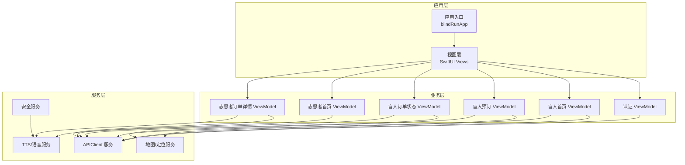
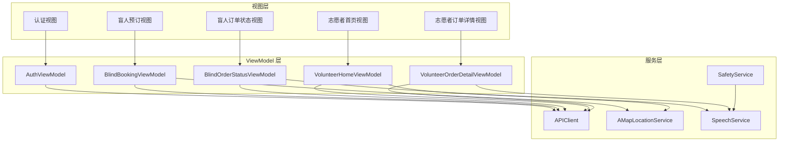
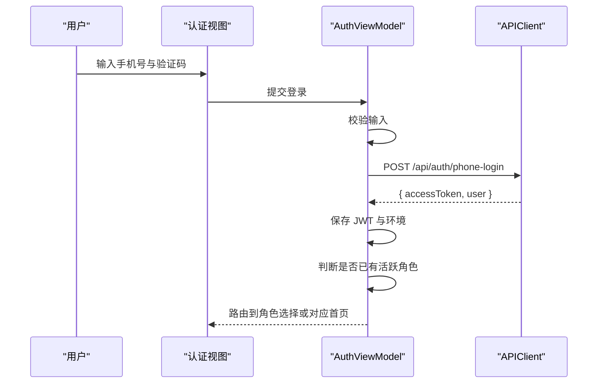
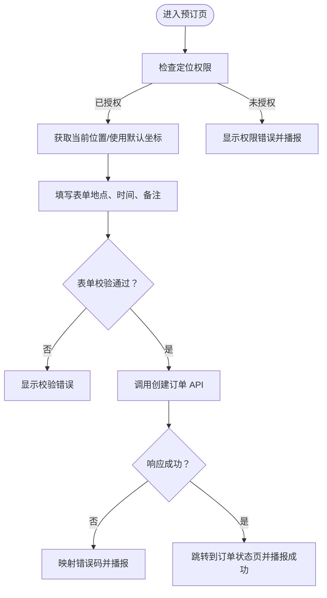
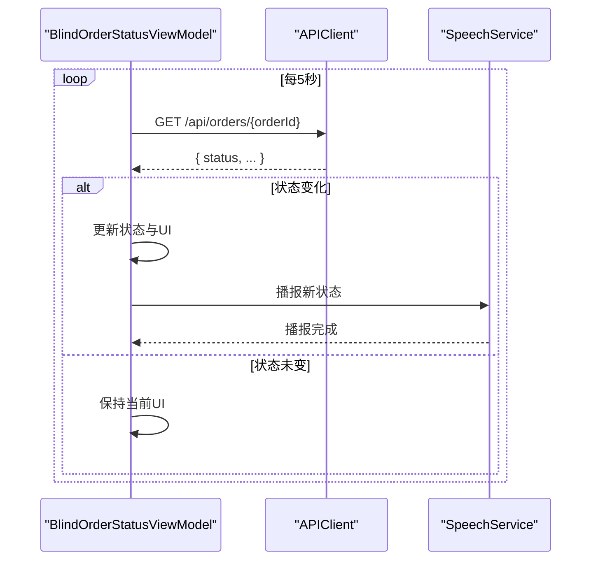
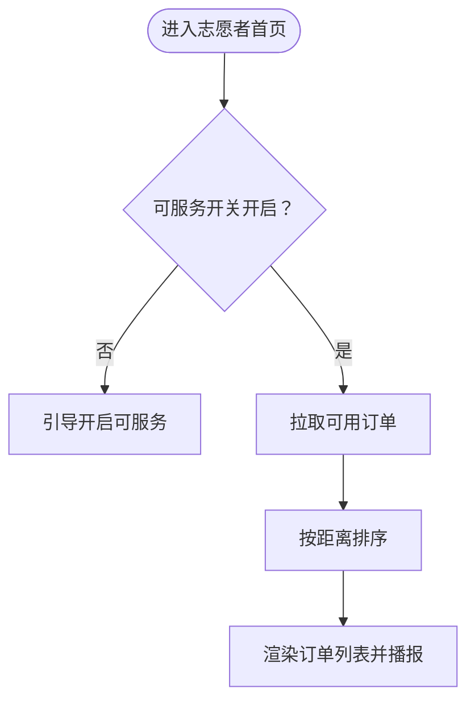
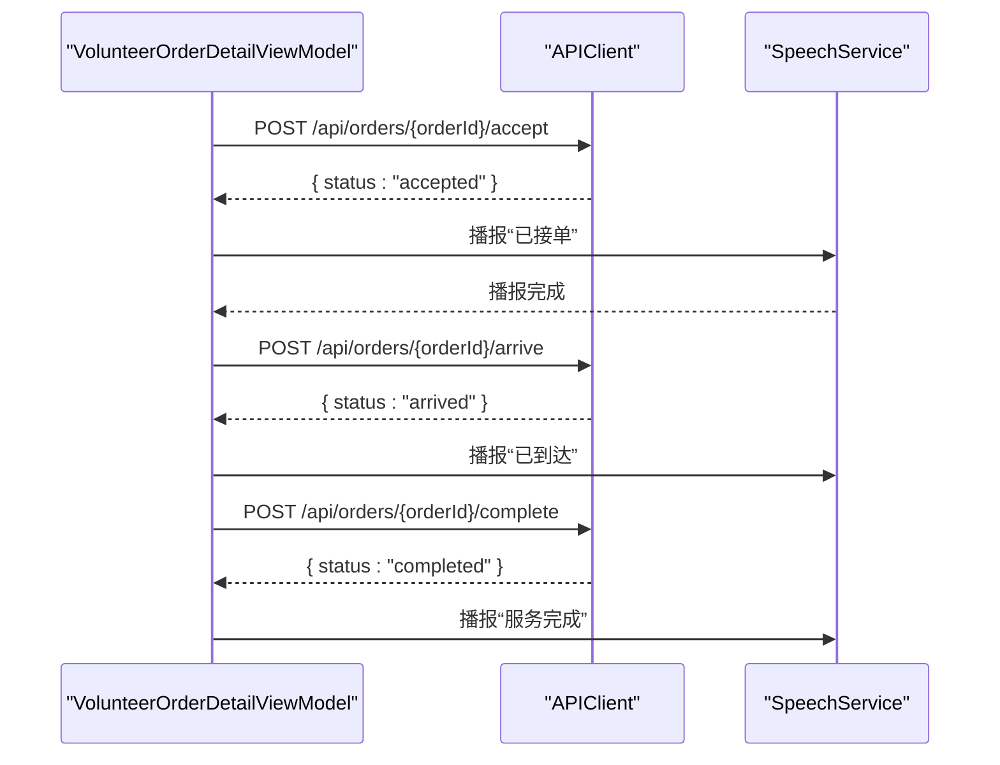
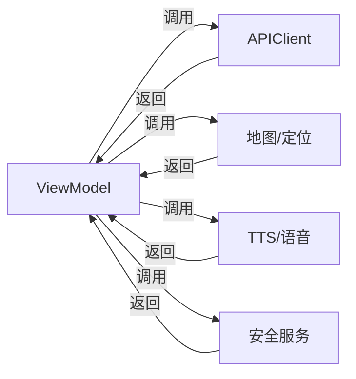

# ViewModel 层设计规范

<cite>
**本文档引用的文件**
- [08-ios-architecture.md](file://docs/08-ios-architecture.md)
- [04-user-flows-and-state-machine.md](file://docs/04-user-flows-and-state-machine.md)
- [02-mvp-scope.md](file://docs/02-mvp-scope.md)
- [01-product-requirements.md](file://docs/01-product-requirements.md)
- [design.md](file://openspec/changes/add-aidrun-ios-spring-mvp/design.md)
- [proposal.md](file://openspec/changes/add-aidrun-ios-spring-mvp/proposal.md)
- [tasks.md](file://openspec/changes/add-aidrun-ios-spring-mvp/tasks.md)
- [blindRunApp.swift](file://blindRun/blindRun/blindRunApp.swift)
- [ContentView.swift](file://blindRun/blindRun/ContentView.swift)
</cite>

## 目录
1. [引言](#引言)
2. [项目结构](#项目结构)
3. [核心组件](#核心组件)
4. [架构概览](#架构概览)
5. [详细组件分析](#详细组件分析)
6. [依赖关系分析](#依赖关系分析)
7. [性能考虑](#性能考虑)
8. [故障排查指南](#故障排查指南)
9. [结论](#结论)
10. [附录](#附录)

## 引言
本规范旨在为 blindRun 项目的 ViewModel 层制定统一的设计原则与实现标准，确保从 View 中抽取业务逻辑、保持 ViewModel 的可测试性与可维护性，并清晰界定 ViewModel 的职责边界。依据现有架构文档与产品需求，ViewModel 将承担状态管理、异步操作处理、数据验证、API 调用、轮询机制以及 TTS 触发等职责，同时与 Service 层协作，遵循 MVVM 模式。

## 项目结构
blindRun 项目采用 SwiftUI + MVVM 架构，核心模块划分如下：
- Core：应用环境、依赖容器、共享模型与应用状态
- Auth：手机号登录、JWT 持久化、认证会话
- Role：活跃角色切换与角色守卫规则
- BlindRunner：盲人跑者首页、资料、预订、订单状态
- Volunteer：志愿者首页、可用订单、服务记录、积分
- Orders：订单 DTO、订单状态机辅助、轮询
- Map：高德地图桥接、当前位置、标记、距离计算
- Voice：TTS、重复当前状态、语音输入辅助
- Safety：紧急确认与取消确认流程
- Profile：盲人与志愿者资料表单

**图表来源**
- [08-ios-architecture.md:18-31](file://docs/08-ios-architecture.md#L18-L31)
- [08-ios-architecture.md:33-49](file://docs/08-ios-architecture.md#L33-L49)

**章节来源**
- [08-ios-architecture.md:18-31](file://docs/08-ios-architecture.md#L18-L31)
- [08-ios-architecture.md:33-49](file://docs/08-ios-architecture.md#L33-L49)

## 核心组件
- ViewModel 职责边界
  - 状态管理：维护加载状态、验证状态、UI 状态（如按钮可用性、提示文案）
  - 异步操作：封装 API 调用、轮询控制、错误处理与回退策略
  - 数据验证：表单校验、输入合法性检查、错误提示
  - API 调用：通过统一的 APIClient 协议与后端交互，映射错误码为用户可理解的消息
  - 轮询机制：在订单相关页面按 5 秒间隔轮询订单详情，状态变化时触发 TTS
  - TTS 触发：在关键节点播报状态变化与操作反馈
- 设计原则
  - 视图薄化：View 仅负责渲染状态与转发用户意图
  - ViewModel 独立：ViewModel 不直接持有 View 实例，通过绑定暴露状态
  - 可测试性：通过协议抽象外部依赖（如 APIClient、地图、语音），便于注入假实现
  - 可维护性：职责单一、状态集中、错误处理统一、命名规范一致

**章节来源**
- [08-ios-architecture.md:35-49](file://docs/08-ios-architecture.md#L35-L49)
- [04-user-flows-and-state-machine.md:275-299](file://docs/04-user-flows-and-state-machine.md#L275-L299)

## 架构概览
ViewModel 与各层交互关系如下：

**图表来源**
- [08-ios-architecture.md:33-49](file://docs/08-ios-architecture.md#L33-L49)
- [04-user-flows-and-state-machine.md:275-299](file://docs/04-user-flows-and-state-machine.md#L275-L299)

## 详细组件分析

### 认证 ViewModel（AuthViewModel）
- 职责
  - 手机号与验证码登录（合并注册）
  - JWT 令牌持久化与恢复
  - 登录成功后的角色选择与路由
- 状态管理
  - 输入状态：手机号、验证码
  - 加载状态：登录中、跳转中
  - 错误状态：验证码错误、网络错误、用户不存在等
- 异步操作
  - 调用 APIClient 执行登录
  - 成功后保存 JWT 与当前环境
  - 根据是否已有活跃角色决定路由
- 数据验证
  - 校验手机号格式与验证码长度
- 错误处理
  - 将后端错误码映射为用户可理解消息与 TTS 提示
- TTS 触发
  - 登录成功后播报欢迎语与下一步指引

**图表来源**
- [08-ios-architecture.md:68-82](file://docs/08-ios-architecture.md#L68-L82)
- [04-user-flows-and-state-machine.md:120-178](file://docs/04-user-flows-and-state-machine.md#L120-L178)

**章节来源**
- [08-ios-architecture.md:44](file://docs/08-ios-architecture.md#L44)
- [04-user-flows-and-state-machine.md:120-178](file://docs/04-user-flows-and-state-machine.md#L120-L178)

### 盲人跑者预订 ViewModel（BlindBookingViewModel）
- 职责
  - 位置权限检查与默认起始坐标
  - 预订表单验证（出发地点、预约时间等必填项）
  - 创建订单 API 调用
- 状态管理
  - 表单字段状态、校验错误集合
  - 加载状态：提交中、成功、失败
- 异步操作
  - 获取当前位置（失败时使用默认坐标）
  - 调用 APIClient 创建订单
- 数据验证
  - 时间在未来、地点必填、备注可选
- 错误处理
  - 位置权限拒绝、网络错误、后端校验失败
- TTS 触发
  - 提交成功播报“订单提交成功，等待志愿者接单”

**图表来源**
- [08-ios-architecture.md:45](file://docs/08-ios-architecture.md#L45)
- [04-user-flows-and-state-machine.md:120-178](file://docs/04-user-flows-and-state-machine.md#L120-L178)

**章节来源**
- [08-ios-architecture.md:45](file://docs/08-ios-architecture.md#L45)
- [02-mvp-scope.md:27-40](file://docs/02-mvp-scope.md#L27-L40)

### 盲人订单状态 ViewModel（BlindOrderStatusViewModel）
- 职责
  - 每 5 秒轮询订单详情
  - 状态变化时触发 TTS 与 UI 更新
  - 提供取消订单、确认开始服务、紧急求助等操作
- 状态管理
  - 订单状态、轮询计时器、按钮可用性
- 异步操作
  - 定时器轮询 API 获取最新状态
  - 根据状态变化更新 UI 与播报
- 错误处理
  - 轮询失败、网络中断、用户登出时停止轮询
- TTS 触发
  - 状态变化时播报新状态（如“志愿者已接单”、“志愿者已到达”、“服务已开始”）

**图表来源**
- [08-ios-architecture.md:46](file://docs/08-ios-architecture.md#L46)
- [04-user-flows-and-state-machine.md:275-299](file://docs/04-user-flows-and-state-machine.md#L275-L299)

**章节来源**
- [08-ios-architecture.md:46](file://docs/08-ios-architecture.md#L46)
- [04-user-flows-and-state-machine.md:275-299](file://docs/04-user-flows-and-state-machine.md#L275-L299)

### 志愿者首页 ViewModel（VolunteerHomeViewModel）
- 职责
  - 可服务开关与当前定位
  - 拉取可用订单并按距离排序
- 状态管理
  - 可服务状态、订单列表、加载状态
- 异步操作
  - 拉取可用订单列表
  - iOS 端基于当前坐标与订单起点计算距离并排序
- 错误处理
  - 定位权限拒绝、网络错误、无可用订单
- TTS 触发
  - 订单列表播报与距离提示

**图表来源**
- [08-ios-architecture.md:47](file://docs/08-ios-architecture.md#L47)
- [02-mvp-scope.md:40-53](file://docs/02-mvp-scope.md#L40-L53)

**章节来源**
- [08-ios-architecture.md:47](file://docs/08-ios-architecture.md#L47)
- [02-mvp-scope.md:40-53](file://docs/02-mvp-scope.md#L40-L53)

### 志愿者订单详情 ViewModel（VolunteerOrderDetailViewModel）
- 职责
  - 订单详情展示与操作：接单、到达、完成、取消、紧急求助
- 状态管理
  - 订单详情、按钮可用性、确认对话框状态
- 异步操作
  - 调用 APIClient 执行状态变更操作
- 错误处理
  - 乐观锁保护导致的“已被接单”等错误
- TTS 触发
  - 操作成功与状态变化播报

**图表来源**
- [08-ios-architecture.md:48](file://docs/08-ios-architecture.md#L48)
- [04-user-flows-and-state-machine.md:180-228](file://docs/04-user-flows-and-state-machine.md#L180-L228)

**章节来源**
- [08-ios-architecture.md:48](file://docs/08-ios-architecture.md#L48)
- [04-user-flows-and-state-machine.md:180-228](file://docs/04-user-flows-and-state-machine.md#L180-L228)

## 依赖关系分析
- ViewModel 与 Service 层交互模式
  - APIClient 协议：统一请求构建、鉴权头、响应解码与错误映射
  - 地图/定位服务：高德地图桥接与距离计算
  - 语音服务：TTS 与语音输入
  - 安全服务：紧急求助与危险操作确认
- 状态属性命名规范
  - 布尔状态：isLoading、isSuccess、hasError、isEnabled、isVisible
  - 字符串状态：errorMessage、statusText、ttsMessage
  - 集合状态：items、errors、ttsQueue
  - 计时器：pollingTimer、debounceTimer
- 异步操作错误处理策略
  - 失败重试：简单重试（MVP 不引入复杂离线队列）
  - 用户可理解提示：将后端错误码映射为本地化消息与 TTS
  - 资源释放：视图消失或用户登出时停止轮询与清理定时器

**图表来源**
- [08-ios-architecture.md:68-82](file://docs/08-ios-architecture.md#L68-L82)

**章节来源**
- [08-ios-architecture.md:68-82](file://docs/08-ios-architecture.md#L68-L82)
- [08-ios-architecture.md:125-139](file://docs/08-ios-architecture.md#L125-L139)

## 性能考虑
- 轮询频率与资源消耗
  - 5 秒轮询满足 MVP 实时性要求，避免 WebSocket 复杂度
  - 在页面消失、用户登出或订单进入终态时及时停止轮询
- 网络与缓存
  - 使用 URLSession + async/await，减少第三方依赖
  - 错误映射与 TTS 提示降低用户困惑，提升感知性能
- 地图与定位
  - iOS 端距离计算避免后端地理复杂度，但需注意定位权限与坐标精度

**章节来源**
- [08-ios-architecture.md:125-139](file://docs/08-ios-architecture.md#L125-L139)
- [02-mvp-scope.md:54-63](file://docs/02-mvp-scope.md#L54-L63)

## 故障排查指南
- 登录问题
  - 验证码固定为 123456（MVP），无效验证码返回特定错误码
  - 首次登录可能无活跃角色，需先完成角色选择
- 定位权限
  - 盲人无法创建预约；志愿者无法查看/接单
  - 提示用户开启定位权限并使用 TTS 说明
- 轮询异常
  - 网络中断或订单状态不变时保持 UI
  - 页面离开或用户登出时停止轮询
- 紧急求助
  - 任一方在 accepted/arrived/in_progress 状态可触发，需二次确认
  - 状态进入 emergency 后保持终态，双方持续轮询更新

**章节来源**
- [01-product-requirements.md:96-115](file://docs/01-product-requirements.md#L96-L115)
- [04-user-flows-and-state-machine.md:230-257](file://docs/04-user-flows-and-state-machine.md#L230-L257)
- [04-user-flows-and-state-machine.md:301-309](file://docs/04-user-flows-and-state-machine.md#L301-L309)

## 结论
通过明确 ViewModel 的职责边界与交互模式，结合统一的状态命名规范与错误处理策略，blindRun 的 ViewModel 层能够在保持可测试性与可维护性的同时，高效支撑认证、预订、订单状态、志愿者接单等核心业务流程，并与 Service 层协同实现 TTS 语音播报与轮询机制，最终达成无障碍优先的用户体验目标。

## 附录
- 代码示例路径参考
  - 认证 ViewModel：[08-ios-architecture.md:44](file://docs/08-ios-architecture.md#L44)
  - 盲人预订 ViewModel：[08-ios-architecture.md:45](file://docs/08-ios-architecture.md#L45)
  - 盲人订单状态 ViewModel：[08-ios-architecture.md:46](file://docs/08-ios-architecture.md#L46)
  - 志愿者首页 ViewModel：[08-ios-architecture.md:47](file://docs/08-ios-architecture.md#L47)
  - 志愿者订单详情 ViewModel：[08-ios-architecture.md:48](file://docs/08-ios-architecture.md#L48)
- 任务与范围参考
  - iOS 任务清单：[tasks.md:28-53](file://openspec/changes/add-aidrun-ios-spring-mvp/tasks.md#L28-L53)
  - MVP 范围与优先级：[02-mvp-scope.md:14-93](file://docs/02-mvp-scope.md#L14-L93)