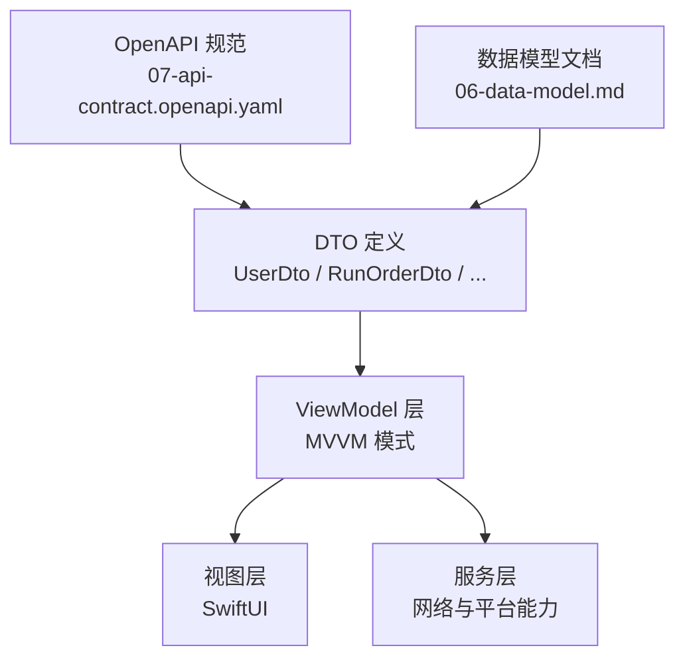
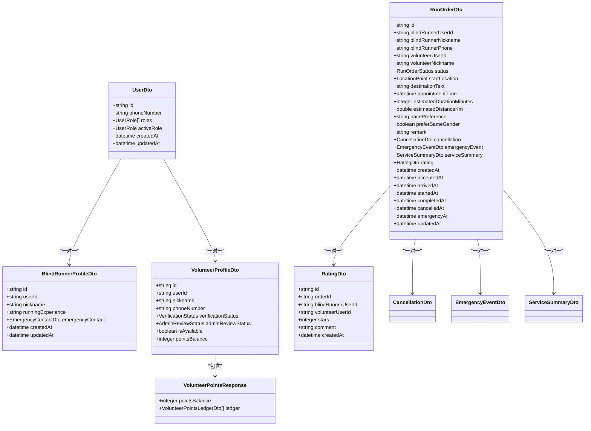
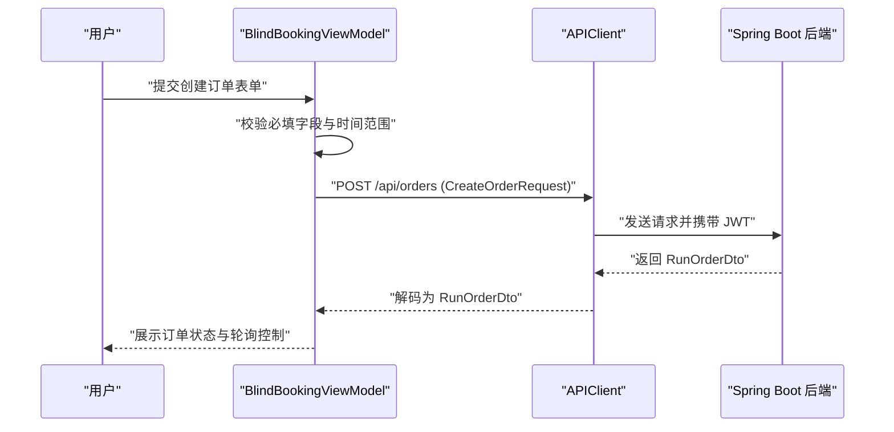
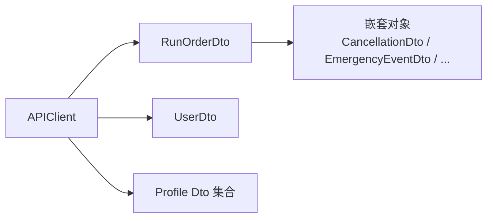

# 数据模型设计规范

<cite>
**本文引用的文件**
- [07-api-contract.openapi.yaml](file://docs/07-api-contract.openapi.yaml)
- [06-data-model.md](file://docs/06-data-model.md)
- [08-ios-architecture.md](file://docs/08-ios-architecture.md)
- [blindRunTests.swift](file://blindRunTests/blindRunTests.swift)
- [blindRunUITests.swift](file://blindRunUITests/blindRunUITests.swift)
</cite>

## 目录
1. [简介](#简介)
2. [项目结构](#项目结构)
3. [核心组件](#核心组件)
4. [架构总览](#架构总览)
5. [详细组件分析](#详细组件分析)
6. [依赖分析](#依赖分析)
7. [性能考量](#性能考量)
8. [故障排查指南](#故障排查指南)
9. [结论](#结论)
10. [附录](#附录)

## 简介
本规范面向 blindRun iOS 项目，基于 OpenAPI 规范与数据模型文档，制定数据传输对象（DTO）的设计原则与实现规范。内容涵盖：
- DTO 与 OpenAPI 的映射关系
- 字段命名与数据验证规则
- 领域模型与 DTO 的转换机制（显示文本处理、状态转换辅助）
- 关键 DTO 的实现路径与示例
- 版本管理策略、向后兼容性与复杂嵌套结构/枚举类型的处理

## 项目结构
- 数据契约与模型定义集中在 OpenAPI 规范文件中，涵盖用户、资料、志愿者、订单、评分、积分等核心实体及状态枚举。
- 数据模型文档对实体关系、字段约束、业务规则进行细化，是 DTO 设计与转换的权威依据。
- iOS 架构文档明确了 MVVM 模式下 DTO 的职责边界与转换位置。

图表来源
- [07-api-contract.openapi.yaml:543-1117](file://docs/07-api-contract.openapi.yaml#L543-L1117)
- [06-data-model.md:1-307](file://docs/06-data-model.md#L1-L307)
- [08-ios-architecture.md:33-41](file://docs/08-ios-architecture.md#L33-L41)

章节来源
- [07-api-contract.openapi.yaml:1-1117](file://docs/07-api-contract.openapi.yaml#L1-L1117)
- [06-data-model.md:1-307](file://docs/06-data-model.md#L1-L307)
- [08-ios-architecture.md:1-165](file://docs/08-ios-architecture.md#L1-L165)

## 核心组件
- DTO 与 OpenAPI 映射
  - DTO 名称与 OpenAPI 组件名称一一对应，如 UserDto、RunOrderDto、BlindRunnerProfileDto、VolunteerProfileDto、RatingDto、VolunteerPointsResponse 等。
  - 字段类型、是否必填、格式（如日期时间、UUID、枚举）、示例值均直接来源于 OpenAPI 规范。
- 字段命名规范
  - 使用驼峰命名法（camelCase），与 OpenAPI 的属性命名保持一致。
  - 可空字段显式标注 nullable，避免歧义。
- 数据验证规则
  - 必填字段在请求体中必须提供；响应体中可空字段允许为 null。
  - 数值范围与枚举取值严格遵循 OpenAPI 中的约束（如评分范围 1-5）。
- 领域模型与 DTO 的转换
  - ViewModel 层负责将 DTO 转换为更适合 UI 展示的领域模型，或提供显示文本与状态转换辅助方法。
  - 示例：将枚举值映射为本地化的显示文本；根据订单状态生成下一步操作提示。

章节来源
- [07-api-contract.openapi.yaml:634-1117](file://docs/07-api-contract.openapi.yaml#L634-L1117)
- [06-data-model.md:5-307](file://docs/06-data-model.md#L5-L307)
- [08-ios-architecture.md:33-41](file://docs/08-ios-architecture.md#L33-L41)

## 架构总览
以下类图展示了关键 DTO 的结构关系与依赖：

图表来源
- [07-api-contract.openapi.yaml:634-1117](file://docs/07-api-contract.openapi.yaml#L634-L1117)
- [06-data-model.md:80-307](file://docs/06-data-model.md#L80-L307)

## 详细组件分析

### RunOrderDto
- 设计要点
  - 包含盲人与志愿者的冗余展示字段，便于 UI 直接渲染。
  - 时间戳字段覆盖从创建到各阶段状态变更的时间点。
  - 支持嵌套的取消、紧急事件、服务摘要、评分等子对象。
- OpenAPI 对应
  - 结构与字段定义见 [RunOrderDto:811-914](file://docs/07-api-contract.openapi.yaml#L811-L914)。
- 转换与显示
  - ViewModel 可将 RunOrderStatus 映射为本地化文案与下一步操作提示。
  - 将时间戳格式化为本地时区字符串，配合轮询刷新。

章节来源
- [07-api-contract.openapi.yaml:811-914](file://docs/07-api-contract.openapi.yaml#L811-L914)
- [06-data-model.md:167-201](file://docs/06-data-model.md#L167-L201)

### UserDto
- 设计要点
  - 角色集合与当前激活角色字段支持双角色切换。
  - 日期时间字段采用 ISO 8601 格式。
- OpenAPI 对应
  - 结构与字段定义见 [UserDto:634-656](file://docs/07-api-contract.openapi.yaml#L634-L656)。
- 转换与显示
  - ViewModel 将 UserRole 映射为本地化显示文本，用于角色切换 UI。

章节来源
- [07-api-contract.openapi.yaml:634-656](file://docs/07-api-contract.openapi.yaml#L634-L656)
- [06-data-model.md:82-98](file://docs/06-data-model.md#L82-L98)

### BlindRunnerProfileDto
- 设计要点
  - 包含紧急联系人对象，确保关键安全信息可用。
  - 可空字段允许在未完善资料时为空。
- OpenAPI 对应
  - 结构与字段定义见 [BlindRunnerProfileDto:700-722](file://docs/07-api-contract.openapi.yaml#L700-L722)。
- 转换与显示
  - ViewModel 可将紧急联系人信息格式化为可读文本，供语音播报与 UI 展示。

章节来源
- [07-api-contract.openapi.yaml:700-722](file://docs/07-api-contract.openapi.yaml#L700-L722)
- [06-data-model.md:99-131](file://docs/06-data-model.md#L99-L131)

### VolunteerProfileDto
- 设计要点
  - 包含认证状态、管理员审核状态、可服务开关与积分余额。
  - 与 UserDto 一对一关联，便于统一登录会话。
- OpenAPI 对应
  - 结构与字段定义见 [VolunteerProfileDto:731-762](file://docs/07-api-contract.openapi.yaml#L731-L762)。
- 转换与显示
  - ViewModel 将 VerificationStatus/AdminReviewStatus 映射为本地化文案，用于状态指示与提示。

章节来源
- [07-api-contract.openapi.yaml:731-762](file://docs/07-api-contract.openapi.yaml#L731-L762)
- [06-data-model.md:132-152](file://docs/06-data-model.md#L132-L152)

### RatingDto 与 VolunteerPointsResponse
- 设计要点
  - 评分范围限制在 1-5，支持可选评论。
  - 积分响应包含余额与流水明细，便于志愿者查看服务记录。
- OpenAPI 对应
  - 结构与字段定义见 [RatingDto:1023-1048](file://docs/07-api-contract.openapi.yaml#L1023-L1048)、[VolunteerPointsResponse:1089-1099](file://docs/07-api-contract.openapi.yaml#L1089-L1099)。
- 转换与显示
  - ViewModel 将评分星数映射为可视化 UI，并将积分流水转换为本地化描述。

章节来源
- [07-api-contract.openapi.yaml:1023-1099](file://docs/07-api-contract.openapi.yaml#L1023-L1099)
- [06-data-model.md:250-281](file://docs/06-data-model.md#L250-L281)

### API 流程示例：创建订单

图表来源
- [07-api-contract.openapi.yaml:150-174](file://docs/07-api-contract.openapi.yaml#L150-L174)
- [08-ios-architecture.md:68-83](file://docs/08-ios-architecture.md#L68-L83)

## 依赖分析
- 组件耦合
  - DTO 之间通过嵌套对象形成弱耦合，降低跨模块依赖。
  - 枚举类型集中于 OpenAPI 规范，确保前后端一致性。
- 外部依赖
  - iOS 端通过 URLSession 与后端交互，统一在 APIClient 中处理鉴权与错误映射。
- 潜在循环依赖
  - DTO 间为单向嵌套引用，无循环依赖风险。

图表来源
- [07-api-contract.openapi.yaml:543-1117](file://docs/07-api-contract.openapi.yaml#L543-L1117)
- [08-ios-architecture.md:68-83](file://docs/08-ios-architecture.md#L68-L83)

章节来源
- [07-api-contract.openapi.yaml:543-1117](file://docs/07-api-contract.openapi.yaml#L543-L1117)
- [08-ios-architecture.md:68-83](file://docs/08-ios-architecture.md#L68-L83)

## 性能考量
- DTO 解析
  - 使用结构化编码/解码（JSONSerialization 或 Codable）时，优先选择零拷贝与流式解析策略，减少内存峰值。
- 轮询与缓存
  - 订单状态轮询间隔与停止条件需结合业务状态机，避免不必要的网络请求。
- 显示文本与本地化
  - 将枚举到文案的映射缓存至 ViewModel，减少重复计算。

## 故障排查指南
- 常见错误码与映射
  - 后端返回的错误码与前端提示需保持一致，参考 OpenAPI 中的错误响应定义。
  - 示例：验证码错误、资料不完整、定位权限缺失、订单不存在、状态不允许等。
- 日志与回退
  - 在 APIClient 中记录请求与响应摘要，便于定位问题。
  - 在 Mock 环境下使用本地数据回退，保证 UI 流程可演示。

章节来源
- [07-api-contract.openapi.yaml:469-542](file://docs/07-api-contract.openapi.yaml#L469-L542)
- [08-ios-architecture.md:68-83](file://docs/08-ios-architecture.md#L68-L83)

## 结论
本规范以 OpenAPI 与数据模型文档为依据，明确了 DTO 的命名、验证与转换原则，并给出了关键模型的实现路径与流程图示。建议在 iOS 端通过 ViewModel 层完成 DTO 到领域模型的转换，确保 UI 层专注于展示与交互，同时保持与后端契约的一致性与可演进性。

## 附录
- 版本管理与向后兼容
  - 版本号遵循语义化版本（MAJOR.MINOR.PATCH），PATCH 变更仅限非破坏性修复；MINOR 变更允许新增可选字段；MAJOR 变更需评估迁移成本。
  - 新增字段应保持可空或提供默认值，避免影响现有客户端。
- 复杂嵌套与枚举处理
  - 嵌套对象采用可选链访问，防止空指针异常。
  - 枚举值统一通过 ViewModel 映射为本地化文案，避免在 UI 层分散处理。
- 测试与回归
  - 单元测试覆盖 DTO 的序列化/反序列化与边界值。
  - UI 测试覆盖关键流程（创建订单、接单、完成服务等）。

章节来源
- [07-api-contract.openapi.yaml:1-1117](file://docs/07-api-contract.openapi.yaml#L1-L1117)
- [06-data-model.md:1-307](file://docs/06-data-model.md#L1-L307)
- [blindRunTests.swift:1-39](file://blindRunTests/blindRunTests.swift#L1-L39)
- [blindRunUITests.swift:1-44](file://blindRunUITests/blindRunUITests.swift#L1-L44)