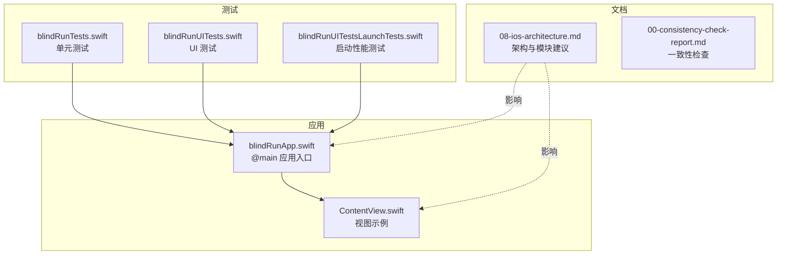
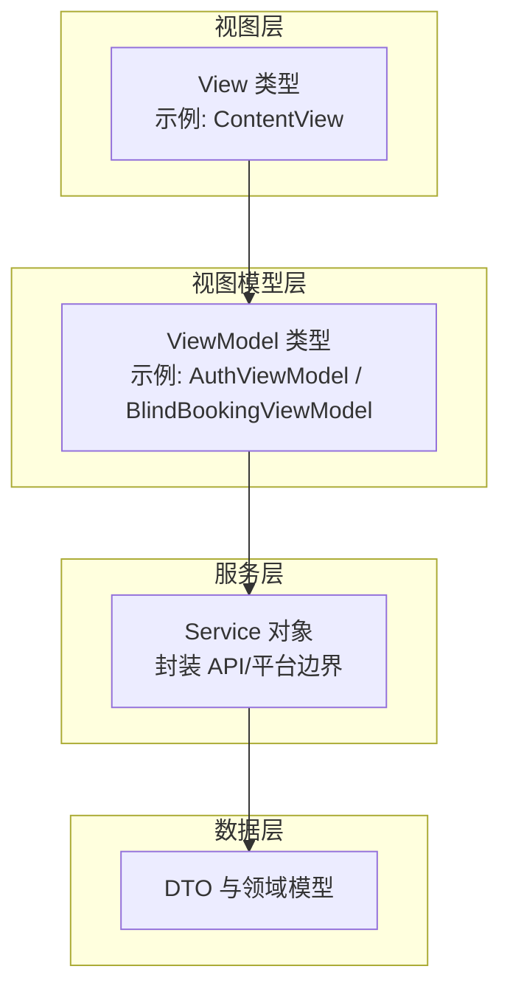
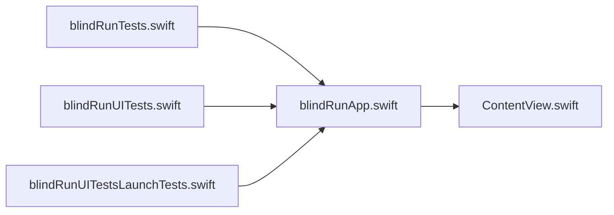

# Swift 编码风格

<cite>
**本文引用的文件**
- [blindRunApp.swift](file://blindRun/blindRun/blindRunApp.swift)
- [ContentView.swift](file://blindRun/blindRun/ContentView.swift)
- [blindRunTests.swift](file://blindRun/blindRunTests/blindRunTests.swift)
- [blindRunUITests.swift](file://blindRun/blindRunUITests/blindRunUITests.swift)
- [blindRunUITestsLaunchTests.swift](file://blindRun/blindRunUITests/blindRunUITestsLaunchTests.swift)
- [08-ios-architecture.md](file://docs/08-ios-architecture.md)
- [00-consistency-check-report.md](file://docs/00-consistency-check-report.md)
- [.gitignore](file://.gitignore)
- [config.yaml](file://openspec/config.yaml)
</cite>

## 目录
1. 引言
2. 项目结构
3. 核心组件
4. 架构总览
5. 详细组件分析
6. 依赖关系分析
7. 性能考虑
8. 故障排查指南
9. 结论
10. 附录

## 引言
本文件为 blindRun 项目的 Swift 编码风格规范，目标是统一团队在命名、格式化、注释、组织与语言特性使用方面的实践，提升一致性与可读性。规范基于现有代码与架构文档提炼，并结合 iOS/SwiftUI 最佳实践制定。

## 项目结构
blindRun 采用 SwiftUI 应用结构，核心入口为应用类型与视图类型，测试分为单元测试与 UI 测试，文档明确了模块划分与 MVVM 架构约束。下图给出当前代码层面的结构映射：

图表来源
- [blindRunApp.swift:10-17](file://blindRun/blindRun/blindRunApp.swift#L10-L17)
- [ContentView.swift:10-20](file://blindRun/blindRun/ContentView.swift#L10-L20)
- [blindRunTests.swift:11-38](file://blindRun/blindRunTests/blindRunTests.swift#L11-L38)
- [blindRunUITests.swift:10-43](file://blindRun/blindRunUITests/blindRunUITests.swift#L10-L43)
- [blindRunUITestsLaunchTests.swift:10-35](file://blindRun/blindRunUITests/blindRunUITestsLaunchTests.swift#L10-L35)
- [08-ios-architecture.md:18-32](file://docs/08-ios-architecture.md#L18-L32)

章节来源
- [blindRunApp.swift:10-17](file://blindRun/blindRun/blindRunApp.swift#L10-L17)
- [ContentView.swift:10-20](file://blindRun/blindRun/ContentView.swift#L10-L20)
- [08-ios-architecture.md:18-32](file://docs/08-ios-architecture.md#L18-L32)

## 核心组件
- 应用入口：遵循 @main 标记的应用类型，负责场景与窗口组装配。
- 视图：遵循 SwiftUI 的 View 协议，使用属性视图体与修饰符链式调用。
- 测试：单元测试与 UI 测试分别覆盖功能与启动性能，使用 @testable 导入被测模块。

章节来源
- [blindRunApp.swift:10-17](file://blindRun/blindRun/blindRunApp.swift#L10-L17)
- [ContentView.swift:10-20](file://blindRun/blindRun/ContentView.swift#L10-L20)
- [blindRunTests.swift:11-38](file://blindRun/blindRunTests/blindRunTests.swift#L11-L38)
- [blindRunUITests.swift:10-43](file://blindRun/blindRunUITests/blindRunUITests.swift#L10-L43)
- [blindRunUITestsLaunchTests.swift:10-35](file://blindRun/blindRunUITests/blindRunUITestsLaunchTests.swift#L10-L35)

## 架构总览
根据架构文档，应用采用 SwiftUI + MVVM，建议按领域拆分模块，视图保持薄层，状态与业务逻辑分离至 ViewModel 与 Service。该风格规范将与该架构约束协同执行。

图表来源
- [08-ios-architecture.md:33-49](file://docs/08-ios-architecture.md#L33-L49)

章节来源
- [08-ios-architecture.md:33-49](file://docs/08-ios-architecture.md#L33-L49)

## 详细组件分析

### 命名约定
- 类型与协议：采用 UpperCamelCase，如 App、View、ViewModel、Service、DTO。
- 实例与属性：采用 lowerCamelCase，如 body、viewModel、accessToken。
- 常量与枚举：采用 UpperCamelCase，枚举成员遵循同一风格。
- 文件名：与主要公开类型同名，如 blindRunApp.swift、ContentView.swift。
- 命名清晰度：避免缩写，必要时使用行业通用缩写（如 ID、URL）。

章节来源
- [blindRunApp.swift:10-17](file://blindRun/blindRun/blindRunApp.swift#L10-L17)
- [ContentView.swift:10-20](file://blindRun/blindRun/ContentView.swift#L10-L20)
- [08-ios-architecture.md:33-49](file://docs/08-ios-architecture.md#L33-L49)

### 代码格式化标准
- 缩进：统一使用 4 个空格，不使用 Tab。
- 空行：类型与类型之间保留一行空行；方法之间保留一行空行；逻辑分组内部可适当留空行。
- 换行：单行超过 120 字符时换行；链式调用与参数分行时保持对齐。
- 分号：不使用分号。
- 空格：操作符两侧、逗号后空一格；括号内不冗余空格。
- 属性视图体：在大括号前空一格，body 内容缩进一层。

章节来源
- [ContentView.swift:10-20](file://blindRun/blindRun/ContentView.swift#L10-L20)
- [blindRunTests.swift:13-19](file://blindRun/blindRunTests/blindRunTests.swift#L13-L19)

### 注释规范
- 文件头注释：包含文件用途、所属项目、创建时间与作者，与现有模板一致。
- 文档注释：对公共 API、类型、方法进行简明描述，说明输入输出与副作用。
- 行内注释：仅在复杂逻辑处说明动机与边界条件，避免显而易见的注释。
- TODO 注释：使用 TODO 标记待办事项，附带简要说明与负责人或 Issue 链接。

章节来源
- [blindRunApp.swift:1-7](file://blindRun/blindRun/blindRunApp.swift#L1-L7)
- [blindRunTests.swift:21-29](file://blindRun/blindRunTests/blindRunTests.swift#L21-L29)

### 代码组织原则
- import 顺序：系统框架在前（如 SwiftUI、Foundation），第三方在后；同一组内字母序排列。
- 文件结构：每个功能域一个目录，类型与实现文件一一对应；测试文件与被测模块一一对应。
- 模块划分：遵循架构文档建议的模块布局，保持跨模块依赖清晰。

章节来源
- [blindRunApp.swift:8](file://blindRun/blindRun/blindRunApp.swift#L8)
- [ContentView.swift:8](file://blindRun/blindRun/ContentView.swift#L8)
- [08-ios-architecture.md:18-32](file://docs/08-ios-architecture.md#L18-L32)

### Swift 语言特性正确使用方式
- 可选链与空合并：优先使用可选链安全访问，必要时提供合理默认值；避免强制展开。
- guard 语句：尽早失败，减少嵌套；在 guard 条件不满足时立即返回或抛错。
- defer 关键字：用于配对资源释放或清理工作，保证无论路径如何都能执行。
- do/catch：对可能抛错的异步或 I/O 操作使用，记录上下文信息以便调试。
- 属性观察器：在需要响应状态变化时使用 willSet/didSet，避免过度使用。
- 访问控制：默认使用 internal；仅在需要对外暴露时使用 public/open，谨慎使用 private/internal。

章节来源
- [08-ios-architecture.md:70-82](file://docs/08-ios-architecture.md#L70-L82)

### 具体示例（以路径代替代码）
- 正确示例：在视图中使用链式修饰符，保持缩进与空行清晰，参见 [ContentView.swift:10-20](file://blindRun/blindRun/ContentView.swift#L10-L20)。
- 错误示例：在测试中使用不必要的分号或冗余空格（当前文件未出现），建议参考 [blindRunTests.swift:13-19](file://blindRun/blindRunTests/blindRunTests.swift#L13-L19) 的结构风格。
- 正确示例：应用入口使用 @main 标记，参见 [blindRunApp.swift:10-17](file://blindRun/blindRun/blindRunApp.swift#L10-L17)。
- 错误示例：在 UI 测试中未设置 continueAfterFailure=false（当前文件已设置），建议参考 [blindRunUITests.swift:15-17](file://blindRun/blindRunUITests/blindRunUITests.swift#L15-L17) 的模式。

章节来源
- [blindRunApp.swift:10-17](file://blindRun/blindRun/blindRunApp.swift#L10-L17)
- [ContentView.swift:10-20](file://blindRun/blindRun/ContentView.swift#L10-L20)
- [blindRunTests.swift:13-19](file://blindRun/blindRunTests/blindRunTests.swift#L13-L19)
- [blindRunUITests.swift:15-17](file://blindRun/blindRunUITests/blindRunUITests.swift#L15-L17)

## 依赖关系分析
- 应用依赖 SwiftUI 进行界面声明；测试通过 @testable 导入主模块。
- UI 测试依赖 XCTest 并使用 @MainActor 确保主线程交互。
- 架构文档建议的模块间依赖应避免循环引用，保持清晰的单向依赖。

图表来源
- [blindRunApp.swift:8](file://blindRun/blindRun/blindRunApp.swift#L8)
- [ContentView.swift:8](file://blindRun/blindRun/ContentView.swift#L8)
- [blindRunTests.swift:8-9](file://blindRun/blindRunTests/blindRunTests.swift#L8-L9)
- [blindRunUITests.swift:8](file://blindRun/blindRunUITests/blindRunUITests.swift#L8)
- [blindRunUITestsLaunchTests.swift:8](file://blindRun/blindRunUITests/blindRunUITestsLaunchTests.swift#L8)

章节来源
- [blindRunApp.swift:8](file://blindRun/blindRun/blindRunApp.swift#L8)
- [ContentView.swift:8](file://blindRun/blindRun/ContentView.swift#L8)
- [blindRunTests.swift:8-9](file://blindRun/blindRunTests/blindRunTests.swift#L8-L9)
- [blindRunUITests.swift:8](file://blindRun/blindRunUITests/blindRunUITests.swift#L8)
- [blindRunUITestsLaunchTests.swift:8](file://blindRun/blindRunUITests/blindRunUITestsLaunchTests.swift#L8)

## 性能考虑
- 避免在视图渲染路径中执行重计算或 I/O；将昂贵操作移至 ViewModel 或 Service。
- 使用惰性视图与条件渲染，减少不必要的重组。
- UI 测试中使用 measure 评估启动与关键路径性能，参考现有启动测试模式。

章节来源
- [blindRunUITestsLaunchTests.swift:37-42](file://blindRun/blindRunUITests/blindRunUITestsLaunchTests.swift#L37-L42)
- [08-ios-architecture.md:125-139](file://docs/08-ios-architecture.md#L125-L139)

## 故障排查指南
- 测试失败快速定位：在 setUpWithError 中设置 continueAfterFailure=false，便于早期失败，参考 [blindRunUITests.swift:15-17](file://blindRun/blindRunUITests/blindRunUITests.swift#L15-L17)。
- UI 线程问题：确保 UI 相关测试使用 @MainActor，参考 [blindRunUITests.swift:25-42](file://blindRun/blindRunUITests/blindRunUITests.swift#L25-L42)。
- 资源释放：使用 defer 确保资源释放，避免泄漏。
- 日志与注释：使用 TODO 标记待办，配合 Issue 链接，便于追踪。

章节来源
- [blindRunUITests.swift:15-17](file://blindRun/blindRunUITests/blindRunUITests.swift#L15-L17)
- [blindRunUITests.swift:25-42](file://blindRun/blindRunUITests/blindRunUITests.swift#L25-L42)

## 结论
本规范以现有代码与架构文档为基础，从命名、格式、注释、组织与语言特性使用五个维度统一团队实践。建议在团队内定期回顾与演练，确保风格落地与持续改进。

## 附录
- 版本与一致性：参考一致性检查报告，确保文档与实现对齐，见 [00-consistency-check-report.md:45-63](file://docs/00-consistency-check-report.md#L45-L63)。
- 开发环境：遵循 .gitignore 排除构建产物与敏感文件，见 [.gitignore:1-62](file://.gitignore#L1-L62)。
- 项目上下文：openspec 配置可用于为 AI 辅助工具提供项目背景，见 [config.yaml:1-20](file://openspec/config.yaml#L1-L20)。