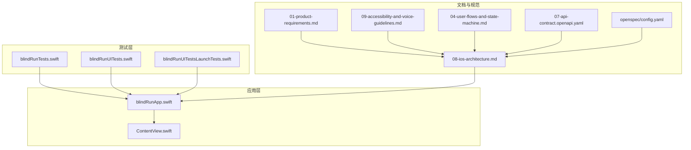
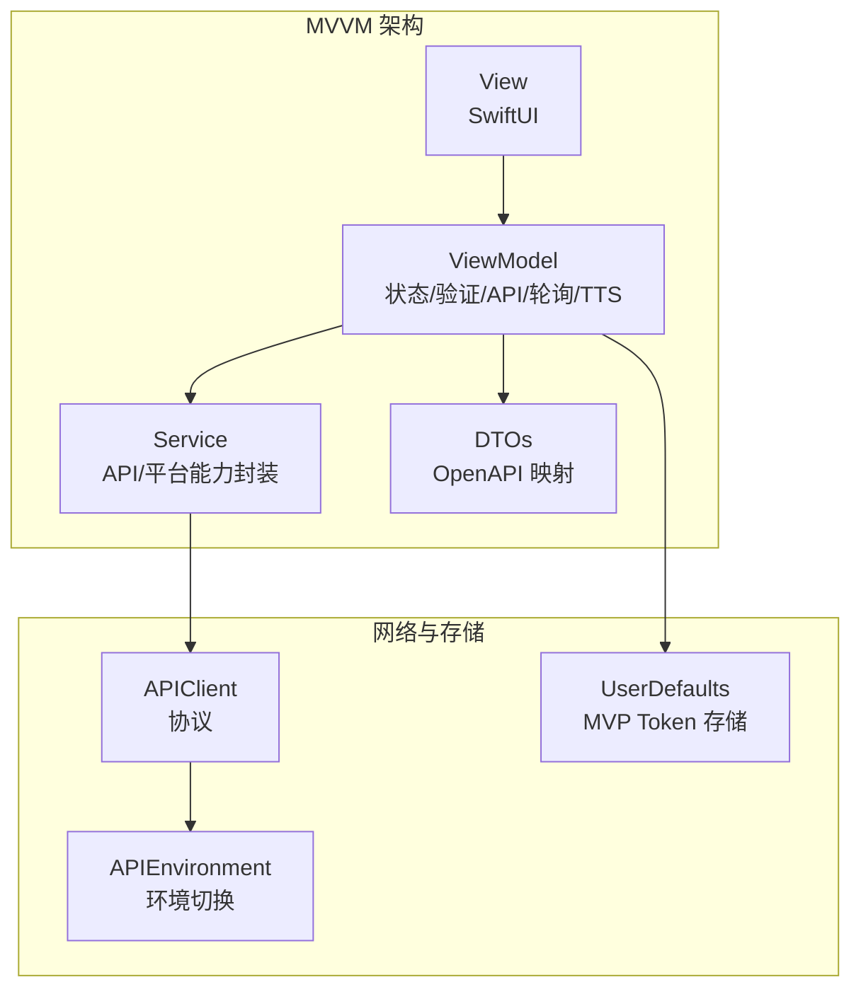
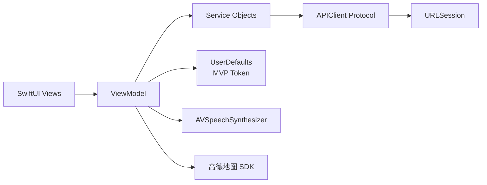

# 代码审查清单

<cite>
**本文引用的文件**
- [blindRun/ContentView.swift](file://blindRun/ContentView.swift)
- [blindRun/blindRunApp.swift](file://blindRun/blindRunApp.swift)
- [blindRunTests/blindRunTests.swift](file://blindRunTests/blindRunTests.swift)
- [blindRunUITests/blindRunUITests.swift](file://blindRunUITests/blindRunUITests.swift)
- [blindRunUITests/blindRunUITestsLaunchTests.swift](file://blindRunUITests/blindRunUITestsLaunchTests.swift)
- [docs/08-ios-architecture.md](file://docs/08-ios-architecture.md)
- [docs/01-product-requirements.md](file://docs/01-product-requirements.md)
- [docs/09-accessibility-and-voice-guidelines.md](file://docs/09-accessibility-and-voice-guidelines.md)
- [docs/04-user-flows-and-state-machine.md](file://docs/04-user-flows-and-state-machine.md)
- [docs/07-api-contract.openapi.yaml](file://docs/07-api-contract.openapi.yaml)
- [openspec/config.yaml](file://openspec/config.yaml)
</cite>

## 目录
1. [简介](#简介)
2. [项目结构](#项目结构)
3. [核心组件](#核心组件)
4. [架构概览](#架构概览)
5. [详细组件分析](#详细组件分析)
6. [依赖关系分析](#依赖关系分析)
7. [性能考虑](#性能考虑)
8. [故障排查指南](#故障排查指南)
9. [结论](#结论)
10. [附录](#附录)

## 简介
本审查清单面向 blindRun iOS 项目，基于现有架构文档与测试框架，制定覆盖代码质量、功能正确性、性能影响与安全要点的标准化审查流程。审查重点包括：
- 代码质量：代码风格、命名规范、注释完整性
- 功能正确性：业务逻辑、边界条件、异常处理
- 性能影响：内存使用、CPU 占用、网络请求优化
- 安全检查：敏感信息处理、权限验证、数据加密
- 审查模板与检查表格：帮助开发者进行自我审查与团队评审

## 项目结构
blindRun 项目采用 Swift 原生 iOS + SwiftUI + MVVM 架构，包含应用主体、单元测试与 UI 测试，以及多份设计与规范文档。当前仓库包含基础视图与应用入口，测试框架已就绪，API 合同与无障碍规范文档齐全。

图表来源
- [blindRun/blindRunApp.swift:10-17](file://blindRun/blindRunApp.swift#L10-L17)
- [blindRun/ContentView.swift:10-20](file://blindRun/ContentView.swift#L10-L20)
- [docs/08-ios-architecture.md:1-165](file://docs/08-ios-architecture.md#L1-L165)

章节来源
- [blindRun/ContentView.swift:1-25](file://blindRun/ContentView.swift#L1-L25)
- [blindRun/blindRunApp.swift:1-18](file://blindRun/blindRunApp.swift#L1-L18)
- [blindRunTests/blindRunTests.swift:1-39](file://blindRunTests/blindRunTests.swift#L1-L39)
- [blindRunUITests/blindRunUITests.swift:1-44](file://blindRunUITests/blindRunUITests.swift#L1-L44)
- [blindRunUITests/blindRunUITestsLaunchTests.swift:1-36](file://blindRunUITests/blindRunUITestsLaunchTests.swift#L1-L36)

## 核心组件
- 应用入口与主窗口：负责启动应用并承载根视图。
- 根视图：当前为简单占位视图，后续应承载业务页面。
- 测试框架：包含单元测试与 UI 测试骨架，便于后续扩展。
- 架构与规范：MVVM、API 环境切换、Token 存储策略、轮询机制、无障碍与语音集成等。

章节来源
- [blindRun/blindRunApp.swift:10-17](file://blindRun/blindRunApp.swift#L10-L17)
- [blindRun/ContentView.swift:10-20](file://blindRun/ContentView.swift#L10-L20)
- [docs/08-ios-architecture.md:33-49](file://docs/08-ios-architecture.md#L33-L49)

## 架构概览
blindRun 采用 SwiftUI + MVVM 架构，遵循以下关键原则：
- Views 保持薄层，ViewModel 负责状态管理、API 调用与轮询。
- 通过统一的 APIClient 协议抽象网络层，支持环境切换。
- Token 存储在 UserDefaults（MVP），生产需迁移到 Keychain。
- 轮询策略：订单状态页面每 5 秒轮询，终止条件明确。
- 无障碍优先：VoiceOver、TTS、语音输入与危险操作确认。

图表来源
- [docs/08-ios-architecture.md:33-82](file://docs/08-ios-architecture.md#L33-L82)

章节来源
- [docs/08-ios-architecture.md:1-165](file://docs/08-ios-architecture.md#L1-L165)

## 详细组件分析

### 应用入口与根视图审查要点
- 代码风格与命名
  - 文件头注释是否完整、作者信息是否清晰
  - 类型与变量命名是否符合 Swift 命名规范（驼峰、语义化）
  - 结构体与类的职责是否单一
- 注释完整性
  - 是否标注创建日期、用途与注意事项
  - 是否说明与后续业务页面的关系
- 功能正确性
  - 应用入口是否正确初始化并显示根视图
  - 根视图是否具备可预览配置
- 性能影响
  - 视图层级是否过深，是否存在不必要的布局计算
  - 图像与文本渲染是否合理
- 安全检查
  - 是否存在硬编码的敏感信息
  - 是否暴露调试或开发配置

章节来源
- [blindRun/blindRunApp.swift:10-17](file://blindRun/blindRunApp.swift#L10-L17)
- [blindRun/ContentView.swift:10-20](file://blindRun/ContentView.swift#L10-L20)

### 测试框架审查要点
- 单元测试
  - 测试用例是否覆盖典型路径与边界条件
  - 是否使用断言验证结果，避免空测试
  - 是否包含性能测试样例
- UI 测试
  - 是否正确设置初始状态与断言
  - 是否测量启动性能并记录附件
  - 是否在失败后立即停止以快速反馈
- 测试覆盖率与维护
  - 是否为后续 ViewModel 与 Service 编写测试
  - 是否与 API 合同保持一致

章节来源
- [blindRunTests/blindRunTests.swift:11-39](file://blindRunTests/blindRunTests.swift#L11-L39)
- [blindRunUITests/blindRunUITests.swift:10-44](file://blindRunUITests/blindRunUITests.swift#L10-L44)
- [blindRunUITests/blindRunUITestsLaunchTests.swift:10-36](file://blindRunUITests/blindRunUITestsLaunchTests.swift#L10-L36)

### 架构与规范一致性审查要点
- MVVM 分层
  - ViewModel 是否承担加载状态、校验状态、API 调用、轮询与 TTS 触发
  - Service 是否封装 API 与平台能力边界
- API 环境切换
  - 是否定义环境枚举与 baseURL
  - 是否通过统一协议调用，Debug 构建暴露环境选择
- Token 存储
  - 是否在 UserDefaults 读写 JWT（MVP），并在文档中标注 Keychain 迁移提醒
- 轮询机制
  - 是否在指定页面按 5 秒间隔轮询
  - 是否在页面消失、登出或达到终态时停止
- 无障碍与语音
  - 是否为关键控件提供 accessibilityLabel 与 accessibilityHint
  - 是否提供“重复当前状态”按钮
  - 是否对危险操作进行二次确认

章节来源
- [docs/08-ios-architecture.md:33-146](file://docs/08-ios-architecture.md#L33-L146)
- [docs/09-accessibility-and-voice-guidelines.md:13-139](file://docs/09-accessibility-and-voice-guidelines.md#L13-L139)
- [docs/04-user-flows-and-state-machine.md:275-309](file://docs/04-user-flows-and-state-machine.md#L275-L309)

### API 合同一致性审查要点
- 请求与响应
  - 是否严格遵循 OpenAPI 合同中的路径、参数与状态码
  - 是否正确处理错误码映射与用户提示
- 权限与状态
  - 是否正确处理未授权、资料不完整、定位权限缺失等场景
  - 是否在角色切换时阻止存在活跃订单的情况
- 轮询与状态机
  - 是否在匹配中、已接单、已到达、进行中阶段启用轮询
  - 是否在完成、取消、紧急状态下停止轮询

章节来源
- [docs/07-api-contract.openapi.yaml:25-411](file://docs/07-api-contract.openapi.yaml#L25-L411)
- [docs/04-user-flows-and-state-machine.md:72-119](file://docs/04-user-flows-and-state-machine.md#L72-L119)

## 依赖关系分析
- 组件耦合
  - Views 与 ViewModel 通过数据绑定解耦
  - ViewModel 依赖 Service，Service 依赖 APIClient 协议
- 外部依赖
  - SwiftUI、URLSession、UserDefaults（MVP）
  - 高德地图 SDK、CoreLocation、AVSpeechSynthesizer、Speech Framework
- 潜在风险
  - UserDefaults 存储 JWT 在生产环境存在安全风险
  - 轮询频率与页面生命周期管理需谨慎，避免资源浪费

图表来源
- [docs/08-ios-architecture.md:68-82](file://docs/08-ios-architecture.md#L68-L82)

章节来源
- [docs/08-ios-architecture.md:1-165](file://docs/08-ios-architecture.md#L1-L165)

## 性能考虑
- 内存使用
  - 避免在 ViewModel 中持有长生命周期的强引用集合
  - 轮询任务应在页面消失时及时释放
- CPU 占用
  - 控制轮询频率（5 秒）并避免在后台频繁刷新
  - 使用异步/并发 API 时注意调度队列与上下文
- 网络请求优化
  - 合理设置超时与重试策略（MVP 简化重试）
  - 使用缓存与去抖策略减少重复请求
- UI 渲染
  - 减少深层嵌套视图，避免不必要的重组
  - 使用惰性列表与延迟加载

## 故障排查指南
- 常见问题定位
  - 登录失败：检查验证码是否为固定值，Token 是否写入 UserDefaults
  - 定位权限：确认权限状态与 UI 提示，避免阻塞功能
  - 轮询异常：检查页面生命周期与轮询终止条件
- 日志与监控
  - 在 ViewModel 中记录关键状态变更与 API 调用
  - 使用 UI 测试截图与启动性能指标辅助诊断
- 回归测试
  - 为新增功能补充单元测试与 UI 测试
  - 与 API 合同保持同步，确保契约一致

章节来源
- [docs/08-ios-architecture.md:78-82](file://docs/08-ios-architecture.md#L78-L82)
- [blindRunUITests/blindRunUITestsLaunchTests.swift:20-34](file://blindRunUITests/blindRunUITestsLaunchTests.swift#L20-L34)

## 结论
blindRun 项目已具备清晰的架构方向与完善的规范文档。建议在现有基础上：
- 补充业务页面与 ViewModel 的实现，并配套测试
- 将 Token 存储迁移到 Keychain
- 强化轮询与生命周期管理，避免资源浪费
- 持续对照 API 合同与无障碍规范进行回归

## 附录

### 代码审查清单模板（自评用）
- 代码质量
  - [ ] 文件头注释完整，作者与创建日期清晰
  - [ ] 命名规范：类型、函数、变量语义化，大小写一致
  - [ ] 注释：关键逻辑、边界条件、设计权衡有说明
- 功能正确性
  - [ ] 业务逻辑与 API 合同一致
  - [ ] 边界条件：空值、越界、异常分支覆盖
  - [ ] 异常处理：错误码映射、用户提示、日志记录
- 性能影响
  - [ ] 内存：无循环引用，及时释放资源
  - [ ] CPU：轮询频率合理，避免后台高频刷新
  - [ ] 网络：超时与重试策略明确
- 安全检查
  - [ ] 无硬编码敏感信息
  - [ ] 权限验证：定位、麦克风、相机等按需申请
  - [ ] 数据传输：HTTPS、Token 安全存储（MVP 迁移 Keychain）

### 代码审查检查表格（团队评审用）
- 代码质量
  - 风格与命名：□ 合规 □ 待改进 □ 不合规
  - 注释完整性：□ 合规 □ 待改进 □ 不合规
- 功能正确性
  - 业务逻辑一致性：□ 合规 □ 待改进 □ 不合规
  - 边界条件覆盖：□ 合规 □ 待改进 □ 不合规
  - 异常处理：□ 合规 □ 待改进 □ 不合规
- 性能影响
  - 内存使用：□ 合规 □ 待改进 □ 不合规
  - CPU 占用：□ 合规 □ 待改进 □ 不合规
  - 网络优化：□ 合规 □ 待改进 □ 不合规
- 安全检查
  - 敏感信息处理：□ 合规 □ 待改进 □ 不合规
  - 权限验证：□ 合规 □ 待改进 □ 不合规
  - 数据加密：□ 合规 □ 待改进 □ 不合规