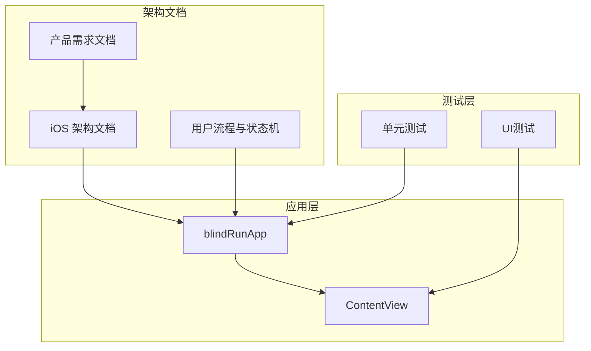
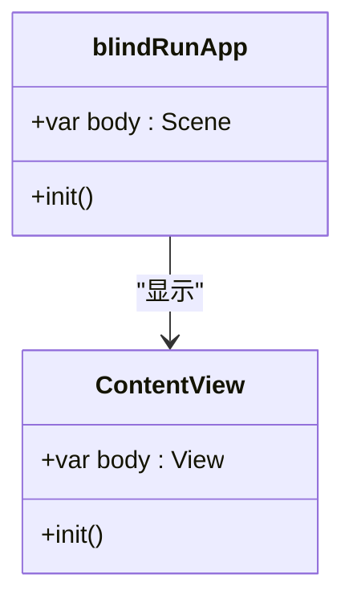
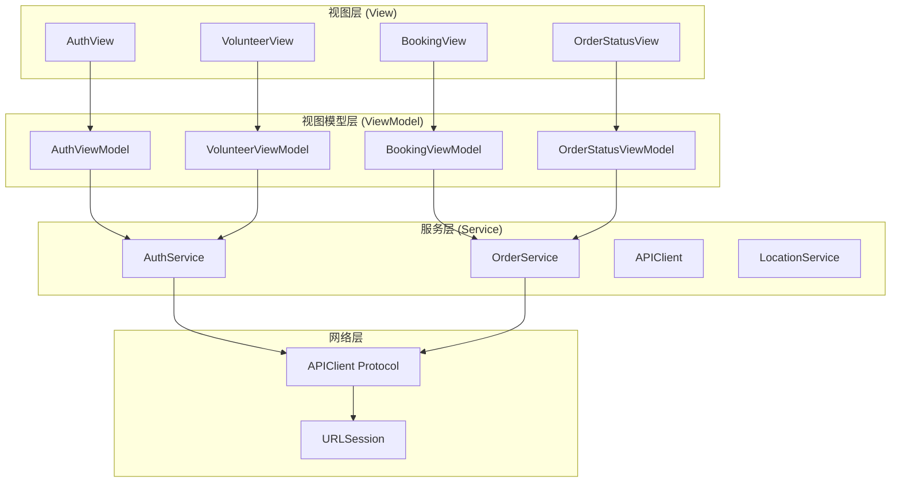
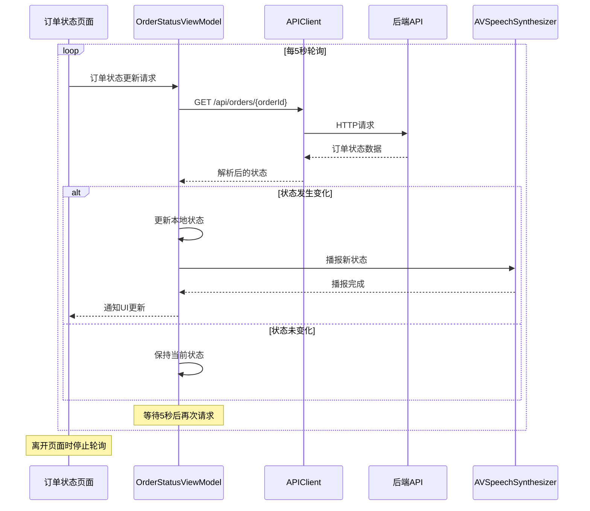
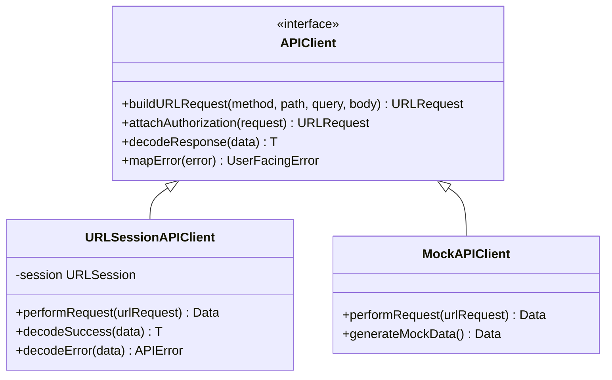
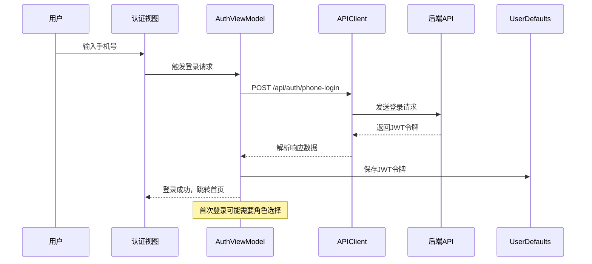
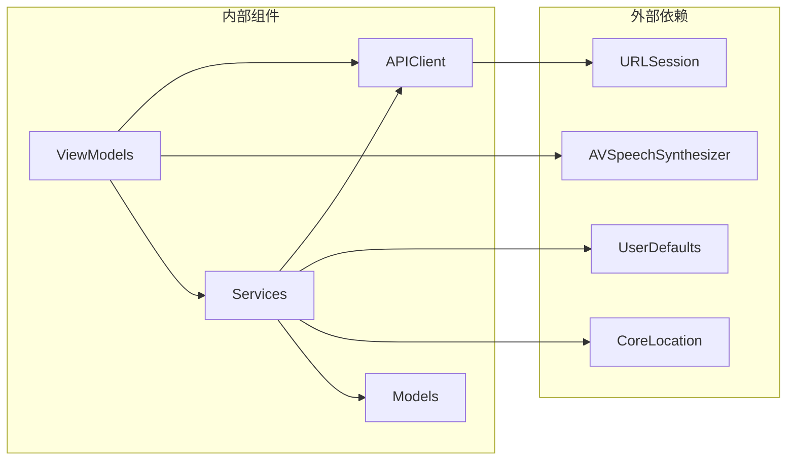

# 异步编程最佳实践

<cite>
**本文档引用的文件**
- [blindRunApp.swift](file://blindRun/blindRunApp.swift)
- [ContentView.swift](file://blindRun/ContentView.swift)
- [08-ios-architecture.md](file://docs/08-ios-architecture.md)
- [04-user-flows-and-state-machine.md](file://docs/04-user-flows-and-state-machine.md)
- [01-product-requirements.md](file://docs/01-product-requirements.md)
- [00-consistency-check-report.md](file://docs/00-consistency-check-report.md)
- [blindRunTests.swift](file://blindRunTests/blindRunTests.swift)
</cite>

## 目录
1. [引言](#引言)
2. [项目结构](#项目结构)
3. [核心组件](#核心组件)
4. [架构概览](#架构概览)
5. [详细组件分析](#详细组件分析)
6. [依赖关系分析](#依赖关系分析)
7. [性能考虑](#性能考虑)
8. [故障排除指南](#故障排除指南)
9. [结论](#结论)

## 引言

本文件针对 blindRun 项目制定异步编程的标准实践规范，重点涵盖 async/await 模式的正确使用、并发编程的安全模式、网络请求的异步处理规范，以及具体的代码示例展示。根据项目文档分析，blindRun 采用 SwiftUI + MVVM 架构，使用 URLSession 进行网络请求，采用 5 秒轮询机制处理订单状态更新，并通过 AVSpeechSynthesizer 实现语音播报功能。

## 项目结构

blindRun 项目采用清晰的模块化结构，主要包含以下关键部分：

**图表来源**
- [blindRunApp.swift:1-18](file://blindRun/blindRunApp.swift#L1-L18)
- [ContentView.swift:1-25](file://blindRun/ContentView.swift#L1-L25)
- [08-ios-architecture.md:1-165](file://docs/08-ios-architecture.md#L1-L165)

**章节来源**
- [blindRunApp.swift:1-18](file://blindRun/blindRunApp.swift#L1-L18)
- [ContentView.swift:1-25](file://blindRun/ContentView.swift#L1-L25)
- [08-ios-architecture.md:1-165](file://docs/08-ios-architecture.md#L1-L165)

## 核心组件

### 应用入口组件

应用采用标准的 SwiftUI 应用入口模式，使用 @main 标注主应用结构体：

**图表来源**
- [blindRunApp.swift:10-17](file://blindRun/blindRunApp.swift#L10-L17)
- [ContentView.swift:10-20](file://blindRun/ContentView.swift#L10-L20)

### 异步编程基础

根据项目文档，iOS 客户端采用以下异步编程约束：

- **网络层**：使用 URLSession + async/await 模式
- **轮询机制**：每 5 秒轮询订单状态
- **主线程**：UI 更新必须在主线程执行
- **错误处理**：统一的错误映射和用户提示

**章节来源**
- [01-product-requirements.md:87](file://docs/01-product-requirements.md#L87)
- [08-ios-architecture.md:125](file://docs/08-ios-architecture.md#L125)

## 架构概览

blindRun 采用 MVVM 架构模式，结合异步编程的最佳实践：

**图表来源**
- [08-ios-architecture.md:33-48](file://docs/08-ios-architecture.md#L33-L48)
- [08-ios-architecture.md:68-82](file://docs/08-ios-architecture.md#L68-L82)

## 详细组件分析

### 订单状态轮询组件

订单状态轮询是异步编程的核心应用场景，采用 5 秒间隔的轮询机制：

**图表来源**
- [04-user-flows-and-state-machine.md:277-299](file://docs/04-user-flows-and-state-machine.md#L277-L299)
- [08-ios-architecture.md:125-139](file://docs/08-ios-architecture.md#L125-L139)

#### 轮询组件实现要点

1. **生命周期管理**：轮询应在页面可见时启动，在页面消失时停止
2. **状态比较**：只有当状态实际发生变化时才触发 UI 更新和语音播报
3. **错误处理**：网络请求失败时应优雅降级，避免影响用户体验
4. **资源清理**：确保轮询任务能够正确取消，防止内存泄漏

### API 客户端组件

APIClient 是网络请求的核心抽象层：

**图表来源**
- [08-ios-architecture.md:68-82](file://docs/08-ios-architecture.md#L68-L82)

#### API 客户端设计原则

1. **协议抽象**：使用 APIClient 协议隔离网络实现细节
2. **环境切换**：支持 mock、localBackend、production 三种环境
3. **错误映射**：将后端错误码映射为用户友好的错误消息
4. **重试策略**：保持简单的重试行为，避免复杂的离线队列

**章节来源**
- [08-ios-architecture.md:68-82](file://docs/08-ios-architecture.md#L68-L82)

### 认证组件

认证流程涉及手机号登录和 JWT 令牌管理：

**图表来源**
- [04-user-flows-and-state-machine.md:123-178](file://docs/04-user-flows-and-state-machine.md#L123-L178)
- [08-ios-architecture.md:84-97](file://docs/08-ios-architecture.md#L84-L97)

## 依赖关系分析

### 组件耦合度分析

**图表来源**
- [08-ios-architecture.md:11](file://docs/08-ios-architecture.md#L11)
- [08-ios-architecture.md:78-82](file://docs/08-ios-architecture.md#L78-L82)

### 异步依赖链

项目中的异步调用遵循清晰的依赖链：

1. **UI 层** → **ViewModel 层**：用户交互触发异步操作
2. **ViewModel 层** → **Service 层**：业务逻辑封装
3. **Service 层** → **APIClient 层**：网络请求抽象
4. **APIClient 层** → **URLSession**：底层网络实现

**章节来源**
- [08-ios-architecture.md:33-41](file://docs/08-ios-architecture.md#L33-L41)

## 性能考虑

### 轮询性能优化

1. **轮询间隔**：5 秒间隔平衡了实时性和性能消耗
2. **条件轮询**：仅在相关页面和订单处于活跃状态时进行轮询
3. **状态缓存**：避免不必要的重复请求
4. **资源释放**：页面销毁时及时停止轮询任务

### 内存管理

1. **弱引用**：在闭包中使用弱引用避免循环引用
2. **任务取消**：提供任务取消机制防止僵尸任务
3. **定时器管理**：确保定时器在适当时候被释放
4. **观察者模式**：正确移除通知观察者和 KVO 观察者

## 故障排除指南

### 常见异步编程问题

#### 1. 主线程阻塞问题

**症状**：UI 卡顿，界面无响应

**解决方案**：
- 确保所有网络请求和耗时操作都在后台线程执行
- 使用 `@MainActor` 标注 UI 更新逻辑
- 使用 `Task { }` 或 `await Task.sleep()` 进行异步调度

#### 2. 内存泄漏问题

**症状**：应用内存持续增长

**解决方案**：
- 使用弱引用避免循环引用
- 及时取消异步任务和定时器
- 正确管理观察者的添加和移除

#### 3. 竞态条件问题

**症状**：状态不一致，数据竞争

**解决方案**：
- 使用 `@MainActor` 确保 UI 线程安全性
- 使用 `@Observable` 或 `@Published` 属性包装器
- 避免直接修改共享状态，使用事务性更新

#### 4. 错误处理不当

**症状**：应用崩溃或用户体验差

**解决方案**：
- 实现统一的错误处理机制
- 提供用户友好的错误提示
- 记录详细的错误日志便于调试

**章节来源**
- [blindRunTests.swift:21-38](file://blindRunTests/blindRunTests.swift#L21-L38)

## 结论

blindRun 项目的异步编程实践体现了现代 iOS 开发的最佳实践：

1. **架构清晰**：MVVM + async/await 的组合提供了良好的代码组织
2. **性能优化**：合理的轮询策略和资源管理确保了应用性能
3. **错误处理**：完善的错误映射和用户提示提升了用户体验
4. **可维护性**：协议抽象和模块化设计便于代码维护和扩展

建议在实际开发中重点关注以下方面：
- 严格遵守主线程和后台线程的职责分离
- 实现完善的生命周期管理和资源清理
- 建立统一的错误处理和日志记录机制
- 采用渐进式重构的方式逐步完善异步编程实践

这些规范将为 blindRun 项目的长期发展奠定坚实的异步编程基础。