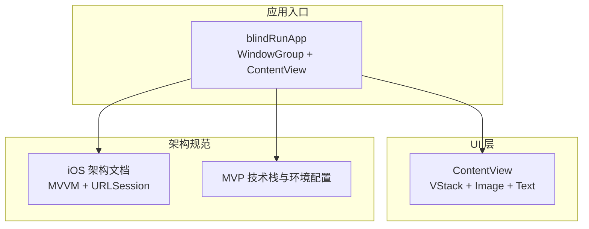
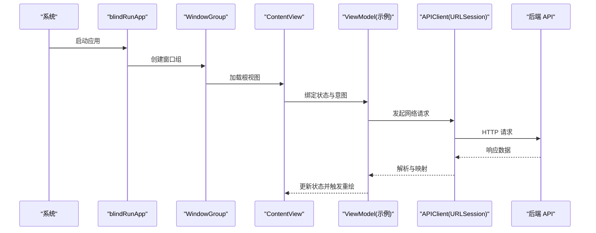
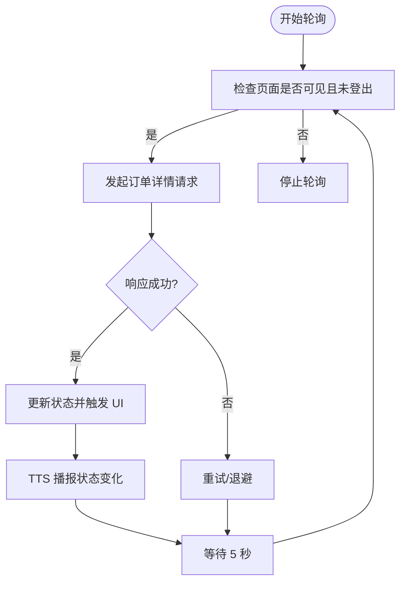
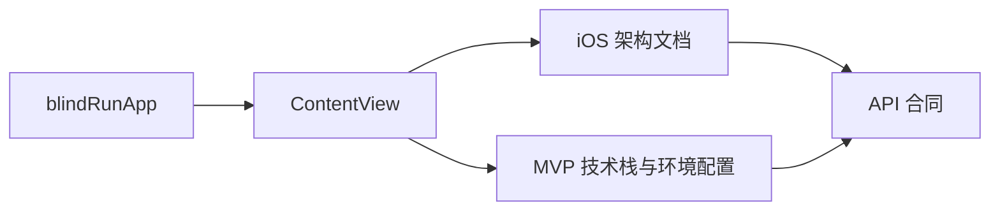

# 性能优化指南

<cite>
**本文档引用的文件**
- [blindRunApp.swift](file://blindRun/blindRunApp.swift)
- [ContentView.swift](file://blindRun/ContentView.swift)
- [08-ios-architecture.md](file://docs/08-ios-architecture.md)
- [02-mvp-scope.md](file://docs/02-mvp-scope.md)
- [04-user-flows-and-state-machine.md](file://docs/04-user-flows-and-state-machine.md)
- [07-api-contract.openapi.yaml](file://docs/07-api-contract.openapi.yaml)
- [blindRunTests.swift](file://blindRunTests/blindRunTests.swift)
- [blindRunUITests.swift](file://blindRunUITests/blindRunUITests.swift)
- [blindRunUITestsLaunchTests.swift](file://blindRunUITests/blindRunUITestsLaunchTests.swift)
</cite>

## 目录
1. [简介](#简介)
2. [项目结构](#项目结构)
3. [核心组件](#核心组件)
4. [架构概览](#架构概览)
5. [详细组件分析](#详细组件分析)
6. [依赖关系分析](#依赖关系分析)
7. [性能考虑](#性能考虑)
8. [故障排查指南](#故障排查指南)
9. [结论](#结论)
10. [附录](#附录)

## 简介
本指南面向 blindRun iOS 应用的性能优化，结合项目当前的 SwiftUI + MVVM 架构、基于 URLSession 的网络层、以及 5 秒轮询的状态更新策略，制定可落地的优化标准与最佳实践。内容涵盖：
- 内存管理优化（对象生命周期、循环引用避免、内存泄漏检测）
- UI 性能优化（视图渲染优化、动画性能、滚动性能）
- 网络性能优化（请求合并、缓存策略、连接池管理）
- 数据处理优化（数据序列化、批量处理、延迟加载）
- 性能监控与分析（Instruments 使用与指标解读）

## 项目结构
blindRun 采用 SwiftUI + MVVM 架构，模块化组织包含 Core、Auth、Role、BlindRunner、Volunteer、Orders、Map、Voice、Safety、Profile 等功能域。应用入口为 SwiftUI App 类型，根视图为薄视图，业务逻辑集中在 ViewModel 与 Service 层。

图表来源
- [blindRunApp.swift:10-17](file://blindRun/blindRunApp.swift#L10-L17)
- [ContentView.swift:10-20](file://blindRun/ContentView.swift#L10-L20)
- [08-ios-architecture.md:33-48](file://docs/08-ios-architecture.md#L33-L48)
- [02-mvp-scope.md:119-153](file://docs/02-mvp-scope.md#L119-L153)

章节来源
- [blindRunApp.swift:10-17](file://blindRun/blindRunApp.swift#L10-L17)
- [ContentView.swift:10-20](file://blindRun/ContentView.swift#L10-L20)
- [08-ios-architecture.md:18-48](file://docs/08-ios-architecture.md#L18-L48)
- [02-mvp-scope.md:119-153](file://docs/02-mvp-scope.md#L119-L153)

## 核心组件
- 应用入口与场景管理：负责启动窗口组与根视图挂载。
- 根视图：演示最小可用 UI，便于性能基准测试。
- 架构与网络：MVVM 分层、ViewModel 负责状态与 API 调用、Service 封装平台能力边界、APIClient 统一请求构建与解码。
- 轮询机制：订单状态页面按 5 秒周期轮询，状态变更触发 TTS 播报。

章节来源
- [blindRunApp.swift:10-17](file://blindRun/blindRunApp.swift#L10-L17)
- [ContentView.swift:10-20](file://blindRun/ContentView.swift#L10-L20)
- [08-ios-architecture.md:33-77](file://docs/08-ios-architecture.md#L33-L77)
- [04-user-flows-and-state-machine.md:275-299](file://docs/04-user-flows-and-state-machine.md#L275-L299)

## 架构概览
下图展示了应用启动到 UI 渲染的关键路径，以及与架构文档中 MVVM、网络层和轮询策略的关系。

图表来源
- [blindRunApp.swift:10-17](file://blindRun/blindRunApp.swift#L10-L17)
- [ContentView.swift:10-20](file://blindRun/ContentView.swift#L10-L20)
- [08-ios-architecture.md:33-77](file://docs/08-ios-architecture.md#L33-L77)
- [07-api-contract.openapi.yaml:24-252](file://docs/07-api-contract.openapi.yaml#L24-L252)

## 详细组件分析

### 内存管理优化
- 对象生命周期控制
  - ViewModel 作为状态持有者，应在视图消失或退出登录时及时释放资源，避免后台任务继续持有强引用。
  - 使用弱引用或无主引用规避视图对 ViewModel 的强引用环，确保 SwiftUI 视图销毁后 ViewModel 能被释放。
- 循环引用避免
  - 在闭包回调中使用弱引用捕获 ViewModel，防止闭包持有 ViewModel 导致无法释放。
  - 定时器与轮询任务需在合适的生命周期内取消，避免持续回调持有上下文。
- 内存泄漏检测
  - 使用 Xcode Memory Graph 与 Allocations 工具定位循环引用与长生命周期对象。
  - 在测试中增加长时间运行与频繁切换页面的场景，验证 ViewModel 与 Service 的释放行为。

章节来源
- [08-ios-architecture.md:33-48](file://docs/08-ios-architecture.md#L33-L48)

### UI 性能优化
- 视图渲染优化
  - 保持视图为薄层，复杂布局与计算移至 ViewModel，减少不必要的视图重建。
  - 使用稳定的标识符与惰性列表，避免列表项频繁重组。
- 动画性能
  - SwiftUI 动画应限制在必要区域，避免跨层级复杂动画叠加。
  - 使用 .transaction 控制动画节奏，避免过度重排。
- 滚动性能
  - 列表数据尽量扁平化，避免深层嵌套视图。
  - 图片等大资源懒加载，使用合适尺寸与格式，避免主线程阻塞。

章节来源
- [ContentView.swift:10-20](file://blindRun/ContentView.swift#L10-L20)
- [08-ios-architecture.md:33-48](file://docs/08-ios-architecture.md#L33-L48)

### 网络性能优化
- 请求合并
  - 将短时间内相近的读取请求合并为单次调用，减少网络往返与解析开销。
- 缓存策略
  - 对只读数据（如静态配置、常量列表）启用短期内存缓存；对订单详情等高频读取数据设置合理的过期策略。
- 连接池管理
  - 使用 URLSession 默认连接复用；在高并发场景下自定义 URLSessionConfiguration，合理设置最大连接数与超时时间。
- 轮询优化
  - 订单状态轮询按 5 秒一次，仅在相关页面显示时生效；页面消失或登出时立即停止轮询，避免后台占用。

图表来源
- [04-user-flows-and-state-machine.md:275-299](file://docs/04-user-flows-and-state-machine.md#L275-L299)
- [08-ios-architecture.md:68-77](file://docs/08-ios-architecture.md#L68-L77)

章节来源
- [08-ios-architecture.md:68-77](file://docs/08-ios-architecture.md#L68-L77)
- [04-user-flows-and-state-machine.md:275-299](file://docs/04-user-flows-and-state-machine.md#L275-L299)

### 数据处理优化
- 数据序列化
  - 使用结构化编码/解码（Codable）处理 API 响应，避免在主线程执行重型解析。
- 批量处理
  - 列表数据分批加载，结合惰性视图与分页参数，降低一次性渲染压力。
- 延迟加载
  - 图片与富文本内容采用延迟加载策略，仅在即将进入可视区域时解码与渲染。

章节来源
- [08-ios-architecture.md:68-77](file://docs/08-ios-architecture.md#L68-L77)

### 性能监控与分析
- 应用启动性能
  - 使用 UI 测试的 XCTApplicationLaunchMetric 监测启动耗时，定期回归测试。
- 自定义性能测试
  - 在单元测试中使用 measure 包裹热点路径，建立基线并跟踪回归。
- Instruments 使用建议
  - Time Profiler：识别 CPU 热点与阻塞调用。
  - Allocations：发现内存峰值与泄漏对象。
  - Network：观察请求频率、往返时间与错误率。
  - Energy Diagnostics：评估电池消耗与唤醒次数。

章节来源
- [blindRunUITests.swift:36-42](file://blindRunUITests/blindRunUITests.swift#L36-L42)
- [blindRunTests.swift:31-36](file://blindRunTests/blindRunTests.swift#L31-L36)

## 依赖关系分析
应用层与文档层的依赖关系如下：

图表来源
- [blindRunApp.swift:10-17](file://blindRun/blindRunApp.swift#L10-L17)
- [ContentView.swift:10-20](file://blindRun/ContentView.swift#L10-L20)
- [08-ios-architecture.md:18-48](file://docs/08-ios-architecture.md#L18-L48)
- [02-mvp-scope.md:119-153](file://docs/02-mvp-scope.md#L119-L153)
- [07-api-contract.openapi.yaml:1-24](file://docs/07-api-contract.openapi.yaml#L1-L24)

章节来源
- [08-ios-architecture.md:18-48](file://docs/08-ios-architecture.md#L18-L48)
- [02-mvp-scope.md:119-153](file://docs/02-mvp-scope.md#L119-L153)
- [07-api-contract.openapi.yaml:1-24](file://docs/07-api-contract.openapi.yaml#L1-L24)

## 性能考虑
- 启动阶段
  - 减少启动时的同步工作，将非关键初始化延后到首屏渲染后再执行。
- 网络与轮询
  - 严格控制轮询范围与频率，避免在后台或离屏状态下继续请求。
- UI 响应
  - 将计算密集型任务放入后台队列，结果回传主线程更新 UI。
- 资源管理
  - 图片与媒体资源按需加载，避免缓存无限增长；对临时文件及时清理。

## 故障排查指南
- 启动慢
  - 使用应用启动性能测试定位瓶颈，检查是否在启动路径中执行了昂贵操作。
- 内存飙升
  - 使用 Allocations 与 Memory Graph 查找未释放对象与循环引用，重点检查 ViewModel 与 Service 生命周期。
- 卡顿
  - 使用 Time Profiler 检查主线程阻塞，确认是否有大量计算或 UI 更新在主线程执行。
- 网络异常
  - 使用 Network 记录器观察请求频率与错误率，结合 API 合同核对参数与鉴权头。

章节来源
- [blindRunUITests.swift:36-42](file://blindRunUITests/blindRunUITests.swift#L36-L42)
- [07-api-contract.openapi.yaml:24-252](file://docs/07-api-contract.openapi.yaml#L24-L252)

## 结论
本指南基于现有架构文档与最小可用 UI，提出了可操作的性能优化方向：强化内存管理、提升 UI 渲染效率、优化网络与轮询策略、完善数据处理与监控体系。随着功能模块逐步完善，建议持续引入更细粒度的性能测试与回归指标，确保在 MVP 之后的版本中维持稳定流畅的用户体验。

## 附录
- 性能测试用例建议
  - 启动性能：应用启动时间 ≤ X 秒（根据设备与目标设定）
  - 轮询稳定性：订单状态页面 5 秒轮询期间，CPU 平均占用 ≤ Y%
  - UI 响应：点击到 UI 更新延迟 ≤ Z 毫秒
- 监控指标清单
  - 启动时间、内存峰值、网络请求数、错误率、电池消耗、主线程阻塞时长