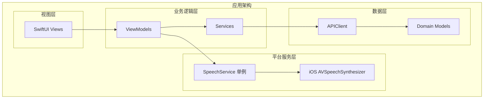
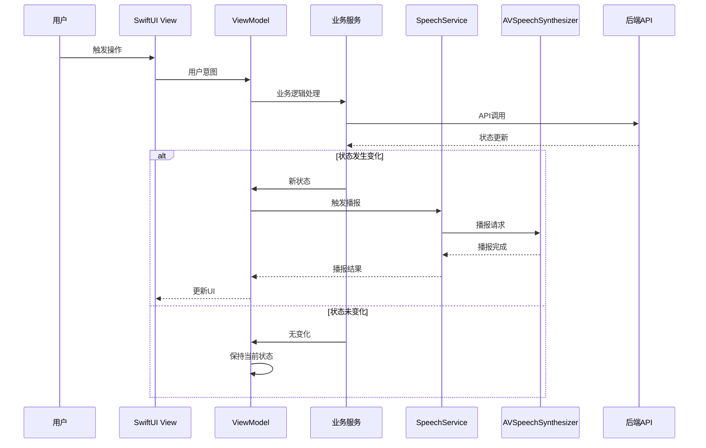
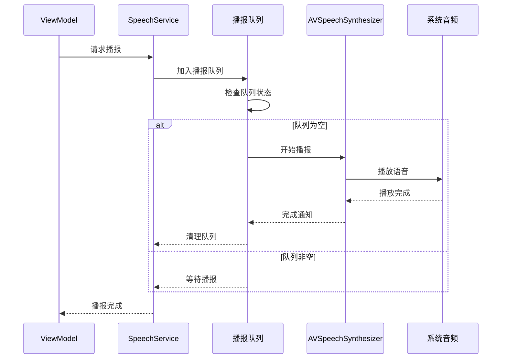
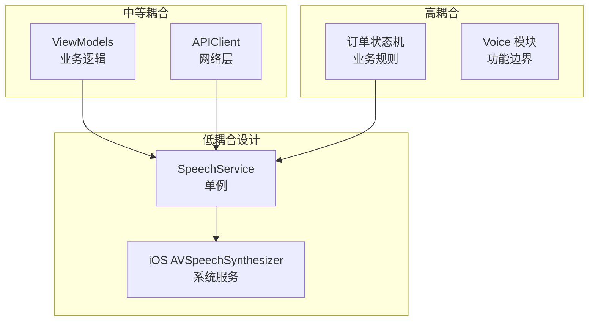

# TTS 语音播报系统

<cite>
**本文档引用的文件**
- [09-accessibility-and-voice-guidelines.md](file://docs/09-accessibility-and-voice-guidelines.md)
- [04-user-flows-and-state-machine.md](file://docs/04-user-flows-and-state-machine.md)
- [08-ios-architecture.md](file://docs/08-ios-architecture.md)
- [03-user-stories.md](file://docs/03-user-stories.md)
- [spec.md](file://openspec/changes/add-aidrun-ios-spring-mvp/specs/accessibility-voice-ui/spec.md)
- [spec.md](file://openspec/changes/add-aidrun-ios-spring-mvp/specs/order-status-lifecycle/spec.md)
- [ContentView.swift](file://blindRun/ContentView.swift)
- [blindRunApp.swift](file://blindRun/blindRunApp.swift)
</cite>

## 目录
1. [简介](#简介)
2. [项目结构](#项目结构)
3. [核心组件](#核心组件)
4. [架构概览](#架构概览)
5. [详细组件分析](#详细组件分析)
6. [依赖关系分析](#依赖关系分析)
7. [性能考虑](#性能考虑)
8. [故障排除指南](#故障排除指南)
9. [结论](#结论)
10. [附录](#附录)

## 简介

本文件制定了 AidRun MVP 项目的 TTS 语音播报系统完整开发规范。该系统基于 iOS 原生 AVSpeechSynthesizer 实现，专为盲人用户设计，确保语音优先的无障碍体验。系统涵盖完整的订单状态生命周期播报、错误提示、危险操作确认等关键场景，并采用单例模式的 SpeechService 提供统一的语音服务。

## 项目结构

根据项目架构文档，TTS 系统属于独立的 Voice 模块，与业务逻辑分离，遵循 MVVM 架构模式：



**图表来源**
- [08-ios-architecture.md:18-31](file://docs/08-ios-architecture.md#L18-L31)
- [08-ios-architecture.md:33-40](file://docs/08-ios-architecture.md#L33-L40)

**章节来源**
- [08-ios-architecture.md:1-165](file://docs/08-ios-architecture.md#L1-L165)

## 核心组件

### 必须播报的节点清单

根据无障碍和语音指南，系统必须播报以下关键节点：

#### 订单状态变化节点
- 进入盲人首页
- 订单提交成功
- 匹配中
- 志愿者已接单
- 志愿者已到达
- 请确认开始服务
- 服务已开始
- 服务已完成
- 进入求助状态
- 错误提示

#### 推荐状态播报内容
- `matching`: "预约已提交，正在等待志愿者接单。"
- `accepted`: "志愿者已接单，请等待志愿者到达。"
- `arrived`: "志愿者已到达，请确认开始服务。"
- `in_progress`: "服务已开始，请注意安全。"
- `completed`: "服务已完成，感谢使用助盲跑。"
- `cancelled`: "本次预约已取消。"
- `emergency`: "已进入求助状态，系统已记录本次异常。"

**章节来源**
- [09-accessibility-and-voice-guidelines.md:13-36](file://docs/09-accessibility-and-voice-guidelines.md#L13-L36)
- [09-accessibility-and-voice-guidelines.md:112-121](file://docs/09-accessibility-and-voice-guidelines.md#L112-L121)

### 语音播报时机控制策略

#### 轮询过程中的重复播报避免
- 使用状态变更检测机制，仅在订单状态发生变化时触发播报
- 维护最后播报的状态缓存，避免轮询期间的重复播报
- 在页面离开或订单进入终态时停止轮询和播报

#### 轮询机制
- 盲人跑者订单状态页面每5秒轮询一次
- 仅在状态变化时更新UI并触发TTS播报
- 状态未变化时保持当前UI不变

**章节来源**
- [09-accessibility-and-voice-guidelines.md:30-36](file://docs/09-accessibility-and-voice-guidelines.md#L30-L36)
- [04-user-flows-and-state-machine.md:275-299](file://docs/04-user-flows-and-state-machine.md#L275-L299)
- [03-user-stories.md:655-668](file://docs/03-user-stories.md#L655-L668)

## 架构概览

### 系统架构图



**图表来源**
- [08-ios-architecture.md:33-40](file://docs/08-ios-architecture.md#L33-L40)
- [04-user-flows-and-state-machine.md:277-296](file://docs/04-user-flows-and-state-machine.md#L277-L296)

### 订单状态机与语音播报集成

```mermaid
stateDiagram-v2
[*] --> matching : 盲人提交预约
matching --> accepted : 志愿者接单成功
matching --> cancelled : 盲人取消/超时
accepted --> arrived : 志愿者到达
accepted --> cancelled : 任一方取消
accepted --> emergency : 任一方求助
arrived --> in_progress : 盲人确认开始
arrived --> cancelled : 任一方取消
arrived --> emergency : 任一方求助
in_progress --> completed : 志愿者结束服务
in_progress --> emergency : 任一方求助
completed --> [*] : 订单结束
cancelled --> [*] : 订单结束
emergency --> [*] : 异常终态
note right of matching : TTS : "订单提交成功，等待志愿者接单"
note right of accepted : TTS : "志愿者已接单"
note right of arrived : TTS : "志愿者已到达，请确认开始服务"
note right of in_progress : TTS : "服务已开始，请注意安全"
note right of completed : TTS : "服务已完成，感谢使用助盲跑"
note right of emergency : TTS : "已进入求助状态，系统已记录本次异常"
```

**图表来源**
- [04-user-flows-and-state-machine.md:74-96](file://docs/04-user-flows-and-state-machine.md#L74-L96)
- [09-accessibility-and-voice-guidelines.md:112-121](file://docs/09-accessibility-and-voice-guidelines.md#L112-L121)

## 详细组件分析

### SpeechService 单例模式设计

#### 设计原则
- **单一职责**: 专门负责语音播报功能
- **线程安全**: 支持多线程环境下的语音播报
- **资源管理**: 统一管理 AVSpeechSynthesizer 资源
- **状态控制**: 维护播报队列和状态同步

#### 核心功能
1. **语音播报调度**: 统一接收播报请求，避免并发冲突
2. **状态同步**: 确保播报顺序和去重
3. **错误处理**: 统一处理语音播报异常
4. **配置管理**: 集中管理语速、音调等参数

#### 时序图



**图表来源**
- [09-accessibility-and-voice-guidelines.md:32-35](file://docs/09-accessibility-and-voice-guidelines.md#L32-L35)

### 语音质量优化策略

#### 语速调节最佳实践
- **默认语速**: 设置为 0.5（范围 0.0-1.0）
- **紧急情况**: 提高语速至 0.7-0.8
- **正常状态**: 保持 0.5 左右
- **错误提示**: 适当提高语速强调重要性

#### 音调设置建议
- **基础音调**: 0.0（正常音调）
- **积极状态**: +0.1（提升音调）
- **紧急状态**: +0.2（明显提升）
- **错误状态**: -0.1（降低音调）

#### 语音参数配置
- **语言**: zh-CN（中文普通话）
- **音色**: 自动选择（系统最优）
- **最大字符数**: 200 字符以内
- **播放间隔**: 至少 1 秒间隔避免重叠

### 代码实现示例路径

由于项目当前仅为模板结构，以下是推荐的实现组织方式：

#### SpeechService 接口定义
- 文件路径: `Voice/SpeechService.swift`
- 功能: 单例语音服务接口
- 方法: `speak(text: String)`, `stop()`, `isSpeaking()`

#### 语音播报集成示例
- 文件路径: `BlindRunner/ViewModels/BlindOrderStatusViewModel.swift`
- 功能: 订单状态变化时触发语音播报
- 逻辑: 状态变更检测 → SpeechService 调用 → 播报完成回调

#### 错误处理示例
- 文件路径: `Core/Services/APIClient.swift`
- 功能: API 错误映射到语音播报
- 逻辑: 错误码 → 语音文案 → SpeechService

**章节来源**
- [08-ios-architecture.md:29](file://docs/08-ios-architecture.md#L29)
- [08-ios-architecture.md:46](file://docs/08-ios-architecture.md#L46)

## 依赖关系分析

### 组件耦合度分析



**图表来源**
- [08-ios-architecture.md:18-31](file://docs/08-ios-architecture.md#L18-L31)
- [08-ios-architecture.md:33-40](file://docs/08-ios-architecture.md#L33-L40)

### 外部依赖集成

#### AVSpeechSynthesizer 集成要点
- **权限管理**: 自动获取系统语音权限
- **资源释放**: 应用后台时自动释放
- **系统兼容**: 支持 iOS 16+ 版本特性
- **错误处理**: 统一捕获系统级异常

#### 与业务逻辑的解耦
- **事件驱动**: 通过状态变化事件触发播报
- **配置驱动**: 通过配置文件管理播报内容
- **异步处理**: 非阻塞式语音播报
- **缓存机制**: 避免重复播报相同内容

**章节来源**
- [08-ios-architecture.md:15](file://docs/08-ios-architecture.md#L15)
- [09-accessibility-and-voice-guidelines.md:15](file://docs/09-accessibility-and-voice-guidelines.md#L15)

## 性能考虑

### 播报性能优化

#### 内存管理
- **对象池**: 复用 AVSpeechUtterance 对象
- **弱引用**: 避免循环引用
- **及时释放**: 页面销毁时清理语音资源

#### 网络与轮询优化
- **轮询频率**: 5秒间隔平衡实时性和性能
- **条件轮询**: 仅在关键页面启用
- **智能停止**: 订单终态自动停止轮询

#### 电池续航优化
- **静默模式**: 低电量时降低播报频率
- **后台限制**: 应用后台时暂停非必要播报
- **智能唤醒**: 重要状态变化时强制播报

### 并发处理策略

#### 线程安全
- **串行队列**: 确保语音播报顺序
- **主线程回调**: UI 更新在主线程执行
- **异步处理**: 非阻塞式网络请求

#### 错误恢复
- **重试机制**: 短暂失败自动重试
- **降级策略**: 系统不支持时提供替代方案
- **日志记录**: 详细的错误追踪信息

## 故障排除指南

### 常见问题及解决方案

#### 语音播报不生效
1. **检查权限**: 确认系统语音权限已授权
2. **验证内容**: 检查播报内容长度和格式
3. **状态检查**: 确认 SpeechService 单例正常运行

#### 播报重复问题
1. **状态缓存**: 检查 lastSpokenStatus 缓存逻辑
2. **轮询控制**: 确认轮询停止条件正确
3. **去重机制**: 验证重复播报检测逻辑

#### 性能问题
1. **内存泄漏**: 检查 AVSpeechSynthesizer 资源释放
2. **线程阻塞**: 确认异步处理正确实现
3. **轮询频率**: 调整轮询间隔优化性能

### 调试工具和监控

#### 日志记录
- **语音事件**: 记录每次播报的时间、内容、状态
- **错误日志**: 捕获和记录语音播报异常
- **性能指标**: 监控播报延迟和成功率

#### 用户反馈
- **手动测试**: "重复当前状态"按钮验证
- **自动化测试**: 覆盖关键状态变化场景
- **用户调研**: 收集盲人用户的使用反馈

**章节来源**
- [09-accessibility-and-voice-guidelines.md:35](file://docs/09-accessibility-and-voice-guidelines.md#L35)

## 结论

TTS 语音播报系统作为 AidRun MVP 的核心无障碍功能，通过严格的架构设计和规范化的实现，为盲人用户提供了一致、可靠的语音体验。系统采用单例模式的 SpeechService，结合状态机驱动的播报策略，在保证用户体验的同时实现了良好的性能表现。

关键成功因素包括：
- 明确的播报节点清单和时机控制策略
- 健壮的单例服务设计和错误处理机制  
- 与业务逻辑的松耦合集成
- 完善的性能优化和故障排除方案

## 附录

### 最佳实践总结

#### 开发规范
- 使用单例模式管理语音服务
- 通过 ViewModel 决定播报时机
- 实现状态变更检测避免重复播报
- 提供"重复当前状态"按钮

#### 测试要求
- 覆盖所有必须播报节点
- 验证轮询机制正确性
- 测试错误处理和恢复
- 用户验收测试确保可用性

#### 维护要点
- 定期更新播报内容
- 监控系统兼容性
- 优化性能指标
- 收集用户反馈持续改进