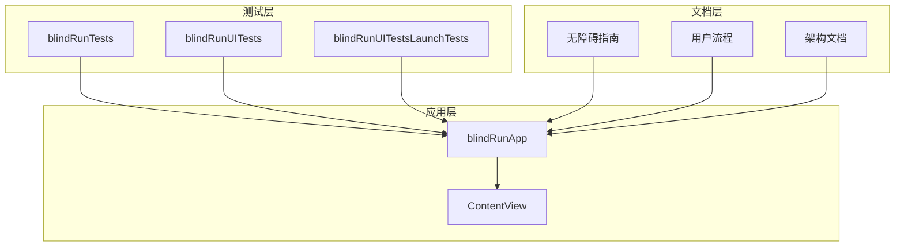
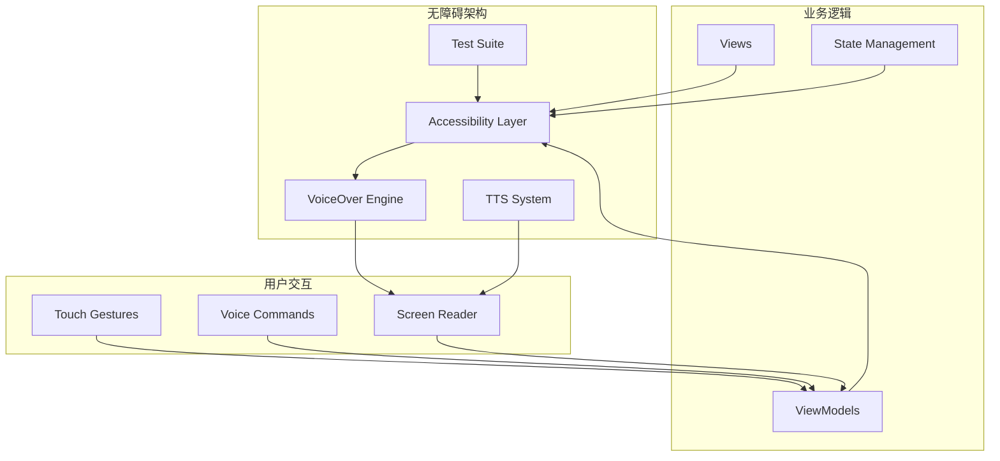
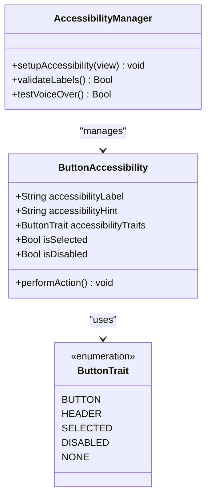
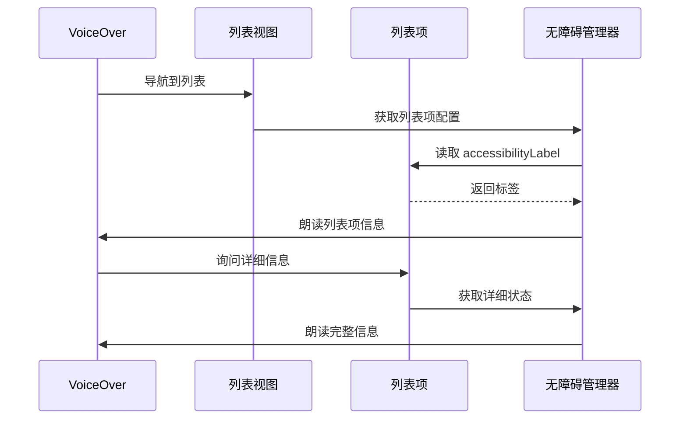
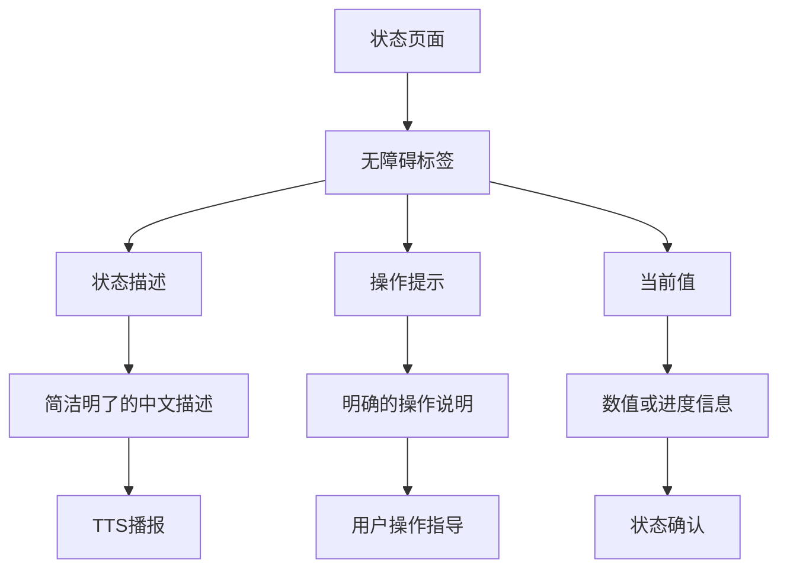
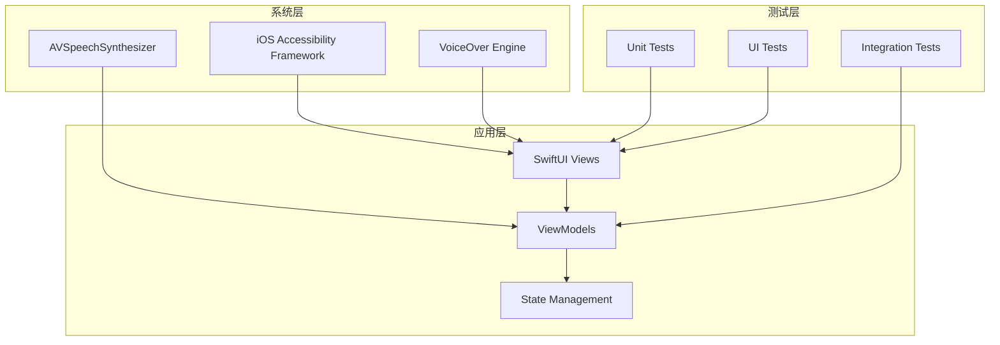
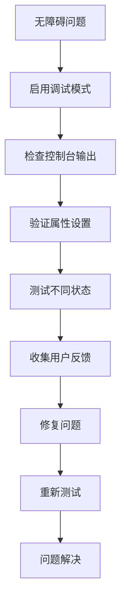

# VoiceOver 支持实现

<cite>
**本文档引用的文件**
- [blindRun/ContentView.swift](file://blindRun/ContentView.swift)
- [blindRun/blindRunApp.swift](file://blindRun/blindRunApp.swift)
- [docs/09-accessibility-and-voice-guidelines.md](file://docs/09-accessibility-and-voice-guidelines.md)
- [docs/04-user-flows-and-state-machine.md](file://docs/04-user-flows-and-state-machine.md)
- [docs/08-ios-architecture.md](file://docs/08-ios-architecture.md)
- [blindRunTests/blindRunTests.swift](file://blindRunTests/blindRunTests.swift)
- [blindRunUITests/blindRunUITests.swift](file://blindRunUITests/blindRunUITests.swift)
- [blindRunUITests/blindRunUITestsLaunchTests.swift](file://blindRunUITests/blindRunUITestsLaunchTests.swift)
</cite>

## 目录
1. [简介](#简介)
2. [项目结构](#项目结构)
3. [核心组件](#核心组件)
4. [架构概览](#架构概览)
5. [详细组件分析](#详细组件分析)
6. [依赖关系分析](#依赖关系分析)
7. [性能考虑](#性能考虑)
8. [故障排除指南](#故障排除指南)
9. [结论](#结论)

## 简介

本指南专注于为 iOS 应用实现完整的 VoiceOver 支持，确保盲人用户能够无障碍地使用应用的所有核心功能。根据 AidRun MVP 的无障碍要求，应用需要为所有关键控件提供正确的 accessibilityLabel、accessibilityHint 和 accessibilityValue 设置，并正确配置 accessibility traits。

VoiceOver 是 iOS 系统内置的屏幕阅读器，它会朗读界面元素的标签、状态和操作提示，帮助视障用户理解并操作应用。对于盲人跑者端应用，VoiceOver 支持是 P0 级别的核心功能要求。

## 项目结构

当前项目采用 SwiftUI 架构，包含以下主要组件：

**图表来源**
- [blindRunApp.swift:10-17](file://blindRun/blindRunApp.swift#L10-L17)
- [ContentView.swift:10-20](file://blindRun/ContentView.swift#L10-L20)

**章节来源**
- [blindRunApp.swift:1-18](file://blindRun/blindRunApp.swift#L1-L18)
- [ContentView.swift:1-25](file://blindRun/ContentView.swift#L1-L25)

## 核心组件

### 应用入口组件

应用采用标准的 SwiftUI 应用结构，`blindRunApp` 作为主应用入口，`ContentView` 作为默认显示内容。

### 无障碍要求清单

根据无障碍指南，所有关键控件必须包含以下三个要素：

1. **accessibilityLabel** - 清晰的元素标识
2. **accessibilityHint** - 操作说明和预期结果
3. **正确的 accessibilityTraits** - 元素类型和状态

**章节来源**
- [docs/09-accessibility-and-voice-guidelines.md:37-60](file://docs/09-accessibility-and-voice-guidelines.md#L37-L60)

## 架构概览

VoiceOver 支持的实现遵循以下架构原则：

**图表来源**
- [docs/09-accessibility-and-voice-guidelines.md:13-36](file://docs/09-accessibility-and-voice-guidelines.md#L13-L36)

## 详细组件分析

### 按钮组件的无障碍实现

#### 基础按钮实现模式

**图表来源**
- [docs/09-accessibility-and-voice-guidelines.md:39-43](file://docs/09-accessibility-and-voice-guidelines.md#L39-L43)

#### 表单控件的无障碍配置

表单控件需要特别关注以下方面：

1. **输入验证状态** - 通过 accessibilityValue 提供当前值
2. **错误状态** - 使用 accessibilityHint 说明错误原因
3. **必填字段** - 通过 accessibilityLabel 标识必需信息

### 列表项的无障碍处理

**图表来源**
- [docs/09-accessibility-and-voice-guidelines.md:57-59](file://docs/09-accessibility-and-voice-guidelines.md#L57-L59)

### 状态页面的无障碍设计

状态页面需要提供清晰的状态描述和操作指导：

**图表来源**
- [docs/04-user-flows-and-state-machine.md:108-120](file://docs/04-user-flows-and-state-machine.md#L108-L120)

**章节来源**
- [docs/09-accessibility-and-voice-guidelines.md:45-60](file://docs/09-accessibility-and-voice-guidelines.md#L45-L60)

## 依赖关系分析

### 无障碍功能的依赖层次

**图表来源**
- [docs/09-accessibility-and-voice-guidelines.md:15-16](file://docs/09-accessibility-and-voice-guidelines.md#L15-L16)

### 测试依赖关系

测试套件需要覆盖以下依赖关系：

1. **单元测试** - 验证无障碍属性的正确设置
2. **UI 测试** - 验证 VoiceOver 导航流程
3. **集成测试** - 验证 TTS 和无障碍功能的协同工作

**章节来源**
- [docs/09-accessibility-and-voice-guidelines.md:13-36](file://docs/09-accessibility-and-voice-guidelines.md#L13-L36)

## 性能考虑

### VoiceOver 性能优化

1. **标签缓存** - 避免频繁重新计算无障碍标签
2. **延迟加载** - 大列表项的无障碍信息按需加载
3. **状态同步** - 确保无障碍状态与 UI 状态实时同步

### 内存管理

- 避免在无障碍标签中存储大型对象引用
- 及时释放不再使用的无障碍资源
- 监控 VoiceOver 模式下的内存使用情况

## 故障排除指南

### 常见问题诊断

#### 无障碍标签缺失

**症状**：VoiceOver 无法正确识别控件功能
**解决方案**：
1. 检查所有关键控件是否设置了 accessibilityLabel
2. 验证标签是否简洁明了
3. 确保标签符合中文表达习惯

#### 导航顺序错误

**症状**：VoiceOver 按错误顺序朗读控件
**解决方案**：
1. 检查视图层次结构的逻辑顺序
2. 使用 accessibilityIdentifier 进行调试
3. 验证页面布局与朗读顺序的一致性

#### TTS 播报问题

**症状**：状态变化时没有语音播报
**解决方案**：
1. 确认 AVSpeechSynthesizer 实例正确初始化
2. 检查状态变更时的 TTS 调用
3. 验证音频权限和设备设置

### 调试工具使用

#### VoiceOver 辅助功能调试

1. **VoiceOver 调试** - 在设置 > 无障碍 > VoiceOver 中启用调试选项
2. **指针指示器** - 查看 VoiceOver 焦点位置
3. **转录** - 记录 VoiceOver 朗读内容

#### 代码级调试

**图表来源**
- [blindRunUITests/blindRunUITests.swift:12-23](file://blindRunUITests/blindRunUITests.swift#L12-L23)

**章节来源**
- [blindRunUITests/blindRunUITests.swift:1-44](file://blindRunUITests/blindRunUITests.swift#L1-L44)
- [blindRunUITests/blindRunUITestsLaunchTests.swift:1-36](file://blindRunUITests/blindRunUITestsLaunchTests.swift#L1-L36)

## 结论

VoiceOver 支持是盲人跑者端应用的核心功能要求。通过实施本文档中的无障碍指南，可以确保应用满足以下关键要求：

1. **完整覆盖** - 所有关键控件都具备正确的无障碍属性
2. **用户体验** - 提供清晰、一致的 VoiceOver 导航体验
3. **可维护性** - 建立标准化的无障碍实现模式
4. **质量保证** - 通过完善的测试套件确保功能可靠性

建议在开发过程中持续进行无障碍测试，特别是在关键用户旅程中验证 VoiceOver 的可用性。同时，建立团队内部的无障碍审查流程，确保新功能的无障碍实现质量。

随着应用功能的扩展，应持续更新无障碍指南，确保所有新增组件都符合 VoiceOver 支持的最佳实践。