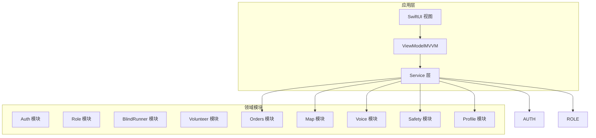
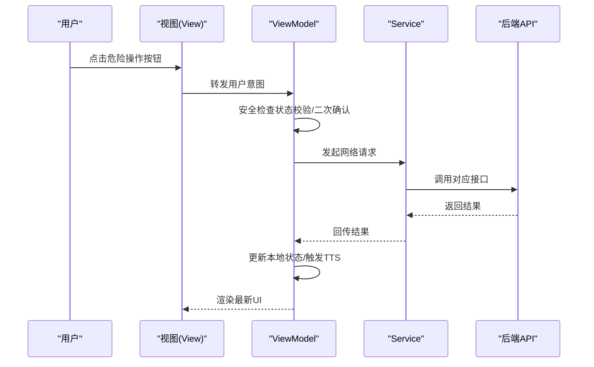
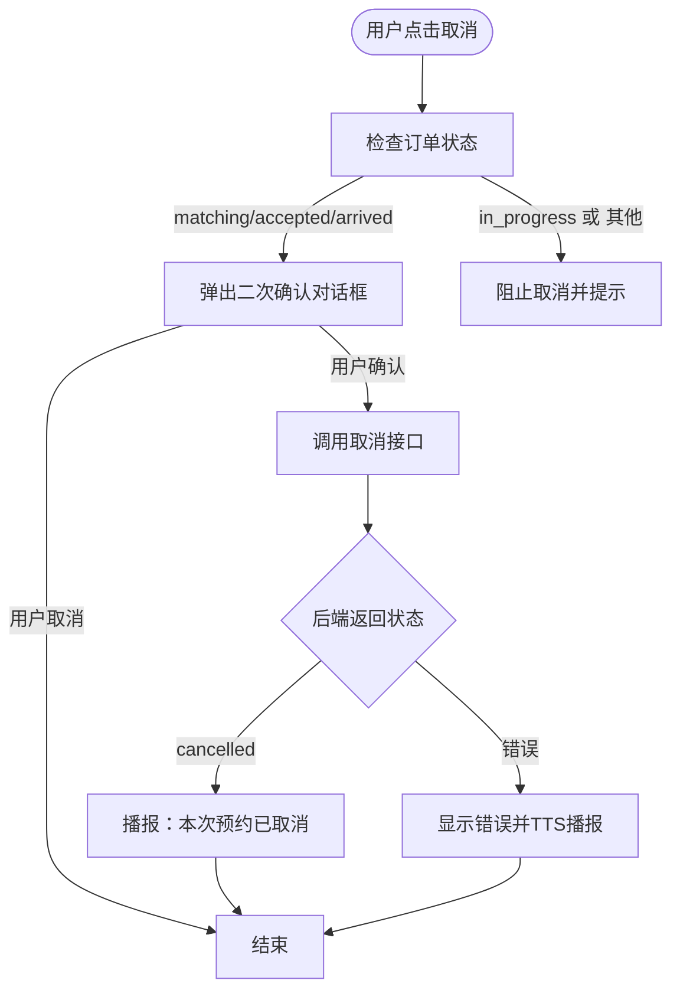
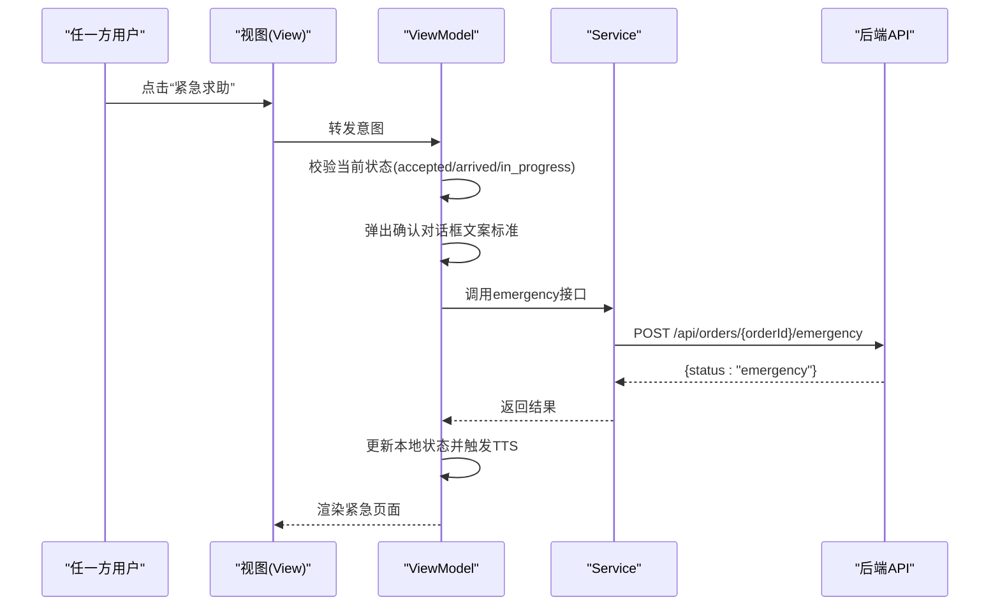
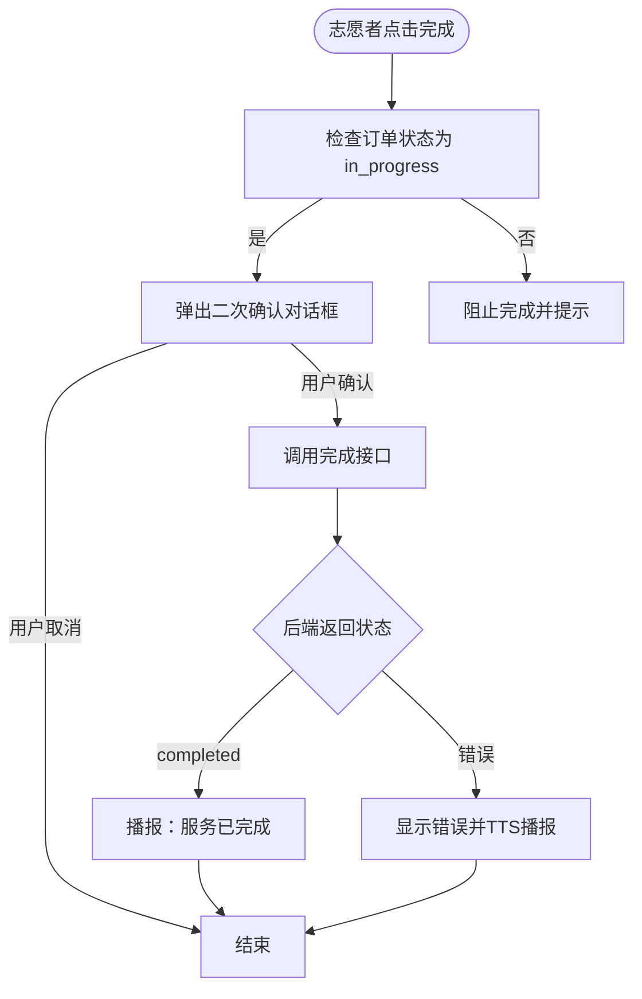
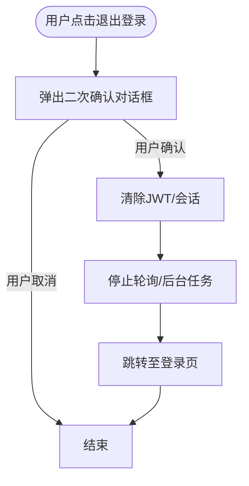
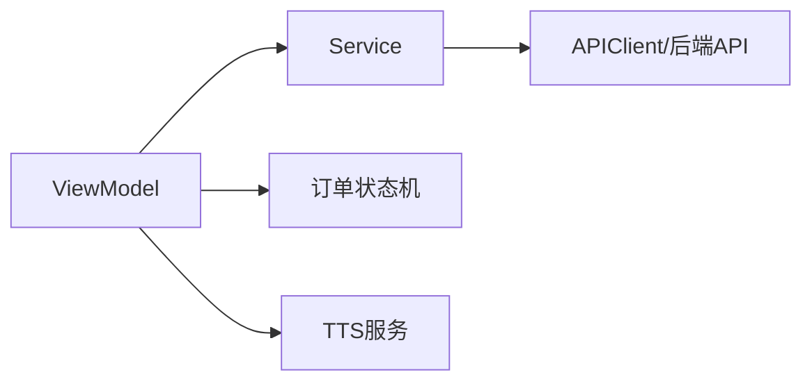

# 危险操作保护机制

<cite>
**本文引用的文件**
- [08-ios-architecture.md](file://docs/08-ios-architecture.md)
- [04-user-flows-and-state-machine.md](file://docs/04-user-flows-and-state-machine.md)
- [09-accessibility-and-voice-guidelines.md](file://docs/09-accessibility-and-voice-guidelines.md)
- [02-mvp-scope.md](file://docs/02-mvp-scope.md)
- [03-user-stories.md](file://docs/03-user-stories.md)
- [07-api-contract.openapi.yaml](file://docs/07-api-contract.openapi.yaml)
- [spec.md](file://openspec/changes/add-aidrun-ios-spring-mvp/specs/safety-basic-emergency/spec.md)
- [design.md](file://openspec/changes/add-aidrun-ios-spring-mvp/design.md)
- [10-ai-coding-tasks.md](file://docs/10-ai-coding-tasks.md)
</cite>

## 目录
1. [引言](#引言)
2. [项目结构](#项目结构)
3. [核心组件](#核心组件)
4. [架构总览](#架构总览)
5. [详细组件分析](#详细组件分析)
6. [依赖关系分析](#依赖关系分析)
7. [性能考虑](#性能考虑)
8. [故障排查指南](#故障排查指南)
9. [结论](#结论)
10. [附录](#附录)

## 引言
本文件面向“助盲跑”iOS端的危险操作安全保护机制，聚焦以下高风险动作的二次确认流程与交互设计规范：
- 取消订单
- 进入紧急状态
- 志愿者完成服务
- 退出登录

同时，定义确认对话框的文案标准与交互设计原则，并解释紧急状态下的系统行为（状态标记、TTS通知、数据记录等）。最后提供在ViewModel中实现安全检查的参考路径与最佳实践，帮助开发者在MVVM架构下统一落地安全策略。

## 项目结构
从架构文档可知，iOS端采用SwiftUI + MVVM模式，模块化组织如下：
- Core：应用环境、依赖容器、共享模型、应用状态
- Auth：手机号登录、JWT持久化、会话管理
- Role：角色切换与守卫规则
- BlindRunner：盲人端首页、个人资料、预约、订单状态
- Volunteer：志愿者首页、可用订单、服务记录、积分
- Orders：订单DTO、状态机辅助、轮询
- Map：高德地图桥接、当前位置、标记、距离计算
- Voice：TTS、重复当前状态、语音输入
- Safety：紧急确认与取消确认流程
- Profile：盲人与志愿者资料表单

图表来源
- [08-ios-architecture.md: 18-31:18-31](file://docs/08-ios-architecture.md#L18-L31)

章节来源
- [08-ios-architecture.md: 18-31:18-31](file://docs/08-ios-architecture.md#L18-L31)

## 核心组件
- ViewModel职责边界
  - View负责渲染状态与转发用户意图
  - ViewModel负责加载状态、验证状态、API调用、轮询、TTS触发
- 安全模块（Safety）
  - 提供危险操作的二次确认流程与文案标准
  - 与订单状态机、TTS服务协同工作
- 订单状态机（Orders）
  - 定义允许/禁止的状态流转，保障取消、紧急、完成等动作的合法性
- 无障碍与TTS（Voice）
  - 为危险操作提供确认弹窗，确保VoiceOver与TTS一致传达

章节来源
- [08-ios-architecture.md: 33-49:33-49](file://docs/08-ios-architecture.md#L33-L49)
- [09-accessibility-and-voice-guidelines.md: 88-107:88-107](file://docs/09-accessibility-and-voice-guidelines.md#L88-L107)

## 架构总览
危险操作在MVVM中的典型调用链：
- View触发用户意图（如点击“取消订单”）
- ViewModel执行安全检查（状态校验、二次确认）
- ViewModel调用Service层发起网络请求
- Service层通过APIClient访问后端API
- 成功后更新本地状态并触发TTS播报

图表来源
- [08-ios-architecture.md: 33-49:33-49](file://docs/08-ios-architecture.md#L33-L49)
- [07-api-contract.openapi.yaml: 343-364:343-364](file://docs/07-api-contract.openapi.yaml#L343-L364)

## 详细组件分析

### 取消订单（matching/accepted/arrived）
- 触发条件
  - 仅在matching、accepted、arrived状态下允许普通取消
  - in_progress阶段禁止普通取消，只能走emergency
- 二次确认流程
  - 弹出确认对话框，提示用户“确认取消本次预约？”
  - 用户确认后，调用取消接口，状态进入cancelled
- TTS与UI
  - 取消成功后播报“本次预约已取消”
  - UI更新至首页或相应状态页
- 错误处理
  - 若后端返回状态不合法，ViewModel应捕获错误并提示用户
  - 通过TTS播报错误信息，避免静默失败

图表来源
- [04-user-flows-and-state-machine.md: 72-118:72-118](file://docs/04-user-flows-and-state-machine.md#L72-L118)
- [07-api-contract.openapi.yaml: 343-364:343-364](file://docs/07-api-contract.openapi.yaml#L343-L364)
- [09-accessibility-and-voice-guidelines.md: 112-119:112-119](file://docs/09-accessibility-and-voice-guidelines.md#L112-L119)

章节来源
- [04-user-flows-and-state-machine.md: 72-118:72-118](file://docs/04-user-flows-and-state-machine.md#L72-L118)
- [07-api-contract.openapi.yaml: 343-364:343-364](file://docs/07-api-contract.openapi.yaml#L343-L364)
- [09-accessibility-and-voice-guidelines.md: 112-119:112-119](file://docs/09-accessibility-and-voice-guidelines.md#L112-L119)

### 进入紧急状态（accepted/arrived/in_progress）
- 触发条件
  - 仅在accepted、arrived、in_progress状态下允许紧急求助
  - emergency为终态，不支持恢复或继续执行生命周期动作
- 二次确认流程
  - 弹出确认对话框，文案标准：“是否确认进入求助状态？确认后，本次服务将标记为异常，系统会记录当前订单状态。”
  - 用户确认后，调用emergency接口，状态进入emergency
- 系统行为
  - TTS播报“已进入求助状态”
  - 双端轮询观察到emergency状态，另一方TTS播报并更新UI
  - MVP不自动外呼、不自动短信、不通知真实管理员
- 数据记录
  - 后端记录紧急事件，包含触发前的订单状态
  - 盲人端显示紧急联系人信息

图表来源
- [04-user-flows-and-state-machine.md: 230-257:230-257](file://docs/04-user-flows-and-state-machine.md#L230-L257)
- [09-accessibility-and-voice-guidelines.md: 97-106:97-106](file://docs/09-accessibility-and-voice-guidelines.md#L97-L106)
- [spec.md: 11-17:11-17](file://openspec/changes/add-aidrun-ios-spring-mvp/specs/safety-basic-emergency/spec.md#L11-L17)

章节来源
- [04-user-flows-and-state-machine.md: 230-257:230-257](file://docs/04-user-flows-and-state-machine.md#L230-L257)
- [09-accessibility-and-voice-guidelines.md: 97-106:97-106](file://docs/09-accessibility-and-voice-guidelines.md#L97-L106)
- [spec.md: 11-17:11-17](file://openspec/changes/add-aidrun-ios-spring-mvp/specs/safety-basic-emergency/spec.md#L11-L17)

### 志愿者完成服务（in_progress）
- 触发条件
  - 仅在in_progress状态下允许完成服务
- 二次确认流程
  - 弹出确认对话框，提示“确认结束本次服务？”
  - 用户确认后，调用complete接口，状态进入completed
- 系统行为
  - 轮询停止，UI更新至完成页
  - 可能触发积分奖励与服务记录

图表来源
- [04-user-flows-and-state-machine.md: 72-118:72-118](file://docs/04-user-flows-and-state-machine.md#L72-L118)
- [09-accessibility-and-voice-guidelines.md: 112-119:112-119](file://docs/09-accessibility-and-voice-guidelines.md#L112-L119)

章节来源
- [04-user-flows-and-state-machine.md: 72-118:72-118](file://docs/04-user-flows-and-state-machine.md#L72-L118)
- [09-accessibility-and-voice-guidelines.md: 112-119:112-119](file://docs/09-accessibility-and-voice-guidelines.md#L112-L119)

### 退出登录（Logout）
- 二次确认流程
  - 弹出确认对话框，提示“确认退出当前账号？”
  - 用户确认后，清除会话并跳转至登录页
- 会话管理
  - MVP使用UserDefaults存储JWT，生产需迁移到Keychain
  - 退出登录后应停止轮询与后台任务

图表来源
- [08-ios-architecture.md: 78-82:78-82](file://docs/08-ios-architecture.md#L78-L82)
- [10-ai-coding-tasks.md: 84-94:84-94](file://docs/10-ai-coding-tasks.md#L84-L94)

章节来源
- [08-ios-architecture.md: 78-82:78-82](file://docs/08-ios-architecture.md#L78-L82)
- [10-ai-coding-tasks.md: 84-94:84-94](file://docs/10-ai-coding-tasks.md#L84-L94)

### 确认对话框文案标准与交互设计原则
- 文案标准
  - 紧急求助：是否确认进入求助状态？确认后，本次服务将标记为异常，系统会记录当前订单状态。
  - 取消订单：确认取消本次预约？
  - 完成服务：确认结束本次服务？
  - 退出登录：确认退出当前账号？
- 交互设计
  - 采用ActionSheet或Alert，明确“确认/取消”选项
  - 确认按钮使用高对比度与大字号，符合无障碍要求
  - 确认后立即执行网络请求，避免用户误以为仍可撤销

章节来源
- [09-accessibility-and-voice-guidelines.md: 97-106:97-106](file://docs/09-accessibility-and-voice-guidelines.md#L97-L106)
- [03-user-stories.md: 777-789:777-789](file://docs/03-user-stories.md#L777-L789)

### 紧急状态下的系统行为
- 状态标记
  - emergency为终态，不支持恢复或继续执行生命周期动作
- TTS通知
  - 进入emergency后播报“已进入求助状态”
  - 双端轮询到emergency后播报并更新UI
- 数据记录
  - 后端记录紧急事件，包含触发前的订单状态
  - 盲人端显示紧急联系人信息

章节来源
- [04-user-flows-and-state-machine.md: 230-257:230-257](file://docs/04-user-flows-and-state-machine.md#L230-L257)
- [spec.md: 27-41:27-41](file://openspec/changes/add-aidrun-ios-spring-mvp/specs/safety-basic-emergency/spec.md#L27-L41)

### 在ViewModel中实现安全检查的参考路径
- 订单状态相关ViewModel
  - 盲人端订单状态页：BlindOrderStatusViewModel（包含轮询、TTS、确认开始、取消、紧急）
  - 志愿者订单详情页：VolunteerOrderDetailViewModel（包含接单、到达、完成、取消、紧急）
- 安全检查要点
  - 在ViewModel中先做状态校验，再弹出确认对话框
  - 确认后再调用Service层发起网络请求
  - 成功后更新本地状态并触发TTS播报
- 会话与角色切换
  - 登录与角色切换由AuthViewModel与RoleViewModel负责
  - 角色切换被阻塞时，应弹出提示“您有进行中的订单，无法切换角色”

章节来源
- [08-ios-architecture.md: 42-49:42-49](file://docs/08-ios-architecture.md#L42-L49)
- [04-user-flows-and-state-machine.md: 259-273:259-273](file://docs/04-user-flows-and-state-machine.md#L259-L273)
- [02-mvp-scope.md: 65-73:65-73](file://docs/02-mvp-scope.md#L65-L73)

## 依赖关系分析
- ViewModel对Service的依赖
  - ViewModel通过Service层封装网络调用，隔离UI与网络细节
- Service对API的依赖
  - Service通过APIClient协议对接Mock与真实后端，统一调用入口
- 安全模块对状态机与TTS的依赖
  - 安全检查依赖订单状态机规则
  - 确认后通过TTS播报结果，提升无障碍体验

图表来源
- [08-ios-architecture.md: 68-76:68-76](file://docs/08-ios-architecture.md#L68-L76)
- [04-user-flows-and-state-machine.md: 72-118:72-118](file://docs/04-user-flows-and-state-machine.md#L72-L118)

章节来源
- [08-ios-architecture.md: 68-76:68-76](file://docs/08-ios-architecture.md#L68-L76)
- [04-user-flows-and-state-machine.md: 72-118:72-118](file://docs/04-user-flows-and-state-machine.md#L72-L118)

## 性能考虑
- 轮询频率与状态变更
  - 订单状态页每5秒轮询一次，避免过于频繁导致电量消耗
  - 状态变更时触发TTS播报，避免重复播报同一状态
- 网络重试与错误映射
  - APIClient负责错误映射为用户友好消息与TTS提示
  - MVP不引入复杂离线队列，简化实现

章节来源
- [08-ios-architecture.md: 125-139:125-139](file://docs/08-ios-architecture.md#L125-L139)
- [08-ios-architecture.md: 70-76:70-76](file://docs/08-ios-architecture.md#L70-L76)

## 故障排查指南
- 紧急求助无效
  - 检查当前订单状态是否为accepted/arrived/in_progress
  - 确认确认对话框已弹出且用户已确认
  - 查看后端返回状态是否为emergency
- 取消失败
  - 检查是否处于matching/accepted/arrived状态
  - 查看后端返回是否为cancelled
- 退出登录后仍显示会话
  - 确认UserDefaults中的JWT已被清除
  - 检查是否停止了轮询与后台任务
- TTS未播报
  - 确认SpeechService初始化与权限
  - 检查状态变更逻辑是否触发播报

章节来源
- [04-user-flows-and-state-machine.md: 230-257:230-257](file://docs/04-user-flows-and-state-machine.md#L230-L257)
- [07-api-contract.openapi.yaml: 343-364:343-364](file://docs/07-api-contract.openapi.yaml#L343-L364)
- [08-ios-architecture.md: 78-82:78-82](file://docs/08-ios-architecture.md#L78-L82)

## 结论
通过在MVVM架构下将安全检查前置到ViewModel层，并结合明确的确认对话框文案与TTS播报，可以有效降低误操作风险。紧急状态下的终态设计与数据记录满足MVP需求，同时为未来扩展留出空间。建议在开发过程中严格遵循本文档的交互与文案标准，确保一致性与可访问性。

## 附录
- 相关OpenAPI端点
  - 取消订单：POST /api/orders/{orderId}/cancel
  - 紧急求助：POST /api/orders/{orderId}/emergency
- 无障碍与TTS节点清单
  - 进入盲人首页、订单提交成功、匹配中、志愿者已接单、志愿者已到达、请确认开始服务、服务已开始、服务已完成、进入求助状态、错误提示

章节来源
- [07-api-contract.openapi.yaml: 343-364:343-364](file://docs/07-api-contract.openapi.yaml#L343-L364)
- [09-accessibility-and-voice-guidelines.md: 13-28:13-28](file://docs/09-accessibility-and-voice-guidelines.md#L13-L28)