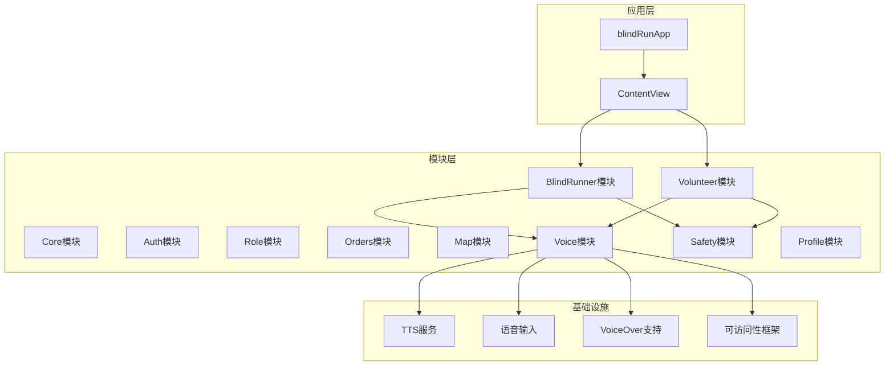
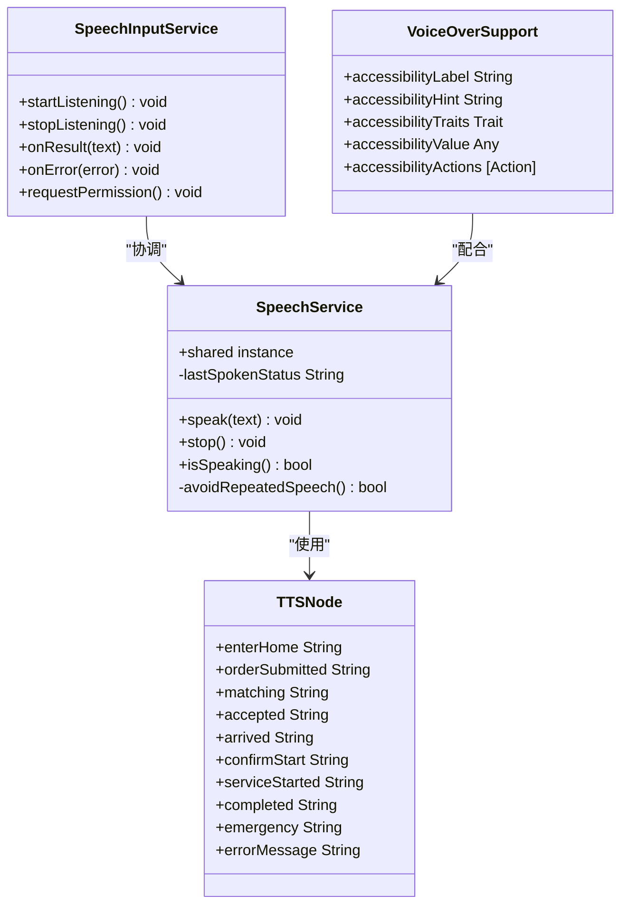
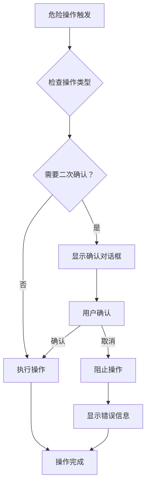
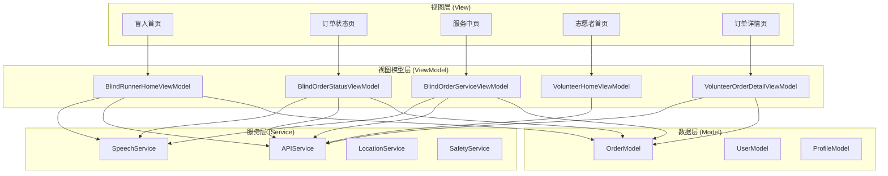
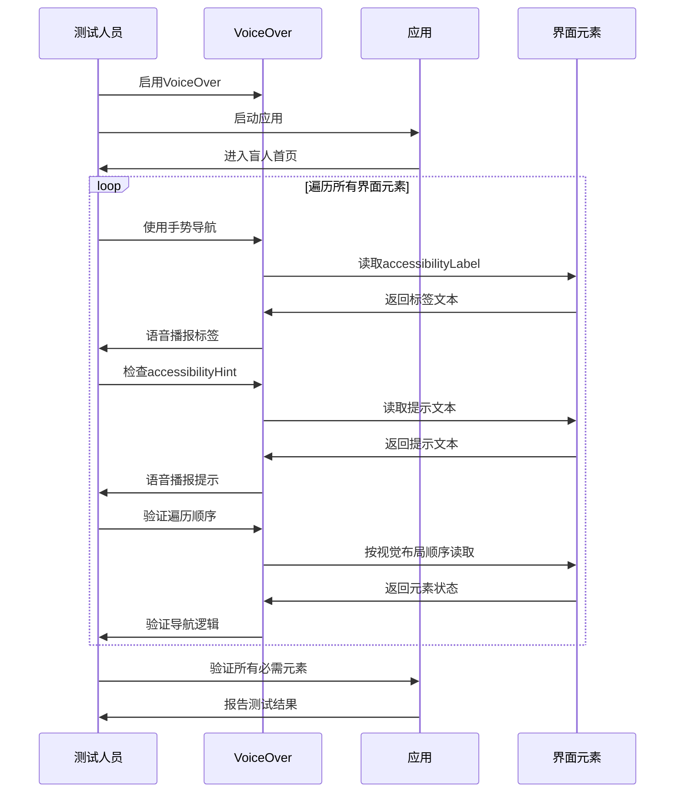
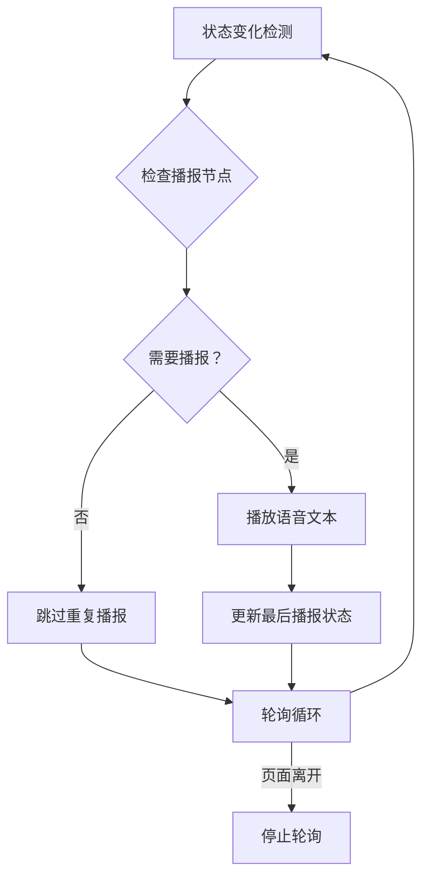
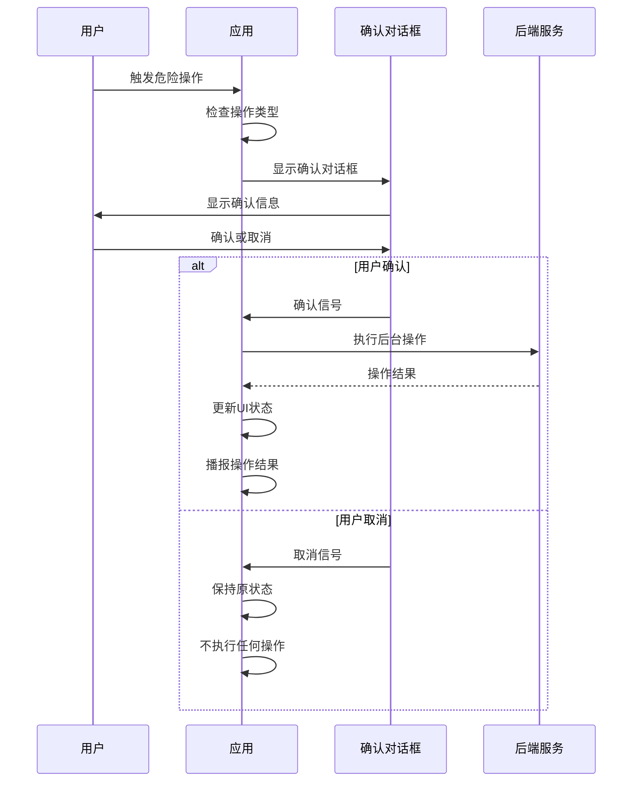
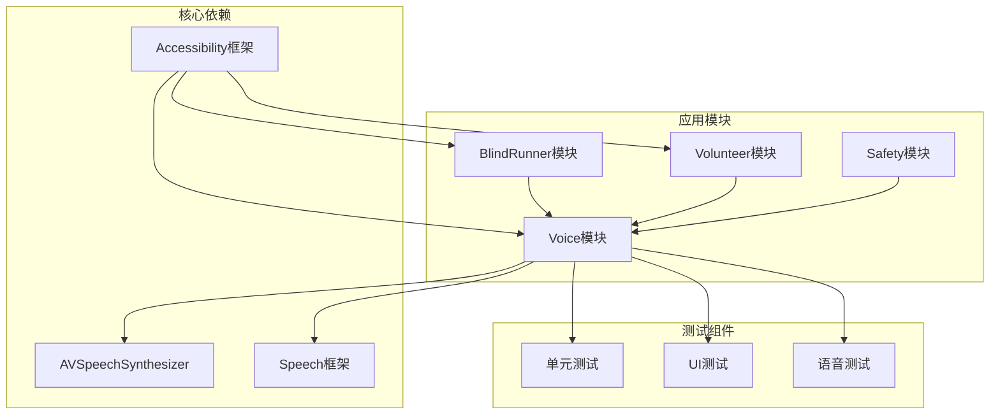
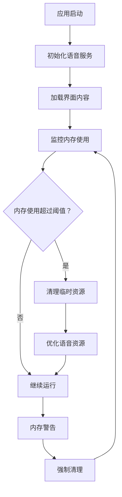

# 可访问性测试与验证

<cite>
**本文档引用的文件**
- [blindRunApp.swift](file://blindRun/blindRunApp.swift)
- [ContentView.swift](file://blindRun/ContentView.swift)
- [09-accessibility-and-voice-guidelines.md](file://docs/09-accessibility-and-voice-guidelines.md)
- [08-ios-architecture.md](file://docs/08-ios-architecture.md)
- [03-user-stories.md](file://docs/03-user-stories.md)
- [04-user-flows-and-state-machine.md](file://docs/04-user-flows-and-state-machine.md)
- [02-mvp-scope.md](file://docs/02-mvp-scope.md)
- [blindRunTests.swift](file://blindRunTests/blindRunTests.swift)
- [blindRunUITests.swift](file://blindRunUITests/blindRunUITests.swift)
- [blindRunUITestsLaunchTests.swift](file://blindRunUITests/blindRunUITestsLaunchTests.swift)
</cite>

## 目录
1. [简介](#简介)
2. [项目结构](#项目结构)
3. [核心组件](#核心组件)
4. [架构概览](#架构概览)
5. [详细组件分析](#详细组件分析)
6. [依赖关系分析](#依赖关系分析)
7. [性能考虑](#性能考虑)
8. [故障排除指南](#故障排除指南)
9. [结论](#结论)
10. [附录](#附录)

## 简介

本文件建立了完整的可访问性测试和验证体系，专注于iOS盲人跑步应用的VoiceOver导航测试、TTS语音播报测试以及危险操作保护功能。该体系基于项目的设计文档和架构规范，确保为视障用户提供无障碍的完整用户体验。

## 项目结构

盲人跑步应用采用SwiftUI + MVVM架构，专门针对无障碍和语音功能进行了优化设计：



**图表来源**
- [08-ios-architecture.md:18-31](file://docs/08-ios-architecture.md#L18-L31)
- [09-accessibility-and-voice-guidelines.md:13-110](file://docs/09-accessibility-and-voice-guidelines.md#L13-L110)

**章节来源**
- [08-ios-architecture.md:1-82](file://docs/08-ios-architecture.md#L1-L82)
- [09-accessibility-and-voice-guidelines.md:1-143](file://docs/09-accessibility-and-voice-guidelines.md#L1-L143)

## 核心组件

### 语音服务组件

应用实现了完整的语音服务基础设施，包括TTS播报和语音输入功能：



**图表来源**
- [09-accessibility-and-voice-guidelines.md:13-36](file://docs/09-accessibility-and-voice-guidelines.md#L13-L36)
- [08-ios-architecture.md:29-29](file://docs/08-ios-architecture.md#L29-L29)

### 危险操作保护组件

实现了多层安全防护机制，防止误操作：



**图表来源**
- [09-accessibility-and-voice-guidelines.md:88-107](file://docs/09-accessibility-and-voice-guidelines.md#L88-L107)
- [04-user-flows-and-state-machine.md:230-257](file://docs/04-user-flows-and-state-machine.md#L230-L257)

**章节来源**
- [09-accessibility-and-voice-guidelines.md:13-107](file://docs/09-accessibility-and-voice-guidelines.md#L13-L107)
- [04-user-flows-and-state-machine.md:230-257](file://docs/04-user-flows-and-state-machine.md#L230-L257)

## 架构概览

应用采用MVVM架构模式，专门为无障碍功能提供了清晰的分层：



**图表来源**
- [08-ios-architecture.md:33-49](file://docs/08-ios-architecture.md#L33-L49)
- [09-accessibility-and-voice-guidelines.md:13-36](file://docs/09-accessibility-and-voice-guidelines.md#L13-L36)

## 详细组件分析

### VoiceOver 导航测试

#### 测试方法和步骤

VoiceOver导航测试需要验证所有关键界面元素的可访问性：

**测试流程序列图：**



**图表来源**
- [09-accessibility-and-voice-guidelines.md:37-61](file://docs/09-accessibility-and-voice-guidelines.md#L37-L61)
- [03-user-stories.md:705-719](file://docs/03-user-stories.md#L705-L719)

#### VoiceOver 元素覆盖清单

| 元素类别 | 必需元素 | VoiceOver 标签要求 | 遍历顺序要求 |
|---------|---------|-------------------|-------------|
| 登录页面 | 手机号码输入框、验证码输入框、登录按钮 | 清晰的功能描述 | 从上到下逻辑顺序 |
| 角色选择 | 盲人跑者、志愿者按钮 | 角色功能说明 | 水平排列逻辑 |
| 盲人首页 | 订单状态文本、创建预约按钮、设置按钮 | 当前状态和操作说明 | 重要功能优先 |
| 创建预约 | 出发地描述、目的地描述、预约时间、提交按钮 | 字段功能和操作说明 | 表单字段顺序 |
| 订单状态 | 状态文本、确认开始按钮、取消订单按钮、紧急求助按钮 | 状态信息和操作选项 | 从上到下逻辑 |
| 服务中页面 | 服务控制按钮、紧急求助按钮、完成服务按钮 | 服务状态和操作说明 | 重要功能优先 |

**章节来源**
- [09-accessibility-and-voice-guidelines.md:45-61](file://docs/09-accessibility-and-voice-guidelines.md#L45-L61)
- [03-user-stories.md:705-719](file://docs/03-user-stories.md#L705-L719)

### TTS 语音播报测试

#### 播报节点检查清单

TTS语音播报系统需要覆盖以下关键节点：

**播报节点流程图：**



**图表来源**
- [09-accessibility-and-voice-guidelines.md:13-36](file://docs/09-accessibility-and-voice-guidelines.md#L13-L36)
- [04-user-flows-and-state-machine.md:275-299](file://docs/04-user-flows-and-state-machine.md#L275-L299)

#### 关键播报节点验证

| 播报节点 | 验证标准 | 语音质量要求 | 验证方法 |
|---------|---------|-------------|---------|
| 进入盲人首页 | 语音清晰、语速适中、无杂音 | 中文普通话、标准音质 | 语音合成质量测试 |
| 订单提交成功 | 提示明确、包含确认信息 | 语调上扬、表达积极 | 人工听觉测试 |
| 匹配中 | 状态说明、预计等待时间 | 语速正常、清晰易懂 | 语音内容验证 |
| 志愿者已接单 | 接单确认、等待到达 | 语调稳定、信息完整 | 人工复核 |
| 志愿者已到达 | 到达提醒、确认开始 | 语速稍快、强调关键信息 | 语音效果评估 |
| 请确认开始服务 | 操作指导、确认指令 | 语调温和、表达礼貌 | 用户体验测试 |
| 服务已开始 | 服务确认、安全提醒 | 语速平稳、信息准确 | 人工验证 |
| 服务已完成 | 结束确认、感谢信息 | 语调上扬、表达感谢 | 语音质量评估 |
| 进入求助状态 | 紧急状态、帮助请求 | 语速适中、表达紧迫感 | 语音情感测试 |
| 错误提示 | 错误说明、解决建议 | 语速正常、表达清晰 | 错误处理验证 |

**章节来源**
- [09-accessibility-and-voice-guidelines.md:17-29](file://docs/09-accessibility-and-voice-guidelines.md#L17-L29)
- [04-user-flows-and-state-machine.md:275-299](file://docs/04-user-flows-and-state-machine.md#L275-L299)

### 危险操作保护测试

#### 二次确认流程验证

危险操作保护机制需要严格的二次确认流程：

**危险操作确认流程：**



**图表来源**
- [09-accessibility-and-voice-guidelines.md:88-107](file://docs/09-accessibility-and-voice-guidelines.md#L88-L107)
- [04-user-flows-and-state-machine.md:230-257](file://docs/04-user-flows-and-state-machine.md#L230-L257)

#### 危险操作类型和验证标准

| 操作类型 | 确认信息要求 | 验证标准 | TTS播报要求 |
|---------|------------|---------|-----------|
| 取消订单 | "确认取消当前订单？" | 确认后订单状态变为cancelled | 播报取消确认 |
| 进入求助 | "确认进入求助状态？确认后本次服务将标记为异常" | 确认后订单状态变为emergency | 播报求助状态 |
| 结束服务 | "确认完成服务？" | 确认后订单状态变为completed | 播报完成确认 |
| 退出登录 | "确认退出登录？" | 确认后返回登录页面 | 播报登出确认 |

**章节来源**
- [09-accessibility-and-voice-guidelines.md:90-107](file://docs/09-accessibility-and-voice-guidelines.md#L90-L107)
- [04-user-flows-and-state-machine.md:230-257](file://docs/04-user-flows-and-state-machine.md#L230-L257)

## 依赖关系分析

### 可访问性组件依赖图



**图表来源**
- [08-ios-architecture.md:15-16](file://docs/08-ios-architecture.md#L15-L16)
- [09-accessibility-and-voice-guidelines.md:13-110](file://docs/09-accessibility-and-voice-guidelines.md#L13-L110)

### 测试覆盖率分析

| 测试类型 | 覆盖范围 | 验证标准 | 工具要求 |
|---------|---------|---------|---------|
| VoiceOver导航测试 | 所有关键界面元素 | accessibilityLabel、accessibilityHint、遍历顺序 | VoiceOver工具 |
| TTS播报测试 | 所有播报节点 | 语音质量、内容准确性、播报时机 | 语音合成测试 |
| 危险操作测试 | 所有危险操作 | 二次确认、错误处理 | 手动测试 |
| 自动化测试 | 核心功能流程 | 回归测试、性能测试 | XCTest框架 |
| 性能测试 | 语音延迟、内存使用 | 响应时间、资源占用 | 性能分析工具 |

**章节来源**
- [09-accessibility-and-voice-guidelines.md:131-139](file://docs/09-accessibility-and-voice-guidelines.md#L131-L139)
- [03-user-stories.md:705-807](file://docs/03-user-stories.md#L705-L807)

## 性能考虑

### 语音播报性能优化

语音播报系统的性能优化策略：

1. **避免重复播报**：通过记忆最后播报的状态来防止语音重复
2. **智能轮询**：订单相关页面每5秒轮询一次，其他页面不轮询
3. **语音队列管理**：合理管理语音播报队列，避免语音冲突
4. **内存优化**：及时释放不再使用的语音资源

### 内存和资源管理



## 故障排除指南

### 常见问题诊断

#### VoiceOver 无法正常工作

**症状**：VoiceOver无法读取界面元素

**诊断步骤**：
1. 检查VoiceOver是否已启用
2. 验证accessibilityLabel是否正确设置
3. 确认元素是否在可访问性树中
4. 检查元素的可见性和可用性状态

**解决方案**：
- 重新设置accessibilityLabel
- 确保元素具有正确的accessibilityTraits
- 检查视图层次结构的可访问性

#### TTS 播报异常

**症状**：语音播报不完整或出现错误

**诊断步骤**：
1. 检查AVSpeechSynthesizer状态
2. 验证语音文本格式
3. 确认语音服务权限
4. 检查网络连接状态

**解决方案**：
- 重置语音服务实例
- 验证语音文本编码
- 检查系统语音设置

#### 危险操作确认失效

**症状**：危险操作没有二次确认

**诊断步骤**：
1. 检查确认对话框是否正确显示
2. 验证用户交互响应
3. 确认后端操作执行
4. 检查状态更新逻辑

**解决方案**：
- 修复确认对话框显示逻辑
- 检查用户交互事件处理
- 验证后端API调用

**章节来源**
- [09-accessibility-and-voice-guidelines.md:131-139](file://docs/09-accessibility-and-voice-guidelines.md#L131-L139)

## 结论

本可访问性测试与验证体系为盲人跑步应用提供了全面的无障碍保障。通过VoiceOver导航测试、TTS语音播报测试和危险操作保护测试的有机结合，确保了视障用户能够完整、安全地使用应用的所有核心功能。

体系的核心优势包括：
- **完整覆盖**：涵盖所有关键界面元素和功能流程
- **严格标准**：基于项目设计文档的详细验收标准
- **实用性强**：提供具体的测试方法和验证步骤
- **可扩展性**：支持未来的功能扩展和改进

## 附录

### 自动化测试脚本示例

#### VoiceOver 导航测试脚本

```swift
// VoiceOver导航测试示例
func testVoiceOverNavigation() {
    let app = XCUIApplication()
    app.launch()
    
    // 启用VoiceOver
    enableVoiceOver()
    
    // 遍历所有关键元素
    let elements = getAllAccessibleElements()
    
    for element in elements {
        // 检查accessibilityLabel
        XCTAssertTrue(element.label != nil, "Element missing accessibility label")
        
        // 检查accessibilityHint
        XCTAssertTrue(element.hint != nil, "Element missing accessibility hint")
        
        // 验证遍历顺序
        validateTraversalOrder(element)
    }
}
```

#### TTS 播报测试脚本

```swift
// TTS播报测试示例
func testTTSSpeechNodes() {
    let app = XCUIApplication()
    app.launch()
    
    // 测试所有播报节点
    let speechNodes = [
        "进入盲人首页",
        "订单提交成功", 
        "匹配中",
        "志愿者已接单",
        "志愿者已到达",
        "请确认开始服务",
        "服务已开始",
        "服务已完成",
        "进入求助状态",
        "错误提示"
    ]
    
    for node in speechNodes {
        // 触发状态变化
        triggerStatusChange(node)
        
        // 验证语音播报
        XCTAssertTrue(isSpeechPlaying(node), "Speech not playing for node: \(node)")
        
        // 验证语音质量
        validateSpeechQuality(node)
    }
}
```

#### 危险操作测试脚本

```swift
// 危险操作测试示例
func testDangerousActions() {
    let app = XCUIApplication()
    app.launch()
    
    let dangerousActions = [
        "取消订单",
        "进入求助",
        "结束服务", 
        "退出登录"
    ]
    
    for action in dangerousActions {
        // 触发危险操作
        triggerDangerousAction(action)
        
        // 验证确认对话框
        XCTAssertTrue(isConfirmationDialogVisible(), "Confirmation dialog not shown for \(action)")
        
        // 验证用户确认
        confirmAction()
        
        // 验证操作执行
        XCTAssertTrue(isActionExecuted(action), "Action not executed: \(action)")
    }
}
```

### 手动测试流程指南

#### 完整用户流程验证

**盲人跑者完整流程测试**：

1. **登录流程**：
   - 启用VoiceOver
   - 输入手机号和验证码
   - 验证登录按钮的可访问性
   - 检查登录后的页面状态

2. **角色选择流程**：
   - 验证角色选择按钮的标签
   - 检查角色切换的可访问性
   - 确认角色选择后的导航

3. **预约创建流程**：
   - 验证所有输入字段的可访问性
   - 检查提交按钮的状态
   - 确认预约提交后的状态变化

4. **订单状态跟踪**：
   - 验证状态轮询机制
   - 检查TTS播报的准确性
   - 确认紧急求助功能

**志愿者完整流程测试**：

1. **认证流程**：
   - 验证认证页面的可访问性
   - 检查可用性开关的状态
   - 确认订单列表的导航

2. **订单处理流程**：
   - 验证订单详情的可访问性
   - 检查各种操作按钮的状态
   - 确认状态转换的语音播报

3. **服务完成流程**：
   - 验证服务完成的确认
   - 检查评分功能的可访问性
   - 确认回到首页的导航

#### 验收标准检查清单

**可访问性验收标准**：

- [ ] 所有关键界面元素都有正确的accessibilityLabel
- [ ] 所有关键界面元素都有正确的accessibilityHint  
- [ ] VoiceOver遍历顺序符合视觉布局逻辑
- [ ] 所有必需的TTS播报节点都能正常播报
- [ ] 危险操作都有二次确认机制
- [ ] 所有按钮都有足够的触摸目标大小
- [ ] 文字和控件在深色和浅色模式下都可读
- [ ] 语音播报的语速和音质符合要求

**功能完整性检查**：

- [ ] 登录认证功能完整
- [ ] 角色切换功能正常
- [ ] 预约创建和管理功能
- [ ] 订单状态跟踪功能
- [ ] 紧急求助功能
- [ ] 语音输入功能
- [ ] 设置和配置功能

**章节来源**
- [09-accessibility-and-voice-guidelines.md:131-139](file://docs/09-accessibility-and-voice-guidelines.md#L131-L139)
- [03-user-stories.md:705-807](file://docs/03-user-stories.md#L705-L807)