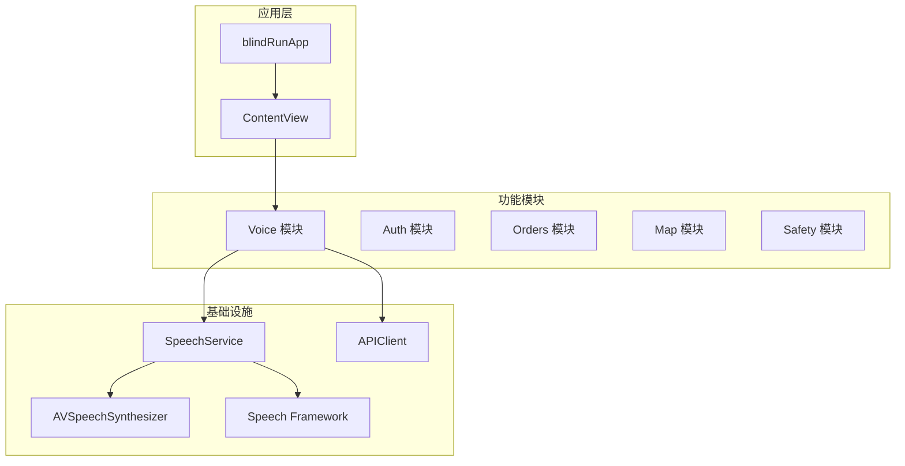
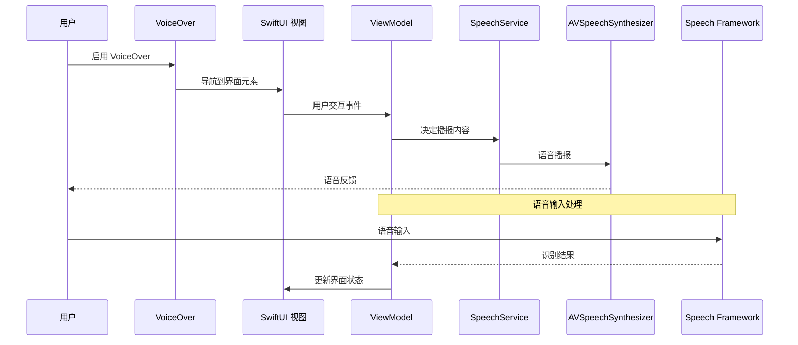
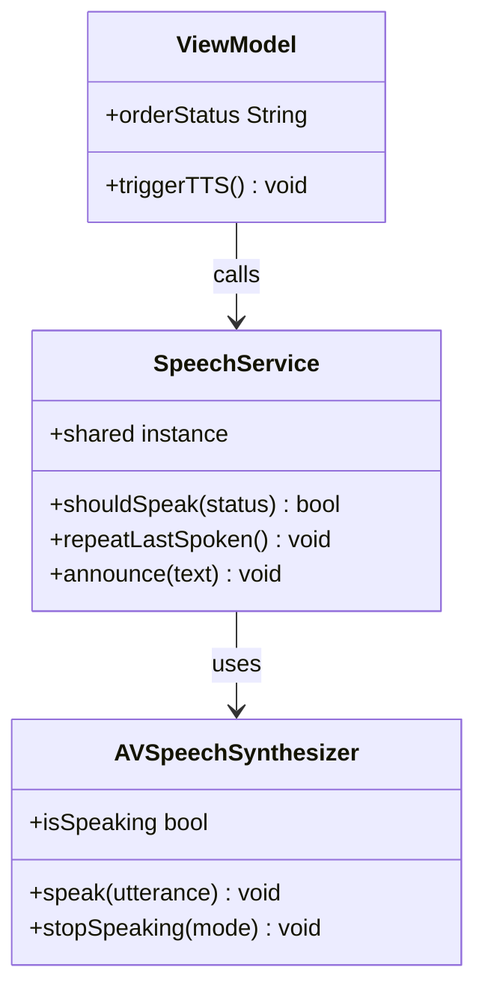
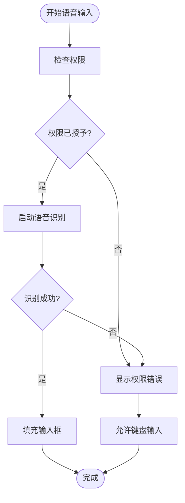
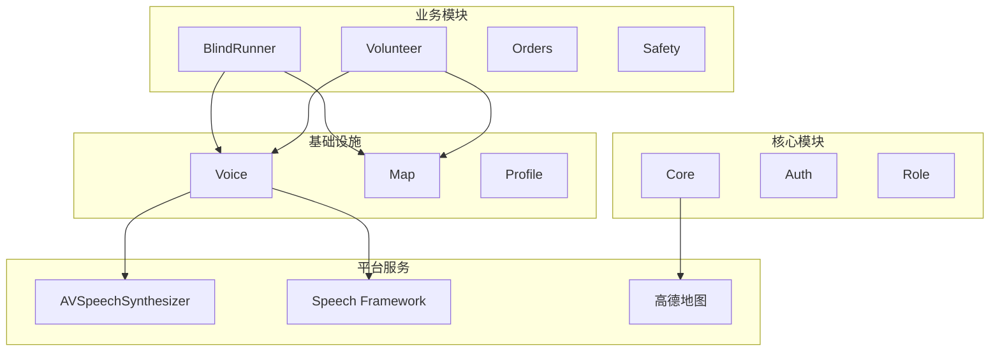

# 无障碍开发规范

<cite>
**本文引用的文件**
- [无障碍与语音指南](file://docs/09-accessibility-and-voice-guidelines.md)
- [产品需求文档](file://docs/01-product-requirements.md)
- [iOS 架构](file://docs/08-ios-architecture.md)
- [用户故事](file://docs/03-user-stories.md)
- [轮询机制](file://docs/04-user-flows-and-state-machine.md)
- [OpenSpec 变更](file://openspec/changes/add-aidrun-ios-spring-mvp/specs/accessibility-voice-ui/spec.md)
- [任务清单](file://openspec/changes/add-aidrun-ios-spring-mvp/tasks.md)
- [设计决策](file://openspec/changes/add-aidrun-ios-spring-mvp/design.md)
- [应用入口](file://blindRun/blindRunApp.swift)
- [内容视图](file://blindRun/ContentView.swift)
- [UI 测试](file://blindRunUITests/blindRunUITests.swift)
- [UI 启动测试](file://blindRunUITests/blindRunUITestsLaunchTests.swift)
- [单元测试](file://blindRunTests/blindRunTests.swift)
</cite>

## 目录
1. [简介](#简介)
2. [项目结构](#项目结构)
3. [核心组件](#核心组件)
4. [架构概览](#架构概览)
5. [详细组件分析](#详细组件分析)
6. [依赖关系分析](#依赖关系分析)
7. [性能考虑](#性能考虑)
8. [故障排除指南](#故障排除指南)
9. [结论](#结论)
10. [附录](#附录)

## 简介
本规范基于 AidRun MVP v0.3 项目，制定 blindRun iOS 应用的无障碍开发标准。重点涵盖 VoiceOver 支持、TTS 语音播报、语音输入处理、可访问性测试方法等，确保盲人用户能够通过语音交互高效完成完整的订单服务闭环。

## 项目结构
blindRun 项目采用 SwiftUI + MVVM 架构，模块化设计支持无障碍功能的统一实现：

**图表来源**
- [应用入口:10-17](file://blindRun/blindRunApp.swift#L10-L17)
- [内容视图:10-20](file://blindRun/ContentView.swift#L10-L20)
- [iOS 架构:18-32](file://docs/08-ios-architecture.md#L18-L32)

**章节来源**
- [应用入口:10-17](file://blindRun/blindRunApp.swift#L10-L17)
- [内容视图:10-20](file://blindRun/ContentView.swift#L10-L20)
- [iOS 架构:18-32](file://docs/08-ios-architecture.md#L18-L32)

## 核心组件
无障碍功能的核心组件包括：

### 1. 语音服务层 (SpeechService)
- 单一职责的语音播报服务
- 状态变更时的智能播报控制
- 防止轮询过程中的重复播报

### 2. VoiceOver 支持层
- accessibilityLabel 的标准化设置
- accessibilityHint 的语义化描述
- 适当的 accessibilityTraits 配置

### 3. TTS 状态节点
- 盲人首页进入
- 订单提交成功
- 匹配中状态
- 志愿者已接单
- 志愿者已到达
- 请确认开始服务
- 服务已开始
- 服务已完成
- 进入求助状态
- 错误提示

**章节来源**
- [无障碍与语音指南:13-36](file://docs/09-accessibility-and-voice-guidelines.md#L13-L36)
- [无障碍与语音指南:37-61](file://docs/09-accessibility-and-voice-guidelines.md#L37-L61)

## 架构概览
无障碍功能在整体架构中的位置和交互关系：

**图表来源**
- [轮询机制:278-299](file://docs/04-user-flows-and-state-machine.md#L278-L299)
- [iOS 架构:33-49](file://docs/08-ios-architecture.md#L33-L49)

## 详细组件分析

### VoiceOver 支持实现标准

#### 1. 基础标签设置
每个关键控件必须包含：
- **accessibilityLabel**: 清晰的功能描述
- **accessibilityHint**: 操作结果说明
- **accessibilityTraits**: 正确的控件类型标识

#### 2. 关键控件覆盖范围
- 登录手机号输入框和验证码输入框
- 角色切换控件
- 盲人首页状态文本
- 预约创建表单字段
- 位置权限提示
- 提交预约按钮
- 取消订单按钮
- 紧急按钮
- 确认开始按钮
- 重复当前状态按钮
- 志愿者可用性开关
- 可用订单行
- 接受、到达、完成、取消、紧急操作
- 评分控件

#### 3. 无障碍遍历顺序
确保 VoiceOver 导航顺序与视觉布局逻辑一致，提供自然的浏览体验。

**章节来源**
- [无障碍与语音指南:37-61](file://docs/09-accessibility-and-voice-guidelines.md#L37-L61)
- [用户故事:703-720](file://docs/03-user-stories.md#L703-L720)

### TTS 语音播报规范

#### 1. 语音播报服务架构

**图表来源**
- [无障碍与语音指南:30-35](file://docs/09-accessibility-and-voice-guidelines.md#L30-L35)

#### 2. 智能播报策略
- 使用单一共享 SpeechService 实例
- ViewModel 在状态变更时决定播报内容
- 轮询过程中避免重复播报
- 每个关键盲人页面提供"重复当前状态"按钮

#### 3. TTS 内容管理
- 状态变更时自动播报
- 错误状态提供清晰的语音提示
- 支持重复播报功能

**章节来源**
- [无障碍与语音指南:13-36](file://docs/09-accessibility-and-voice-guidelines.md#L13-L36)
- [轮询机制:275-299](file://docs/04-user-flows-and-state-machine.md#L275-L299)

### 语音输入处理规范

#### 1. 语音输入适用场景
- 出发地点文本描述
- 目的地/路线描述
- 备注信息
- 志愿者服务摘要（如有用）

#### 2. 语音输入实现原则
- 不构建全局 AI 助手
- 不将自然语言时间解析作为核心功能
- 预约时间仍使用 DatePicker
- 语音输入失败时显示错误并允许键盘输入
- 仅在用户开始语音输入时请求麦克风和语音识别权限

#### 3. 语音输入错误处理

**图表来源**
- [无障碍与语音指南:71-87](file://docs/09-accessibility-and-voice-guidelines.md#L71-L87)

**章节来源**
- [无障碍与语音指南:71-87](file://docs/09-accessibility-and-voice-guidelines.md#L71-L87)

### 危险操作二次确认机制

#### 1. 需要二次确认的操作
- 取消订单
- 进入紧急状态
- 志愿者完成服务
- 退出登录

#### 2. 紧急状态确认文案
> 是否确认进入求助状态？确认后，本次服务将标记为异常，系统会记录当前订单状态。

#### 3. 紧急状态后的处理流程
- 订单状态变为 `emergency`
- TTS 播报进入紧急状态
- MVP 不恢复之前状态
- MVP 不自动电话、自动短信或通知真实管理员

**章节来源**
- [无障碍与语音指南:88-107](file://docs/09-accessibility-and-voice-guidelines.md#L88-L107)

### 盲人端 UI 设计规范

#### 1. 界面设计原则
- 每屏优先一个主要操作
- 主要操作使用清晰文本、高对比度和大触摸目标
- 盲人端避免密集表格
- 危险操作使用确认对话框
- 状态页面必须用简单语言说明当前订单状态
- 错误消息必须同时视觉显示和语音播报

#### 2. 按钮设计标准
- 关键操作按钮最小高度 64pt
- 支持系统深色/浅色模式
- 优先保证可读性、对比度和按钮清晰度

**章节来源**
- [无障碍与语音指南:62-70](file://docs/09-accessibility-and-voice-guidelines.md#L62-L70)

## 依赖关系分析

### 模块间依赖关系

**图表来源**
- [iOS 架构:18-32](file://docs/08-ios-architecture.md#L18-L32)

### 无障碍功能依赖
- VoiceOver 依赖 accessibility 属性配置
- TTS 依赖 AVSpeechSynthesizer 和 SpeechService
- 语音输入依赖 iOS Speech Framework
- 状态轮询依赖 URLSession 和定时器

**章节来源**
- [iOS 架构:1-17](file://docs/08-ios-architecture.md#L1-L17)

## 性能考虑
无障碍功能的性能优化要点：

### 1. TTS 性能优化
- 防止轮询过程中的重复播报
- 使用单一 SpeechService 实例
- 智能缓存最近播报的状态

### 2. 语音输入性能
- 按需启动语音识别
- 及时释放音频资源
- 优化麦克风权限请求时机

### 3. UI 响应性能
- VoiceOver 导航优化
- 无障碍属性的延迟计算
- 大按钮的触控区域优化

## 故障排除指南

### 1. VoiceOver 问题排查
- 检查 accessibilityLabel 和 accessibilityHint 设置
- 验证无障碍遍历顺序
- 确认 accessibilityTraits 配置正确

### 2. TTS 播报问题
- 验证 SpeechService 实例配置
- 检查状态变更触发逻辑
- 确认 AVSpeechSynthesizer 权限

### 3. 语音输入问题
- 检查麦克风权限
- 验证 Speech Framework 配置
- 确认错误处理机制

### 4. 测试用例
- UI 测试覆盖率检查
- 无障碍功能回归测试
- 性能基准测试

**章节来源**
- [UI 测试:10-44](file://blindRunUITests/blindRunUITests.swift#L10-L44)
- [UI 启动测试:10-36](file://blindRunUITests/blindRunUITestsLaunchTests.swift#L10-L36)
- [单元测试:11-39](file://blindRunTests/blindRunTests.swift#L11-L39)

## 结论
本规范为 blindRun 项目的无障碍开发提供了完整的实现指导，涵盖了 VoiceOver 支持、TTS 语音播报、语音输入处理等核心功能。通过遵循这些规范，可以确保盲人用户获得优质的语音交互体验，顺利完成从预约到服务完成的完整流程。

## 附录

### 无障碍功能验收清单
- 盲人端路径可完全通过 VoiceOver 完成
- 所有必需的 TTS 节点在正确状态变更时播报
- "重复当前状态"按钮准确播报最新有意义的状态
- 位置拒绝阻止预约和志愿者基于距离的接单
- 危险操作在后端变更前显示确认
- 文本和控件在浅色和深色模式下保持可读性

### 开发最佳实践
- 在 ViewModel 中集中处理无障碍逻辑
- 使用统一的 SpeechService 管理语音播报
- 确保无障碍属性与业务状态同步更新
- 定期进行无障碍功能回归测试

**章节来源**
- [无障碍与语音指南:131-139](file://docs/09-accessibility-and-voice-guidelines.md#L131-L139)