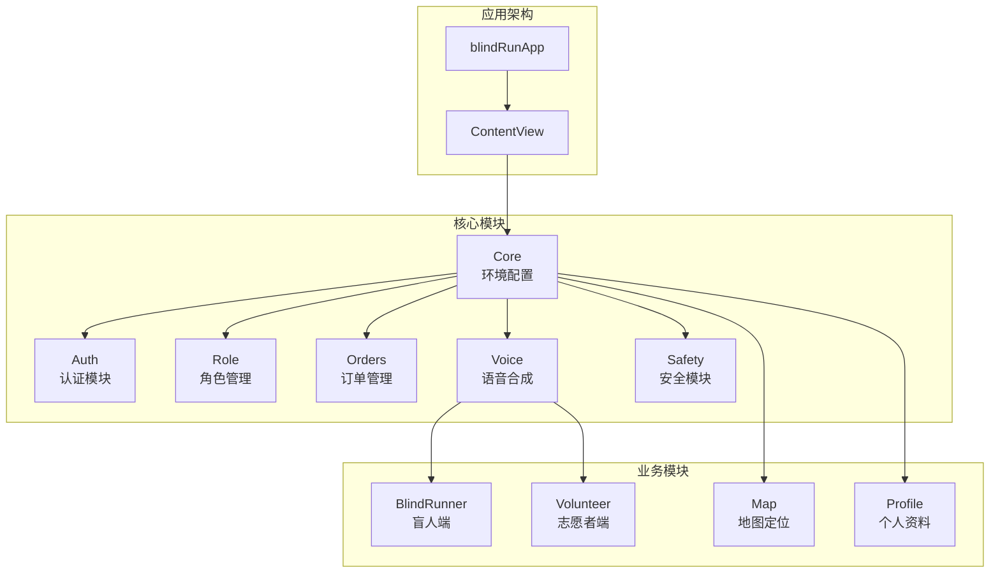
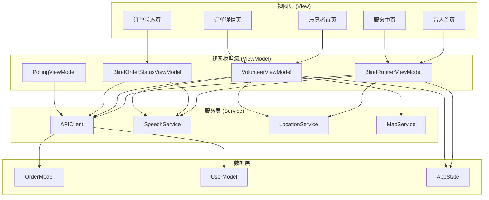
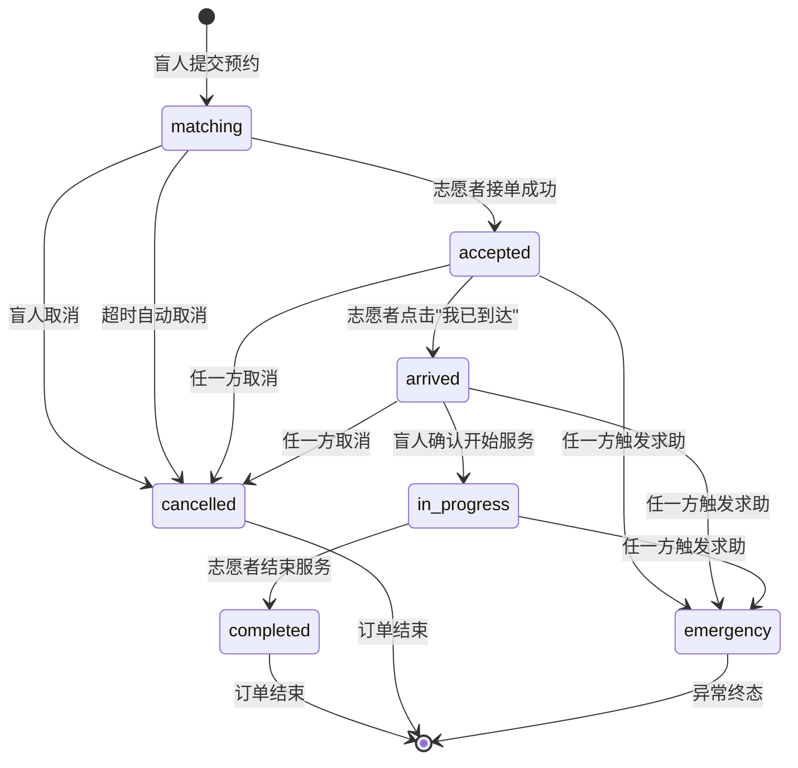
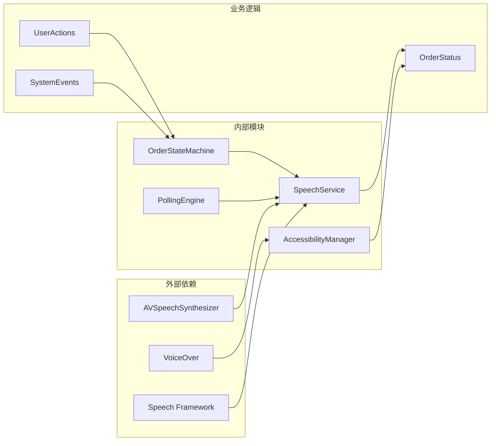

# 状态文案规范

<cite>
**本文档引用的文件**
- [无障碍与语音指南](file://docs/09-accessibility-and-voice-guidelines.md)
- [用户流程与状态机](file://docs/04-user-flows-and-state-machine.md)
- [iOS架构文档](file://docs/08-ios-architecture.md)
- [MVP范围文档](file://docs/02-mvp-scope.md)
- [用户故事](file://docs/03-user-stories.md)
- [订单状态生命周期规范](file://openspec/changes/add-aidrun-ios-spring-mvp/specs/order-status-lifecycle/spec.md)
- [无障碍与语音UI规范](file://openspec/changes/add-aidrun-ios-spring-mvp/specs/accessibility-voice-ui/spec.md)
- [盲人端应用入口](file://blindRun/blindRunApp.swift)
- [内容视图](file://blindRun/ContentView.swift)
- [UI测试](file://blindRunUITests/blindRunUITests.swift)
- [单元测试](file://blindRunTests/blindRunTests.swift)
</cite>

## 目录
1. [引言](#引言)
2. [项目结构](#项目结构)
3. [核心组件](#核心组件)
4. [架构概览](#架构概览)
5. [详细组件分析](#详细组件分析)
6. [依赖关系分析](#依赖关系分析)
7. [性能考量](#性能考量)
8. [故障排除指南](#故障排除指南)
9. [结论](#结论)

## 引言

本规范旨在为"助盲跑"iOS应用制定统一的状态文案标准和最佳实践。该应用专注于为视障用户提供语音优先的无障碍体验，所有交互必须服务于3天内可演示的安全订单闭环。

项目采用SwiftUI + MVVM架构，严格遵循iOS原生语音合成技术，确保语音播报的自然流畅和无障碍体验。

## 项目结构

项目采用模块化架构设计，专门为无障碍和语音合成进行了专门优化：

**图表来源**
- [iOS架构文档:18-31](file://docs/08-ios-architecture.md#L18-L31)
- [盲人端应用入口:10-17](file://blindRun/blindRunApp.swift#L10-L17)

**章节来源**
- [iOS架构文档:1-165](file://docs/08-ios-architecture.md#L1-L165)
- [MVP范围文档:1-216](file://docs/02-mvp-scope.md#L1-L216)

## 核心组件

### 语音合成服务 (SpeechService)

应用采用单一的共享语音合成服务，确保一致性并避免重复播报：

- **实现技术**: iOS原生`AVSpeechSynthesizer`
- **服务模式**: 单例模式，全局共享
- **状态管理**: 记忆最后一次播报的订单状态，避免轮询期间的重复播报
- **触发机制**: ViewModel在状态变化时决定播报内容

### 状态播报节点

系统必须播报以下关键状态节点：

1. **进入盲人首页**
2. **订单提交成功** 
3. **匹配中**
4. **志愿者已接单**
5. **志愿者已到达**
6. **请确认开始服务**
7. **服务已开始**
8. **服务已完成**
9. **进入求助状态**
10. **错误提示**

**章节来源**
- [无障碍与语音指南:13-35](file://docs/09-accessibility-and-voice-guidelines.md#L13-L35)

## 架构概览

应用采用MVVM架构模式，确保视图层与业务逻辑的分离：

**图表来源**
- [iOS架构文档:33-40](file://docs/08-ios-architecture.md#L33-L40)
- [无障碍与语音指南:32-35](file://docs/09-accessibility-and-voice-guidelines.md#L32-L35)

## 详细组件分析

### 订单状态生命周期

应用实现了严格的订单状态机，确保状态转换的有序性和安全性：

**图表来源**
- [用户流程与状态机:75-96](file://docs/04-user-flows-and-state-machine.md#L75-L96)

### 状态文案标准

#### 基本原则

1. **简洁直接**: 使用短句，避免冗长描述
2. **中文表达**: 全部使用中文，符合中文表达习惯
3. **情感中性**: 保持客观中性的语调，避免情绪化表达
4. **实用导向**: 突出行动指导和状态信息

#### 推荐状态文案

| 状态 | 文案 | 用途场景 |
|------|------|----------|
| `matching` | "预约已提交，正在等待志愿者接单。" | 订单提交后的初始状态 |
| `accepted` | "志愿者已接单，请等待志愿者到达。" | 志愿者接单确认 |
| `arrived` | "志愿者已到达，请确认开始服务。" | 志愿者到达提醒 |
| `in_progress` | "服务已开始，请注意安全。" | 服务开始确认 |
| `completed` | "服务已完成，感谢使用助盲跑。" | 服务结束确认 |
| `cancelled` | "本次预约已取消。" | 订单取消通知 |
| `emergency` | "已进入求助状态，系统已记录本次异常。" | 紧急求助确认 |

**章节来源**
- [无障碍与语音指南:112-120](file://docs/09-accessibility-and-voice-guidelines.md#L112-L120)

### 语音合成优化技巧

#### 停顿控制

- **状态转换时**: 在重要状态转换处增加适当的停顿
- **关键信息**: 对重要的关键词（如"已到达"、"请确认"）适当延长
- **自然节奏**: 避免过快的连续播报，给用户思考时间

#### 强调技巧

- **行动指令**: 对需要用户操作的词汇（如"确认"、"开始"）适度强调
- **紧急状态**: 对紧急状态词汇（如"求助"、"异常"）提高音量
- **状态变化**: 对状态词（如"开始"、"完成"）突出显示

#### 语调处理

- **正常状态**: 保持平和稳定的语调
- **紧急状态**: 提高语速，但保持清晰度
- **确认提示**: 使用稍高的音调表示重要性

### 本地化和多语言支持

#### 当前限制

根据MVP范围文档，项目明确支持中文，不包含多语言国际化：

- **语言支持**: 仅中文
- **界面语言**: 系统语言优先，但所有文案均为中文
- **语音合成**: 使用中文TTS引擎

#### 扩展考虑

如果未来需要支持多语言，建议：

1. **文案分离**: 将所有文案提取到独立的资源文件
2. **语音引擎**: 为每种语言配置相应的TTS引擎
3. **文化适应**: 考虑不同文化的表达习惯和紧急情况下的语言差异

**章节来源**
- [MVP范围文档:112-112](file://docs/02-mvp-scope.md#L112-L112)

### 文案审核和测试方法

#### 审核流程

1. **内容审核**: 确保文案符合简洁直接的原则
2. **无障碍测试**: 验证VoiceOver和TTS的协同工作
3. **用户体验测试**: 邀请视障用户参与测试
4. **多场景验证**: 覆盖所有订单状态和紧急情况

#### 测试方法

1. **自动化测试**: 
   - TTS播报测试：验证所有状态节点都能正确播报
   - 重复播报测试：验证"重复当前状态"功能
   - 状态转换测试：验证状态变化时的播报时机

2. **手动测试**:
   - 语音质量评估：检查语音合成的自然度
   - 无障碍功能测试：验证VoiceOver标签的准确性
   - 性能测试：确保轮询期间不会产生过多语音播报

3. **用户反馈**:
   - 视障用户试用反馈
   - 语音清晰度评估
   - 操作便利性评价

**章节来源**
- [无障碍与语音指南:131-138](file://docs/09-accessibility-and-voice-guidelines.md#L131-L138)
- [用户故事:777-806](file://docs/03-user-stories.md#L777-L806)

## 依赖关系分析

**图表来源**
- [iOS架构文档:15-16](file://docs/08-ios-architecture.md#L15-L16)
- [无障碍与语音指南:32-35](file://docs/09-accessibility-and-voice-guidelines.md#L32-L35)

**章节来源**
- [iOS架构文档:1-165](file://docs/08-ios-architecture.md#L1-L165)

## 性能考量

### 轮询机制优化

应用采用5秒轮询机制，在保证用户体验的同时控制资源消耗：

- **轮询频率**: 5秒间隔，平衡及时性和性能
- **状态变化检测**: 仅在状态变化时触发TTS播报
- **重复播报防护**: 记忆最后一次播报的状态，避免重复播报

### 语音合成性能

- **异步处理**: 语音合成在后台队列执行，不影响UI响应
- **队列管理**: 避免语音播报队列过长
- **资源释放**: 及时释放不再使用的语音资源

## 故障排除指南

### 常见问题及解决方案

1. **TTS不工作**
   - 检查系统语音设置
   - 验证SpeechService初始化
   - 确认权限配置

2. **重复播报问题**
   - 检查状态变化检测逻辑
   - 验证lastSpokenStatus缓存
   - 确认轮询间隔设置

3. **VoiceOver标签缺失**
   - 检查accessibilityLabel配置
   - 验证accessibilityHint设置
   - 确认交互元素的可访问性属性

### 质量保证清单

- [ ] 所有关键状态节点都有对应的TTS播报
- [ ] "重复当前状态"按钮功能正常
- [ ] VoiceOver标签完整且准确
- [ ] 紧急求助状态处理正确
- [ ] 状态转换时的播报时机恰当
- [ ] 无障碍功能在所有页面都可用

**章节来源**
- [无障碍与语音指南:131-138](file://docs/09-accessibility-and-voice-guidelines.md#L131-L138)

## 结论

本状态文案规范为"助盲跑"应用建立了完整的语音合成和无障碍体验标准。通过严格的模块化设计、标准化的文案格式和完善的测试流程，确保了视障用户的良好使用体验。

规范的核心要点包括：
- 简洁直接的中文表达原则
- 完整的状态播报覆盖
- 优化的语音合成技巧
- 严格的审核和测试流程
- 清晰的扩展指导

这些标准不仅适用于当前项目，也为未来的功能扩展和维护奠定了坚实基础。