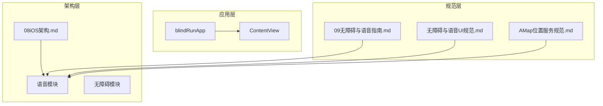
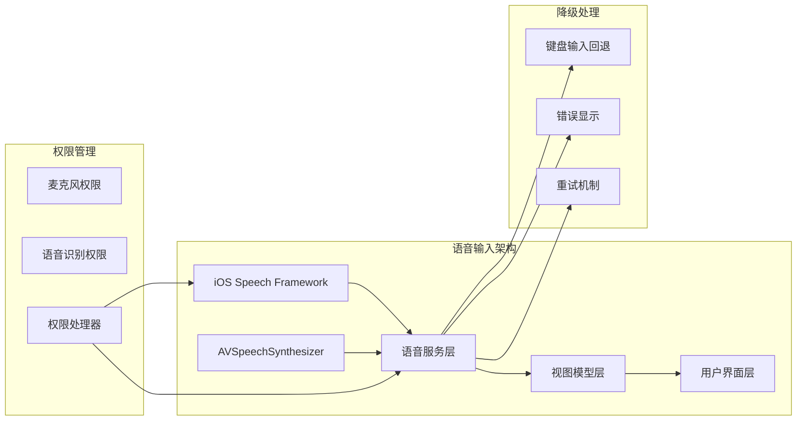
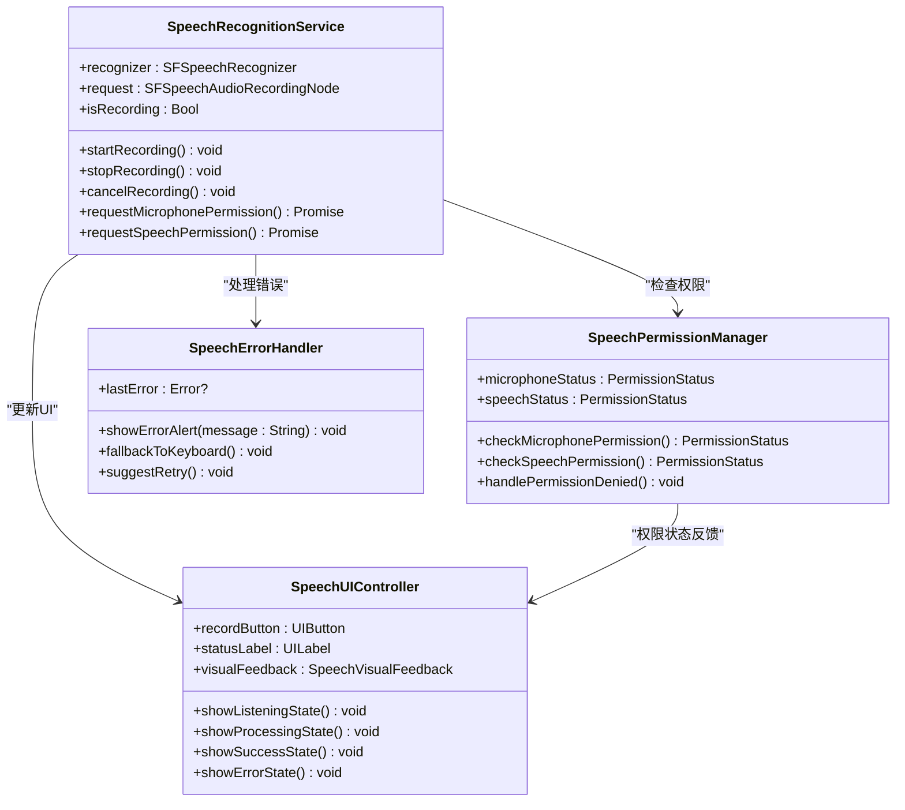
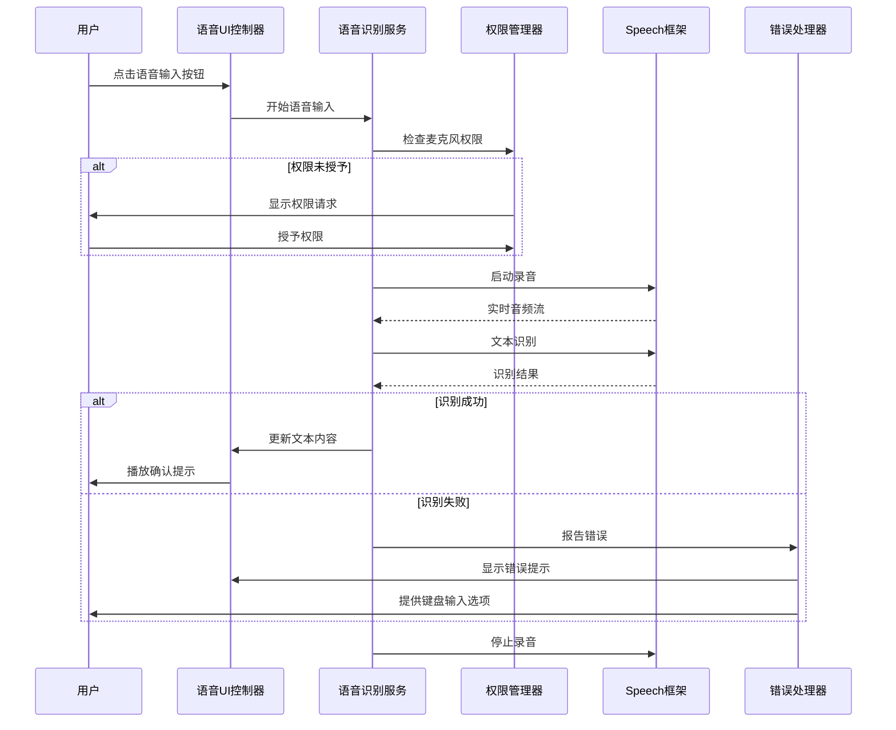
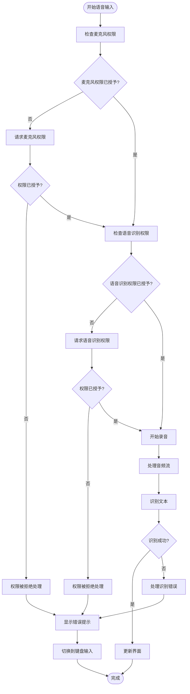
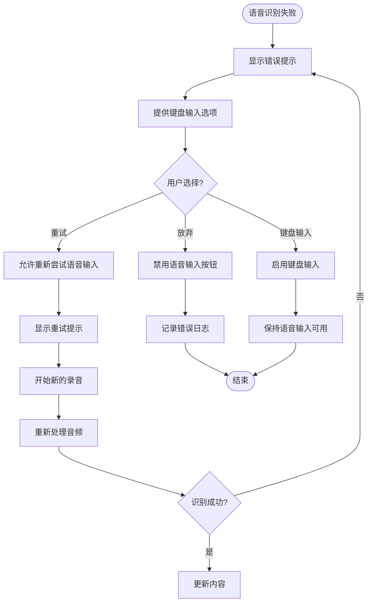
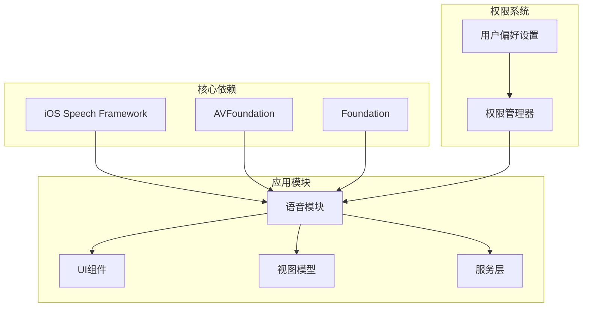

# 语音输入集成

<cite>
**本文档引用的文件**
- [blindRunApp.swift](file://blindRun/blindRunApp.swift)
- [ContentView.swift](file://blindRun/ContentView.swift)
- [09无障碍与语音指南.md](file://docs/09-accessibility-and-voice-guidelines.md)
- [08iOS架构.md](file://docs/08-ios-architecture.md)
- [AMap位置服务规范.md](file://openspec/changes/add-aidrun-ios-spring-mvp/specs/amap-location/spec.md)
- [无障碍与语音UI规范.md](file://openspec/changes/add-aidrun-ios-spring-mvp/specs/accessibility-voice-ui/spec.md)
- [任务清单.md](file://openspec/changes/add-aidrun-ios-spring-mvp/tasks.md)
</cite>

## 目录
1. [简介](#简介)
2. [项目结构](#项目结构)
3. [核心组件](#核心组件)
4. [架构概览](#架构概览)
5. [详细组件分析](#详细组件分析)
6. [依赖关系分析](#依赖关系分析)
7. [性能考虑](#性能考虑)
8. [故障排除指南](#故障排除指南)
9. [结论](#结论)
10. [附录](#附录)

## 简介

本文件为 AidRun iOS 应用语音输入功能的集成规范和实现指南。基于现有项目文档，明确了语音输入在 iOS Speech Framework 下的使用方法，包括权限申请与处理流程、支持的语音输入场景、失败降级策略、用户体验设计原则以及权限管理、隐私保护和性能优化的具体实现方法。

## 项目结构

根据现有项目结构，语音输入功能将作为独立模块集成到现有的 iOS 架构中：

**图表来源**
- [blindRunApp.swift:10-17](file://blindRun/blindRunApp.swift#L10-L17)
- [08iOS架构.md:18-31](file://docs/08-ios-architecture.md#L18-L31)

**章节来源**
- [blindRunApp.swift:1-18](file://blindRun/blindRunApp.swift#L1-L18)
- [08iOS架构.md:1-82](file://docs/08-ios-architecture.md#L1-L82)

## 核心组件

### 语音输入支持场景

根据项目规范，语音输入仅限于以下文本字段：

- 起始地点描述
- 目的地描述  
- 备注信息
- 志愿者服务摘要（如有用）

这些场景的选择体现了"语音输入仅限文本字段"的设计原则，避免了构建全局 AI 助手的复杂性。

**章节来源**
- [09无障碍与语音指南.md:71-87](file://docs/09-accessibility-and-voice-guidelines.md#L71-L87)
- [无障碍与语音UI规范.md:35-41](file://openspec/changes/add-aidrun-ios-spring-mvp/specs/accessibility-voice-ui/spec.md#L35-L41)

### 权限管理策略

语音输入权限采用按需申请策略：

- 仅在用户开始语音输入时才请求麦克风和语音识别权限
- 避免在应用启动时就申请敏感权限
- 权限被拒绝时提供清晰的错误提示和键盘输入替代方案

**章节来源**
- [09无障碍与语音指南.md:85-86](file://docs/09-accessibility-and-voice-guidelines.md#L85-L86)

## 架构概览

语音输入功能在 AidRun iOS 架构中的集成位置：

**图表来源**
- [08iOS架构.md:15-16](file://docs/08-ios-architecture.md#L15-L16)
- [09无障碍与语音指南.md:71-87](file://docs/09-accessibility-and-voice-guidelines.md#L71-L87)

## 详细组件分析

### 语音识别服务类图

**图表来源**
- [09无障碍与语音指南.md:71-87](file://docs/09-accessibility-and-voice-guidelines.md#L71-L87)
- [无障碍与语音UI规范.md:35-41](file://openspec/changes/add-aidrun-ios-spring-mvp/specs/accessibility-voice-ui/spec.md#L35-L41)

### 语音输入工作流程序列图

**图表来源**
- [09无障碍与语音指南.md:85-86](file://docs/09-accessibility-and-voice-guidelines.md#L85-L86)
- [无障碍与语音UI规范.md:39-41](file://openspec/changes/add-aidrun-ios-spring-mvp/specs/accessibility-voice-ui/spec.md#L39-L41)

### 权限申请流程流程图

**图表来源**
- [09无障碍与语音指南.md:85-86](file://docs/09-accessibility-and-voice-guidelines.md#L85-L86)

### 降级处理策略

当语音输入失败时，系统应执行以下降级策略：

**图表来源**
- [09无障碍与语音指南.md:85-86](file://docs/09-accessibility-and-voice-guidelines.md#L85-L86)

**章节来源**
- [09无障碍与语音指南.md:71-87](file://docs/09-accessibility-and-voice-guidelines.md#L71-L87)
- [无障碍与语音UI规范.md:35-41](file://openspec/changes/add-aidrun-ios-spring-mvp/specs/accessibility-voice-ui/spec.md#L35-L41)

## 依赖关系分析

### 模块间依赖关系

**图表来源**
- [08iOS架构.md:15-16](file://docs/08-ios-architecture.md#L15-L16)
- [09无障碍与语音指南.md:71-87](file://docs/09-accessibility-and-voice-guidelines.md#L71-L87)

**章节来源**
- [08iOS架构.md:1-82](file://docs/08-ios-architecture.md#L1-L82)
- [09无障碍与语音指南.md:1-143](file://docs/09-accessibility-and-voice-guidelines.md#L1-L143)

## 性能考虑

### 语音输入性能优化策略

1. **实时处理优化**
   - 使用后台队列处理音频数据
   - 实施音频缓冲区管理
   - 优化识别算法参数

2. **内存管理**
   - 及时释放音频缓冲区
   - 控制识别结果缓存大小
   - 监控内存使用情况

3. **电池优化**
   - 按需启动录音设备
   - 实施超时自动停止机制
   - 减少不必要的后台活动

4. **网络优化**
   - 本地优先的语音识别
   - 实施离线模式支持
   - 优化网络请求频率

**章节来源**
- [09无障碍与语音指南.md:71-87](file://docs/09-accessibility-and-voice-guidelines.md#L71-L87)

## 故障排除指南

### 常见问题及解决方案

| 问题类型 | 症状 | 解决方案 | 相关文件 |
|---------|------|----------|----------|
| 权限拒绝 | 无法启动语音输入 | 引导用户在设置中开启权限 | 09无障碍与语音指南.md |
| 识别失败 | 无响应或错误提示 | 提供键盘输入替代方案 | 无障碍与语音UI规范.md |
| 音频质量问题 | 识别准确率低 | 检查设备麦克风状态 | 08iOS架构.md |
| 内存泄漏 | 应用卡顿 | 实施正确的资源释放 | 09无障碍与语音指南.md |

**章节来源**
- [09无障碍与语音指南.md:85-86](file://docs/09-accessibility-and-voice-guidelines.md#L85-L86)
- [无障碍与语音UI规范.md:39-41](file://openspec/changes/add-aidrun-ios-spring-mvp/specs/accessibility-voice-ui/spec.md#L39-L41)

## 结论

语音输入功能的集成需要遵循以下核心原则：

1. **场景限定**：仅用于文本输入字段，避免过度复杂化
2. **权限最小化**：按需申请，尊重用户选择
3. **降级保障**：始终提供键盘输入替代方案
4. **用户体验**：清晰的状态反馈和确认流程
5. **性能优化**：实时处理、内存管理和电池优化

通过遵循本规范，可以确保语音输入功能既满足无障碍需求，又不影响应用的整体性能和用户体验。

## 附录

### 实现检查清单

- [ ] 集成 iOS Speech Framework
- [ ] 实现权限申请和管理
- [ ] 支持指定的语音输入场景
- [ ] 实现降级处理策略
- [ ] 添加适当的错误提示
- [ ] 实施性能优化措施
- [ ] 完成无障碍适配
- [ ] 编写单元测试

**章节来源**
- [任务清单.md:48-53](file://openspec/changes/add-aidrun-ios-spring-mvp/tasks.md#L48-L53)