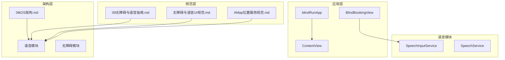
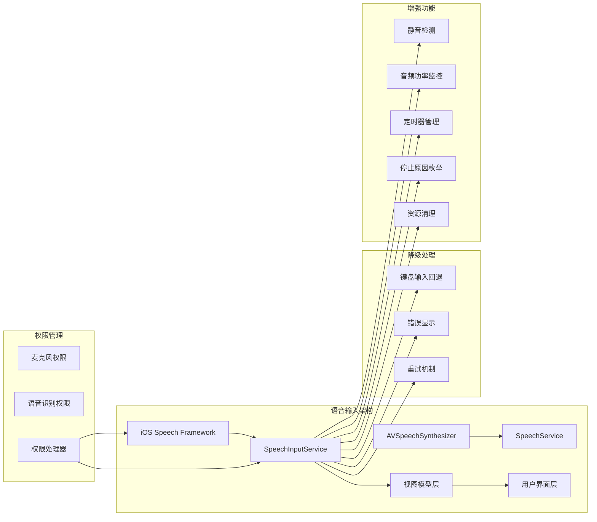
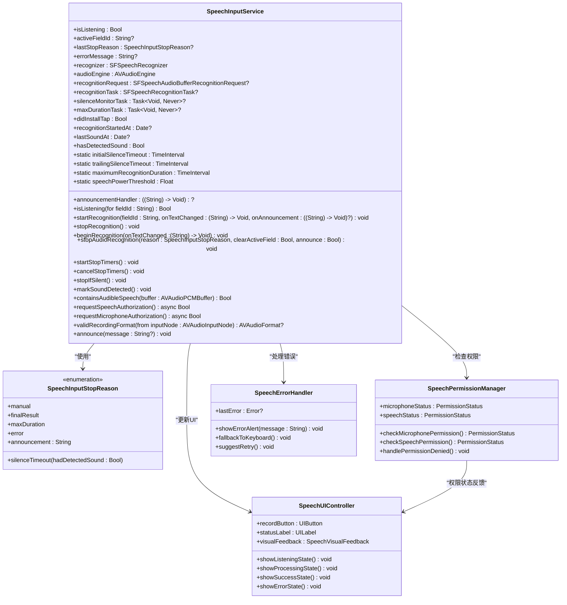
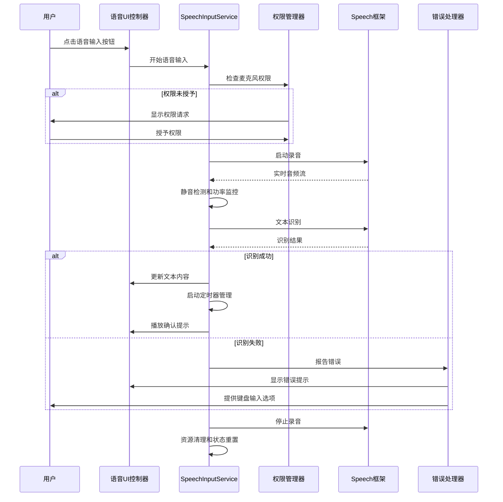
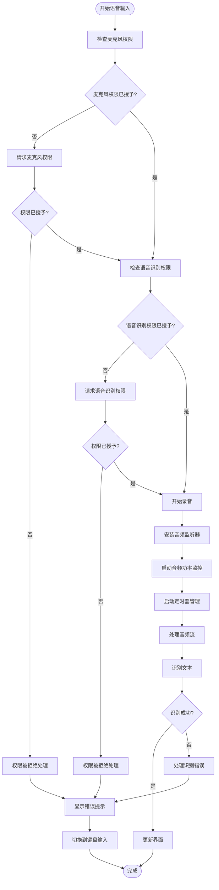
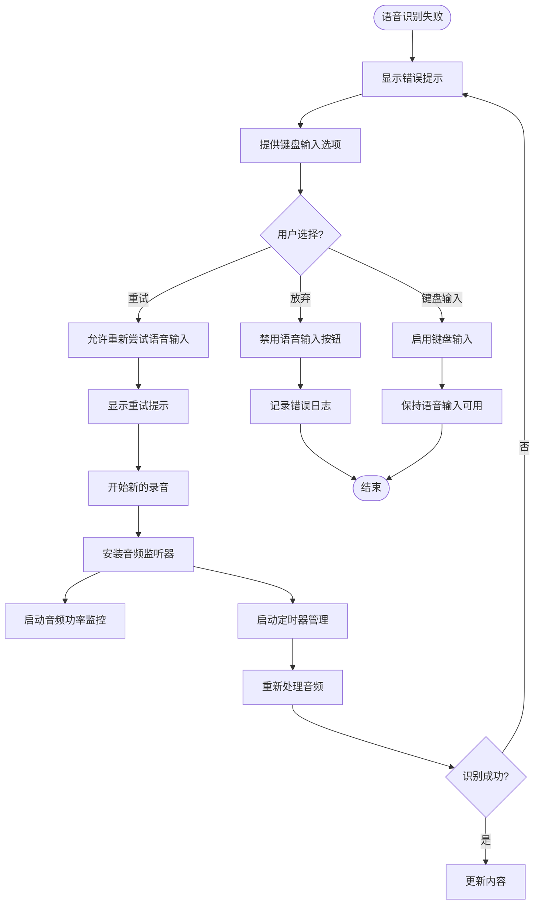
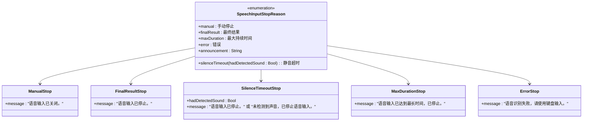
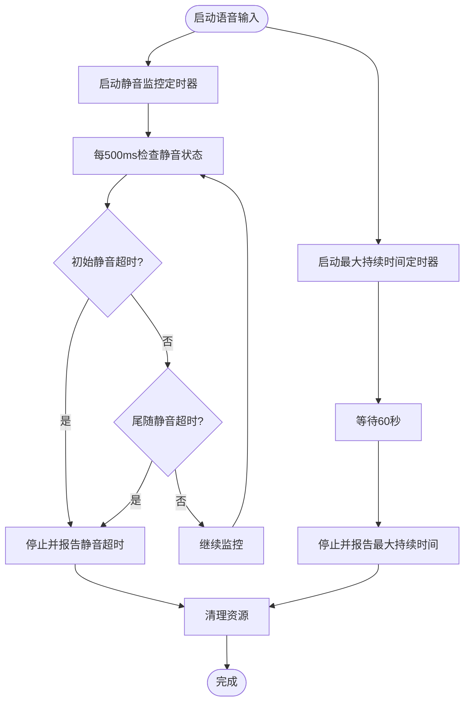
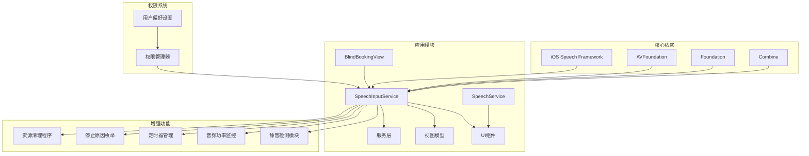

# 语音输入集成

<cite>
**本文档引用的文件**
- [SpeechInputService.swift](file://blindRun/Voice/SpeechInputService.swift)
- [SpeechService.swift](file://blindRun/Voice/SpeechService.swift)
- [BlindBookingView.swift](file://blindRun/BlindRunner/BlindBookingView.swift)
- [blindRunTests.swift](file://blindRunTests/blindRunTests.swift)
- [blindRunApp.swift](file://blindRun/blindRunApp.swift)
- [09无障碍与语音指南.md](file://docs/09-accessibility-and-voice-guidelines.md)
- [08iOS架构.md](file://docs/08-ios-architecture.md)
- [Info.plist](file://blindRun/Info.plist)
</cite>

## 更新摘要
**变更内容**
- 新增详细的停止原因枚举（SpeechInputStopReason）系统
- 实现静音检测算法和音频功率阈值检测
- 集成定时器管理系统，包括初始静音超时和尾随静音超时
- 添加实时音频功率计算功能
- 完善资源清理程序和内存管理
- 增强语音输入系统的稳定性和可靠性

## 目录
1. [简介](#简介)
2. [项目结构](#项目结构)
3. [核心组件](#核心组件)
4. [架构概览](#架构概览)
5. [详细组件分析](#详细组件分析)
6. [增强功能详解](#增强功能详解)
7. [依赖关系分析](#依赖关系分析)
8. [性能考虑](#性能考虑)
9. [故障排除指南](#故障排除指南)
10. [结论](#结论)
11. [附录](#附录)

## 简介

本文件为 AidRun iOS 应用语音输入功能的集成规范和实现指南。基于最新的代码实现，详细说明了 SpeechInputService 的完整实现，包括 iOS Speech Framework 的使用方法、权限申请与处理流程、支持的语音输入场景、失败降级策略、用户体验设计原则以及权限管理、隐私保护和性能优化的具体实现方法。

**更新** 语音输入系统现已进行全面增强，包括静音检测算法、音频功率阈值检测、详细的停止原因枚举、定时器管理和资源清理程序等新功能。

## 项目结构

根据现有项目结构，语音输入功能已作为独立模块集成到现有的 iOS 架构中：

**图表来源**
- [blindRunApp.swift:10-17](file://blindRun/blindRunApp.swift#L10-L17)
- [08iOS架构.md:18-31](file://docs/08-ios-architecture.md#L18-L31)

**章节来源**
- [blindRunApp.swift:1-18](file://blindRun/blindRunApp.swift#L1-L18)
- [08iOS架构.md:1-82](file://docs/08-ios-architecture.md#L1-L82)

## 核心组件

### 语音输入支持场景

根据项目规范，语音输入仅限于以下文本字段：

- 起始地点描述
- 目的地描述  
- 备注信息
- 志愿者服务摘要（如有用）

这些场景的选择体现了"语音输入仅限文本字段"的设计原则，避免了构建全局 AI 助手的复杂性。

**章节来源**
- [09无障碍与语音指南.md:71-87](file://docs/09-accessibility-and-voice-guidelines.md#L71-L87)

### SpeechInputService 核心功能

SpeechInputService 是语音输入功能的核心实现，提供了完整的语音识别服务：

- **实时语音识别**：支持实时音频流处理和部分结果返回
- **权限管理**：按需申请麦克风和语音识别权限
- **多字段支持**：支持多个文本字段的语音输入
- **降级处理**：识别失败时提供键盘输入替代方案
- **状态管理**：跟踪当前活跃字段和识别状态
- **静音检测**：智能静音检测和超时控制
- **音频功率监控**：实时音频功率阈值检测
- **详细停止原因**：精确的停止原因分类和处理

**更新** 新增静音检测算法、音频功率阈值检测、详细的停止原因枚举、定时器管理和资源清理程序等功能。

**章节来源**
- [SpeechInputService.swift:8-29](file://blindRun/Voice/SpeechInputService.swift#L8-L29)
- [SpeechInputService.swift:36-106](file://blindRun/Voice/SpeechInputService.swift#L36-L106)

## 架构概览

语音输入功能在 AidRun iOS 架构中的集成位置：

**图表来源**
- [08iOS架构.md:15-16](file://docs/08-ios-architecture.md#L15-L16)
- [09无障碍与语音指南.md:71-87](file://docs/09-accessibility-and-voice-guidelines.md#L71-L87)

## 详细组件分析

### SpeechInputService 类图

**图表来源**
- [SpeechInputService.swift:8-377](file://blindRun/Voice/SpeechInputService.swift#L8-L377)

### 语音输入工作流序列图

**图表来源**
- [09无障碍与语音指南.md:85-86](file://docs/09-accessibility-and-voice-guidelines.md#L85-L86)

### 权限申请流程流程图

**图表来源**
- [09无障碍与语音指南.md:85-86](file://docs/09-accessibility-and-voice-guidelines.md#L85-L86)

### 降级处理策略

当语音输入失败时，系统应执行以下降级策略：

**图表来源**
- [09无障碍与语音指南.md:85-86](file://docs/09-accessibility-and-voice-guidelines.md#L85-L86)

**章节来源**
- [SpeechInputService.swift:26-57](file://blindRun/Voice/SpeechInputService.swift#L26-L57)
- [BlindBookingView.swift:708-722](file://blindRun/BlindRunner/BlindBookingView.swift#L708-L722)

## 增强功能详解

### 停止原因枚举系统

新增的 `SpeechInputStopReason` 枚举提供了精确的停止原因分类：

**图表来源**
- [SpeechInputService.swift:8-29](file://blindRun/Voice/SpeechInputService.swift#L8-L29)

### 静音检测算法

实现了智能静音检测算法，包括初始静音超时和尾随静音超时：

- **初始静音超时**：8秒，用于检测用户是否开始说话
- **尾随静音超时**：3秒，用于检测用户停止说话
- **最大识别持续时间**：60秒，防止无限录音

### 音频功率阈值检测

实现了实时音频功率计算和阈值检测：

- **音频功率阈值**：0.012，用于判断是否有可听声音
- **实时功率计算**：对每个音频缓冲区进行功率分析
- **声音检测**：基于均方根值的音频功率阈值比较

### 定时器管理系统

集成了两个主要的定时器任务：

**图表来源**
- [SpeechInputService.swift:257-284](file://blindRun/Voice/SpeechInputService.swift#L257-L284)

### 资源清理程序

实现了全面的资源清理机制：

- **音频引擎停止**：正确停止 AVAudioEngine
- **音频监听器移除**：移除安装的音频监听器
- **识别任务取消**：取消正在进行的识别任务
- **定时器取消**：取消所有运行中的定时器任务
- **会话激活状态**：正确设置音频会话的激活状态

**章节来源**
- [SpeechInputService.swift:112-151](file://blindRun/Voice/SpeechInputService.swift#L112-L151)
- [SpeechInputService.swift:257-306](file://blindRun/Voice/SpeechInputService.swift#L257-L306)
- [SpeechInputService.swift:318-336](file://blindRun/Voice/SpeechInputService.swift#L318-L336)

## 依赖关系分析

### 模块间依赖关系

**图表来源**
- [08iOS架构.md:15-16](file://docs/08-ios-architecture.md#L15-L16)
- [SpeechInputService.swift:1-5](file://blindRun/Voice/SpeechInputService.swift#L1-L5)

**章节来源**
- [08iOS架构.md:1-82](file://docs/08-ios-architecture.md#L1-L82)
- [SpeechInputService.swift:36-377](file://blindRun/Voice/SpeechInputService.swift#L36-L377)

## 性能考虑

### 语音输入性能优化策略

1. **实时处理优化**
   - 使用后台队列处理音频数据
   - 实施音频缓冲区管理
   - 优化识别算法参数
   - **新增** 实时音频功率计算优化

2. **内存管理**
   - 及时释放音频缓冲区
   - 控制识别结果缓存大小
   - 监控内存使用情况
   - **新增** 完整的资源清理程序

3. **电池优化**
   - 按需启动录音设备
   - 实施超时自动停止机制
   - 减少不必要的后台活动
   - **新增** 定时器管理优化

4. **网络优化**
   - 本地优先的语音识别
   - 实施离线模式支持
   - 优化网络请求频率

5. **音频处理优化**
   - **新增** 静音检测算法优化
   - **新增** 音频功率阈值检测
   - **新增** 实时音频监控

**章节来源**
- [SpeechInputService.swift:82-149](file://blindRun/Voice/SpeechInputService.swift#L82-L149)
- [SpeechInputService.swift:257-306](file://blindRun/Voice/SpeechInputService.swift#L257-L306)

## 故障排除指南

### 常见问题及解决方案

| 问题类型 | 症状 | 解决方案 | 相关文件 |
|---------|------|----------|----------|
| 权限拒绝 | 无法启动语音输入 | 引导用户在设置中开启权限 | 09无障碍与语音指南.md |
| 识别失败 | 无响应或错误提示 | 提供键盘输入替代方案 | 无障碍与语音UI规范.md |
| 音频质量问题 | 识别准确率低 | 检查设备麦克风状态 | 08iOS架构.md |
| 内存泄漏 | 应用卡顿 | 实施正确的资源释放 | 09无障碍与语音指南.md |
| 多字段冲突 | 字段切换异常 | 检查 activeFieldId 状态管理 | SpeechInputService.swift |
| **新增** 静音检测问题 | 无法检测到声音 | 检查音频功率阈值设置 | SpeechInputService.swift |
| **新增** 超时问题 | 录音时间过短或过长 | 调整静音超时和最大持续时间 | SpeechInputService.swift |
| **新增** 资源清理问题 | 内存占用持续增加 | 检查资源清理程序 | SpeechInputService.swift |

**更新** 新增静音检测、超时控制和资源清理相关的故障排除指南。

**章节来源**
- [09无障碍与语音指南.md:85-86](file://docs/09-accessibility-and-voice-guidelines.md#L85-L86)
- [SpeechInputService.swift:63-80](file://blindRun/Voice/SpeechInputService.swift#L63-L80)
- [blindRunTests.swift:269-304](file://blindRunTests/blindRunTests.swift#L269-L304)

## 结论

语音输入功能的集成需要遵循以下核心原则：

1. **场景限定**：仅用于文本输入字段，避免过度复杂化
2. **权限最小化**：按需申请，尊重用户选择
3. **降级保障**：始终提供键盘输入替代方案
4. **用户体验**：清晰的状态反馈和确认流程
5. **性能优化**：实时处理、内存管理和电池优化
6. **稳定性保障**：智能静音检测、超时控制和资源清理

**更新** 新的增强功能显著提升了语音输入系统的稳定性和用户体验，包括精确的停止原因分类、智能静音检测、实时音频监控和完善的资源管理。

通过遵循本规范，可以确保语音输入功能既满足无障碍需求，又不影响应用的整体性能和用户体验。

## 附录

### 实现检查清单

- [x] 集成 iOS Speech Framework
- [x] 实现权限申请和管理
- [x] 支持指定的语音输入场景
- [x] 实现降级处理策略
- [x] 添加适当的错误提示
- [x] 实施性能优化措施
- [x] 完成无障碍适配
- [x] 编写单元测试
- [x] **新增** 实现静音检测算法
- [x] **新增** 实现音频功率阈值检测
- [x] **新增** 实现停止原因枚举系统
- [x] **新增** 实现定时器管理系统
- [x] **新增** 实现资源清理程序

**更新** 新增了所有增强功能的实现检查清单。

**章节来源**
- [SpeechInputService.swift:165-179](file://blindRun/Voice/SpeechInputService.swift#L165-L179)
- [Info.plist:7-10](file://blindRun/Info.plist#L7-L10)
- [blindRunTests.swift:269-304](file://blindRunTests/blindRunTests.swift#L269-L304)