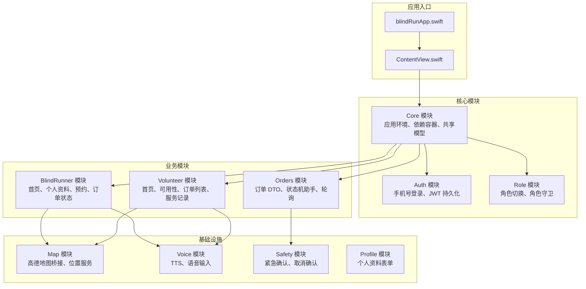
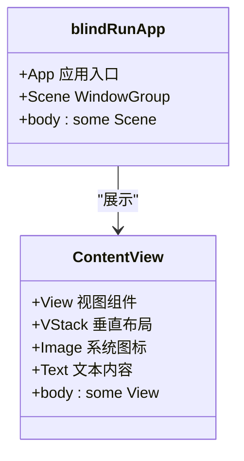
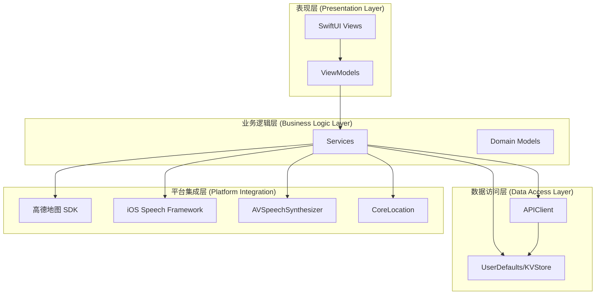
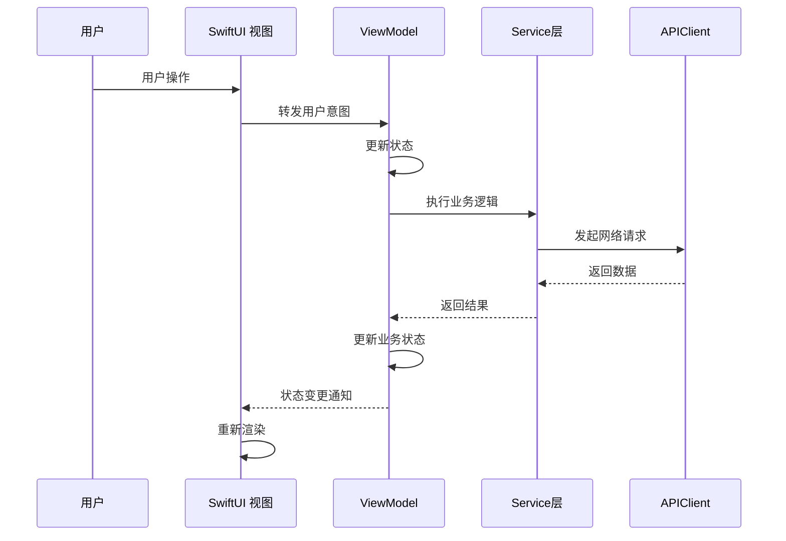
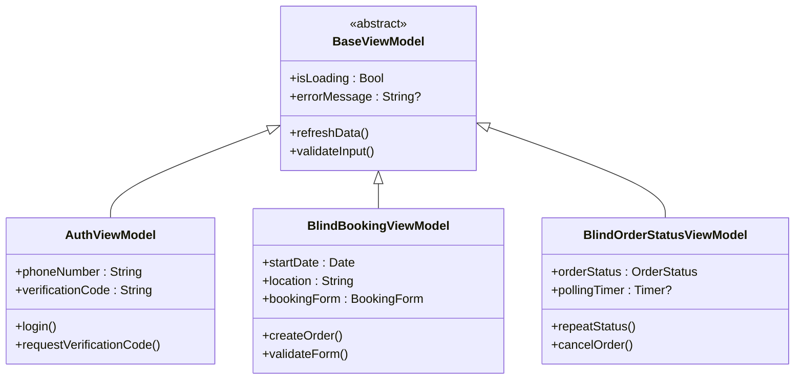
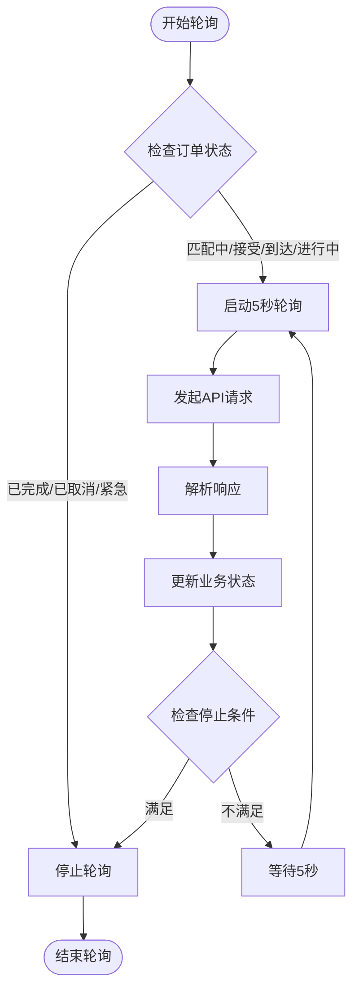
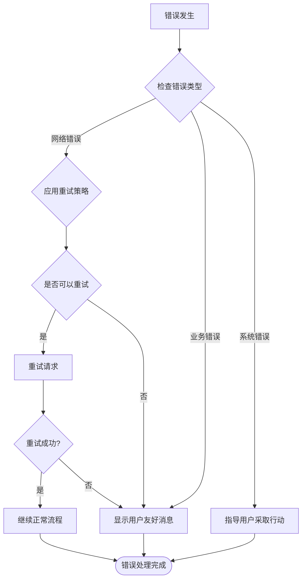
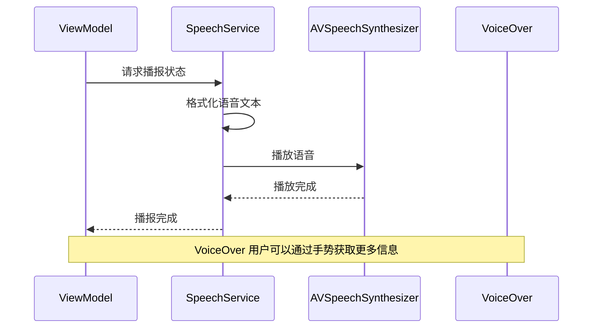
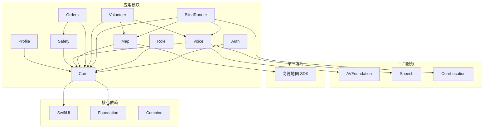
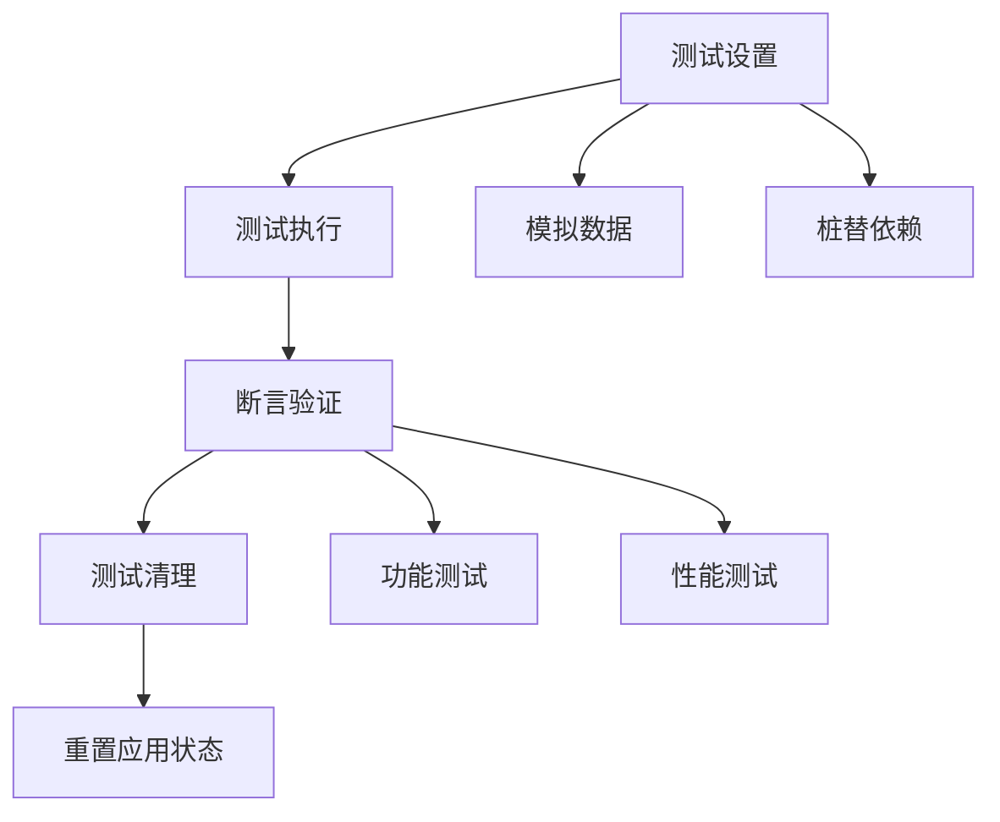

# 编码规范与最佳实践

<cite>
**本文档引用的文件**
- [blindRunApp.swift](file://blindRun/blindRun/blindRunApp.swift)
- [ContentView.swift](file://blindRun/blindRun/ContentView.swift)
- [08-ios-architecture.md](file://docs/08-ios-architecture.md)
- [09-accessibility-and-voice-guidelines.md](file://docs/09-accessibility-and-voice-guidelines.md)
- [blindRunTests.swift](file://blindRunTests/blindRunTests.swift)
- [blindRunUITests.swift](file://blindRunUITests/blindRunUITests.swift)
- [blindRunUITestsLaunchTests.swift](file://blindRunUITests/blindRunUITestsLaunchTests.swift)
- [.gitignore](file://.gitignore)
</cite>

## 目录
1. [简介](#简介)
2. [项目结构](#项目结构)
3. [核心组件](#核心组件)
4. [架构概览](#架构概览)
5. [详细组件分析](#详细组件分析)
6. [依赖关系分析](#依赖关系分析)
7. [性能考虑](#性能考虑)
8. [故障排除指南](#故障排除指南)
9. [结论](#结论)
10. [附录](#附录)

## 简介

本文件为 blindRun 项目制定全面的编码规范与最佳实践指南。blindRun 是一个基于 SwiftUI + MVVM 架构的 iOS 应用，专注于为盲人跑者提供无障碍的志愿服务匹配平台。该项目采用 Swift 语言开发，支持 iOS 16+，并遵循无障碍优先的设计原则。

项目的核心目标是实现一个完整的订单服务闭环，包括盲人跑者注册登录、预约创建、志愿者匹配、服务执行和状态跟踪等功能。所有功能都围绕无障碍体验设计，确保盲人用户能够通过 VoiceOver 和 TTS 完成完整的业务流程。

## 项目结构

根据现有代码和架构文档，blindRun 项目采用模块化的源代码组织方式：

**图表来源**
- [08-ios-architecture.md:18-31](file://docs/08-ios-architecture.md#L18-L31)
- [blindRunApp.swift:10-17](file://blindRun/blindRun/blindRunApp.swift#L10-L17)
- [ContentView.swift:10-20](file://blindRun/blindRun/ContentView.swift#L10-L20)

**章节来源**
- [08-ios-architecture.md:18-31](file://docs/08-ios-architecture.md#L18-L31)
- [blindRunApp.swift:10-17](file://blindRun/blindRun/blindRunApp.swift#L10-L17)
- [ContentView.swift:10-20](file://blindRun/blindRun/ContentView.swift#L10-L20)

## 核心组件

### 应用入口组件

应用采用标准的 SwiftUI 应用入口模式，使用 `@main` 注解标识主应用结构体：

**图表来源**
- [blindRunApp.swift:10-17](file://blindRun/blindRun/blindRunApp.swift#L10-L17)
- [ContentView.swift:10-20](file://blindRun/blindRun/ContentView.swift#L10-L20)

### MVVM 架构模式

项目严格遵循 MVVM（Model-View-ViewModel）架构模式：

- **View**: SwiftUI 视图负责渲染状态并转发用户意图
- **ViewModel**: ViewModel 拥有加载状态、验证状态、API 调用、轮询和 TTS 触发
- **Service**: Service 对象封装 API 和平台能力边界
- **DTO**: DTO 镜像 OpenAPI 模式；领域助手处理显示文本和状态转换

**章节来源**
- [08-ios-architecture.md:33-48](file://docs/08-ios-architecture.md#L33-L48)

## 架构概览

### 整体架构设计

**图表来源**
- [08-ios-architecture.md:5-16](file://docs/08-ios-architecture.md#L5-L16)
- [08-ios-architecture.md:68-82](file://docs/08-ios-architecture.md#L68-L82)

### API 环境配置

项目支持三种 API 环境配置：

| 环境类型 | 目的 | 特征 |
|---------|------|------|
| `mock` | 本地假数据调试 | 无后端依赖，UI 和流程调试专用 |
| `localBackend` | 本地后端连接 | 局域网 Spring Boot 后端，Mac 运行 |
| `production` | 生产环境预留 | 后续部署准备 |

**章节来源**
- [08-ios-architecture.md:50-66](file://docs/08-ios-architecture.md#L50-L66)

## 详细组件分析

### SwiftUI 开发最佳实践

#### 视图设计规范

1. **视图保持简洁**: View 仅负责渲染状态和转发用户意图
2. **状态管理**: 使用 `@State`、`@ObservableObject` 等 SwiftUI 状态属性
3. **响应式设计**: 利用 `@ViewBuilder` 和条件渲染
4. **预览支持**: 每个视图都应包含 `#Preview` 片段

#### 状态管理策略

**图表来源**
- [08-ios-architecture.md:35-40](file://docs/08-ios-architecture.md#L35-L40)

#### 性能优化建议

1. **视图层次优化**: 避免深层嵌套的视图层次
2. **状态订阅**: 使用 `@ObservedObject` 和 `@StateObject` 正确管理生命周期
3. **计算属性**: 使用 `@Published` 属性包装器优化重渲染
4. **异步操作**: 使用 `Task` 和 `async/await` 处理异步任务

### MVVM 实现规范

#### ViewModel 设计原则

1. **职责分离**: ViewModel 专门处理业务逻辑和状态管理
2. **依赖注入**: 通过初始化参数注入依赖项
3. **线程安全**: 确保状态更新在主线程进行
4. **内存管理**: 正确处理循环引用和资源释放

#### 示例 ViewModel 结构

**图表来源**
- [08-ios-architecture.md:44-48](file://docs/08-ios-architecture.md#L44-L48)

**章节来源**
- [08-ios-architecture.md:33-48](file://docs/08-ios-architecture.md#L33-L48)

### 异步编程模式

#### 网络请求处理

项目采用 URLSession + async/await 的现代异步编程模式：

1. **请求构建**: 使用 `URLRequest` 构建 HTTP 请求
2. **身份验证**: 自动附加 `Authorization: Bearer <accessToken>`
3. **错误处理**: 统一的错误映射和用户提示
4. **重试机制**: 简单的重试行为，避免复杂的离线队列

#### 轮询机制实现

**图表来源**
- [08-ios-architecture.md:125-139](file://docs/08-ios-architecture.md#L125-L139)

**章节来源**
- [08-ios-architecture.md:68-77](file://docs/08-ios-architecture.md#L68-L77)
- [08-ios-architecture.md:125-139](file://docs/08-ios-architecture.md#L125-L139)

### 错误处理策略

#### 错误分类与处理

1. **网络错误**: 超时、连接失败、服务器错误
2. **业务错误**: 验证失败、权限不足、业务规则违反
3. **系统错误**: 权限拒绝、资源不可用、设备限制

#### 错误恢复机制

**图表来源**
- [08-ios-architecture.md:70-77](file://docs/08-ios-architecture.md#L70-L77)

**章节来源**
- [08-ios-architecture.md:70-82](file://docs/08-ios-architecture.md#L70-L82)

### 无障碍开发规范

#### VoiceOver 支持

1. **标签设置**: 每个关键按钮、输入框和状态文本都需要 `accessibilityLabel`
2. **提示设置**: 提供清晰的 `accessibilityHint`
3. **特性配置**: 正确设置可访问性特性（按钮、头部、选中、禁用）

#### TTS 语音播报

**图表来源**
- [09-accessibility-and-voice-guidelines.md:13-36](file://docs/09-accessibility-and-voice-guidelines.md#L13-L36)

#### 语音输入支持

1. **适用范围**: 仅用于文本字段（地点描述、路线说明、备注、可选摘要）
2. **权限管理**: 仅在用户开始语音输入时请求麦克风和语音识别权限
3. **降级方案**: 语音识别失败时显示错误并允许键盘输入

**章节来源**
- [09-accessibility-and-voice-guidelines.md:37-87](file://docs/09-accessibility-and-voice-guidelines.md#L37-L87)

## 依赖关系分析

### 模块间依赖关系

**图表来源**
- [08-ios-architecture.md:5-16](file://docs/08-ios-architecture.md#L5-L16)
- [08-ios-architecture.md:18-31](file://docs/08-ios-architecture.md#L18-L31)

### 外部依赖管理

项目采用最小化依赖策略，主要依赖包括：

1. **SwiftUI**: 用户界面框架
2. **Foundation**: 基础系统功能
3. **AVFoundation**: 语音合成和音频处理
4. **Speech**: 语音识别
5. **CoreLocation**: 位置服务
6. **高德地图 SDK**: 地图和定位服务

**章节来源**
- [08-ios-architecture.md:5-16](file://docs/08-ios-architecture.md#L5-L16)

## 性能考虑

### 内存管理最佳实践

1. **弱引用**: 避免循环引用，特别是在闭包和委托中
2. **及时释放**: 在适当的生命周期点释放资源
3. **对象池**: 对于频繁创建的对象考虑使用对象池
4. **内存泄漏检测**: 使用 Instruments 工具定期检测内存泄漏

### 网络性能优化

1. **请求合并**: 将多个小请求合并为批量请求
2. **缓存策略**: 实现合理的数据缓存机制
3. **连接复用**: 利用 URLSession 的连接复用特性
4. **超时配置**: 合理设置网络请求超时时间

### UI 性能优化

1. **视图重用**: 使用 `LazyVGrid` 和 `List` 的惰性加载
2. **异步渲染**: 将耗时的计算移到后台线程
3. **状态最小化**: 减少不必要的状态更新
4. **图片优化**: 使用合适的图片格式和尺寸

## 故障排除指南

### 常见问题诊断

#### 应用启动问题

1. **检查应用入口**: 确认 `@main` 注解正确配置
2. **验证窗口组**: 确保 `WindowGroup` 正确设置
3. **检查依赖注入**: 确认所有依赖项正确初始化

#### 网络请求问题

1. **验证 API 环境**: 检查当前使用的 API 环境配置
2. **检查令牌**: 确认 JWT 令牌有效且未过期
3. **网络连通性**: 验证网络连接状态

#### 无障碍功能问题

1. **VoiceOver 测试**: 使用 VoiceOver 测试关键流程
2. **标签完整性**: 检查所有关键元素的 `accessibilityLabel`
3. **TTS 播报**: 验证语音播报的完整性和准确性

### 调试工具使用

#### XCTest 单元测试

**图表来源**
- [blindRunTests.swift:13-36](file://blindRunTests/blindRunTests.swift#L13-L36)

#### UI 自动化测试

1. **启动性能测试**: 使用 `XCTApplicationLaunchMetric` 测量启动时间
2. **界面导航测试**: 验证主要用户流程的自动化
3. **屏幕截图**: 记录关键界面状态用于回归测试

**章节来源**
- [blindRunUITests.swift:12-42](file://blindRunUITests/blindRunUITests.swift#L12-L42)
- [blindRunUITestsLaunchTests.swift:12-34](file://blindRunUITests/blindRunUITestsLaunchTests.swift#L12-L34)

## 结论

blindRun 项目制定了全面的编码规范和最佳实践指南，涵盖了从架构设计到具体实现的各个方面。通过遵循这些规范，团队可以确保代码质量、可维护性和用户体验的一致性。

项目的核心优势在于：
1. **清晰的架构分层**: MVVM 模式确保了良好的关注点分离
2. **无障碍优先设计**: 从设计之初就考虑了盲人用户的特殊需求
3. **现代化技术栈**: 采用 SwiftUI 和 async/await 等现代 iOS 开发技术
4. **完善的测试策略**: 包含单元测试、UI 测试和性能测试

未来的发展方向包括：
1. **模块化扩展**: 按照现有模块划分继续扩展功能
2. **性能优化**: 持续优化应用性能和用户体验
3. **测试覆盖**: 扩大测试覆盖率，特别是业务逻辑测试
4. **代码审查**: 建立完善的代码审查流程

## 附录

### 代码审查清单

#### 基础要求
- [ ] 符合 Swift 编码风格指南
- [ ] 代码注释完整且准确
- [ ] 单元测试覆盖率达到要求
- [ ] 通过所有静态分析工具检查

#### 架构一致性
- [ ] 遵循 MVVM 架构模式
- [ ] ViewModel 不直接处理 UI 逻辑
- [ ] Service 层正确封装外部依赖
- [ ] 数据传输对象符合 OpenAPI 规范

#### 无障碍合规
- [ ] 所有关键元素都有 `accessibilityLabel`
- [ ] VoiceOver 导航流畅
- [ ] TTS 播报完整准确
- [ ] 语音输入功能正常

#### 性能要求
- [ ] 启动时间在规定范围内
- [ ] 内存使用符合预期
- [ ] 网络请求响应时间合理
- [ ] UI 响应流畅无卡顿

### 重构指南

#### 重构时机
- [ ] 代码重复度超过阈值
- [ ] 架构出现明显耦合问题
- [ ] 性能指标不达标
- [ ] 新需求难以扩展

#### 重构策略
1. **渐进式重构**: 分步骤进行，避免一次性大规模改动
2. **测试驱动**: 先写测试再重构，确保功能不变
3. **接口稳定**: 保持对外接口稳定，内部实现可变
4. **文档同步**: 及时更新相关文档

#### 重构检查清单
- [ ] 功能完全保持一致
- [ ] 性能指标不下降
- [ ] 测试用例全部通过
- [ ] 代码复杂度降低
- [ ] 可读性显著提升

### 性能优化建议

#### 内存优化
1. **及时释放**: 在适当的地方释放不需要的资源
2. **避免 retain cycles**: 使用 weak self 解决循环引用
3. **懒加载**: 对于昂贵对象使用懒加载策略
4. **内存池**: 对频繁创建的对象使用内存池

#### 网络优化
1. **请求去重**: 避免重复发送相同的请求
2. **缓存策略**: 实现合理的数据缓存机制
3. **批量处理**: 将多个小操作合并为批量处理
4. **压缩传输**: 对大数据使用压缩传输

#### UI 优化
1. **视图复用**: 使用 `LazyVGrid` 和 `LazyHGrid` 实现视图复用
2. **异步渲染**: 将耗时计算移至后台线程
3. **状态最小化**: 减少不必要的状态更新
4. **图片优化**: 使用合适的图片格式和尺寸