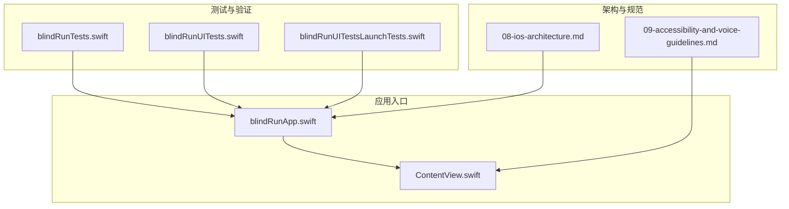
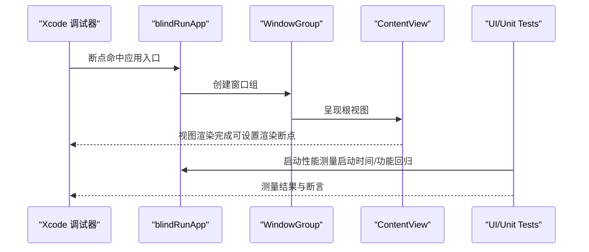
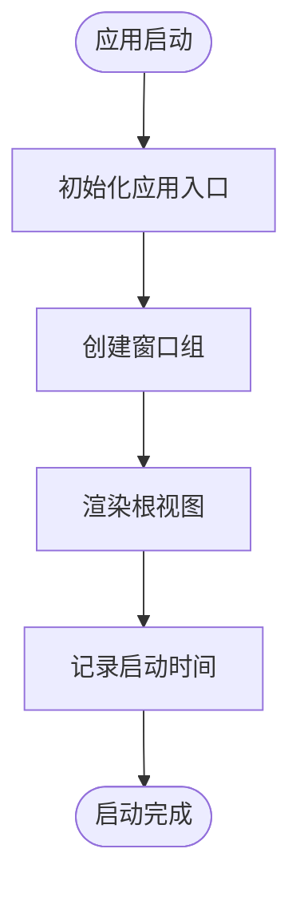
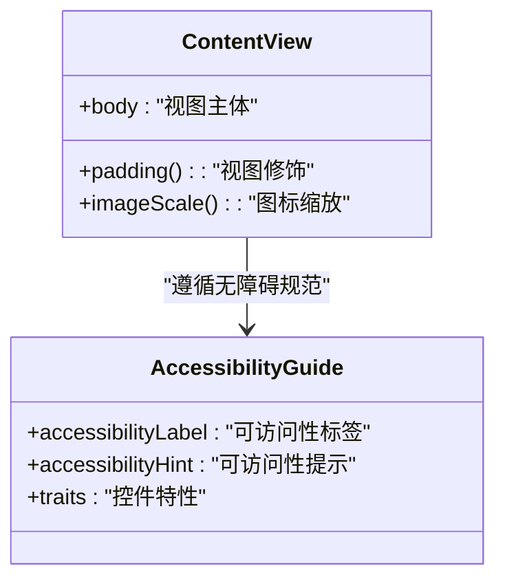
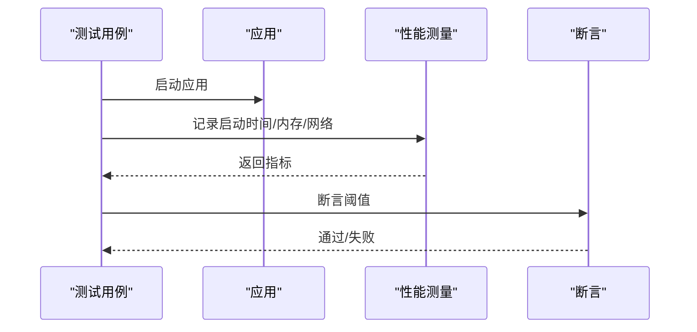
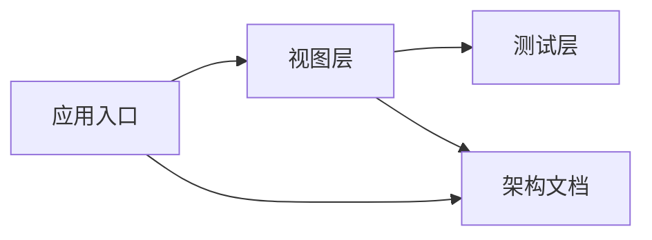

# 调试与性能优化

<cite>
**本文引用的文件**
- [blindRunApp.swift](file://blindRun/blindRunApp.swift)
- [ContentView.swift](file://blindRun/ContentView.swift)
- [08-ios-architecture.md](file://docs/08-ios-architecture.md)
- [09-accessibility-and-voice-guidelines.md](file://docs/09-accessibility-and-voice-guidelines.md)
- [blindRunTests.swift](file://blindRunTests/blindRunTests.swift)
- [blindRunUITests.swift](file://blindRunUITests/blindRunUITests.swift)
- [blindRunUITestsLaunchTests.swift](file://blindRunUITests/blindRunUITestsLaunchTests.swift)
- [project.pbxproj](file://blindRun.xcodeproj/project.pbxproj)
</cite>

## 目录
1. [简介](#简介)
2. [项目结构](#项目结构)
3. [核心组件](#核心组件)
4. [架构总览](#架构总览)
5. [详细组件分析](#详细组件分析)
6. [依赖分析](#依赖分析)
7. [性能考虑](#性能考虑)
8. [故障排查指南](#故障排查指南)
9. [结论](#结论)
10. [附录](#附录)

## 简介
本指南面向 iOS 开发团队，围绕 blindRun 项目的调试与性能优化目标，系统阐述以下内容：
- 常用调试工具与技术：Xcode 调试器、Instruments 性能分析器、日志分析方法
- 内存泄漏检测、崩溃分析与网络请求监控的实现要点
- 性能瓶颈识别与优化策略：UI 渲染优化、网络请求优化、后台任务管理
- 常见问题排查流程：地图加载缓慢、语音延迟、定位不准确等
- 生产环境问题诊断与用户反馈处理流程

本指南结合项目现有架构文档与测试骨架，给出可落地的实践建议与可视化流程。

## 项目结构
blindRun 采用 SwiftUI + MVVM 架构，模块化划分清晰，便于分层调试与性能观测。应用入口为 SwiftUI 应用结构体，主界面为简单示例视图；测试与 UI 测试骨架已就绪，便于集成性能测量与自动化验证。

图表来源
- [blindRunApp.swift:10-17](file://blindRun/blindRunApp.swift#L10-L17)
- [ContentView.swift:10-20](file://blindRun/ContentView.swift#L10-L20)
- [blindRunTests.swift:11-38](file://blindRunTests/blindRunTests.swift#L11-L38)
- [blindRunUITests.swift:10-43](file://blindRunUITests/blindRunUITests.swift#L10-L43)
- [blindRunUITestsLaunchTests.swift:10-35](file://blindRunUITests/blindRunUITestsLaunchTests.swift#L10-L35)
- [08-ios-architecture.md:33-49](file://docs/08-ios-architecture.md#L33-L49)
- [09-accessibility-and-voice-guidelines.md:13-36](file://docs/09-accessibility-and-voice-guidelines.md#L13-L36)

章节来源
- [blindRunApp.swift:10-17](file://blindRun/blindRunApp.swift#L10-L17)
- [ContentView.swift:10-20](file://blindRun/ContentView.swift#L10-L20)
- [08-ios-architecture.md:18-32](file://docs/08-ios-architecture.md#L18-L32)

## 核心组件
- 应用入口与场景管理：通过 SwiftUI 应用结构体统一管理窗口组与根视图，便于在调试器中设置断点与观察启动路径。
- 视图层（MVVM）：视图保持薄层，状态渲染与意图转发至 ViewModel；该分层有利于隔离 UI 渲染问题与业务逻辑问题，便于针对性优化。
- 测试与性能测量：单元测试与 UI 测试骨架已具备，可直接扩展性能测量与自动化回归。

章节来源
- [blindRunApp.swift:10-17](file://blindRun/blindRunApp.swift#L10-L17)
- [08-ios-architecture.md:33-49](file://docs/08-ios-architecture.md#L33-L49)
- [blindRunTests.swift:31-36](file://blindRunTests/blindRunTests.swift#L31-L36)
- [blindRunUITests.swift:37-42](file://blindRunUITests/blindRunUITests.swift#L37-L42)

## 架构总览
下图展示应用启动到视图呈现的关键路径，以及与测试、性能测量的关系。该图有助于在调试器中定位启动阶段问题与性能瓶颈。

图表来源
- [blindRunApp.swift:10-17](file://blindRun/blindRunApp.swift#L10-L17)
- [ContentView.swift:10-20](file://blindRun/ContentView.swift#L10-L20)
- [blindRunUITests.swift:25-42](file://blindRunUITests/blindRunUITests.swift#L25-L42)
- [blindRunTests.swift:21-36](file://blindRunTests/blindRunTests.swift#L21-L36)

## 详细组件分析

### 组件一：应用启动与窗口组（调试与性能入口）
- 调试要点
  - 在应用入口设置断点，观察启动阶段是否卡顿或异常。
  - 利用 Xcode 的启动时间指标进行性能测量，结合 UI 测试中的启动性能用例。
- 性能优化
  - 将耗时初始化移至后台线程或懒加载，避免阻塞主线程。
  - 减少启动阶段的 I/O 与网络请求，必要时延迟到首屏渲染后再执行。

图表来源
- [blindRunApp.swift:10-17](file://blindRun/blindRunApp.swift#L10-L17)
- [blindRunUITests.swift:37-42](file://blindRunUITests/blindRunUITests.swift#L37-L42)

章节来源
- [blindRunApp.swift:10-17](file://blindRun/blindRunApp.swift#L10-L17)
- [blindRunUITests.swift:37-42](file://blindRunUITests/blindRunUITests.swift#L37-L42)

### 组件二：视图渲染与无障碍（UI 渲染优化）
- 调试要点
  - 使用 Xcode 的渲染断点与 Allocations 工具，定位重绘热点与过度布局。
  - 结合无障碍文档，确保关键控件具备可访问性标签与提示，避免因可访问性导致的布局异常。
- 性能优化
  - 避免在视图 body 中进行昂贵计算，将计算结果缓存或延迟到 ViewModel。
  - 控制视图层级深度，合并修饰符，减少不必要的视图重组。

图表来源
- [ContentView.swift:10-20](file://blindRun/ContentView.swift#L10-L20)
- [09-accessibility-and-voice-guidelines.md:37-61](file://docs/09-accessibility-and-voice-guidelines.md#L37-L61)

章节来源
- [ContentView.swift:10-20](file://blindRun/ContentView.swift#L10-L20)
- [09-accessibility-and-voice-guidelines.md:37-61](file://docs/09-accessibility-and-voice-guidelines.md#L37-L61)

### 组件三：测试与性能测量（回归与启动性能）
- 单元测试
  - 可在性能测试用例中测量特定函数耗时，结合断言确保回归稳定。
- UI 测试
  - 启动性能测量用于捕获启动阶段的异常波动；可扩展为端到端流程的性能基线。
- 扩展建议
  - 在测试中集成网络请求监控与内存分配统计，形成持续的性能基线。

图表来源
- [blindRunTests.swift:31-36](file://blindRunTests/blindRunTests.swift#L31-L36)
- [blindRunUITests.swift:37-42](file://blindRunUITests/blindRunUITests.swift#L37-L42)

章节来源
- [blindRunTests.swift:21-36](file://blindRunTests/blindRunTests.swift#L21-L36)
- [blindRunUITests.swift:25-42](file://blindRunUITests/blindRunUITests.swift#L25-L42)

## 依赖分析
- 模块耦合
  - 应用入口与视图层低耦合，便于独立调试与优化。
  - 测试层对应用入口与视图层的依赖清晰，利于建立稳定的回归测试矩阵。
- 外部依赖
  - 架构文档明确了网络层、地图与语音等外部能力边界，便于在调试器中隔离问题来源。

图表来源
- [blindRunApp.swift:10-17](file://blindRun/blindRunApp.swift#L10-L17)
- [ContentView.swift:10-20](file://blindRun/ContentView.swift#L10-L20)
- [08-ios-architecture.md:68-83](file://docs/08-ios-architecture.md#L68-L83)

章节来源
- [08-ios-architecture.md:68-83](file://docs/08-ios-architecture.md#L68-L83)

## 性能考虑
- UI 渲染优化
  - 使用渲染断点与 Allocations 工具定位重绘热点；减少视图重组与修饰符滥用。
  - 将昂贵计算移出视图 body，利用 ViewModel 缓存结果。
- 网络请求优化
  - 在测试中集成网络请求监控，记录往返时间与错误率；对高频接口引入合理的缓存与节流。
- 后台任务管理
  - 避免在主线程执行耗时任务；合理使用并发队列与异步回调。
- 启动性能
  - 通过 UI 测试的启动性能用例建立基线，持续监控启动时间波动。

## 故障排查指南

### 启动缓慢
- 排查步骤
  - 在应用入口设置断点，检查启动路径是否阻塞。
  - 使用 UI 测试的启动性能测量，定位异常波动。
- 解决方案
  - 将耗时初始化移至后台或懒加载；减少启动阶段 I/O 与网络请求。

章节来源
- [blindRunUITests.swift:37-42](file://blindRunUITests/blindRunUITests.swift#L37-L42)
- [blindRunApp.swift:10-17](file://blindRun/blindRunApp.swift#L10-L17)

### 视图渲染卡顿
- 排查步骤
  - 使用渲染断点与 Allocations 定位重绘热点；检查视图层级与修饰符使用。
- 解决方案
  - 减少不必要的视图重组；将昂贵计算移出视图 body。

章节来源
- [ContentView.swift:10-20](file://blindRun/ContentView.swift#L10-L20)

### 网络请求异常
- 排查步骤
  - 在测试中集成网络请求监控，记录往返时间与错误率。
- 解决方案
  - 对高频接口引入缓存与节流；优化请求参数与序列化。

章节来源
- [08-ios-architecture.md:68-77](file://docs/08-ios-architecture.md#L68-L77)
- [blindRunTests.swift:31-36](file://blindRunTests/blindRunTests.swift#L31-L36)

### 语音延迟
- 排查步骤
  - 检查语音播报触发频率与队列积压；结合无障碍文档核对播报节点。
- 解决方案
  - 避免重复播报；对频繁状态变化引入去抖策略。

章节来源
- [09-accessibility-and-voice-guidelines.md:13-36](file://docs/09-accessibility-and-voice-guidelines.md#L13-L36)

### 定位不准确
- 排查步骤
  - 检查权限状态与权限引导；结合无障碍文档确保错误提示清晰。
- 解决方案
  - 提供明确的权限引导与 TTS 提示；在模拟器中保留演示坐标以保证演示稳定性。

章节来源
- [08-ios-architecture.md:107-118](file://docs/08-ios-architecture.md#L107-L118)
- [09-accessibility-and-voice-guidelines.md:37-61](file://docs/09-accessibility-and-voice-guidelines.md#L37-L61)

### 生产环境问题诊断与用户反馈处理
- 诊断流程
  - 通过测试用例建立性能基线；收集崩溃日志与网络监控数据。
- 用户反馈处理
  - 建立标准化的反馈收集模板，包含设备信息、复现步骤与期望/实际结果。

## 结论
本指南基于项目现有架构与测试骨架，提供了从调试工具到性能优化的完整实践路径。建议在后续迭代中逐步完善：
- 在测试中集成更细粒度的性能监控（网络、内存、渲染）
- 建立持续的性能基线与回归矩阵
- 强化生产环境的日志与崩溃上报机制

## 附录
- 构建配置参考：可在项目构建设置中启用调试符号与性能分析选项，便于 Instruments 采集更详细的指标。

章节来源
- [project.pbxproj:271-538](file://blindRun.xcodeproj/project.pbxproj#L271-L538)