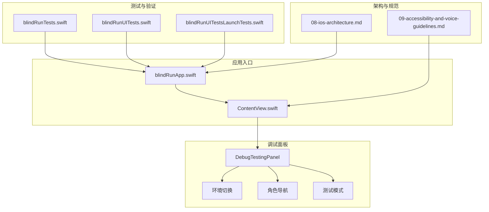
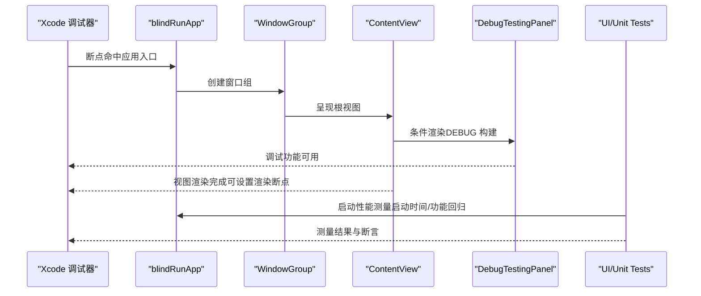
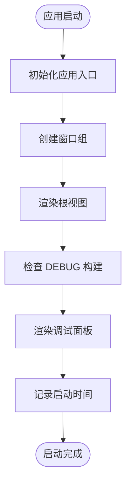
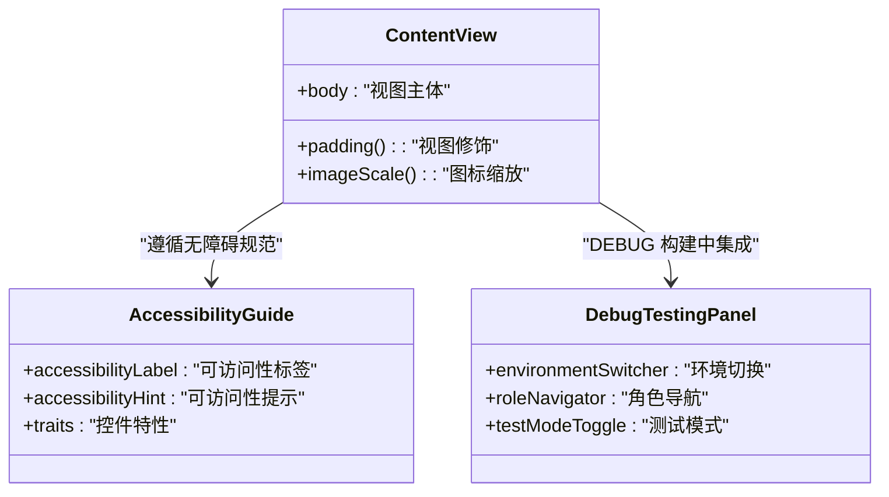
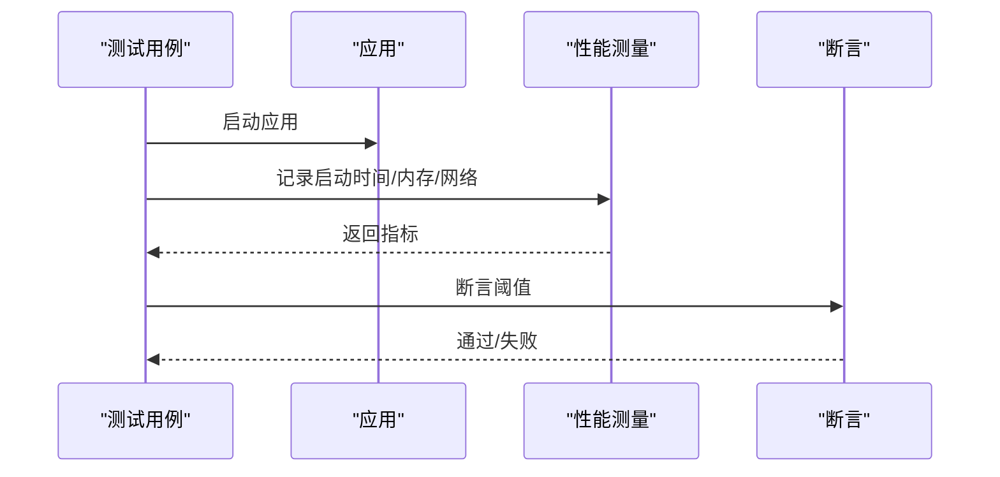
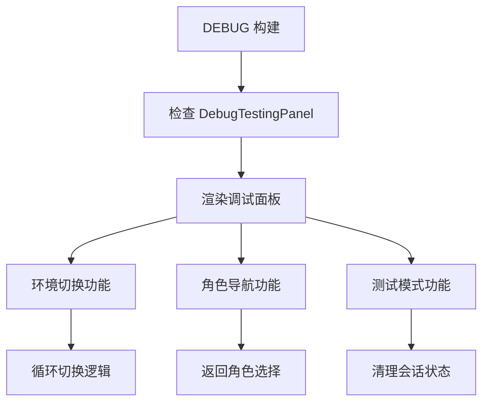
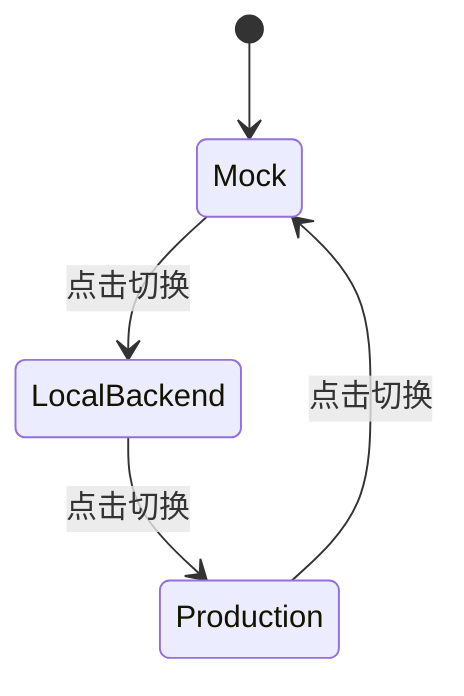
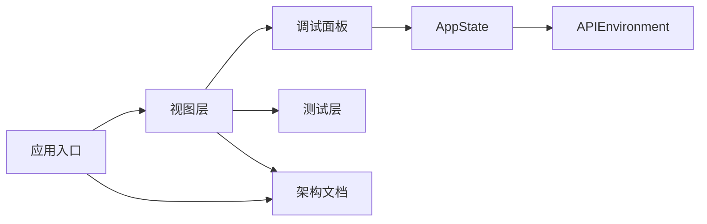

# 调试与性能优化

<cite>
**本文引用的文件**
- [blindRunApp.swift](file://blindRun/blindRunApp.swift)
- [ContentView.swift](file://blindRun/ContentView.swift)
- [BlindRunnerHomeView.swift](file://blindRun/BlindRunner/BlindRunnerHomeView.swift)
- [VolunteerHomeView.swift](file://blindRun/Volunteer/VolunteerHomeView.swift)
- [AppState.swift](file://blindRun/Core/AppState.swift)
- [EnvironmentConfig.swift](file://blindRun/Core/EnvironmentConfig.swift)
- [LoginView.swift](file://blindRun/Auth/LoginView.swift)
- [08-ios-architecture.md](file://docs/08-ios-architecture.md)
- [09-accessibility-and-voice-guidelines.md](file://docs/09-accessibility-and-voice-guidelines.md)
- [blindRunTests.swift](file://blindRunTests/blindRunTests.swift)
- [blindRunUITests.swift](file://blindRunUITests/blindRunUITests.swift)
- [blindRunUITestsLaunchTests.swift](file://blindRunUITests/blindRunUITestsLaunchTests.swift)
- [project.pbxproj](file://blindRun.xcodeproj/project.pbxproj)
</cite>

## 更新摘要
**变更内容**
- 新增调试面板功能章节，详细介绍 DEBUG 构建中可见的调试面板实现
- 添加环境切换、角色选择导航和测试模式切换功能说明
- 更新故障排查指南，增加调试面板相关的问题排查流程
- 补充调试工具与技术章节，涵盖新的调试面板使用方法

## 目录
1. [简介](#简介)
2. [项目结构](#项目结构)
3. [核心组件](#核心组件)
4. [架构总览](#架构总览)
5. [详细组件分析](#详细组件分析)
6. [调试面板功能](#调试面板功能)
7. [依赖分析](#依赖分析)
8. [性能考虑](#性能考虑)
9. [故障排查指南](#故障排查指南)
10. [结论](#结论)
11. [附录](#附录)

## 简介
本指南面向 iOS 开发团队，围绕 blindRun 项目的调试与性能优化目标，系统阐述以下内容：
- 常用调试工具与技术：Xcode 调试器、Instruments 性能分析器、日志分析方法
- 内存泄漏检测、崩溃分析与网络请求监控的实现要点
- 性能瓶颈识别与优化策略：UI 渲染优化、网络请求优化、后台任务管理
- 常见问题排查流程：地图加载缓慢、语音延迟、定位不准确等
- 生产环境问题诊断与用户反馈处理流程
- **新增**：DEBUG 构建中的调试面板功能，提供环境切换、角色选择导航和测试模式切换

本指南结合项目现有架构文档与测试骨架，给出可落地的实践建议与可视化流程。

## 项目结构
blindRun 采用 SwiftUI + MVVM 架构，模块化划分清晰，便于分层调试与性能观测。应用入口为 SwiftUI 应用结构体，主界面为简单示例视图；测试与 UI 测试骨架已就绪，便于集成性能测量与自动化验证。**新增**：在 DEBUG 构建中，盲人跑者和志愿者首页均集成了调试面板，提供便捷的测试功能。

**图表来源**
- [BlindRunnerHomeView.swift:21-25](file://blindRun/BlindRunner/BlindRunnerHomeView.swift#L21-L25)
- [VolunteerHomeView.swift:145-148](file://blindRun/Volunteer/VolunteerHomeView.swift#L145-L148)
- [AppState.swift:138-155](file://blindRun/Core/AppState.swift#L138-L155)

**章节来源**
- [BlindRunnerHomeView.swift:10-40](file://blindRun/BlindRunner/BlindRunnerHomeView.swift#L10-L40)
- [VolunteerHomeView.swift:132-173](file://blindRun/Volunteer/VolunteerHomeView.swift#L132-L173)
- [AppState.swift:9-248](file://blindRun/Core/AppState.swift#L9-L248)

## 核心组件
- 应用入口与场景管理：通过 SwiftUI 应用结构体统一管理窗口组与根视图，便于在调试器中设置断点与观察启动路径。
- 视图层（MVVM）：视图保持薄层，状态渲染与意图转发至 ViewModel；该分层有利于隔离 UI 渲染问题与业务逻辑问题，便于针对性优化。
- **新增**：调试面板组件：在 DEBUG 构建中提供环境切换、角色导航和测试模式切换功能，支持快速测试不同环境和角色状态。
- 测试与性能测量：单元测试与 UI 测试骨架已具备，可直接扩展性能测量与自动化回归。

**章节来源**
- [BlindRunnerHomeView.swift:42-94](file://blindRun/BlindRunner/BlindRunnerHomeView.swift#L42-L94)
- [VolunteerHomeView.swift:272-279](file://blindRun/Volunteer/VolunteerHomeView.swift#L272-L279)
- [AppState.swift:138-223](file://blindRun/Core/AppState.swift#L138-L223)

## 架构总览
下图展示应用启动到视图呈现的关键路径，以及与测试、性能测量的关系。**新增**：调试面板在 DEBUG 构建中的集成位置和交互流程。

**图表来源**
- [BlindRunnerHomeView.swift:21-25](file://blindRun/BlindRunner/BlindRunnerHomeView.swift#L21-L25)
- [VolunteerHomeView.swift:145-148](file://blindRun/Volunteer/VolunteerHomeView.swift#L145-L148)
- [AppState.swift:138-155](file://blindRun/Core/AppState.swift#L138-L155)

**章节来源**
- [BlindRunnerHomeView.swift:10-40](file://blindRun/BlindRunner/BlindRunnerHomeView.swift#L10-L40)
- [VolunteerHomeView.swift:132-173](file://blindRun/Volunteer/VolunteerHomeView.swift#L132-L173)

## 详细组件分析

### 组件一：应用启动与窗口组（调试与性能入口）
- 调试要点
  - 在应用入口设置断点，观察启动阶段是否卡顿或异常。
  - 利用 Xcode 的启动时间指标进行性能测量，结合 UI 测试中的启动性能用例。
- 性能优化
  - 将耗时初始化移至后台线程或懒加载，避免阻塞主线程。
  - 减少启动阶段的 I/O 与网络请求，必要时延迟到首屏渲染后再执行。

**图表来源**
- [BlindRunnerHomeView.swift:21-25](file://blindRun/BlindRunner/BlindRunnerHomeView.swift#L21-L25)
- [VolunteerHomeView.swift:145-148](file://blindRun/Volunteer/VolunteerHomeView.swift#L145-L148)

**章节来源**
- [BlindRunnerHomeView.swift:10-40](file://blindRun/BlindRunner/BlindRunnerHomeView.swift#L10-L40)
- [VolunteerHomeView.swift:132-173](file://blindRun/Volunteer/VolunteerHomeView.swift#L132-L173)

### 组件二：视图渲染与无障碍（UI 渲染优化）
- 调试要点
  - 使用 Xcode 的渲染断点与 Allocations 工具，定位重绘热点与过度布局。
  - 结合无障碍文档，确保关键控件具备可访问性标签与提示，避免因可访问性导致的布局异常。
- 性能优化
  - 避免在视图 body 中进行昂贵计算，将计算结果缓存或延迟到 ViewModel。
  - 控制视图层级深度，合并修饰符，减少不必要的视图重组。

**图表来源**
- [BlindRunnerHomeView.swift:42-94](file://blindRun/BlindRunner/BlindRunnerHomeView.swift#L42-L94)
- [VolunteerHomeView.swift:145-148](file://blindRun/Volunteer/VolunteerHomeView.swift#L145-L148)

**章节来源**
- [BlindRunnerHomeView.swift:10-40](file://blindRun/BlindRunner/BlindRunnerHomeView.swift#L10-L40)
- [VolunteerHomeView.swift:132-173](file://blindRun/Volunteer/VolunteerHomeView.swift#L132-L173)

### 组件三：测试与性能测量（回归与启动性能）
- 单元测试
  - 可在性能测试用例中测量特定函数耗时，结合断言确保回归稳定。
- UI 测试
  - 启动性能测量用于捕获启动阶段的异常波动；可扩展为端到端流程的性能基线。
- 扩展建议
  - 在测试中集成网络请求监控与内存分配统计，形成持续的性能基线。

**图表来源**
- [blindRunTests.swift:31-36](file://blindRunTests/blindRunTests.swift#L31-L36)
- [blindRunUITests.swift:37-42](file://blindRunUITests/blindRunUITests.swift#L37-L42)

**章节来源**
- [blindRunTests.swift:21-36](file://blindRunTests/blindRunTests.swift#L21-L36)
- [blindRunUITests.swift:25-42](file://blindRunUITests/blindRunUITests.swift#L25-L42)

## 调试面板功能

### 调试面板概述
在 DEBUG 构建中，盲人跑者首页和志愿者首页均集成了 `DebugTestingPanel` 组件，提供以下调试功能：
- 环境切换：在 Mock、本地后端和生产环境之间循环切换
- 角色导航：快速返回角色选择页面进行不同身份测试
- 测试模式：提供专门的测试功能入口

### 调试面板实现细节
- **条件编译**：使用 `#if DEBUG` 指令确保调试面板仅在 DEBUG 构建中可见
- **环境管理**：通过 `AppState` 类的调试方法实现环境切换和状态管理
- **无障碍支持**：所有按钮都配备了适当的可访问性标签和提示

**图表来源**
- [BlindRunnerHomeView.swift:21-25](file://blindRun/BlindRunner/BlindRunnerHomeView.swift#L21-L25)
- [BlindRunnerHomeView.swift:42-94](file://blindRun/BlindRunner/BlindRunnerHomeView.swift#L42-L94)
- [VolunteerHomeView.swift:145-148](file://blindRun/Volunteer/VolunteerHomeView.swift#L145-L148)
- [VolunteerHomeView.swift:272-279](file://blindRun/Volunteer/VolunteerHomeView.swift#L272-L279)

### 环境切换功能
调试面板提供三种环境模式的循环切换：
- **Mock 模式**：本地模拟，不进行网络请求
- **本地后端**：连接本地开发服务器
- **生产环境**：正式线上环境

**图表来源**
- [EnvironmentConfig.swift:5-41](file://blindRun/Core/EnvironmentConfig.swift#L5-L41)
- [AppState.swift:143-154](file://blindRun/Core/AppState.swift#L143-L154)

### 角色导航功能
- **返回角色选择**：快速返回角色选择页面，用于测试不同身份下的界面表现
- **状态清理**：切换角色时自动清理相关状态，确保测试环境的纯净性

### 测试模式功能
- **测试环境专用**：仅在 DEBUG 构建中可用
- **安全设计**：切换测试模式会清除当前登录状态，防止测试污染生产数据

**章节来源**
- [BlindRunnerHomeView.swift:42-94](file://blindRun/BlindRunner/BlindRunnerHomeView.swift#L42-L94)
- [VolunteerHomeView.swift:145-148](file://blindRun/Volunteer/VolunteerHomeView.swift#L145-L148)
- [AppState.swift:138-155](file://blindRun/Core/AppState.swift#L138-L155)
- [EnvironmentConfig.swift:5-41](file://blindRun/Core/EnvironmentConfig.swift#L5-L41)

## 依赖分析
- 模块耦合
  - 应用入口与视图层低耦合，便于独立调试与优化。
  - **新增**：调试面板与 `AppState` 的紧密耦合，通过环境管理方法实现功能。
  - 测试层对应用入口与视图层的依赖清晰，利于建立稳定的回归测试矩阵。
- 外部依赖
  - 架构文档明确了网络层、地图与语音等外部能力边界，便于在调试器中隔离问题来源。
  - **新增**：调试面板依赖 `APIEnvironment` 枚举和 `AppState` 的调试方法。

**图表来源**
- [BlindRunnerHomeView.swift:21-25](file://blindRun/BlindRunner/BlindRunnerHomeView.swift#L21-L25)
- [VolunteerHomeView.swift:145-148](file://blindRun/Volunteer/VolunteerHomeView.swift#L145-L148)
- [AppState.swift:138-155](file://blindRun/Core/AppState.swift#L138-L155)
- [EnvironmentConfig.swift:5-41](file://blindRun/Core/EnvironmentConfig.swift#L5-L41)

**章节来源**
- [BlindRunnerHomeView.swift:10-40](file://blindRun/BlindRunner/BlindRunnerHomeView.swift#L10-L40)
- [VolunteerHomeView.swift:132-173](file://blindRun/Volunteer/VolunteerHomeView.swift#L132-L173)
- [AppState.swift:9-248](file://blindRun/Core/AppState.swift#L9-L248)

## 性能考虑
- UI 渲染优化
  - 使用渲染断点与 Allocations 工具定位重绘热点；减少视图重组与修饰符滥用。
  - 将昂贵计算移出视图 body，利用 ViewModel 缓存结果。
  - **新增**：调试面板使用条件编译，避免在 RELEASE 构建中影响性能。
- 网络请求优化
  - 在测试中集成网络请求监控，记录往返时间与错误率；对高频接口引入合理的缓存与节流。
- 后台任务管理
  - 避免在主线程执行耗时任务；合理使用并发队列与异步回调。
- 启动性能
  - 通过 UI 测试的启动性能用例建立基线，持续监控启动时间波动。
- **新增**：调试面板性能优化
  - 调试面板仅在 DEBUG 构建中存在，不会影响生产环境性能。
  - 环境切换操作轻量级，通过 `UserDefaults` 进行状态持久化。

## 故障排查指南

### 启动缓慢
- 排查步骤
  - 在应用入口设置断点，检查启动路径是否阻塞。
  - 使用 UI 测试的启动性能测量，定位异常波动。
- 解决方案
  - 将耗时初始化移至后台或懒加载；减少启动阶段 I/O 与网络请求。

**章节来源**
- [blindRunUITests.swift:37-42](file://blindRunUITests/blindRunUITests.swift#L37-L42)
- [BlindRunnerHomeView.swift:10-40](file://blindRun/BlindRunner/BlindRunnerHomeView.swift#L10-L40)

### 视图渲染卡顿
- 排查步骤
  - 使用渲染断点与 Allocations 定位重绘热点；检查视图层级与修饰符使用。
- 解决方案
  - 减少不必要的视图重组；将昂贵计算移出视图 body。

**章节来源**
- [BlindRunnerHomeView.swift:10-40](file://blindRun/BlindRunner/BlindRunnerHomeView.swift#L10-L40)
- [VolunteerHomeView.swift:132-173](file://blindRun/Volunteer/VolunteerHomeView.swift#L132-L173)

### 网络请求异常
- 排查步骤
  - 在测试中集成网络请求监控，记录往返时间与错误率。
- 解决方案
  - 对高频接口引入缓存与节流；优化请求参数与序列化。

**章节来源**
- [08-ios-architecture.md:68-77](file://docs/08-ios-architecture.md#L68-L77)
- [blindRunTests.swift:31-36](file://blindRunTests/blindRunTests.swift#L31-L36)

### 语音延迟
- 排查步骤
  - 检查语音播报触发频率与队列积压；结合无障碍文档核对播报节点。
- 解决方案
  - 避免重复播报；对频繁状态变化引入去抖策略。

**章节来源**
- [09-accessibility-and-voice-guidelines.md:13-36](file://docs/09-accessibility-and-voice-guidelines.md#L13-L36)

### 定位不准确
- 排查步骤
  - 检查权限状态与权限引导；结合无障碍文档确保错误提示清晰。
- 解决方案
  - 提供明确的权限引导与 TTS 提示；在模拟器中保留演示坐标以保证演示稳定性。

**章节来源**
- [08-ios-architecture.md:107-118](file://docs/08-ios-architecture.md#L107-L118)
- [09-accessibility-and-voice-guidelines.md:37-61](file://docs/09-accessibility-and-voice-guidelines.md#L37-L61)

### 调试面板相关问题
- **调试面板不可见**
  - 检查构建配置是否为 DEBUG 构建
  - 确认 `#if DEBUG` 条件编译指令正确
- **环境切换无效**
  - 检查 `AppState.debugTestEnvironments` 数组配置
  - 验证 `switchToNextEnvironmentForTesting()` 方法调用
- **角色导航功能异常**
  - 检查 `returnToRoleSelectionForTesting()` 方法实现
  - 确认状态清理逻辑正常执行
- **测试模式切换后登录状态异常**
  - 检查 `clearSession()` 方法调用时机
  - 验证会话状态重置逻辑

**章节来源**
- [BlindRunnerHomeView.swift:42-94](file://blindRun/BlindRunner/BlindRunnerHomeView.swift#L42-L94)
- [VolunteerHomeView.swift:145-148](file://blindRun/Volunteer/VolunteerHomeView.swift#L145-L148)
- [AppState.swift:138-155](file://blindRun/Core/AppState.swift#L138-L155)

### 生产环境问题诊断与用户反馈处理
- 诊断流程
  - 通过测试用例建立性能基线；收集崩溃日志与网络监控数据。
  - **新增**：利用调试面板功能进行环境隔离测试，避免生产数据污染。
- 用户反馈处理
  - 建立标准化的反馈收集模板，包含设备信息、复现步骤与期望/实际结果。

## 结论
本指南基于项目现有架构与测试骨架，提供了从调试工具到性能优化的完整实践路径。**新增**的调试面板功能进一步增强了开发和测试效率，建议在后续迭代中逐步完善：
- 在测试中集成更细粒度的性能监控（网络、内存、渲染）
- 建立持续的性能基线与回归矩阵
- 强化生产环境的日志与崩溃上报机制
- **新增**：完善调试面板的功能覆盖和用户体验

## 附录
- 构建配置参考：可在项目构建设置中启用调试符号与性能分析选项，便于 Instruments 采集更详细的指标。
- **新增**：调试面板使用指南
  - 在 DEBUG 构建中，打开应用即可看到底部的调试面板
  - 点击"返回角色选择"按钮可快速切换身份进行测试
  - 点击"切换测试模式"按钮可循环切换 API 环境
  - 环境切换会自动清理登录状态，确保测试隔离性

**章节来源**
- [project.pbxproj:271-538](file://blindRun.xcodeproj/project.pbxproj#L271-L538)
- [BlindRunnerHomeView.swift:42-94](file://blindRun/BlindRunner/BlindRunnerHomeView.swift#L42-L94)
- [VolunteerHomeView.swift:145-148](file://blindRun/Volunteer/VolunteerHomeView.swift#L145-L148)
- [AppState.swift:138-155](file://blindRun/Core/AppState.swift#L138-L155)