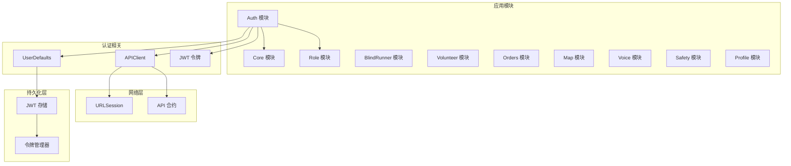
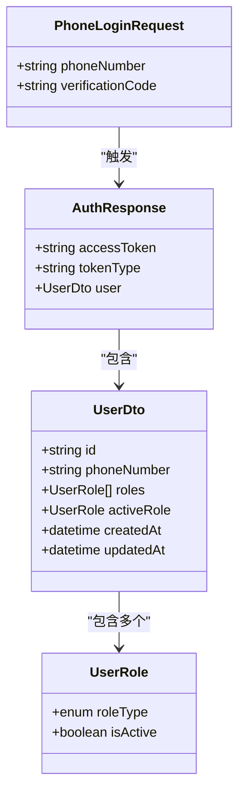
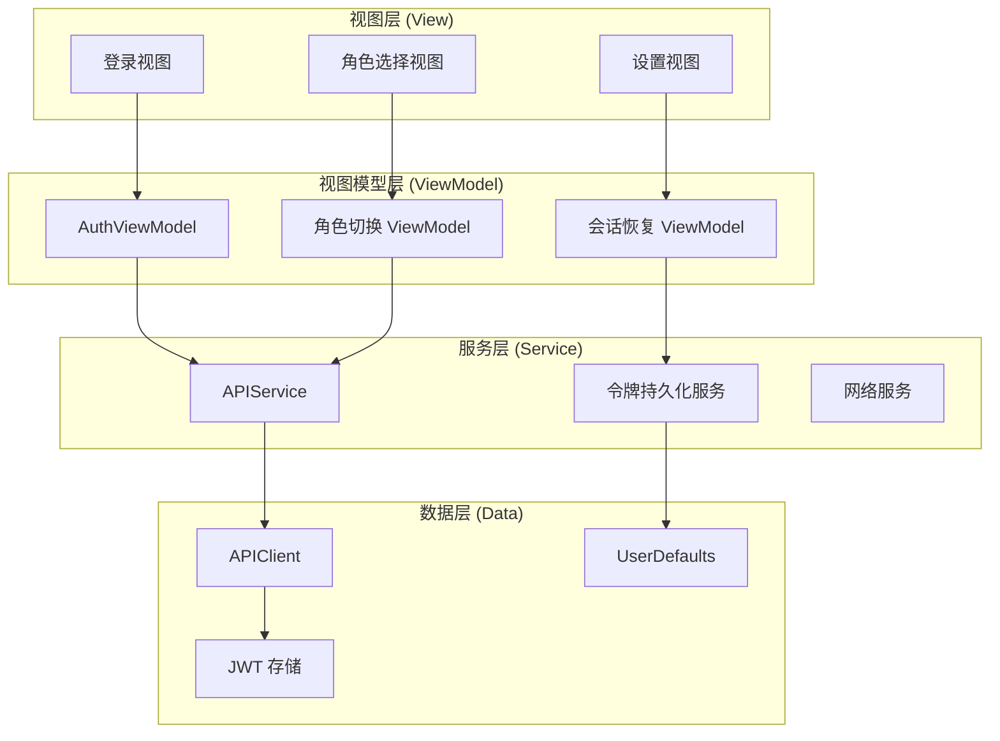
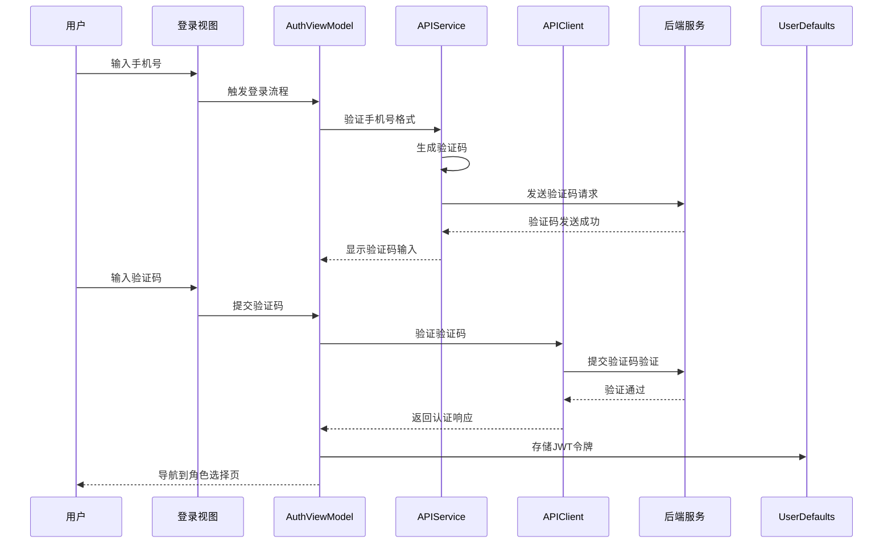
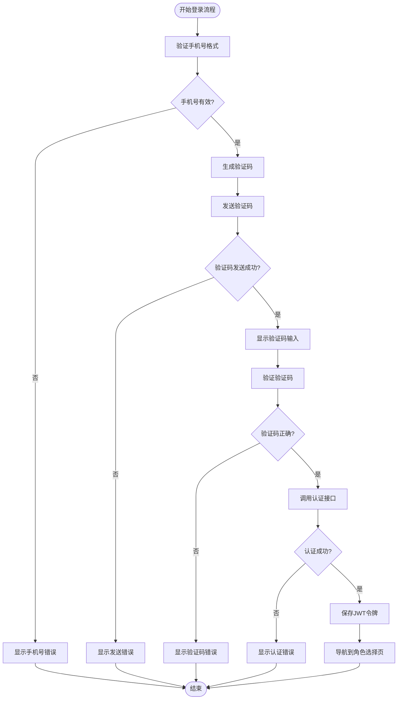
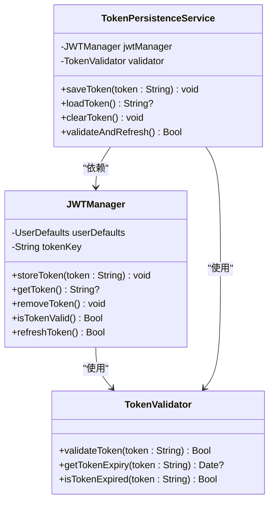
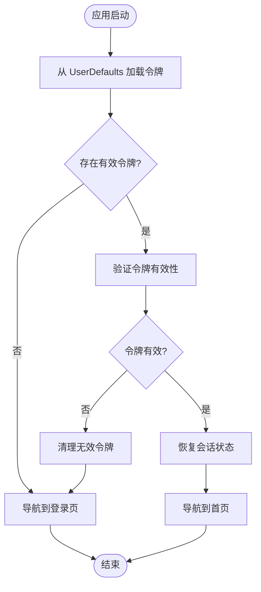
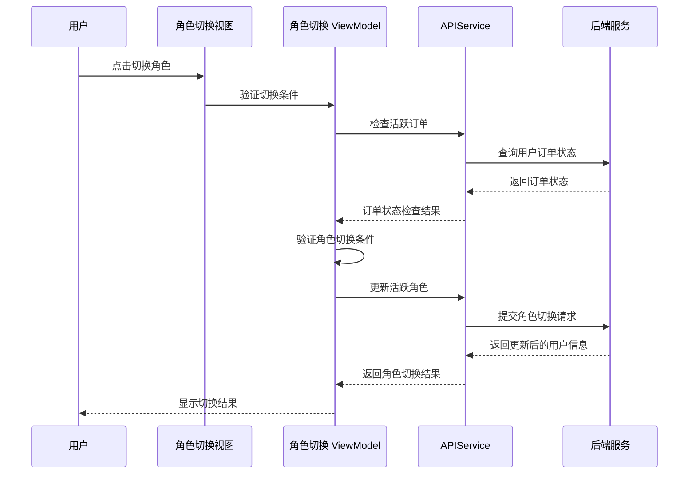
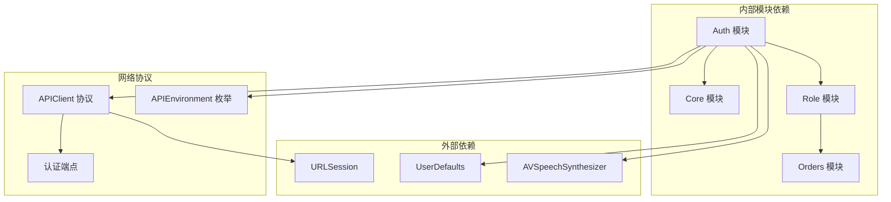

# Auth 认证模块

<cite>
**本文档引用的文件**
- [spec.md](file://openspec/changes/add-aidrun-ios-spring-mvp/specs/auth-phone-login/spec.md)
- [08-ios-architecture.md](file://docs/08-ios-architecture.md)
- [02-mvp-scope.md](file://docs/02-mvp-scope.md)
- [design.md](file://openspec/changes/add-aidrun-ios-spring-mvp/design.md)
- [tasks.md](file://openspec/changes/add-aidrun-ios-spring-mvp/tasks.md)
- [07-api-contract.openapi.yaml](file://docs/07-api-contract.openapi.yaml)
- [03-user-stories.md](file://docs/03-user-stories.md)
- [spec.md](file://openspec/changes/add-aidrun-ios-spring-mvp/specs/role-switching/spec.md)
</cite>

## 目录
1. [简介](#简介)
2. [项目结构](#项目结构)
3. [核心组件](#核心组件)
4. [架构概览](#架构概览)
5. [详细组件分析](#详细组件分析)
6. [依赖关系分析](#依赖关系分析)
7. [性能考虑](#性能考虑)
8. [故障排除指南](#故障排除指南)
9. [结论](#结论)
10. [附录](#附录)

## 简介

Auth 认证模块是 AidRun MVP v0.3 iOS 应用的核心功能模块，负责处理手机号登录、验证码验证、JWT 令牌管理和认证状态持久化。该模块采用 Swift 原生 iOS 开发，基于 SwiftUI + MVVM 架构，实现了完整的认证流程，包括用户注册、登录、角色切换和会话管理。

## 项目结构

Auth 认证模块位于独立的 `Auth` 模块中，遵循模块化设计原则，与其他核心模块（Core、Role、BlindRunner、Volunteer 等）协同工作。

**图表来源**
- [08-ios-architecture.md:18-32](file://docs/08-ios-architecture.md#L18-L32)
- [02-mvp-scope.md:119-133](file://docs/02-mvp-scope.md#L119-L133)

**章节来源**
- [08-ios-architecture.md:18-32](file://docs/08-ios-architecture.md#L18-L32)
- [02-mvp-scope.md:119-133](file://docs/02-mvp-scope.md#L119-L133)

## 核心组件

### 认证流程组件

Auth 模块包含以下核心组件：

1. **AuthViewModel**: 处理手机号登录和验证码验证的 ViewModel
2. **APIClient**: 网络客户端，负责 API 调用和 JWT 令牌管理
3. **UserDefaults**: 本地存储，用于 JWT 令牌的临时存储
4. **AuthResponse**: 认证响应数据模型
5. **PhoneLoginRequest**: 手机号登录请求数据模型

### 数据模型组件

**图表来源**
- [07-api-contract.openapi.yaml:611-656](file://docs/07-api-contract.openapi.yaml#L611-L656)

**章节来源**
- [07-api-contract.openapi.yaml:611-656](file://docs/07-api-contract.openapi.yaml#L611-L656)
- [08-ios-architecture.md:44](file://docs/08-ios-architecture.md#L44)

## 架构概览

Auth 认证模块采用 MVVM 架构模式，实现了清晰的关注点分离：

**图表来源**
- [08-ios-architecture.md:33-49](file://docs/08-ios-architecture.md#L33-L49)
- [08-ios-architecture.md:68-82](file://docs/08-ios-architecture.md#L68-L82)

## 详细组件分析

### 手机号登录流程

手机号登录是认证系统的核心功能，实现了无缝的用户注册和登录体验：

**图表来源**
- [spec.md:7-13](file://openspec/changes/add-aidrun-ios-spring-mvp/specs/auth-phone-login/spec.md#L7-L13)
- [08-ios-architecture.md:86-91](file://docs/08-ios-architecture.md#L86-L91)

#### 登录流程算法

**图表来源**
- [spec.md:15-21](file://openspec/changes/add-aidrun-ios-spring-mvp/specs/auth-phone-login/spec.md#L15-L21)
- [03-user-stories.md:71-79](file://docs/03-user-stories.md#L71-L79)

### JWT 令牌管理

JWT 令牌管理是认证系统的关键组件，负责令牌的存储、验证和刷新：

**图表来源**
- [08-ios-architecture.md:78-82](file://docs/08-ios-architecture.md#L78-L82)
- [design.md:30-32](file://openspec/changes/add-aidrun-ios-spring-mvp/design.md#L30-L32)

### 认证状态持久化

认证状态的持久化通过 UserDefaults 实现，确保应用重启后能够恢复用户的登录状态：

**图表来源**
- [03-user-stories.md:71-79](file://docs/03-user-stories.md#L71-L79)
- [08-ios-architecture.md:80](file://docs/08-ios-architecture.md#L80)

**章节来源**
- [08-ios-architecture.md:78-82](file://docs/08-ios-architecture.md#L78-L82)
- [03-user-stories.md:71-79](file://docs/03-user-stories.md#L71-L79)

### 角色切换认证

角色切换功能允许用户在盲人跑者和志愿者角色之间切换，同时保持相同的 JWT 令牌：

**图表来源**
- [spec.md:7-9](file://openspec/changes/add-aidrun-ios-spring-mvp/specs/role-switching/spec.md#L7-L9)
- [08-ios-architecture.md:92-96](file://docs/08-ios-architecture.md#L92-L96)

**章节来源**
- [spec.md:11-17](file://openspec/changes/add-aidrun-ios-spring-mvp/specs/role-switching/spec.md#L11-L17)
- [08-ios-architecture.md:92-96](file://docs/08-ios-architecture.md#L92-L96)

## 依赖关系分析

Auth 认证模块的依赖关系体现了清晰的分层架构：

**图表来源**
- [08-ios-architecture.md:50-67](file://docs/08-ios-architecture.md#L50-L67)
- [08-ios-architecture.md:68-82](file://docs/08-ios-architecture.md#L68-L82)

**章节来源**
- [08-ios-architecture.md:50-82](file://docs/08-ios-architecture.md#L50-L82)

## 性能考虑

### 令牌存储性能

- **UserDefaults 性能**: 使用 UserDefaults 进行轻量级数据存储，适合 MVP 阶段的 JWT 令牌存储
- **Keychain 迁移**: 计划在生产环境中迁移到 Keychain，提供更好的安全性
- **存储优化**: 仅存储必要的 JWT 令牌和环境设置，避免不必要的数据冗余

### 网络请求优化

- **异步处理**: 使用 async/await 模型处理网络请求，避免阻塞主线程
- **请求缓存**: 对于非敏感的认证相关数据，考虑适当的缓存策略
- **连接复用**: 利用 URLSession 的连接池特性，减少网络延迟

### 用户体验优化

- **加载状态**: 提供清晰的加载指示器和进度反馈
- **错误处理**: 实现优雅的错误处理和用户友好的错误消息
- **重试机制**: 简单的网络重试逻辑，避免复杂的离线队列

## 故障排除指南

### 常见认证问题

#### 令牌失效问题

**症状**: 用户登录后一段时间自动退出登录

**解决方案**:
1. 检查令牌过期时间设置
2. 实现令牌自动刷新机制
3. 添加令牌刷新失败的降级处理

#### 网络连接问题

**症状**: 验证码发送失败或认证请求超时

**解决方案**:
1. 实现网络状态监控
2. 添加重试机制和指数退避算法
3. 提供离线模式下的本地验证选项

#### 用户体验问题

**症状**: 用户界面卡顿或响应缓慢

**解决方案**:
1. 确保所有网络请求都在后台线程执行
2. 实现适当的加载状态和进度指示
3. 优化视图渲染性能

### 调试建议

1. **日志记录**: 实现详细的认证流程日志记录
2. **错误监控**: 集成错误监控系统，跟踪认证失败原因
3. **性能分析**: 使用 Instruments 分析认证相关的性能瓶颈

**章节来源**
- [08-ios-architecture.md:70-77](file://docs/08-ios-architecture.md#L70-L77)
- [02-mvp-scope.md:207-216](file://docs/02-mvp-scope.md#L207-L216)

## 结论

Auth 认证模块为 AidRun 应用提供了完整的身份验证解决方案，实现了手机号登录、验证码验证、JWT 令牌管理和会话持久化。模块采用清晰的 MVVM 架构，具有良好的可维护性和扩展性。

### 主要成就

1. **完整的认证流程**: 从手机号输入到角色选择的完整认证体验
2. **灵活的角色管理**: 支持双角色切换和活跃角色管理
3. **模块化设计**: 清晰的模块边界和依赖关系
4. **MVP 优化**: 针对演示阶段的性能和功能优化

### 未来改进方向

1. **安全增强**: 迁移到 Keychain 存储，增强令牌安全性
2. **功能扩展**: 支持多种认证方式（Google、GitHub、邮箱等）
3. **性能优化**: 实现更高效的令牌管理和网络请求处理
4. **用户体验**: 提供更丰富的认证反馈和错误处理

## 附录

### API 端点规范

认证模块使用的 API 端点包括：

- `POST /api/auth/phone-login`: 手机号登录
- `GET /api/auth/me`: 获取当前用户信息
- `PUT /api/auth/role`: 切换活跃角色

### 错误码定义

- `INVALID_VERIFICATION_CODE`: 验证码无效
- `ACTIVE_ORDER_ROLE_SWITCH_BLOCKED`: 存在活跃订单，无法切换角色

### 最佳实践清单

1. **安全性**: 始终使用 HTTPS 传输，考虑 Keychain 存储
2. **可靠性**: 实现适当的重试机制和错误处理
3. **性能**: 优化网络请求和本地存储性能
4. **可维护性**: 保持代码简洁，注释完整
5. **用户体验**: 提供清晰的反馈和引导