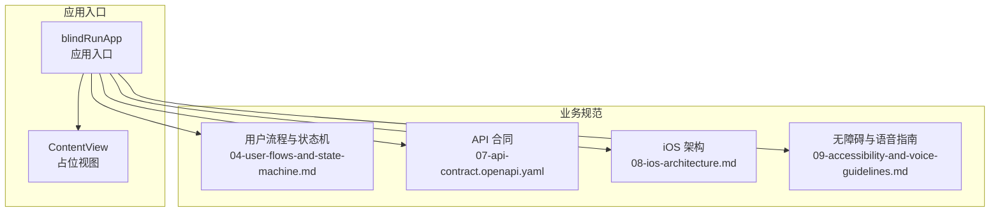
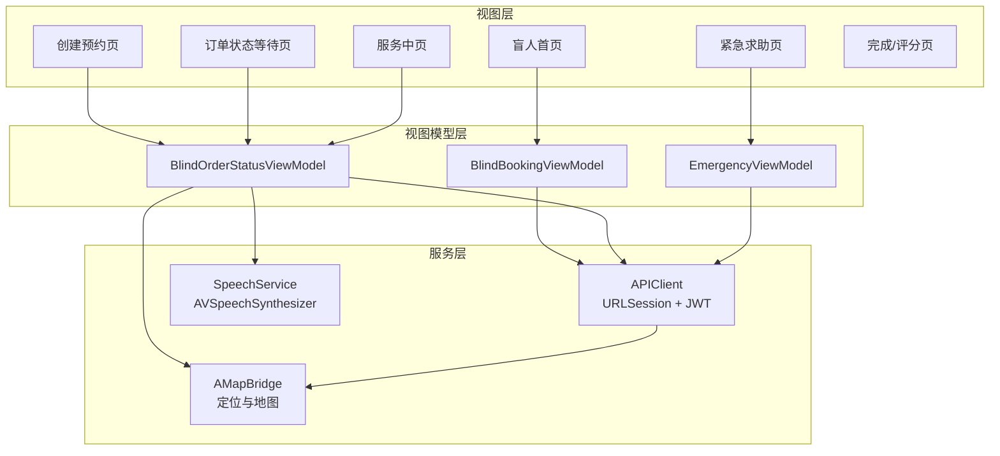
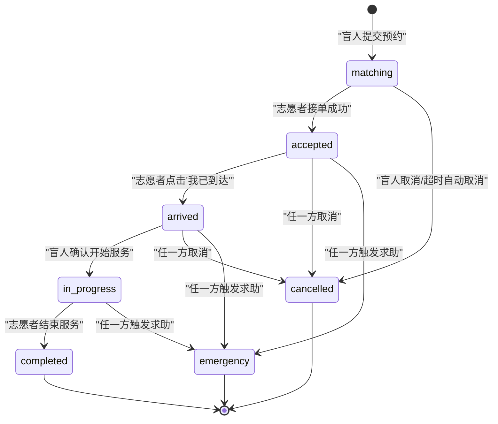
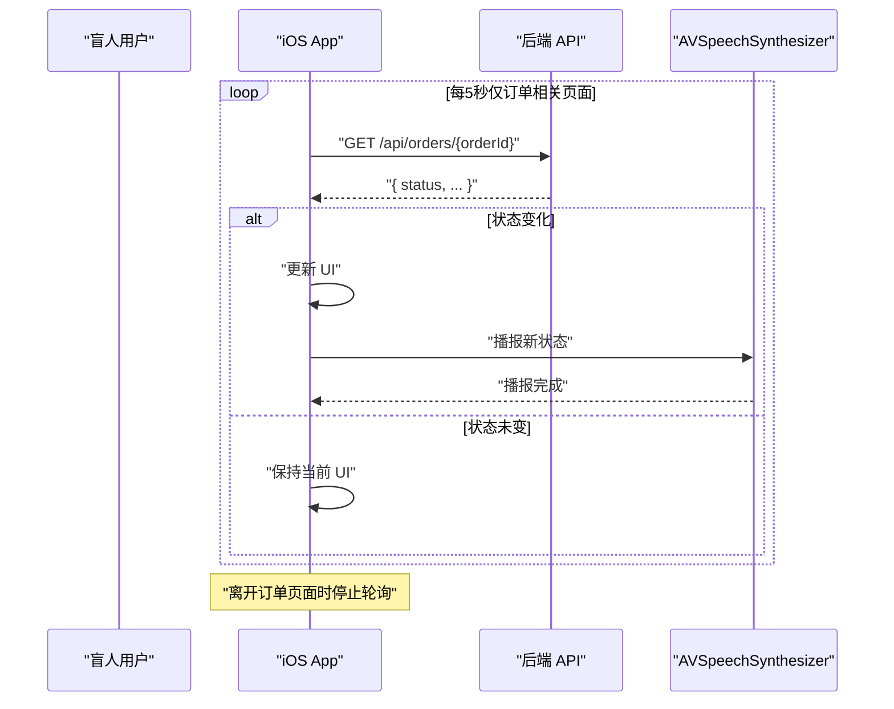
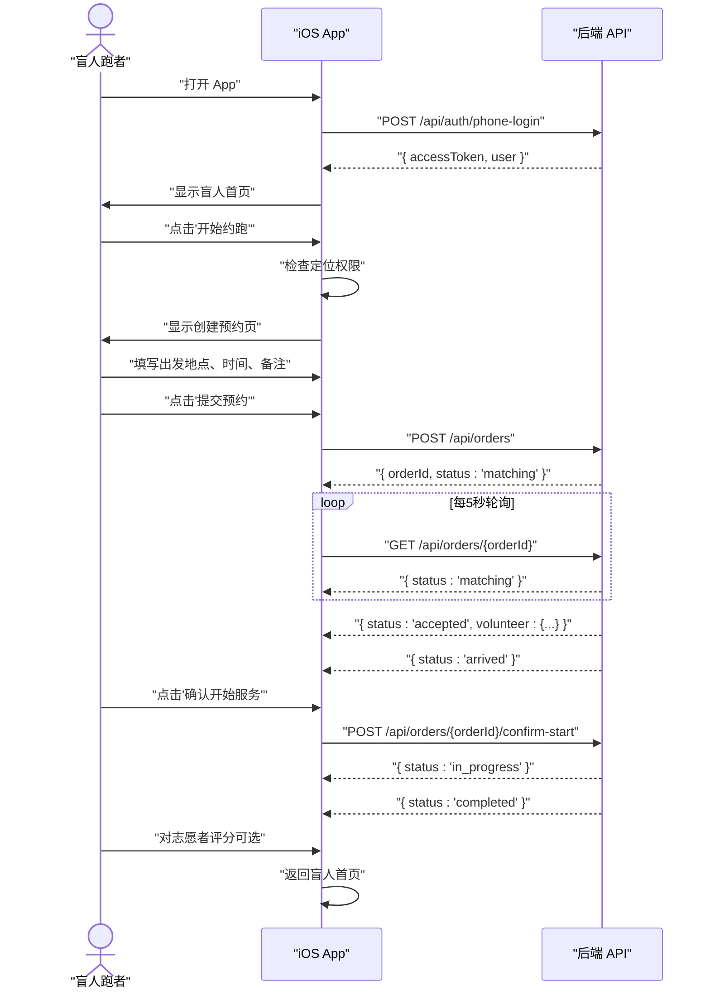
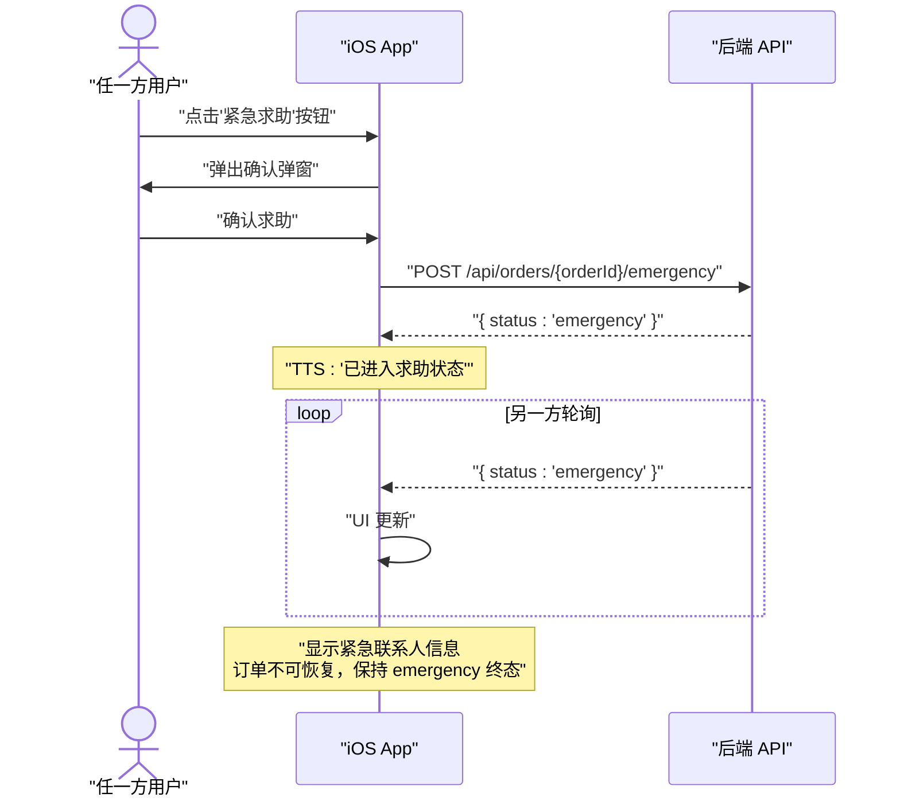
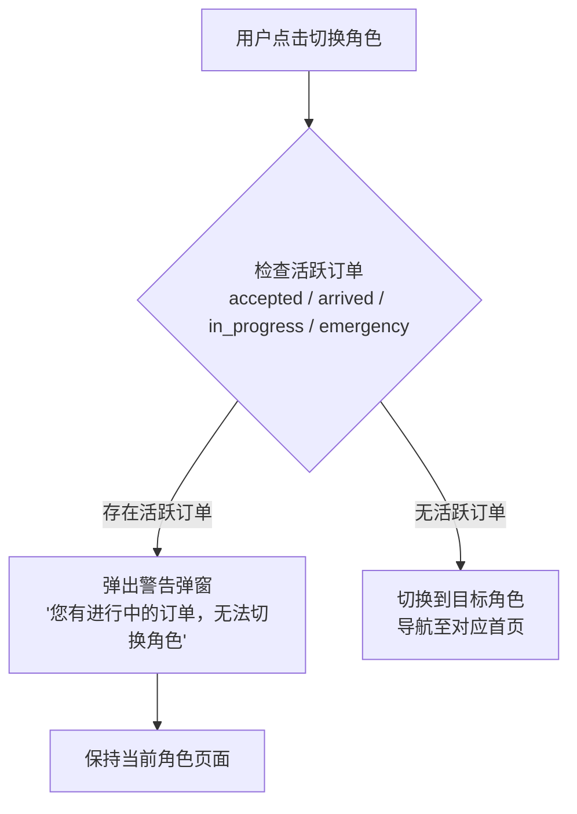
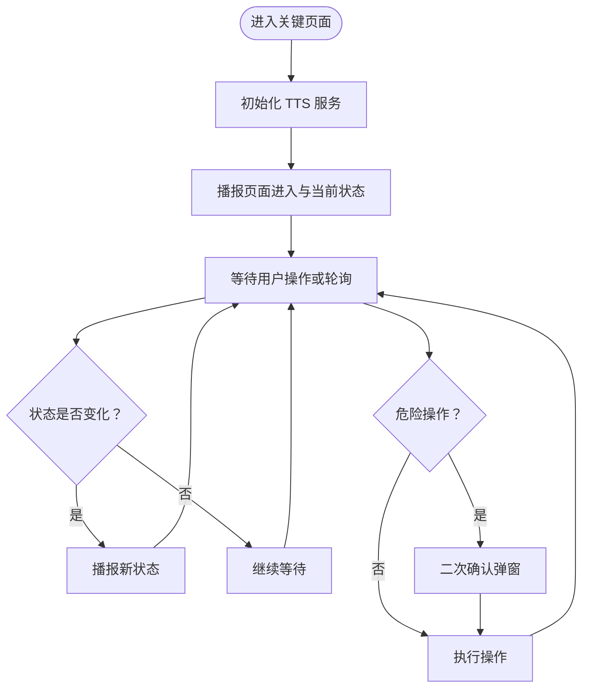
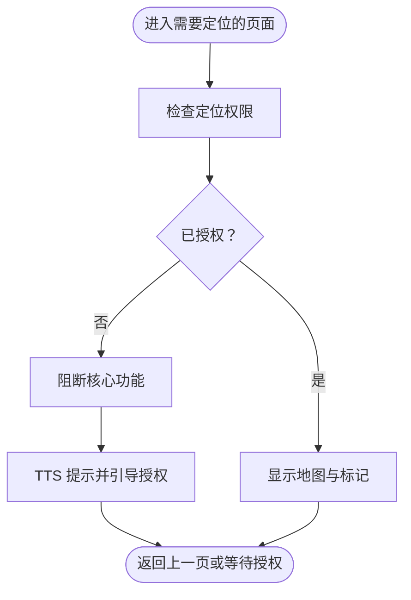
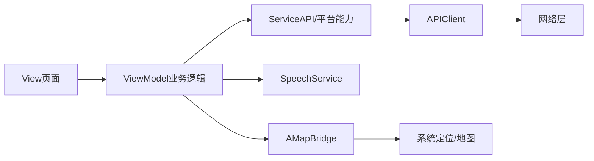

# BlindRunner 盲人跑者模块

<cite>
**本文档引用的文件**
- [blindRunApp.swift](file://blindRun/blindRunApp.swift)
- [ContentView.swift](file://blindRun/ContentView.swift)
- [04-user-flows-and-state-machine.md](file://docs/04-user-flows-and-state-machine.md)
- [07-api-contract.openapi.yaml](file://docs/07-api-contract.openapi.yaml)
- [08-ios-architecture.md](file://docs/08-ios-architecture.md)
- [09-accessibility-and-voice-guidelines.md](file://docs/09-accessibility-and-voice-guidelines.md)
- [00-consistency-check-report.md](file://docs/00-consistency-check-report.md)
- [blind-runner-booking/spec.md](file://openspec/changes/add-aidrun-ios-spring-mvp/specs/blind-runner-booking/spec.md)
- [order-status-lifecycle/spec.md](file://openspec/changes/add-aidrun-ios-spring-mvp/specs/order-status-lifecycle/spec.md)
- [amap-location/spec.md](file://openspec/changes/add-aidrun-ios-spring-mvp/specs/amap-location/spec.md)
- [accessibility-voice-ui/spec.md](file://openspec/changes/add-aidrun-ios-spring-mvp/specs/accessibility-voice-ui/spec.md)
- [blindRunTests.swift](file://blindRunTests/blindRunTests.swift)
- [blindRunUITests.swift](file://blindRunUITests/blindRunUITests.swift)
</cite>

## 目录
1. [简介](#简介)
2. [项目结构](#项目结构)
3. [核心组件](#核心组件)
4. [架构总览](#架构总览)
5. [详细组件分析](#详细组件分析)
6. [依赖关系分析](#依赖关系分析)
7. [性能考虑](#性能考虑)
8. [故障排除指南](#故障排除指南)
9. [结论](#结论)
10. [附录](#附录)

## 简介
本文件为 BlindRunner 盲人跑者模块的功能实现文档，面向 iOS 开发团队与产品设计人员，系统阐述盲人跑者端从登录、资料管理、预约创建、订单状态跟踪到服务完成的完整使用流程。文档重点说明订单生命周期的状态机实现、轮询机制与状态更新通知策略、无障碍设计（VoiceOver、TTS、大按钮）以及定位权限处理、地图集成与紧急求助等关键技术细节。

## 项目结构
当前仓库包含最小可用的 SwiftUI 应用骨架与完整的业务与技术规范文档。应用入口为 SwiftUI App 类型，主视图为简单占位内容视图，实际业务页面与 ViewModel 将按 MVVM 架构组织在后续开发中。

**图表来源**
- [blindRunApp.swift:10-17](file://blindRun/blindRunApp.swift#L10-L17)
- [ContentView.swift:10-20](file://blindRun/ContentView.swift#L10-L20)
- [04-user-flows-and-state-machine.md:1-70](file://docs/04-user-flows-and-state-machine.md#L1-L70)
- [07-api-contract.openapi.yaml:1-50](file://docs/07-api-contract.openapi.yaml#L1-L50)
- [08-ios-architecture.md:1-32](file://docs/08-ios-architecture.md#L1-L32)
- [09-accessibility-and-voice-guidelines.md:1-36](file://docs/09-accessibility-and-voice-guidelines.md#L1-L36)

**章节来源**
- [blindRunApp.swift:10-17](file://blindRun/blindRunApp.swift#L10-L17)
- [ContentView.swift:10-20](file://blindRun/ContentView.swift#L10-L20)

## 核心组件
- 订单生命周期与状态机：定义了从匹配到完成的标准流程及紧急状态的终态特性。
- 轮询机制：盲人端在关键页面以固定频率轮询订单状态，确保实时更新与 TTS 通知。
- 无障碍与语音：基于 VoiceOver、TTS 与大按钮的设计准则，保障视障用户的完整操作闭环。
- 定位与地图：集成高德地图，实现真实地图、当前位置与订单起点标注，以及本地距离计算与排序。
- 紧急求助：统一的求助触发机制，进入紧急状态后不再允许常规生命周期动作。

**章节来源**
- [04-user-flows-and-state-machine.md:72-118](file://docs/04-user-flows-and-state-machine.md#L72-L118)
- [08-ios-architecture.md:125-139](file://docs/08-ios-architecture.md#L125-L139)
- [09-accessibility-and-voice-guidelines.md:13-36](file://docs/09-accessibility-and-voice-guidelines.md#L13-L36)
- [amap-location/spec.md:3-38](file://openspec/changes/add-aidrun-ios-spring-mvp/specs/amap-location/spec.md#L3-L38)

## 架构总览
BlindRunner 模块遵循 SwiftUI + MVVM 架构，采用 URLSession 进行网络通信，使用本地 UserDefaults 存储 JWT（生产环境需迁移到 Keychain）。应用通过 OpenAPI 合同约束前后端契约，确保状态机与轮询行为的一致性。

**图表来源**
- [08-ios-architecture.md:33-49](file://docs/08-ios-architecture.md#L33-L49)
- [07-api-contract.openapi.yaml:150-387](file://docs/07-api-contract.openapi.yaml#L150-L387)
- [09-accessibility-and-voice-guidelines.md:13-36](file://docs/09-accessibility-and-voice-guidelines.md#L13-L36)

## 详细组件分析

### 订单生命周期与状态机
订单状态机覆盖正常流转与异常终态，明确各状态间的允许转换与禁止转换规则。轮询机制确保在关键页面持续监控状态变化，并通过 TTS 与 UI 同步更新。

**图表来源**
- [04-user-flows-and-state-machine.md:75-96](file://docs/04-user-flows-and-state-machine.md#L75-L96)

**章节来源**
- [04-user-flows-and-state-machine.md:72-118](file://docs/04-user-flows-and-state-machine.md#L72-L118)
- [order-status-lifecycle/spec.md:3-50](file://openspec/changes/add-aidrun-ios-spring-mvp/specs/order-status-lifecycle/spec.md#L3-L50)

### 轮询机制与状态更新通知
盲人端在订单状态等待页与服务中页以固定周期轮询订单详情，检测状态变化后同步更新 UI 并播报 TTS。轮询在页面离开、订单进入终态或用户登出时停止。

**图表来源**
- [04-user-flows-and-state-machine.md:277-299](file://docs/04-user-flows-and-state-machine.md#L277-L299)
- [08-ios-architecture.md:125-139](file://docs/08-ios-architecture.md#L125-L139)

**章节来源**
- [04-user-flows-and-state-machine.md:275-299](file://docs/04-user-flows-and-state-machine.md#L275-L299)
- [08-ios-architecture.md:125-139](file://docs/08-ios-architecture.md#L125-L139)

### 盲人跑者正向使用流程
从登录到完成的完整路径，包含定位权限检查、预约创建、志愿者接单、到达确认、服务开始与结束、以及可选评分环节。

**图表来源**
- [04-user-flows-and-state-machine.md:123-178](file://docs/04-user-flows-and-state-machine.md#L123-L178)
- [07-api-contract.openapi.yaml:150-387](file://docs/07-api-contract.openapi.yaml#L150-L387)

**章节来源**
- [04-user-flows-and-state-machine.md:120-178](file://docs/04-user-flows-and-state-machine.md#L120-L178)
- [blind-runner-booking/spec.md:11-25](file://openspec/changes/add-aidrun-ios-spring-mvp/specs/blind-runner-booking/spec.md#L11-L25)

### 紧急求助流程
任一方在特定状态下触发求助，订单进入紧急终态，系统不再允许常规生命周期动作，同时向另一方推送状态变化并播报 TTS。

**图表来源**
- [04-user-flows-and-state-machine.md:232-257](file://docs/04-user-flows-and-state-machine.md#L232-L257)
- [order-status-lifecycle/spec.md:27-30](file://openspec/changes/add-aidrun-ios-spring-mvp/specs/order-status-lifecycle/spec.md#L27-L30)

**章节来源**
- [04-user-flows-and-state-machine.md:230-257](file://docs/04-user-flows-and-state-machine.md#L230-L257)
- [order-status-lifecycle/spec.md:27-30](file://openspec/changes/add-aidrun-ios-spring-mvp/specs/order-status-lifecycle/spec.md#L27-L30)

### 角色切换拦截流程
当存在活跃订单时，系统阻止用户切换角色，防止影响正在进行的服务。

**图表来源**
- [04-user-flows-and-state-machine.md:261-273](file://docs/04-user-flows-and-state-machine.md#L261-L273)
- [07-api-contract.openapi.yaml:61-81](file://docs/07-api-contract.openapi.yaml#L61-L81)

**章节来源**
- [04-user-flows-and-state-machine.md:259-273](file://docs/04-user-flows-and-state-machine.md#L259-L273)
- [07-api-contract.openapi.yaml:61-81](file://docs/07-api-contract.openapi.yaml#L61-L81)

### 无障碍设计实现方案
- VoiceOver 支持：为关键按钮、输入框与状态文本提供清晰的 accessibilityLabel 与 accessibilityHint。
- TTS 语音播报：在状态变更时播报关键节点，避免轮询期间重复播报。
- 大按钮设计：主操作按钮高度不低于 64pt，确保触控准确性。
- 语音输入：仅在文本输入场景使用 Speech 框架，失败时回退键盘输入。
- 危险操作确认：取消订单、进入紧急状态、完成服务等均需二次确认。

**图表来源**
- [09-accessibility-and-voice-guidelines.md:13-36](file://docs/09-accessibility-and-voice-guidelines.md#L13-L36)
- [09-accessibility-and-voice-ui/spec.md:19-34](file://openspec/changes/add-aidrun-ios-spring-mvp/specs/accessibility-voice-ui/spec.md#L19-L34)

**章节来源**
- [09-accessibility-and-voice-guidelines.md:13-36](file://docs/09-accessibility-and-voice-guidelines.md#L13-L36)
- [09-accessibility-and-voice-ui/spec.md:1-42](file://openspec/changes/add-aidrun-ios-spring-mvp/specs/accessibility-voice-ui/spec.md#L1-L42)

### 定位权限处理与地图集成
- 定位权限：盲人端创建预约与志愿者端按距离筛选订单均需定位权限，拒绝时阻断核心流程并播报 TTS 提示。
- 地图集成：显示真实地图、当前位置与订单起点标记；志愿者端在本地计算距离并排序。
- 演示回退：模拟器无定位时使用默认坐标，但需明确提示真实定位权限要求。

**图表来源**
- [amap-location/spec.md:11-38](file://openspec/changes/add-aidrun-ios-spring-mvp/specs/amap-location/spec.md#L11-L38)
- [08-ios-architecture.md:107-118](file://docs/08-ios-architecture.md#L107-L118)

**章节来源**
- [amap-location/spec.md:1-38](file://openspec/changes/add-aidrun-ios-spring-mvp/specs/amap-location/spec.md#L1-L38)
- [08-ios-architecture.md:98-118](file://docs/08-ios-architecture.md#L98-L118)

### 资料管理与预约创建
- 资料要求：盲人端在创建预约前必须完善昵称、紧急联系人姓名与电话。
- 预约规则：预约时间至少在当前时间 30 分钟之后；可选目的地、路线描述、备注等元数据。
- 错误处理：资料不完整、定位权限缺失、预约时间过近等场景返回明确错误码并播报 TTS。

**章节来源**
- [blind-runner-booking/spec.md:3-34](file://openspec/changes/add-aidrun-ios-spring-mvp/specs/blind-runner-booking/spec.md#L3-L34)
- [07-api-contract.openapi.yaml:150-187](file://docs/07-api-contract.openapi.yaml#L150-L187)

## 依赖关系分析
- 视图与视图模型：页面负责渲染状态与转发用户意图，ViewModel 负责加载状态、验证、API 调用、轮询与 TTS 触发。
- 服务边界：APIClient 封装网络请求与错误映射；SpeechService 统一 TTS；AMapBridge 封装地图与定位能力。
- 环境配置：API 环境（mock/localBackend/production）通过单一 APIClient 协议实现多实现切换。

**图表来源**
- [08-ios-architecture.md:33-49](file://docs/08-ios-architecture.md#L33-L49)

**章节来源**
- [08-ios-architecture.md:68-83](file://docs/08-ios-architecture.md#L68-L83)

## 性能考虑
- 轮询频率：每 5 秒轮询一次，平衡实时性与资源消耗；在页面消失、订单终态或登出时及时停止。
- 网络重试：MVP 不引入复杂重试队列，保持简单可靠。
- UI 渲染：避免在轮询期间频繁重建视图，尽量局部更新。
- 语音播报：去重上次播报内容，避免轮询期间重复播报造成干扰。

## 故障排除指南
- 定位权限被拒：阻断预约创建与志愿者距离筛选，提示用户前往设置开启权限并播报 TTS。
- 状态轮询无响应：检查网络连通性与 API 环境配置；确认页面仍在轮询范围内。
- 紧急状态无法恢复：MVP 设计为紧急终态，不支持恢复或继续执行生命周期动作。
- 错误码识别：根据后端返回的错误码映射用户可读提示与 TTS 语音，便于快速定位问题。

**章节来源**
- [07-api-contract.openapi.yaml:469-542](file://docs/07-api-contract.openapi.yaml#L469-L542)
- [09-accessibility-and-voice-guidelines.md:88-107](file://docs/09-accessibility-and-voice-guidelines.md#L88-L107)

## 结论
BlindRunner 盲人跑者模块以清晰的订单状态机为核心，结合严格的轮询机制与无障碍语音播报，构建了视障用户可独立完成的完整服务闭环。通过高德地图与定位权限的规范处理，确保真实场景下的可用性与安全性。建议在后续开发中严格遵循 MVVM 架构与 OpenAPI 合同，确保跨端一致性与可维护性。

## 附录
- 测试框架：XCTest 单测与 XCUIAutomation UI 测试已配置，建议补充业务场景与轮询行为的自动化测试。
- 文档一致性：以 MVP v0.3 冻结口径为准，确保文档与 OpenSpec、API 合同保持一致。

**章节来源**
- [blindRunTests.swift:11-39](file://blindRunTests/blindRunTests.swift#L11-L39)
- [blindRunUITests.swift:10-44](file://blindRunUITests/blindRunUITests.swift#L10-L44)
- [00-consistency-check-report.md:45-63](file://docs/00-consistency-check-report.md#L45-L63)