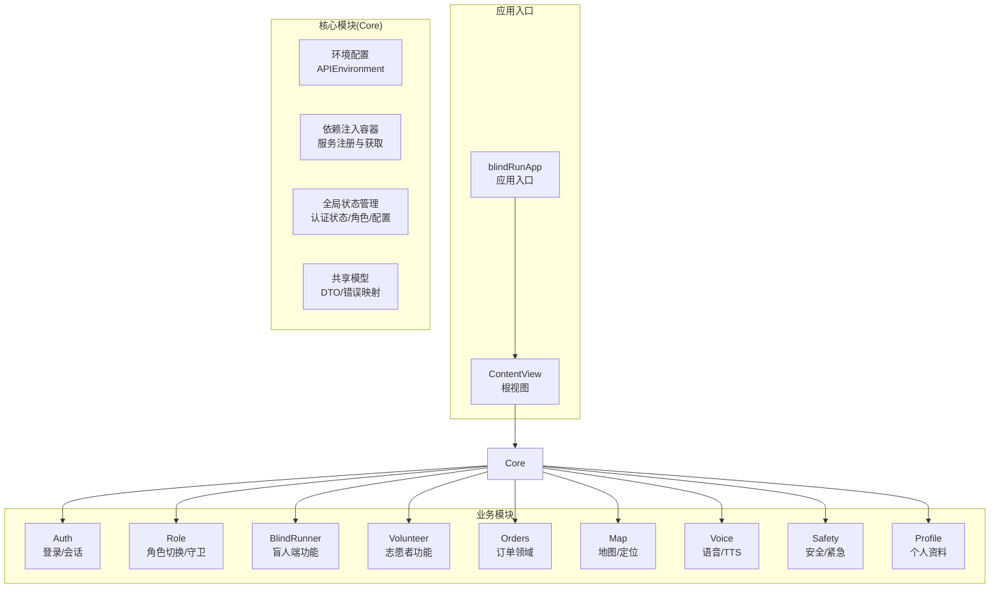
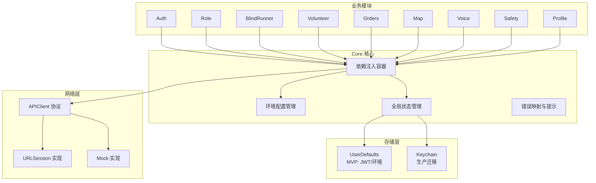
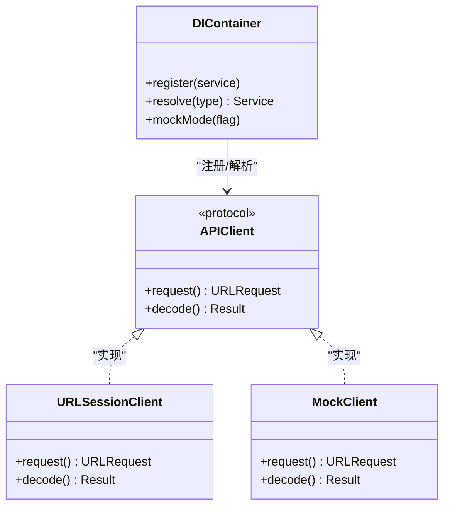
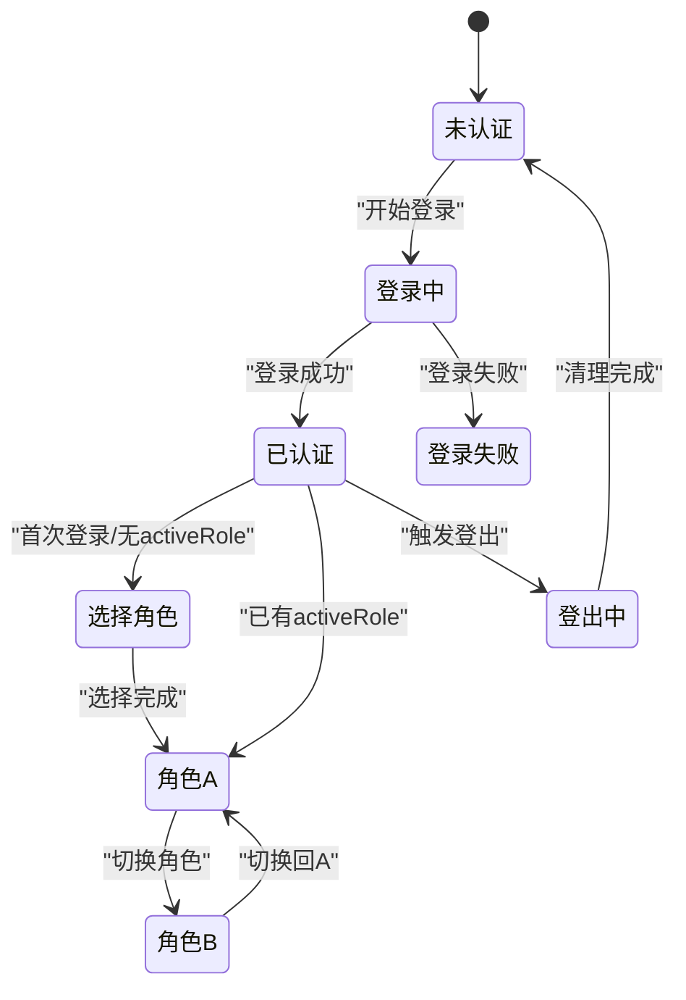
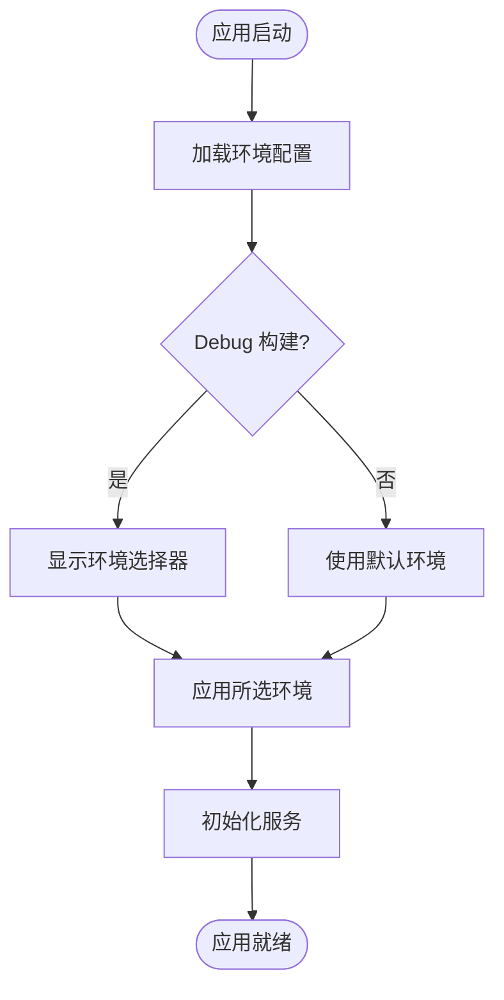
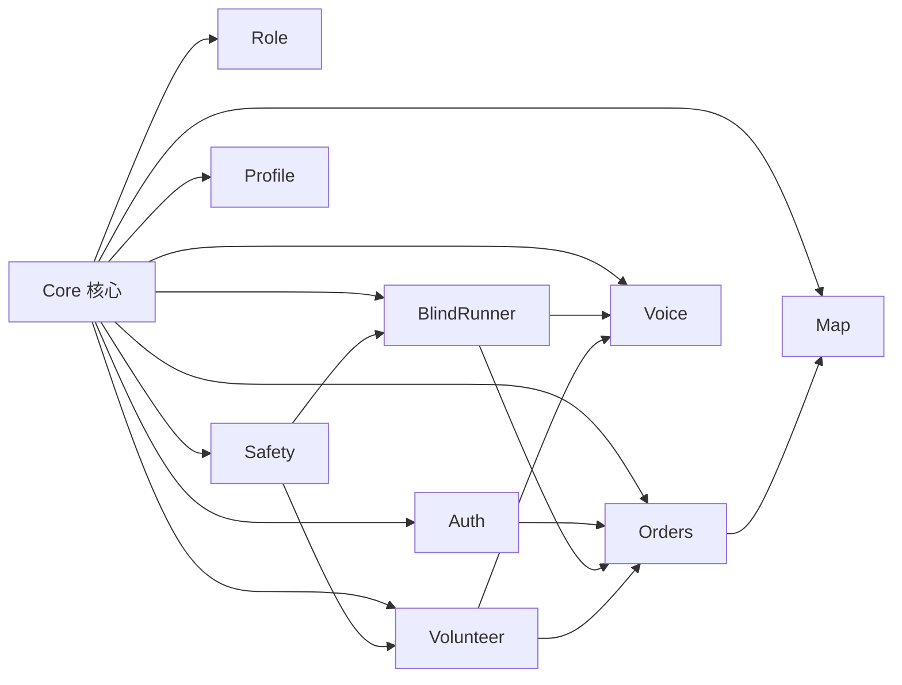

# Core 核心模块

<cite>
**本文档引用的文件**
- [blindRunApp.swift](file://blindRun/blindRun/blindRunApp.swift)
- [ContentView.swift](file://blindRun/blindRun/ContentView.swift)
- [08-ios-architecture.md](file://docs/08-ios-architecture.md)
- [01-product-requirements.md](file://docs/01-product-requirements.md)
- [07-api-contract.openapi.yaml](file://docs/07-api-contract.openapi.yaml)
- [tasks.md](file://openspec/changes/add-aidrun-ios-spring-mvp/tasks.md)
- [spec.md](file://openspec/changes/add-aidrun-ios-spring-mvp/specs/backend-api-contract/spec.md)
</cite>

## 目录
1. [简介](#简介)
2. [项目结构](#项目结构)
3. [核心组件](#核心组件)
4. [架构总览](#架构总览)
5. [详细组件分析](#详细组件分析)
6. [依赖关系分析](#依赖关系分析)
7. [性能考虑](#性能考虑)
8. [故障排查指南](#故障排查指南)
9. [结论](#结论)
10. [附录](#附录)

## 简介
Core 核心模块是应用基础设施层，负责：
- 应用环境与依赖注入容器
- 共享模型与全局状态管理
- 全局配置与环境切换
- 跨模块的服务与工具类共享
- 应用生命周期与认证状态管理

根据架构文档，Core 模块将为 Auth、Role、BlindRunner、Volunteer、Orders、Map、Voice、Safety、Profile 等模块提供统一的基础设施与共享能力。

## 项目结构
当前仓库包含最小可运行的 SwiftUI 应用骨架，以及完整的 iOS 架构与 API 合同文档。Core 模块尚未在代码中实现，但已在架构文档中明确定义其职责与边界。

**图表来源**
- [08-ios-architecture.md:18-32](file://docs/08-ios-architecture.md#L18-L32)
- [blindRunApp.swift:10-17](file://blindRun/blindRun/blindRunApp.swift#L10-L17)
- [ContentView.swift:10-20](file://blindRun/blindRun/ContentView.swift#L10-L20)

**章节来源**
- [08-ios-architecture.md:18-32](file://docs/08-ios-architecture.md#L18-L32)
- [blindRunApp.swift:10-17](file://blindRun/blindRun/blindRunApp.swift#L10-L17)
- [ContentView.swift:10-20](file://blindRun/blindRun/ContentView.swift#L10-L20)

## 核心组件
Core 模块的核心职责包括：

- 依赖注入容器
  - 统一注册与获取服务实例
  - 在模块间共享单例与工厂
  - 支持 Mock 与真实实现切换

- 共享模型
  - DTO 与错误映射
  - 状态枚举与校验规则
  - 常用工具类型

- 应用状态管理
  - 用户认证状态
  - 活跃角色(activeRole)
  - 环境配置(APIEnvironment)
  - 应用生命周期事件

- 全局配置
  - 环境切换(mock/localBackend/production)
  - Token 存储与刷新
  - 无障碍与语音配置

**章节来源**
- [08-ios-architecture.md:22-31](file://docs/08-ios-architecture.md#L22-L31)
- [08-ios-architecture.md:50-82](file://docs/08-ios-architecture.md#L50-L82)

## 架构总览
Core 模块采用“基础设施即服务”的设计，向上提供稳定的服务契约，向下屏蔽具体实现细节。核心交互如下：

**图表来源**
- [08-ios-architecture.md:68-82](file://docs/08-ios-architecture.md#L68-L82)
- [08-ios-architecture.md:50-67](file://docs/08-ios-architecture.md#L50-L67)

## 详细组件分析

### 依赖注入容器
- 设计原则
  - 服务注册集中化，获取解耦化
  - 支持多实现切换(MVP: Mock/Real)
  - 避免循环依赖，保持低耦合
- 最佳实践
  - 使用协议抽象服务接口
  - 将构造函数参数注入容器
  - 对可选服务提供默认实现
  - 在 App 生命周期初始化容器

**图表来源**
- [08-ios-architecture.md:68-82](file://docs/08-ios-architecture.md#L68-L82)

**章节来源**
- [08-ios-architecture.md:68-82](file://docs/08-ios-architecture.md#L68-L82)

### 全局状态管理
- 认证状态
  - JWT 令牌存储与续期
  - 登录/登出/会话恢复
  - 退出确认与清理
- 角色状态
  - activeRole 切换
  - 活跃订单阻断逻辑
  - 角色守卫与路由控制
- 环境配置
  - APIEnvironment 切换
  - Debug 下的环境选择器
  - LAN IP 支持(localBackend)
- 应用生命周期
  - 启动时状态恢复
  - 前后台切换处理
  - 异常状态兜底

**图表来源**
- [08-ios-architecture.md:84-97](file://docs/08-ios-architecture.md#L84-L97)

**章节来源**
- [08-ios-architecture.md:84-97](file://docs/08-ios-architecture.md#L84-L97)

### 全局配置与环境切换
- 环境定义
  - mock: 本地假数据调试
  - localBackend: 开发者本机后端(LAN)
  - production: 预留部署
- 配置要点
  - baseURL 与显示名
  - 协议 APIClient 共用调用点
  - Debug 构建暴露小环境选择器
  - 生产 URL 保持占位直至部署

**图表来源**
- [08-ios-architecture.md:50-67](file://docs/08-ios-architecture.md#L50-L67)

**章节来源**
- [08-ios-architecture.md:50-67](file://docs/08-ios-architecture.md#L50-L67)

### 共享模型与工具类
- DTO 与错误映射
  - 遵循 OpenAPI 合同
  - 错误码映射用户提示与 TTS
- 工具类
  - 日期/时间格式化
  - 地址/距离计算占位
  - 无障碍标签与提示

**章节来源**
- [07-api-contract.openapi.yaml:25-452](file://docs/07-api-contract.openapi.yaml#L25-L452)
- [08-ios-architecture.md:68-82](file://docs/08-ios-architecture.md#L68-L82)

### 新模块集成指南
- 步骤
  - 在 Core 中注册服务协议与实现
  - 在 ViewModel 中通过容器获取服务
  - 使用统一的错误映射与 TTS 提示
  - 遵循 MVVM 与依赖倒置原则
- 示例路径
  - [tasks.md:28-34](file://openspec/changes/add-aidrun-ios-spring-mvp/tasks.md#L28-L34)
  - [08-ios-architecture.md:33-49](file://docs/08-ios-architecture.md#L33-L49)

**章节来源**
- [tasks.md:28-34](file://openspec/changes/add-aidrun-ios-spring-mvp/tasks.md#L28-L34)
- [08-ios-architecture.md:33-49](file://docs/08-ios-architecture.md#L33-L49)

## 依赖关系分析
Core 模块与各业务模块的依赖关系如下：

**图表来源**
- [08-ios-architecture.md:18-32](file://docs/08-ios-architecture.md#L18-L32)

**章节来源**
- [08-ios-architecture.md:18-32](file://docs/08-ios-architecture.md#L18-L32)

## 性能考虑
- 依赖注入
  - 避免在热路径频繁创建对象
  - 使用懒加载与单例缓存
- 网络层
  - URLSession 并发请求限制
  - 简单重试策略，避免复杂离线队列
- 状态管理
  - 认证状态变更通知最小化
  - 环境切换时的资源释放
- 无障碍与语音
  - TTS 队列与去重
  - 语音输入的中断处理

**章节来源**
- [08-ios-architecture.md:76-77](file://docs/08-ios-architecture.md#L76-L77)

## 故障排查指南
- 登录问题
  - 检查 UserDefaults 中 JWT 是否正确写入
  - 确认 APIClient 的 Authorization 头是否携带
  - 核对 API 合同中的错误码映射
- 角色切换阻断
  - 检查是否存在活跃订单
  - 确认 activeRole 切换接口返回
- 环境切换
  - Debug 构建下环境选择器是否可见
  - localBackend 的 LAN IP 是否可达
- 无障碍与语音
  - TTS 服务可用性
  - 语音输入权限与中断处理

**章节来源**
- [08-ios-architecture.md:84-97](file://docs/08-ios-architecture.md#L84-L97)
- [08-ios-architecture.md:50-67](file://docs/08-ios-architecture.md#L50-L67)
- [07-api-contract.openapi.yaml:469-542](file://docs/07-api-contract.openapi.yaml#L469-L542)

## 结论
Core 核心模块是应用的基础设施与共享中心，通过依赖注入、全局状态管理与统一配置，为各业务模块提供稳定可靠的支持。建议在实现过程中严格遵循 MVVM 与依赖倒置原则，确保模块间低耦合、高内聚，并为后续扩展预留空间。

## 附录
- 产品背景与技术约束
  - iOS 16+、SwiftUI + MVVM、URLSession、UserDefaults、高德地图、AVSpeechSynthesizer、Speech Framework
- API 合同要点
  - OpenAPI 文档覆盖认证、用户、资料、志愿者、订单等端点
  - 错误码稳定且可预测，便于前端统一处理

**章节来源**
- [01-product-requirements.md:79-95](file://docs/01-product-requirements.md#L79-L95)
- [07-api-contract.openapi.yaml:1-1117](file://docs/07-api-contract.openapi.yaml#L1-L1117)