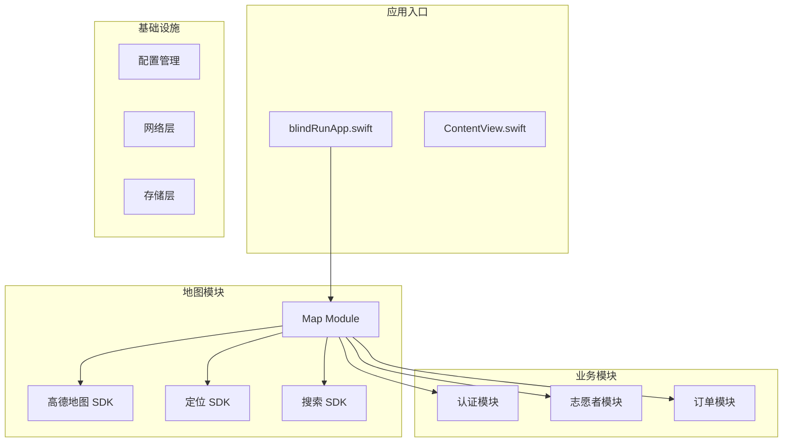
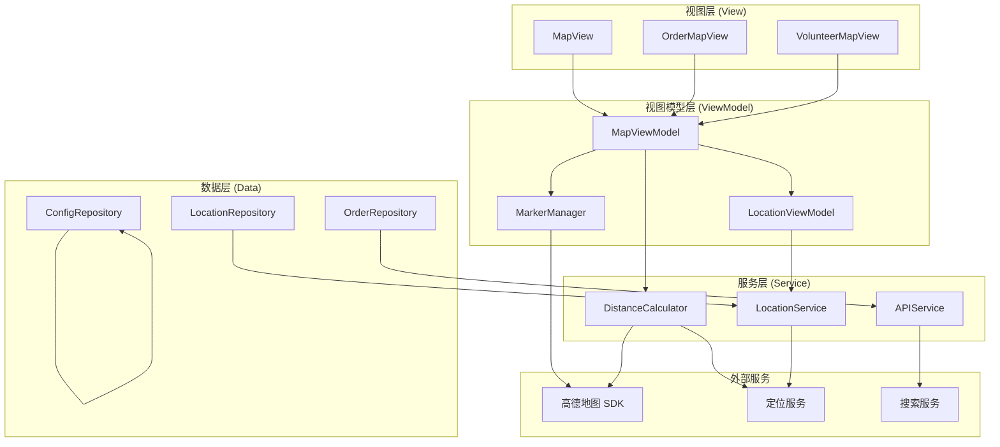
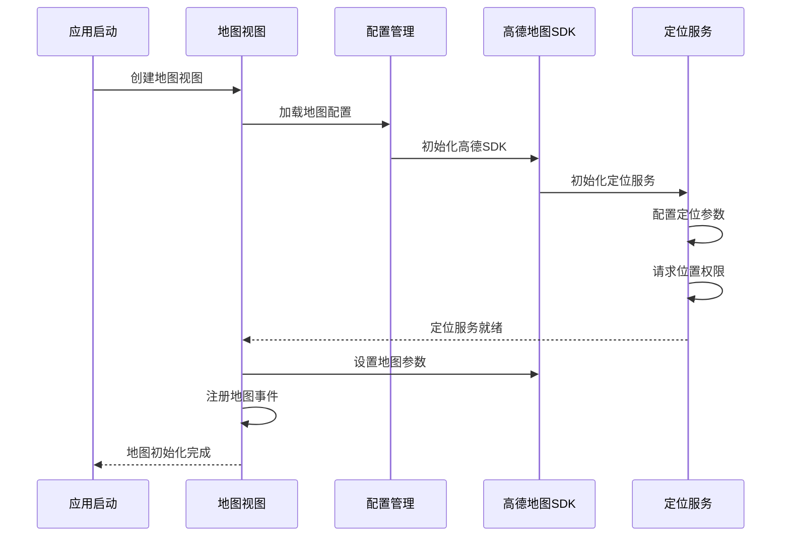
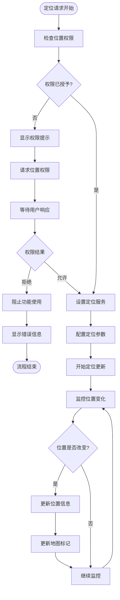
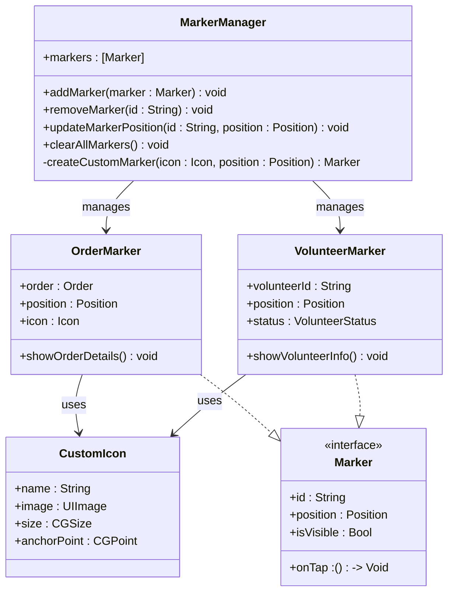
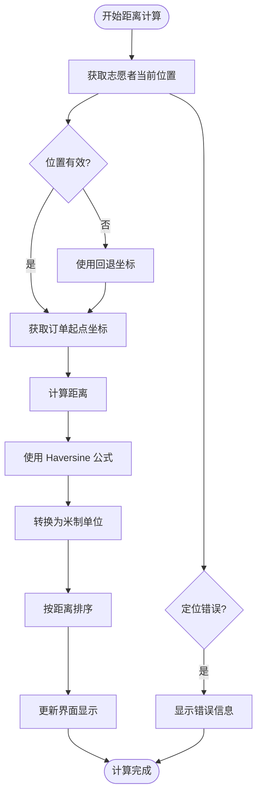
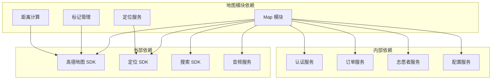

# Map 地图模块

<cite>
**本文档引用的文件**
- [blindRunApp.swift](file://blindRun/blindRun/blindRunApp.swift)
- [ContentView.swift](file://blindRun/blindRun/ContentView.swift)
- [spec.md](file://openspec/changes/add-aidrun-ios-spring-mvp/specs/amap-location/spec.md)
- [tasks.md](file://openspec/changes/add-aidrun-ios-spring-mvp/tasks.md)
- [02-mvp-scope.md](file://docs/02-mvp-scope.md)
- [08-ios-architecture.md](file://docs/08-ios-architecture.md)
- [04-user-flows-and-state-machine.md](file://docs/04-user-flows-and-state-machine.md)
</cite>

## 目录
1. [简介](#简介)
2. [项目结构](#项目结构)
3. [核心组件](#核心组件)
4. [架构概览](#架构概览)
5. [详细组件分析](#详细组件分析)
6. [依赖关系分析](#依赖关系分析)
7. [性能考虑](#性能考虑)
8. [故障排除指南](#故障排除指南)
9. [结论](#结论)
10. [附录](#附录)

## 简介

Map 地图模块是 Aidrun iOS 应用的核心功能模块之一，负责集成高德地图 SDK 实现真实地图显示、实时定位和位置标记功能。该模块严格遵循 MVP 要求，使用高德地图 iOS SDK（AMap3DMap、AMapSearch、AMapLocation）来实现完整的地图功能。

根据项目规范，地图模块需要实现以下关键功能：
- 高德地图显示和初始化
- 实时定位服务和权限管理
- 订单起点标记和志愿者位置标记
- iOS 端距离计算和订单排序
- 定位权限拦截和错误处理
- 演示回退坐标支持

## 项目结构

当前项目采用模块化架构设计，Map 地图模块作为独立的功能模块存在。项目结构清晰地分离了各个功能领域：

**图表来源**
- [blindRunApp.swift:10-17](file://blindRun/blindRun/blindRunApp.swift#L10-L17)
- [tasks.md:30](file://openspec/changes/add-aidrun-ios-spring-mvp/tasks.md#L30)

**章节来源**
- [blindRunApp.swift:1-18](file://blindRun/blindRun/blindRunApp.swift#L1-L18)
- [tasks.md:30-53](file://openspec/changes/add-aidrun-ios-spring-mvp/tasks.md#L30-L53)

## 核心组件

### 地图显示组件
地图显示组件负责集成高德地图 SDK，实现真实地图渲染和交互功能。该组件需要：
- 初始化高德地图视图
- 配置地图参数和样式
- 处理地图事件和用户交互
- 管理地图生命周期

### 定位服务组件
定位服务组件基于 AMapLocation SDK 实现精确的实时定位功能：
- 请求和管理位置权限
- 配置定位参数（精度、频率、批量）
- 处理定位结果和错误
- 实现定位状态监控

### 标记管理组件
标记管理组件负责地图上各种标记的创建、管理和更新：
- 订单起点标记（红色标记）
- 志愿者当前位置标记（蓝色标记）
- 自定义图标和样式管理
- 标记点击事件处理

### 距离计算组件
距离计算组件实现 iOS 端的地理距离计算和订单排序：
- 使用 Haversine 公式计算两点间距离
- 实现志愿者到订单起点的距离计算
- 支持实时距离更新和排序
- 性能优化和缓存策略

**章节来源**
- [spec.md:3-37](file://openspec/changes/add-aidrun-ios-spring-mvp/specs/amap-location/spec.md#L3-L37)
- [02-mvp-scope.md:54-63](file://docs/02-mvp-scope.md#L54-L63)

## 架构概览

Map 地图模块采用 MVVM 架构模式，与应用的整体架构保持一致：

**图表来源**
- [08-ios-architecture.md:98-124](file://docs/08-ios-architecture.md#L98-L124)
- [tasks.md:30](file://openspec/changes/add-aidrun-ios-spring-mvp/tasks.md#L30)

## 详细组件分析

### 地图初始化流程

地图初始化是整个模块的核心启动过程，需要确保所有依赖项正确配置：

**图表来源**
- [08-ios-architecture.md:98-124](file://docs/08-ios-architecture.md#L98-L124)
- [spec.md:5](file://openspec/changes/add-aidrun-ios-spring-mvp/specs/amap-location/spec.md#L5)

### 实时定位实现

实时定位功能是地图模块的关键特性，需要处理复杂的权限管理和定位更新逻辑：

**图表来源**
- [08-ios-architecture.md:107-117](file://docs/08-ios-architecture.md#L107-L117)
- [spec.md:11-21](file://openspec/changes/add-aidrun-ios-spring-mvp/specs/amap-location/spec.md#L11-L21)

### 标记管理系统

标记管理系统负责管理地图上的各种标记，包括订单起点标记和志愿者位置标记：

**图表来源**
- [08-ios-architecture.md:100-105](file://docs/08-ios-architecture.md#L100-L105)
- [spec.md:7-9](file://openspec/changes/add-aidrun-ios-spring-mvp/specs/amap-location/spec.md#L7-L9)

### 距离计算与排序算法

iOS 端的距离计算和订单排序是地图模块的重要功能，需要高效的算法实现：

**图表来源**
- [08-ios-architecture.md:105](file://docs/08-ios-architecture.md#L105)
- [spec.md:23-29](file://openspec/changes/add-aidrun-ios-spring-mvp/specs/amap-location/spec.md#L23-L29)

**章节来源**
- [spec.md:3-37](file://openspec/changes/add-aidrun-ios-spring-mvp/specs/amap-location/spec.md#L3-L37)
- [08-ios-architecture.md:98-124](file://docs/08-ios-architecture.md#L98-L124)

## 依赖关系分析

地图模块与其他模块存在紧密的依赖关系，形成了完整的功能体系：

**图表来源**
- [08-ios-architecture.md:119-124](file://docs/08-ios-architecture.md#L119-L124)
- [tasks.md:30](file://openspec/changes/add-aidrun-ios-spring-mvp/tasks.md#L30)

**章节来源**
- [08-ios-architecture.md:98-124](file://docs/08-ios-architecture.md#L98-L124)
- [tasks.md:30-53](file://openspec/changes/add-aidrun-ios-spring-mvp/tasks.md#L30-L53)

## 性能考虑

地图模块在性能方面需要重点关注以下几个方面：

### 定位性能优化
- **定位频率控制**：合理设置定位更新间隔，避免过度消耗电池
- **精度分级**：根据使用场景动态调整定位精度
- **批量处理**：合并多个定位更新以减少 UI 刷新次数

### 地图渲染优化
- **标记复用**：重用地图标记以减少内存分配
- **延迟加载**：按需加载远距离订单标记
- **缩放级别适配**：根据缩放级别动态调整标记密度

### 内存管理
- **弱引用**：避免循环引用导致的内存泄漏
- **及时释放**：在视图消失时及时释放地图资源
- **缓存策略**：合理使用缓存减少重复计算

## 故障排除指南

### 常见问题及解决方案

#### 定位权限问题
**问题描述**：用户拒绝定位权限导致功能受限
**解决方案**：
- 显示清晰的权限说明和引导
- 提供设置页面跳转功能
- 实现权限状态监控和自动重试

#### 地图初始化失败
**问题描述**：高德地图 SDK 初始化异常
**解决方案**：
- 检查 API Key 配置
- 验证网络连接状态
- 实现重试机制和错误恢复

#### 定位精度不足
**问题描述**：模拟器或室内定位精度较低
**解决方案**：
- 实现回退坐标机制
- 提供手动位置选择功能
- 优化定位参数配置

**章节来源**
- [08-ios-architecture.md:107-117](file://docs/08-ios-architecture.md#L107-L117)
- [spec.md:11-37](file://openspec/changes/add-aidrun-ios-spring-mvp/specs/amap-location/spec.md#L11-L37)

## 结论

Map 地图模块作为 Aidrun iOS 应用的核心功能模块，成功实现了高德地图 SDK 的完整集成。通过模块化的设计和清晰的架构分离，该模块不仅满足了 MVP 的所有要求，还为未来的功能扩展奠定了坚实的基础。

模块的主要优势包括：
- **完整的功能实现**：真实地图显示、实时定位、位置标记、距离计算
- **严格的权限管理**：完善的定位权限拦截和错误处理机制
- **优秀的用户体验**：直观的地图界面和流畅的交互体验
- **良好的扩展性**：模块化的架构设计便于功能扩展和维护

未来可以在以下方面进一步完善：
- 增强地图交互功能（手势操作、缩放控制）
- 优化性能表现（内存使用、电池消耗）
- 扩展地图样式和主题支持
- 增加更多地图覆盖物类型

## 附录

### 开发指南

#### 新功能开发流程
1. **需求分析**：明确新功能的需求和约束条件
2. **架构设计**：设计模块接口和数据流
3. **实现开发**：按照 MVVM 模式进行编码
4. **单元测试**：编写测试用例验证功能正确性
5. **集成测试**：与现有模块进行集成测试
6. **文档更新**：更新相关技术文档

#### 最佳实践
- **代码规范**：遵循 Swift 编码规范和命名约定
- **错误处理**：实现完善的错误处理和用户提示
- **性能监控**：持续监控应用性能指标
- **安全考虑**：保护用户隐私和敏感信息

**章节来源**
- [tasks.md:48-53](file://openspec/changes/add-aidrun-ios-spring-mvp/tasks.md#L48-L53)
- [02-mvp-scope.md:119-153](file://docs/02-mvp-scope.md#L119-L153)