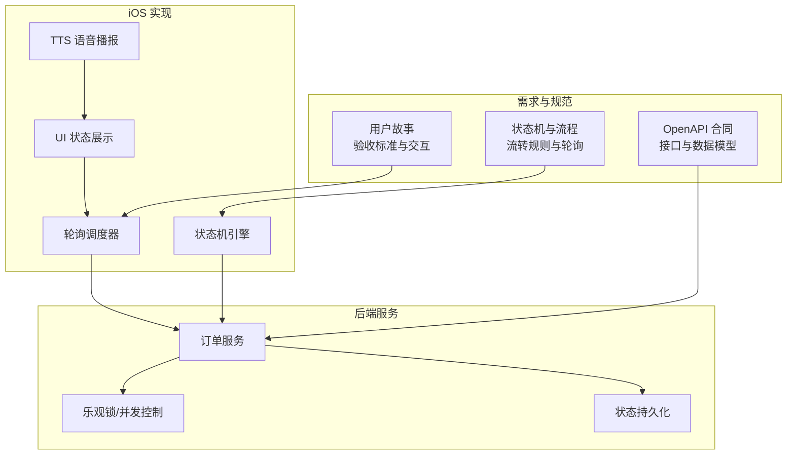
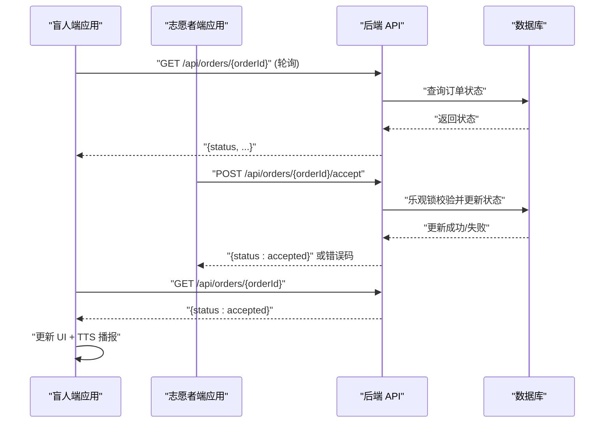
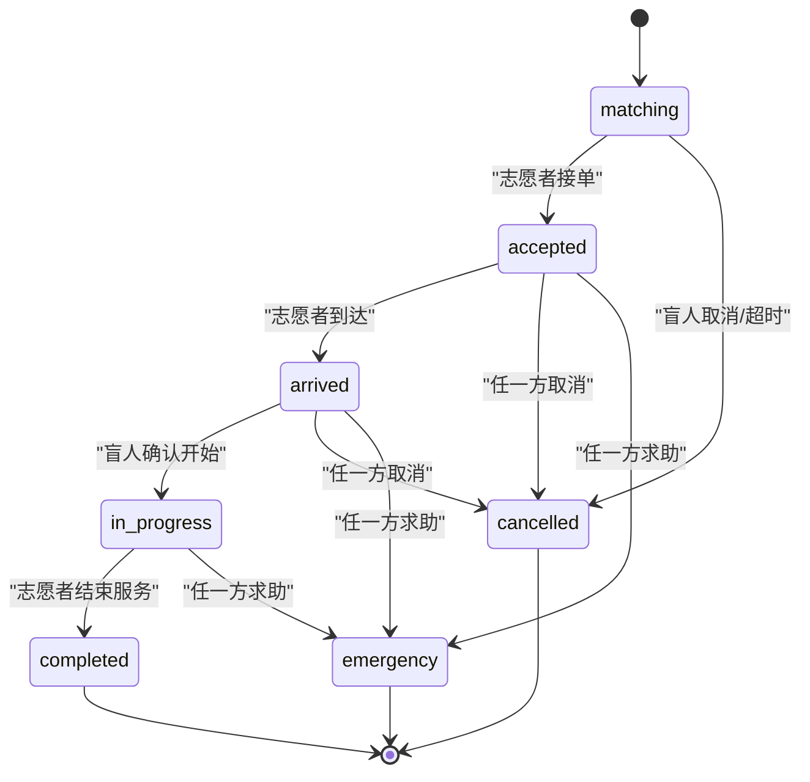
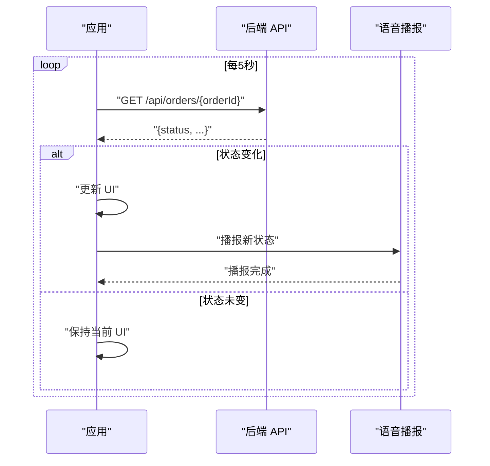
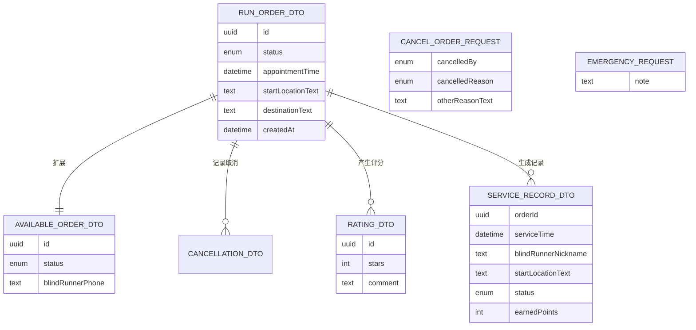
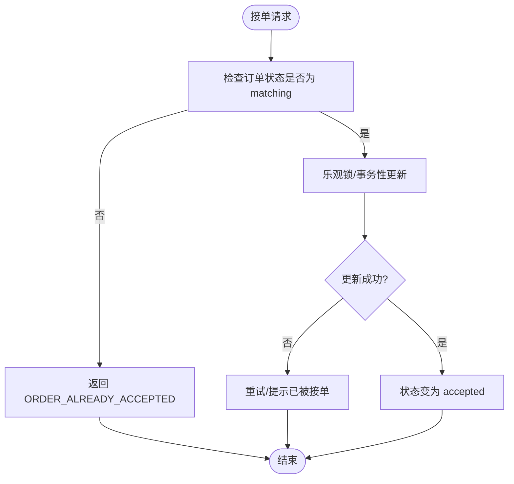
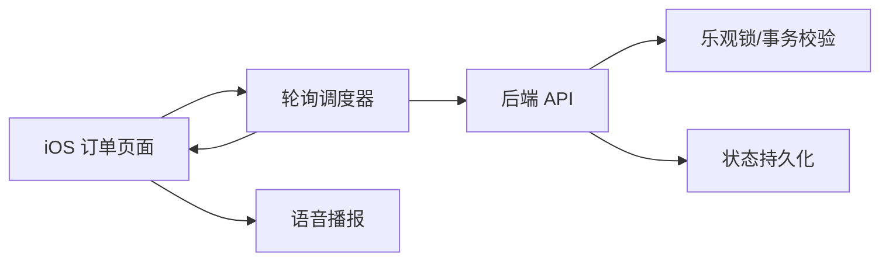

# Orders 订单模块

<cite>
**本文档引用的文件**
- [04-用户流程与状态机.md](file://docs/04-user-flows-and-state-machine.md)
- [03-用户故事.md](file://docs/03-user-stories.md)
- [07-API契约.openapi.yaml](file://docs/07-api-contract.openapi.yaml)
- [order-status-lifecycle-spec.md](file://openspec/changes/add-aidrun-ios-spring-mvp/specs/order-status-lifecycle/spec.md)
- [backend-api-contract-spec.md](file://openspec/changes/add-aidrun-ios-spring-mvp/specs/backend-api-contract/spec.md)
- [design.md](file://openspec/changes/add-aidrun-ios-spring-mvp/design.md)
- [proposal.md](file://openspec/changes/add-aidrun-ios-spring-mvp/proposal.md)
- [tasks.md](file://openspec/changes/add-aidrun-ios-spring-mvp/tasks.md)
- [08-iOS架构.md](file://docs/08-ios-architecture.md)
- [09-无障碍与语音指南.md](file://docs/09-accessibility-and-voice-guidelines.md)
- [10-AI编码任务.md](file://docs/10-ai-coding-tasks.md)
</cite>

## 目录
1. [简介](#简介)
2. [项目结构](#项目结构)
3. [核心组件](#核心组件)
4. [架构总览](#架构总览)
5. [详细组件分析](#详细组件分析)
6. [依赖关系分析](#依赖关系分析)
7. [性能考虑](#性能考虑)
8. [故障排查指南](#故障排查指南)
9. [结论](#结论)
10. [附录](#附录)

## 简介
本文件面向 iOS 订单模块的业务与技术实现，围绕订单状态机设计、轮询机制、数据模型与业务规则展开，帮助开发者理解并扩展订单生命周期管理能力。文档基于仓库内的需求规格、用户故事、API 合同与设计文档整理而成，确保与实际产品目标一致。

## 项目结构
订单模块相关知识分布在以下三类文档中：
- 用户流程与状态机：定义状态机、流转规则、轮询策略与页面约束
- 用户故事：覆盖验收标准、交互细节与异常处理
- API 合同与 OpenAPI：定义后端接口、数据模型与错误码

**章节来源**
- [04-用户流程与状态机.md:1-309](file://docs/04-user-flows-and-state-machine.md#L1-L309)
- [03-用户故事.md:595-702](file://docs/03-user-stories.md#L595-L702)
- [07-API契约.openapi.yaml:366-410](file://docs/07-api-contract.openapi.yaml#L366-L410)

## 核心组件
- 订单状态机：定义匹配、已接单、已到达、服务中、完成、取消、紧急七种状态及合法流转
- 轮询机制：盲人端在关键页面以固定周期轮询订单状态，驱动 UI 更新与 TTS 播报
- 数据模型：基于 OpenAPI 定义的订单 DTO、取消与求助请求体、评分与服务记录等
- 并发控制：通过乐观锁/事务性校验，确保同一订单仅被一个志愿者接单
- 业务规则：超时自动取消、取消时机限制、紧急状态终态、评分可选等

**章节来源**
- [04-用户流程与状态机.md:72-118](file://docs/04-user-flows-and-state-machine.md#L72-L118)
- [order-status-lifecycle-spec.md:1-66](file://openspec/changes/add-aidrun-ios-spring-mvp/specs/order-status-lifecycle/spec.md#L1-L66)
- [03-用户故事.md:655-702](file://docs/03-user-stories.md#L655-L702)

## 架构总览
订单模块采用“前端轮询 + 后端状态机”的架构模式：
- 前端在关键页面以固定周期轮询订单详情，对比状态变化后更新 UI 并播报
- 后端维护严格的订单状态机，拒绝非法状态转换，并通过稳定错误码反馈
- 乐观锁/事务性校验保障并发安全，避免竞态导致的重复接单

**图表来源**
- [04-用户流程与状态机.md:120-178](file://docs/04-user-flows-and-state-machine.md#L120-L178)
- [order-status-lifecycle-spec.md:11-17](file://openspec/changes/add-aidrun-ios-spring-mvp/specs/order-status-lifecycle/spec.md#L11-L17)

**章节来源**
- [04-用户流程与状态机.md:275-309](file://docs/04-user-flows-and-state-machine.md#L275-L309)
- [03-用户故事.md:655-668](file://docs/03-user-stories.md#L655-L668)

## 详细组件分析

### 订单状态机设计与实现
- 状态集合：matching（匹配中）、accepted（已接单）、arrived（已到达）、in_progress（服务中）、completed（已完成）、cancelled（已取消）、emergency（紧急）
- 合法流转：
  - matching → accepted（志愿者接单，需乐观锁保护）
  - matching → cancelled（盲人取消或超时自动取消）
  - accepted → arrived（志愿者到达）
  - accepted → cancelled/emergency（任一方取消/求助）
  - arrived → in_progress（盲人确认开始）
  - arrived → cancelled/emergency（任一方取消/求助）
  - in_progress → completed（志愿者结束服务）
  - in_progress → emergency（任一方求助）
  - completed/cancelled → 终态
  - emergency → 终态（MVP 不支持恢复）
- 禁止流转：
  - in_progress → cancelled（服务开始后禁止普通取消）
  - emergency → 任何其他状态
  - completed → 任何状态
  - cancelled → 任何状态

**图表来源**
- [04-用户流程与状态机.md:74-96](file://docs/04-user-flows-and-state-machine.md#L74-L96)

**章节来源**
- [04-用户流程与状态机.md:72-118](file://docs/04-user-flows-and-state-machine.md#L72-L118)
- [order-status-lifecycle-spec.md:19-37](file://openspec/changes/add-aidrun-ios-spring-mvp/specs/order-status-lifecycle/spec.md#L19-L37)

### 轮询机制技术实现
- 轮询周期：每 5 秒一次
- 触发条件：仅在订单相关页面（盲人等待页、服务中页、志愿者服务中页、志愿者已接单详情页）
- 终止条件：
  - 盲人端：页面离开或订单进入终态（completed/cancelled/emergency）
  - 志愿者端：页面离开（已接单详情页）
- 性能优化建议：
  - 页面离开时停止轮询，避免无意义请求
  - 状态未变化时不更新 UI，减少重绘
  - TTS 播报去重，避免轮询期间重复播报相同状态

**图表来源**
- [04-用户流程与状态机.md:277-299](file://docs/04-user-flows-and-state-machine.md#L277-L299)

**章节来源**
- [04-用户流程与状态机.md:275-309](file://docs/04-user-flows-and-state-machine.md#L275-L309)
- [03-用户故事.md:655-668](file://docs/03-user-stories.md#L655-L668)
- [08-iOS架构.md:120-130](file://docs/08-ios-architecture.md#L120-L130)
- [09-无障碍与语音指南.md:30-40](file://docs/09-accessibility-and-voice-guidelines.md#L30-L40)

### 订单数据模型与 DTO 结构
- 订单基础 DTO（RunOrderDto）：包含订单标识、状态、时间、位置、双方用户信息等
- 可用订单 DTO（AvailableOrderDto）：在 matching 状态下展示，隐藏盲人电话
- 取消请求（CancelOrderRequest）：包含取消方（盲人/志愿者）与固定原因枚举
- 求助请求（EmergencyRequest）：可携带备注
- 评分 DTO（RatingDto）：包含星级与可选评论
- 服务记录 DTO（ServiceRecordDto）：包含服务时间、地点、状态与积分
- 错误码：INVALID_ORDER_STATUS、ORDER_ALREADY_ACCEPTED、ORDER_NOT_FOUND 等

**图表来源**
- [07-API契约.openapi.yaml:366-410](file://docs/07-api-contract.openapi.yaml#L366-L410)
- [07-API契约.openapi.yaml:788-809](file://docs/07-api-contract.openapi.yaml#L788-L809)
- [07-API契约.openapi.yaml:931-941](file://docs/07-API契约.openapi.yaml#L931-L941)
- [07-API契约.openapi.yaml:965-969](file://docs/07-API契约.openapi.yaml#L965-L969)
- [07-API契约.openapi.yaml:1023-1049](file://docs/07-API契约.openapi.yaml#L1023-L1049)
- [07-API契约.openapi.yaml:1050-1069](file://docs/07-API契约.openapi.yaml#L1050-L1069)

**章节来源**
- [07-API契约.openapi.yaml:366-410](file://docs/07-api-contract.openapi.yaml#L366-L410)
- [07-API契约.openapi.yaml:788-809](file://docs/07-api-contract.openapi.yaml#L788-L809)
- [07-API契约.openapi.yaml:931-941](file://docs/07-api-contract.openapi.yaml#L931-L941)
- [07-API契约.openapi.yaml:965-969](file://docs/07-api-contract.openapi.yaml#L965-L969)
- [07-API契约.openapi.yaml:1023-1049](file://docs/07-api-contract.openapi.yaml#L1023-L1049)
- [07-API契约.openapi.yaml:1050-1069](file://docs/07-api-contract.openapi.yaml#L1050-L1069)

### 业务规则与并发控制
- 并发接单保护：仅 matching 订单可被接单；第一个成功更新的请求获胜，后续请求返回 ORDER_ALREADY_ACCEPTED
- 取消规则：仅 matching/accepted/arrived 支持取消；in_progress 禁止普通取消，只能求助
- 超时自动取消：当距离预约开始时间不足 30 分钟且仍未接单，系统自动取消并记录 no_volunteer_available
- 紧急状态：任一方触发求助即进入 emergency，MVP 不支持恢复，保持终态
- 评分：completed 后可选评分，不影响流程有效性

**图表来源**
- [order-status-lifecycle-spec.md:11-17](file://openspec/changes/add-aidrun-ios-spring-mvp/specs/order-status-lifecycle/spec.md#L11-L17)

**章节来源**
- [order-status-lifecycle-spec.md:1-66](file://openspec/changes/add-aidrun-ios-spring-mvp/specs/order-status-lifecycle/spec.md#L1-L66)
- [03-用户故事.md:671-684](file://docs/03-user-stories.md#L671-L684)
- [03-用户故事.md:687-701](file://docs/03-user-stories.md#L687-L701)

### 订单相关 API 一览
- 创建订单：POST /api/orders（请求体：CreateOrderRequest）
- 获取订单详情：GET /api/orders/{orderId}
- 接单：POST /api/orders/{orderId}/accept
- 到达：POST /api/orders/{orderId}/arrive
- 确认开始：POST /api/orders/{orderId}/confirm-start
- 结束服务：POST /api/orders/{orderId}/complete
- 取消：POST /api/orders/{orderId}/cancel（请求体：CancelOrderRequest）
- 求助：POST /api/orders/{orderId}/emergency（请求体：EmergencyRequest）
- 评分：POST /api/orders/{orderId}/rating（请求体：RatingRequest）

**章节来源**
- [07-API契约.openapi.yaml:366-410](file://docs/07-api-contract.openapi.yaml#L366-L410)
- [backend-api-contract-spec.md:27-33](file://openspec/changes/add-aidrun-ios-spring-mvp/specs/backend-api-contract/spec.md#L27-L33)

### 扩展与新增状态开发指导
- 新增状态的前置条件
  - 明确新状态的业务含义与触发事件
  - 定义合法的前置状态集合与目标状态集合
  - 评估对 UI、轮询策略与 TTS 的影响
- 状态机演进原则
  - 保持 MVP 终态约束：emergency/completed/cancelled 为终态
  - 严禁破坏现有合法流转链路
  - 新增状态不得绕过取消/求助等安全机制
- 并发与一致性
  - 新增状态转换必须配合后端乐观锁/事务性校验
  - 明确错误码与边界条件，避免竞态
- 前端适配
  - 在轮询策略中评估是否需要新增轮询页面
  - 补充 UI 展示与 TTS 播报
  - 完善无障碍与交互细节

**章节来源**
- [04-用户流程与状态机.md:72-118](file://docs/04-user-flows-and-state-machine.md#L72-L118)
- [order-status-lifecycle-spec.md:19-37](file://openspec/changes/add-aidrun-ios-spring-mvp/specs/order-status-lifecycle/spec.md#L19-L37)

## 依赖关系分析
- 前端依赖后端提供的稳定 API 与错误码
- 轮询策略依赖 OpenAPI 中的订单详情接口
- 并发控制依赖后端的乐观锁/事务性校验
- UI 与 TTS 依赖轮询结果的状态变化

**图表来源**
- [04-用户流程与状态机.md:275-309](file://docs/04-user-flows-and-state-machine.md#L275-L309)
- [order-status-lifecycle-spec.md:11-17](file://openspec/changes/add-aidrun-ios-spring-mvp/specs/order-status-lifecycle/spec.md#L11-L17)

**章节来源**
- [04-用户流程与状态机.md:275-309](file://docs/04-user-flows-and-state-machine.md#L275-L309)
- [order-status-lifecycle-spec.md:11-17](file://openspec/changes/add-aidrun-ios-spring-mvp/specs/order-status-lifecycle/spec.md#L11-L17)

## 性能考虑
- 轮询频率与范围：每 5 秒一次，仅在关键页面启用，避免全局轮询带来的网络与电量消耗
- 状态变化去抖：仅在状态变化时更新 UI 与播报，减少不必要的渲染与语音
- 页面生命周期绑定：页面离开即停止轮询，降低后台资源占用
- 错误与退避：遇到网络异常或 409 冲突时，适当退避重试，避免风暴式重试

## 故障排查指南
- 无法接单
  - 现象：返回 ORDER_ALREADY_ACCEPTED
  - 排查：确认订单状态是否仍为 matching；检查并发请求时间线
- 状态不更新
  - 现象：轮询无变化
  - 排查：确认轮询是否仍在运行；检查页面是否处于允许轮询的页面；核对网络连通性
- 取消失败
  - 现象：返回 INVALID_ORDER_STATUS
  - 排查：确认当前状态是否允许取消（in_progress 禁止普通取消）
- 超时未取消
  - 现象：matching 状态持续
  - 排查：确认预约时间与系统时间；检查后端定时任务是否生效
- 紧急状态无法恢复
  - 现象：emergency 终态
  - 排查：MVP 不支持恢复，需人工介入或后续版本支持

**章节来源**
- [03-用户故事.md:671-701](file://docs/03-user-stories.md#L671-L701)
- [07-API契约.openapi.yaml:366-410](file://docs/07-api-contract.openapi.yaml#L366-L410)

## 结论
订单模块通过严谨的状态机、稳定的轮询机制与可靠的后端并发控制，实现了从匹配到完成的闭环管理。前端在关键页面以固定周期轮询，结合 UI 与 TTS 的即时反馈，提升了用户体验。未来扩展应严格遵循状态机约束与并发一致性原则，确保系统稳定性与可维护性。

## 附录
- 任务清单参考：实现订单状态轮询、页面交互与 TTS 播报
- 设计要点参考：乐观锁保护接单、轮询策略与无障碍播报

**章节来源**
- [tasks.md:38-40](file://openspec/changes/add-aidrun-ios-spring-mvp/tasks.md#L38-L40)
- [design.md:23-24](file://openspec/changes/add-aidrun-ios-spring-mvp/design.md#L23-L24)