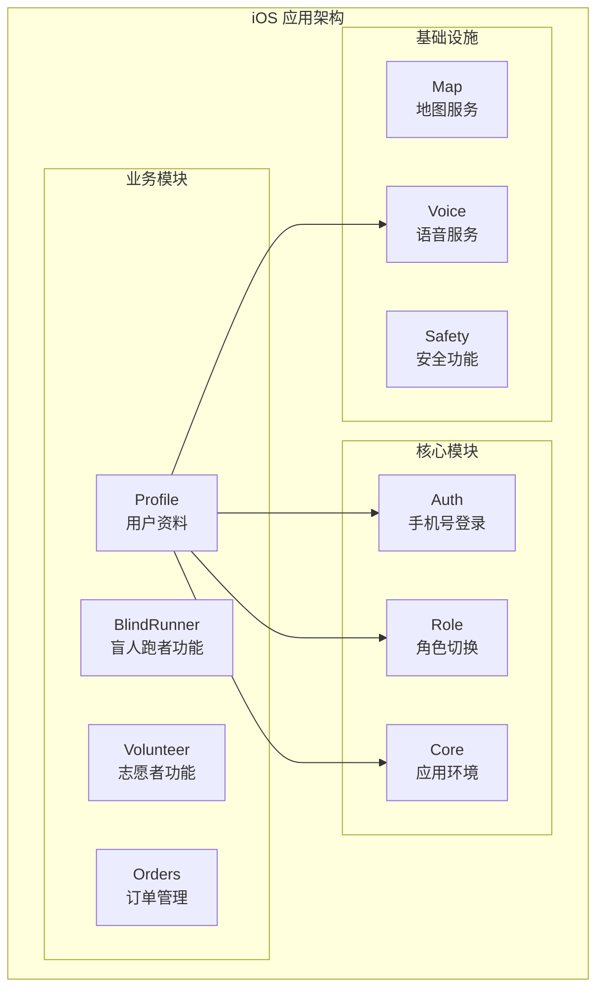
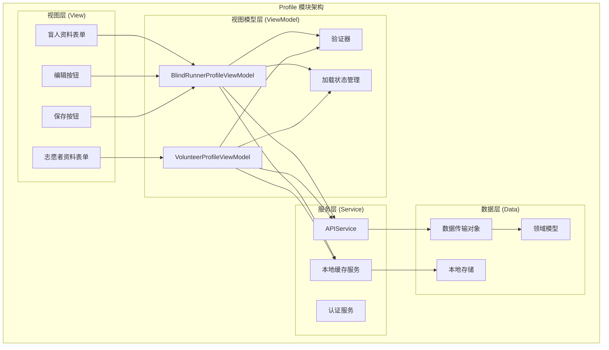
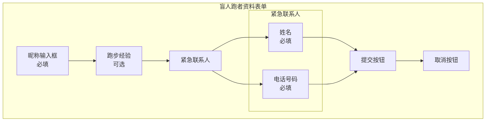
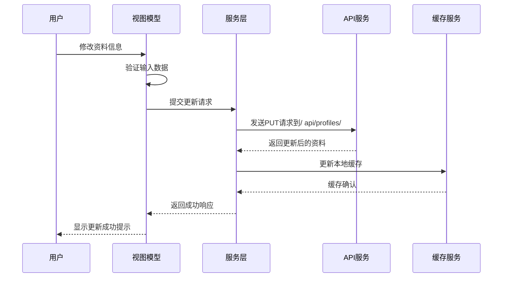
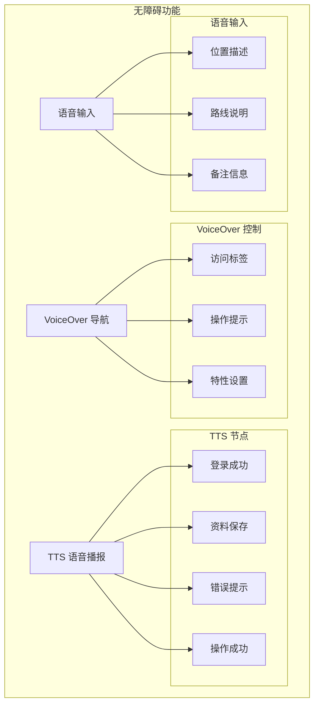
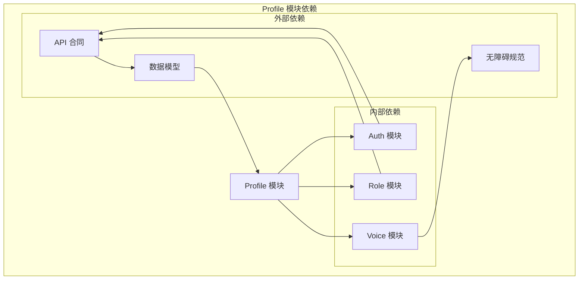

# Profile 资料模块

<cite>
**本文档引用的文件**
- [07-api-contract.openapi.yaml](file://docs/07-api-contract.openapi.yaml)
- [06-data-model.md](file://docs/06-data-model.md)
- [08-ios-architecture.md](file://docs/08-ios-architecture.md)
- [09-accessibility-and-voice-guidelines.md](file://docs/09-accessibility-and-voice-guidelines.md)
- [04-user-flows-and-state-machine.md](file://docs/04-user-flows-and-state-machine.md)
- [03-user-stories.md](file://docs/03-user-stories.md)
- [blindRunApp.swift](file://blindRun/blindRun/blindRunApp.swift)
- [ContentView.swift](file://blindRun/blindRun/ContentView.swift)
</cite>

## 目录
1. [简介](#简介)
2. [项目结构](#项目结构)
3. [核心组件](#核心组件)
4. [架构概览](#架构概览)
5. [详细组件分析](#详细组件分析)
6. [依赖关系分析](#依赖关系分析)
7. [性能考虑](#性能考虑)
8. [故障排除指南](#故障排除指南)
9. [结论](#结论)
10. [附录](#附录)

## 简介

Profile 资料模块是 AidRun 盲人跑步应用的核心功能之一，负责管理用户的基本信息和个人资料。该模块为盲人跑者和志愿者提供不同的资料收集和管理功能，确保用户能够完整地建立个人档案，为后续的预约服务和志愿者匹配提供基础数据支持。

本模块基于 iOS SwiftUI + MVVM 架构设计，遵循无障碍优先的原则，支持 VoiceOver 导航、TTS 语音播报和语音输入功能。系统通过 JWT Bearer 认证保护所有受保护的 API 端点，确保用户数据的安全性和隐私性。

## 项目结构

根据项目架构文档，Profile 模块属于独立的功能模块，位于 iOS 应用的模块化结构中：

**图表来源**
- [08-ios-architecture.md:31](file://docs/08-ios-architecture.md#L31)

**章节来源**
- [08-ios-architecture.md:18-31](file://docs/08-ios-architecture.md#L18-L31)

## 核心组件

Profile 模块包含两个主要的资料类型，针对不同用户角色提供专门的资料管理功能：

### 盲人跑者资料 (BlindRunnerProfile)

盲人跑者资料是预约服务的基础，必须包含完整的个人信息和紧急联系人信息：

| 字段名称 | 类型 | 必填 | 描述 |
|---------|------|------|------|
| id | UUID/String | 是 | 主键标识 |
| userId | UUID/String | 是 | 关联用户标识 |
| nickname | String | 是 | 盲人昵称 |
| runningExperience | String | 否 | 跑步经验描述 |
| emergencyContact | EmergencyContact | 是 | 紧急联系人信息 |
| createdAt | DateTime | 是 | 创建时间 |
| updatedAt | DateTime | 是 | 更新时间 |

### 志愿者资料 (VolunteerProfile)

志愿者资料用于志愿者认证和匹配服务，包含认证状态和服务可用性信息：

| 字段名称 | 类型 | 必填 | 描述 |
|---------|------|------|------|
| id | UUID/String | 是 | 主键标识 |
| userId | UUID/String | 是 | 关联用户标识 |
| nickname | String | 是 | 志愿者昵称 |
| phoneNumber | String | 是 | 联系电话 |
| verificationStatus | VerificationStatus | 是 | 认证状态 |
| adminReviewStatus | AdminReviewStatus | 是 | 管理员审核状态 |
| isAvailable | Boolean | 是 | 服务可用性开关 |
| pointsBalance | Integer | 是 | 积分余额 |
| createdAt | DateTime | 是 | 创建时间 |
| updatedAt | DateTime | 是 | 更新时间 |

**章节来源**
- [06-data-model.md:99-152](file://docs/06-data-model.md#L99-L152)
- [07-api-contract.openapi.yaml:700-762](file://docs/07-api-contract.openapi.yaml#L700-L762)

## 架构概览

Profile 模块采用 MVVM 架构模式，确保视图层与业务逻辑的分离：

**图表来源**
- [08-ios-architecture.md:33-40](file://docs/08-ios-architecture.md#L33-L40)

**章节来源**
- [08-ios-architecture.md:33-40](file://docs/08-ios-architecture.md#L33-L40)

## 详细组件分析

### 盲人跑者资料表单设计

盲人跑者资料表单是用户首次登录后的关键入口，必须确保信息的完整性和准确性：

#### 表单字段设计

**图表来源**
- [07-api-contract.openapi.yaml:689-722](file://docs/07-api-contract.openapi.yaml#L689-L722)

#### 验证规则

盲人跑者资料的验证规则严格确保数据质量：

1. **昵称验证**
   - 必填字段，不能为空
   - 长度限制：1-50字符
   - 支持中文、英文、数字和常用符号

2. **紧急联系人验证**
   - 姓名：必填，1-30字符
   - 电话号码：必填，符合手机号格式验证

3. **跑步经验验证**
   - 可选字段，最大长度500字符
   - 支持富文本描述

**章节来源**
- [07-api-contract.openapi.yaml:689-722](file://docs/07-api-contract.openapi.yaml#L689-L722)
- [06-data-model.md:111-115](file://docs/06-data-model.md#L111-L115)

### 志愿者资料表单设计

志愿者资料表单相对简单，主要关注志愿者的基本信息和认证状态：

#### 表单字段设计

**图表来源**
- [07-api-contract.openapi.yaml:724-762](file://docs/07-api-contract.openapi.yaml#L724-L762)

#### 验证规则

志愿者资料的验证规则相对宽松：

1. **昵称验证**
   - 必填，1-30字符
   - 支持中英文和数字

2. **认证状态**
   - 系统自动管理
   - MVP阶段支持Mock认证通过

3. **服务可用性**
   - 布尔值开关
   - 影响志愿者匹配算法

**章节来源**
- [07-api-contract.openapi.yaml:724-762](file://docs/07-api-contract.openapi.yaml#L724-L762)
- [06-data-model.md:147-152](file://docs/06-data-model.md#L147-L152)

### 资料更新机制

Profile 模块采用异步更新机制，确保用户操作的流畅性和数据的一致性：

**图表来源**
- [07-api-contract.openapi.yaml:82-116](file://docs/07-api-contract.openapi.yaml#L82-L116)

#### 更新流程特点

1. **实时验证**：用户输入时即时验证，提供实时反馈
2. **异步处理**：网络请求异步执行，避免界面阻塞
3. **缓存同步**：本地缓存与服务器数据保持同步
4. **错误处理**：完善的错误捕获和用户提示机制

**章节来源**
- [07-api-contract.openapi.yaml:82-116](file://docs/07-api-contract.openapi.yaml#L82-L116)

### 无障碍支持设计

Profile 模块严格遵循无障碍设计原则，确保视障用户的完整使用体验：

#### VoiceOver 支持

**图表来源**
- [09-accessibility-and-voice-guidelines.md:37-61](file://docs/09-accessibility-and-voice-guidelines.md#L37-L61)

#### 无障碍设计原则

1. **标签完整性**：每个控件都必须有 `accessibilityLabel` 和 `accessibilityHint`
2. **语音播报**：关键操作和状态变化都有对应的语音提示
3. **大按钮设计**：主要操作按钮高度不少于64pt
4. **语音输入**：支持语音识别输入文本信息

**章节来源**
- [09-accessibility-and-voice-guidelines.md:37-61](file://docs/09-accessibility-and-voice-guidelines.md#L37-L61)
- [09-accessibility-and-voice-guidelines.md:13-36](file://docs/09-accessibility-and-voice-guidelines.md#L13-L36)

## 依赖关系分析

Profile 模块与其他系统组件存在紧密的依赖关系：

**图表来源**
- [08-ios-architecture.md:18-31](file://docs/08-ios-architecture.md#L18-L31)

### 外部依赖关系

1. **API 合同依赖**
   - Profile 模块严格遵循 OpenAPI 合同定义
   - 所有网络请求都基于合同中的端点定义

2. **数据模型依赖**
   - Profile 数据结构与后端数据模型保持一致
   - 支持 JSON 序列化和反序列化

3. **无障碍规范依赖**
   - 完全符合 iOS 无障碍标准
   - 支持 VoiceOver、TTS 和语音输入

**章节来源**
- [08-ios-architecture.md:68-83](file://docs/08-ios-architecture.md#L68-L83)
- [07-api-contract.openapi.yaml:658-698](file://docs/07-api-contract.openapi.yaml#L658-L698)

## 性能考虑

Profile 模块在设计时充分考虑了性能优化：

### 缓存策略

1. **本地缓存**
   - 使用 UserDefaults 存储轻量级配置
   - 支持离线模式下的基本功能
   - 缓存策略避免频繁网络请求

2. **智能刷新**
   - 仅在必要时从服务器同步数据
   - 支持增量更新减少网络开销
   - 避免不必要的数据传输

### 网络优化

1. **请求合并**
   - 批量处理多个更新请求
   - 减少网络往返次数
   - 支持重试机制处理网络异常

2. **数据压缩**
   - JSON 数据压缩传输
   - 二进制格式优化（如适用）
   - 增量同步减少带宽占用

## 故障排除指南

### 常见问题及解决方案

#### 资料保存失败

**问题症状**：用户提交资料后收到保存失败的提示

**可能原因**：
1. 网络连接异常
2. 输入数据格式不正确
3. 服务器端验证失败

**解决步骤**：
1. 检查网络连接状态
2. 验证必填字段是否完整
3. 查看具体的错误消息
4. 重新尝试保存操作

#### 资料同步问题

**问题症状**：本地显示的资料与服务器不一致

**解决步骤**：
1. 手动触发数据同步
2. 清除应用缓存后重启
3. 检查服务器状态
4. 联系技术支持

#### 无障碍功能异常

**问题症状**：VoiceOver 无法正常工作或 TTS 语音播报缺失

**解决步骤**：
1. 检查系统无障碍设置
2. 重启应用以重新初始化语音服务
3. 验证语音权限设置
4. 检查设备音频设置

**章节来源**
- [08-ios-architecture.md:78-83](file://docs/08-ios-architecture.md#L78-L83)

## 结论

Profile 资料模块作为 AidRun 应用的核心功能，成功实现了以下目标：

1. **功能完整性**：为盲人跑者和志愿者提供了完整的资料管理功能
2. **用户体验优化**：严格遵循无障碍设计原则，支持 VoiceOver、TTS 和语音输入
3. **数据安全**：通过 JWT 认证和 HTTPS 加密确保用户数据安全
4. **架构清晰**：采用 MVVM 架构，代码结构清晰，易于维护和扩展

该模块为整个应用奠定了坚实的数据基础，确保用户能够在安全、便捷的环境中建立和管理个人资料，为后续的预约服务和志愿者匹配功能提供可靠支撑。

## 附录

### 开发指导

#### 新字段添加指南

当需要为 Profile 模块添加新字段时，建议遵循以下步骤：

1. **需求分析**
   - 确定新字段的业务价值
   - 评估对现有功能的影响
   - 制定数据迁移计划

2. **API 设计**
   - 更新 OpenAPI 合同
   - 添加新的数据传输对象
   - 定义验证规则

3. **前端实现**
   - 更新视图模型和验证逻辑
   - 添加新的 UI 控件
   - 实现无障碍支持

4. **后端集成**
   - 更新数据模型
   - 实现业务逻辑
   - 添加单元测试

#### 最佳实践

1. **数据一致性**：确保本地缓存与服务器数据保持一致
2. **错误处理**：提供清晰的错误提示和恢复机制
3. **性能优化**：合理使用缓存，避免不必要的网络请求
4. **安全性**：对敏感数据进行适当的保护和加密
5. **可扩展性**：设计灵活的架构支持未来功能扩展