# Role 角色模块

<cite>
**本文档引用的文件**
- [role-switching/spec.md](file://openspec/changes/add-aidrun-ios-spring-mvp/specs/role-switching/spec.md)
- [04-用户流程与状态机.md](file://docs/04-user-flows-and-state-machine.md)
- [06-数据模型.md](file://docs/06-data-model.md)
- [07-API契约.openapi.yaml](file://docs/07-api-contract.openapi.yaml)
- [03-用户故事.md](file://docs/03-user-stories.md)
- [05-页面规格.md](file://docs/05-page-specs.md)
- [08-iOS架构.md](file://docs/08-ios-architecture.md)
- [09-无障碍与语音指南.md](file://docs/09-accessibility-and-voice-guidelines.md)
- [00-一致性检查报告.md](file://docs/00-consistency-check-report.md)
- [blindRunApp.swift](file://blindRun/blindRunApp.swift)
- [ContentView.swift](file://blindRun/ContentView.swift)
</cite>

## 目录
1. [简介](#简介)
2. [项目结构](#项目结构)
3. [核心组件](#核心组件)
4. [架构概览](#架构概览)
5. [详细组件分析](#详细组件分析)
6. [依赖关系分析](#依赖关系分析)
7. [性能考虑](#性能考虑)
8. [故障排除指南](#故障排除指南)
9. [结论](#结论)
10. [附录](#附录)

## 简介

Role 角色模块是 AidRun 助盲跑应用的核心功能之一，实现了双角色系统的设计理念。该模块允许一个手机号账户同时拥有盲人跑者和志愿者两种身份，并通过 `activeRole` 属性在两个角色之间无缝切换。系统采用单账户共享 JWT 的设计，确保用户在切换角色时无需重新登录。

该模块的核心价值在于：
- **统一身份管理**：单个用户账户可同时具备两种角色身份
- **无缝切换体验**：切换角色不改变认证状态，保持相同的 JWT
- **严格的业务规则**：活跃订单状态下禁止角色切换，确保服务连续性
- **完整的权限控制**：基于角色的权限验证和访问控制

## 项目结构

基于当前代码库的分析，Role 角色模块的相关文件分布如下：

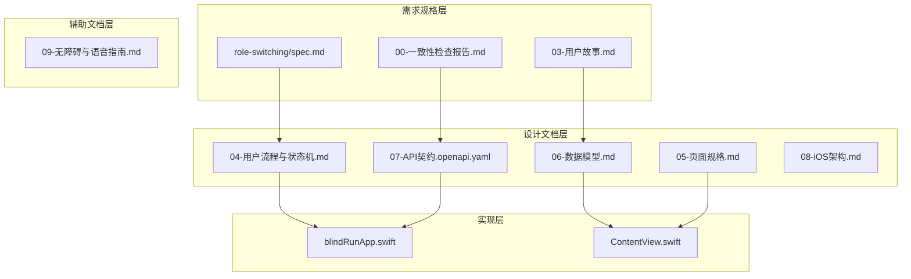

**图表来源**
- [role-switching/spec.md:1-26](file://openspec/changes/add-aidrun-ios-spring-mvp/specs/role-switching/spec.md#L1-L26)
- [04-用户流程与状态机.md:1-70](file://docs/04-user-flows-and-state-machine.md#L1-L70)
- [06-数据模型.md:82-98](file://docs/06-data-model.md#L82-L98)

**章节来源**
- [role-switching/spec.md:1-26](file://openspec/changes/add-aidrun-ios-spring-mvp/specs/role-switching/spec.md#L1-L26)
- [04-用户流程与状态机.md:1-70](file://docs/04-user-flows-and-state-machine.md#L1-L70)
- [06-数据模型.md:82-98](file://docs/06-data-model.md#L82-L98)

## 核心组件

### 用户角色枚举

系统定义了两种核心用户角色：

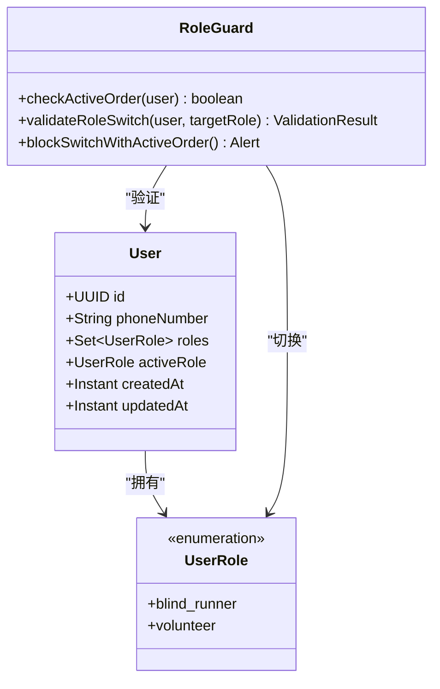

**图表来源**
- [06-数据模型.md:16-22](file://docs/06-data-model.md#L16-L22)
- [06-数据模型.md:82-98](file://docs/06-data-model.md#L82-L98)

### 角色切换流程

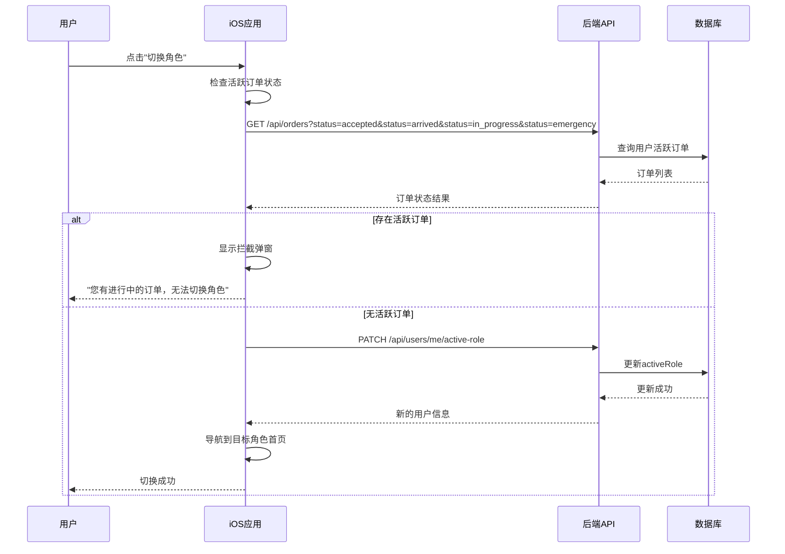

**图表来源**
- [04-用户流程与状态机.md:259-273](file://docs/04-user-flows-and-state-machine.md#L259-L273)
- [07-API契约.openapi.yaml:61-80](file://docs/07-api-contract.openapi.yaml#L61-L80)

**章节来源**
- [06-数据模型.md:82-98](file://docs/06-data-model.md#L82-L98)
- [03-用户故事.md:123-158](file://docs/03-user-stories.md#L123-L158)
- [05-页面规格.md:49-80](file://docs/05-page-specs.md#L49-L80)

## 架构概览

### 双角色系统架构

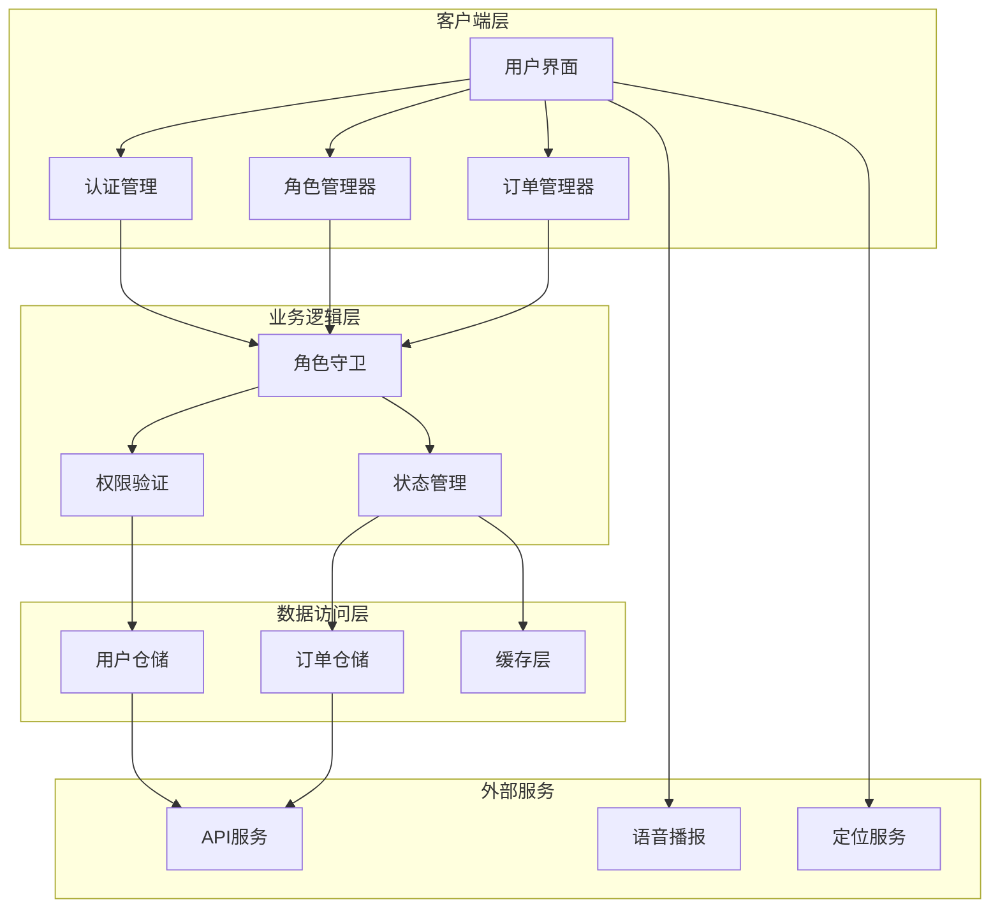

**图表来源**
- [08-iOS架构.md:23](file://docs/08-ios-architecture.md#L23)
- [06-数据模型.md:82-98](file://docs/06-data-model.md#L82-L98)

### 角色切换状态机

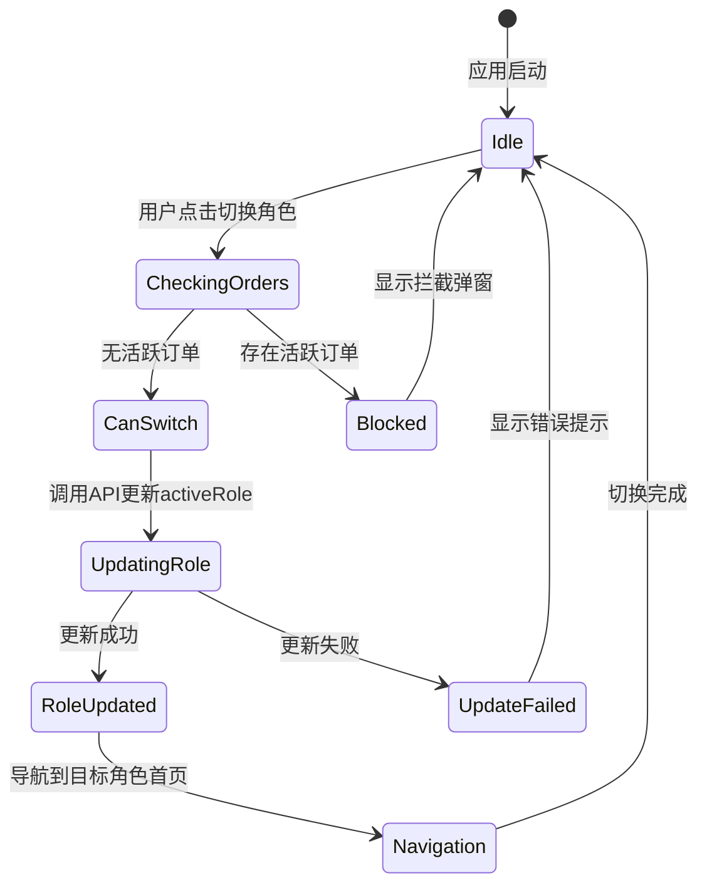

**图表来源**
- [04-用户流程与状态机.md:259-273](file://docs/04-user-flows-and-state-machine.md#L259-L273)
- [07-API契约.openapi.yaml:61-80](file://docs/07-api-contract.openapi.yaml#L61-L80)

## 详细组件分析

### 角色切换业务规则

#### 核心业务规则

系统实现了严格的角色切换业务规则，确保服务的连续性和完整性：

1. **活跃订单拦截规则**
   - `accepted` 状态订单：禁止切换
   - `arrived` 状态订单：禁止切换  
   - `in_progress` 状态订单：禁止切换
   - `emergency` 状态订单：禁止切换

2. **允许切换的条件**
   - 用户必须没有处于上述活跃状态的订单
   - 用户必须有有效的认证状态（JWT）
   - 目标角色必须存在于用户的 `roles` 集合中

3. **切换后的状态管理**
   - 更新 `activeRole` 字段
   - 保持相同的 JWT 令牌
   - 导航到目标角色的首页

#### 权限验证机制

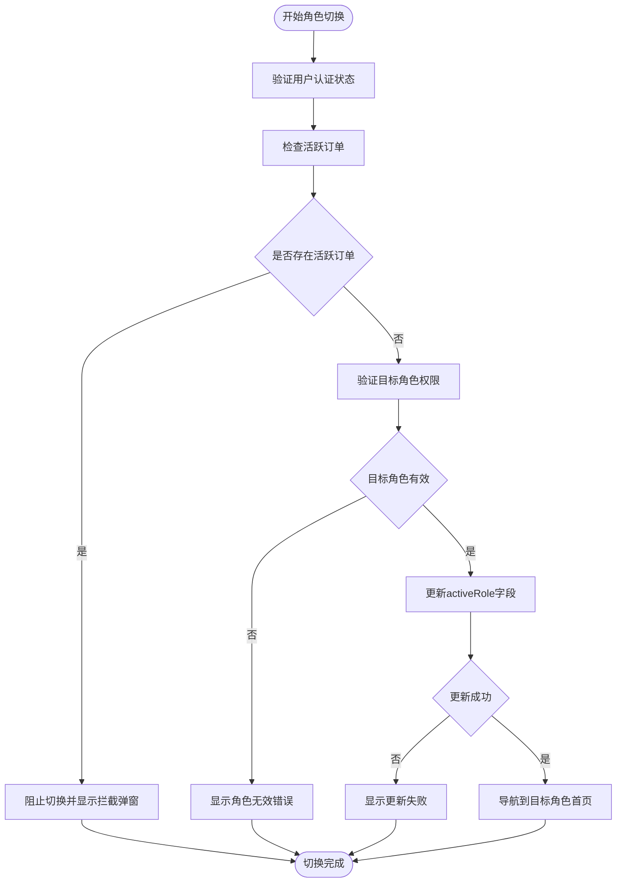

**图表来源**
- [06-数据模型.md:95-98](file://docs/06-data-model.md#L95-L98)
- [03-用户故事.md:139-158](file://docs/03-user-stories.md#L139-L158)

**章节来源**
- [06-数据模型.md:95-98](file://docs/06-data-model.md#L95-L98)
- [03-用户故事.md:139-158](file://docs/03-user-stories.md#L139-L158)

### UI 导航差异

#### 盲人跑者端导航

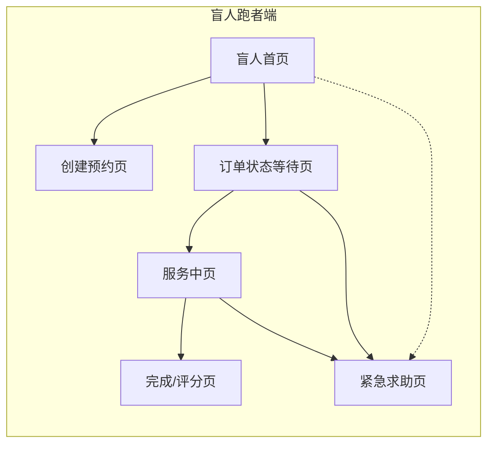

**图表来源**
- [04-用户流程与状态-machine.md:14-53](file://docs/04-user-flows-and-state-machine.md#L14-L53)

#### 志愿者端导航

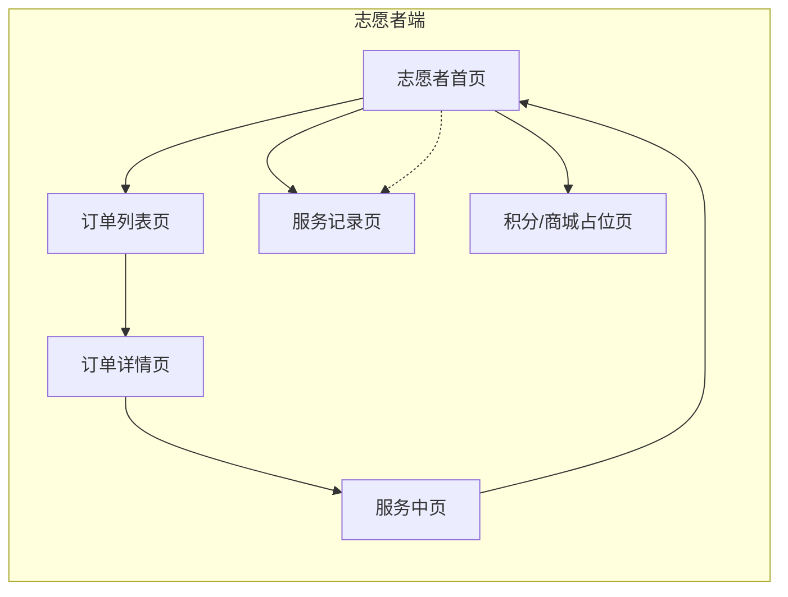

**图表来源**
- [04-用户流程与状态机.md:24-66](file://docs/04-user-flows-and-state-machine.md#L24-L66)

#### 角色切换导航流程

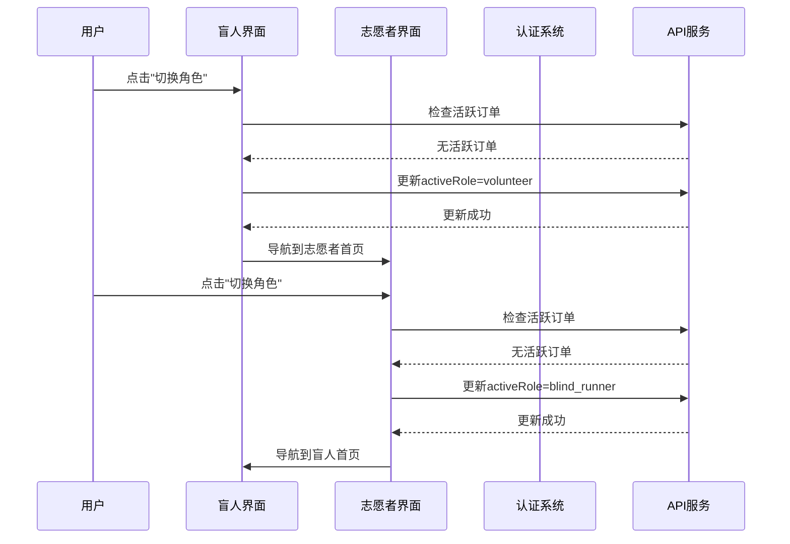

**图表来源**
- [04-用户流程与状态机.md:68-69](file://docs/04-user-flows-and-state-machine.md#L68-L69)
- [05-页面规格.md:66-68](file://docs/05-page-specs.md#L66-L68)

**章节来源**
- [04-用户流程与状态机.md:14-69](file://docs/04-user-flows-and-state-machine.md#L14-L69)
- [05-页面规格.md:66-68](file://docs/05-page-specs.md#L66-L68)

### 错误处理与异常情况

#### 活跃订单拦截错误

当用户尝试在活跃订单状态下切换角色时，系统会返回特定的错误码：

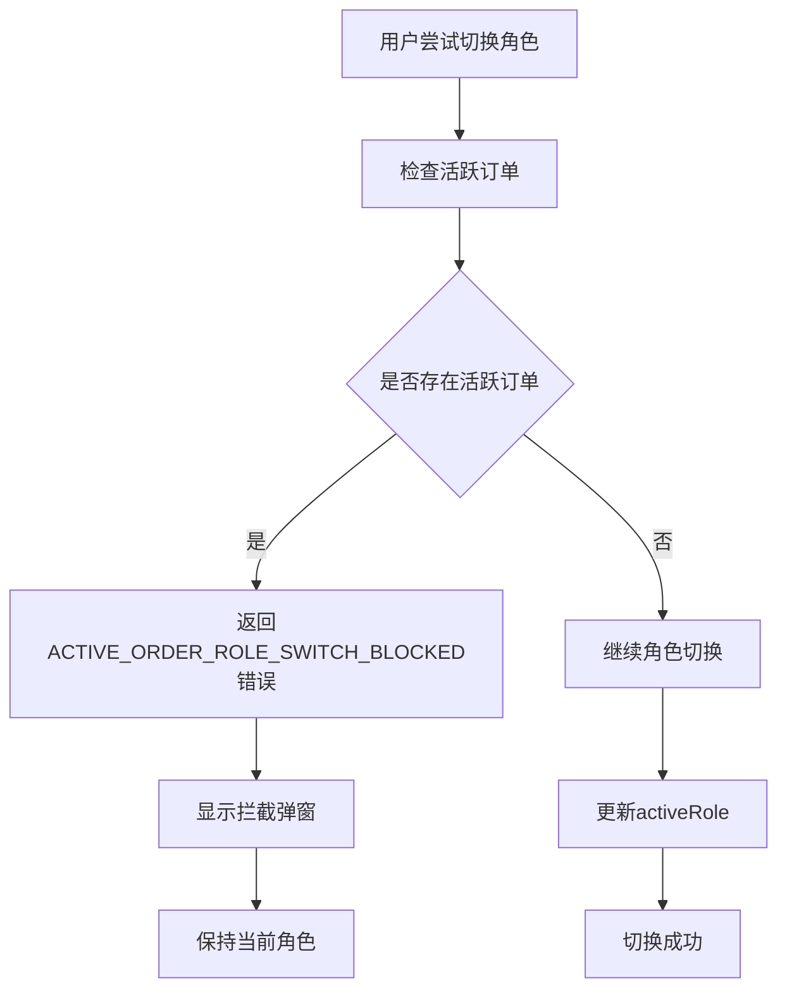

**图表来源**
- [04-用户流程与状态机.md:269-273](file://docs/04-user-flows-and-state-machine.md#L269-L273)
- [07-API契约.openapi.yaml:79-80](file://docs/07-api-contract.openapi.yaml#L79-L80)

#### API 错误处理

系统定义了专门的错误响应格式：

| 错误码 | 描述 | 用途 |
|--------|------|------|
| ACTIVE_ORDER_ROLE_SWITCH_BLOCKED | 活跃订单阻止角色切换 | 当用户有进行中的订单时返回 |
| 401 | 未认证 | JWT 无效或过期 |
| 404 | 用户不存在 | 用户账户被删除或不存在 |
| 500 | 服务器内部错误 | 后端服务异常 |

**章节来源**
- [04-用户流程与状态机.md:269-273](file://docs/04-user-flows-and-state-machine.md#L269-L273)
- [07-API契约.openapi.yaml:79-80](file://docs/07-api-contract.openapi.yaml#L79-L80)

## 依赖关系分析

### 组件间依赖关系

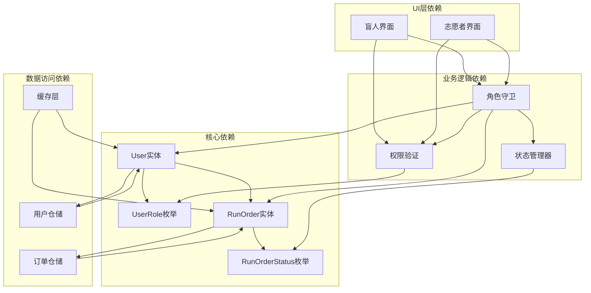

**图表来源**
- [06-数据模型.md:82-98](file://docs/06-data-model.md#L82-L98)
- [06-数据模型.md:16-44](file://docs/06-data-model.md#L16-L44)

### 外部依赖

系统对外部服务的依赖主要包括：

1. **认证服务**：JWT 令牌管理和用户认证
2. **订单服务**：订单状态查询和更新
3. **定位服务**：地理位置信息获取
4. **语音服务**：TTS 语音播报功能

**章节来源**
- [06-数据模型.md:82-98](file://docs/06-data-model.md#L82-L98)
- [09-无障碍与语音指南.md:112-143](file://docs/09-accessibility-and-voice-guidelines.md#L112-L143)

## 性能考虑

### 角色切换性能优化

1. **缓存策略**
   - 缓存用户角色信息到本地存储
   - 避免频繁的网络请求检查活跃订单
   - 实现智能缓存失效机制

2. **异步处理**
   - 角色切换操作采用异步处理
   - 非阻塞的 UI 更新机制
   - 进度指示器提升用户体验

3. **网络优化**
   - 批量请求减少网络往返
   - 连接池管理提高请求效率
   - 错误重试机制增强稳定性

### 内存管理

- 及时释放不再使用的角色数据
- 避免内存泄漏影响应用性能
- 合理的生命周期管理

## 故障排除指南

### 常见问题诊断

#### 角色切换失败

**症状**：用户点击切换角色按钮后无反应或显示错误

**排查步骤**：
1. 检查用户是否有活跃订单
2. 验证 JWT 令牌有效性
3. 确认网络连接状态
4. 查看 API 响应日志

**解决方案**：
- 如果存在活跃订单，提示用户先完成服务
- 如果 JWT 过期，引导用户重新登录
- 如果网络异常，提供重试机制

#### 导航异常

**症状**：切换角色后导航到错误的页面

**排查步骤**：
1. 检查 `activeRole` 字段更新状态
2. 验证目标角色的权限配置
3. 确认路由映射关系

**解决方案**：
- 重新设置 `activeRole` 字段
- 检查角色权限配置
- 修复路由映射错误

**章节来源**
- [04-用户流程与状态机.md:269-273](file://docs/04-user-flows-and-state-machine.md#L269-L273)
- [05-页面规格.md:66-72](file://docs/05-page-specs.md#L66-L72)

### 调试工具和技巧

1. **日志记录**：详细记录角色切换过程中的关键事件
2. **状态监控**：实时监控用户状态变化
3. **错误追踪**：建立完善的错误报告机制
4. **性能监控**：监控角色切换的响应时间和成功率

## 结论

Role 角色模块通过精心设计的双角色系统，为 AidRun 应用提供了灵活而强大的身份管理能力。该模块的核心优势包括：

1. **用户体验优秀**：无缝的角色切换体验，无需重新登录
2. **业务规则严谨**：严格的活跃订单拦截机制，确保服务完整性
3. **技术实现可靠**：基于枚举的类型安全设计，减少运行时错误
4. **扩展性强**：为未来添加新角色提供了清晰的架构基础

该模块的成功实施为整个 AidRun 生态系统奠定了坚实的基础，不仅提升了用户满意度，也为后续的功能扩展提供了良好的技术支撑。

## 附录

### 开发指南

#### 添加新角色的步骤

1. **定义角色枚举**
   ```swift
   enum NewUserRole: String, CaseIterable {
       case blindRunner = "blind_runner"
       case volunteer = "volunteer"
       case newRole = "new_role"
   }
   ```

2. **更新数据模型**
   - 修改 User 实体的 roles 字段
   - 更新 activeRole 的约束条件
   - 添加新角色的权限规则

3. **实现业务逻辑**
   - 更新角色守卫规则
   - 实现新角色的权限验证
   - 添加状态管理逻辑

4. **UI 界面适配**
   - 更新角色选择界面
   - 添加新角色的导航逻辑
   - 实现角色特定的 UI 组件

5. **测试验证**
   - 单元测试新角色功能
   - 集成测试角色切换流程
   - 用户验收测试

#### 最佳实践

1. **代码组织**
   - 按功能模块划分代码文件
   - 使用清晰的命名约定
   - 实现适当的抽象层次

2. **错误处理**
   - 统一的错误处理机制
   - 用户友好的错误提示
   - 完善的日志记录

3. **性能优化**
   - 合理的缓存策略
   - 异步处理机制
   - 资源管理最佳实践