# Safety 安全模块

<cite>
**本文档引用的文件**
- [08-ios-架构文档.md](file://docs/08-ios-architecture.md)
- [09-无障碍与语音指南.md](file://docs/09-accessibility-and-voice-guidelines.md)
- [04-用户流程与状态机.md](file://docs/04-user-flows-and-state-machine.md)
- [01-产品需求文档.md](file://docs/01-product-requirements.md)
- [safety-基础紧急求助需求.md](file://openspec/changes/add-aidrun-ios-spring-mvp/specs/safety-basic-emergency/spec.md)
- [设计决策.md](file://openspec/changes/add-aidrun-ios-spring-mvp/design.md)
- [任务清单.md](file://openspec/changes/add-aidrun-ios-spring-mvp/tasks.md)
- [ContentView.swift](file://blindRun/ContentView.swift)
- [blindRunApp.swift](file://blindRun/blindRunApp.swift)
</cite>

## 目录
1. [简介](#简介)
2. [项目结构](#项目结构)
3. [核心组件](#核心组件)
4. [架构概览](#架构概览)
5. [详细组件分析](#详细组件分析)
6. [依赖关系分析](#依赖关系分析)
7. [性能考虑](#性能考虑)
8. [故障排除指南](#故障排除指南)
9. [结论](#结论)
10. [附录](#附录)

## 简介

Safety 安全模块是 AidRun 助盲跑应用的核心安全防护系统，专为盲人跑者和志愿者提供全面的安全保障。该模块基于紧急求助功能、危险操作保护机制和安全状态管理三大支柱，确保用户在户外跑步协助服务过程中的安全。

本模块的设计遵循"预防为主、确认为辅"的原则，通过多重确认对话框、状态限制和实时安全提醒，最大限度地降低误操作风险。所有危险操作均要求二次确认，包括取消订单、紧急求助、服务完成和退出登录等关键操作。

## 项目结构

根据 AidRun MVP v0.3 架构文档，Safety 安全模块作为独立的功能模块存在于应用的整体架构中：

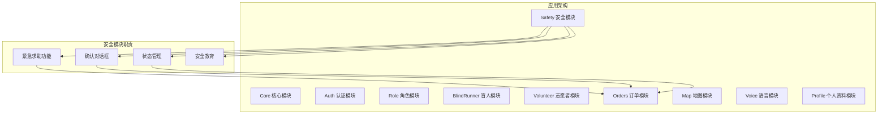

**图表来源**
- [08-ios-架构文档.md:30](file://docs/08-ios-architecture.md#L30)
- [08-ios-架构文档.md:29](file://docs/08-ios-architecture.md#L29)

**章节来源**
- [08-ios-架构文档.md:18-31](file://docs/08-ios-architecture.md#L18-L31)

## 核心组件

### 紧急求助功能

紧急求助功能是安全模块的核心组件，提供一键式紧急求助能力。该功能仅在特定状态下可用，并要求用户进行二次确认。

#### 紧急求助状态限制

紧急求助功能严格限制在以下状态中激活：
- accepted（已接单）
- arrived（已到达）
- in_progress（进行中）

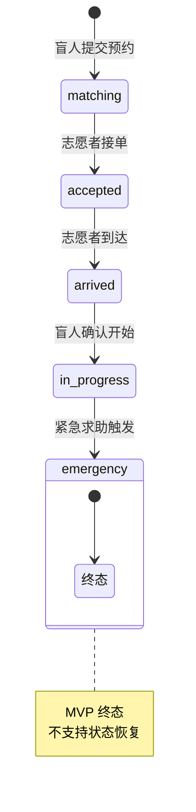

**图表来源**
- [04-用户流程与状态机.md:75-96](file://docs/04-user-flows-and-state-machine.md#L75-L96)

#### 紧急求助确认流程

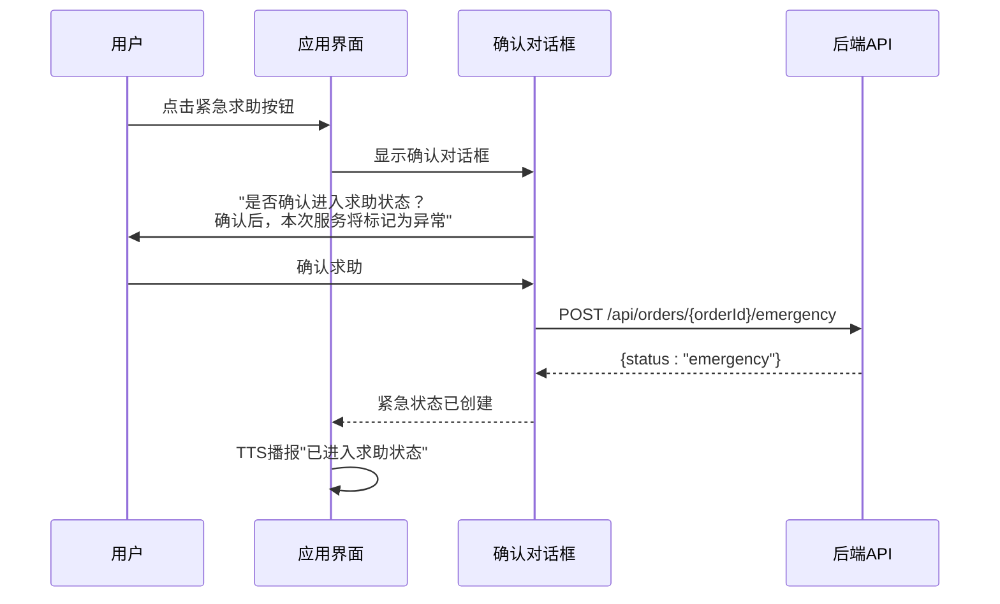

**图表来源**
- [04-用户流程与状态机.md:233-257](file://docs/04-user-flows-and-state-machine.md#L233-L257)

**章节来源**
- [safety-基础紧急求助需求.md:11-26](file://openspec/changes/add-aidrun-ios-spring-mvp/specs/safety-basic-emergency/spec.md#L11-L26)
- [09-无障碍与语音指南.md:97-106](file://docs/09-accessibility-and-voice-guidelines.md#L97-L106)

### 危险操作保护机制

安全模块对所有高风险操作实施双重保护机制，确保用户不会因误触而造成不可逆的后果。

#### 取消订单确认

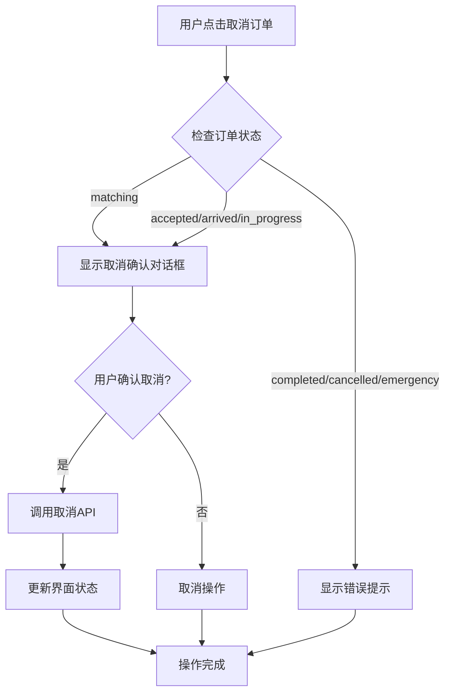

**图表来源**
- [04-用户流程与状态机.md:78-91](file://docs/04-user-flows-and-state-machine.md#L78-L91)

#### 退出登录确认

退出登录功能要求用户进行最终确认，防止意外退出导致的数据丢失。

#### 服务完成确认

志愿者在结束服务前必须确认，确保服务确实已完成。

**章节来源**
- [09-无障碍与语音指南.md:88-96](file://docs/09-accessibility-and-voice-guidelines.md#L88-L96)
- [design.md:26](file://openspec/changes/add-aidrun-ios-spring-mvp/design.md#L26)

### 安全状态管理

安全状态管理负责维护和跟踪所有安全相关事件，包括紧急求助状态、安全提醒和状态恢复。

#### 紧急状态标识

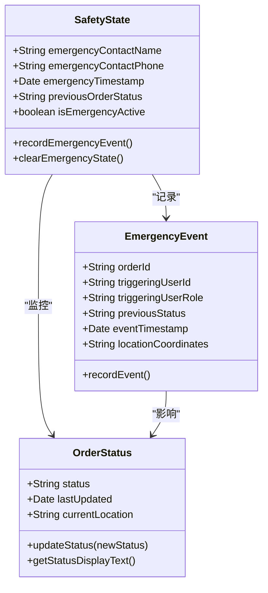

**图表来源**
- [safety-基础紧急求助需求.md:27-41](file://openspec/changes/add-aidrun-ios-spring-mvp/specs/safety-basic-emergency/spec.md#L27-L41)

#### 安全提醒系统

安全提醒系统通过多种方式向用户传达安全状态信息：

- **视觉提醒**：紧急状态下的特殊界面设计
- **语音提醒**：TTS 系统播报紧急状态
- **触觉反馈**：震动提醒用户注意安全

**章节来源**
- [09-无障碍与语音指南.md:13-29](file://docs/09-accessibility-and-voice-guidelines.md#L13-L29)

### 安全用户教育

安全用户教育模块提供全面的安全知识和操作指导，帮助用户理解安全重要性和正确的操作方法。

#### 安全提示内容

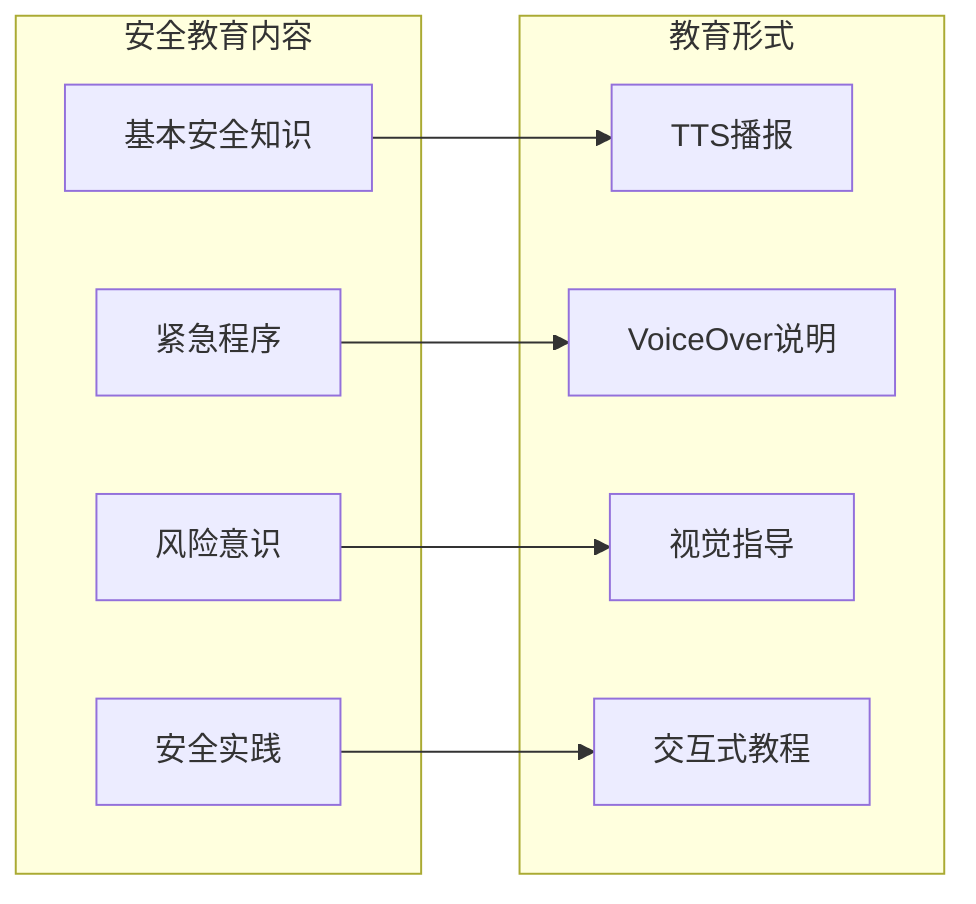

**图表来源**
- [09-无障碍与语音指南.md:108-121](file://docs/09-accessibility-and-voice-guidelines.md#L108-L121)

**章节来源**
- [09-无障碍与语音指南.md:66-70](file://docs/09-accessibility-and-voice-guidelines.md#L66-L70)

## 架构概览

安全模块采用分层架构设计，确保安全功能的独立性和可维护性：

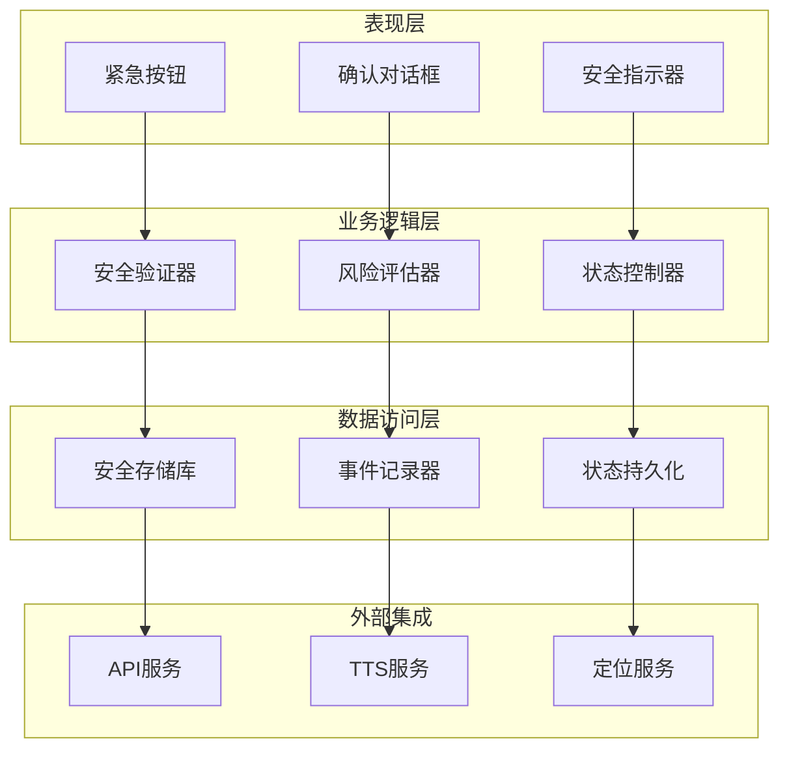

**图表来源**
- [08-ios-架构文档.md:33-49](file://docs/08-ios-architecture.md#L33-L49)

## 详细组件分析

### 紧急按钮设计

#### 按钮特性

紧急按钮设计遵循无障碍优先原则，具有以下特性：

- **高可见性**：使用醒目的颜色和大尺寸设计
- **易触达**：放置在用户容易触及的位置
- **明确标识**：使用简洁明了的图标和文字
- **无障碍支持**：完整的 VoiceOver 支持

#### 按钮状态管理

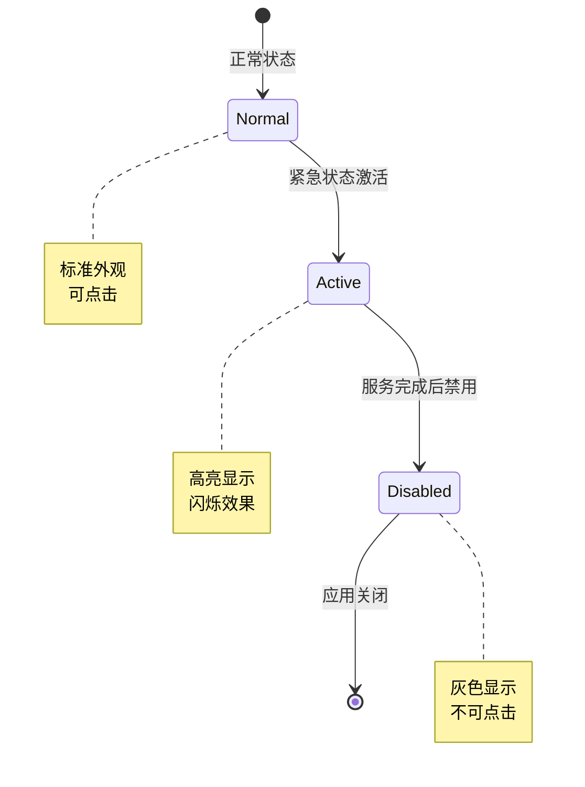

**图表来源**
- [04-用户流程与状态机.md:19](file://docs/04-user-flows-and-state-machine.md#L19)

**章节来源**
- [09-无障碍与语音指南.md:62-70](file://docs/09-accessibility-and-voice-guidelines.md#L62-L70)

### 求助流程

#### 完整求助流程

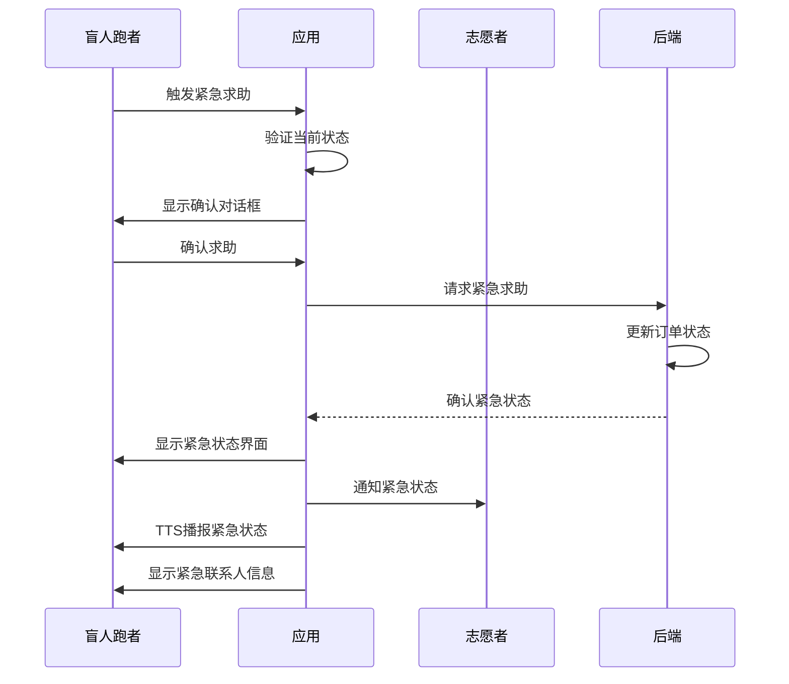

**图表来源**
- [04-用户流程与状态机.md:233-257](file://docs/04-user-flows-and-state-machine.md#L233-L257)

#### 状态转换规则

紧急求助触发后的状态转换遵循严格的规则：

| 触发状态 | 紧急状态 | 说明 |
|---------|---------|------|
| accepted | emergency | 志愿者已接单时触发 |
| arrived | emergency | 志愿者已到达时触发 |
| in_progress | emergency | 服务进行中时触发 |
| matching | 不允许 | 服务开始前不允许紧急求助 |
| completed | 不适用 | 服务已完成，无需紧急求助 |
| cancelled | 不适用 | 订单已取消，无需紧急求助 |

**章节来源**
- [04-用户流程与状态机.md:100-116](file://docs/04-user-flows-and-state-machine.md#L100-L116)

### 安全确认对话框

#### 对话框设计原则

安全确认对话框采用"明确性、简洁性、可操作性"的设计原则：

- **明确性**：清楚说明操作后果
- **简洁性**：使用简短明确的语言
- **可操作性**：提供明确的选择选项

#### 对话框模板

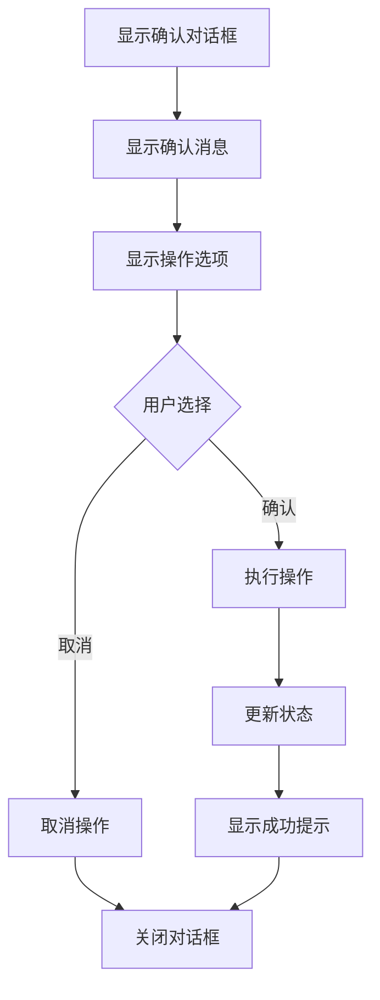

**图表来源**
- [09-无障碍与语音指南.md:97-106](file://docs/09-accessibility-and-voice-guidelines.md#L97-L106)

**章节来源**
- [09-无障碍与语音指南.md:88-106](file://docs/09-accessibility-and-voice-guidelines.md#L88-L106)

### 危险操作保护

#### 操作分类

危险操作分为三个等级：

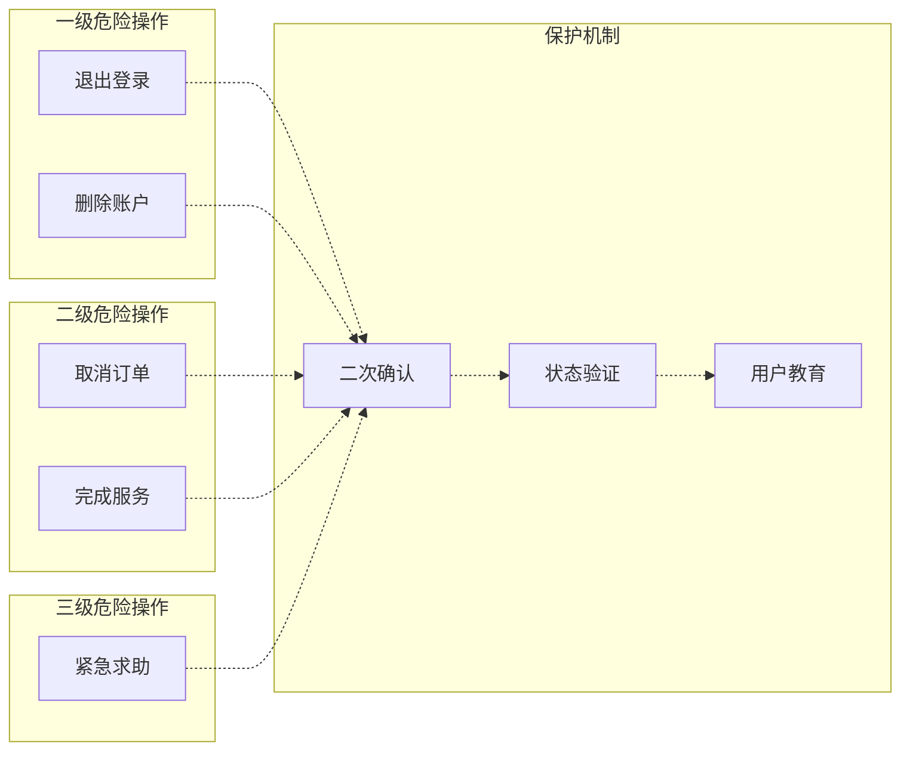

**图表来源**
- [09-无障碍与语音指南.md:90-96](file://docs/09-accessibility-and-voice-guidelines.md#L90-L96)

**章节来源**
- [design.md:26](file://openspec/changes/add-aidrun-ios-spring-mvp/design.md#L26)

## 依赖关系分析

安全模块与其他模块存在密切的依赖关系：

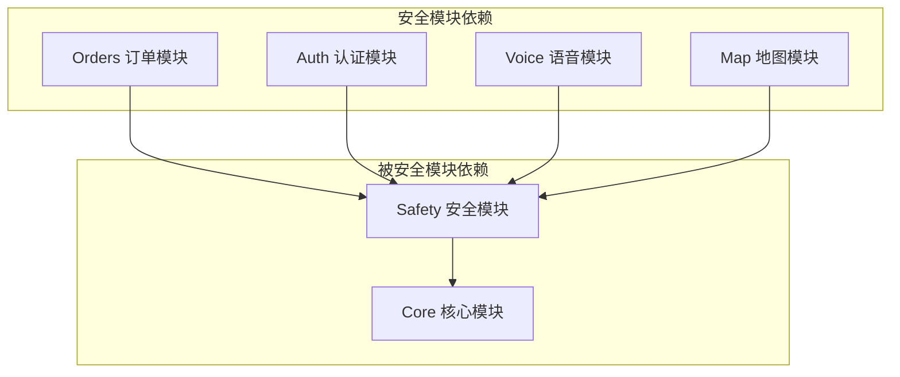

**图表来源**
- [08-ios-架构文档.md:22-31](file://docs/08-ios-architecture.md#L22-L31)

### 外部依赖

安全模块主要依赖以下外部服务：

- **后端 API**：订单状态管理和紧急求助处理
- **TTS 服务**：语音播报和用户指导
- **定位服务**：紧急位置信息获取
- **网络服务**：状态同步和事件通知

**章节来源**
- [08-ios-架构文档.md:68-83](file://docs/08-ios-architecture.md#L68-L83)

## 性能考虑

### 实时性要求

安全模块对实时性有严格要求：

- **紧急求助响应时间**：< 2 秒
- **状态更新延迟**：< 5 秒（基于轮询机制）
- **语音播报延迟**：< 1 秒

### 资源优化

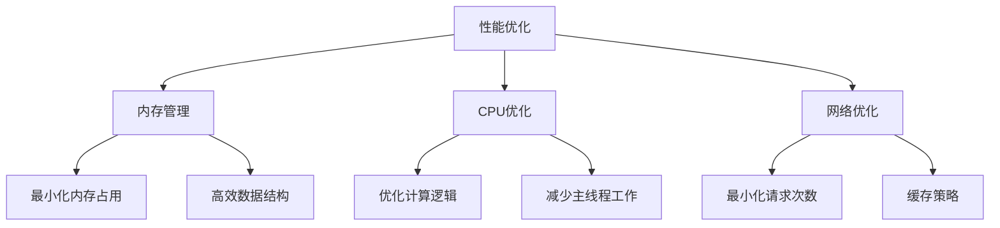

**图表来源**
- [08-ios-架构文档.md:125-139](file://docs/08-ios-architecture.md#L125-L139)

## 故障排除指南

### 常见问题及解决方案

#### 紧急求助无响应

**症状**：点击紧急按钮后无任何反应

**可能原因**：
- 网络连接异常
- 订单状态不符合紧急求助条件
- 应用处于后台状态

**解决步骤**：
1. 检查网络连接状态
2. 确认当前订单状态为 accepted/arrived/in_progress
3. 将应用切换到前台
4. 重新尝试紧急求助

#### 确认对话框不显示

**症状**：触发危险操作后没有出现确认对话框

**可能原因**：
- 无障碍功能异常
- TTS 服务问题
- 应用状态异常

**解决步骤**：
1. 检查无障碍功能设置
2. 重启应用
3. 检查系统 TTS 设置
4. 联系技术支持

#### 状态同步问题

**症状**：紧急求助状态不同步

**可能原因**：
- 轮询机制异常
- 网络延迟
- 后端服务问题

**解决步骤**：
1. 检查网络连接质量
2. 等待轮询周期完成
3. 手动刷新页面
4. 重新登录应用

**章节来源**
- [09-无障碍与语音指南.md:131-143](file://docs/09-accessibility-and-voice-guidelines.md#L131-L143)

## 结论

Safety 安全模块通过多层次的安全防护设计，为 AidRun 应用提供了全面的安全保障。模块设计充分考虑了盲人用户的特殊需求，采用无障碍优先的设计原则，确保所有用户都能安全、有效地使用紧急求助功能。

模块的核心优势包括：

1. **多重确认机制**：所有危险操作都要求二次确认，有效防止误操作
2. **状态限制**：紧急求助功能严格限制在特定状态下可用
3. **实时安全提醒**：通过多种方式向用户传达安全状态信息
4. **无障碍设计**：完全支持 VoiceOver 和 TTS，满足盲人用户的特殊需求
5. **状态持久化**：完整的安全事件记录和状态管理

## 附录

### 开发指南

#### 新安全功能添加流程

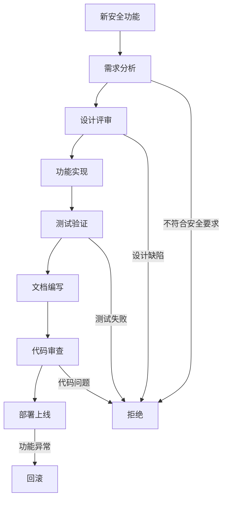

#### 安全最佳实践

1. **最小权限原则**：只授予必要的权限
2. **防御性编程**：假设所有输入都是恶意的
3. **状态验证**：每次操作前验证系统状态
4. **错误处理**：优雅处理各种异常情况
5. **日志记录**：完整记录所有安全相关事件

#### 性能基准

| 功能 | 响应时间 | 内存占用 | CPU 使用率 |
|------|----------|----------|------------|
| 紧急求助 | < 2 秒 | < 50MB | < 30% |
| 确认对话框 | < 1 秒 | < 20MB | < 15% |
| 状态轮询 | 5 秒周期 | < 30MB | < 20% |
| TTS 播报 | < 1 秒 | < 10MB | < 10% |

**章节来源**
- [08-ios-架构文档.md:140-147](file://docs/08-ios-architecture.md#L140-L147)